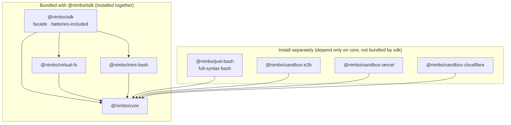

# nimbo

**An embeddable, lightweight agent SDK for Node.js.** In a few lines of code you
can run an agent loop — with file operations, command execution, and skills —
inside your own service, without spawning any external CLI binary. Runtime
dependencies are just `ai` (Vercel AI SDK, a peer dependency) + `zod`.

> 中文版见 [docs/README.zh-CN.md](./docs/README.zh-CN.md)。

## Why it exists

The gap in existing options (full write-up in
[docs/01 product design](./docs/01-product-design.md)):

- **CLI wrappers** (`@openai/codex-sdk`, `@anthropic-ai/claude-agent-sdk`): these
  spawn a platform binary — heavy, tied to one vendor, **no virtual filesystem**
  (the agent can only touch the real disk), and session state lands in a user
  directory, which is awkward for multi-tenant server use.
- **Raw API clients** (`@anthropic-ai/sdk`, `openai`): you only get
  messages/tool-use primitives; the loop, tools, files, and skills are all on you.
- **eve** (excellent API design — nimbo's API layering is modeled on it): but it's
  a **framework** with an HTTP server and durable workflows, not an in-process
  embeddable library, and its file operations run against a real sandbox.

**The core pain:** embedding an agent that "can edit files and run tasks" into an
ordinary Node service means either being locked to a vendor's CLI, or hand-rolling
the whole loop from scratch.

**nimbo's answer** = eve's API ergonomics + codex-sdk's item-level event
granularity + the AI SDK's model layer (30+ providers) + its own VirtualFS core
and loop, delivered as an embeddable library. The key differentiator is the
**virtual filesystem**: all of the agent's file reads/writes land in an
in-memory/overlay layer by default and never touch the real disk — inherently
multi-tenant-safe — and afterward you export a `diff()` or `writeBack()` to disk
only when you choose to.

Typical use cases: an in-app code assistant in a SaaS (edit code, return a diff,
zero temp files), a CI/background pipeline node (structured output back into the
pipeline), a domain-capable agent product (reuse the SKILL.md ecosystem), or a
custom execution environment (inject the host's own sandbox through the
`NimboExec` interface, with zero loop changes).

## Five-line quickstart

```ts
import { defineAgent, createSession, NimboFS } from "@nimbo/sdk";
// or a provider instance: import { anthropic } from "@ai-sdk/anthropic"; model: anthropic("claude-sonnet-5")

const agent = defineAgent({ model: "anthropic/claude-sonnet-5" });   // an AI SDK Gateway string or any LanguageModel instance
const session = createSession(agent, { fs: NimboFS.fromDirectory("./project") });
const result = await session.send("Change every `var` in src/index.ts to `const`");
console.log(result.finalResponse, await session.fs.diff());
```

`./project` is mounted as a zero-copy overlay: reads pass through to disk, writes
land in an in-memory layer — after the snippet above, the real directory is byte-for-byte
unchanged and every change lives in `diff()`. Call `session.fs.writeBack()` to persist.

```sh
pnpm add @nimbo/sdk ai
```

> TODO: the npm bare name `nimbo` publishing decision is still open (docs/03 P7-1
> leftover) — everything uses `@nimbo/sdk` for now; once decided, the imports in
> this README and the examples get swapped over.

## Package structure (pnpm monorepo, one-way deps, 8 packages)



Arrows mean "depends on". `@nimbo/sdk` bundles `core` + `virtual-fs` + `mini-bash`;
`just-bash` and the three sandbox adapters depend only on `core` and are installed
separately. Per-package details are in the table below.

| Package | One-liner | README |
|---|---|---|
| `@nimbo/sdk` | The facade; the only install the five-line quickstart needs | [packages/sdk](./packages/sdk/README.md) |
| `@nimbo/core` | L0 interfaces / L1 definitions / L2 runtime / L3 directory-convention layer / built-in tools | [packages/core](./packages/core/README.md) |
| `@nimbo/virtual-fs` | MemoryFS / OverlayFS / DirFS, diff / writeBack, the 8 file tools | [packages/virtual-fs](./packages/virtual-fs/README.md) |
| `@nimbo/mini-bash` | Read-only command interpreter over any NimboFS (the bash tool's pure in-memory execution env; zero-dep minimal tier, bundled with sdk) | [packages/mini-bash](./packages/mini-bash/README.md) |
| `@nimbo/just-bash` | Full-syntax bash over any NimboFS (`if`/`for`/`while`/`case`/functions; vercel-labs/just-bash adapter, **not bundled by sdk**, install separately) | [packages/just-bash](./packages/just-bash/README.md) |
| `@nimbo/sandbox-e2b` | NimboFS & NimboExec over an E2B cloud sandbox (real Firecracker microVM, BYO instance, e2b as a type-only dep, **not bundled by sdk**) | [packages/sandbox-e2b](./packages/sandbox-e2b/README.md) |
| `@nimbo/sandbox-vercel` | NimboFS & NimboExec over a Vercel Sandbox (real Amazon Linux 2023 Firecracker microVM, BYO instance, `@vercel/sandbox` type-only, **not bundled by sdk**) | [packages/sandbox-vercel](./packages/sandbox-vercel/README.md) |
| `@nimbo/sandbox-cloudflare` | NimboFS & NimboExec over a Cloudflare Sandbox (gateway form: `.` a plain fetch client for any Node, `./worker` a gateway deployed in the host's wrangler project, **not bundled by sdk**) | [packages/sandbox-cloudflare](./packages/sandbox-cloudflare/README.md) |

**bash tiers**: the `bash` tool's execution environment (`NimboExec`) comes in two
tiers, injected on demand and swappable in one line with zero loop/session changes
([docs/02 §4.5b](./docs/02-tech-spec.md)):

- **`@nimbo/mini-bash` (zero-dep minimal tier)**: six read-only commands
  (`cat`/`grep`/`find`/`tail`/`head`/`echo`) + four control operators, bundled with
  `@nimbo/sdk`, no extra install. The safe default and the test/demo vehicle.
- **`@nimbo/just-bash` (full-syntax tier)**: reach for this when Claude-family models
  emit `if`/`for`/`while`/`case`/function control-flow scripts beyond mini-bash's
  surface. Because its dependency tree carries wasm-heavy bits (sql.js,
  quickjs-emscripten), it is **not** a dependency of `@nimbo/sdk` (forcing it on
  every consumer would break the lightweight-facade default) — hosts that need it
  run `pnpm add @nimbo/just-bash` explicitly.

Both are implementations of the `NimboExec` interface, and neither is the only
option: for real local command execution use `@nimbo/core`'s `localExec`, and a
host with its own sandbox (Docker/e2b/remote executor) just implements `NimboExec`
and injects it (see [examples/05-custom-exec.ts](./examples/05-custom-exec.ts)).

## Cloud sandbox adapters

Three adapters put the agent's fs/bash inside a real cloud sandbox while the agent
itself runs on any Node machine — the same "mode-A same-source workspace" shape
(one object implementing `NimboFS & NimboExec`, injected via `workspace`). The
research and design decisions are in
[docs/06 sandbox research](./docs/06-sandbox-workspace-research.md); E2B and Vercel
are verified against real sandboxes, Cloudflare uses a self-hosted gateway.

## Example application: the chat agent webapp

Under [`apps/`](./apps) is a full chat-agent web application built **on** nimbo — a
concrete, product-shaped demonstration of the SDK. A user drives an agent through a
chat UI to modify a real repository inside a Vercel Sandbox, open a PR, and trigger
a Vercel deployment. Highlights: per-session sandbox lifecycle (kept warm while
active, snapshot-hibernated when idle, resumed with the branch code on the next
message), resumable SSE streaming of the loop's every event to the frontend
(survives refresh/HMR), SQLite persistence of the full transcript, streamdown
markdown rendering, and per-turn token stats including cache hits. Design in
[docs/08 chat webapp](./docs/08-chat-agent-webapp.md).

```sh
cp .env.template .env         # fill in the required keys (see the template's comments)
pnpm install
pnpm chat:bootstrap           # db migrate + openapi + api client codegen
pnpm chat:server              # API server
pnpm chat:web                 # web dev server
```

## More

- **Runnable examples**: [examples/](./examples/README.md) — memory diff, directory
  mount, skills, mini-bash, custom exec injection, structured output, streaming
  consumption, full-syntax just-bash, the E2B/Vercel/Cloudflare cloud sandbox
  workspace adapters, and a real-project end-to-end design optimization + Git
  workflow. All twelve scripts run without an API key or cloud credentials (a
  missing env/credential just runs the deterministic section and exits cleanly;
  the last script's real-run section, once fully configured, really modifies the
  target GitHub repo — read the notice in its header / examples/README first).
- **Design docs**: [product design](./docs/01-product-design.md) ·
  [tech spec](./docs/02-tech-spec.md) ·
  [construction plan](./docs/03-construction-plan.md) ·
  [built-in tools](./docs/04-builtin-tools.md) ·
  [verification](./docs/05-verification.md) ·
  [sandbox research](./docs/06-sandbox-workspace-research.md) ·
  [e2e design example](./docs/07-sandbox-e2e-design-example.md) ·
  [chat webapp](./docs/08-chat-agent-webapp.md)
- **Development**: `corepack pnpm install && corepack pnpm build && corepack pnpm
  typecheck && corepack pnpm test` (build first — cross-package type resolution
  points at `dist` under the workspace's circular devDeps). Node ≥ 20 (examples and
  the L3 `tools/*.ts` dynamic loading need ≥ 22.18 for native TS). The root
  build/typecheck/test scripts are scoped to `./packages/*`; the apps have their own
  `chat:*` scripts.
