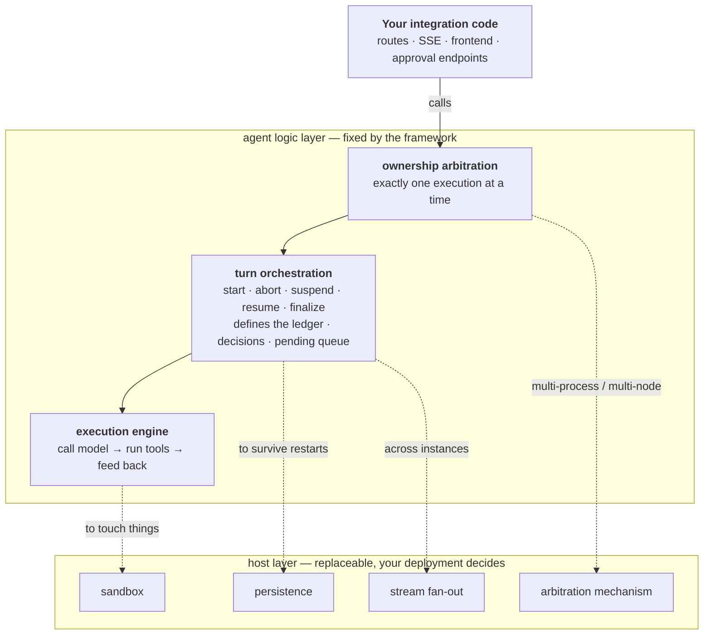
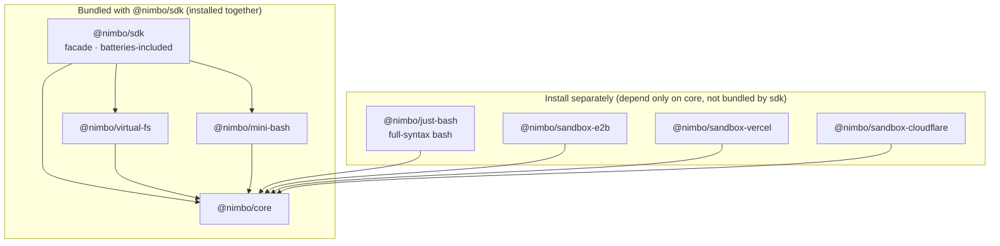

# nimbo

**Build a fully-capable AI agent on whatever infrastructure you already run.**

- **Fully capable** — virtual filesystem, command execution, skills, human-in-the-loop
  approvals, structured output, streaming events, cloud sandboxes. Everything an
  agent needs to actually do work is built in; you don't assemble it yourself.
- **Shiftable** — from "one process on my laptop" to multi-node k8s to Cloudflare
  Durable Objects / Vercel Functions: **what changes is configuration, not your
  business code**.
- **It doesn't take over your service** — nimbo is a framework, but one that embeds
  in your process: no routing, no SSE serialization, no required ORM, and it never
  spawns an external CLI binary. Runtime deps are just `ai` (Vercel AI SDK, a peer
  dependency) + `zod`.

> 中文版见 [docs/README.zh-CN.md](./docs/README.zh-CN.md)。

## What it solves

Building a real agent product out of off-the-shelf parts means hitting two walls
back to back.

**Wall one: how a single execution runs.** The gap in existing options (full
write-up in [core-sdk product design](./docs/core/core-sdk/feature.md)):

- **CLI wrappers** (`@openai/codex-sdk`, `@anthropic-ai/claude-agent-sdk`): these
  spawn a platform binary — heavy, tied to one vendor, **no virtual filesystem**
  (the agent can only touch the real disk), and session state lands in a user
  directory, which is awkward for multi-tenant server use.
- **Raw API clients** (`@anthropic-ai/sdk`, `openai`): you only get
  messages/tool-use primitives; the loop, tools, files, and skills are all on you.
- **eve** (excellent API design — nimbo's API layering is modeled on it): but it's
  a **heavy framework** with an HTTP server and durable workflows, not an in-process
  embeddable library, and its file operations run against a real sandbox.

nimbo's answer to that wall is [`@nimbo/core`](./docs/core/core-sdk/feature.md):
eve's API ergonomics + codex-sdk's item-level event granularity + the AI SDK's
model layer (30+ providers) + its own VirtualFS core and loop. The key
differentiator is the **virtual filesystem**: all of the agent's file reads/writes
land in an in-memory/overlay layer by default and never touch the real disk —
inherently multi-tenant-safe — and afterward you export a `diff()` or
`writeBack()` to disk only when you choose to.

**Wall two, the harder and less-discussed one: what happens after a turn ends.** A
library that only solves "one execution" knows nothing about time, processes, or
storage — so everyone building a product rewrites these four things:

1. **How does the conversation continue** — when does the next turn start? What if
   the user sends another message while the agent is busy?
2. **What about waiting on a human** — the agent raises an approval card and the
   person may come back hours later; meanwhile the machine sits there and can't be
   taken offline.
3. **What about a crash** — the process is gone and that turn spins forever in the UI.
4. **A second process breaks everything** — two nodes running one conversation
   means duelling ledgers and sandboxes stepping on each other's files.

The fourth is genuinely hard to get right, and **getting it wrong is silent data
corruption**. nimbo's answer to that wall is
[`@nimbo/agent`](./docs/agent/agent-kernel/feature.md): it pulls those four into
the framework and turns the "depends on how you deploy" parts into **replaceable
host capabilities** — sandbox, persistence, stream fan-out, ownership arbitration.

Typical use cases: an in-app code assistant in a SaaS (edit code, return a diff,
zero temp files), a CI/background pipeline node (structured output back into the
pipeline), a domain-capable agent product (reuse the SKILL.md ecosystem), an
end-user chat agent app (the one under [apps/](./apps) is exactly that), or a
custom execution environment (inject the host's own sandbox through the
`NimboExec` interface, with zero loop changes).

## Run one turn: five lines inside your service

```ts
import { defineAgent, createSession, NimboFS } from "@nimbo/sdk";
// or a provider instance: import { anthropic } from "@ai-sdk/anthropic"; model: anthropic("claude-sonnet-5")

const agent = defineAgent({ model: "anthropic/claude-sonnet-5" });   // an AI SDK Gateway string or any LanguageModel instance
const session = createSession(agent, { fs: NimboFS.fromDirectory("./project") });
const result = await session.send("Change every `var` in src/index.ts to `const`");
console.log(result.finalResponse, await session.fs.diff());
```

`./project` is mounted as a zero-copy overlay: reads pass through to disk, writes
land in an in-memory layer — after the snippet above, the real directory is byte-for-byte
unchanged and every change lives in `diff()`. Call `session.fs.writeBack()` to persist.

```sh
pnpm add @nimbo/sdk ai
```

> TODO: the npm bare name `nimbo` publishing decision is still open (docs/core/core-sdk/plan.md P7-1
> leftover) — everything uses `@nimbo/sdk` for now; once decided, the imports in
> this README and the examples get swapped over.

## Turn after turn: the agent runtime

> ⚠️ **`@nimbo/agent` is not implemented yet.** The layering and responsibility
> boundaries are settled; the API shapes will move as it lands. Full design in
> [agent kernel](./docs/agent/agent-kernel/feature.md) (usage manual) and its
> [tech design](./docs/agent/agent-kernel/tech.md). These capabilities exist today
> inside the chat app (`apps/node-server`) and are being lifted into the framework
> per that design.

`@nimbo/core` gives you "run one turn". `@nimbo/agent` gives you "**keep running
turn after turn, and switch deployment shape without touching business code**":

```ts
const runtime = createAgentRuntime(agent, {
  // the only required option: where this conversation does its work
  workspace: (conversationId) => {
    const fs = fromDirectory(`./workspaces/${conversationId}`);
    return { fs, exec: localExec({ materialize: true, fs }) };
  },
});

await runtime.enqueue("conv_abc", { text: "Change every var in src to const" });
```

**It runs with zero configuration**: persistence, stream fan-out, and ownership
arbitration all fall back to built-in implementations (in memory, in process,
single-process exclusivity). Swap persistence to keep history; swap arbitration to
go multi-process — **that's the line or two that changes, not your code**.

Your service touches the framework at exactly four points: `enqueue` (a user sent
a message — busy or not, queue or steer, the framework decides), `subscribe` (a
neutral event stream; how you serialize it is yours), `submitDecision` (a human
answered an approval), `reportPresence` (the human is still here, don't suspend yet).

### Layering: semantics on top, implementations underneath



**The dashed edges are conditional** — when the condition doesn't hold, the
built-in trivial implementation is used and you install nothing extra.

### Six deployment tiers; shifting gear is configuration

| Deployment | Host capabilities you replace | Rest stays built-in |
|---|---|---|
| **⓪ local CLI** (`npx @nimbo/cli`) | sandbox → local dir + `localExec` | persistence, stream, arbitration |
| **① single-machine cluster** | + persistence → SQLite, arbitration → lease | stream fan-out |
| **②③ Docker / k8s** | + sandbox → cloud sandbox, persistence → Postgres | stream fan-out (app-level forwarding) |
| **④a Cloudflare Durable Object** | all four → the DO versions (platform-provided, in one shot) | — |
| **④b Vercel Functions** | all four (stream → Redis Streams is unique to this tier) | — |

| From → to | What changes |
|---|---|
| zero-config → ① cluster | add two lines: `persistence` + `arbitration` |
| ① → ②③ | swap the `dialect` string, the `driver` for a `Pool`, `workspace` for a cloud sandbox, add a forwarding hop |
| raw driver → drizzle / prisma | **only the line that constructs persistence** |
| ②③ → ④a DO / ④b Vercel | switch to the platform-tier implementations, **delete the forwarding** |

**Business code (`enqueue` / `subscribe` / `submitDecision`) does not change.** AWS
Lambda is not supported — its 29-second ceiling can't fit a single turn.

## What works today

| | Status |
|---|---|
| `@nimbo/core` · `@nimbo/sdk` · `@nimbo/virtual-fs` · `@nimbo/mini-bash` · `@nimbo/just-bash` | ✅ published and usable |
| `@nimbo/sandbox-e2b` · `@nimbo/sandbox-vercel` · `@nimbo/sandbox-cloudflare` | ✅ published (E2B / Vercel verified against real sandboxes) |
| chat agent webapp (`apps/`, not published) | ✅ runnable: session lifecycle, resumable SSE, approvals, queue & steer, graceful shutdown, telemetry |
| `@nimbo/agent` (turn orchestration + ownership arbitration) | 📐 [design settled](./docs/agent/agent-kernel/feature.md), not implemented — lives inside the chat app for now |
| `@nimbo/persist-sql` / `persist-drizzle` / `persist-prisma` · `@nimbo/stream-redis` · `@nimbo/durable-object` · `@nimbo/cli` | 📐 design settled, not implemented |

## Configuring the agent: model / instructions / tools / skills

All four live on `defineAgent` — the definition is pure data with no runtime
state, so one definition can be reused across many sessions.

**Model.** nimbo's model layer is built entirely on the Vercel AI SDK (`ai`) — no
in-house provider layer, no model registry. Wiring up a model just means producing
an AI SDK `LanguageModel` value, and there are three ways:

```ts
// ① Gateway string: zero provider packages, just set AI_GATEWAY_API_KEY
const agent = defineAgent({ model: "anthropic/claude-sonnet-5" });

// ② Official provider package (30+; installed by the host, e.g. pnpm add @ai-sdk/anthropic)
import { anthropic } from "@ai-sdk/anthropic";
const agent = defineAgent({ model: anthropic("claude-sonnet-5") });

// ③ OpenAI-compatible endpoints: DeepSeek / Qwen / Ollama / vLLM / self-hosted
import { createDeepSeek } from "@ai-sdk/deepseek";
const deepseek = createDeepSeek({ baseURL, apiKey });
const agent = defineAgent({ model: deepseek("deepseek-chat") });
```

`ai` is a peerDependency (`^7`) — the host installs `ai` and its chosen provider
package, so versions follow the host. Everything else (loop, tools, approvals,
sandboxes) is provider-agnostic: swapping models changes this one value and nothing
else (the examples' `NIMBO_MODEL` env var is exactly this mechanism), and AI SDK
middleware (`wrapLanguageModel`, caching, observability) passes straight through.

**Instructions.** The system prompt body goes in `defineAgent({ instructions })`;
for multi-tenant setups, append per-tenant content at session time via
`createSession(agent, { instructions: { append } })` without touching the
definition.

**Tools** come in three tiers:

- **Built-ins** (trim with `builtinTools`, default all-on): the eight file tools
  (`read_file` / `write_file` / `edit_file` / `delete_file` / `move_file` /
  `list_dir` / `glob` / `grep`) plus `update_plan`;
- **Implicitly activated built-ins**: `bash` appears when an exec surface is
  injected, `load_skill` when skills are configured — neither is governed by
  `builtinTools`;
- **Host-defined tools**: `defineTool({ description, inputSchema, approval?,
  execute(input, ctx) })` — `ctx.fs` is the session's file surface, so custom
  tools operate on the injected filesystem/workspace with zero extra wiring.

**Skills** (SKILL.md, compatible with the Claude/eve ecosystems) load from four
sources:

```ts
defineSkill({ name, description, markdown, files? })      // programmatic
Skill.fromMarkdown(name, md)                              // flat markdown
Skill.fromDirectory("./skills/frontend-design")           // packaged dir (SKILL.md + attachments)
await Skill.fromFS(fs, "/.agents/skills/frontend-design") // from any NimboFS — including a sandbox workspace
```

At runtime skills are progressively disclosed: instructions carry only the
name+description list, and the model calls `load_skill` to pull in the body —
loading a skill adds instructions, never a new execution surface.

## Package structure (pnpm monorepo, one-way deps, 8 published packages)

**Packaging rule: interfaces split by module, implementations packaged by "what you
install at once"** — hence persistence and lease-based arbitration ship together
(shared connection and CAS primitives), stream fan-out is standalone, and the
Durable Object tier arrives in one piece.



Arrows mean "depends on". `@nimbo/sdk` bundles `core` + `virtual-fs` + `mini-bash`;
`just-bash` and the three sandbox adapters depend only on `core` and are installed
separately. Per-package details are in the table below.

**Planned packages** (📐 design settled, not implemented — see
[agent kernel tech §8](./docs/agent/agent-kernel/tech.md)): `@nimbo/agent` (turn
orchestration + arbitration semantics + the four host-capability interfaces + a
full set of built-in implementations) · `@nimbo/persist-sql` / `persist-drizzle` /
`persist-prisma` (persistence + lease-based arbitration) · `@nimbo/stream-redis`
(stream fan-out) · `@nimbo/durable-object` (the whole Cloudflare DO tier) ·
`@nimbo/cli` (a finished product built on the framework, not a framework package).

| Package | One-liner | README |
|---|---|---|
| `@nimbo/sdk` | The facade; the only install the five-line quickstart needs | [packages/sdk](./packages/sdk/README.md) |
| `@nimbo/core` | L0 interfaces / L1 definitions / L2 runtime / L3 directory-convention layer / built-in tools | [packages/core](./packages/core/README.md) |
| `@nimbo/virtual-fs` | MemoryFS / OverlayFS / DirFS, diff / writeBack, the 8 file tools | [packages/virtual-fs](./packages/virtual-fs/README.md) |
| `@nimbo/mini-bash` | Read-only command interpreter over any NimboFS (the bash tool's pure in-memory execution env; zero-dep minimal tier, bundled with sdk) | [packages/mini-bash](./packages/mini-bash/README.md) |
| `@nimbo/just-bash` | Full-syntax bash over any NimboFS (`if`/`for`/`while`/`case`/functions; vercel-labs/just-bash adapter, **not bundled by sdk**, install separately) | [packages/just-bash](./packages/just-bash/README.md) |
| `@nimbo/sandbox-e2b` | NimboFS & NimboExec over an E2B cloud sandbox (real Firecracker microVM, BYO instance, e2b as a type-only dep, **not bundled by sdk**) | [packages/sandbox-e2b](./packages/sandbox-e2b/README.md) |
| `@nimbo/sandbox-vercel` | NimboFS & NimboExec over a Vercel Sandbox (real Amazon Linux 2023 Firecracker microVM, BYO instance, `@vercel/sandbox` type-only, **not bundled by sdk**) | [packages/sandbox-vercel](./packages/sandbox-vercel/README.md) |
| `@nimbo/sandbox-cloudflare` | NimboFS & NimboExec over a Cloudflare Sandbox (gateway form: `.` a plain fetch client for any Node, `./worker` a gateway deployed in the host's wrangler project, **not bundled by sdk**) | [packages/sandbox-cloudflare](./packages/sandbox-cloudflare/README.md) |

**bash tiers**: the `bash` tool's execution environment (`NimboExec`) comes in two
tiers, injected on demand and swappable in one line with zero loop/session changes
([tech/core-sdk §4.5b](./docs/core/core-sdk/tech.md)):

- **`@nimbo/mini-bash` (zero-dep minimal tier)**: six read-only commands
  (`cat`/`grep`/`find`/`tail`/`head`/`echo`) + four control operators, bundled with
  `@nimbo/sdk`, no extra install. The safe default and the test/demo vehicle.
- **`@nimbo/just-bash` (full-syntax tier)**: reach for this when Claude-family models
  emit `if`/`for`/`while`/`case`/function control-flow scripts beyond mini-bash's
  surface. Because its dependency tree carries wasm-heavy bits (sql.js,
  quickjs-emscripten), it is **not** a dependency of `@nimbo/sdk` (forcing it on
  every consumer would break the lightweight-facade default) — hosts that need it
  run `pnpm add @nimbo/just-bash` explicitly.

Both are implementations of the `NimboExec` interface, and neither is the only
option: for real local command execution use `@nimbo/core`'s `localExec`, and a
host with its own sandbox (Docker/e2b/remote executor) just implements `NimboExec`
and injects it (see [examples/05-custom-exec.ts](./examples/src/05-custom-exec.ts)).

## Cloud sandbox adapters

Three adapters put the agent's fs/bash inside a real cloud sandbox while the agent
itself runs on any Node machine — the same "mode-A same-source workspace" shape
(one object implementing `NimboFS & NimboExec`, injected via `workspace`). The
research and design decisions are in
[sandbox feature](./docs/host/sandbox/feature.md) / [tech](./docs/host/sandbox/tech.md) /
[plan](./docs/host/sandbox/plan.md); E2B and Vercel are verified against real sandboxes,
Cloudflare uses a self-hosted gateway.

## Example application: the chat agent webapp

Under [`apps/`](./apps) is a full chat-agent web application built **on** nimbo — a
concrete, product-shaped demonstration, and **also where `@nimbo/agent`'s four
concerns live today** (continuing a conversation, waiting on a human, crash
recovery — all proven here first, then lifted into the framework per the
[agent kernel](./docs/agent/agent-kernel/feature.md) design). A user drives an
agent through a chat UI to modify a real repository inside a Vercel Sandbox, open a
PR, and trigger a Vercel deployment. Highlights: per-session sandbox lifecycle (kept
warm while active, snapshot-hibernated when idle, resumed with the branch code on
the next message), resumable SSE streaming of the loop's every event to the frontend
(survives refresh/HMR), SQLite persistence of the full transcript, queue & steer,
stop-this-turn, graceful shutdown and crash recovery, streamdown markdown
rendering, and per-turn token stats including cache hits. Design in
[chat webapp feature](./docs/app/chat-webapp/feature.md) /
[tech](./docs/app/chat-webapp/tech.md) / [plan](./docs/app/chat-webapp/plan.md).

```sh
cp .env.template .env         # fill in the required keys (see the template's comments)
pnpm install
pnpm chat:bootstrap           # db migrate + openapi + api client codegen
pnpm chat:server              # API server
pnpm chat:web                 # web dev server
```

## More

- **Runnable examples**: [examples/](./examples/README.md) — memory diff, directory
  mount, skills, mini-bash, custom exec injection, structured output, streaming
  consumption, full-syntax just-bash, the E2B/Vercel/Cloudflare cloud sandbox
  workspace adapters, and a real-project end-to-end design optimization + Git
  workflow. All twelve scripts run without an API key or cloud credentials (a
  missing env/credential just runs the deterministic section and exits cleanly;
  the last script's real-run section, once fully configured, really modifies the
  target GitHub repo — read the notice in its header / examples/README first).
- **Design docs**: organized by the architectural layers defined in
  [agent-kernel](./docs/agent/agent-kernel/feature.md) — one directory per layer,
  one sub-directory per feature, each holding up to three views:
  `feature.md` (product / usage) · `tech.md` (design) · `plan.md` (construction).
  - [`docs/core/`](./docs/core/README.md) — the execution engine: `@nimbo/core`
    and what ships with it (core-sdk · builtin-tools · verification)
  - [`docs/agent/`](./docs/agent/README.md) — agent logic layer: turn
    orchestration + ownership arbitration, i.e. the planned `@nimbo/agent`
    (agent-kernel · single-ledger · steer-and-queue · turn-abort ·
    graceful-shutdown · turn-checkpoint · compaction · in-flight-draft)
  - [`docs/host/`](./docs/host/README.md) — host layer, the replaceable
    resources: sandbox · persistence · stream fan-out · arbitration mechanism
    (sandbox · sandbox-provider · sandbox-keepalive · native-search)
  - [`docs/app/`](./docs/app/README.md) — integration layer and finished apps:
    the chat webapp, the Cloudflare Worker server, the examples
  - In reading order: [core-sdk](./docs/core/core-sdk/feature.md) →
    [builtin-tools](./docs/core/builtin-tools/feature.md) →
    [sandbox](./docs/host/sandbox/feature.md) →
    [chat-webapp](./docs/app/chat-webapp/feature.md) →
    [agent-kernel](./docs/agent/agent-kernel/feature.md)
  - **Glossary**: [terms.md](./docs/terms.md)
- **Development**: `corepack pnpm install && corepack pnpm build && corepack pnpm
  typecheck && corepack pnpm test` (build first — cross-package type resolution
  points at `dist` under the workspace's circular devDeps). Node ≥ 20 (examples and
  the L3 `tools/*.ts` dynamic loading need ≥ 22.18 for native TS). The root
  build/typecheck/test scripts are scoped to `./packages/*`; the apps have their own
  `chat:*` scripts.
