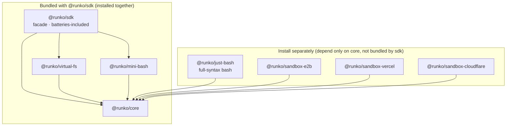

# runko

**An embeddable, lightweight agent SDK for Node.js.** In a few lines of code you
can run an agent loop — with file operations, command execution, and skills —
inside your own service, without spawning any external CLI binary. Runtime
dependencies are just `ai` (Vercel AI SDK, a peer dependency) + `zod`.

> 中文版见 [docs/overview.md](./docs/overview.md)。

## Why it exists

The gap in existing options (full write-up in
[core-sdk product design](./docs/logic/engine/features/core-sdk.md)):

- **CLI wrappers** (`@openai/codex-sdk`, `@anthropic-ai/claude-agent-sdk`): these
  spawn a platform binary — heavy, tied to one vendor, **no virtual filesystem**
  (the agent can only touch the real disk), and session state lands in a user
  directory, which is awkward for multi-tenant server use.
- **Raw API clients** (`@anthropic-ai/sdk`, `openai`): you only get
  messages/tool-use primitives; the loop, tools, files, and skills are all on you.
- **eve** (excellent API design — runko's API layering is modeled on it): but it's
  a **framework** with an HTTP server and durable workflows, not an in-process
  embeddable library, and its file operations run against a real sandbox.

**The core pain:** embedding an agent that "can edit files and run tasks" into an
ordinary Node service means either being locked to a vendor's CLI, or hand-rolling
the whole loop from scratch.

**runko's answer** = eve's API ergonomics + codex-sdk's item-level event
granularity + the AI SDK's model layer (30+ providers) + its own VirtualFS core
and loop, delivered as an embeddable library. The key differentiator is the
**virtual filesystem**: all of the agent's file reads/writes land in an
in-memory/overlay layer by default and never touch the real disk — inherently
multi-tenant-safe — and afterward you export a `diff()` or `writeBack()` to disk
only when you choose to.

Typical use cases: an in-app code assistant in a SaaS (edit code, return a diff,
zero temp files), a CI/background pipeline node (structured output back into the
pipeline), a domain-capable agent product (reuse the SKILL.md ecosystem), or a
custom execution environment (inject the host's own sandbox through the
`RunkoExec` interface, with zero loop changes).

## Five-line quickstart

```ts
import { defineAgent, createSession, RunkoFS } from "@runko/sdk";
// or a provider instance: import { anthropic } from "@ai-sdk/anthropic"; model: anthropic("claude-sonnet-5")

const agent = defineAgent({ model: "anthropic/claude-sonnet-5" });   // an AI SDK Gateway string or any LanguageModel instance
const session = createSession(agent, { fs: RunkoFS.fromDirectory("./project") });
const result = await session.send("Change every `var` in src/index.ts to `const`");
console.log(result.finalResponse, await session.fs.diff());
```

`./project` is mounted as a zero-copy overlay: reads pass through to disk, writes
land in an in-memory layer — after the snippet above, the real directory is byte-for-byte
unchanged and every change lives in `diff()`. Call `session.fs.writeBack()` to persist.

```sh
pnpm add @runko/sdk ai
```

> TODO: the npm bare name `runko` publishing decision is still open (docs/logic/engine/plans/core-sdk.md P7-1
> leftover) — everything uses `@runko/sdk` for now; once decided, the imports in
> this README and the examples get swapped over.

## Configuring the agent: model / instructions / tools / skills

All four live on `defineAgent` — the definition is pure data with no runtime
state, so one definition can be reused across many sessions.

**Model.** runko's model layer is built entirely on the Vercel AI SDK (`ai`) — no
in-house provider layer, no model registry. Wiring up a model just means producing
an AI SDK `LanguageModel` value, and there are three ways:

```ts
// ① Gateway string: zero provider packages, just set AI_GATEWAY_API_KEY
const agent = defineAgent({ model: "anthropic/claude-sonnet-5" });

// ② Official provider package (30+; installed by the host, e.g. pnpm add @ai-sdk/anthropic)
import { anthropic } from "@ai-sdk/anthropic";
const agent = defineAgent({ model: anthropic("claude-sonnet-5") });

// ③ OpenAI-compatible endpoints: DeepSeek / Qwen / Ollama / vLLM / self-hosted
import { createDeepSeek } from "@ai-sdk/deepseek";
const deepseek = createDeepSeek({ baseURL, apiKey });
const agent = defineAgent({ model: deepseek("deepseek-chat") });
```

`ai` is a peerDependency (`^7`) — the host installs `ai` and its chosen provider
package, so versions follow the host. Everything else (loop, tools, approvals,
sandboxes) is provider-agnostic: swapping models changes this one value and nothing
else (the examples' `RUNKO_MODEL` env var is exactly this mechanism), and AI SDK
middleware (`wrapLanguageModel`, caching, observability) passes straight through.

**Instructions.** The system prompt body goes in `defineAgent({ instructions })`;
for multi-tenant setups, append per-tenant content at session time via
`createSession(agent, { instructions: { append } })` without touching the
definition.

**Tools** come in three tiers:

- **Built-ins** (trim with `builtinTools`, default all-on): the eight file tools
  (`read_file` / `write_file` / `edit_file` / `delete_file` / `move_file` /
  `list_dir` / `glob` / `grep`) plus `update_plan`;
- **Implicitly activated built-ins**: `bash` appears when an exec surface is
  injected, `load_skill` when skills are configured — neither is governed by
  `builtinTools`;
- **Host-defined tools**: `defineTool({ description, inputSchema, approval?,
  execute(input, ctx) })` — `ctx.fs` is the session's file surface, so custom
  tools operate on the injected filesystem/workspace with zero extra wiring.

**Skills** (SKILL.md, compatible with the Claude/eve ecosystems) load from four
sources:

```ts
defineSkill({ name, description, markdown, files? })      // programmatic
Skill.fromMarkdown(name, md)                              // flat markdown
Skill.fromDirectory("./skills/frontend-design")           // packaged dir (SKILL.md + attachments)
await Skill.fromFS(fs, "/.agents/skills/frontend-design") // from any RunkoFS — including a sandbox workspace
```

At runtime skills are progressively disclosed: instructions carry only the
name+description list, and the model calls `load_skill` to pull in the body —
loading a skill adds instructions, never a new execution surface.

## Package structure (pnpm monorepo, one-way deps, 8 packages)



Arrows mean "depends on". `@runko/sdk` bundles `core` + `virtual-fs` + `mini-bash`;
`just-bash` and the three sandbox adapters depend only on `core` and are installed
separately. Per-package details are in the table below.

| Package | One-liner | README |
|---|---|---|
| `@runko/sdk` | The facade; the only install the five-line quickstart needs | [packages/sdk](./packages/sdk/README.md) |
| `@runko/core` | L0 interfaces / L1 definitions / L2 runtime / L3 directory-convention layer / built-in tools | [packages/core](./packages/core/README.md) |
| `@runko/virtual-fs` | MemoryFS / OverlayFS / DirFS, diff / writeBack, the 8 file tools | [packages/virtual-fs](./packages/virtual-fs/README.md) |
| `@runko/mini-bash` | Read-only command interpreter over any RunkoFS (the bash tool's pure in-memory execution env; zero-dep minimal tier, bundled with sdk) | [packages/mini-bash](./packages/mini-bash/README.md) |
| `@runko/just-bash` | Full-syntax bash over any RunkoFS (`if`/`for`/`while`/`case`/functions; vercel-labs/just-bash adapter, **not bundled by sdk**, install separately) | [packages/just-bash](./packages/just-bash/README.md) |
| `@runko/sandbox-e2b` | RunkoFS & RunkoExec over an E2B cloud sandbox (real Firecracker microVM, BYO instance, e2b as a type-only dep, **not bundled by sdk**) | [packages/sandbox-e2b](./packages/sandbox-e2b/README.md) |
| `@runko/sandbox-vercel` | RunkoFS & RunkoExec over a Vercel Sandbox (real Amazon Linux 2023 Firecracker microVM, BYO instance, `@vercel/sandbox` type-only, **not bundled by sdk**) | [packages/sandbox-vercel](./packages/sandbox-vercel/README.md) |
| `@runko/sandbox-cloudflare` | RunkoFS & RunkoExec over a Cloudflare Sandbox (gateway form: `.` a plain fetch client for any Node, `./worker` a gateway deployed in the host's wrangler project, **not bundled by sdk**) | [packages/sandbox-cloudflare](./packages/sandbox-cloudflare/README.md) |

**bash tiers**: the `bash` tool's execution environment (`RunkoExec`) comes in two
tiers, injected on demand and swappable in one line with zero loop/session changes
([tech/core-sdk §4.5b](./docs/logic/engine/tech/core-sdk.md)):

- **`@runko/mini-bash` (zero-dep minimal tier)**: six read-only commands
  (`cat`/`grep`/`find`/`tail`/`head`/`echo`) + four control operators, bundled with
  `@runko/sdk`, no extra install. The safe default and the test/demo vehicle.
- **`@runko/just-bash` (full-syntax tier)**: reach for this when Claude-family models
  emit `if`/`for`/`while`/`case`/function control-flow scripts beyond mini-bash's
  surface. Because its dependency tree carries wasm-heavy bits (sql.js,
  quickjs-emscripten), it is **not** a dependency of `@runko/sdk` (forcing it on
  every consumer would break the lightweight-facade default) — hosts that need it
  run `pnpm add @runko/just-bash` explicitly.

Both are implementations of the `RunkoExec` interface, and neither is the only
option: for real local command execution use `@runko/core`'s `localExec`, and a
host with its own sandbox (Docker/e2b/remote executor) just implements `RunkoExec`
and injects it (see [examples/05-custom-exec.ts](./examples/src/05-custom-exec.ts)).

## Cloud sandbox adapters

Three adapters put the agent's fs/bash inside a real cloud sandbox while the agent
itself runs on any Node machine — the same "mode-A same-source workspace" shape
(one object implementing `RunkoFS & RunkoExec`, injected via `workspace`). The
research and design decisions are in
[sandbox feature](./docs/host/contract/features/sandbox.md) / [tech](./docs/host/contract/tech/sandbox.md) /
[plan](./docs/host/contract/plans/sandbox.md); E2B and Vercel are verified against real sandboxes,
Cloudflare uses a self-hosted gateway.

## Example application: the chat agent webapp

Under [`apps/`](./apps) is a full chat-agent web application built **on** runko — a
concrete, product-shaped demonstration of the SDK. A user drives an agent through a
chat UI to modify a real repository inside a Vercel Sandbox, open a PR, and trigger
a Vercel deployment. Highlights: per-session sandbox lifecycle (kept warm while
active, snapshot-hibernated when idle, resumed with the branch code on the next
message), resumable SSE streaming of the loop's every event to the frontend
(survives refresh/HMR), SQLite persistence of the full transcript, streamdown
markdown rendering, and per-turn token stats including cache hits. Design in
[chat webapp feature](./docs/ingress/features/chat-webapp.md) /
[tech](./docs/ingress/tech/chat-webapp.md) / [plan](./docs/ingress/plans/chat-webapp.md).

```sh
cp .env.template .env         # fill in the required keys (see the template's comments)
pnpm install
pnpm chat:bootstrap           # db migrate + openapi + api client codegen
pnpm chat:server              # API server
pnpm chat:web                 # web dev server
```

## More

- **Runnable examples**: [examples/](./examples/README.md) — memory diff, directory
  mount, skills, mini-bash, custom exec injection, structured output, streaming
  consumption, full-syntax just-bash, the E2B/Vercel/Cloudflare cloud sandbox
  workspace adapters, and a real-project end-to-end design optimization + Git
  workflow. All twelve scripts run without an API key or cloud credentials (a
  missing env/credential just runs the deterministic section and exits cleanly;
  the last script's real-run section, once fully configured, really modifies the
  target GitHub repo — read the notice in its header / examples/README first).
- **Design docs**: each feature is split into three views — feature (product /
  usage), tech (design), plan (construction) — under `docs/features/` ·
  `docs/tech/` · `docs/plans/`. In reading order:
  1. **core-sdk** — [feature](./docs/logic/engine/features/core-sdk.md) ·
     [tech](./docs/logic/engine/tech/core-sdk.md) · [plan](./docs/logic/engine/plans/core-sdk.md)
  2. **builtin-tools** — [feature](./docs/logic/engine/features/builtin-tools.md) ·
     [tech](./docs/logic/engine/tech/builtin-tools.md)
  3. **sandbox** — [feature](./docs/host/contract/features/sandbox.md) ·
     [tech](./docs/host/contract/tech/sandbox.md) · [plan](./docs/host/contract/plans/sandbox.md)
  4. **chat-webapp** — [feature](./docs/ingress/features/chat-webapp.md) ·
     [tech](./docs/ingress/tech/chat-webapp.md) · [plan](./docs/ingress/plans/chat-webapp.md)
  5. **turn-checkpoint** — [feature](./docs/logic/orchestration/features/turn-checkpoint.md) ·
     [tech](./docs/logic/orchestration/tech/turn-checkpoint.md) · [plan](./docs/logic/orchestration/plans/turn-checkpoint.md)
  6. **single-ledger** — [feature](./docs/logic/orchestration/features/single-ledger.md) ·
     [tech](./docs/logic/orchestration/tech/single-ledger.md) · [plan](./docs/logic/orchestration/plans/single-ledger.md)
  7. **compaction** — [feature](./docs/logic/engine/features/compaction.md) ·
     [tech](./docs/logic/engine/tech/compaction.md) · [plan](./docs/logic/engine/plans/compaction.md)
  8. **verification** — [plan](./docs/misc/plans/verification.md) (plan view only)
  - **Glossary**: [terms.md](./docs/terms.md)
- **Development**: `corepack pnpm install && corepack pnpm build && corepack pnpm
  typecheck && corepack pnpm test` (build first — cross-package type resolution
  points at `dist` under the workspace's circular devDeps). Node ≥ 20 (examples and
  the L3 `tools/*.ts` dynamic loading need ≥ 22.18 for native TS). The root
  build/typecheck/test scripts are scoped to `./packages/*`; the apps have their own
  `chat:*` scripts.
