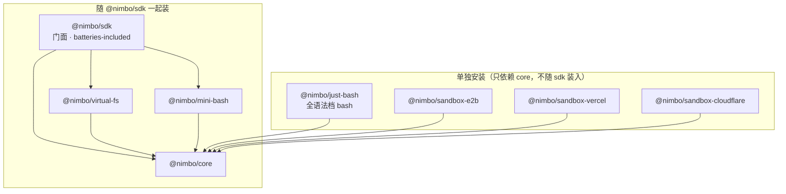

# nimbo（中文）

> 英文版（根目录）见 [../README.md](../README.md)。

**可嵌入 Node.js 应用的轻量 agent SDK**：几行代码在自己的服务里跑起一个具备文件操作、命令执行、skills 能力的 agent loop——不 spawn 任何外部 CLI 二进制，运行时依赖只有 `ai`（Vercel AI SDK，peer）+ `zod`。

## 为什么需要它

现有方案的空缺（详见 [core-sdk 产品设计](./features/core-sdk.md)）：

- **CLI 封装类**（`@openai/codex-sdk`、`@anthropic-ai/claude-agent-sdk`）：本质是 spawn 平台二进制的进程包装——重、绑定单一厂商、**没有虚拟文件抽象**（agent 只能操作真实磁盘）、会话状态落在用户目录，服务端多租户场景难用。
- **纯 API client**（`@anthropic-ai/sdk`、`openai`）：只给 messages/tool-use 原语，loop、工具、文件、skills 全要自己搭。
- **eve**（API 设计优秀，nimbo 的 API 层次即参考它）：但它是带 HTTP server 与 durable workflow 的**框架**，不是可嵌入进程内的库；文件操作在真实沙盒。

**核心痛点**：想在普通 Node 服务里嵌入"能改文件、能执行任务"的 agent，要么被绑死在某家 CLI 上，要么从零手写 loop。

**nimbo 的答案** = eve 的 API 人体工学 + codex-sdk 的 item 级事件粒度 + AI SDK 的模型层（30+ provider 任选）+ 自有的 VirtualFS 内核与 loop，以可嵌入库的形态交付。关键差异化：**虚拟文件系统**——agent 的所有文件读写默认落在内存/overlay 层，全程不碰真实磁盘，天然多租户安全；结束后 `diff()` 导出、`writeBack()` 才落盘。

典型场景：SaaS 内嵌代码助手（改代码返回 diff，零临时文件）、CI/后台流水线节点（结构化输出接回流水线）、带领域能力的 agent 产品（SKILL.md 生态复用）、自定义执行环境（宿主沙盒经 `NimboExec` 接口注入，loop 零改动）。

## 5 行上手

```ts
import { defineAgent, createSession, NimboFS } from "@nimbo/sdk";
// 或直连 provider：import { anthropic } from "@ai-sdk/anthropic"; model: anthropic("claude-sonnet-5")

const agent = defineAgent({ model: "anthropic/claude-sonnet-5" }); // AI SDK Gateway 字符串或任意 LanguageModel 实例
const session = createSession(agent, {
  fs: NimboFS.fromDirectory("./project"),
});
const result = await session.send("把 src/index.ts 里的 var 全部改成 const");
console.log(result.finalResponse, await session.fs.diff());
```

`./project` 被零拷贝 overlay 挂载：读穿透磁盘、写落内存层——上面这段跑完，真实目录一个字节都没变，变更全在 `diff()` 里；要落盘调 `session.fs.writeBack()`。

```sh
pnpm add @nimbo/sdk ai
```

> TODO：npm 裸名 `nimbo` 的发布决策待定（[plans/core-sdk](./plans/core-sdk.md) P7-1 遗留）——目前一律 `@nimbo/sdk`，定了之后全部 README/examples 的 import 同步替换。

## 配置 agent：模型 / instructions / tools / skills

四样都挂在 `defineAgent` 上——定义是纯数据、无运行状态，同一份定义可以反复开 session。

**模型**。nimbo 的模型层完全构建在 Vercel AI SDK（`ai` 包）之上，不自建 provider 层、不自建模型注册表——「接入某个模型」就是拿到一个 AI SDK 的 `LanguageModel` 值，三条路：

```ts
// ① Gateway 字符串：零 provider 包，环境里配 AI_GATEWAY_API_KEY 即可
const agent = defineAgent({ model: "anthropic/claude-sonnet-5" });

// ② 官方 provider 包（30+，宿主按需安装，如 pnpm add @ai-sdk/anthropic）
import { anthropic } from "@ai-sdk/anthropic";
const agent = defineAgent({ model: anthropic("claude-sonnet-5") });

// ③ OpenAI 兼容端点：DeepSeek / Qwen / Ollama / vLLM 等自建或第三方服务
import { createDeepSeek } from "@ai-sdk/deepseek";
const deepseek = createDeepSeek({ baseURL, apiKey });
const agent = defineAgent({ model: deepseek("deepseek-chat") });
```

`ai` 是 peerDependency（`^7`）——宿主自装 `ai` 和所选 provider 包，版本跟宿主走。其余一切（loop、工具、审批、沙盒）对模型层透明：换模型只改这一个值（examples 的 `NIMBO_MODEL` 环境变量一行换模型即此机制）；宿主已有的 AI SDK 中间件（`wrapLanguageModel`、缓存、observability）包装后照常传入。

**instructions**。系统提示正文写在 `defineAgent({ instructions })`；多租户场景在 `createSession(agent, { instructions: { append } })` 追加租户专属内容，不动定义。

**tools** 分三层：

- **内置工具**（`builtinTools` 裁剪，缺省全开）：
  - 文件七件套（`read_file` / `write_file` / `edit_file` / `delete_file` / `move_file` / `list_dir` / `glob` / `grep`）
  - `update_plan`；
- **隐式激活的内置工具**：`bash` 随 exec 注入出现、`load_skill` 随 skills 配置出现——两者不经 `builtinTools` 控制；
- **宿主自定义工具**：`defineTool({ description, inputSchema, approval?, execute(input, ctx) })`——`ctx.fs` 就是 session 的文件面，自定义工具零额外接线即可操作注入的文件系统/工作区。

**skills**（SKILL.md，兼容 Claude/eve 生态）有四种来源：

```ts
defineSkill({ name, description, markdown, files? })      // 程序化定义
Skill.fromMarkdown(name, md)                              // flat markdown
Skill.fromDirectory("./skills/frontend-design")           // 本地 packaged 目录（SKILL.md + 附属文件）
await Skill.fromFS(fs, "/.agents/skills/frontend-design") // 从任意 NimboFS 装载——包括沙盒工作区
```

运行机制是渐进式披露：instructions 里只注入名字和描述清单，模型需要时调 `load_skill` 拿正文——只加指令，不加新的执行面。

## 包结构（pnpm monorepo，依赖单向，8 包）



箭头表示「依赖」。`@nimbo/sdk` 打包 `core` + `virtual-fs` + `mini-bash`；`just-bash`
与三个沙盒适配器只依赖 `core`、需单独安装。每个包的细节见下方表格。

| 包                          | 一句话                                                                                                                                                | README                                                                  |
| --------------------------- | ----------------------------------------------------------------------------------------------------------------------------------------------------- | ----------------------------------------------------------------------- |
| `@nimbo/sdk`                | 主包门面，5 行上手只装它                                                                                                                              | [packages/sdk](../packages/sdk/README.md)                               |
| `@nimbo/core`               | L0 接口 / L1 定义层 / L2 运行层 / L3 目录约定层 / 内置工具本体                                                                                        | [packages/core](../packages/core/README.md)                             |
| `@nimbo/virtual-fs`         | MemoryFS / OverlayFS / DirFS、diff / writeBack、文件工具八件套                                                                                        | [packages/virtual-fs](../packages/virtual-fs/README.md)                 |
| `@nimbo/mini-bash`          | 跑在任意 NimboFS 上的只读命令解释器（bash 工具的纯内存执行环境，零依赖极简档，随 sdk 装入）                                                           | [packages/mini-bash](../packages/mini-bash/README.md)                   |
| `@nimbo/just-bash`          | 跑在任意 NimboFS 上的全语法档 bash（`if`/`for`/`while`/`case`/函数，vercel-labs/just-bash 适配器，**不随 sdk 装入**，需单独 `pnpm add`）              | [packages/just-bash](../packages/just-bash/README.md)                   |
| `@nimbo/sandbox-e2b`        | NimboFS & NimboExec 适配 E2B 云沙盒（真实 Firecracker microVM，BYO 实例，e2b 仅类型依赖，**不随 sdk 装入**）                                          | [packages/sandbox-e2b](../packages/sandbox-e2b/README.md)               |
| `@nimbo/sandbox-vercel`     | NimboFS & NimboExec 适配 Vercel Sandbox（真实 Amazon Linux 2023 Firecracker microVM，BYO 实例，`@vercel/sandbox` 仅类型依赖，**不随 sdk 装入**）      | [packages/sandbox-vercel](../packages/sandbox-vercel/README.md)         |
| `@nimbo/sandbox-cloudflare` | NimboFS & NimboExec 适配 Cloudflare Sandbox（网关形态：`.` 纯 fetch 客户端跑在任意 Node，`./worker` 网关部署在宿主 wrangler 项目，**不随 sdk 装入**） | [packages/sandbox-cloudflare](../packages/sandbox-cloudflare/README.md) |

**bash 分档说明**：`bash` 工具的命令执行环境（`NimboExec`）分两档，按需二选一注入，一行代码互换、loop/session 代码零改动（[tech/core-sdk §4.5b](./tech/core-sdk.md)）——

- **`@nimbo/mini-bash`（零依赖极简档）**：六个只读命令（`cat`/`grep`/`find`/`tail`/`head`/`echo`）+ 四个控制操作符，随 `@nimbo/sdk` 一起装，无需额外安装，定位安全默认与测试/演示载体。
- **`@nimbo/just-bash`（全语法档）**：Claude 系模型高频产出的 `if`/`for`/`while`/`case`/函数等控制流脚本超出 mini-bash 语法面时换这一档。因依赖树含 sql.js / quickjs-emscripten 等 wasm 大件，**不进 `@nimbo/sdk` 依赖**，需要的宿主显式 `pnpm add @nimbo/just-bash`。

两档都是 `NimboExec` 接口的实现，也都不是唯一选项——真实本机命令执行用 `@nimbo/core` 的 `localExec`，宿主自有沙盒（Docker/e2b/远程执行器）直接实现 `NimboExec` 注入即可（示例见 [examples/05-custom-exec.ts](../examples/05-custom-exec.ts)）。

## 云沙盒适配器

三个适配器把 agent 的 fs/bash 放进真实云沙盒里，而 agent 本身跑在任意 Node 机器上——同一种「模式 A 同源工作区」形态（一个对象实现 `NimboFS & NimboExec`，经 `workspace` 注入）。调研与设计决策见 [沙盒功能](./features/sandbox.md) / [技术方案](./tech/sandbox.md) / [施工进展](./plans/sandbox.md)；E2B 和 Vercel 已对真实沙盒验证，Cloudflare 走自部署网关。

## 示例应用：chat agent 网页应用

[`apps/`](../apps) 下是一个**基于** nimbo 构建的完整 chat agent 网页应用——SDK 的一个产品形态的具体演示。用户在 chat 界面里驱动 agent 在 Vercel 沙盒里修改真实仓库、开 PR、触发 Vercel 部署。亮点：会话级沙盒生命周期（活跃时保持、空闲快照休眠、下一条消息带分支代码恢复）、loop 每个事件断线可续地 SSE 流式推给前端（刷新/HMR 不断）、完整对话 SQLite 持久化、streamdown markdown 渲染、每轮 token 统计（含缓存命中）。设计见 [chat webapp 功能](./features/chat-webapp.md) / [技术方案](./tech/chat-webapp.md) / [施工进展](./plans/chat-webapp.md)。

```sh
cp .env.template .env         # 填入必需的 key（见模板注释）
pnpm install
pnpm chat:bootstrap           # db migrate + openapi + api client 生成
pnpm chat:server              # API 服务
pnpm chat:web                 # web 开发服务器
```

## 更多

- **可运行示例**：[examples/](../examples/README.md)——内存 diff、目录挂载、skills、mini-bash、自定义 exec 注入、结构化输出、流式消费、全语法档 just-bash、E2B/Vercel/Cloudflare 三个云沙盒工作区适配、真实项目端到端设计优化 + Git 工作流，十二个脚本均可无 API key/云凭证试跑（缺 env/凭证只跑确定性段并干净退出；最后一个脚本的真机段一旦配齐凭证会真实修改目标 GitHub 仓库，运行前见其文件头/examples/README 的须知）。
- **设计文档**：每个功能拆成「功能（产品/使用手册）· 技术（技术方案）· 施工（施工进展）」三视角，落在 `features/` · `tech/` · `plans/` 三个目录。按阅读顺序：
  1. **core-sdk（核心 SDK）** — [功能](./features/core-sdk.md) · [技术](./tech/core-sdk.md) · [施工](./plans/core-sdk.md)
  2. **builtin-tools（内置工具）** — [功能](./features/builtin-tools.md) · [技术](./tech/builtin-tools.md)
  3. **sandbox（云沙盒工作区）** — [功能](./features/sandbox.md) · [技术](./tech/sandbox.md) · [施工](./plans/sandbox.md)
  4. **chat-webapp（示例 chat 应用）** — [功能](./features/chat-webapp.md) · [技术](./tech/chat-webapp.md) · [施工](./plans/chat-webapp.md)
  5. **sandbox-keepalive（沙盒保活）** — [功能](./features/sandbox-keepalive.md) · [技术](./tech/sandbox-keepalive.md) · [施工](./plans/sandbox-keepalive.md)（一轮跑多久沙盒就活多久；取代 turn-checkpoint §5 的保活部分）
  6. **turn-checkpoint（每轮代码快照）** — [功能](./features/turn-checkpoint.md) · [技术](./tech/turn-checkpoint.md) · [施工](./plans/turn-checkpoint.md)
  7. **single-ledger（UIMessage 单账本）** — [功能](./features/single-ledger.md) · [技术](./tech/single-ledger.md) · [施工](./plans/single-ledger.md)
  8. **compaction（上下文压缩）** — [功能](./features/compaction.md) · [技术](./tech/compaction.md) · [施工](./plans/compaction.md)
  9. **telemetry（遥测）** — [功能](./features/telemetry.md) · [技术](./tech/telemetry.md) · [施工](./plans/chat-observability.md)（属「chat 可观测性」拆单）
  10. **verification（验证与验收）** — [施工](./plans/verification.md)（仅施工视角）
  - **术语表**：[terms.md](./terms.md)（写文档/讨论/代码注释引用术语一律以此为准）
- **开发**：`corepack pnpm install && corepack pnpm build && corepack pnpm typecheck && corepack pnpm test`（顺序 build 先行——workspace 循环 devDep 下跨包类型解析指向 dist）。Node ≥ 20（examples 与 L3 `tools/*.ts` 动态加载需 ≥ 22.18 原生 TS）。根 build/typecheck/test 脚本只作用于 `./packages/*`；apps 有自己的 `chat:*` 脚本。
