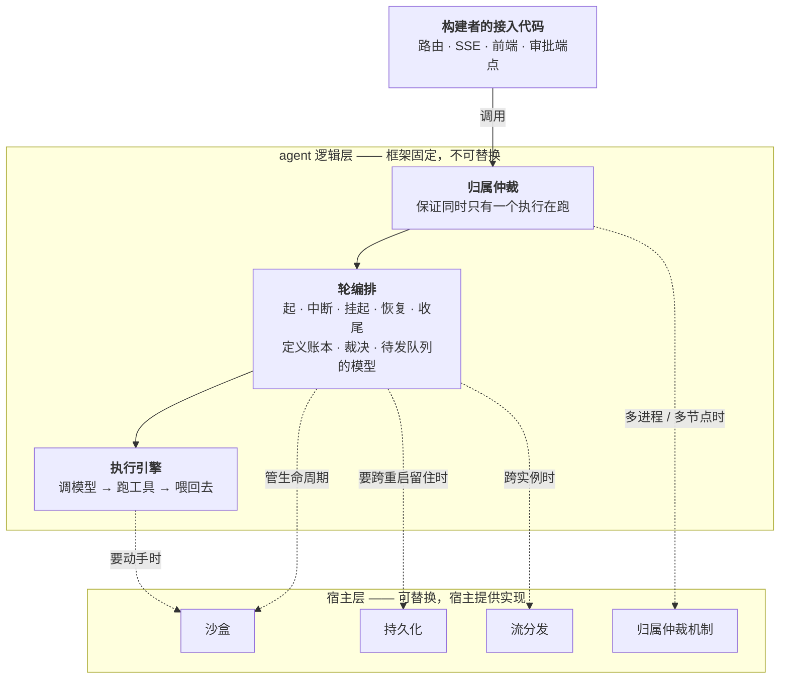
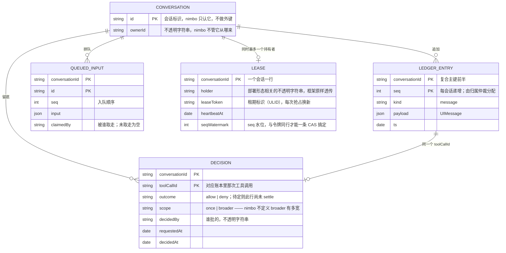
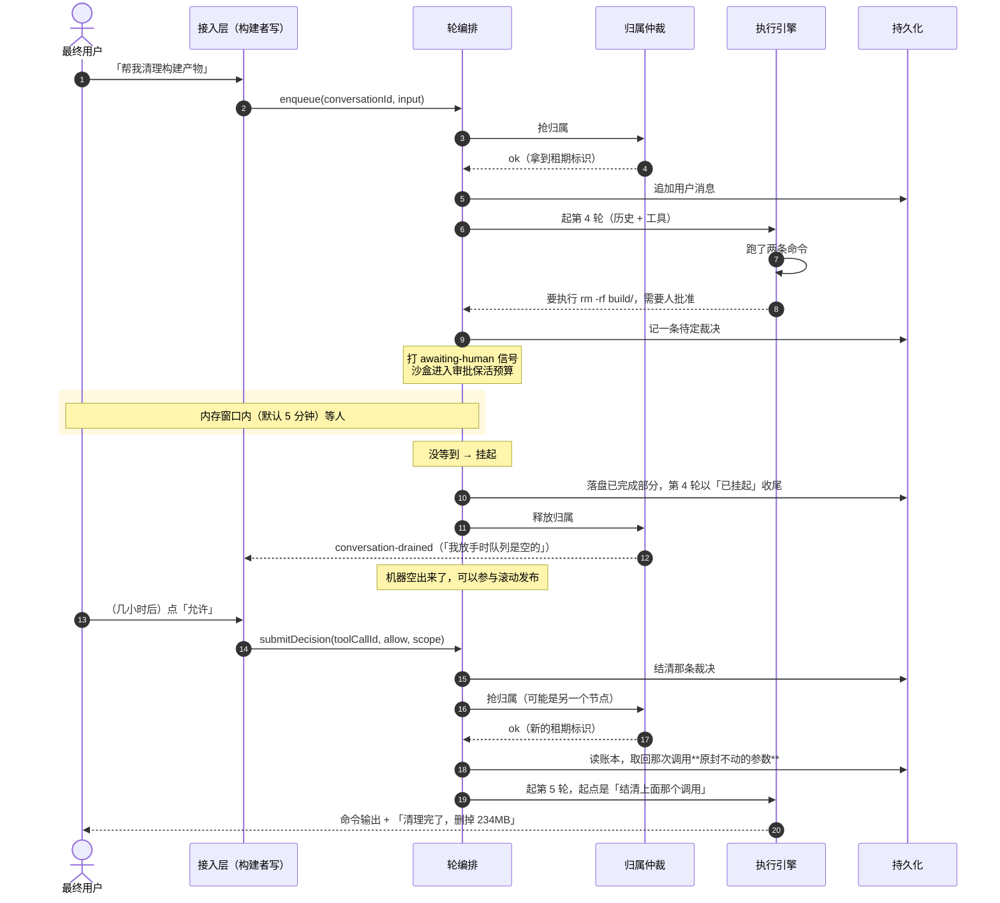

# agent 内核包 `@nimbo/agent` —— 技术方案

> 相关：产品/使用视角见 [feature.md](./feature.md)，施工进展见 [plan.md](./plan.md)。
> 设计讨论的完整记录（含被推翻的路线）在 [issue #2](https://github.com/ludafa/nimbo/issues/2)。
> 依赖/延续：[进行中草稿放内存](../in-flight-draft/tech.md)（附录 C 的「五样东西」是本方案的起点）· [优雅关闭](../graceful-shutdown/tech.md) 附录 B · [排队与插话](../steer-and-queue/tech.md) §7 · [沙盒保活](../../host/sandbox-keepalive/tech.md) §4.2 · [单一账本](../single-ledger/tech.md)。

## 1. 一句话

**凡是可替换的东西，语义在 [agent 逻辑层](../../terms.md)、实现在[宿主层](../../terms.md)。**

## 2. 分层

### 2.1 两块，各有几个模块



**虚线是有条件的依赖**——条件不满足时用内置的平凡实现，**一个外部件都不用装**。

| 模块 | 保证的性质 | 职责 |
|---|---|---|
| **[执行引擎](../../terms.md)** | **推进**——给定历史和工具，一直跑到模型说完 | 调模型 → 跑工具 → 喂回去（就是 `@nimbo/core`） |
| **[轮编排](../../terms.md)** | **连续**——一轮接一轮连成一段连贯的对话 | 起、中断、挂起、恢复、收尾、状态推导；定义账本/裁决/队列的模型；管沙盒生命周期 |
| **[归属仲裁](../../terms.md)** | **[独占](../../terms.md)**——同一时刻只有一个执行在跑 | 授予、回收、执法 |
| **[接入](../../terms.md)** | **可达**——外部能触达、能观察 | 路由、SSE、转发、端点（**构建者写，不在本包**） |

### 2.2 为什么是这么切的

**「独占」不是外加的，是推出来的**。它来自两条性质：

- **一份记录是共享的** → 两个执行同时跑，各自看到的历史会打架
- **能动手的地方是共享且有状态的** → 两个执行同时跑，互相踩文件

所以「单写者」在单进程时同样成立，只是内存里一个 Map 就满足了，看不出来。这一步把**要求**（永远成立）和**实现**（部署形态的函数）分开了。

**切模块用两条判据，不能混用**：

> **判据一：被谁用 → 决定它属于哪个模块。**
> **判据二：有没有[跨执行的状态](../../terms.md) → 决定它需不需要有人管生命周期。**

| 东西 | 被谁用 | 有跨执行状态吗 | 结论 |
|---|---|---|---|
| **模型** | 执行引擎直接用 | ❌ 每次调用独立 | 执行引擎的外部依赖，不用管生命周期 |
| **沙盒** | 执行引擎的**工具**在用 | ✅ 文件改动累积 | 执行引擎的外部依赖，但**生命周期归轮编排管** |
| **账本 · 裁决 · 待发队列** | **轮编排**读写 | ✅ 跨执行累积 | **模型归轮编排定义**，存储归宿主层 |

**执行引擎根本不碰账本**——它拿到的是已经读好的历史。所以模型和沙盒是同类，账本跟它俩不是。

### 2.3 三样不构成独立模块的东西

- **人**：不是一种能力，是**横跨三处的中断源**（工具停下来等 → 执行引擎；等太久要不要挂起 → 轮编排；裁决要存下来 → 持久化）。它唯一的特殊性质是**等待时长不可控**，这正是挂起/恢复的起因。
- **持久化**：它**贯穿整个逻辑层**（账本、裁决、队列、租约表都要存），做成一个逻辑模块必然出现「队列的模型在这儿、存储在那儿」的别扭切法。**正确位置是宿主层的一个模块**——逻辑层定义模型，宿主层负责存。这正是 better-auth 的形态。
- **独占**：它是**性质**不是模块。保证它的模块叫归属仲裁。

## 3. 数据模型

四张表，逻辑层定义、宿主层存。



**四条设计约束**：

1. **nimbo 不拥有用户实体**——只认不透明的 `ownerId`，不做外键。
2. **seq 由[归属仲裁](../../terms.md)分配，不由 DB 生成**——`MAX(seq)+1` 与 sequence 都是方言特性，通用适配器表达不了；用租约表水位 + CAS 取号则两边都不需要。
3. **迁移不是契约的一部分**——给参考 DDL，官方实现自带迁移，接口层不假设「有迁移这回事」。
4. **不假设事务能跨接口**——需要原子的地方收进**一个**方法里；绝不要求宿主传跨接口的事务对象，那等于宣布只支持关系型。

> `LEASE` 只在**租约版**归属仲裁下存在。单进程版在内存里，Cloudflare Durable Object 那档根本没有这张表。

## 4. 核心流程：挂起与恢复



四个要点：

- **恢复是「开新的一轮」**，不是同一轮续跑。于是归属、轮统计、单轮保活上限、轮检查点、前端「正在干活」指示**一样都不用重新定义**。模型看到的历史仍然连续（`tool_use` 后面紧跟 `tool_result`），轮号只是我们自己的记账。
- **必须用账本里原封不动的参数执行**。走「告诉模型你被批准了、你再发一次」那条路，模型可能发出参数不同的命令——**用户批准的和实际跑的不是同一条**，审批闸门形同虚设。
- **挂起点只有一个**：正在等人。那是唯一的干净边界（没有命令在跑、模型没在流式输出、沙盒也没在动）。命令跑到一半切不了——不知道它跑完没有。
- **所以这不是 durable execution**（任意点可暂停），只是「在一个特定的干净边界上允许断开」，工程量因此有界。

## 5. 归属仲裁

### 5.1 三种实现

| 部署形态 | 怎么实现 | 有租期标识吗 | 要 CAS 吗 | `holder`/心跳落库吗 |
|---|---|---|---|---|
| **单进程** | 内存里一个 Map | ❌ | ❌ | ❌ |
| **多进程共享 DB** | 租约 + 心跳 + 令牌 | ✅ | ✅ | ✅ |
| **Cloudflare DO** | 什么都不做（平台保证单实例） | ❌ | ❌ | ❌ |

**它是装饰器，不是基础设施**——它把记录的写入包起来（租约版先 CAS 校验令牌再往下走，另两版直接往下走），所以**持久化接口保持干净、完全不认识「租约」这个概念**，Durable Object 的 KV 存储也接得进来。

由此推出一条硬约束：**轮编排不该知道「租期标识」这个词**，它只该知道「我有独占权」和「我失去了独占权（该停下）」。

**CAS 因此不是持久化的要求，是「租约版归属仲裁机制」的要求**——用 DO 的人根本不碰它。

### 5.2 [租期标识](../../terms.md)：只需唯一，不需递增

校验用的是**等值判断**（`WHERE 会话 = ? AND 租期标识 = ?`），不是比大小。经典 fencing 文献要求递增，是因为那类场景（写 S3）存储不持有租约记录、只能记「见过的最大号」；**我们的租约和数据在同一个存储里**，直接跟当前值比更强也更简单。

所以用**调用方生成的 ULID**：不用 `RETURNING`、不用回读，少一条适配器要求。**时间戳不行**——毫秒会撞，而抢占恰恰容易扎堆。

**粒度是「一次租期」不是「一个进程」**：不能拿 `holder` 当令牌，否则「A 失联 → B 接管 → B 挂 → A 重新抢占」时，A 滞留在网络里的旧写入会被放行。

### 5.3 它**保证不了**独占，只能「安全地失败」

根因是分布式系统里绕不过去的一条：

> **你没法知道远处那个节点是死了，还是只是联系不上。**

从外面看两者一模一样（心跳都停了），却要求相反的处置。于是只能二选一：**不做超时接管**（崩溃的会话永久卡死）或**做超时接管**（一定存在误判窗口）。本方案选后者。

| 实现 | 独占是什么级别的保证 |
|---|---|
| 单进程 / Cloudflare DO | **真保证** |
| **租约** | **尽力 + 可检测**——保证不了「不发生」，只保证「发生时被拦住」 |

**接口后果（这条最要紧）**：

> **轮编排的每一次写入都可能被拒绝，而且这是正常路径，不是异常。**

单进程版下这条路永远走不到，**但接口上必须有它**——否则换成租约版就是静默数据损坏。同理，持久化实现必须能把「条件不匹配」当作一个**可辨识的结果**报回来，不能糊成一个泛泛的 `Error`。

**两个机制分工，互相替代不了**：租期标识管**不写坏**（safety，它只会拒绝、不会放行），心跳管**卡住的能被接管**（liveness）。

> 租期标识的完整推导（为什么不用事务、MySQL `affectedRows` 的坑、seq 空洞为什么无害）见[附录 A](#附录-a租期标识的实现细节)。

## 6. 排队与插话：策略归构建者，实现归框架

> **产品决策是「要不要这个功能」，不是「怎么实现它」。**

| | 归哪 |
|---|---|
| 排不排队、上限几条、满了怎么办、要不要插话、能否撤回、怎么显示 | **构建者**（配置 + 前端） |
| 队列的模型与读写、一轮收尾时取下一条、**跟归属释放之间的竞态** | **框架**（轮编排） |

机制不能推给构建者的三条理由：① 队列跟账本同构（同样跨执行、同样被轮编排读写）；② **「什么时候该排队」依赖会话状况**，而状况是轮编排从账本推的，推出去等于让每个构建者重新实现一遍；③ 挂起与[交权](../../terms.md)的时机只有轮编排知道。

**释放归属的竞态**——查完队列「没活儿了」到真正释放之间用户又发了一条。解法不是追求原子性，而是发一个**诚实的断言** + 写入方兜底：

```
conversation-drained：「我认为这个会话排空了——我放手的时候队列是空的。你那边如果有，可以继续。」
```

它不声称「队列一定是空的」，只声称「**我看的时候是空的**」。配套是**入队方也负责推进**（入队后若无人持有归属就自己抢来开轮）。**这套在 `enqueue` 内部实现一次**，构建者不需要知道有竞态。

## 7. 取舍与已知限制

- **等人采用混合模式**：先在内存里等一段（默认沿用[审批保活预算](../../terms.md) 5 分钟），等不到才挂起。换来的不是「机器早点撤」（内存等待比现在的 240 秒还长），而是「**人可以隔很久回来答而不作废**」。
- **挂起点只有一个**（正在等人）。跑到一半没有干净边界，所以 Vercel 那档「单轮超过函数时长上限」绕不过去。
- **挂起不设总上限**。切碎是无损的，所以不需要超时兜底；真要腾机器时直接交权即可。前提是构建者上报的「人还在」必须基于真实交互事件，不能是连通性。
- **崩溃仍然不恢复**：进程被强杀走的是老路（补一条「已中断」），因为它没停在干净边界上。
- **独占是按会话保证的，不是按机器**：跨会话的资源冲突（比如本机 CLI 那档多个会话共用一个项目目录）不在归属仲裁职责内。
- **多节点下行为集合变大**：会出现「一轮跑到一半被告知你已经不是主人了」。测试要专门覆盖这条路——单进程版跑绿不代表租约版没问题。

## 8. 包与部署

| 模块 / 能力 | 包 |
|---|---|
| 执行引擎 | `@nimbo/core`（已有） |
| **轮编排 + 归属仲裁语义 + 四种能力的接口 + 全套内置实现** | **`@nimbo/agent`** |
| 持久化 + 租约版归属仲裁机制 | **`@nimbo/persist-sql`**（裸驱动，方言是参数）/ **`persist-drizzle`** / **`persist-prisma`** |
| 流分发 | **`@nimbo/stream-redis`** |
| Cloudflare DO 全套 | **`@nimbo/durable-object`** |
| 开箱应用 | **`@nimbo/cli`**（不是框架包，是拿框架搭的成品） |

**打包原则：接口按模块分；实现按「一次装什么」打包。** 持久化和租约版仲裁总是一起用（共享连接与 CRUD+CAS 原语）→ 同包；流分发跟存储无关 → 独立；DO 上三样都是平台自带 → 独立且一次给全。

部署六档、每档换掉哪几个模块、以及 Cloudflare DO 与 Vercel Functions 的运行模型对比，见[附录 B](#附录-b六档部署形态)。

---

# 附录

## 附录 A：租期标识的实现细节

### A.1 CAS 是什么

**CAS = compare-and-set，「比对后再写」**：只有当它还是我以为的那个样子时才改它，而且比对和修改是**一个动作**，中间没有别人插进来的缝。

不用它的话，抢占归属会写成「查一下有没有人 → 没有 → 写我持有」三步，两个节点可以都查到「没人」然后都写成功。CAS 把三步压成一条：

```sql
UPDATE lease SET holder = '我' WHERE conversation_id = ? AND holder IS NULL
```

**影响 1 行 = 成功；影响 0 行 = 有人先我一步。** 所以适配器**必须能拿到影响行数**——那是唯一的成功/失败信号。

这套设计里用到三处，一个形状：抢占归属、校验令牌 + 推进 seq 水位、原子出队。

### A.2 为什么不用事务

一条带 `WHERE` 的 `UPDATE` 本身就是原子的（行锁），不需要事务。写成「`SELECT` → 比较 → `UPDATE`」反而要靠 `SELECT ... FOR UPDATE` 或 SERIALIZABLE 才正确。**最要紧的是：要求事务等于宣布只支持关系型**——Mongo 早年没有跨文档事务，Durable Object 的 KV 也没有。

写账本本来要动两处（推水位 + 插账本行），「**先占号，再写**」的拆法把它变成两个各自安全的步骤：CAS 成功即锁定 seq 号，之后的 INSERT 失败只留一个无害空洞。

### A.3 三个坑

1. **MySQL 的 `affectedRows` 默认是「真正变了的行」**，不是「匹配到的行」。值没变时返回 0，**CAS 会误判成失败**，症状是「偶发地拿不到归属」，极难查。要靠 `CLIENT_FOUND_ROWS` 连接 flag。
2. **Cloudflare DO 天然单写者**，CAS 对它是纯浪费——但这不构成契约问题，因为 CAS 是租约版实现的要求，不是持久化的要求。
3. **seq 会出现空洞**（锁了号但插入失败）。**已确认无害**：回放按序、断线续传游标、主键去重三个用途都不要求连续。但要写成明文保证，不能靠默契。

## 附录 B：六档部署形态

| 形态 | 换掉哪几个宿主模块 | 剩下用内置 |
|---|---|---|
| **⓪ 本机 CLI** | 沙盒 → 本机（`localExec` + `fromDirectory`） | 持久化、流分发、归属仲裁 |
| **① 同机多进程 cluster** | + 持久化 → SQLite，归属仲裁 → 租约 | 流分发 |
| **②③ Docker / k8s** | + 沙盒 → 远端，持久化 → Postgres | 流分发（靠[应用层转发](../../terms.md)） |
| **④a Cloudflare DO** | 四样**全换成 DO 版** | —— |
| **④b Vercel** | 四样**全换**（流分发 → Redis 是这一档独有的） | —— |

**从 ⓪ 到 ④，就是内置实现被逐个换掉的过程。**

### B.1 ① 是多进程，不是单进程

Node.js cluster 的 worker 之间不共享内存，所以已经需要真正的归属仲裁。但它有个实在的好处：**网络分区这个最主要的误判来源不存在**（同机、共享文件系统），而且还多一个额外判据——可以直接看进程还在不在。风险远低于跨机，**但接口上不能因此偷懒**。

### B.2 两个云平台的运行模型完全不同

| 我们在乎的 | Cloudflare Durable Object | Vercel Functions（Fluid） |
|---|---|---|
| 会话能固定到一个实例吗 | ✅ 天生的——`conversationId` 就是 DO 的 id | ❌ 实例由平台调度 |
| 怎么找到那个实例 | `stub` 本身就是通道 | **没有办法** |
| 并发模型 | **串行**处理 | 一个实例同时处理多个请求 |
| 还需要归属仲裁吗 | ❌ 平台已保证 | ✅ 需要 |
| 没请求时 | 休眠/被驱逐（内存清空、**存储保留**），**能被 alarm 定时唤醒** | 实例会被挂起，**无自唤醒** |
| 单次执行时长上限 | 无硬上限 | **800 秒 GA / 30 分钟 beta** |
| 状态放哪 | **自带 SQLite**（`ctx.storage.sql`） | 外部——自己接 DB |

**DO 把整个归属仲裁白送了**（一个会话 = 一个 DO），代价是每个 DO 有自己独立的存储——「列出这个用户的所有会话」这种跨会话查询要另建索引。

> Durable Object 里的 "Object" 是**面向对象那个「对象」**，不是「对象存储」。Cloudflare 的对象存储是 R2。

**Vercel 什么都不给，但也不用写转发**。因为拆开看，只有一件事真需要「找到持有者」：

| 事件 | 需要转发吗 | 怎么办 |
|---|---|---|
| 新消息进来（会话忙） | ❌ | **直接入队**，持有者收尾时会看到 |
| 用户点审批 | ⚠️ | 这一档**不做内存窗口**，等人一律立刻挂起 → 裁决落库 → 恢复时读 |
| 用户点停止 | ⚠️ | 停止标记落库，跑的那一方每步检查一次 |
| **实时流（SSE）** | ✅ | **绕不过去**——外挂 Redis Streams 广播 |

Redis 要用 **Streams 而不是裸 pub/sub**：断线续传要求「拿历史快照 + 挂订阅」是一个动作，Streams 天生是「可重放的日志 + 订阅」，裸 pub/sub 只推不存历史。

### B.3 其他平台（2026-07 调研）

| 平台 | 结论 |
|---|---|
| ECS Fargate / Railway / Render 等长驻容器 | **成立**，等同 ②③ |
| Fly.io Machines | **成立**（`fly-replay` 可指定 Machine，`<machine_id>.vm.<app>.internal` 直接寻址） |
| Cloudflare Worker（不带 DO） | 不成立 |
| AWS Lambda | **不成立**——API Gateway 29 秒上限连一轮都跑不完，加组件也解决不了 |
