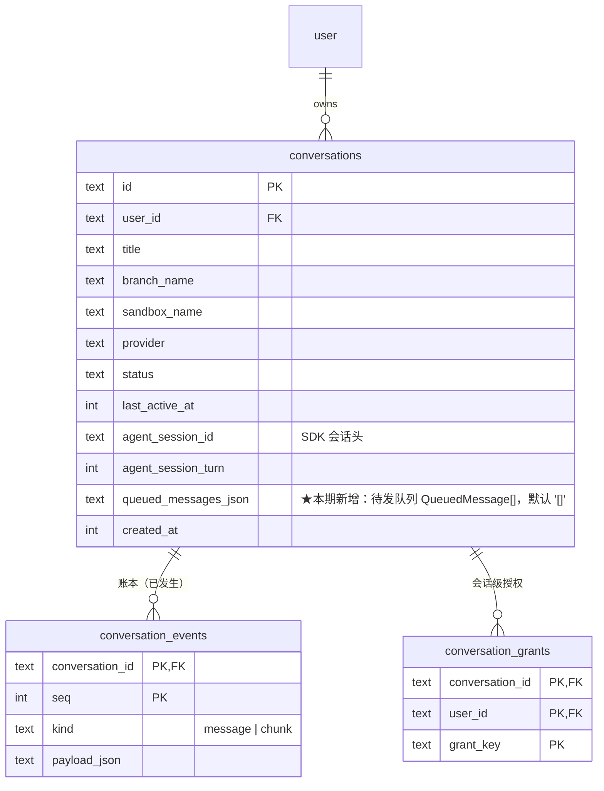
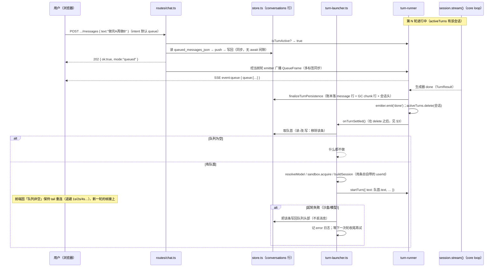
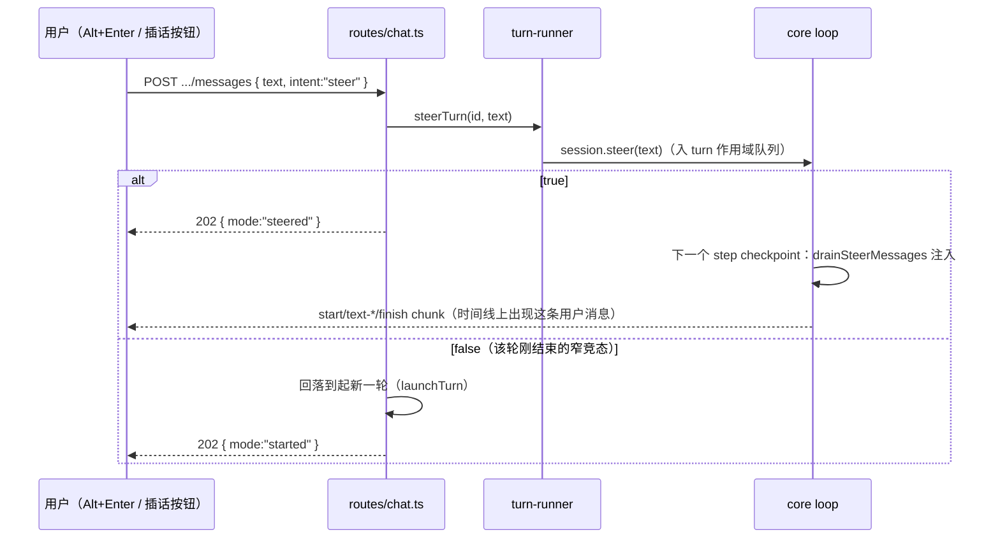

# 中途插话与排队（技术方案）

> 相关：产品/使用视角见 [feature.md](./feature.md)，施工进展见 [plan.md](./plan.md)。
> 依赖/延续：[app/chat-webapp/tech](../../app/chat-webapp/tech.md)（`routes/chat.ts` 七端点、`turn-runner/` 的[轮](../../terms.md)驱动、`sandbox-manager.ts` 生命周期）· [agent/single-ledger/tech](../single-ledger/tech.md)（[账本](../../terms.md) `seq` 空间与 durable/transient 分档）· [core/core-sdk/tech](../../core/core-sdk/tech.md) §4.2（`Session.steer()` 的软 steer 语义）。

## 1. 现状与增量

[steer](../../terms.md) 已经**全链路存在**，本期不重做它：

| 层 | 现状 | 本期改动 |
|---|---|---|
| `@nimbo/core` | `Session.steer(input)`、loop 的 `drainSteerMessages`（step 边界 A/B 两个 checkpoint） | **不动** |
| `apps/node-server` | `turn-runner/registry.ts` 的 `steerTurn()`；`POST .../messages` 有活跃轮就无条件 steer | 改为按 `intent` 分流，新增[排队](../../terms.md)/[出队](../../terms.md) |
| `apps/web` | 流式中发送即 steer（隐式，无 UI 表达） | 默认排队 + 显式插话入口 + 待发区 |

增量是**排队**这条路径，外加把 steer 从「隐式唯一」降级为「显式可选」。

## 2. 存储：不新增表，加一列

排队消息落 `conversations.queued_messages_json`（TEXT，JSON 数组，默认 `'[]'`）。

**为什么不进 [账本](../../terms.md) `conversation_events`**（评估过并否决）：账本的契约是「已发生的事」——`kind='message'` 行**永不删除**、[seq](../../terms.md) 单调且被[回放](../../terms.md)/断线续传/`finalizeTurnPersistence` 的 GC 阈值三处依赖。排队消息是**尚未发生的意图**，可删可清可改序，塞进账本会同时破坏「永不删除」与 seq 空间的语义，[回放](../../terms.md)还得学会跳过它们。

**为什么不新增子表**：队列与 conversation 天然 1:1、有序、量小（上限 10 条）、永远整体读写（入队/删一条/清空/出队都是读-改-写整个数组），没有任何按条件查询的需求。一张子表换来的只是模式洁癖，代价是多一张表、多一个 join、多一处级联清理。加一列 JSON 是这个形状的最小正确解——也正好满足「不新增表」的要求。

**代价**（接受）：JSON 列不可索引/不可按条件查（不需要）；每次改动重写整列（10 条以内无所谓）；读回来必须走运行时校验——用 zod `parse`，不是类型断言（遵循仓库 TS 规范）。

### 2.1 业务数据领域设计图



排队消息**不是**一个实体表，它是 `conversations` 上的一个有序值列表——图上以列的形式呈现正是这个设计意图。

### 2.2 队列条目形状

```ts
// schemas/chat.ts（OpenAPI 可见）+ store.ts（读回时 zod parse）
interface QueuedMessage {
  id: string;        // randomUUID，删除端点按它定位
  text: string;      // 1..N，与 PostChatMessageInput.text 同约束
  userId: string;    // 入队者（= 起轮时的审批发起人，见 session-grants 的 userId 语义）
  createdAt: number; // epoch ms
}
```

`userId` 不是冗余：出队起轮时[会话级授权](../../terms.md)按「本轮发起者」匹配，必须知道这条消息是谁排的，不能想当然用 conversation owner。

## 3. 起轮装配抽取：`agent/turn-launcher.ts`

**问题**：起一轮所需的装配（`resolveModel` → `sandboxManager.acquire` → E2B 重连令牌回写 → 审批闭包 `onApproval`/`onReview`/`onAskUser` → `loadResumeState` → `buildSession` → `startTurn`）目前整段长在 `routes/chat.ts` 的 `POST .../messages` handler 里。自动出队要起下一轮，需要同一段装配，但它**不在任何 HTTP 请求上下文里**。

**方案**：把这段抽成 `agent/turn-launcher.ts` 的 `launchTurn(deps, { conversationId, userId, text })`，路由与自动出队共用。`loadResumeState`/审批闭包一并搬过去（它们本来就与路由无关）。

**依赖方向**（不成环）：

```
routes/chat.ts ──→ turn-launcher.ts ──→ turn-runner/start.ts（startTurn）
                          ↑                     │
                          └─── onTurnSettled ───┘（回调由 launchTurn 注入，turn-runner 不 import launcher）
```

`turn-runner/start.ts` 只多一个可选入参 `onTurnSettled?: () => void`，在 `driveTurn(...)` 收尾之后、**`activeTurns.delete()` 之后**调用——顺序是硬要求，否则下一轮的 `startTurn` 会被「已有活跃轮」守卫挡掉。turn-runner 依然不认识队列这个概念。

## 4. wire 契约

### 4.1 `POST .../messages` 增加 `intent`

```ts
PostChatMessageInput = { text: string; intent?: 'queue' | 'steer' }  // 默认 'queue'
StartTurnAck         = { ok: true; mode: 'started' | 'steered' | 'queued' }
```

分流规则（服务端唯一权威，前端不预判）：

| 有活跃轮？ | `intent` | 行为 | `mode` |
|---|---|---|---|
| 否 | 任意 | 起新一轮 | `started` |
| 是 | `queue`（默认） | 入队 | `queued` |
| 是 | `steer` | `steerTurn()` | `steered` |
| 是 | `steer` 但 steer 返回 false（轮刚好结束的窄竞态） | 回落起新一轮 | `started` |

队列已满时返回 **409**（`{ error: '待发队列已满（最多 10 条）' }`）——不是 400：请求本身合法，是资源状态不允许。

### 4.2 队列管理端点

```
DELETE /api/chat/conversations/{id}/queue/{messageId}   → 200 { queue: QueuedMessage[] }
DELETE /api/chat/conversations/{id}/queue               → 200 { queue: [] }
```

两者都返回**变更后的完整队列快照**（不是 204）——调用方一次往返拿到权威状态，省掉「删完再查一次」。`messageId` 不存在返回 404。

没有独立的 `GET .../queue`：`GET .../conversations/{id}` 的 DTO 直接带 `queuedMessages`，页面加载时本来就要请求它。列表端点也一并带上（侧边栏可显示「N 条待发」）。

### 4.3 第三种 wire 帧：`QueueFrame`

[直播流](../../terms.md)的帧联合从两支变三支（`schemas/chat.ts` 的 `chatReplayFrameSchema`）：

```ts
type ChatReplayFrame = ChunkEnvelope | MessageFrame | QueueFrame
QueueFrame = { queue: QueuedMessage[] }   // 无 seq —— 它是状态快照，不是账本事件
```

三支仍按**结构存在性**区分（`chunk` / `message` / `queue` 三个键互斥），与现有约定一致；SSE `event:` 名相应为 `chunk` / `message` / `queue`。

`QueueFrame` **不落库、不占 seq、不参与 `after=` 续传**——它是[transient](../../terms.md)档的状态快照，语义是「此刻队列长这样」，重发一次即最新，没有回放价值。

**两个发送时机**（合起来保证任何时候连上都拿得到权威状态）：

1. `GET .../stream` 在回放结束、进入直播之前，**总发一帧**当前快照（重连/新标签页的权威同步点）。
2. 队列在一轮进行中发生任何变化（入队/删一条/清空）时，经该轮 emitter 广播一帧。

出队发生在轮收尾、emitter 即将关闭的时刻，此时广播是竞态的——不靠它：下一轮的 tail 一连上就会走时机 1 拿到最新快照。

## 5. 核心流程时序图

### 5.1 排队 → 自动出队起下一轮



### 5.2 显式插话（steer）



## 6. 前端要点

- `use-chat-messages.ts` 新增 `queuedMessages` 状态：初值来自会话详情 DTO，之后由 `QueueFrame` 覆盖，删除/清空的 HTTP 响应快照也直接覆盖（服务端始终是权威，前端不做乐观合并——沿用审批「不做乐观翻转」的同一姿态）。
- **轮收尾后若队列非空**：`turnInProgressRef` 保持 `true`、`status` 保持 `streaming`、继续走已有的退避重连，接住服务端起的下一轮（避免 idle→streaming 的闪烁，也避免用户以为卡住）。已有 5 次退避（1/2/4/8/16s，共 31s）足够覆盖沙盒恢复；耗尽后安静停止，刷新即恢复。
- `MessageComposer`：`Enter` = 排队（流式中）/ 起轮（idle），`Alt+Enter` = 插话，右侧插话按钮只在流式中出现；上方 `QueuedMessages` 面板负责列出/删除/清空。

## 7. 边界与已知限制

1. **进程重启中断的那一轮不会自动续上队列**：`activeTurns` 本就是内存态（[chat-webapp 既有取舍](../../app/chat-webapp/tech.md)），重启后没有「轮收尾」这个触发点，队列会静置到下一次有轮收尾。队列本身不丢。
2. **单进程假设**：入队/出队是 better-sqlite3 的同步读-改-写，同一 Node 进程内无并发间隙（读改写之间不 `await`）。多进程部署会丢更新——与 `activeTurns` 一样，是 chat 应用当前整体的单进程前提，不在本期解决。
3. **出队失败不自动重试**：靠「下一次轮收尾」自然重试，不引入定时器。避免沙盒持续不可用时后台无限重试烧钱。
4. **`QueueFrame` 不进账本**：断线期间的队列变化不会被回放补齐——重连时的快照帧（§4.3 时机 1）直接给最终状态，中间过程本就无需重建。
