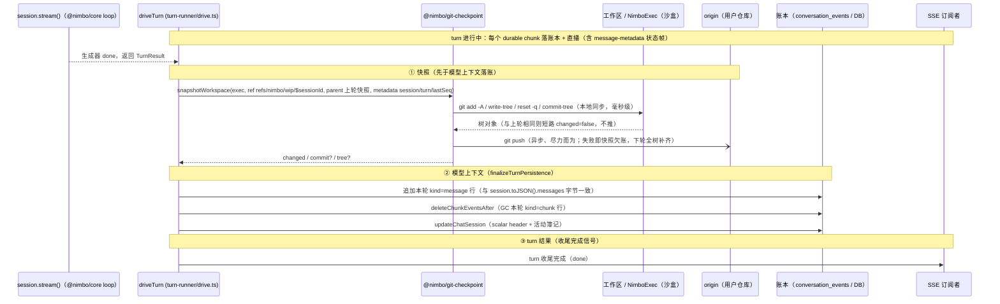
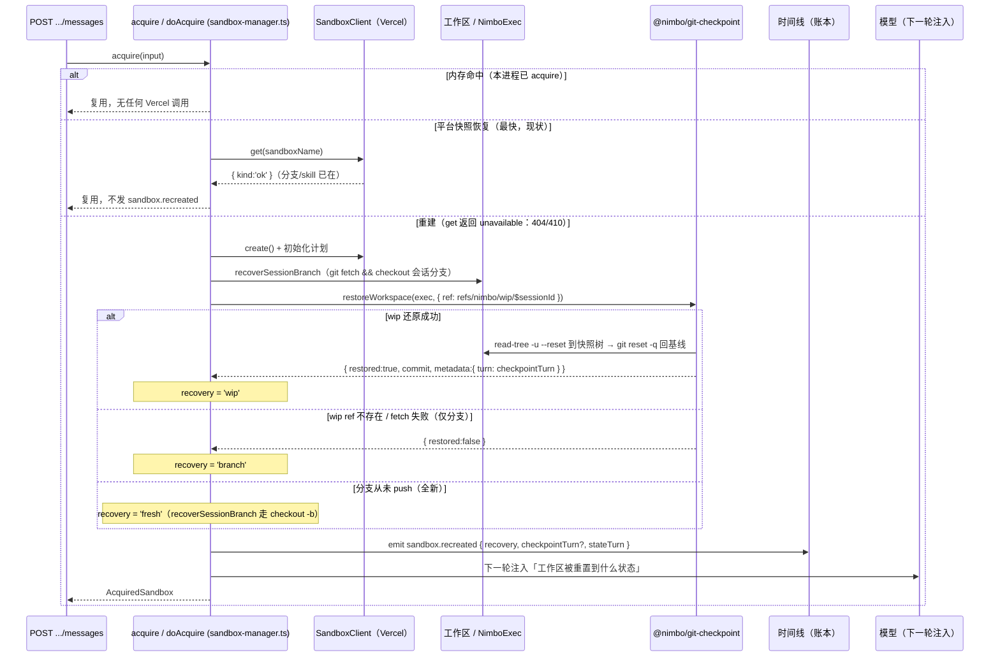

# Turn Checkpoint 与沙盒保活（技术方案）

> 相关：产品/使用视角见 [feature.md](./feature.md)，施工进展见 [plan.md](./plan.md)。
> 依赖/延续：[chat 聊天 webapp](../../app/chat-webapp/feature.md)（turn 收尾在 `turn-runner/`、沙盒生命周期在 `sandbox-manager.ts`）· [UIMessage 单账本](../single-ledger/feature.md)（[账本](../../terms.md) `seq` 即快照对齐锚）· [host/sandbox/tech](../../host/sandbox/tech.md)（BYO 原则与「要基线管理就用沙盒里的 git」）。
>
> **状态：计划中（未施工）**。本文描述的是**拟定设计**——接口签名、写入顺序、恢复阶梯都是待落地的方案，不是已有代码的说明。无新增数据库表（用 git 隐藏引用做持久层），故不含 erDiagram。

## 1. 核心不变量（一切失败语义的锚）

**代码快照跟着[模型上下文](../../terms.md)走，不跟「turn 成功」走**：两者在同一个收尾边界、以同一个条件写入。写入顺序定死为——

```
快照 → 模型上下文 → turn 结果
```

顺序理由：若恰好在两步之间崩溃，宁可「代码比记忆新」（模型下一轮 `git status` 就能发现多出来的东西），不可「记忆比代码新」（模型坚信存在的改动实际没有，纯误导）。

> **单账本对齐（[UIMessage 单账本](../single-ledger/feature.md) 落地后）**：事件表与「模型记忆」已合一为**账本**，[模型上下文](../../terms.md)现从账本的 UIMessage 现场推导，`nimbo_state_json` 取消。因此 checkpoint 的 `lastSeq` 可直接取账本 `seq`，不再需要跨「事件表 seq / `nimbo_state_json` 轮号」两本账互校，本不变量随之更简：模型上下文与代码快照仍在同一收尾边界写入，只是「模型上下文写入」在代码里就是 `turn-runner/persistence.ts` 的 `finalizeTurnPersistence` 追加 `kind='message'` 行、GC 本轮 `kind='chunk'` 行、更新 `conversations` 头这一段。

### 1.1 收尾写入顺序（sequenceDiagram）

对齐 `turn-runner/drive.ts` 的 `driveTurn` 优雅收尾路径（`session.stream()` 返回 `TurnResult`、非 `catch` 抛错分支）。快照插在拿到 `TurnResult` 之后、`finalizeTurnPersistence` 之前：



> 竞态说明：快照的**同步部分**（本地 commit）发生在 turn 从注册表摘除**之前**，这毫秒级窗口内的新消息会撞 409（push 已异步化、不占窗口）——接受，不上锁。

## 2. 能力包 `@nimbo/git-checkpoint`（平台无关）

新包，与 mini-bash 同粒度，SDK 透传。只依赖 [`NimboExec`](../../terms.md)（git plumbing 命令编排），对 session/turn 无知——元数据是调用方给的**不透明键值**。适配任意有 git 的沙盒，可用 fake exec 单测。符合 spec「要基线管理，用沙盒里的 git」（§4.5 规则 3）与「生命周期归宿主」（[BYO 原则](../../terms.md)）。

```ts
snapshotWorkspace(exec, { ref, parent?, metadata })
  → { changed: boolean, commit?, tree? }
restoreWorkspace(exec, { ref })
  → { restored: boolean, commit?, metadata? }
readCheckpoint(exec, { ref }) → { commit, metadata } | undefined
```

实现要点：

- **快照**：`git add -A → write-tree → reset -q → commit-tree → push`——不动分支 / index / 工作区，模型无感；树对象与上一轮相同时短路返回（`changed: false`，不推）。**这是唯一可靠的「有没有改动」判定**——bash 写入（sed、`npm install` 改 lockfile）不产生 file_change 事件，靠事件做门槛会漏。
- **延迟**：本地 commit 同步完成（毫秒级，保证对齐判定），push 异步尽力而为——push 失败即「快照欠账」，由全树语义自愈（见 §4 第 4 条）。
- **ref 布局**：
  - `refs/nimbo/wip/<sessionId>`——正常存档，**链式**：每轮以上一轮快照为 parent。
  - `refs/nimbo/crash/<sessionId>`——事故现场留底（见 §4 第 2 条）。
  - `refs/nimbo/*` 不在 `refs/heads/*` 下：GitHub UI 不可见、不触发 CI；仓库管理员 `git ls-remote` 可见（如实记录，不算隐藏后门）。
- **metadata** 写进 commit message：`session` / `turn` / `lastSeq`（该轮 turn 结果的 seq）——三本账（[账本](../../terms.md)、模型上下文、代码快照）可互相校验对齐。单账本落地后 `lastSeq` 即账本 `seq`。
- **restore**：`git fetch <ref>` → `read-tree -u --reset` 到快照树 → `git reset -q` 回到分支基线——工作区精确等于快照（含删除的文件），改动以未提交形态呈现，与休眠前的真实状态同构。

## 3. chat 应用接线

### 3.1 turn-runner 收尾

**成功与优雅失败同权**（见 §4 第 1 条）：按 §1 的顺序执行；快照 metadata 取当轮 turn 号与 lastSeq。落点就是 `driveTurn` 优雅收尾路径 `finalizeTurnPersistence` 之前插入 `snapshotWorkspace`。

- **catch 分支**（生成器意外抛错）：模型上下文本来就故意不写（`finalizeTurnPersistence` 在此路径不运行），正常存档 ref 也不动；尽力把残局推到 `crash` ref（失败即放弃）。

### 3.2 sandbox-manager 恢复阶梯

重建路径扩展 `sandbox-manager.ts` 的 `doAcquire`。现状阶梯是：内存命中 → `SandboxClient.get()` ok（Vercel 从平台快照恢复）→ `create()` + 初始化计划（skill 安装、git 身份、remote 鉴权、exclude）+ `recoverSessionBranch`（`git fetch && checkout`，否则 `git checkout -b` 建新分支）。checkpoint 在「重 clone + checkout 分支」之后**新增一级 wip 还原**：



`sandbox.recreated` 是 wire 事件，落账本、可回放：`{ recovery: 'wip' | 'branch' | 'fresh', checkpointTurn?, stateTurn }`。把 [chat webapp](../../app/chat-webapp/feature.md) §4.1 的「UI 如实提示」从文档承诺变成机制。web 时间线渲染为一条简单系统条目。

- **收尾竞态窗口**：快照的同步部分发生在 turn 注册表摘除之前，期间新消息会撞 409（窗口为毫秒级本地 git 操作；push 已异步化不占窗口）——接受，不上锁。

## 4. 失败语义（六种失败形态 × checkpoint 的行为）

| # | 失败形态 | 模型上下文写入？ | 快照动作 | 恢复后一致性 |
|---|---|---|---|---|
| 1 | **优雅失败**（max_turns / context_overflow / provider_error / aborted：loop 内降级，仍有 TurnResult） | 写 | **照常快照**——这轮改的文件模型记得，跳过快照会让记忆领先于代码 | 完全对齐 |
| 2 | **生成器意外抛错**（turn-runner catch 分支） | 故意不写 | 正常 ref 不动；残局推 crash ref 留底（恢复永远不用它，纯打捞） | 两本账都停在[上次存档](../../terms.md)，对齐 |
| 3 | **进程崩溃**（turn 进行中） | 没机会写 | 什么也做不了——但两本账都停在上次存档，**不变量自动成立** | 结构性对齐 |
| 4 | **快照自身失败**（push 被拒 / 网络 / 沙盒恰好死在收尾） | 已写 | 尽力而为放弃。快照是**全树**不是增量：下一轮一次成功自动补齐全部欠账 | 记忆暂时领先；restore 时对比 `checkpointTurn` 与 `stateTurn`，有差距就在事件与模型注入里如实报告 |
| 5 | **turn 未启动**（沙盒 / 模型配置 500） | 不写 | 无关 | 无变化 |
| 6 | **沙盒 turn 中途死亡** | 演化为 1/2/4 之一 | 同上 | 同上；发生频率由保活（§5）根治 |

## 5. 保活（`ensureLifetime`）

> **本节已被取代**（2026-07-26）：保活独立成功能，见 [docs/host/sandbox-keepalive/tech.md](../../host/sandbox-keepalive/tech.md)。
>
> - **推翻**：本节"不进 nimbo SDK / 适配器"的定位——保活下沉进[沙盒适配器](../../terms.md)，理由见新方案 §2.1（本节说的"归宿主"指生命周期**所有权**，那部分不变；下沉的只是续期动作的**执行**）。
> - **保留**：本节的补足语义（`ensureLifetime`）、单轮上限、以及下面这段平台事实——它们是新方案的地基。
> - 本节其余内容（checkpoint 相关）不受影响。

**平台事实**（2026-07-14 经 Vercel 官方文档核实）：Vercel 沙盒的 timeout 是**租期倒计时**——平台不看活动，跑命令不续命，到点即停（命令跑到一半也停，停机瞬间存平台快照）；`extendTimeout(ms)` 是**往剩余租期上加时**，不是重置；`sandbox.timeout` 属性报告剩余毫秒数，官方推荐「先查剩余、不够再补」。

| 平台 | 时效模型 | 「补足到还剩 X」的翻译 |
|---|---|---|
| Vercel | 租期倒计时，`extendTimeout` 加时 | 读 `timeout` 剩余量，不够加差值 |
| E2B | 倒计时，`setTimeout(ms)` 重置为从现在起 X | 直接 `setTimeout(X)`，天然幂等 |
| Cloudflare | `sleepAfter` 真·空闲检测，活动自动续 | 基本无操作 |

设计：

- **接缝按意图定义**：chat 应用的 `ManagedSandbox` 接口把现有的 `extendTimeout(durationMs)` 演进为 `ensureLifetime(targetMs)`（补足到至少 X，够了就什么都不做）——平台差异全部封在 `SandboxClient` 实现里，不进 nimbo SDK / 适配器（spec BYO 原则：「超时延长」点名归宿主）。
- **touch 修正**：用户消息 / 审批 / 回答时的 `touch` 改调 `ensureLifetime(idleTimeout)`——修掉现有 `touch → extendTimeout(idleTimeout)`「每条消息盲加 5 分钟」的累积 bug（高频对话后沙盒多活几十分钟白计费，还可能撞套餐总时长上限）。
- **[心跳](../../terms.md)**：turn 注册时启动、收尾（含异常）时停止的定时器，每 `idleTimeout / 2`（默认 150 秒）调一次 `ensureLifetime(idleTimeout)`。补足语义保证水位恒定。心跳失败只记日志（网络抖动常见；沙盒真死了工具报错会自己浮出来）。进程崩溃时定时器随进程死，沙盒 5 分钟后照常休眠——行为与现状一致。
- **单轮上限**：`SANDBOX_TURN_KEEPALIVE_MAX_MS`（默认 30 分钟）——超限停止续命，让倒计时自然终结失控任务，防无限烧钱。
- **解耦副产品**：审批 240 秒超时（`CHAT_APPROVAL_TIMEOUT_MS`）不再背负「赶在沙盒死前了结」的保命职责（心跳接管），回归纯产品决策（人多久不理算放弃），数值不动。

## 6. 配置面（新增 env，`.env.template` 同步——注意该文件受权限保护需人工编辑）

```
CHAT_CHECKPOINT_MODE=wip               # wip（默认，启用 turn 快照）| off（完全关闭，回到纯平台快照）
SANDBOX_TURN_KEEPALIVE_MAX_MS=1800000  # 单轮保活上限，默认 30 分钟
```

心跳间隔不单开旋钮（恒为 `SANDBOX_IDLE_TIMEOUT_MS / 2`），减少配置面。

## 7. 已知取舍与边界

1. **依赖 PAT 的 push 权限**（已具备）；[快照引用](../../terms.md)对仓库管理员 `ls-remote` 可见。若宿主不接受向 origin 写 ref，`CHAT_CHECKPOINT_MODE=off` 回到现状。
2. **crash ref 与 wip ref 的清理**归留存治理（P13-4，会话删除时应一并删 ref）——本期只写不删。
3. 未 push 的 commit **历史**不可恢复（内容可恢复，见 [features 非目标](./feature.md#4-范围与非目标)）。
4. turn 中崩溃 + 沙盒存活的场景下，工作区可能领先于模型上下文（沙盒里有崩溃轮的残迹）——现状即如此，instructions 已引导模型用 `git status` 自查；P13-3（中断哨兵）负责把这个状态在 UI 上显性化。
