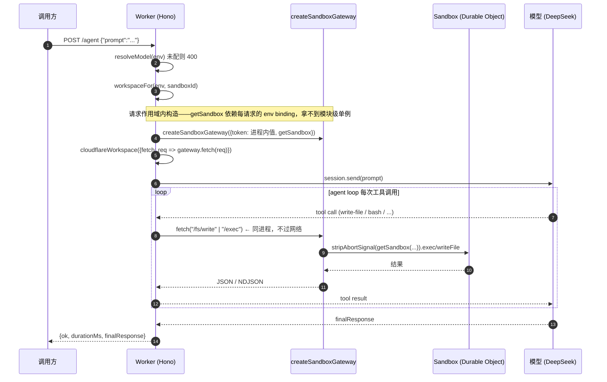
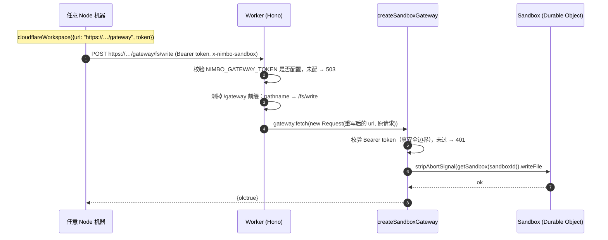

# Cloudflare Worker Server（技术方案）

> 相关：[产品视角](./feature.md) · [施工进展](./plan.md)
> 依赖：[sandbox 技术方案](../../host/sandbox/tech.md)（§6 [网关形态](../../terms.md)与协议、§7 workerd 实测）· [core-sdk](../../core/core-sdk/feature.md)
> 相关产品：[沙盒 provider](../../host/sandbox-provider/feature.md)（Node 版服务端的 provider 选择，Cloudflare 仍是其非目标）
> 代码：[apps/cloudflare-worker-server](../../../apps/cloudflare-worker-server/README.md)
> 术语：[沙盒](../../terms.md) · [网关形态](../../terms.md) · [工作区](../../terms.md) · [模式 A（同源工作区）](../../terms.md)
> **归属**：本文讲的是**接线与部署**，两个角色的能力本体都在别处——角色②的协议见 [host/sandbox](../../host/sandbox/tech.md) §6；角色①现在是「在 Worker 里跑**一次**会话」，将来 ④a Durable Object 那一档要换成 DO 里的持久会话（`createAgentRuntime(...durableObjectBackend(ctx))`，`@nimbo/durable-object`，[K9](../../agent/agent-kernel/plan.md#阶段拆单)），**这个工程就是那一档的验证载体**。归属结论见 [agent/agent-kernel/plan](../../agent/agent-kernel/plan.md#两个容易归错层的-app-文档2026-08-11-复核)。

## 1. 它是什么

一个跑在 Cloudflare Worker 里的 nimbo 服务端**示例**（`@nimbo-chat/cloudflare-worker-server`，private，不发布）。它是完整可 `wrangler deploy` 的工程，不是参考片段——但它**不是** `apps/node-server` 的 Workers 版替代品（后者的 D1/better-auth 移植不在范围内，见 §6）。

它同时扮演**两个角色**，这是本方案唯一的结构性决策：

| 角色 | 路由 | 谁来用 | 沙盒从哪来 |
|---|---|---|---|
| ① 服务端自驱 | `GET /sandbox-check`、`POST /agent`、`GET /debug/exec` | 这个 Worker 自己 | 进程内直连（同进程网关，不过网络） |
| ② 对外网关 | `ALL /gateway/*` | **任意 Node 机器**上的 `cloudflareWorkspace({ url, token })` | HTTP 过网络 |

两个角色**共用同一套 `getSandbox` 接线、同一个 Durable Object binding、同一份 Dockerfile**。

## 2. 为什么这两件事能合成一个 Worker

`@nimbo/sandbox-cloudflare` 是[网关形态](../../terms.md)：nimbo 的前提是「agent 跑在任意电脑上」，而 CF [沙盒](../../terms.md)只能从 Worker 内部经 Durable Object binding 访问，所以需要自部署一个 HTTP 网关把两边接起来（[sandbox §6](../../host/sandbox/tech.md)）。**角色 ② 就是那个网关**。

而角色 ① 的服务端自己就在 Worker 里，客户端与网关同进程——同一个 `createSandboxGateway` 实例，既可以经 HTTP 服务外部客户端，也可以被本进程直接 `fetch()` 调用，把 TCP 那一跳短路掉：

```
                    ┌─────────────────────────────────────────────┐
外部 Node 客户端 ──HTTP──▶ /gateway/*  ─┐                          │
cloudflareWorkspace       (真 token)   │                          │
  ({url, token})                       ├─▶ createSandboxGateway ──┼──▶ getSandbox(env.Sandbox, id)
                                       │   (协议翻译，零 CF import) │        │
本进程 /agent ─▶ cloudflareWorkspace ──┘                          │        ▼
                  ({fetch: 直接调用})                              │   真实 CF 沙盒
                  (进程内 token，不出进程)                          │   (Durable Object + 容器)
                    └─────────────────────────────────────────────┘
```

**一行新的适配器代码都不用写**——复用的是两端都已有契约测试覆盖的现成实现（客户端 `.` 入口纯 fetch，网关 `./worker` 入口零 `@cloudflare/sandbox` import）。

**否决了「新写一个 CF 直连适配器」**：那要把网关里 `CfSandboxLike` → `NimboFS`/`NimboExec` 的翻译逻辑重抄一遍，多一份没有测试覆盖的代码。代价是进程内路径每次文件操作仍走一遍 JSON+base64 编解码——本示例**刻意保留**这层，因为它让角色 ① 与角色 ② 走的是**完全同构**的代码路径，角色 ① 跑通即等于角色 ② 的协议翻译也跑通。

## 3. 核心流程

### 3.1 角色 ①：Worker 内跑一次 agent 会话（`POST /agent`）



### 3.2 角色 ②：外部 Node 客户端经网关驱动沙盒（`ALL /gateway/*`）



## 4. 关键接口与装配点

### 4.1 `/gateway` 前缀与 pathname 精确匹配

客户端把端点常量（`ENDPOINTS`：`/fs/read`、`/fs/write`、`/fs/rm`、`/fs/mkdir`、`/fs/readdir`、`/fs/stat`、`/fs/glob`、`/exec`）**直接拼在 `url` 后面**，而 `createSandboxGateway` 是按 **pathname 精确匹配**这些常量的（`switch (new URL(request.url).pathname)`）。

因此 Worker 在转交前把 `/gateway` 前缀剥掉：

```ts
const url = new URL(c.req.raw.url);
url.pathname = url.pathname.slice(GATEWAY_PREFIX.length) || '/';
return gatewayFor(c.env, token).fetch(new Request(url, c.req.raw));
```

**客户端侧必须配带前缀的地址**：`url: "https://<worker>.workers.dev/gateway"`。

挂前缀而不是挂根路径，是为了让网关协议与 Worker 自己的路由各据其位——尤其是网关协议的 `/exec` 与本示例的调试路由重名，后者因此改挂 `/debug/exec`。

### 4.2 两个 token，只有一个是安全边界

| 常量 | 用途 | 是不是边界 |
|---|---|---|
| `INTERNAL_TOKEN`（源码里的字面量） | 角色 ① 进程内握手 | **不是**。两端在同一 Worker 进程里，此值永不出进程、从不上网；协议契约要求带 `AUTH_HEADER`，照给即可 |
| `NIMBO_GATEWAY_TOKEN`（secret） | 角色 ② 对外鉴权 | **是**。未配置时 `/gateway/*` 直接 503——刻意不退化成无鉴权或某个默认值 |

### 4.3 请求作用域构造（不可省的约束）

`getSandbox` 依赖每请求的 `env` binding，**拿不到模块级单例**。这正是 [`apps/node-server`](../chat-webapp/tech.md) 上 Workers 时必须改造的点之一（它的 `sandboxManager` 是模块级实例化的）。本示例的 `gatewayFor`/`workspaceFor` 都在请求处理函数内调用。

## 5. 已知缺陷：网关向 DO stub 传 AbortSignal

**`@nimbo/sandbox-cloudflare` 的一个真实缺陷，两个角色都会撞上。**

网关的 `handleExec` 把 HTTP 请求的 `request.signal` 传给 `sandbox.exec()`，而这里的 `sandbox` 是 `getSandbox()` 返回的 Durable Object stub。CF 官方文档明确：

> "AbortSignal objects do not persist across Durable Object RPC boundaries."
> "the controller must be constructed within the Durable Object itself."

真机上必然报 `sandbox exec failed: AbortSignal serialization is not enabled.`（已实测）。文件方法不受影响，因为它们只传字符串。

**本示例的处置**：本地包装器 `stripAbortSignal()` 剥掉 `exec` 的 `signal`，**不改产品代码**——把「示例能跑」与「修包」解耦。代价是客户端 abort 不再能中断沙盒内正在跑的命令（会跑到 `timeout` 为止）；客户端侧取消语义不受影响，`cloudflareWorkspace` 自己的 `raceAbort` 仍保证及时返回、绝不永久挂起。

**为什么长期没被发现**（两个盲区叠加）：网关契约测试用的是 fake sandbox（普通对象、无 RPC 边界，传 `AbortSignal` 天然没问题），还把「abort 经网关传播到 `sandbox.exec` 的 signal」这条**在真实拓扑下不可能成立**的契约固化成了断言；而真机路径此前从未真正跑过。

> 教训：当替身与真实运行时存在**能力差异**时，「有契约测试覆盖」并不等于覆盖了真实路径。

包该怎么修仍待拍板（会推翻既有断言），两个候选见[施工进展](./plan.md)。

## 6. 边界与已知限制

**刻意不做**（做了就变成 `apps/node-server` 的移植，不再是示例）：

- D1 替换 `better-sqlite3`、better-auth 移植、chat 的 conversations/messages 路由与 SSE 续传
- `apps/web` 的 Workers Static Assets 部署

**产品语义落差（非工程量）**：CF 沙盒 idle 睡眠后**文件系统丢失**，与 Vercel `persistent` / E2B `pause` 的「含未提交改动的快照恢复」不等价。chat 主打的「多轮改动累积、唤醒后原样还原」在 CF 上兑现不了，只能靠已 push 分支兜底。这是产品决策而非实现问题。

**尚未证实**：`onOutput` 的**流式**输出。实测中 `exec` 的 `stdout` 都取自终块 exit 事件，回调跨 DO RPC 没有报错，但「输出是否边跑边流回来」需要一条长跑命令 + 观察分块时序才能确认。chat 的流式体验依赖它。

**运行前置**：Workers Paid 计划（CF 沙盒**无免费层**）、Docker 守护进程（`wrangler dev` 本地跑容器必需）、`wrangler login`（部署必需）。

**版本耦合**：`Dockerfile` 的镜像 tag 必须与 `package.json` 里 `@cloudflare/sandbox` 的版本一致——版本错配是这个 SDK 最常见的疑难运行时错误来源。
