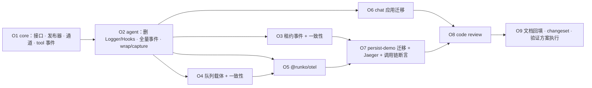

# 可观测性（事件与 OTel）— 施工计划

> 相关：[使用手册](../features/observability.md) · [技术方案](../tech/observability.md)。
> 前序：[多副本部署 · 施工计划](../../host/node/plans/multi-replica.md)（M17「框架补日志」在那里撤销，改由本计划的事件层提供）。

## 0. 一句话

**删掉框架里写死的日志与钩子，换成带类型的事件；再用 `@runko/otel` 把事件翻译成调用链，在验证环境里用 Jaeger 证明「一次跨副本的请求是一棵树」。**

**状态：未开工。** 方案在 2026-09-13 与用户对齐（七条结论见[多副本 · 技术方案 附录 D](../../host/node/tech/multi-replica.md)）。

**分两期**（用户选定）：

| 期 | 范围 | 本计划 |
|---|---|---|
| **一** | 事件层（core / agent / persist-kysely）+ `@runko/otel` + 两个宿主迁移 + 验证环境接 Jaeger | ✅ 本计划 O1–O9 |
| 二 | Cloudflare Workers（平台自带 tracing）· Vercel（`waitUntil` flush） | 另立计划 |

## 1. 起点：这些已经有了，别重做

| 件 | 位置 | 本计划怎么用 |
|---|---|---|
| AI SDK 遥测透传 `SessionTelemetry` | `packages/core/src/loop.ts` · `TurnPreparation.telemetry` | 原样保留；`@runko/otel` 往里塞 `@ai-sdk/otel` 集成 |
| core 替 AI SDK 补发工具开始 / 结束 | `loop.ts` 的 `notifyToolExecution*` | `tool.*` 事件与 `wrap` 落在同一位置 |
| 接管补收尾、`AcquireResult.takeover` | `packages/agent/src/runtime/queue.ts` · `persist-kysely/src/arbitration.ts` | `turn.displaced-settled` · `lease.taken-over` 的触发点 |
| 多副本验证环境（compose · 八个场景 · 日志收集） | `apps/persist-demo/docker/` · `test/lab.e2e.test.ts` · `scripts/lab-logs.ts` | 加 Jaeger 与调用链断言 |
| demo 文本 logger | `apps/persist-demo/src/logger.ts` | 改由事件订阅者驱动 |

## 2. 拆单总表



| 单 | 目标 | 动谁 | 大小 | 状态 |
|---|---|---|---|---|
| **O1** | 事件信封、`Observer`、`Scope`、`TraceCarrier`；发布器（吞错、wrap 嵌套与兜底、capture 合并）；`runko:*` 通道出口；`tool.*` 事件与工具执行处的 `wrap` | `@runko/core` | M | ⬜ |
| **O2** | 删 `Logger` / `RuntimeHooks`；42 处日志与 6 个钩子按技术方案 §5 迁成事件；一整轮处 `wrap`、入队处 `capture`；`createAgentRuntime({ observers })` 交给 core session | `@runko/agent` | L | ⬜ |
| **O3** | 租约版仲裁 `observers` 选项与 `lease.*` 八个事件；一致性套件加可选组「仲裁事件」 | `@runko/persist-kysely` · `@runko/conformance` | M | ⬜ |
| **O4** | `TurnInput.trace`；一致性用例「入队带的 `trace` 出队原样带回」 | `@runko/agent` · `@runko/conformance` · 四个 `persist-*` 的测试 | S | ⬜ |
| **O5** | 新包 `@runko/otel`：`otelObserver()`（turn / tool span、点状事件映射、capture / link）、`otelTelemetry()`（桥接 `@ai-sdk/otel`） | 新包 `packages/otel` | L | ⬜ |
| **O6** | chat 应用：6 个钩子 + `logger` 改成一个按类型分派的订阅者 | `apps/node-server` | M | ⬜ |
| **O7** | persist-demo：事件 → 文本行订阅者（租约行回到时间线）；`src/otel.ts`；转发注入 / 服务端 extract `traceparent`；compose 加 Jaeger；`test:lab` 加调用链断言 | `apps/persist-demo` | L | ⬜ |
| **O8** | 对本期全部改动做 code review（全新上下文的审查 agent） | 全部 | M | ⬜ |
| **O9** | 回填三份文档、agent / core / persist README、术语表；changeset；按 §4 执行验证方案并回填 | `docs` · `.changeset/` | M | ⬜ |

---

## 3. 各单详细

### O1 · core：接口、发布器、通道、工具事件

**做什么**：

1. 新文件 `packages/core/src/observability/`：`types.ts`（`EventBase`、`Observer<E>`、`Scope`、`TraceCarrier`、`ToolEvent`）、`publisher.ts`、`channel.ts`。
2. 发布器 `createPublisher(observers)` 返回 `{ emit(event), wrap(scope, run), capture() }`，规则按[技术方案 §6.1](../tech/observability.md)。
   **`wrap` 兜底是这一单最容易写错的地方**：某层抛错或忘了调 `run`，外层补调一次，且 `run` 全程只执行一次。
3. 通道出口按[技术方案 §6.2](../tech/observability.md)：`process.getBuiltinModule` 按需取模块，`hasSubscribers` 判空；turn / tool 用 `start.runStores` + 手动 `asyncEnd`。
4. `loop.ts` 的 `settleToolCall`：执行前后发 `tool.started` / `tool.finished`，执行本身放进 `wrap({ type: "tool" })`。`SessionOptions` 增加 `observers`。
5. 从 `@runko/core` 与 `@runko/sdk` 导出公共类型。

**怎么验**：单测覆盖——多个订阅者的调用顺序；一个 `onEvent` 抛错其余照常；`wrap` 嵌套顺序；`wrap` 抛错 / 不调 run / 调两次时 run 恰好执行一次且结果原样返回；无订阅者时不构造事件（计数假件）；通道出口在「模块不存在」时静默、在「有订阅者」时收到与出口一相同的对象。

**验收**：`@runko/core` 全量测试绿；`runko:tool` 与出口一对同一次工具执行给出相同的作用域对象。

### O2 · agent：删日志与钩子，全量事件化

**做什么**：

1. 删除 `logger.ts` 里的 `Logger` / `LogFields` / `noopLogger`（保留 `describeError`），删除 `RuntimeHooks` 与 `hooks` / `logger` 选项。
2. 按[技术方案 §5.1–§5.5](../tech/observability.md)的「取代」列逐行替换，**42 处日志与 6 个钩子一个不漏**——施工时把那张表当检查清单，改完 `grep -rn "logger\.\|hooks\." packages/agent/src` 应为空。
3. `runToCompletion` 里把「补收尾 + 驱动 + 收尾」包进 `wrap({ type: "turn", ... })`；**`startNextQueued` 放在包裹之外**（下一轮不该成为这一轮的子节点，它用自己的 `origin`）。
4. `enqueue` 入队前调 `capture()`，写进 `input.trace`；`startNextQueued` 出队后把它作为 `origin` 交给下一轮的 `wrap`。
5. `createAgentRuntime({ observers })` 把同一份 observers 交给 core session。

**怎么验**：现有 122 条用例里凡是断言钩子 / 日志的，改成断言事件；新增——
- 直接起轮：事件顺序 `enqueue.resolved → turn.started → turn.first-chunk → … → turn.settled`；
- 出队起轮：`wrap` 收到的 turn 作用域带 `origin`，且等于入队时 `capture` 的返回值；
- 订阅者 `onEvent` 抛错：这一轮照常完成，且不产生 `internal.error`（技术方案 §5.5 的回路约束）；
- `turn.ownership-lost`：沿用第二批「补标记时就丢了归属」那条假仲裁。

**验收**：`grep` 为空；`@runko/agent` 全量测试绿。

### O3 · 租约事件与一致性

**做什么**：`LeaseArbitrationOptions.observers`，按[技术方案 §5.6](../tech/observability.md)发八个事件（埋点位置与第二批实跑过的日志版一一对应）；三个薄壳透传同一选项，不改代码。
一致性套件新增**可选导出组** `arbitrationEventCases`（与 `arbitrationTakeoverReportCases` 同一姿态：发事件的实现才接）：首次抢占发 `lease.acquired`、被占发 `lease.busy`、顶掉发 `lease.taken-over`、围栏发 `lease.fenced`。

**怎么验**：`persist-kysely` 三方言 + `persist-sqlite` 接上新组；围栏用例沿用 `faultySqlite` 的 `hang()`。

### O4 · 调用链载体随队列项存取

**做什么**：`TurnInput.trace?: TraceCarrier`；持久化接口不改（`input` 本就是 JSON）。一致性套件 `persistenceCases` 加一条：入队带 `trace`，出队原样带回。

**怎么验**：`persist-kysely` 三方言、`persist-sqlite`，以及门禁下的 `persist-postgres` / `-mysql` / `-mongo` 真库。**Mongo 要特别看**：对象字段的键顺序与类型不被驱动改写。

### O5 · `@runko/otel`

**先做一件事（开工前的核实）**：`@ai-sdk/otel` 哪个版本与仓库的 `ai@7.0.20` 配套、它依赖的 `@opentelemetry/api` 版本。拿不到配套版本时，`otelTelemetry()` 退为「runko 自己把 AI SDK 的 `Telemetry` 回调翻成 span」，并在技术方案里记下偏差。

**做什么**：

1. `packages/otel`，`package.json` 依赖 `@opentelemetry/api`（peer）与 `@runko/agent`（类型）；与其他包同一套 tsdown 构建与发布配置。
2. `otelObserver({ tracer? })`：`wrap` → span（名称与属性按[技术方案 §8.1](../tech/observability.md)）；`onEvent` → 按 §8.2 规则记 span 事件 / 设状态 / 零时长独立 span；`capture` → `propagation.inject`。
3. `otelTelemetry()`：返回 `SessionTelemetry`。
4. README：怎么和 OTel SDK 一起装配。

**怎么验**：用 `@opentelemetry/sdk-trace-base` 的 `InMemorySpanExporter` + `AsyncLocalStorageContextManager` 写单测：
- 一轮 → 一个 `invoke_agent`，工具 → 它的子 span `execute_tool`；
- 在请求 span 上下文里起轮 → 轮 span 的 parent 是请求 span；
- 带 `origin` 起轮 → 新 trace，且 link 指向 `origin` 的 SpanContext；
- `turn.settled status=failed` → 轮 span 状态 ERROR；
- 定时器里发的 `lease.fenced` → 零时长独立 span，带会话 id；
- 模型调用（`MockLanguageModelV4`）→ 挂在轮 span 下面。

**changeset**：新包，首发版本与级别在 O9 一并问用户。

### O6 · chat 应用迁移

**做什么**：按[技术方案 §10.2](../tech/observability.md)的对照表，把 `apps/node-server/src/agent/runtime.ts` 的 `hooks` 与 `logger: log` 换成一个订阅者；框架事件 → `log.*` 的级别由 chat 应用自己定（沿用今天日志的级别作为起点）。

**怎么验**：`apps/node-server` 的 typecheck / lint / test；推送通知相关用例照绿；`turn-prepare` / `turn-first-output` 遥测写入的用例照绿。**不起常驻进程**——需要真机验证推送时，告诉用户起什么、验什么。

### O7 · persist-demo 迁移、Jaeger 与调用链断言

**做什么**：

1. `src/log-observer.ts`：事件 → 文本行（级别由 demo 定，租约的抢占 / 被占 / 释放记 info，心跳失败 / 围栏 / 被接管记 warn / error）；交给 runtime 与 `makeArbitration`。
2. `src/otel.ts`：`OTEL_EXPORTER_OTLP_ENDPOINT` 有值才注册 NodeSDK（OTLP HTTP 导出），入口 `--import` 引入；`otelObserver()` 加进 observers；`prepareTurn` 带 `otelTelemetry()`。
3. `forward.ts` 注入 `traceparent`，HTTP 层 extract 成服务端 span（优先用 `@hono/otel`，不行则手写中间件）。
4. `docker/compose.yml` 加 `jaeger` 服务（端口可用 `LAB_*` 覆盖），副本设 `OTEL_EXPORTER_OTLP_ENDPOINT`、`OTEL_SERVICE_NAME=replica-x`。
5. `test:lab` 新增断言（通过 Jaeger 的 HTTP 查询接口按 `gen_ai.conversation.id` 查 trace）：
   - **S1**：被转发的那条请求的 trace 里同时有 replica-a 与 replica-b 的 span；排队后执行的那一轮是另一个 trace，且有 link 指回它；
   - **S5 / S7**：接管那一轮的 `invoke_agent` 上有 `runko.takeover.previous_holder`；
   - **S8**：存在名为 `lease.fenced` 的 span，属于 replica-a。
6. `timeline.log` 断言：S8 的时间线里能读到 `lease.fenced`（由日志订阅者打出）。

**风险**：Jaeger 查询接口的版本差异（v1 `/api/traces` 与 v2 `/api/v3/traces`）；OTLP 导出是批量异步的，断言前要等 flush（导出间隔调小，或在测试里轮询到出现为止）。

**怎么验**：`test:lab` 8/8，连跑两次；Jaeger 界面人工看一次 S1 的树形并截图回填。

### O8 · code review

同多副本第二批的做法：全新上下文的审查 agent 只读审查，重点看——`wrap` 兜底的正确性、事件是否可结构化克隆、热路径上无订阅者时的开销、类型逃逸、事件清单与技术方案 §5 是否逐条对上、测试是否测到点。确认的问题当批修掉并重跑受影响的验证。

### O9 · 回填、changeset、验证方案执行

- 回填：三份文档状态与偏差；`packages/agent/README.md`（删 `logger` / `hooks` 的用法，换成 `observers`）；`@runko/core` README；`docs/ingress/tech/telemetry.md` 里「`onMilestone` / 钩子」的描述改成事件；多副本手册 §6.4 的「租约暂不在日志里」那段删掉。
- **changeset 的级别要先问用户**：删除 `Logger` / `RuntimeHooks` 按 CLAUDE.md 是 **major**；但包还在 0.x，major 会把 `@runko/agent` 从 0.1.x 升到 1.0.0。`@runko/otel` 的首发版本同样要确认。
- 按 §4 执行验证方案，逐格回填「实际」列。

---

## 4. 验证方案

### 4.1 运行步骤

```sh
pnpm build && pnpm typecheck && pnpm test                     # 全部包（含 @runko/otel）
pnpm -r lint
pnpm --filter @runko-chat/node-server typecheck && pnpm --filter @runko-chat/node-server test
pnpm --filter @runko-demo/persist-demo typecheck && pnpm --filter @runko-demo/persist-demo test
pnpm --filter @runko-demo/persist-demo test:lab               # 验证环境 + Jaeger，跑两次
grep -rn "logger\.\|hooks\." packages/agent/src               # 应为空
pnpm docs:check && pnpm docs:build
```

### 4.2 用例、预期与实际

| 用例 | 预期 | 实际 |
|---|---|---|
| O1 发布器：顺序、吞错、wrap 嵌套与兜底 | run 恰好执行一次、结果原样返回 | ⬜ |
| O1 通道出口：模块不存在 / 有订阅者 | 静默 / 收到同一对象 | ⬜ |
| O2 迁移完整性 | `grep` 为空；技术方案 §5 每行有对应事件 | ⬜ |
| O2 直接起轮事件顺序 | `enqueue.resolved → turn.started → … → turn.settled` | ⬜ |
| O2 出队起轮带 origin | 等于入队时 capture 的返回值 | ⬜ |
| O3 仲裁事件（可选组） | 三方言 + sqlite 全绿 | ⬜ |
| O4 队列载体原样带回 | 四个持久化实现全绿（真库在门禁下） | ⬜ |
| O5 span 形状 | 轮 / 工具父子正确；origin → link；failed → ERROR；定时器事件 → 独立 span；模型 span 挂在轮下 | ⬜ |
| O6 chat 推送与遥测 | 用例照绿，行为不变 | ⬜ |
| O7 S1 调用链 | 转发请求一棵树跨两副本；排队的轮有 link | ⬜ |
| O7 S5 / S7 / S8 | 接管属性、`lease.fenced` span、时间线里的围栏行 | ⬜ |
| 不传 observers | 行为与今天一致，不打任何日志 | ⬜ |

## 5. 三处容易做错

**① `wrap` 改变了行为。** 订阅者抛错、不调 `run`、调两次——任何一种都不能让这一轮少跑或多跑。观测代码出错，业务照常。

**② 下一轮被包进了上一轮。** `startNextQueued` 在 `runToCompletion` 末尾调用，一不小心就落在上一轮的 `wrap` 里，于是 Jaeger 里一个会话的所有排队轮串成一根越来越深的链。它必须在包裹之外，用自己的 `origin`。

**③ 在定时器里用「当前 span」。** 心跳回调里的当前 span 是早已结束的请求 span，往上记事件会被静默丢掉。按技术方案 §8.2 走独立 span。

## 6. 非目标

见[技术方案 §12](../tech/observability.md)：指标与 Logs API、Cloudflare Workers 与 Vercel（第二期）、自动插桩第三方库、替换 chat 应用的 SQLite 遥测、采样与导出配置。

## 7. 变更记录

| 日期 | 变更 |
|---|---|
| 2026-09-13 | 立项。方案七条结论见多副本技术方案附录 D；分两期，本计划为第一期 O1–O9 |
