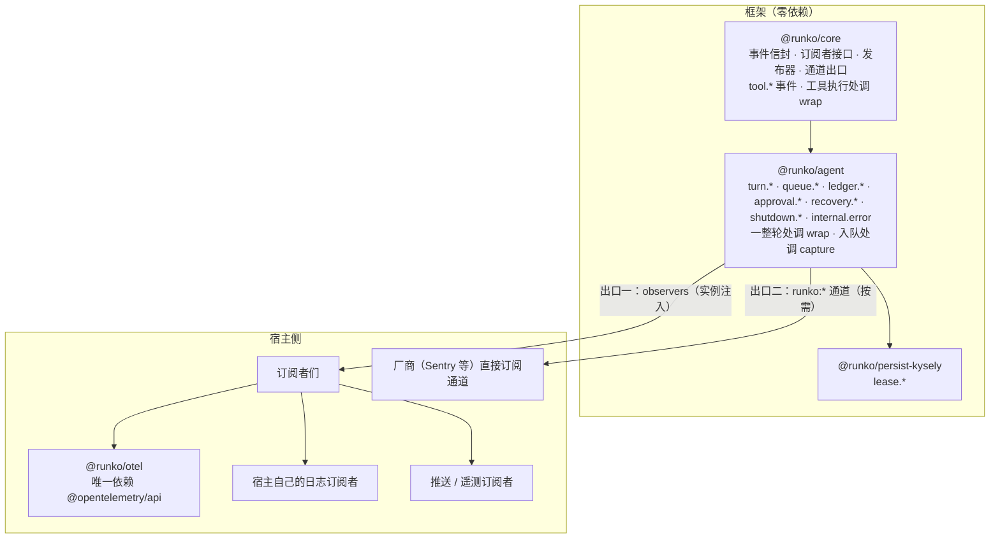
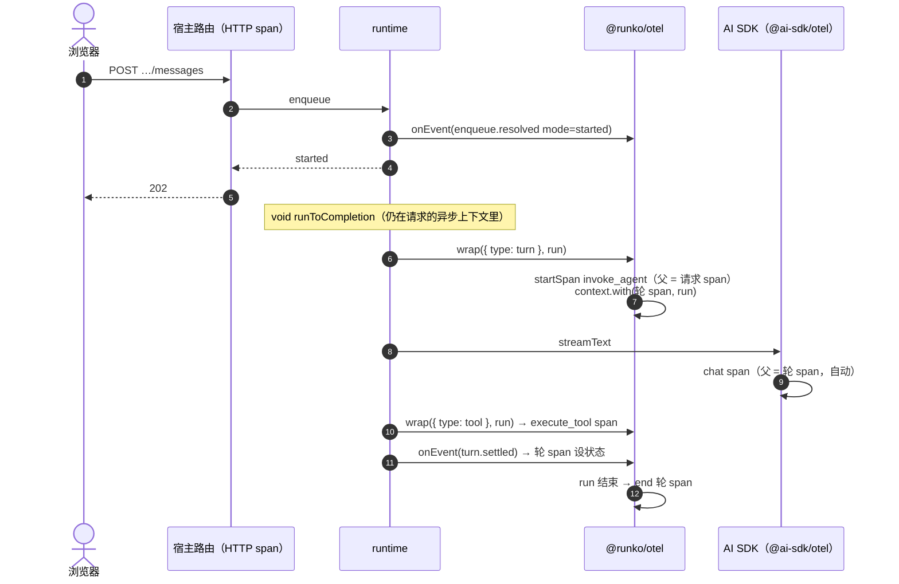
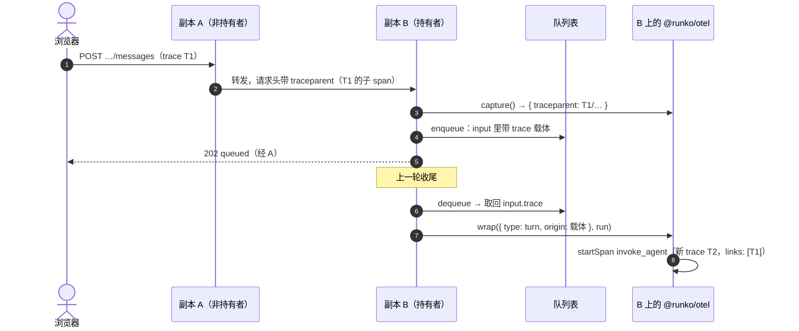
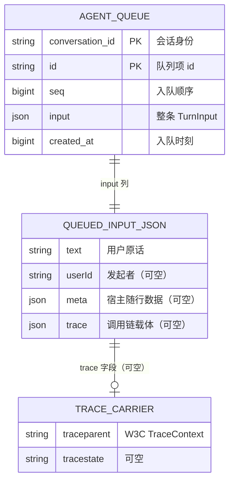

# 可观测性（事件与 OTel）— 技术方案

> 相关：[使用手册](../features/observability.md) · [施工计划](../plans/observability.md) · [agent 内核包 · 技术方案](./agent-kernel.md)。
> 来由：[多副本部署 · 技术方案 附录 D](../../host/node/tech/multi-replica.md)——七条结论在那里对齐，本文把它们落成接口与施工口径。
> 术语：[可观测性事件](../../terms.md) · [订阅者](../../terms.md) · [包裹](../../terms.md) · [调用链载体](../../terms.md) · [runko 通道](../../terms.md) · [遥测](../../terms.md)。
>
> **状态：设计定稿待施工。**

## 1. 一句话

**框架只报告「发生了什么」（带类型的纯数据事件），宿主的订阅者决定怎么处理。** 同一份事件从两个出口出去：
框架自定义的订阅接口（所有运行环境），与按需发布的 `runko:*` 通道（有 `diagnostics_channel` 的环境）。
事件到 OTel span 的翻译放进独立的 `@runko/otel`——**只有它依赖 `@opentelemetry/api`**。

## 2. 现状：框架今天怎么对外说话

| 口子 | 在哪 | 规模 | 问题 |
|---|---|---|---|
| 注入式 `Logger` | `packages/agent/src/logger.ts`，调用散在 `runtime.ts` · `runtime/{queue,turn,human}.ts` | 42 处（error 15 · warn 14 · info 9 · debug 3） | 文案与级别写死在框架里 |
| `RuntimeHooks` | `packages/agent/src/runtime/context.ts` | 6 个：`onTurnStart` · `onTurnSettled` · `onFirstChunk` · `onFirstOutput` · `onApprovalPending` · `onQuestionPending` | 覆盖面窄；与 Logger 是两套相似机制 |
| AI SDK 遥测透传 | `packages/core/src/loop.ts` 的 `SessionTelemetry`，经 `TurnPreparation.telemetry` 注入 | 模型调用 + core 替 AI SDK 补发的工具开始/结束 | 只管模型那一段；关联键是 `"<sessionId>#<turn>"` |
| 租约仲裁 | `packages/persist-kysely/src/arbitration.ts` | **零** | 抢占、接管、心跳失败、自我围栏都看不见 |

唯一的消费方：chat 应用（`apps/node-server/src/agent/runtime.ts` 用了全部 6 个钩子 + 注入 logger）。
`apps/cloudflare-worker-server` 只用 `@runko/sdk`，不经过 `@runko/agent`，本次不受影响。

## 3. 总体设计



**依赖方向不变**：`core` 是根。事件的**公共部分**（信封、订阅者接口、发布器、通道出口、`tool.*`）在 `core`；
`agent` 在其上扩出自己的事件并导出完整的联合类型 `RunkoEvent`；`persist-kysely` 本来就依赖 `agent`，直接用。

## 4. 接口

### 4.1 订阅者

```ts
// @runko/core
export interface Observer<E extends { type: string }> {
  /** 收事件。**同步、要便宜**：它在框架的热路径上被调用。抛错一律吞掉。 */
  onEvent?(event: E): void;
  /** 包裹一段执行（只有 turn 与 tool 两种）。必须调用且只调用一次 run，并原样返回它的结果。 */
  wrap?<T>(scope: Scope, run: () => Promise<T>): Promise<T>;
  /** 入队时抓调用链载体。返回的键值会随输入存进队列项。 */
  capture?(): TraceCarrier | undefined;
}

export type TraceCarrier = Record<string, string>;   // 如 { traceparent, tracestate }

// @runko/agent
export type RunkoObserver = Observer<RunkoEvent>;
```

### 4.2 事件信封

每个事件都是**可结构化克隆的纯数据**（Cloudflare Workers 会把通道消息转发给 Tail Workers，必须能克隆）：
不带函数、不带 `Error` 实例——出错原因一律是 `{ name, message }`。

```ts
interface EventBase {
  type: string;          // 判别字段，形如 "lease.taken-over"
  at: number;            // Date.now()
  conversationId?: string;
}
```

### 4.3 包裹的作用域

```ts
export type Scope =
  | { type: "turn"; conversationId: string; holder: string; takeover?: { holder?: string }; origin?: TraceCarrier }
  | { type: "tool"; conversationId: string; toolCallId: string; toolName: string };
```

`origin` 只在**出队起轮**时有值（直接起轮时，这一轮本来就跑在请求的异步上下文里，见 §7.1）。

### 4.4 装配

```ts
createAgentRuntime({ ..., observers });                       // runtime 负责把它交给自己创建的 core session
postgresArbitration(pool, { holder, observers });             // 宿主自己构造的组件各收一份
```

**不提供全局注册**：进程级零配置订阅由 [runko 通道](../../terms.md)满足。

## 5. 事件清单

「取代」列说明它顶替了哪处日志或钩子——**42 处日志与 6 个钩子逐一有着落**，施工时按这张表迁移。

### 5.1 轮（`@runko/agent`）

| 事件 | 字段 | 取代 |
|---|---|---|
| `turn.started` | `holder` · `turn` · `takeover?` · `input` | 钩子 `onTurnStart` |
| `turn.first-chunk` | `sessionId` · `turn` · `sinceStartMs` | 钩子 `onFirstChunk` |
| `turn.first-output` | `sessionId` · `turn` · `sinceStartMs` | 钩子 `onFirstOutput` |
| `turn.settled` | `turn` · `status` · `durationMs` · `input` | 钩子 `onTurnSettled` · 日志 `turn finished` · `turn stopped before it started` |
| `turn.abort-requested` | `reason` | 日志 `turn abort requested` |
| `turn.ownership-lost` | `holder` | （新增）|
| `turn.displaced-settled` | `previousHolder?` · `seq` 或 `failed: { reason }` | 日志 `took over from a stale holder…` · `could not settle the displaced holder's turn` · `settling the displaced holder's turn threw` |
| `turn.persisted` | `messageCount` | 日志 `turn persistence finalized` |

### 5.2 队列与账本（`@runko/agent`）

| 事件 | 字段 | 取代 |
|---|---|---|
| `enqueue.resolved` | `mode`（started / queued / steered / rejected）· `reason?` · `holder?` | （新增，原先由宿主自己记） |
| `queue.dequeued` | `itemId` | 日志 `dequeued input, starting next turn` |
| `queue.requeued` | `itemId` · `reason`（shutting_down / busy / held_by_other） | 日志 `shutting down, queued input put back` · `failed to start queued turn, input put back` |
| `ledger.appended` | `seq` · `role` | （新增） |
| `ledger.write-rejected` | `stage`（user-message / settle-marker / finalize）· `reason`（lost_ownership / rejected）· `seq?` | 日志 `lost ownership before persisting the user message` · `user message write rejected` · `lost ownership before persisting the settle marker` · `settle marker rejected by the ledger` · `lost ownership mid-finalize` · `ledger write rejected mid-finalize` |

### 5.3 人在回路（`@runko/agent`）

| 事件 | 字段 | 取代 |
|---|---|---|
| `approval.pending` | `callId` · `toolName` · `input` · `userId?` · `timeoutMs` | 钩子 `onApprovalPending` |
| `question.pending` | `callId` · `question` · `options?` · `userId?` · `timeoutMs` | 钩子 `onQuestionPending` |
| `decision.record-failed` | `callId` · `kind`（record-decision / record-question / settle） · `error` | 日志 `failed to record pending decision` · `failed to record pending question` · `failed to settle decision record` |

### 5.4 恢复与关闭（`@runko/agent`）

| 事件 | 字段 | 取代 |
|---|---|---|
| `recovery.turn-recovered` | `seq` | 日志 `recovered orphaned turn` |
| `recovery.swept` | `scanned` · `recovered` | 日志 `startup sweep finished`（两处） |
| `shutdown.started` | `count` · `graceMs` | 日志 `shutdown: aborting active turns` · `shutdown: no active turns` |
| `shutdown.settled` | `aborted` · `timedOut` · `pending` | 日志 `shutdown: all turns settled` · `shutdown: timed out waiting for turns to settle` |

### 5.5 意外（`@runko/agent`）

一个事件、一个 `where` 字段，覆盖所有「框架自己兜住了、但不该发生」的情况：

| `where` | 取代 |
|---|---|
| `turn.assembly` | `turn assembly failed` |
| `turn.persist-failed-turn` | `failed to persist the failed turn` |
| `turn.drive` | `turn threw unexpectedly` · `turn driver rejected unexpectedly` · `turn settle path rejected unexpectedly` |
| `turn.snapshot` | `session.toJSON() threw…` |
| `turn.dispose` | `prepareTurn dispose threw` |
| `settle-step`（带 `step`） | `settle step failed, continuing` |
| `queue.drain-fallback` | `drain fallback failed` |
| `queue.steer-policy` | `steer policy threw; falling back to queueing` |
| `recovery` | `failed to recover orphaned turn` |

字段：`where` · `step?` · `error: { name, message }`。原先的 `runtime hook threw` · `onTurnSettled hook threw` · `human bridge hook threw`
三处随钩子一起消失——**订阅者抛错不发事件**（否则订阅者出错会引发给自己的事件，形成回路），只在通道出口上发一条 `runko:observer-error`。

### 5.6 租约（`@runko/persist-kysely`）

| 事件 | 字段 | 说明 |
|---|---|---|
| `lease.acquired` | `holder` · `token`（前 8 位） | 抢到（没顶掉谁） |
| `lease.busy` | `holder?` · `lostRace` | 被占；`lostRace` = 读的时候没人，条件 UPDATE 输了 |
| `lease.taken-over` | `holder` · `previousHolder?` · `staleForMs` · `token` | 顶掉过期持有者（即 `AcquireResult.takeover`） |
| `lease.heartbeat-failed` | `token` · `sinceLastBeatMs` · `error` | 一拍心跳抛错（挂住不返回的那种进不来，由 `lease.fenced` 兜） |
| `lease.fenced` | `token` · `sinceLastBeatMs` · `fenceAtMs` | 自我围栏停手 |
| `lease.lost` | `token` · `noticedBy`（heartbeat / seq） · `holder?` | 发现令牌已被换掉 |
| `lease.released` | `token` · `heldMs` · `lost` | 释放（被围栏或被接管之后的释放 `lost: true`） |
| `lease.stale-found` | `count` | 启动扫描扫到陈旧租约 |

成功的心跳**不发**：每个活跃会话每拍一条，只是噪音。这一组的埋点位置已经验证过：多副本第二批施工时曾以注入
logger 的形式实跑（未提交），验证环境的时间线里能读出「心跳失败 → 自我围栏 → 顶掉过期租约」。

### 5.7 工具（`@runko/core`）

| 事件 | 字段 | 说明 |
|---|---|---|
| `tool.started` | `toolCallId` · `toolName` | `settleToolCall` 真正执行之前（deny / 未知工具 / 畸形调用从未执行，不发） |
| `tool.finished` | `toolCallId` · `toolName` · `status`（completed / failed） · `durationMs` | 执行结束 |

与 core 已有的「替 AI SDK 补发 `onToolExecutionStart/End`」同一时刻、互不替代：那是给 AI SDK 遥测集成的，这是给订阅者的。

## 6. 发布机制

### 6.1 订阅者（出口一）

`@runko/core` 提供一个发布器，`agent` 与 `persist-kysely` 都用它，规则只写一遍：

| 规则 | 为什么 |
|---|---|
| `onEvent` 按注册顺序同步调用，**每个都单独 try/catch** | 一个订阅者坏了不影响其他订阅者，更不影响这一轮 |
| `wrap` 按注册顺序**由外向内**嵌套：`o1.wrap(scope, () => o2.wrap(scope, run))` | 与中间件同一直觉；OTel 订阅者放第一个，它的 span 就包住其余订阅者 |
| **某个 `wrap` 抛错或没调用 `run` 时，框架照常执行 `run`** | 观测不能改变行为。实现：每层记下「run 是否已被调用」，外层兜底补调一次，并保证只执行一次 |
| `capture` 的结果按注册顺序合并（后者覆盖同名键） | 多个订阅者各写自己的键（`traceparent` 与厂商私有头） |
| 没有订阅者时不构造事件对象 | 事件字面量在热路径上，`observers.length === 0` 时直接跳过 |

### 6.2 通道（出口二）

| 通道 | 类型 | 发布内容 |
|---|---|---|
| `runko:turn` | `TracingChannel` | 包裹一整轮：`start` 带 turn 作用域，`asyncEnd` 带 `{ status }`，`error` 带错误 |
| `runko:tool` | `TracingChannel` | 包裹单次工具执行 |
| `runko:event` | 普通 `Channel` | 全部点状事件，原样发布 |
| `runko:observer-error` | 普通 `Channel` | 某个订阅者抛错（`{ where: "onEvent" \| "wrap" \| "capture", error }`） |

- **按需加载**：`globalThis.process?.getBuiltinModule?.("node:diagnostics_channel")`，拿不到就整个出口不存在。**不静态 import**，打包器与浏览器不报错（mysql2、graphql、`ai@7` 同一做法）。
- **没人订阅不发布**：先判 `hasSubscribers`。
- **流式的一轮套不上 `tracePromise`**：`end` 在函数返回 promise 那一刻就发了。照 AI SDK 的做法手动发：`start.runStores(scope, run)`，结束时发 `asyncStart` / `asyncEnd`。
- 事件形状与出口一**完全相同**，由同一个发布器发出，不会漂移。

## 7. 上下文与调用链

### 7.1 直接起轮：这一轮是请求的子节点

`enqueue` → `startTurn` → `void runToCompletion(...)` 全程跑在 HTTP 请求的异步上下文里。`AsyncLocalStorage` 会跟着
`void` 出去的 promise 走，所以 `wrap` 被调用时，OTel 的「当前 span」就是请求 span，轮 span 自然成为它的子节点。
OTel 允许子 span 比父 span 结束得晚（请求 202 早就返回了）。



### 7.2 排队后起轮：用 link 接回原请求



同一模式适用于**换副本出队**：载体在库里，谁出队谁接得回来。

### 7.3 转发：宿主的事，但文档要点明

副本之间的转发属于同一次请求，**父子关系**就对：转发方 `propagation.inject(context.active(), headers)`，持有者一侧的 HTTP
中间件 `extract`。装了 `@opentelemetry/instrumentation-undici` 时 `fetch` 会自动注入，不用手写。chat 应用会示范。

### 7.4 定时器里的事件没有「当前轮」

租约心跳的 `setInterval` 是在 `acquire`（请求上下文）里建的，回调里的「当前 span」是早已结束的请求 span。所以
`lease.heartbeat-failed` / `lease.fenced` / `lease.lost` 这类事件**不能**当成「当前 span 上的事件」处理，见 §8.2 的规则。

## 8. `@runko/otel` 的映射

### 8.1 包裹 → span

| 作用域 | span 名 | kind | 属性 |
|---|---|---|---|
| `turn` | `invoke_agent` | INTERNAL | `gen_ai.operation.name=invoke_agent` · `gen_ai.conversation.id` · `runko.turn` · `runko.holder` · `runko.takeover.previous_holder?`；有 `origin` 时加 link |
| `tool` | `execute_tool {toolName}` | INTERNAL | `gen_ai.operation.name=execute_tool` · `gen_ai.tool.name` · `gen_ai.tool.call.id` |

`gen_ai.*` 语义约定仍是 **Development** 状态（已迁到 `open-telemetry/semantic-conventions-genai`），命名随它更新；
租约、账本、队列这些 runko 自己的概念一律 `runko.*`，不硬套 `gen_ai`。

### 8.2 点状事件 → span 事件或独立 span

| 情况 | 处理 |
|---|---|
| 当前有**还在记录**的 span（`span.isRecording()`），且事件的 `conversationId` 与该 span 的一致 | 记成这个 span 上的 event（名 = `type`，字段 → 属性） |
| `turn.settled` | 额外给轮 span 设 status：`failed` / `crashed` → ERROR，其余 OK |
| `internal.error` · `lease.fenced` · `lease.lost` | 当前 span 上 `recordException`；没有可用 span 时见下一行 |
| 没有可用 span（定时器、启动扫描、关闭） | 建一个**零时长的独立 span**（名 = `type`，带 `gen_ai.conversation.id`），便于按会话搜到 |

### 8.3 capture

`propagation.inject(context.active(), carrier)`，全局 propagator 缺省是 W3C TraceContext。出队时 `propagation.extract` 出 `SpanContext` 作 link。

### 8.4 AI SDK 的模型调用

`otelTelemetry()` 返回一个 `SessionTelemetry`，内部是 `@ai-sdk/otel` 的集成。它跑在轮 span 的上下文里，所以模型调用 span 自动挂在轮下面。
**版本对齐是施工风险**：`@ai-sdk/otel` 要与仓库的 `ai@7.0.20` 配套，施工第一步先核实（施工计划 O5）。

## 9. 数据模型：调用链载体存在队列项里

**不改表结构。** 队列表的 `input` 列本来就是整条输入的 JSON（Mongo 是文档字段），`TurnInput` 多一个框架字段即可：

```ts
export interface TurnInput {
  text: string;
  userId?: string;
  meta?: JsonValue;
  /** 调用链载体。框架只存、只传、不解释；宿主业务代码不该读写它。 */
  trace?: TraceCarrier;
}
```



一致性套件加一条：**入队时带的 `trace` 出队时原样带回**——四个持久化实现都要过（Mongo 那一档要确认对象字段不被驱动改写）。

## 10. 迁移

### 10.1 破坏性变更

| 删除 | 替代 |
|---|---|
| `Logger` · `LogFields` · `noopLogger` 导出；`createAgentRuntime` 的 `logger` 选项 | `observers` + 宿主自己的日志订阅者 |
| `RuntimeHooks` 及其 6 个回调；`createAgentRuntime` 的 `hooks` 选项；`ApprovalPendingEvent` · `QuestionPendingEvent` 独立导出 | `approval.pending` · `question.pending` 等事件（字段不变） |

`describeError` 保留（它是纯函数，事件里的 `error` 字段仍用它归一化）。

### 10.2 chat 应用（`apps/node-server`）

`agent/runtime.ts` 里 6 个钩子 + `logger: log` 改成一个订阅者：

| 原来 | 改成按 `event.type` 分派 |
|---|---|
| `onTurnStart` → `markActive` | `turn.started` |
| `onFirstChunk` → 日志 `turn prepared` + 遥测 `turn-prepare` | `turn.first-chunk` |
| `onFirstOutput` → 遥测 `turn-first-output` | `turn.first-output` |
| `onTurnSettled` → `markActive` + 推送 | `turn.settled` |
| `onApprovalPending` / `onQuestionPending` → 推送 | `approval.pending` / `question.pending` |
| 框架 42 处日志经 `logger: log` 输出 | 同一个订阅者把其余事件翻成 `log.*`（级别由 chat 应用自己定） |

验收看两件事不变：推送通知三类照常弹、`telemetry.db` 里 `turn-prepare` 与 `turn-first-output` 照常有行。

### 10.3 chat 应用

- `src/logger.ts` 保留；新增一个「事件 → 文本行」的订阅者，同时交给 runtime 与租约仲裁。`timeline.log` 重新读得出租约行。
- 新增 `src/otel.ts`：设了 `OTEL_EXPORTER_OTLP_ENDPOINT` 才启用 OTel SDK（`--import` 注册）；转发时注入 `traceparent`，HTTP 层 extract。
- compose 加一个 Jaeger 容器（UI 16686，OTLP 4318）；`test:lab` 加调用链断言（施工计划 O7）。

## 11. 取舍与已知限制

- **事件是纯数据、同步回调**：`onEvent` 里做慢事（同步写文件、发网络请求）会拖慢热路径。约定是订阅者自己缓冲；框架不替它开队列。
- **`wrap` 只在两处**：租约抢占、写账本这类叶子操作在 OTel 里是轮 span 上的 event，不是子 span。想看它们各自耗时，靠事件里的 `*Ms` 字段。
- **通道出口的上下文传播依赖实验性 API**：`bindStore` 在 Node 仍标 Experimental，OTel 的 attach/detach 还没进 `@opentelemetry/api`。所以 `@runko/otel` 走出口一，**不订阅通道**；通道留给厂商。
- **`gen_ai.*` 约定会变**：它还是 Development。属性名集中在 `@runko/otel` 一处，变了只改一处。
- **订阅者出错不发事件**，只进 `runko:observer-error` 通道——没有通道的环境里，订阅者自己的 bug 是静默的。

## 12. 非目标

- **指标（metrics）与 OTel Logs API。** 事件里有算指标需要的字段，要做另起一期。
- **Cloudflare Workers 与 Vercel。** 下一期：Workers 用平台自带的 tracing（`cloudflare:workers` 的自定义 span），Vercel 要在 `waitUntil` 里 flush。
- **自动插桩第三方库**（HTTP 框架、数据库驱动）：用 OTel 社区现成的。
- **替换 chat 应用的 SQLite 遥测**：保留，二者并存。
- **采样、导出目的地、资源属性的配置**：宿主按 OTel 官方做法配。

## 附录 A：业界做法调研要点（2026-09）

| 模式 | 代表（已核实） | 对 runko |
|---|---|---|
| 库直接依赖 `@opentelemetry/api` | Next.js（可选 peer）、`@trigger.dev/sdk`、`@hono/otel`、`@fastify/otel`、`@ai-sdk/otel` | 只适合放进 `@runko/otel` 这个适配包 |
| 外部猴子补丁 | contrib 的 `instrumentation-*` | ESM / 打包 / Workers 下不可靠，不用 |
| 库发 `diagnostics_channel` 事件 | undici、fastify、mysql2 ≥3.20、ioredis 5.11、`@redis/client`、graphql 17、h3、nitro、`ai@7` | 做第二出口 |
| 库自带回调接口 + 适配包 | AI SDK v7（`Telemetry`）、Prisma、Mastra、OpenAI Agents JS | 做主出口 |

AI SDK v7 同时用了后两种：`Telemetry` 回调接口 + `registerTelemetry()`，并发布 `ai:telemetry` 通道（本地 `ai@7.0.20` 构建产物里核实过），
OTel 映射在独立的 `@ai-sdk/otel`。runko 与它同构，区别是**不做全局注册**（见 §4.4）。

| 运行环境 | `TracingChannel` | `AsyncLocalStorage` |
|---|---|---|
| Node 22 / 24 | 有（文档标 Experimental） | 有 |
| Node 26 | 26.8 起 Stable（`bindStore` 仍 Experimental） | 有 |
| Bun | 有（`bindStore` 未核实） | 有 |
| Deno | 兼容表列为支持（`AsyncResource` 是空壳） | 有 |
| Cloudflare Workers | 有（需 `nodejs_compat`；消息须可结构化克隆） | 有 |
| Vercel Node 运行时 | 有 | 有 |
| Vercel Edge · 浏览器 | **没有** | Edge 有 · 浏览器没有 |

参考：[Node diagnostics_channel](https://nodejs.org/api/diagnostics_channel.html) ·
[AI SDK 遥测](https://ai-sdk.dev/docs/ai-sdk-core/telemetry) ·
[OTel issue #6088](https://github.com/open-telemetry/opentelemetry-js/issues/6088) ·
[Sentry: tracing channels](https://blog.sentry.io/observability-with-tracing-channels/) ·
[CF Workers diagnostics channel](https://developers.cloudflare.com/workers/runtime-apis/nodejs/diagnostics-channel/) ·
[OTel 消息系统 span 约定（link）](https://opentelemetry.io/docs/specs/semconv/messaging/messaging-spans/) ·
[GenAI 语义约定仓库](https://github.com/open-telemetry/semantic-conventions-genai)。
