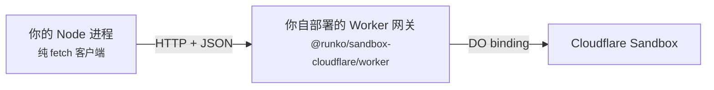

# Cloudflare（宿主层）— 使用手册

> 相关：[技术方案](../tech/deployment.md)，本档的参考实现见 [Cloudflare Worker Server · 功能](../features/cloudflare-worker-server.md)。
> 另外三档宿主：[Node 长驻](../../node/features/deployment.md) · [Vercel](../../vercel/features/deployment.md) · [E2B](../../e2b/features/deployment.md)。
> 术语：[归属仲裁机制](../../../terms.md) · [网关形态](../../../terms.md) · [独占](../../../terms.md)。

## 1. 一句话

**Durable Object 把[归属仲裁](../../../terms.md)整个白送了**——一个会话就是一个 Durable Object，平台自己保证同一时刻只有一个实例、而且串行处理请求。这一档不用租约、不用心跳、不用 CAS。

> Durable Object 里的 "Object" 是**面向对象那个「对象」**，不是「对象存储」。Cloudflare 的对象存储叫 R2。

## 2. 白送的和要还的

| 能力 | 这一档怎么办 | 比 Node 那档省事还是费事 |
|---|---|---|
| [归属仲裁机制](../../../terms.md) | **什么都不做**，平台保证单实例 | **大幅省事**——独占是真保证，不是尽力保证 |
| [持久化](../../../terms.md) | Durable Object 自带 SQLite（`ctx.storage.sql`） | 省事，但**每个会话一个独立存储** |
| [流分发](../../../terms.md) | 平台自带——订阅方直接连到那个实例 | 省事，不用外挂任何东西 |
| [沙盒](../../../terms.md) | `@runko/sandbox-cloudflare` | **费事**——SDK 只能在 Worker 里跑，见 §4 |

**这一档要还的债只有两笔**：跨会话查询要自己建索引（§3），沙盒接法要绕一下（§4）。

## 3. 每个会话一个独立存储，意味着什么

Durable Object 的存储是**跟着对象走的**。会话 A 的 DO 看不见会话 B 的数据。

所以「列出这个用户的所有会话」这类**跨会话查询做不了**——你得自己在外面（D1、KV 之类）再建一张索引表，会话创建时往里写一行。

这不是缺陷，是「一个会话 = 一个隔离单元」这个模型的直接代价。换来的就是那个白送的归属仲裁。

## 4. 沙盒要绕一下：网关形态

Cloudflare Sandbox 的 SDK **只能跑在 Cloudflare Workers 里**——它靠 Durable Object binding 工作，没有对外的 REST 通道。普通 Node 进程连不上它。

接法是[网关形态](../../../terms.md)：

`@runko/sandbox-cloudflare` 因此是**双入口**——`.` 是客户端（任意 Node 进程可用），`./worker` 是网关（放进你的 wrangler 项目）。

**好消息**：以后再接别的「连不上」的沙盒，这套协议和客户端可以直接复用，只需重写网关那一侧。

## 5. 一个 Worker 能同时干两件事

参考实现 [Cloudflare Worker Server](../features/cloudflare-worker-server.md) 就是一个双角色 Worker：**进程内直连真实沙盒**跑 agent，**同时对外提供网关端点**给别人连。

这不是硬凑——两件事都需要「能碰到 Sandbox binding」，合在一个 Worker 里省一次部署。

## 6. 成功标准

- 部署一个 Worker，**不配任何外部数据库、不配 Redis**，就能跑起有持久化、能断线续传的多轮对话。
- 同一个会话被并发请求打到，**不需要写任何加锁代码**就不会互相踩。
- 从 Node 那档迁过来，**换的是四个实现不是业务代码**。

## 7. 范围与非目标

- **不解决跨会话查询。** 索引表你自己建，框架不管。
- **不在 Workers 里跑完整 runko 是可选的，不是必须的。** 实测证明核心零改动可以跑在 workerd 上（见[技术方案](../tech/deployment.md)附录），但默认推荐的是网关形态。
- **单次执行时长没有硬上限**，但 CPU 时间有额度——细节见[技术方案](../tech/deployment.md)。
