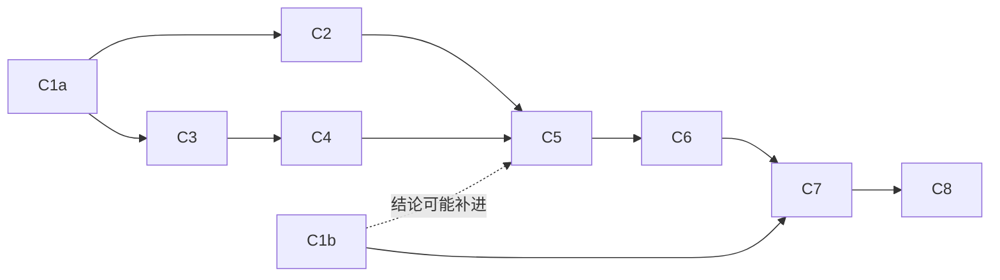

# chat 应用上 Cloudflare — 施工进展

> 要做什么见[功能手册](../features/chat-on-cloudflare.md)；怎么做见[技术方案](../tech/chat-on-cloudflare.md)。术语见 [术语表](../../../terms.md)。

## 当前状态

| 阶段 | 内容 | 状态 |
|---|---|---|
| C0 | 三份文档、术语表（会话对象） | ✅ |
| C1a | **本地可行性实测**（`wrangler dev`，不要账号）：技术方案 §11 的 3、4、5 条 + 一个最小会话对象跑通 agent | 待做 |
| C1b | **线上可行性实测**（要 Cloudflare 付费档账号）：技术方案 §11 的 1、2、6 条 | 待做 |
| C2 | `@runko/durable-object`：会话对象 SQLite 的 Kysely 方言 + 运行时装配；持久化一致性用例在 workerd 里全过 | 待做 |
| C3 | 抽共用层 `apps/chat-shared`：Node 版行为不变 | 待做 |
| C4 | `apps/cloudflare-server` 骨架：Worker、静态资源、D1、better-auth、会话列表与建会话 | 待做 |
| C5 | 会话对象：发消息、直播（SSE / WebSocket）、停止、队列、审批与挂起、重启后恢复 | 待做 |
| C6 | 沙盒：本地沙盒、Cloudflare 沙盒（规格、提前唤醒）、GitHub 选仓库 | 待做 |
| C7 | 部署脚本与部署说明、用量提醒 | 待做 |
| C8 | 测试补齐、清理旧注释、代码审查、端到端（`wrangler dev` + 浏览器）、真部署验收 | 待做 |

**顺序**：

- **C1a 最先做**：它证明「这套东西在 workerd 里跑得起来」，过了之后 C2–C6 的开发与测试都能在本地完成。
- **C1b 不挡开发，但挡上线**：它验的三条（长轮会不会被回收、CPU 上限、部署时怎么重启）只有线上才看得到，本地模拟器不回收会话对象、也不限制 CPU。C5 照「重启后恢复 + 定时唤醒」来做（不管 C1b 结论如何都要有），C1b 的结论只决定要不要再加保活手段。**C7（部署）之前必须做完 C1b**。
- C2 与 C3 互不依赖，可以并行。C4 依赖 C3；C5 依赖 C2、C4；C6 依赖 C5；C7、C8 最后。

## 各阶段

### C1a · 本地可行性实测（不要账号）

本机开着 Docker，`wrangler dev` 起一个最小 Worker，逐条验（编号对应[技术方案 §11](../tech/chat-on-cloudflare.md)）：

| # | 要证明什么 | 怎么证明 | 不成立的话 |
|---|---|---|---|
| 3 | better-auth 在 Workers + D1 上能用 | 注册、登录、拿登录态；GitHub 回调走到 better-auth 的回调处理（本地不真连 GitHub） | 换 better-auth 的 D1 原生适配，或者退回自己写登录 |
| 4 | D1 建表 | Kysely 迁移导出 SQL，`wrangler d1 migrations apply --local` | 手写 SQL 迁移（不推荐） |
| 5 | 会话对象里调沙盒、克隆时带环境变量 | 起一个 `standard-1` 沙盒（本机 Docker），带环境变量跑一条 `git clone`（公开仓库） | 令牌先写进沙盒里一个临时文件，克隆时用凭据助手读 |
| — | 最小会话对象跑通 agent | 会话对象里 `createAgentRuntime`（演示模型、本地沙盒、内存持久化即可），发一条消息、SSE 收到直播 | 方案不成立，回到技术方案重新选 |
| — | 本地模拟器会不会回收会话对象 | 跑一个几分钟的任务，期间不连浏览器，看日志 | 只用来解释本地与线上的差别，不影响结论 |

- **产出**：每条一行结论，回填到下面的「实测结果」；不成立的同步改技术方案。

### C1b · 线上可行性实测（要付费档账号）

部署一个最小 Worker 到测试账号上：

| # | 要证明什么 | 怎么证明 | 不成立的话 |
|---|---|---|---|
| 1 | 长轮期间会话对象不被回收 | 会话对象里跑一个 30 分钟、每隔几秒发一次网络请求的任务，期间没有任何浏览器连着；看能不能跑完 | 加保活手段，或者接受「定时唤醒 + 断了就补已中断」（技术方案 §4.2） |
| 2 | 会话对象 CPU 不撞上限 | 同上，看计费面板与日志里的 CPU 用量 | 在配置里把 CPU 上限调高 |
| 6 | 部署时会话对象怎么重启 | 跑着一轮时部署新版本，看这一轮与连着的直播 | 只影响用户提示，写进已知限制 |

- 顺便记下线上真实数字：沙盒冷启动多少秒、会话对象首次唤醒多少毫秒。
- **产出**：回填「实测结果」；结论补进技术方案 §4.2、§11。

### C2 · `@runko/durable-object`

- **文件**：`packages/durable-object/`（新包）：Kysely 方言（编译用 SQLite 编译器，执行交给 `ctx.storage.sql.exec`）、`createDurableObjectRuntime(ctx, opts)` 装配；README；changeset（minor，新包）。
- **产出**：`@runko/conformance` 的持久化用例在 `@cloudflare/vitest-pool-workers` 里全过。

### C3 · 共用层 `apps/chat-shared`

- **文件**：新包 `apps/chat-shared`；从 `apps/node-server` 挪出技术方案 §7 那张表里的模块；GitHub App 的 JWT 改用 WebCrypto；定义「会话后端」接口，Node 版实现它。
- **产出**：`apps/node-server` 全部测试与集群端到端四套照旧全绿（行为不变是这一步唯一的验收）。

### C4 · Worker 骨架

- **文件**：新包 `apps/cloudflare-server`：`wrangler.jsonc`（D1、会话对象、沙盒绑定，静态资源单页回退）、Worker 入口（共用路由 + Cloudflare 版会话后端）、D1 迁移。
- **产出**：`wrangler dev` 起来能注册、登录、建会话（先用本地沙盒）、列会话。

### C5 · 会话对象

- **文件**：`apps/cloudflare-server/src/conversation-object.ts` 等。
- **产出**：技术方案 §3、§4 的全部行为：发消息、SSE 与 WebSocket 直播、断线续传、停止、排队与插话、审批、挂起（内存窗口调短）与恢复、重启后恢复（定时唤醒）、会话列表状态回写。

### C6 · 沙盒

- **文件**：本地沙盒（快照存会话对象 SQLite）；Cloudflare 沙盒接入（`standard-1`、打开会话时提前唤醒、闲置休眠）；GitHub 选仓库（克隆绕过网关带环境变量、令牌文件、凭据助手）。
- **产出**：功能手册 §5 第 3 条。

### C7 · 部署

- **文件**：部署脚本（建 D1 → 迁移 → 打包前端 → `wrangler deploy`）；`apps/cloudflare-server/README.md` 部署说明（含开通付费档、填密钥、设用量提醒）。
- **产出**：功能手册 §5 第 1 条，在一个全新账号上走通。

### C8 · 收尾

- 测试补齐（技术方案 §10）、清理旧注释、一轮高强度代码审查并修完、全仓检查、`wrangler dev` + 浏览器端到端、真部署按功能手册 §5 逐条验收（要人来做）。

## 实测结果

（C1 回填。）

## 验证方案

（完成后回填：怎么跑、预期、实际结果。）

## 变更记录

| 日期 | 变更 |
|---|---|
| 2026-10-01 | C0：三份文档、术语表一条（会话对象）。决策：Cloudflare 付费档（否决免费档、Vercel、自己的虚拟机，只从用户体验比，见功能手册附录 A）；一个会话一个会话对象，框架的表复用 `@runko/persist-kysely`；跨会话的数据放 D1；先抽共用层再做 Cloudflare 版；本期不做推送通知与部署时无感续跑 |
| 2026-10-01 | C1 拆成 C1a（本地，`wrangler dev`）与 C1b（线上，付费档账号）：本地模拟器不回收会话对象、也不限制 CPU，长轮、CPU、部署重启这三条只有线上看得到。C1b 不挡 C2–C6 的开发，挡 C7 上线 |
