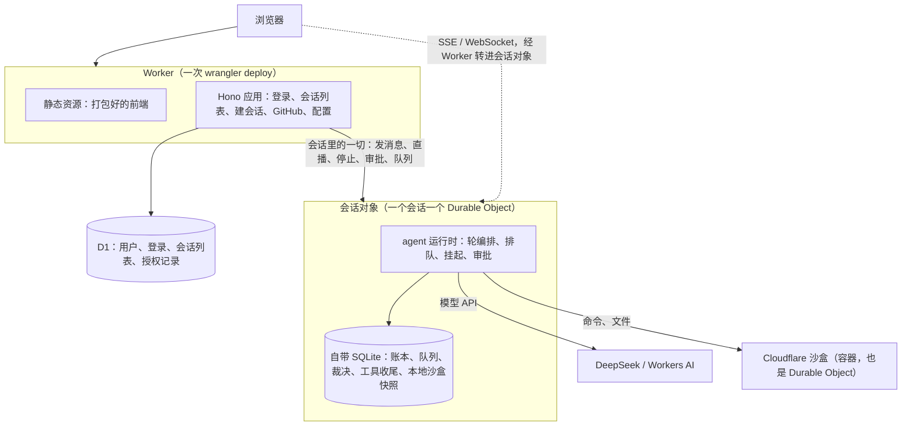
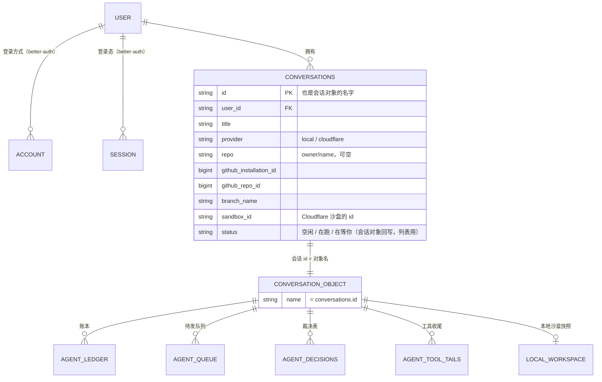
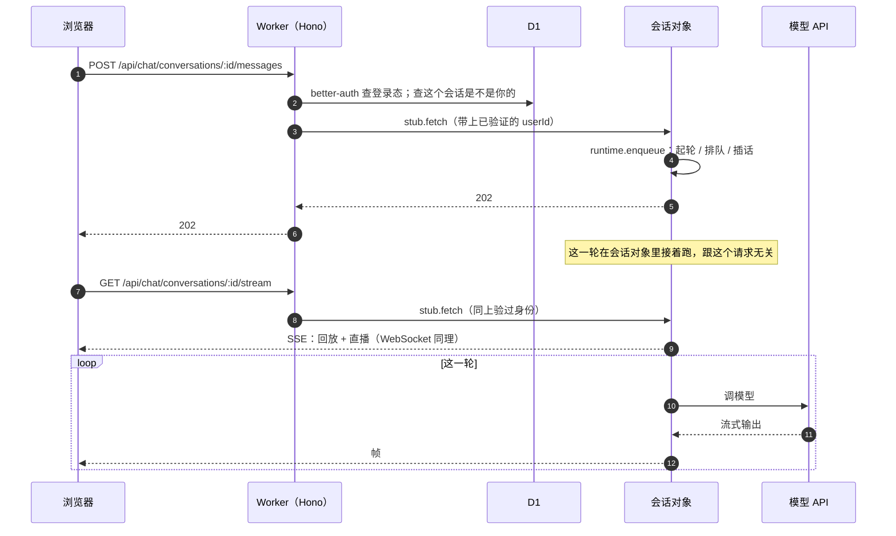
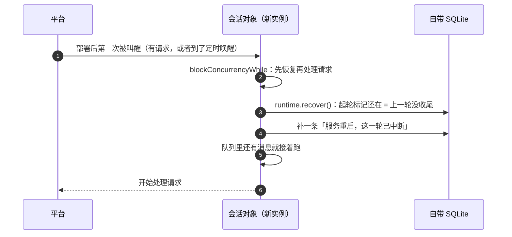

# chat 应用上 Cloudflare — 技术方案

> 术语见 [术语表](../../../terms.md)。要做什么见[功能手册](../features/chat-on-cloudflare.md)；拆单见[施工](../plans/chat-on-cloudflare.md)。
> 框架这一档的总体设计（一个会话 = 一个 Durable Object、四样能力怎么落地）见 [Cloudflare（宿主层）· 技术方案](./deployment.md)，本文不重复，只讲 chat 应用怎么落上去。

## 1. 一张图看全

一个 Worker 部署全部东西。浏览器只跟它打交道，同源。

**分工的原则**：跨会话的东西（谁是谁、我有哪些会话）放 D1；一个会话内部的东西全放它自己的会话对象。会话对象之间互相看不见，所以「列出我的会话」必须走 D1（[Cloudflare 宿主层 §3](./deployment.md)）。

## 2. 数据放哪

| 存在哪 | 表 | 谁写 |
|---|---|---|
| **D1** | better-auth 的 `user` `account` `session` 等；`conversations`；`conversation_grants`；遥测 | Worker；会话对象只回写 `conversations` 的状态列（列表显示「在跑 / 在等你」用） |
| **会话对象自带的 SQLite** | 框架的四张表（账本、裁决、队列、工具收尾）；本地沙盒快照 | 只有这个会话对象自己 |

框架的表**直接复用 `@runko/persist-kysely`**：给会话对象的 SQLite 写一个 Kysely 方言（§4.1），`kyselyPersistence(db, { flavor: "sqlite" })` 原样能用，一致性套件（`@runko/conformance`）原样能跑。持久化的读写里没有事务，靠的是「条件写 + 看影响行数」，会话对象的 SQLite 都支持。

## 3. 请求怎么走

### 3.1 会话里的请求：Worker 验身份，会话对象干活

- **会话对象只信 Worker**：它不对外暴露，只有同一个 Worker 拿得到它的引用，所以不再做一遍登录校验，用 Worker 带过来的 `userId`。
- **Node 版的「转发给持有者」「节点下线闸门」全都不需要**：同一个会话永远只有一个会话对象，平台负责把请求送到它所在的地方。
- **直播的中心就是会话对象**：订阅者都连在它身上，它自己往外推。不需要 Redis。

### 3.2 会话外的请求：只在 Worker 里

登录、注册、GitHub 连接与列仓库、`/api/chat/config`、会话列表直接查 D1。**建会话**：Worker 核对仓库与权限（同 Node 版），写 D1，再叫一声会话对象让它初始化（建表、准备沙盒）。

## 4. 会话对象里面

### 4.1 运行时怎么装

每个会话对象里放一个 `createAgentRuntime`，四样宿主能力：

| 能力 | 用什么 | 说明 |
|---|---|---|
| 持久化 | `kyselyPersistence(db)`，`db` 是会话对象 SQLite 上的 Kysely | 新写一个 Kysely 方言：编译用 Kysely 自带的 SQLite 编译器，执行交给 `ctx.storage.sql.exec`，影响行数取游标的 `rowsWritten`。放进 `@runko/durable-object` |
| 归属仲裁 | 进程内版（`inProcessArbitration`） | 平台保证一个会话只有一个实例，什么都不用仲裁 |
| 流分发 | 进程内版 | 订阅者都在这个对象里 |
| 沙盒 | 本地沙盒，或 Cloudflare 沙盒（§5） | |

一个运行时只管一个会话。框架本来就允许一个运行时管多个会话，这里只是恰好用一个。

### 4.2 一轮怎么跑、怎么保证不被平台回收

一轮在会话对象里跑：收到发消息的请求就回 202，这一轮在后台接着跑。它在等模型、等沙盒的时候，手上一直有一个进行中的网络请求。

**要实测的头号问题**：会话对象手上有进行中的网络请求时，平台会不会把它回收？Cloudflare 的说法是「没有进行中的请求或 I/O 时才会被回收」，但我们要的是「一轮跑一个小时、中间没有浏览器连着」。这一条本地验不出来（本地模拟器不回收会话对象），要部署到线上实测（[施工 C1b](../plans/chat-on-cloudflare.md)）；它不挡开发，挡上线。实测不过的退路：

1. 一轮开始时设一个定时唤醒（alarm），每隔一段时间唤醒一次，检查这一轮还在不在跑；被回收了就按崩溃恢复补「已中断」，用户接着发消息就能继续。
2. 把一轮拆成一步一步，用 Workflows 串起来（每一步是一个可重试的步骤）。改动大，只在 1 也不行时考虑。

### 4.3 在等人的轮

会话对象**没人连着、也没有进行中的 I/O 时会被回收**，内存里等人答复的 promise 就没了。所以 Cloudflare 版把[挂起](../../../terms.md)的内存窗口设得很短（几十秒）：一轮停下来等人，很快就挂起落盘，人回来答复时由新起的会话对象恢复。这就是挂起本来要解决的问题，这里只是窗口调短。

### 4.4 会话对象重启之后

部署新版本、平台迁移时，会话对象会被重启，正在跑的那一轮就断了。

- 每一轮开始时设一个定时唤醒：即使重启后没有任何请求，它到点也会把会话对象叫起来做这次恢复，用户刷新时看到的就已经是收好尾的状态。
- Node 版的「交权」在这里做不了：Cloudflare 重启会话对象前不发通知。做到无感续跑见[功能手册附录 B](../features/chat-on-cloudflare.md)。

## 5. 沙盒

### 5.1 本地沙盒

和 Node 版一样：内存里的文件（`MemoryFS`）加纯 TS 的 bash（`@runko/just-bash`），每轮收尾把快照存进会话对象自己的 SQLite（Node 版存在 `local_workspaces` 表）。会话对象内存上限 128 MB，所以快照有大小上限，超了提示用户换 Cloudflare 沙盒。

### 5.2 Cloudflare 沙盒

- **接法**：会话对象和沙盒在同一个 Worker 里，直接拿 `env.Sandbox` 绑定，走 `@runko/sandbox-cloudflare` 的进程内网关路径（同 [Cloudflare Worker Server §2](./cloudflare-worker-server.md)），不出网络。
- **规格**：缺省 `standard-1`（1/2 核、4 GB 内存、8 GB 磁盘）。`basic` 只有 1 GB，`npm install` 容易爆内存。
- **冷启动**：容器启动要几秒。用户打开会话页（订阅直播）时，会话对象顺手把沙盒叫醒，大多数时候用户发第一条消息时它已经好了。
- **休眠**：闲置一段时间自动休眠，只按醒着的时间计费。
- **拉仓库**：同 [GitHub 仓库 §4](../../../ingress/tech/github-repo-access.md)：令牌不进命令字符串。网关协议的 `exec` 不带环境变量，所以克隆这一步**绕过网关、直接调沙盒 SDK**，把令牌放进那一条命令的环境变量；之后照旧写 `.git/runko-github-token`、配凭据助手。签 GitHub App 的 JWT 改用 WebCrypto（Node 版也一起换，见 §7）。

## 6. 登录与前端

- **better-auth 接 D1**：用 Kysely 的 D1 方言，与 Node 版同一套配置（换个数据库实例）。GitHub 登录与「连接 GitHub」同 Node 版。
- **前端**：Worker 的静态资源，开「单页应用」回退，`/console` 这种前端路由刷新不 404。同源，所以登录不用配来源（同[集群前端那一期](../../node/tech/cluster-lab.md)的结论）。
- **集群控制台**：不上。Cloudflare 上没有节点。前端在 Cloudflare 版里隐藏这个入口（`/api/chat/config` 多一个能力开关）。

## 7. 代码怎么组织：抽一个两边共用的层

Node 版服务端一万行左右，大部分与平台无关（接口定义、提示词、审批规则、GitHub App、数据访问），但它们和 Node 专属的东西（转发、节点下线、Postgres 实例、常驻定时器）写在一起。直接复制一份会长歪，所以**先抽一个共用层**：

| 去哪 | 放什么 |
|---|---|
| `apps/chat-shared`（新，私有包 `@runko-chat/shared`） | 接口 schema；会话与授权的数据访问（Kysely，与方言无关）；提示词；审批规则与命令拆分；演示模型；模型选择；GitHub App（JWT 换成 WebCrypto，Node 也能跑）；网页搜索；**路由层**：Hono 路由只依赖一个「会话后端」接口 |
| `apps/node-server` | 「会话后端」的 Node 实现（运行时 + 转发 + 节点下线）；Postgres / SQLite；沙盒管理；集群控制台；推送 |
| `apps/cloudflare-server`（新，私有包 `@runko-chat/cloudflare-server`） | Worker 入口；「会话后端」的 Cloudflare 实现（把请求交给会话对象）；会话对象类；D1；wrangler 配置 |
| `packages/durable-object`（新，发布包 `@runko/durable-object`） | 会话对象 SQLite 的 Kysely 方言；把运行时装进 Durable Object 的那几行装配（任何人都能用，不只 chat 应用） |

「会话后端」接口大致是：建会话后的初始化、发消息、订阅直播、停止、队列增删、审批与答复、查状态。Node 版的路由今天就是在调这些动作，抽出来不改行为，**Node 版的全部测试与集群端到端是这一步的护栏**。

`apps/cloudflare-worker-server`（双角色示例）不动，它演示的是「沙盒网关给任意 Node 机器用」，与本期无关。

## 8. 配置与密钥

| 名字 | 放哪 | 说明 |
|---|---|---|
| D1 数据库、会话对象、沙盒的绑定 | `wrangler.jsonc` | 部署脚本建好 D1 后写进去 |
| `BETTER_AUTH_SECRET` | `wrangler secret` | 必填 |
| `DEEPSEEK_API_TOKEN` 等模型配置 | `wrangler secret` | 不填就是演示模型 |
| `GITHUB_APP_*`、`GITHUB_CLIENT_ID/SECRET` | `wrangler secret` | 选仓库、GitHub 登录要 |
| 沙盒规格 | `wrangler.jsonc` 的容器配置 | 缺省 `standard-1` |

## 9. 部署

一条脚本做完：建 D1（已有就跳过）→ 跑 D1 迁移 → 打包前端 → `wrangler deploy`（Worker、会话对象、沙盒镜像一起）。D1 的迁移用 SQL 文件（`wrangler d1 migrations`），由同一份 Kysely 迁移导出，不手写第二份 DDL。

## 10. 测试

| 层 | 怎么测 |
|---|---|
| Kysely 方言 + 持久化 | `@cloudflare/vitest-pool-workers` 在真的 workerd 里跑，`@runko/conformance` 的持久化用例原样过一遍 |
| 会话对象 | 同上：起轮、排队、挂起、重启后恢复（模拟重启：丢掉实例重新拿 stub） |
| Worker 路由 | 共用路由层的用例两边各跑一遍（Node 后端、Cloudflare 后端） |
| 端到端 | `wrangler dev` 本地起全套（沙盒在本机 Docker 里），agent-browser 走注册、建会话、聊天、长任务、刷新重连。注意本地不回收会话对象、不限 CPU（§11.1），长任务这一条本地过了不代表线上过 |
| 真部署 | 部署到一个测试账号，按[功能手册 §5](../features/chat-on-cloudflare.md) 的成功标准逐条走（要人来做） |

## 11. 风险与要先实测的

| # | 风险 | 后果 | 在哪验 | 怎么验 |
|---|---|---|---|---|
| 1 | 长轮期间会话对象被回收 | 一轮中途断 | **线上**（施工 C1b） | 30 分钟的任务，浏览器关掉，看能不能跑完 |
| 2 | 会话对象的 CPU 计时方式 | 撞 30 秒上限 | **线上**（C1b） | 同一个实测里看 CPU 用量；必要时在配置里调高 |
| 3 | better-auth 在 Workers + D1 上的兼容 | 登录做不了 | 本地（C1a） | 最小 Worker 跑通注册、登录、GitHub 回调 |
| 4 | D1 迁移与 Kysely 迁移器 | 建表做不了 | 本地（C1a） | 导出 SQL 文件走 `wrangler d1 migrations` |
| 5 | 从会话对象调沙盒、克隆时传环境变量 | 拉不了仓库 | 本地（C1a，要本机 Docker） | 最小会话对象里起沙盒、带环境变量跑一条命令 |
| 6 | 部署时会话对象怎么重启 | 用户看到的中断范围 | **线上**（C1b） | 部署一次，观察在跑的轮与连着的直播 |

### 11.1 本地能验什么、不能验什么

`wrangler dev` 在本机起的是 workerd（与线上同一个运行时），Worker、静态资源、会话对象（带 SQLite）、D1、沙盒容器（借本机 Docker）都能跑，`@cloudflare/vitest-pool-workers` 能在 workerd 里跑自动测试。所以**功能与逻辑都在本地开发、本地测**。

本地验不出来的是平台行为：会话对象的回收与调度、CPU 等限制（官方文档写明只在部署到 Cloudflare 网络时生效）、部署时的重启，以及冷启动、全球延迟、账单这些真实数字。上表标「线上」的三条就是这一类。

## 12. 已知限制

- **部署会中断正在跑的轮**（§4.4）。
- **本地沙盒的文件受 128 MB 内存限制**（§5.1）。
- **没有推送通知**：本期不做。
- **免费档跑不了**：每次请求 10 毫秒 CPU、50 个外部请求。

---

# 附录

## 附录 A · 否决过的做法

| 做法 | 为什么不 |
|---|---|
| 全部数据放 D1，用租约版仲裁 | 放着「一个会话一个实例」这个平台保证不用，还要自己做心跳与接管；直播又得另找中心 |
| 全部数据放会话对象，不用 D1 | 列「我的会话」要把所有会话对象挨个问一遍 |
| 把 Node 版服务端复制一份改 | 两份长歪是必然的；共用层多花的工夫，第一次改路由就赚回来 |
| 一轮放进 Workflows | 每一步都要能重放，运行时得大改；只在长轮实测不过时考虑（§4.2） |
| 经网关从外部 Node 进程用 Cloudflare 沙盒 | 那是 [Cloudflare Worker Server](./cloudflare-worker-server.md) 的场景；这里会话对象就在 Worker 里，直接用绑定 |
