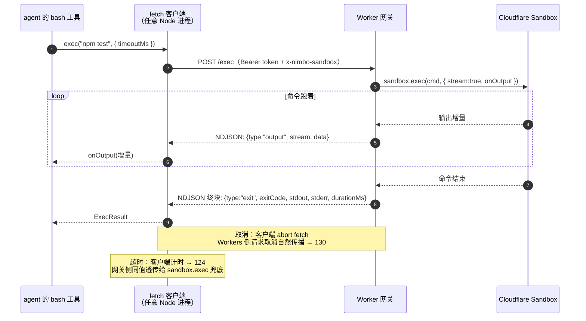

# Cloudflare（宿主层）— 技术方案

> 相关：[功能](../features/deployment.md)，参考实现见 [Cloudflare Worker Server · 技术方案](../tech/cloudflare-worker-server.md)。
> 跨环境的那份接口在[契约](../../contract/tech/sandbox.md)（本文只讲这一档怎么落地，逐接口映射表在那边）。

## 1. 一句话

**一个会话 = 一个 Durable Object**，`conversationId` 直接当 DO 的 id。平台保证单实例 + 串行处理，于是[归属仲裁机制](../../../terms.md)这一档**什么都不用做**。

## 2. 四样能力的落地

| 能力 | 实现 | 关键点 |
|---|---|---|
| 归属仲裁机制 | 平凡实现（什么都不做） | 独占是**真保证**，跟单进程一档同级 |
| 持久化 | `ctx.storage.sql`（DO 自带 SQLite） | 没有租约表——这一档根本没有那个概念 |
| 流分发 | 平台自带 | `stub` 本身就是通道，订阅方直连该实例 |
| 沙盒 | `@nimbo/sandbox-cloudflare` | [网关形态](../../../terms.md)，见 §4 |

**三样打包在 `@nimbo/durable-object` 一个包里**，因为它们全是平台自带、总是一起用。打包原则是「一次装什么」，不是「有几个模块」。

### 2.1 为什么持久化接口接得进 DO 的 KV

因为[归属仲裁机制是装饰器](../../../logic/arbitration/tech/arbitration-impl.md)——它把写入包起来，租约版先校验令牌再往下走，DO 版直接往下走。所以**持久化接口本身完全不认识「租约」这个概念**。

由此推出的那条常被搞错的结论：**CAS 是租约版机制的要求，不是持久化的要求。** 用 DO 的人根本不碰 CAS。

## 3. 跨会话查询：唯一要还的债

DO 的存储跟着对象走，会话之间互相看不见。「列出这个用户的所有会话」这类查询做不了。

解法是**在 DO 外面另建索引**（D1 / KV / 外部 DB 都行），会话创建时写一行。框架不替你做这件事——它只认不透明的 `ownerId`，不拥有用户实体。

## 4. 沙盒的网关形态

### 4.1 为什么必须绕

`@cloudflare/sandbox` 的 `getSandbox(env.Sandbox, id)` 依赖 Durable Object binding，**没有外部 REST 通道**。普通 Node 进程拿不到 binding，所以连不上。

### 4.2 协议

全部 POST + JSON body；`Authorization: Bearer <token>` 与网关 token 比对；沙盒选择用请求头 `x-nimbo-sandbox: <id>`（缺省 `"default"`）；二进制经 base64；错误统一 `{ code, message }` 配相应 HTTP 状态（400/401/404/409/500），客户端翻译回 `NotFoundError` 这类结构化错误。

| 端点 | 请求 | 响应 |
|---|---|---|
| `/fs/read` | `{ path }` | `{ dataBase64 }` |
| `/fs/write` | `{ path, dataBase64 }` | `{ ok: true }` |
| `/fs/rm` | `{ path, recursive? }` | `{ ok: true }` |
| `/fs/mkdir` | `{ path }` | `{ ok: true }` |
| `/fs/readdir` | `{ path }` | `{ entries: [{ name, type }] }` |
| `/fs/stat` | `{ path }` | `{ type, size?, mtime? }` |
| `/fs/glob` | `{ pattern }` | `{ paths: [...] }` |
| `/exec` | `{ command, cwd?, timeoutMs? }` | **NDJSON 流** |

`/exec` 的流：网关侧 `sandbox.exec(command, { stream: true, onOutput })` 写进 `TransformStream`；客户端增量解析 NDJSON → `onOutput`，收到终块 → `ExecResult`。

### 4.3 两个已知的语义坑

- **超时和取消以客户端为准。** `timeoutMs` 由客户端计时（124），网关侧把同一个值透传给 `sandbox.exec` 只作兜底；取消是客户端 abort fetch（130）。不信任底层 SDK 自报的退出码——这条跟 [E2B](../../e2b/tech/deployment.md)、Vercel 两档的裁量一致。
- **CF 客户端不引入 `root` 配置。** 路径锚定 = 虚拟绝对路径去掉前导斜杠 + 沙盒默认 cwd（`/workspace`）当虚拟根。**后果**：bash 脚本里带前导 `/` 的绝对路径落在真实根而不是工作区。这个「bash 绝对路径 vs 文件接口锚定路径不同源」现象在 E2B（`/home/user`）和 Vercel（`/vercel/sandbox`）同样存在，是「真实 FS + root 锚定」的固有语义，不是 CF 独有。约定是**共享文件一律用相对路径**。

## 5. 执行时长：CPU 时间不是墙钟

Workers 的 30s / 5min 限制算的是 **CPU 时间，不是墙钟时间**。

agent 循环的墙钟大头全是 I/O 等待——等模型流式返回、等沙盒跑命令，**这些不计 CPU**。真正吃 CPU 的只有 JSON 解析、zod 校验、事件翻译这类毫秒级工作。几十轮循环的 CPU 累计大概率在几百毫秒量级，30s 默认额度很宽裕。

所以这一档**没有「单轮跑不完」的问题**——那是 [Vercel 那档](../../vercel/tech/deployment.md)才有的硬约束。

## 6. 取舍与已知限制

- **跨会话查询要自己建索引**（§3）。
- **沙盒必须自部署一个网关 Worker**，多一次部署。好处是这套协议可复用给别的「连不上」的沙盒。
- **共享文件用相对路径**（§4.3），绝对路径的锚定语义跟 bash 不同源。
- **DO 没请求时会休眠或被驱逐**（内存清空、**存储保留**），但**能被 alarm 定时唤醒**——这是它跟 Vercel 最大的运行模型差异。

---

# 附录

## 附录 A：nimbo 能不能整个跑在 Workers 里（实测结论）

> 立项时选的是**网关形态**，因为目标是「agent 跑在任意电脑上」。但施工前的可行性实测证明「nimbo 核心零改动可跑在 workerd 上」这条路也成立，结论留作技术储备。

**Node API 使用面审计**（compat date ≥ 2026-03-17，开 `nodejs_compat`）：

| 用到什么 | 结论 |
|---|---|
| `core` 的 `randomUUID`（`node:crypto`） | ✓ 原生支持 |
| `virtual-fs` 的 `node:fs/promises` | ✓ 可打包可运行，但读到的是空虚拟盘——`fromDirectory` / `writeBack` 语义上不可用，纯内存路径（`fromMemory`）不受影响 |
| `localExec`（`node:child_process`） | ✓ 可打包，调用时抛错（Workers 上本就该注入沙盒 exec） |
| L3 `loadAgent` / `Skill.fromDirectory` | 打包不报错、运行不可用（虚拟盘为空）。用 `defineSkill` / `Skill.fromFS` / 程序化定义替代 |
| `mini-bash` | ✓ 无任何 `node:` import，纯 TS |
| 模型层 `ai` | ✓ Workers 是它的一等目标 |

**实测**：`wrangler deploy --dry-run` 全量打包一次通过（1316 KB / gzip 220 KB，含 `ai`）；`wrangler dev` 真实请求走 `fromMemory` + `createSession` + `miniBash().exec` 全部正常，5ms 返回。

**含义**：长会话 / 断连续跑放 Durable Objects 或 Workflows 即可——nimbo「无全局状态、session 可序列化」的设计原则在这里兑现。
