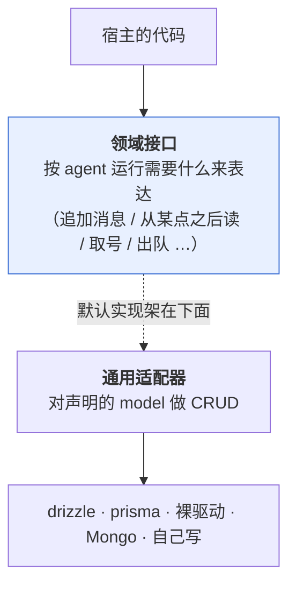

# 持久化（宿主层）— 技术方案

> 相关：[功能](../features/persistence.md)，架构总纲 [技术方案](../../../architecture/tech/agent-kernel.md)。
> 宿主层的另两样能力：[沙盒](./sandbox.md) · [流分发](./stream-fanout.md)。第四样[归属仲裁机制](../../../logic/arbitration/tech/arbitration-impl.md)的实现文档跟它的语义并排放在逻辑层。
> 依赖/延续：[单一账本](../../../logic/orchestration/tech/single-ledger.md)（账本的现行形态）· [进行中草稿放内存](../../../logic/orchestration/tech/in-flight-draft.md)（哪些东西**不**该落库）。
>
> **状态：领域接口已定稿**（2026-08-16 随 `@runko/agent` 交付）。本文 §8 起是 `@runko/persist-sql` 的实现方案，施工见[施工进展](../plans/persistence.md)。

## 1. 一句话

**[轮编排](../../../terms.md)定义模型，持久化负责存**——这正是 better-auth 的形态（框架定 model，adapter 负责落地）。

## 2. 数据模型：单一事实来源在总纲

四张表（账本 · 人工裁决 · 待发队列 · 租约表）的实体关系图、字段与约束，**全部在 [架构总纲 · 技术方案 §3](../../../architecture/tech/agent-kernel.md)**，本文不复制——复制就会漂。

这里只补一句归属：**四张表分属不同模块**（账本/裁决/队列归轮编排，租约表归[归属仲裁机制](../../../logic/arbitration/tech/arbitration-impl.md)），但「把它们存起来」是同一种能力，所以合成宿主层的**一个**模块。把持久化做成逻辑层的模块，就会切出「队列的模型在这儿、存储在那儿」的别扭形状。

> **租约表只在租约版下存在。** 单进程版在内存里，Cloudflare Durable Object 那档根本没有这张表。

## 3. 契约的两层结构

比 better-auth 多一层逃生口：



**runko 内部只认领域接口这一层。** 绝大多数人只碰下层——`drizzleAdapter(db)` 一行接上，体感同 better-auth。少数人可以整层换掉上层：账本接 Kafka、接 Durable Object storage、接内部存储微服务。

**为什么要留这个逃生口**：账本的写入量和访问模式跟「四张认证表」不是一回事。better-auth 没有这一层，runko 应该有。

## 4. 接口设计的四条准则

1. **暴露「agent 运行需要什么」，不暴露「表长什么样」。** 账本是「按会话追加消息 / 从某点之后读」，不是「一张 seq 做主键的表」。
2. **runko 不拥有用户实体。** 只认不透明 `ownerId`，不做外键。
3. **迁移不是契约的一部分。** 给参考 DDL、官方实现自带迁移，接口层不假设「有迁移这回事」。
4. **不假设事务能跨接口。** 需要原子的地方收进**一个**方法里；绝不要求宿主传跨接口的事务对象——那等于宣布只支持关系型。

### 4.1 两条从别处推来的硬约束

**① seq 由[归属仲裁](../../../terms.md)分配，不由数据库生成。** `MAX(seq)+1` 和 sequence 都是方言特性，通用适配器表达不了；改成「租约表水位 + CAS 取号」之后两边都不需要。代价是 **seq 会出现空洞**（占了号但插入失败），已确认无害——回放按序、断线续传游标、主键去重三个用途都不要求连续，但要写成明文保证，不能靠默契。

**② 写入可能被拒绝，而且这是正常路径。** 租约版下，[轮编排](../../../terms.md)的每一次写入都可能因为[租期标识](../../../terms.md)对不上而被拒。所以持久化实现必须能把「条件不匹配」当作一个**可辨识的结果**报回来，**不能糊成一个泛泛的 `Error`**。单进程版下这条路永远走不到，但接口上必须有它——否则换成租约版就是静默数据损坏。推导见[归属仲裁机制 §4](../../../logic/arbitration/tech/arbitration-impl.md)。

## 5. 打包：为什么是三条腿

**打包原则：接口按模块分；实现按「一次装什么」打包。**

持久化和[租约版归属仲裁机制](../../../logic/arbitration/tech/arbitration-impl.md)**总是一起用**——都要落库、共享同一个连接、共用同一套 CRUD + CAS 原语。所以**同一个包**：装 `@runko/persist-sql` 就同时拿到存储和租约版仲裁。

三条腿的分法：

| 包 | 吃什么 | 定位 |
|---|---|---|
| `@runko/persist-kysely` | 用户已有的 **Kysely** 实例 | 核心。三个 Store + 建表都在这儿 |
| `@runko/persist-sqlite` | 一个 `better-sqlite3` 实例 | 薄壳 → 核心 |
| `@runko/persist-postgres` | 一个 `pg.Pool` | 薄壳 → 核心 |
| `@runko/persist-mysql` | 一个 `mysql2` 连接池 | 薄壳 → 核心 |
| `@runko/persist-mongo` | 一个 MongoDB `Db` | **不走 Kysely**，直接实现三个领域接口 |
| `@runko/persist-drizzle` | 用户已有的 drizzle 实例 | 已在用 drizzle 的应用 |
| `@runko/persist-prisma` | 用户已有的 Prisma client | 已在用 Prisma 的应用 |

> **2026-08-23 推翻了「方言不是包」。** 原方案是一个 `@runko/persist-sql` 同时支持两种
> 方言、方言作参数。改成**一种库一个包**：① 依赖关系一眼看得明白，每个包只 peer-dep
> 自己那个驱动；② 加 MySQL 时才发现「方言是参数」掩盖了真实成本——三家的差异要么进
> 一个越长越大的 `if`，要么进包名，进包名更诚实。
>
> 同时**底层换成 Kysely**（better-auth 的内置适配器也是它）。手搓方言层那版在
> 「MySQL 不支持 `RETURNING`」这类差异上已经开始长分支；换成现成的之后真差异收敛到五处、全在一个文件里。

**为什么出 ORM 腿，而不是多支持几个 SQL 方言**——两个理由：

- **产品上**：drizzle / prisma 对业务应用开发有实实在在的加持（有抽象、有领域模型）。构建者的应用里本来就有自己的 ORM 和领域模型，让 runko 的表跟它们同处一套 schema 管理之下才顺；只给裸 SQL 太单薄。
- **技术上（顺带收益）**：**裸驱动腿和 ORM 腿的形状差异，比两个 SQL 方言大得多**——一个拿到原始连接自己拼 SQL，一个拿到别人的 schema 对象、要按人家的模型名映射。**两条腿能真检验出接口有没有漏假设，两个方言不能。**

**为什么叫 `persist-` 不叫 `store-`**：这类包里既有账本/裁决/队列的存储、也有租约表，而「store」在读者脑子里默认只指账本，盖不住租约。「持久化」两样都能盖住。

## 6. 取舍与已知限制

- **CAS 不是持久化的要求**，是租约版仲裁机制的要求。用 Durable Object 的人根本不碰它。
- **不支持跨会话查询**。「列出这个用户的所有会话」这类需求归构建者自建索引——在 Durable Object 那档尤其明显，每个 DO 有自己独立的存储。
- ~~**MySQL 有坑**：`affectedRows` 默认返回「真正变了的行」而不是「匹配到的行」，值没变时返回 0，会让 CAS 误判成失败，要靠 `CLIENT_FOUND_ROWS` flag。~~ **2026-08-23 实测推翻**：在 **mysql2 + Kysely** 这条路上不成立——Kysely 的 `numUpdatedRows` 报的就是**匹配行数**（`UPDATE` 匹配到但值没变时仍是 1），「真变了几行」另有 `numChangedRows`。原描述对**裸 MySQL 协议**成立，对我们实际走的这条路不成立。
- **官方支持 SQLite / PostgreSQL / MySQL 三种**。其余方言：自己配一个 Kysely dialect 接 `@runko/persist-kysely`，或者走「自己实现领域接口」这条逃生口。
- **MySQL 不支持 `CREATE INDEX IF NOT EXISTS`**，也不支持 `RETURNING`。前者的影响是队列表不建二级索引（本来也用不上，主键前导列已够）；后者的影响是判断「改没改」一律用 `numUpdatedRows` / `numDeletedRows`。
- **MySQL 与 MongoDB 都没有进程内替身**（SQLite 有 `:memory:`，Postgres 有 pglite；`mongodb-memory-server` 是下载一个真 mongod 二进制来跑，不是进程内）。所以这两档**只能对真库跑**——CI 上目前不跑，这是个已知的覆盖缺口。

## 7. 原 TODO 的落点（2026-08-23 全部结清）

| 原问题 | 结论 |
|---|---|
| 领域接口的方法名与签名 | **已定稿**，见 `packages/agent/src/persistence.ts`：`LedgerStore` / `DecisionStore` / `QueueStore` 三个接口 + `Persistence` 聚合。`LeaseStore` **没有**——租约不走持久化接口，它是 `Arbitration` 的实现细节（见 §8.4） |
| 「通用适配器」层的 model 声明形式 | **暂不做**。三条腿各写各的；等真出到第三条腿、发现在抄同一段逻辑时再抽。提前抽一层抽象去伺候两个实现，是拿确定的复杂度换不确定的复用 |
| 参考 DDL 的发布形式 | **随包发 `schema.sql`**，同时导出一个幂等的 `migrate()`。两条路都留：想让 runko 自己建表就调 `migrate()`，想并进自己的迁移体系就照抄 `schema.sql` |
| 分页/游标读账本的形状 | **已定**：`read(conversationId, { afterSeq })`，不含自身、按 seq 升序、不分页。不分页是因为账本天然按会话切分且有上限（compaction 会压缩），一次读全比让调用方处理游标简单 |

## 8. 实现方案：一个核心 + 三个薄壳

### 8.1 分包

```
persist-sqlite ─┐
persist-postgres ┼─→ persist-kysely ─→ 你的库
persist-mysql  ─┘      三个 Store + migrate
```

**薄壳只做一件事**：把驱动包成 `new Kysely({ dialect: new XxxDialect({...}) })`，转交核心。
每个薄壳约 40 行，`peerDependencies` 只有自己那个驱动。

**核心 `@runko/persist-kysely` 自己就能用**——已经在用 Kysely 的宿主直接装它，把自己的
实例给它，runko 的四张表和宿主的表进同一个实例、同一套迁移。这跟 `persist-drizzle`
「吃你已有的 drizzle 实例」是同一个姿态。

### 8.2 用了 Kysely 之后，三方言的差异只剩五处

| | SQLite | Postgres | MySQL |
|---|---|---|---|
| 幂等插入 | `ON CONFLICT DO NOTHING` | 同左 | `ON DUPLICATE KEY UPDATE`（见下） |
| JSON 列类型 | `text` | `jsonb` | `json` |
| 读回来的 JSON | **字符串**（要自己 parse） | 对象（驱动已 parse） | 对象（驱动已 parse） |
| 整数列类型 | `integer` | `bigint` | `bigint` |
| 主键字符串列 | `varchar(255)` | 同左 | `varchar(255) COLLATE utf8mb4_bin`（见下） |

**MySQL 的两处坑都不是风格差异，是会出错的语义差异：**

- **排序规则**：MySQL 8 默认的 `utf8mb4_0900_ai_ci` **大小写与重音都不敏感**，另两家区分
  大小写。不显式 `COLLATE utf8mb4_bin` 的话 `AbC` 和 `abc` 会被当成同一个 conversationId
  ——跨会话读到别人的账本，主键上还会撞键。契约明说 conversationId 是**不透明字符串**，
  不能推给宿主「别用混合大小写」；`tool_call_id` 更要紧（模型给的 call id 本来就混合大小写）。
- **`INSERT IGNORE` 不能用**：它把**所有**可恢复错误降级成 warning（超长截断、约束失败
  整行跳过），调用方却拿到「写成功了」。改用 `ON DUPLICATE KEY UPDATE <某列>=<某列>`
  ——一个无操作的更新，只吞重复键，语义与另两家的 `DO NOTHING` 对齐。

全在 `flavor.ts` 一个文件里，其余代码方言无关。Kysely 抹平了占位符、标识符引号、
查询构建、以及 `numUpdatedRows` / `numDeletedRows` 的语义。

> **后两行是同一件事的两面**：列类型选了什么，读回来就是什么。**不要写「是字符串就
> parse 一下」这种对冲**——一个合法存进去的 JSON 字符串（比如 `ask-user` 的问题正文）
> 读回来就是个 JS string，跟「还没解析的 JSON 文本」在类型上完全一样，猜不出来。
> 手搓那版就是栽在这，被一致性套件在 pglite 上抓出来的。

### 8.3 四张表

字段照[架构总纲 §3](../../../architecture/tech/agent-kernel.md)，不在这里复述。三点落地决定：

1. **队列是独立表，不是 JSON 列。** 官方包面对的是通用场景。（chat 应用选了 JSON 列
   并且是对的——它的队列与会话 1:1、量小、永远整体读写。两种选择都成立，这恰好说明
   为什么「宿主自己实现」要留成头等路径。）
2. **`payload` 存 JSON，不拆列。** 账本里那个 `UIMessage` 的形状归 core 管。
3. **队列表不建二级索引。** 主键 `(conversation_id, id)` 的前导列已经能走
   `WHERE conversation_id = ?`；剩下只是给一个有上限的集合排序。顺带绕开了
   「MySQL 不支持 `CREATE INDEX IF NOT EXISTS`」。

### 8.4 这一版不含租约版仲裁

契约 §5 说「装了就同时拿到存储和租约版仲裁」——**那是终态，不是这一版**。本批只出
持久化三个 Store；仲裁仍用 `@runko/agent` 内置的单进程实现。

**为什么分两次发**：租约版引入心跳、[租期标识](../../../terms.md)与 CAS 三样新东西，
而持久化本身是「行为零变化」的搬运工。混在一批里发，之后每个诡异现象都要先分辨是谁的锅。

### 8.5 一致性测试套件：本批真正的产出

比包本身更重要的是这个——**一套用例，喂给多个实现，逐个断言行为一致**：

```ts
import { persistenceCases } from "@runko/conformance";

describe("我自己的实现", () => {
  for (const testCase of persistenceCases) {
    it(testCase.name, async () => {
      await testCase.run({ persistence: myPersistence() });
    });
  }
});
```

套件单独发在 `@runko/conformance`，**不依赖任何测试框架**——它只导出 `{ name, run }`
这样的用例数据，`describe`/`it` 由消费方来接。

跑在哪几档：

| 实现 | 要外部服务吗 |
|---|---|
| 内置内存实现 | 否 |
| SQLite（`:memory:`） | 否 |
| Postgres（**pglite**，WASM 进程内） | 否 |
| Postgres（真库） | 是，`RUNKO_TEST_POSTGRES_URL` |
| MySQL（真库） | 是，`RUNKO_TEST_MYSQL_URL` |
| **MongoDB（真库）** | 是，`RUNKO_TEST_MONGO_URL` |

**前三档永远跑**，CI 不用配 service container。后两档给了连接串才跑，没给就
`describe.skip` 并说明原因——不是静默跳过。

套件覆盖的不变量（每条都是接口注释里写死、但没人验过的承诺）：

- `append` 同 `(conversationId, seq)` 重复写入**不得写出两行**
- `read({ afterSeq })` **不含自身**、按 seq **升序**
- seq **允许空洞**——占了号没写成，后续读写都不受影响
- `maxSeq` 对空会话返回 `0`
- `dequeue` **取出即移除**，中途异常不会让同一条被起两轮
- `requeueFront` **不受 `max` 约束**（它是回滚一次出队，不是新入队）
- 队列满时 `enqueue` **原样返回当前队列，不截断不覆盖**
- `settle` 对已结清/不存在的裁决返回 `false`，不抛
- message / payload 原样往返（JSON 列的序列化边界）
