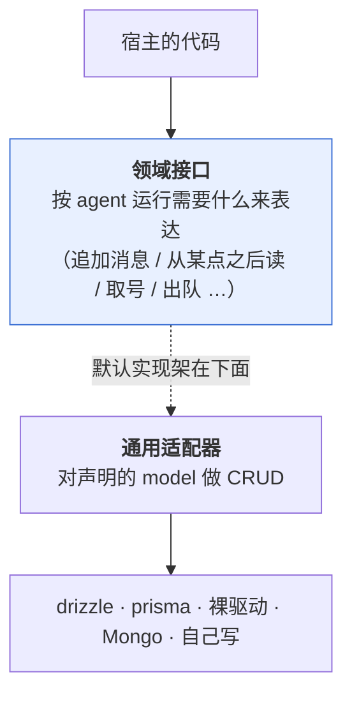

# 持久化（宿主层）— 技术方案

> 相关：[功能](../features/persistence.md)，架构总纲 [技术方案](../../../architecture/tech/agent-kernel.md)。
> 宿主层的另两样能力：[沙盒](./sandbox.md) · [流分发](./stream-fanout.md)。第四样[归属仲裁机制](../../../logic/arbitration/tech/arbitration-impl.md)的实现文档跟它的语义并排放在逻辑层。
> 依赖/延续：[单一账本](../../../logic/orchestration/tech/single-ledger.md)（账本的现行形态）· [进行中草稿放内存](../../../logic/orchestration/tech/in-flight-draft.md)（哪些东西**不**该落库）。
>
> **状态：接口未定稿。** 已拍板的是分层位置、四条准则与打包方式；方法签名随 `@nimbo/agent` 一起定，未定处标了 `TODO`。

## 1. 一句话

**[轮编排](../../../terms.md)定义模型，持久化负责存**——这正是 better-auth 的形态（框架定 model，adapter 负责落地）。

## 2. 数据模型：单一事实来源在总纲

四张表（账本 · 人工裁决 · 待发队列 · 租约表）的实体关系图、字段与约束，**全部在 [架构总纲 · 技术方案 §3](../../../architecture/tech/agent-kernel.md)**，本文不复制——复制就会漂。

这里只补一句归属：**四张表分属不同模块**（账本/裁决/队列归轮编排，租约表归[归属仲裁机制](../../../logic/arbitration/tech/arbitration-impl.md)），但「把它们存起来」是同一种能力，所以合成宿主层的**一个**模块。把持久化做成逻辑层的模块，就会切出「队列的模型在这儿、存储在那儿」的别扭形状。

> **租约表只在租约版下存在。** 单进程版在内存里，Cloudflare Durable Object 那档根本没有这张表。

## 3. 契约的两层结构

比 better-auth 多一层逃生口：

**nimbo 内部只认领域接口这一层。** 绝大多数人只碰下层——`drizzleAdapter(db)` 一行接上，体感同 better-auth。少数人可以整层换掉上层：账本接 Kafka、接 Durable Object storage、接内部存储微服务。

**为什么要留这个逃生口**：账本的写入量和访问模式跟「四张认证表」不是一回事。better-auth 没有这一层，nimbo 应该有。

## 4. 接口设计的四条准则

1. **暴露「agent 运行需要什么」，不暴露「表长什么样」。** 账本是「按会话追加消息 / 从某点之后读」，不是「一张 seq 做主键的表」。
2. **nimbo 不拥有用户实体。** 只认不透明 `ownerId`，不做外键。
3. **迁移不是契约的一部分。** 给参考 DDL、官方实现自带迁移，接口层不假设「有迁移这回事」。
4. **不假设事务能跨接口。** 需要原子的地方收进**一个**方法里；绝不要求宿主传跨接口的事务对象——那等于宣布只支持关系型。

### 4.1 两条从别处推来的硬约束

**① seq 由[归属仲裁](../../../terms.md)分配，不由数据库生成。** `MAX(seq)+1` 和 sequence 都是方言特性，通用适配器表达不了；改成「租约表水位 + CAS 取号」之后两边都不需要。代价是 **seq 会出现空洞**（占了号但插入失败），已确认无害——回放按序、断线续传游标、主键去重三个用途都不要求连续，但要写成明文保证，不能靠默契。

**② 写入可能被拒绝，而且这是正常路径。** 租约版下，[轮编排](../../../terms.md)的每一次写入都可能因为[租期标识](../../../terms.md)对不上而被拒。所以持久化实现必须能把「条件不匹配」当作一个**可辨识的结果**报回来，**不能糊成一个泛泛的 `Error`**。单进程版下这条路永远走不到，但接口上必须有它——否则换成租约版就是静默数据损坏。推导见[归属仲裁机制 §4](../../../logic/arbitration/tech/arbitration-impl.md)。

## 5. 打包：为什么是三条腿

**打包原则：接口按模块分；实现按「一次装什么」打包。**

持久化和[租约版归属仲裁机制](../../../logic/arbitration/tech/arbitration-impl.md)**总是一起用**——都要落库、共享同一个连接、共用同一套 CRUD + CAS 原语。所以**同一个包**：装 `@nimbo/persist-sql` 就同时拿到存储和租约版仲裁。

三条腿的分法：

| 包 | 吃什么 | 定位 |
|---|---|---|
| `@nimbo/persist-sql` | 裸驱动（`pg.Pool` / `better-sqlite3`），**方言是参数** | 没有 ORM 的应用 |
| `@nimbo/persist-drizzle` | 用户已有的 drizzle 实例 | 已在用 drizzle 的应用 |
| `@nimbo/persist-prisma` | 用户已有的 Prisma client | 已在用 Prisma 的应用 |

**为什么出 ORM 腿，而不是多支持几个 SQL 方言**——两个理由：

- **产品上**：drizzle / prisma 对业务应用开发有实实在在的加持（有抽象、有领域模型）。构建者的应用里本来就有自己的 ORM 和领域模型，让 nimbo 的表跟它们同处一套 schema 管理之下才顺；只给裸 SQL 太单薄。
- **技术上（顺带收益）**：**裸驱动腿和 ORM 腿的形状差异，比两个 SQL 方言大得多**——一个拿到原始连接自己拼 SQL，一个拿到别人的 schema 对象、要按人家的模型名映射。**两条腿能真检验出接口有没有漏假设，两个方言不能。**

**为什么叫 `persist-` 不叫 `store-`**：这类包里既有账本/裁决/队列的存储、也有租约表，而「store」在读者脑子里默认只指账本，盖不住租约。「持久化」两样都能盖住。

## 6. 取舍与已知限制

- **CAS 不是持久化的要求**，是租约版仲裁机制的要求。用 Durable Object 的人根本不碰它。
- **不支持跨会话查询**。「列出这个用户的所有会话」这类需求归构建者自建索引——在 Durable Object 那档尤其明显，每个 DO 有自己独立的存储。
- **MySQL 有坑**：`affectedRows` 默认返回「真正变了的行」而不是「匹配到的行」，值没变时返回 0，会让 CAS 误判成失败。要靠 `CLIENT_FOUND_ROWS` 连接 flag。细节见 [架构总纲 · 技术方案 附录 A.3](../../../architecture/tech/agent-kernel.md)。
- **首批只官方支持 SQLite + Postgres**。其余方言与非关系型存储走「自己实现领域接口」这条逃生口。

## 7. TODO（未定）

- [ ] 领域接口的方法名与签名（含 `LedgerStore` / `DecisionStore` / `QueueStore` / `LeaseStore` 这组名字本身）。
- [ ] 「通用适配器」层的 model 声明形式：照 better-auth 那样声明式描述，还是每条腿各写各的。
- [ ] 参考 DDL 的发布形式（随包发 `.sql`？还是文档里给？）。
- [ ] 分页/游标读账本的形状（断线续传要从某个 seq 之后读，接口怎么表达）。
