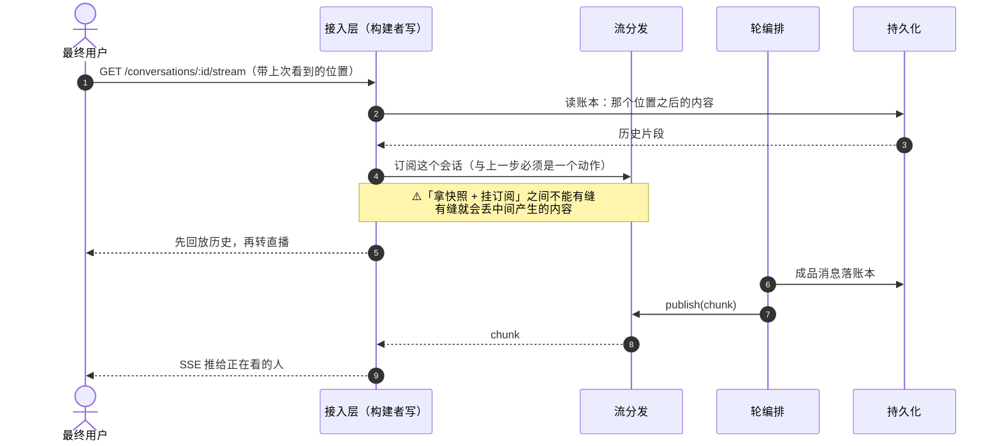

# 流分发（宿主层）— 技术方案

> 相关：[功能](../features/stream-fanout.md)，架构总纲 [技术方案](../../../architecture/tech/agent-kernel.md)。
> 宿主层的另两样能力：[沙盒](./sandbox.md) · [持久化](./persistence.md)。第四样[归属仲裁机制](../../../logic/arbitration/tech/arbitration-impl.md)的实现文档跟它的语义并排放在逻辑层。
> 依赖/延续：[chat 服务端技术方案](../../../ingress/tech/chat-webapp.md)（现行 SSE 直播流 + 回放游标的具体实现）· [进行中草稿放内存](../../../logic/orchestration/tech/in-flight-draft.md)（直播内容与账本的分工）。
>
> **状态：接口未定稿。** 已定的是两条硬约束（§3）与打包方式，方法签名待定。

## 1. 一句话

**一条「发布/订阅」的通道，不是一个存储**——发布方是正在跑轮的那个进程，订阅方是正在看的人。

## 2. 它在分层里的位置

流分发挂在[轮编排](../../../terms.md)下面，**条件依赖**：跨实例时才需要外部实现，单进程用内置的进程内 EventEmitter。

## 3. 两条硬约束

**① 接口必须是「发布/订阅」，不能是「存/取」。**

写成「存/取」就会诱导实现去做保留策略、做游标管理，跟账本的职责重叠，最后变成两份互相打架的历史。历史的事实来源**永远是账本**；流分发只管把正在产生的东西送出去。

**② 「拿快照 + 挂订阅」必须是一个动作。**

断线续传要求：先拿到「我断线期间错过的」，再接上「现在正在产生的」，而这两步之间**不能有缝**——有缝就会丢掉恰好落在缝里的那些内容。这条直接决定了 Redis 实现要用什么：

> **Redis 要用 Streams，不能用裸 pub/sub。** Streams 天生是「可重放的日志 + 订阅」，一个 `XREAD` 就能既拿历史又挂上；裸 pub/sub 只推不存历史，缝堵不上。

## 4. 打包：为什么它单独成包

**流分发跟存储无关**——Redis 在这里是用来广播的，不是用来存的。它和持久化没有共享连接、没有共享原语，所以**不合并**，独立成 `@runko/stream-redis`。

对比同层的另外两块：

| 能力 | 打包方式 | 理由 |
|---|---|---|
| 持久化 + 租约版归属仲裁机制 | 合成一个 `persist-*` | 共享连接与 CRUD + CAS 原语 |
| **流分发** | **独立成包** | **跟存储无关** |
| Durable Object 上的三样 | 合成一个 `durable-object` | 全是平台自带，一次给全 |

## 5. 各档怎么落地

> 本节是**横向对照**——一眼看清哪几档能靠转发、哪一档必须外挂。每一档的展开在环境文档里：[Node 长驻](../../node/tech/deployment.md) · [Cloudflare](../../cloudflare/tech/deployment.md) · [Vercel](../../vercel/tech/deployment.md)。

| 形态 | 实现 | 为什么 |
|---|---|---|
| ⓪ 本机 CLI · ① cluster | 内置 EventEmitter + 应用层转发 | 同机，转发得到 |
| ②③ Docker / k8s | 内置 + 应用层转发 | `holder` 里存的是 pod 可达地址，转发得到 |
| ④a Cloudflare DO | 平台自带 | 一个会话 = 一个 DO，订阅方直接连到那个实例 |
| **④b Vercel** | **`@runko/stream-redis`** | 实例由平台调度，**没有办法**找到持有者 |

**④b 的推导**：拆开看，一个会话里只有一件事真需要「找到持有者」——

| 事件 | 需要转发吗 | 怎么办 |
|---|---|---|
| 新消息进来（会话忙） | ❌ | 直接入队，持有者收尾时会看到 |
| 用户点审批 | ⚠️ | 这一档不做内存窗口，等人一律立刻[挂起](../../../terms.md) → 裁决落库 → 恢复时读 |
| 用户点停止 | ⚠️ | 停止标记落库，跑的那一方每步检查一次 |
| **实时流** | ✅ | **绕不过去**——外挂广播 |

## 6. 取舍与已知限制

- **不保证送达。** 没人订阅时内容照样进账本；流分发只服务「正在看的人」。掉了就掉了，靠回放补。
- **不做鉴权。** 谁能订阅哪个会话是[接入层](../../../terms.md)的事。
- **多了一个外部件的运维成本。** ④b 那档必须自己养一个 Redis，这是这一档的固有代价，不是设计缺陷。

## 7. TODO（未定）

- [ ] 接口方法签名（`publish` / `subscribeFrom` 这组名字本身也未定）。
- [ ] 流里内容的保留窗口：多长、由谁配、超窗之后订阅方怎么回落到账本回放。
- [ ] 要不要再给一条腿（NATS / Postgres `LISTEN/NOTIFY` / 平台原生广播）。
- [ ] 与现有 chat 应用那套 SSE 实现怎么并轨——是把它重构成这个接口的一个实现，还是并存。
