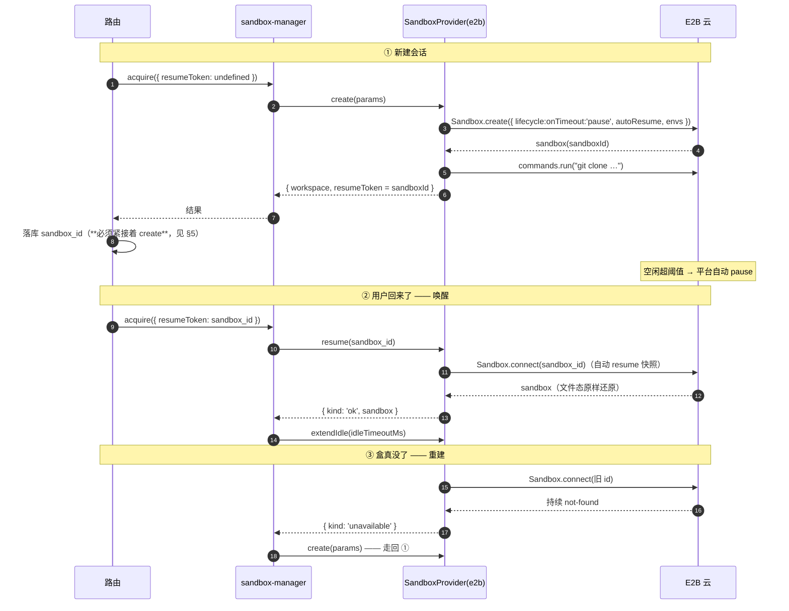

# E2B（宿主层）— 技术方案

> 相关：[功能](../features/deployment.md)。
> 沙盒契约与三家逐接口映射在[沙盒工作区 · 技术方案 §5](../../contract/tech/sandbox.md)；`SandboxProvider` 抽象在[沙盒 provider · 技术方案](../../contract/tech/sandbox-provider.md)。本文只讲 E2B 这一家的落地与坑。

## 1. 一句话

**休眠靠 `onTimeout:'pause'` + `autoResume`，不靠热路径上显式调 `pause()`**——空闲超时平台自动暂停，下一条消息的流量把它自动唤醒，体验跟 Vercel 的快照恢复一致。

## 2. 三态 acquire：新建 · 唤醒 · 重建

**「重连令牌」是 `sandboxId`**，建盒之后才有，所以 `acquire` 必须能把它回传给路由落库（`AcquiredSandbox.resumeToken`）。Vercel 那边不用——它的令牌就是确定性的沙盒名字。

## 3. 刚 pause 的瞬时 404 要重试

沙盒刚 `onTimeout:'pause'`、快照还没落定的那个短窗口里，`connect` 会瞬时抛 `SandboxNotFoundError`，**但盒其实还在，秒级之后就能连上**。

所以 `resume` 对 `connect` 做退避重试：`E2B_RESUME_ATTEMPTS=4`，退避 `500ms × attempt`，总窗口约 3 秒。

**这条不是优化，是保数据**：瞬时 404 重试成功就重连回原来那个盒，**没 push 的改动全保住**；直接判 gone 去重建，那些改动就没了。

只有**持续** not-found 才判 `unavailable` → 重建。识别方式：按 `SandboxNotFoundError` / `NotFoundError` 的名字 + `/sandbox.*not found/i` 兜底匹配 message。**`"Invalid sandbox ID"`（400）不算 gone**，照抛不误——那是真 bug，吞掉会掩盖问题。

## 4. 平台超时是绝对截止时间，跑命令不续期

这是这一家最反直觉的一条，也是一个线上 bug 的根因。

E2B 的 `POST /sandboxes/{id}/timeout` 文档原话是「沙盒将在**请求时刻**起 x 秒后过期」——多次调用互相覆盖，每次都以当前时刻重新起算。**执行命令不会把它往后推。**

真机实测吻合：某个盒 `startedAt 09:52:53`，轮开始时续期一次，`endAt` 就钉死在 `续期时刻 + 5min = 10:00:56`；其间跑了 2.5 分钟命令，`endAt` 纹丝不动。

这条语义有两个后果，原设计都没接住：

1. **进程内缓存会腐坏。** manager 缓存活沙盒句柄，`acquire` 命中就直接返回。沙盒被平台暂停之后句柄还在，后续操作直接打到已暂停的盒 → 裸 `Sandbox … not found` 冒给用户。更糟的是 `resume()` 里那套「重试 + 判 gone + 重建」被缓存短路，**根本没机会跑**——连自愈都不会发生，要等进程重启。
2. **长轮次会被从底下抽走。** 续期只在轮开始和审批路由调，一轮跑得比空闲超时长，沙盒就在轮跑到一半时暂停。

### 4.1 修法

| 层 | 做什么 |
|---|---|
| **1 保活覆盖整轮** | `startHeartbeat(conversationId)` 每 `idleTimeout / 2` 续一次，返回停止函数；**轮级作用域**，轮一收尾就停 |
| **2 缓存可失效** | 缓存项带 `expiresAt` = 最后一次 create/resume/保活 + `idleTimeoutMs`；`acquire` 命中先比时间，过期就驱逐、走 `resume()`（主动）。任何操作抛 gone 也驱逐（被动） |
| **3 gone 判定上升到接口** | `SandboxProvider.isGone(error)`，让 manager 能给**任意操作**抛的错误分类，不只是 `resume()` |
| **4 生命周期收口** | `release()` 同时停心跳；驱逐是唯一出口 |

**心跳为什么必须是轮级、不能常驻**：常驻心跳等于把「空闲自动暂停」整套机制废掉——沙盒永不休眠、持续计费。它要解决的只是「一轮跑得太长」，不是「让沙盒长生」。

**主动 + 被动两半都要**：只算时间不够（时钟会偏、平台可能提前暂停、盒可能被外部删）；只等报错也不够（那意味着每次都要先失败一次，而且失败点可能在轮子中间而不是 `acquire`）。

## 5. 建盒与落库要尽量原子

`sandboxId` 是建盒之后才有的。如果 create 成功、落库之前进程崩了，那个 E2B 沙盒就成了孤儿——而且因为它是 pause 不是 kill，**会一直占额度**。

所以路由里 create 与 insert 放在同一个 try 里，保证「create 成功 → 立即落库」。彻底的孤儿清理靠 `Sandbox.list` + `metadata.conversationId` 兜底，那是运维脚本，不在框架里。

## 6. 模板：资源只能在构建时定死

`SandboxOpts` 只有 template / timeout / lifecycle / envs / metadata，**没有任何内存参数**。E2B 只在构建模板时给你设资源的机会。

自带的 `base` 是 2 vCPU / 512 MiB，跑 `npm install` 会 OOM。所以用 `Template().fromBaseImage()`（**同一个** base 镜像，盒内环境零变化）以 `memoryMB: 1024` 构建并发布 `nimbo-chat-base`。

规格三项都**从 env 读、以代码里的 `DEFAULT_*` 常量兜底**，构建脚本与运行时共用同一组 resolver，名字不会漂。**但生效时机不同**：

- **名字**（`E2B_TEMPLATE`）每次建盒都读，改完下一个盒生效。
- **内存 / 核数**只有构建脚本读，**改完必须重跑 `e2b:template`**（每个 team 一次性，幂等）。

内存/核数填了非正整数**直接抛错终止构建**，不沿用别处那种静默回退——构建是一次性操作，静默把 `4O96` 当成 1024 会发布一个「看着像 4 GiB 实则 1 GiB」的模板，几周后才以 OOM 现形。

> Vercel 侧没有这个问题——它的资源在 `Sandbox.create` 上按盒指定。

## 7. 两个接口层的实测坑

> 三家的完整逐接口映射在[沙盒契约 §5](../../contract/tech/sandbox.md)，这里只记 E2B 独有的。

- **`write()` 不接受裸 `Uint8Array`**（只收 string / ArrayBuffer / Blob / Stream）。适配器做 `Uint8Array → ArrayBuffer` 拷贝转换。这是类型对照测试逼出来的真坑。
- **取消是「放弃等待」，不是真的杀掉。** signal 不传给远程 `commands.run()`，本地 `raceAbort` 独立保证 124/130 的退出码契约——**远程命令可能跑到自然结束**。Vercel 那边同理。

## 8. 取舍与已知限制

- **没做「workspace 自愈代理」。** 即便有了保活 + 缓存失效 + gone 判定，中途暂停仍可能发生（心跳请求本身失败、网络分区）。彻底的做法是把 workspace 包一层、捕获 gone 之后重连重放。**刻意不做**，因为重放安全性要单独设计：只有「命令还没开始跑」就失败（连接时 404）才能安全重试；「命令已经在跑、连接中途断了」重放会**重复执行**——`git push`、`npm publish`、`>> 追加写`都会出事。这个区分做不干净的话，这一层的危害大于收益。
- **保活只保证沙盒活着**，不保证沙盒里的命令做了什么。
- **模板没构建前建盒会拿到 E2B 的 template-not-found 错误**，逃生门是 `E2B_TEMPLATE=base`（内存回到 512 MiB）。
- **测试可以完全离线。** `SandboxProvider` 是纯结构接口，契约测试用进程内 fake，零网络零凭证。
