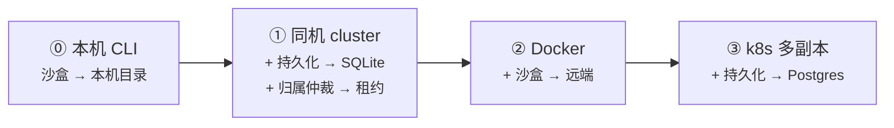

# Node 长驻（宿主层）— 使用手册

> 相关：[技术方案](../tech/deployment.md)，架构总纲 [功能](../../../architecture/features/agent-kernel.md) · [技术方案 附录 B](../../../architecture/tech/agent-kernel.md)。
> 另外三档宿主：[Cloudflare](../../cloudflare/features/deployment.md) · [Vercel](../../vercel/features/deployment.md) · [E2B](../../e2b/features/deployment.md)。
> 术语：[宿主](../../../terms.md) · [归属仲裁机制](../../../terms.md) · [应用层转发](../../../terms.md)。

## 1. 一句话

**这是唯一一档「什么都不装就能跑」的宿主**——[宿主层](../../../terms.md)那四样能力全用内置实现，从 `node app.js` 起步，一路加到 k8s 多副本都不用换框架。

「长驻」的意思是：**你的进程不会被平台随手回收**。它自己决定什么时候退出。这一条是另外几档都不成立的前提，也是这一档能这么省事的根本原因。

## 2. 它适合谁

- **本机跑一个 CLI 工具**——agent 就在你自己电脑上干活，读写你自己的目录。
- **一台服务器上的小应用**——单进程或 Node cluster 多 worker。
- **容器里的常驻服务**——Docker、k8s、ECS Fargate、Railway、Render、Fly.io 都算这一档。

**不适合**：会被平台按请求拉起又销毁的运行环境（Serverless 函数）。那种去看 [Vercel](../../vercel/features/deployment.md) 或 [Cloudflare](../../cloudflare/features/deployment.md)。

## 3. 四样能力，默认都给你了

| 能力 | 默认实现 | 什么时候要换 |
|---|---|---|
| [归属仲裁机制](../../../terms.md) | 内存里一个 Map | **进程不止一个**的时候（cluster / 多副本） |
| [持久化](../../../terms.md) | 进程内存 | **想让对话活过重启**的时候 |
| [流分发](../../../terms.md) | 内置 EventEmitter | 这一档**基本不用换**，见下 |
| [沙盒](../../../terms.md) | 本机执行 + 真实目录 | 不想让 agent 碰你的真实机器的时候 |

**换的顺序是有讲究的**：先换持久化（数据不丢），再换归属仲裁（多进程不打架）。反过来换没有意义——归属仲裁的租约表本身就要存在数据库里。

## 4. 从一台机器长到一群机器

四个台阶，每上一级只多换一样东西：

**流分发从头到尾都不用换。** 因为这一档你总能知道「持有者在哪台机器上」——框架把持有者的地址原样交给你，你的接入代码把请求转过去就行（这叫[应用层转发](../../../terms.md)）。只有连持有者都找不到的环境才需要外挂 Redis，那是 [Vercel 那一档](../../vercel/features/deployment.md)的事。

## 5. ① 是多进程，不是单进程

Node cluster 的 worker 之间**不共享内存**。所以只要你开了第二个 worker，内存 Map 那版归属仲裁就不够用了，必须换成租约版。

这一档有个实在的好处：**网络分区这个最主要的误判来源不存在**（同一台机器、共享文件系统），而且还多一个判据——可以直接看进程还在不在。所以误判风险远低于跨机部署。

**但接口上不能因此偷懒**：租约版归属仲裁的每一次写入都可能被拒绝，这是正常路径不是异常。单机上这条路几乎走不到，可一旦哪天扩到多台机器，没处理这条就是静默的数据损坏。细节见[技术方案](../tech/deployment.md)。

## 6. 成功标准

- 一个全新项目，**不装任何外部件**（不装数据库、不装 Redis、不装沙盒服务），几行代码就能跑起一个能对话、能改文件的 agent。
- 从单进程扩到多副本，**改的是配置不是代码**——换掉持久化和归属仲裁两个实现，业务代码一行不动。
- 进程被 `SIGTERM` 时，进行中的那一轮能[优雅关闭](../../../logic/orchestration/features/graceful-shutdown.md)而不是无声消失。

## 7. 范围与非目标

- **不负责替你选数据库。** 框架给接口和参考 DDL，SQLite / Postgres / MySQL 都能接。
- **不管跨会话的资源冲突。** [独占](../../../terms.md)是按会话保证的——本机 CLI 那档如果多个会话共用一个项目目录，互相踩文件不归归属仲裁管。
- **不做进程崩溃恢复。** 被强杀走的是老路（补一条「已中断」），因为它没停在干净边界上。
