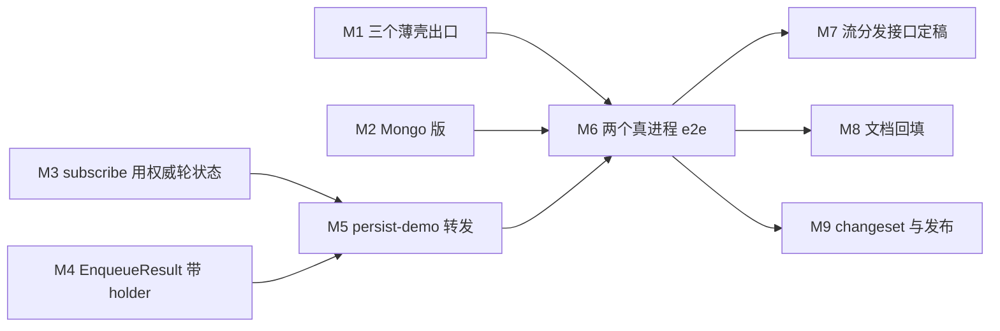
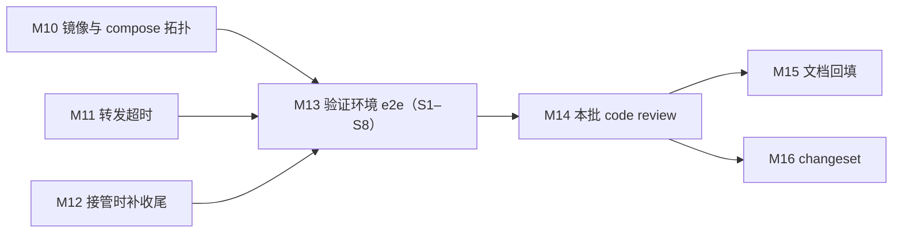

# 多副本部署（Node 长驻）— 施工计划

> 相关：[使用手册](../features/multi-replica.md) · [技术方案](../tech/multi-replica.md) · [Node 长驻 · 功能](../features/deployment.md) ·
> [归属仲裁机制 · 施工](../../../logic/arbitration/plans/arbitration-impl.md)（本计划接着它的 L7–L10 往下做）。

## 0. 一句话

把「两个副本共享一个 Postgres」从**设计上成立**推到**跑得起来、验得了、出问题查得到**。

**状态：九单全部交付**（2026-09-18，逐条见 §9 变更记录）。底座（租约版[归属仲裁机制](../../../terms.md)）
已于 2026-09-01 交付，本计划做的是它的四个出口、一处订阅侧的修正、一套接入层示范，和一次真进程端到端。

最后落地的是 **M2（Mongo 版租约仲裁）**——它曾因「本机没有可用的 MongoDB，一条都验不了」压了九天，
2026-09-18 对真 MongoDB 8 补齐，四组一致性用例 21 条全绿。

M6 的形态与原计划不同、而且更早可用：**用一个 SQLite 文件对两个真进程**，那就是部署形态里的
「① 同机 cluster」，走的代码路径与 Postgres 完全相同（同一个 `leaseArbitration`，只是方言不同），
**不需要任何外部服务**。真 Postgres 那一档留给 CI。

**第二批（2026-09-13 立项，同日交付）**：把端到端搬到**真跨容器 + 真 Postgres**（[多副本验证环境](../../../terms.md)），
顺带修掉读代码时发现的两处缺陷。七单全部交付，八个故障场景在 Postgres 18 上连续通过。拆单见 §7，验证方案与实际结果见 §8。

## 1. 起点：这些已经有了，别重做

[归属仲裁机制 · 施工计划](../../../logic/arbitration/plans/arbitration-impl.md) 的 L0–L6 与 L9 场景 3
已经交付：租约表四档 DDL、`leaseArbitration()`（抢占 / 心跳 / 自我围栏 / 取号 CAS / `listStale`）、
18 条仲裁一致性用例、SQLite / pglite / 真 Postgres / 真 MySQL 四档全绿。

> ⚠️ 那份计划的 **§1「现状盘点」是立项当时的快照**，里面写着「租约版实现 ❌ 不存在」。
> **以它的 §3 阶段表和 §8 变更记录为准**，别照着 §1 重做一遍（M8 会给那一节加一行说明）。

本计划从它的 L7 接着往下：

| 原编号 | 内容 | 本计划 |
|---|---|---|
| L7 | 三个薄壳导出 `*Arbitration()` | **M1** |
| L8 | Mongo 版 | **M2** |
| L9 完整版 | 两个真进程的端到端 | **M6** |
| L10 | 接入层转发 | **M5** |
| （新发现） | `subscribe` 的轮状态帧只看本地 | **M3** |
| （新发现） | `enqueue` 被拒时没有结构化 `holder` | **M4** |
| （新发现） | 流分发接口未定稿 | **M7** |

## 2. 拆单总表

**依赖只有两处收口**：M5 要等 M3 + M4，M6 要等 M5 加 M1 / M2 里的至少一个。其余全可并行。



| 单 | 目标 | 动谁 | 大小 | 状态 |
|---|---|---|---|---|
| **M1** | 三个薄壳各导出一个 `*Arbitration()` | `persist-sqlite` / `-postgres` / `-mysql` | S | ✅ |
| **M2** | Mongo 版租约仲裁，过同一套一致性用例 | `persist-mongo` | **L** | ✅ |
| **M3** | `subscribe` 的轮状态快照改用权威答案 | `@runko/agent` | S | ✅ |
| **M4** | `EnqueueResult` 的拒绝分支带结构化 `holder` | `@runko/agent` | XS | ✅ |
| **M5** | persist-demo 的多副本形态与转发中间件 | `apps/persist-demo` | **L** | ✅ |
| **M6** | 两个真进程的端到端四场景（SQLite 文件档） | `apps/persist-demo` | **L** | ✅ |
| **M7** | 流分发接口定稿（当前两方法），游标制归 Vercel 那条线 | `docs` | XS | ✅ |
| **M8** | 文档回填与漂移清理 | `docs` · 三处代码注释 | S | ✅ |
| **M9** | changeset 与版本 | `.changeset/` | XS | ✅ |

---

## 3. 各单详细

### M1 · 三个薄壳各开一个仲裁出口

**为什么**：`leaseArbitration()` 只从 `@runko/persist-kysely` 导出，而三个薄壳的存在理由正是
「替你把 Kysely 和 `flavor` 装配好」。现在装了薄壳还得再装 kysely 包、再自己拼一个实例。

**做什么**：每个包加一个与 `*Persistence()` 对称的函数，吃**同一个驱动实例**。

```ts
// packages/persist-sqlite/src/index.ts
export type { LeaseArbitrationOptions } from "@runko/persist-kysely";
export type SqliteArbitrationOptions = Omit<LeaseArbitrationOptions, "flavor">;

export function sqliteArbitration(database: SqliteDatabase, opts: SqliteArbitrationOptions): Arbitration {
  return leaseArbitration(toKysely(database), { ...opts, flavor: "sqlite" });
}
```

`postgresArbitration(pool, opts)` / `mysqlArbitration(pool, opts)` 同形，三处只是填掉 `flavor`。

**注释里要写清的两条**：

1. `*Persistence(db)` 与 `*Arbitration(db)` 会各建一个 Kysely 实例。Kysely 是查询构建器、
   连接池是你给的那个驱动，两个实例共用同一个池，**不多占资源**。
2. `migrate()` 仍然只调一次，`agent_leases` 已经在里面。

**怎么验**：三个包各自把[仲裁一致性套件](../../../../packages/conformance/README.md)的三组用例
接上（SQLite 直接跑；Postgres / MySQL 沿用 `RUNKO_TEST_POSTGRES_URL` / `RUNKO_TEST_MYSQL_URL` 门禁）。
`persist-kysely` 已经跑过同一套，这里验的是**装配**没接错。

**验收**：三个包的 README 各多一段「多副本怎么配」，示例可直接复制运行。

---

### M2 · Mongo 版租约仲裁 ✅

> **已交付 2026-09-18。** 与计划一致，两处**刻意的偏差**在下面标了「实际」。

**为什么**：`persist-mongo` 不是薄壳（Kysely 是 SQL 查询构建器，用不上），它得直接实现
`Arbitration`。不做的话，用 Mongo 的宿主只能停在单进程。

**做什么**：新文件 `packages/persist-mongo/src/arbitration.ts`，导出
`mongoArbitration(db, { holder, heartbeatMs?, takeoverMs?, now? })`。

集合 `agent_leases`，`_id` 就是会话 id（形状见[技术方案 §4.2](../tech/multi-replica.md)）。
`migrate()` 补一个索引：`{ heartbeatAt: 1, leaseToken: 1 }`，服务 `listStale`。

> **实际偏差①：字段名用驼峰，不是原计划说的「与 SQL 表一一对应」的下划线。** 同一个
> database 里另外三个集合全是驼峰，而这两边永远不会 join、也不会互相迁移——为了对齐一张
> 碰不到的表把唯一一个集合写成另一种风格，只让翻库的人多愣一下。技术方案 §4.2 已同步。

四个操作的写法（**比 SQL 版少一次往返**，因为 `findOneAndUpdate` 直接返回更新后的文档，
不必为了绕开 MySQL 的 `affectedRows` 再读回来）：

| 操作 | 写法 |
|---|---|
| `acquire` | 读一次判 `busy`（保住 `seedSeq` 的惰性）→ 文档不存在则 `insertOne` 播种、撞 `E11000` 忽略 → `findOneAndUpdate` 决胜负（filter 带 `$or: [{leaseToken: null}, {heartbeatAt: {$lt: at - takeoverMs}}]`，`returnDocument: "after"`） |
| `nextSeq` | `findOneAndUpdate({ _id, leaseToken: token }, { $inc: { seqWatermark: 1 }, $set: { heartbeatAt } }, { returnDocument: "after" })`；返回 `null` = 已出局 |
| `release` | `updateOne({ _id, leaseToken: token }, { $set: { holder: null, leaseToken: null } })`——**只在还持有时才放手**，不删文档 |
| `clearStale` | `updateOne({ _id, heartbeatAt: { $lt: now - takeoverMs } }, …)`——**必须带陈旧判据**，否则会擦掉活着的持有者 |

**心跳与自我围栏：复制 `persist-kysely` 的那一段，不抽包。** 理由见
[技术方案 §4.3](../tech/multi-replica.md)。两处都写了「这是刻意的重复，改一处必须同步另一处」。

**怎么验**：接同一套仲裁一致性用例的**四组**（通用 / 多节点 / 超时接管 / 报 takeover），门禁沿用
`RUNKO_TEST_MONGO_URL`。`expire` 钩子照 `persist-kysely` 的做法——**冻结持有者那一侧的时钟**，
不要只把 `heartbeatAt` 拨到过去（持有者的下一拍心跳会把它刷回来，接管随机失败）。

**验收结论**：四组一致性用例 **21 条全绿**（含「被误判的老持有者取号一律被拒」这条核心断言，
在**真 MongoDB 8** 上过），加 Mongo 特有 5 条 + 配置校验 3 条，本文件共 **30 条**；
`persist-mongo` 整包 67 条全绿。

**变异测试验了四处**，确认用例真的咬得住：`clearStale` 去掉陈旧判据 → 红；`release` 去掉令牌
过滤 → 红；自我围栏判断挪进 `catch` → 红。

> **实际偏差②：多补了一条用例。** 第四处变异——心跳把 `matchedCount` 换成 `modifiedCount`
> ——**四组一致性用例全绿**。那是 Mongo 独有的行为（匹配到但值没变时 `modified=0`），套件是
> 跨实现的、验不到它，而它真会触发：`acquire` / `nextSeq` 也写 `heartbeatAt`，跟一拍心跳落在
> 同一毫秒里值就没变，于是一次成功的心跳被当成「被接管了」，把用户这一轮无缘无故掐断。
> 补了一条「把时钟冻住，每一拍都写同一个值」的用例钉死它。同一个坑本包在 `decisions.settle`
> 上已经踩过一次（见 `persist-mongo` README「两个实测出来的坑」）。

**顺手做的**：`apps/persist-demo` 的 `mongo` 那一档接上 `makeArbitration`——四档库现在都能开
多副本了（`memory` 档除外，它本来就只活在一个进程里）。

**并且给它补了跨进程验证**：`apps/persist-demo/test/multi-replica.e2e.test.ts` 加了一档
「两个真进程共用一个真 MongoDB」，挑两条最能说明问题的跑——**转发**（归属只落在一个副本上、
另一个副本拿着 `holder` 转过去）与**接管**（持有者 `kill -9` 之后另一个副本抢得到）。
理由：上面四条走的是 Kysely 那份实现，Mongo 版是另写的一份，那四条一条也证明不了它。
门禁沿用 `RUNKO_TEST_MONGO_URL`，不给就跳过。**两条全绿。**

---

### M3 · `subscribe` 的轮状态快照改用权威答案

**为什么**：这是四个缺口里唯一一处**真错**。多副本下，副本 A 上的订阅者去看一份跑在副本 B 上的
对话，拿到的[轮状态快照](../../../terms.md)是 `{ active: false }`——服务端权威答案说「没有轮在跑」，
而实际上有。接入层因此既不知道该转发，也没法告诉用户这一轮在别处。

**做什么**：`packages/agent/src/runtime.ts` 的 `subscribe` 第 ④ 步，把
`registry.get()` 的本地判断换成与 `getActivity()` 同一套（本地登记表命中就用它，否则回退
`arbitration.inspect()`），并在**归属不在本进程**时按 `follow: "turn"` 收线。
代码形状见[技术方案 §5.2](../tech/multi-replica.md)。

**三条不能破**：

1. **不新增空隙。** 那个「取草稿 + 清缓冲」的同步临界区在第 ③ 步，`inspect()` 落在第 ④ 步——
   那里本来就有一次 `await persistence.queue.list(…)`。别把 `inspect()` 挪进临界区。
2. **单进程零影响。** 本地登记表命中时 `inspect()` 一次都不会被调到，现有用例一条都不用改。
3. **`Frame` 类型不变。**

**怎么验**：`@runko/agent` 加两条用例——

- 归属在本进程：`activity` 帧的 `active` / `holder` 与今天一致，`inspect()` 未被调用（用假件计数）；
- 归属在别的 holder（用内存仲裁伪造一条别人持有的归属）：`activity` 帧报 `active: true` +
  对方的 `holder`，且 `follow: "turn"` 立刻收线。

---

### M4 · 起轮被拒时带上结构化 `holder`

**为什么**：`reason: "held_by_other"` 时，`holder` 现在只活在 `message` 那句英文文案里
（`This conversation is owned by …`）。接入层要转发，只能去字符串里抠。

**做什么**：`packages/agent/src/types.ts`

```ts
| { mode: "rejected"; reason: EnqueueRejection; message: string; holder?: string }
```

只在 `held_by_other` 时有值；`packages/agent/src/runtime/queue.ts` 里那处已经拿着 `outcome.holder`，
顺手带出来即可。向后兼容——接入层不改也能编译。

**怎么验**：一条用例断言 `held_by_other` 的结果带 `holder`，其余四种拒绝原因不带。

---

### M5 · persist-demo 的多副本形态与转发

**为什么**：转发是**接入层的活儿**，框架只给不透明的 `holder`。没有一份能跑的示范，
「多副本可用」就只是一句话。放在 `@runko-demo/persist-demo` 而不是 chat 应用，是因为它本来
就支持 Postgres / MySQL / Mongo，而 chat 应用是单进程 + SQLite、`held_by_other` 那条路走不到。

**做什么**：

**① 自报身份。** 两个环境变量：

| 变量 | 缺省 | 作用 |
|---|---|---|
| `RUNKO_NODE_URL` | `http://127.0.0.1:${PORT}` | 本副本的**可达地址**，原样进 `holder` |
| `RUNKO_PEER_TOKEN` | 空（= 不校验） | 副本之间的内部令牌 |

`app.ts` 装配时：`DEMO_DB` 不是 `memory` 就用 `*Arbitration(driver, { holder: RUNKO_NODE_URL })`，
否则保持内存版。

**② 转发中间件。** 判据只有一条——**这件事的状态在数据库里，还是在持有者的进程内存里**：

| 端点 | 要转吗 | 触发条件 |
|---|---|---|
| `POST …/messages` | ✅ | `rejected` 且 `reason === "held_by_other"` |
| `POST …/abort` | ✅ | `getActivity()` 说 `active && !local` |
| `POST …/approvals/:callId` | ✅ | 同上 |
| `POST …/questions/:callId` | ✅ | 同上 |
| `GET …/stream` | ✅ | 同上，**流式**转发 |
| `GET …/messages` · 队列四个端点 | ❌ | 状态在数据库，任何副本都能答 |

> **审批与提问最容易漏**：内存窗口里，人在回路桥把待裁决项挂在那一轮的 `ActiveTurn` 对象上，不是数据库里。
> 裁决打到别的副本会拿到「没有这条待定裁决」，而用户看到的是提交成功。（[挂起](../../../terms.md)之后没有持有者，
> 任一副本都能答——判据「`active && !local` 才转」本身就覆盖了这一档，见[挂起与恢复 · 技术方案 §9.1](../../../logic/orchestration/tech/suspend-resume.md)。）

**③ 三道防护**（缺一条都会在真机上咬人）：

- **环路**：转发出去带 `x-runko-forwarded: 1`；**带着这个头进来的请求一律不再转发**，
  归属这一瞬间又换了人也不行，宁可回 409 让客户端重试；
- **鉴权**：副本之间是内部调用，用 `RUNKO_PEER_TOKEN` 校验，不透传用户凭据；
- **背压**：`GET …/stream` 必须流式代理，中间任何一层把响应体读完再吐，直播就变成
  「一轮跑完才出现」。

**怎么验**：单机起两个进程（`PORT=3910` / `3911`，同一个 `DATABASE_URL`），手动跑一遍
[技术方案 §7.1 / §7.3](../tech/multi-replica.md) 的两条路。自动化归 M6。

**验收**：`apps/persist-demo/README.md` 多一节「跑两个副本」，命令可直接复制。

---

### M6 · 两个真进程、一个真 Postgres 的端到端

**为什么**：这是整个功能**唯一真正的证明**。单进程测试跑绿不代表租约版没问题——
两个 `Arbitration` 实例共享一个真库已经能验「令牌 CAS 落在数据库里」这条核心路径
（L9 场景 3 已经做了），但**进程崩溃、连接池各自独立、时钟不同步**这些只有跨进程才有。

**做什么**：`apps/persist-demo/test/multi-replica.e2e.test.ts`，用 `child_process.spawn` 起两个
真进程，门禁沿用 `RUNKO_TEST_POSTGRES_URL`（没配就整档 skip，与现有真库用例同一套）。

测试里把两个时间参数调小以免每条跑一分钟：**心跳 200ms / 接管 900ms**——注意
`leaseArbitration()` 有「接管阈值必须 ≥ 3× 心跳」的构造期校验，900 / 200 = 4.5×，安全。

| 场景 | 怎么做 | 断言 |
|---|---|---|
| **① 抢占与转发** | 两个进程同时对同一个会话 POST | 只有一个真起轮；另一个经转发也拿到 202，**账本里这条用户消息只有一份** |
| **② 崩溃接管** | `kill -9` 持有者 | 接管阈值过后另一个进程能起轮；旧会话的[孤儿轮](../../../terms.md)被 `recover()` 补上「已停止」 |
| **③ 被误判的老持有者** | `SIGSTOP` 冻住持有者 → 等接管 → `SIGCONT` 唤醒 | 老持有者此后的写入**一律被拒**；账本没有重号、没有覆盖、没有空洞之外的异常 |

**场景 ③ 是这一整单的核心**，其余两条是它的推论。断言要落在**账本内容**上，不是落在日志或
返回码上——「没写坏」只有账本能证明。

**怎么验**：本地 `docker run` 一个 Postgres 跑一遍；CI 已经有三个真库的 service container
和 `RUNKO_TEST_*_URL`，直接接上。

**验收**：三个场景在 CI 上稳定跑绿（连跑 3 次不 flaky）。

---

### M7 · 流分发接口定稿

**为什么**：[流分发的契约](../../contract/tech/stream-fanout.md)状态是「接口未定稿」，那是本档目前
唯一还挂着的框架级未决项。M6 跑绿之后，这一档用不用得上外挂广播就有真实答案了。

**做什么**：改 `docs/host/contract/tech/stream-fanout.md` 与 `features/stream-fanout.md`：

- 把状态从「接口未定稿」改成**「接口定稿：`publish` + `subscribe` 两个方法」**；
- §7 那四条 TODO 逐条结案：方法签名 ✅ 定为现状；**保留窗口 / 游标 / 第二条腿**三条标为
  「只有外挂广播那条腿才需要，归 [Vercel 那一档](../../vercel/tech/deployment.md)」；
- 「与现有 chat 应用那套 SSE 怎么并轨」结案为：chat 应用是单进程，用内置实现，不并轨。

**这一单不写代码**——接口本来就是现在这个形状，定稿是把「未定」这个状态摘掉。

---

### M8 · 文档回填与漂移清理

清单见[技术方案 附录 B](../tech/multi-replica.md)。逐条：

| # | 位置 | 改什么 |
|---|---|---|
| 1 | `host/node/tech/deployment.md` front matter | `packages` 里那三个不存在的包名换成真实的五个 |
| 2 | 同上 §4 正文 | 同上 |
| 3 | 同上 §3.1 时序图 | 「影响 1 行 / 0 行」改成「读回来比对令牌」——实现刻意不看影响行数 |
| 4 | 同上 §2 表格 | ③ 那一行链到本计划 |
| 5 | `logic/arbitration/plans/arbitration-impl.md` §1 | 加一行：这是立项时的快照，当前事实见 §3 与 §8 |
| 6 | 同上阶段表 | L7 / L8 / L9 完整版 / L10 各链到本计划对应的单 |
| 7 | `packages/persist-kysely/src/index.ts` 文件头 | 删掉「这一版只出持久化，不含租约版归属仲裁」 |
| 8 | `packages/persist-mongo/src/index.ts` 文件头 | 同上（✅ 随 M2 一起改了） |
| 9 | `packages/agent/README.md`「还没做的」 | 租约版已交付；剩的是薄壳出口与 Mongo 版 |
| 10 | 三个薄壳 + mongo 的 README | 各加一节「多副本怎么配」 |

第 7、8、9 是**纯注释与 README**，按仓库规矩不需要 changeset。

**怎么验**：`pnpm docs:check` + `pnpm docs:build`（后者做全站死链检查），两步都跑完即退。

---

### M9 · changeset 与版本

| 包 | 改动 | 建议级别 |
|---|---|---|
| `@runko/persist-sqlite` · `-postgres` · `-mysql` | 新增 `*Arbitration()` 导出（M1） | minor |
| `@runko/persist-mongo` | 新增 `mongoArbitration()` 导出（M2） | minor ✅ 已出（`.changeset/mongo-lease-arbitration.md`，2026-09-18） |
| `@runko/agent` | `EnqueueResult` 加可选 `holder`（M4） | minor |
| `@runko/agent` | `subscribe` 的轮状态帧改用权威答案（M3） | **patch？待确认** |

**M3 那条要问一次再落**：它是 bug 修复（单进程行为一字不变），但多副本下同一个订阅拿到的
`activity` 帧内容变了。按语义化版本是 patch，可它改变了可观察行为——**破坏性判断宁可问**。

M5 / M6 落在 `apps/persist-demo`，是 `private: true` 的不发布成员，**不写 changeset**。

---

## 4. 验收标准

逐条对上[Node 长驻 · 功能](../features/deployment.md)与
[归属仲裁机制 · 功能 §5](../../../logic/arbitration/features/arbitration-impl.md)：

| # | 标准 | 怎么验 |
|---|---|---|
| 1 | 单进程下不装任何东西，行为与今天完全一致 | 现有全量用例照跑，一条不改 |
| 2 | 四个持久化包都能拿到租约版仲裁 | M1 + M2，各自过三组一致性用例 |
| 3 | 两个进程同时起轮只有一个成功，另一个能转发过去 | M6 场景 ① |
| 4 | 杀掉持有者能被接管，孤儿轮被补上收尾 | M6 场景 ② |
| 5 | **被误判的老持有者写入一律被拒，账本没被写坏** | M6 场景 ③ —— **这条是核心** |
| 6 | 副本 A 上的订阅者能看到跑在副本 B 上那一轮的内容 | M3 + M5，M6 里顺带断言 |
| 7 | 审批 / 提问 / 停止打到任一副本都能生效 | M5 的转发矩阵，M6 里各跑一次 |
| 8 | 业务代码在单副本与多副本下**完全一样** | 装配处（`app.ts`）之外零改动 |

## 5. 三处容易做错

**① 把 `holder` 当[租期标识](../../../terms.md)用。** 「A 失联 → B 接管 → B 挂 → A 重新抢占」时，
A 滞留在网络里的旧写入会被放行。**粒度必须是一次租期**，不是一个进程。

**② 心跳失败当成失去归属。** 一次网络抖动打不中，可能只是这一次超时；要连续失败到逼近阈值
才收手。但**取号的 CAS 打不中就是真的失去了**（令牌已被换掉）——两者处置不同，别混用同一个判定。

**③ 转发写成同步代理。** `GET …/stream` 一旦被中间层缓冲，直播就退化成「一轮跑完才出现」，
而这个 bug 在单副本本地测试里**永远复现不了**。

## 6. 非目标

- **`@runko/stream-redis`**（外挂广播）：这一档转发够用，理由见[技术方案 §6](../tech/multi-replica.md)。它归 Vercel 那条线。
- **`@runko/durable-object`**：另一档宿主，另一条线。
- **改造 chat 应用跑多副本**：它是单进程 + SQLite，`held_by_other` 走不到。示范放在 persist-demo。
- **[挂起](../../../terms.md)与恢复**：另一条线（路线图 K3），已交付，见[挂起与恢复 · 施工进展](../../../logic/orchestration/plans/suspend-resume.md)。它的两进程 e2e 放在 persist-demo（`test/suspend-resume.e2e.test.ts`），顺带补上了本批测不了的审批与提问转发。
- **依赖基础设施的 sticky routing**：亲和的单位是「一次排空」，不是一轮、也不是会话永久绑定。

## 7. 第二批拆单：跨容器验证与两处修复

设计见[技术方案 §9–§11](../tech/multi-replica.md)。



| 单 | 目标 | 动谁 | 大小 | 状态 |
|---|---|---|---|---|
| **M10** | 镜像、compose、nginx、起停脚本 | `apps/persist-demo/docker/` · `package.json` | M | ✅ |
| **M11** | 转发只给「等对方开口」设超时，超时回 503 | `apps/persist-demo/src/forward.ts` · `server.ts` · `index.ts` · `model.ts` | S | ✅ |
| **M12** | 抢占顶掉过期持有者时报 `takeover`，新持有者补「已停止」 | `@runko/agent` · `@runko/persist-kysely` · `@runko/conformance` | M | ✅ |
| **M13** | 验证环境里的八个场景自动化 | `apps/persist-demo/test/lab.e2e.test.ts` | L | ✅ |
| **M14** | 对本批全部改动做一次 code review，修掉确认的问题 | 本批全部文件 | M | ✅ |
| **M15** | 回填：使用手册、技术方案、施工计划、README、仲裁文档 | `docs` · README | S | ✅ |
| **M16** | changeset | `.changeset/` | XS | ✅ |

### M10 · 镜像与 compose 拓扑

**做什么**：`apps/persist-demo/docker/` 下四个文件。

| 文件 | 内容 |
|---|---|
| `Dockerfile` | `node:24-bookworm` → 装 pnpm 11 → `pnpm install --frozen-lockfile --filter "@runko-demo/persist-demo..."` → 构建依赖包 `dist` → `node --import tsx src/index.ts`（2026-09-18 改成两阶段 alpine，见 [§8.4](#_8-4-镜像瘦身的验证)） |
| `Dockerfile.dockerignore` | 排除 `node_modules`、`dist`、`.git`、文档站缓存、`*.db`。**放在 Dockerfile 旁边**，不往仓库根目录加东西 |
| `compose.yml` | Postgres + replica-a/b/c + nginx；两个网络；a→b→c 串行启动；时间参数与端口都可用环境变量覆盖 |
| `nginx.conf` | 三个副本轮询；`proxy_buffering off` |

`package.json` 加三个脚本：`lab:up`（`up -d --build --wait`）、`lab:down`（`down -v`）、`test:lab`（带门禁变量跑 M13）。

**验收**：`docker compose config -q` 通过；`lab:up` 返回时三个副本全部健康；`lab:down` 之后不留容器与卷。

### M11 · 转发超时

**做什么**：`forward()` 里用 `AbortSignal.any([客户端信号, 超时信号])`，**拿到响应头就撤计时器**；
超时与连不上走同一个「稍后再试」分支。超时时长放在 `NodeIdentity.forwardTimeoutMs`，入口 `index.ts` 读
`RUNKO_FORWARD_TIMEOUT_MS`（缺省 10000）。

**与原计划的偏差**（都是 M13 实跑出来的）：

- 「稍后再试」从 **421 改成 503 + `Retry-After: 1`**，`server.ts` 里「归属在别处又转不了」那条一并改。原因：
  Fetch 标准要求客户端自动重发 421，实测用时翻倍、POST 被悄悄重发。见[技术方案 §10.4](../tech/multi-replica.md)。
- 回声模型 `slowModel` 的等待改成**可被中断**（审查第 2 条的前提），否则被停掉的轮也要睡满整段。

**验收**：✅ S7「冻住期间转发」在 2～3.5 秒之间回 503；S2 的 SSE 转发不被超时切断（一轮 10 秒 > 超时 2 秒）。

### M12 · 接管时补收尾

**做什么**（形状见[技术方案 §9.3](../tech/multi-replica.md)）：

1. `packages/agent/src/arbitration.ts`：`AcquireResult` 成功分支加 `takeover?: { holder?: string }`；
2. `packages/persist-kysely/src/arbitration.ts`：读到的行令牌不为空、且条件 UPDATE 赢了 → 带 `takeover`；
3. `packages/agent/src/runtime/`：`ActiveTurn` 记下 `takeover`；`runToCompletion` 读账本前补标记并广播 `message` 帧；
   与 `recover()` 共用一个写标记的函数；新增理由文案常量；
4. `packages/conformance/src/arbitration.ts`：接管组加用例——过期被顶掉时带 `takeover`、首次抢占与释放后再抢不带；
5. `packages/agent/test/`：用假仲裁返回 `takeover`，断言账本在新一轮用户消息之前多一条 `interrupted` 标记，且不带 `takeover` 时不多写。

**与原计划的偏差**（审查后）：

- 「顶掉过期持有者时报 `takeover`」从接管组里**拆成单独一组可选导出** `arbitrationTakeoverReportCases`。
  并在接管组里的话，已有的第三方租约实现升级套件就会无故变红，与「字段可选」自相矛盾。
- 顺带修 `turn.ts` 一处老竞态：挂 `grant.signal` 监听时信号若**已经** abort，监听不会响。补标记让这段空档
  变宽了，所以挂完监听补查一次，并加单测。

**验收**：✅ 根目录 `pnpm test` 全绿（`@runko/agent` 122 条、`persist-kysely` 113 条、`persist-sqlite` 55 条、`conformance` 37 条）；
M13 的 S5、S7、S8 在真 Postgres 上看到接管理由的「已停止」标记。

### M13 · 验证环境端到端

**做什么**：`apps/persist-demo/test/lab.e2e.test.ts`，八个场景见[技术方案 §11.4](../tech/multi-replica.md)。
没设 `RUNKO_TEST_LAB=1` 就整档跳过；自带 `up --build --wait` 与 `down -v`；独立项目名 `runko-lab-e2e` 与独立端口。

**验收**：八个场景全绿，连跑两次不 flaky；跑完 `docker ps -a` 里没有 `runko-lab-e2e` 的残留。

### M14 · 本批 code review

**做什么**：对第二批全部 diff 做一次审查，重点看：并发与竞态（§9 的补标记时机、§10 计时器与流）、
类型逃逸（`as` / `any` / `!`）、测试是否测到点、文档与代码是否一致。确认的问题当批修掉并重跑 M13。

**结论**：9 条（P1 两条、P2 七条），全部处置，逐条如下。审查由一个全新上下文的 agent 只读完成（避免被实现时的思路带偏）。

| # | 级别 | 问题 | 处置 |
|---|---|---|---|
| 1 | P1 | 挂 `grant.signal` 监听前归属已丢，监听不响，这一轮照常跑完 | ✅ 修：挂完补查一次；单测「补标记时就丢了归属」，去掉修复即红 |
| 2 | P1 | S8 只证明账本没写坏，证明不了自我围栏 | ✅ 修：订阅持有者自己的流，**在没人接管时**断言它早于模型结束就停了；模型等待改为可中断 |
| 3 | P2 | S4 库卡 2 秒离围栏只差不到 1 秒，会偶发 | ✅ 缩到 1 秒 |
| 4 | P2 | `beforeAll` 失败时 `pool` 未赋值，`afterAll` 抛错导致容器残留 | ✅ `pool` 改为可空，`pool?.end()` |
| 5 | P2 | 冻住后没人接管的那一轮仍补不上标记，changeset 说「一定会」过头 | ✅ 措辞收窄；[技术方案 §9.6](../tech/multi-replica.md) 记为已知遗漏 |
| 6 | P2 | 强制用例与「字段可选」矛盾，第三方升级会变红 | ✅ 拆成可选导出组，minor 站得住 |
| 7 | P2 | 「超时后结果未知」不只冻住，持有者慢也会触发 | ✅ 附录 C 与使用手册 §5 补上 |
| 8 | P2 | 文档里残留 421、M11 描述与实现不符 | ✅ 回填（M15） |
| 9 | P2 | S7 的 `leaseHolder` 断言分不出「老持有者 release 擦掉了别人」 | ✅ 改为趁新一轮还在跑时解冻老持有者，断言持有者仍是新持有者 |

审查后用最终代码重跑 lab 两轮，均 8/8 通过（见 §8.3）。

### M15 · 文档回填

逐条：本文 §7 状态与 §8 实际结果；[技术方案](../tech/multi-replica.md)状态行与 §2 / §3 现状列；
[使用手册](../features/multi-replica.md)与实现对齐；[Node 长驻 · 使用手册](../features/deployment.md)链到多副本手册；
`apps/persist-demo/README.md` 加「验证环境」一节；[归属仲裁机制 · 技术方案](../../../logic/arbitration/tech/arbitration-impl.md)补 `takeover` 字段。

**验收**：`pnpm docs:check` + `pnpm docs:build` 通过。

### M16 · changeset

| 包 | 改动 | 建议级别 |
|---|---|---|
| `@runko/agent` | `AcquireResult.takeover`（新增可选字段）+ 接管时补「已停止」 | minor |
| `@runko/persist-kysely` | 租约版仲裁报 `takeover` | minor |
| `@runko/conformance` | 接管组新增用例 | minor |

`persist-sqlite` / `-postgres` / `-mysql` 只是透传 `leaseArbitration`，源码不动，**不写**。
M10 / M11 / M13 落在 `private: true` 的 `apps/persist-demo`，**不写**。

### 追加（2026-09-13）：看得见的日志

**起因**：场景跑绿之后，用户想看「核心成功路径」每一步在哪个副本、按什么顺序、花多久，而副本什么都不打、
测试跑完容器日志也被删了。设计见[技术方案 §11.6](../tech/multi-replica.md)；OTel 这批不做，理由见附录 D。

| 单 | 目标 | 动谁 | 大小 | 状态 |
|---|---|---|---|---|
| **M17** | ~~框架补日志：租约版可选 `logger`；轮编排补「起轮」「丢归属」~~ | `@runko/persist-kysely` · `@runko/agent` | S | ❌ 撤销 |
| **M18** | demo 注入文本 logger：`RUNKO_LOG_LEVEL`、副本名、HTTP 请求耗时、转发与 503 的原因 | `apps/persist-demo/src/` | S | ✅ |
| **M19** | `test:lab` 收集日志到 `logs/lab-<时间>/`：每场景后覆盖写各容器日志、`test.log`、合并的 `timeline.log`、`lab-latest` 链接；`lab:logs` 给手动环境用 | `apps/persist-demo/test/` · `scripts/` · `package.json` · `.gitignore` | M | ✅ |

**M17 为什么撤销**：实现过、实跑有效（时间线里能读出「心跳失败 → 自我围栏 → 顶掉过期租约」），但方向不对——文案与级别写死在框架里。
用户指出应当「框架发事件、宿主自己打」，随即对齐了可观测性方案（技术方案附录 D）：删掉注入式 `Logger` 与 `RuntimeHooks`，
改为带类型的事件。租约的日志将由那份方案的事件层提供（[可观测性 · 施工计划](../../../architecture/plans/observability.md) O3 / O7），这批不提交框架层改动。

**M18 实际**：logger 的格式与级别过滤有单测；普通读请求降到 debug（否则测试轮询每 200 毫秒刷一行）；`pnpm start` 缺省 info。
**M19 实际**：S1 能按顺序读出「A 起轮 → B 抢输 → B 转发 → A 排队 → 收尾 → 出队起下一轮」，S7 能读出「冻住 → 转发等满 2 秒回 503 → 接管方补已停止」。
中途修掉两处：被杀的副本改用 `docker compose start` 拉起（`up` 会重建容器、丢掉旧日志）；`lab-latest` 软链接第二次跑时删不掉（`rmSync` 不认软链接，改 `unlink`，有单测）。

**changeset**：不需要。M18 / M19 都落在 `private: true` 的 `apps/persist-demo`。

## 8. 第二批验证方案

### 8.1 环境

| 项 | 要求 |
|---|---|
| Docker | Docker Engine 带 compose v2（本机 Docker 29.4 / Compose 5.1）；Postgres 镜像 `postgres:18-alpine`（18.1） |
| Node / pnpm | Node ≥ 24，pnpm 11（只在宿主机跑测试进程；镜像里自带） |
| 网络 | 首次构建镜像要从 npm 源拉依赖 |

### 8.2 运行步骤

```sh
pnpm build                                              # 包的 dist（宿主机跑单测要用）
pnpm --filter @runko/agent test                         # M12 单测
pnpm --filter @runko/persist-kysely test                # M12 一致性用例
pnpm --filter @runko/persist-sqlite test
pnpm --filter @runko-demo/persist-demo typecheck
pnpm --filter @runko-demo/persist-demo test             # 原有 e2e，lab 档自动跳过
pnpm --filter @runko-demo/persist-demo test:lab         # M13：起环境 → 八个场景 → 删环境
docker ps -a --filter name=runko-lab-e2e                # 应当为空
pnpm docs:check && pnpm docs:build
```

### 8.3 用例、预期与实际

| 用例 | 预期 | 实际 |
|---|---|---|
| 改动前的镜像上复现两处缺陷（探测脚本） | 崩溃那一轮无标记；转发到冻住的持有者一直挂 | ✅ 复现：账本 `user,user,assistant`；curl 等满 20 秒无响应 |
| M12 单测：带 `takeover` 起轮 | 账本在新一轮用户消息前多一条 `interrupted`，理由为接管文案，且作为直播帧广播 | ✅ 通过；关掉修复即红 |
| M12 单测：不带 `takeover` | 账本不多写 | ✅ 通过 |
| M12 单测：补标记时就丢了归属（审查 #1） | 不建 session，直接收尾，会话不锁死 | ✅ 通过；去掉补查即红 |
| M12 单测：补标记被账本拒绝 | 只记一行，这一轮照常跑完 | ✅ 通过 |
| M12 一致性：过期被顶掉（可选组） | `acquire` 带 `takeover.holder` = 原持有者 | ✅ `persist-kysely` 三方言 + `persist-sqlite` 通过 |
| M12 一致性：首次抢占 / 释放后再抢 / `clearStale` 之后 | 不带 `takeover` | ✅ 通过（内存版也过） |
| S1 并发抢占 + 转发 | 一个 started、一个 queued，账本两条用户消息 seq 不重复 | ✅ |
| S2 SSE 经非持有者、经 nginx | 首帧在半轮之内到达，`active:true` + 真持有者 | ✅ |
| S3 停止打到非持有者 | `aborted:true`，账本以 `interrupted` 收尾 | ✅ |
| S4 库卡顿 1 秒 | 这一轮正常完成 | ✅ |
| S5 崩溃 + 别的副本先接手 | 先 503 + `Retry-After`，后 started，账本有接管理由的「已停止」 | ✅ |
| S6 崩溃 + 先重启 | 重启后账本有「已停止」（关机理由），租约持有者为空 | ✅ |
| S7 冻住的老持有者 | 转发 2～3.5 秒回 503；解冻后持有者仍是新持有者；账本四行一行不多 | ✅（第一轮用 421 时这里测出 4 秒，据此改成 503） |
| S8 网络分区 | 没人接管时持有者早于模型结束自己停手；接管方 started；账本有「已停止」、seq 不重复 | ✅ |
| 连跑 | 最终代码连跑两轮不 flaky | ✅ 第三轮 8/8（159.5 秒）、第四轮 8/8（147.9 秒） |
| 清理 | 无残留容器 | ✅ `docker ps -a --filter name=runko-lab-e2e` 为空 |
| 包的全量回归 | 根目录 `pnpm build` + `pnpm test` | ✅ 全绿 |
| 文档 | `docs:check` + `docs:build` | ✅ 91 份文档体检通过；构建与全站死链检查通过 |
| M17 用例：顶掉 / 自我围栏记日志 | — | ❌ 随 M17 撤销 |
| M18 用例：logger 格式与级别过滤 | 单测通过 | ✅ `logger.test.ts` 6 条 |
| M19 用例：合并时间线 / 连续建两次日志目录 | 单测通过 | ✅ `lab-logs.test.ts` 4 条 |
| M19：跑一次 `test:lab` 看日志 | 目录与各服务日志、`test.log`、`timeline.log` 齐全；时间线有序，能读出 S1 与 S7 的完整路径；轮询不刷屏 | ✅ 8/8，时间线里读请求 0 行 |
| M19：日志不进 git | `git status` 看不到 `logs/` | ✅ |

### 8.4 镜像瘦身的验证

2026-09-18 把副本镜像从 1.86GB 压到 224MB，做法见[技术方案 §11.2](../tech/multi-replica.md) 第 6、10 条。

**原来 1.86GB 花在哪**：完整版 `node:24-bookworm` 底座 1.13GB（里面有编译工具链、imagemagick、git/svn/hg）；
装依赖那一层 593MB，其中约 300MB 是 pnpm 的注册表元数据缓存，另外 290MB 里有不少开发工具；
`COPY . .` 那一层 98MB，其中 65MB 是 `.transcripts/` 下的一个本地 SQLite。

**运行步骤**：

```sh
pnpm --filter "@runko-demo/persist-demo..." build
pnpm --filter @runko-demo/persist-demo typecheck && pnpm --filter @runko-demo/persist-demo lint
pnpm --filter @runko-demo/persist-demo test
docker compose -p runko-lab-check -f apps/persist-demo/docker/compose.yml build   # 看构建出几个镜像
pnpm --filter @runko-demo/persist-demo test:lab
docker images runko-lab/persist-demo
```

| 用例 | 预期 | 实际 |
|---|---|---|
| 镜像大小 | 明显小于 1.86GB | ✅ 224MB：底座 `node:24-alpine` 166MB + 应用 57.5MB（`dist` 与运行时依赖） |
| 不带开发工具 | 镜像里没有 tsx / esbuild / typescript / vitest / eslint | ✅ 一个都没有 |
| 原生模块 | alpine（musl）上 better-sqlite3 能加载 | ✅ 用的是包里自带的 `linuxmusl-arm64` 二进制，冒烟 `select 41+1` 得 42 |
| 干净机器能构建 | 换全新的空缓存、`--no-cache` 也能构建成功，且不触发任何编译 | ✅ 29 秒，469 个包全部现下载，日志里 `gyp` 0 次（第一版没加 `--ignore-scripts`，这一条是红的，见 §9） |
| 服务能起 | `/health` 返回 200 | ✅ |
| compose 只构建一次 | 一次构建只出 1 个镜像 | ✅ 1 个；原来每次 3 个，其中 2 个当场悬空 |
| 构建耗时 | 不比原来慢 | ✅ 构建缓存热的时候 20～35 秒 |
| 八个故障场景 | `test:lab` 全过 | ✅ 8/8（150 秒；修掉构建缺陷后重跑 8/8，135 秒） |
| 原有用例 | `persist-demo` 的 `pnpm test` 全过 | ✅ 24 条通过，10 条按门禁跳过 |
| 本地编译 | `build` / `typecheck` / `lint` | ✅ |

## 9. 变更记录

| 日期 | 变更 |
|---|---|
| 2026-09-09 | 立项。从[归属仲裁机制 · 施工](../../../logic/arbitration/plans/arbitration-impl.md) 的 L7–L10 接手，另加三处新发现（`subscribe` 的本地轮状态、`EnqueueResult` 缺 `holder`、流分发接口未定稿） |
| 2026-09-09 | **M4 交付**：`EnqueueResult` 的拒绝分支加可选 `holder`，只在 `held_by_other` 时有值 |
| 2026-09-09 | **M3 交付**：`subscribe` 的轮状态快照改用权威答案。实现上比原设计更保守——**控制流一行没变**，判「要不要收线」仍用第 ③ 步捕获的那个 `turn`，只有帧的内容换成了权威答案。原设计想在第 ④ 步重查登记表，那会在「这一轮刚好在 ③④ 之间收尾」的窄路上丢掉已经躺在缓冲里的收尾 `message` 帧 |
| 2026-09-09 | M3 / M4 的 changeset 合成一份、级别取 **minor**。原来悬着的「M3 算 patch 还是 minor」不必单独定：两条改动同包同批发布，minor 已经覆盖 patch |
| 2026-09-09 | **M1 交付**：三个薄壳各导出 `*Arbitration()`。同批修掉一处**出不去的 API**——`leaseArbitration` 的 `flavor` 原本只收 `FlavorTraits`，而构造它的 `traitsOf` 并没有导出，外部调用方其实拼不出这个参数。现在它跟 `kyselyPersistence` 一样收方言名，原写法照旧可用 |
| 2026-09-09 | **M5 交付**：persist-demo 的多副本形态。`RUNKO_NODE_URL` 一个变量开关，转发覆盖起轮 / 停止 / 审批 / 提问 / SSE 五个端点，带环路防护、内部令牌与流式代理 |
| 2026-09-09 | **M6 交付，形态与原计划不同**：用**一个 SQLite 文件对两个真进程**，而不是等真 Postgres。同一条代码路径、零外部依赖，四个场景（抢占转发 / SSE 转发 / `kill -9` 接管 / 被误判的老持有者写入被拒）连跑三次不 flaky。真 Postgres 档留给 CI。顺带给 demo 的 SQLite 驱动加了 WAL 与 `busy_timeout`——多进程共用一个文件时这两条是必需的 |
| 2026-09-09 | **M7 交付**：流分发接口定稿为现有两个方法，四条待定项全部结案；游标与保留窗口归 Vercel 那条线 |
| 2026-09-09 | **审查修复（8 条）**：① `persist-demo` 在拿不出租约版实现的档次上开多副本时直接抛，不再静默回落成内存版仲裁（那会让两个副本同时推进同一会话）；② 转发的 `fetch` 兜住 `ECONNREFUSED` 回 421 带 `holder`，并把客户端的 `signal` 传下去；③ **队列的写端点也要转发**——库改完之后框架会广播一帧新快照，而订阅者都在持有者那一侧；④ `subscribe` 排除「本进程自己那一轮正在收尾」的归属（这是本批引入的回归，见 M3）；⑤ 空环境变量不再被 `Number("")` 当成 0；⑥ 421 回落带上 `holder`；⑦⑧ 注释与 `createAgentRuntime` 签名 |
| 2026-09-09 | **M8 交付**：Node 部署文档的三处漂移、仲裁施工计划 §1 的历史快照说明、`persist-kysely` 与 `@runko/agent` 的过期注释、三个薄壳 README 的「多副本怎么配」 |
| 2026-09-13 | **第二批立项**：跨容器 + 真 Postgres 的[多副本验证环境](../../../terms.md)（M10、M13），两处读代码发现的缺陷（M11 转发超时、M12 接管时补收尾），本批 code review（M14）。使用手册 `features/multi-replica.md` 补齐三视角 |
| 2026-09-13 | **M10 / M11 / M12 / M13 交付**。M13 第一轮 8 过 6，挂在 S5、S7 的用时断言：421 总是花两倍转发超时。查到是 Fetch 标准的自动重发，「稍后再试」统一改为 503 + `Retry-After`。Postgres 按要求换成 `postgres:18-alpine`。第二轮 8/8 |
| 2026-09-13 | **M14 code review**：9 条全部处置（见 M14 表）。连带改动：`turn.ts` 补查已丢的归属、一致性套件拆出可选组 `arbitrationTakeoverReportCases`、回声模型等待可中断、一轮时长 8 → 10 秒、S4 / S7 / S8 重写断言。审查后连跑两轮 8/8 |
| 2026-09-13 | **M15 / M16 交付**：三视角文档、术语表（租约、租约心跳、接管阈值、自我围栏、多副本验证环境）、Node 长驻手册链接与 `packages` 漂移、仲裁与轮编排文档的 `takeover`、persist-demo 与 conformance README、changeset |
| 2026-09-13 | **追加 M17–M19 立项**：用户要能看到核心成功路径的执行顺序与耗时。查明仓库没有 OTel（只有 chat 应用接的 AI SDK 遥测回调，不覆盖多副本阶段），这批先用「带时间戳的日志 + 按时间合并」，OTel 另议（技术方案附录 D） |
| 2026-09-13 | **M18 / M19 交付，M17 撤销**：demo 侧日志与验证环境日志收集交付；框架层日志改由已对齐的可观测性事件方案提供（技术方案附录 D），不随本批提交 |
| 2026-09-18 | **M2 交付，本计划九单收口**：Mongo 版租约仲裁（`mongoArbitration`）。压了九天的原因是本机没有可用的 MongoDB，这次有了就补上。四组一致性用例 21 条在真 MongoDB 8 上全绿。两处偏差：字段名用驼峰（不跟 SQL 表的下划线，理由见 M2）；变异测试发现套件守不住「心跳必须看 `matchedCount` 不是 `modifiedCount`」这条 Mongo 特有的坑，本包自己补了一条用例。顺手把 `persist-demo` 的 `mongo` 档接上仲裁出口，并给它补了「两个真进程共用一个真 MongoDB」的 e2e 两条（转发 + 接管）|
| 2026-09-18 | **验证环境镜像瘦身：1.86GB → 224MB**（验证见 §8.4）。改成两阶段构建，两段都用 `node:24-alpine`；persist-demo 加 `build`（tsc），`start` 改跑 `dist/index.js`，tsx 只留给 `dev`；用 `pnpm deploy --legacy --prod` 只带运行时依赖；先拷依赖清单再装依赖；pnpm 元数据缓存挂成构建缓存；`.dockerignore` 补齐本地数据与密钥（`.dev.vars` 之前会被拷进镜像）；compose 只让 replica-a 带 `build:`。**两处判断被推翻**：① compose 里「给了同名 `image`，compose 只构建一次」不成立，每个带 `build:` 的服务各构建一次；② 选完整版 bookworm 的理由（better-sqlite3 要能现场编译）已经不成立，13 版包里自带全平台二进制 |
| 2026-09-18 | **修掉瘦身版的一处构建缺陷，去掉 `--legacy`**。① 上一行的镜像在干净机器上构建不出来：better-sqlite3 包里有 `binding.gyp`，pnpm 会替它跑 `node-gyp rebuild`，alpine 构建阶段没有编译工具就失败。之前能过，是因为第一次试 alpine 时装过编译工具，编译结果留在了 pnpm 的缓存里。上一行说「13 版包里自带全平台二进制，装包时不编译」只对了一半：它加载时确实优先用自带的二进制，但 pnpm 照样会去编译。装包与 deploy 改为加 `--ignore-scripts`。② `--legacy` 不需要：deploy 要求的 `injectWorkspacePackages` 可以只在那一条命令上用 `--config` 打开，仓库配置不动；产物与 legacy 版逐包一致，还多一份锁死版本的专属 lockfile。空缓存构建与 `test:lab` 重跑结果见 §8.4 |
| 2026-09-18 | **code review 后的镜像修补**：代码只按白名单拷（`tsconfig.base.json`、`packages`、`apps/persist-demo`），改 docs 或别的 app 不再让编译重做，构建上下文从几十 MB 降到约 100KB；依赖清单改用 `**/package.json` 一把捞，不再照抄工作区成员列表；`.dockerignore` 改成任意层级匹配并补齐 `.DS_Store`、`*.log`、`.claude`、`.agents`；最终阶段改用 `node` 用户、设 `NODE_ENV=production`，并加一步 better-sqlite3 冒烟，把「跳过安装脚本导致原生模块加载不了」提前到构建期；b、c 加 `pull_policy: never`，单独起它们又没有本地镜像时不会去 Docker Hub 拉同名镜像；persist-demo 的 `build` 先清空 `dist`；README 与入口注释写明 `start` 要先 build。空缓存构建 30 秒、`test:lab` 8/8（135 秒） |
| 2026-09-19 | **随挂起与恢复（K3）同步三处说法**：转发矩阵里审批与提问改成「有持有者才转，已挂起就本副本自己答」（代码判据 `active && !local` 本来就覆盖，只是注释与文档还写着「必须转」）；「挂起还没做」那条限制删掉；「验证环境测不了审批与提问的转发」改指 persist-demo 新增的两进程 e2e（`test/suspend-resume.e2e.test.ts`，四档库）。见[挂起与恢复 · 施工进展 S7](../../../logic/orchestration/plans/suspend-resume.md) |
