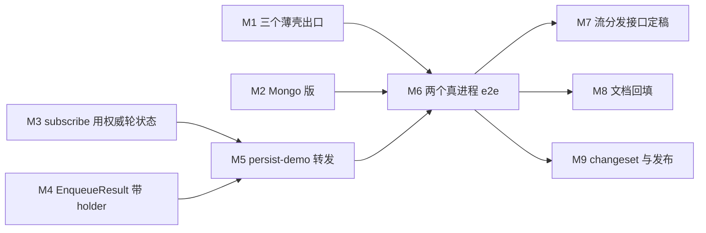

# 多副本部署（Node 长驻）— 施工计划

> 相关：[技术方案](../tech/multi-replica.md) · [Node 长驻 · 功能](../features/deployment.md) ·
> [归属仲裁机制 · 施工](../../../logic/arbitration/plans/arbitration-impl.md)（本计划接着它的 L7–L10 往下做）。

## 0. 一句话

把「两个副本共享一个 Postgres」从**设计上成立**推到**跑得起来、验得了、出问题查得到**。

**状态：进行中。** 底座（租约版[归属仲裁机制](../../../terms.md)）已于 2026-09-01 交付，本计划做的是
它的四个出口、一处订阅侧的修正、一套接入层示范，和一次真进程端到端。

**九单里八单已交付**（2026-09-09，逐条见 §7）。**只剩 M2（Mongo 版租约仲裁）**——本机没有
可用的 MongoDB，那一单一条都验不了，盲写一份要过三组一致性用例的实现不划算。

M6 的形态与原计划不同、而且更早可用：**用一个 SQLite 文件对两个真进程**，那就是部署形态里的
「① 同机 cluster」，走的代码路径与 Postgres 完全相同（同一个 `leaseArbitration`，只是方言不同），
**不需要任何外部服务**。真 Postgres 那一档留给 CI。

## 1. 起点：这些已经有了，别重做

[归属仲裁机制 · 施工计划](../../../logic/arbitration/plans/arbitration-impl.md) 的 L0–L6 与 L9 场景 3
已经交付：租约表四档 DDL、`leaseArbitration()`（抢占 / 心跳 / 自我围栏 / 取号 CAS / `listStale`）、
18 条仲裁一致性用例、SQLite / pglite / 真 Postgres / 真 MySQL 四档全绿。

> ⚠️ 那份计划的 **§1「现状盘点」是立项当时的快照**，里面写着「租约版实现 ❌ 不存在」。
> **以它的 §3 阶段表和 §8 变更记录为准**，别照着 §1 重做一遍（M8 会给那一节加一行说明）。

本计划从它的 L7 接着往下：

| 原编号 | 内容 | 本计划 |
|---|---|---|
| L7 | 三个薄壳导出 `*Arbitration()` | **M1** |
| L8 | Mongo 版 | **M2** |
| L9 完整版 | 两个真进程的端到端 | **M6** |
| L10 | 接入层转发 | **M5** |
| （新发现） | `subscribe` 的轮状态帧只看本地 | **M3** |
| （新发现） | `enqueue` 被拒时没有结构化 `holder` | **M4** |
| （新发现） | 流分发接口未定稿 | **M7** |

## 2. 拆单总表

**依赖只有两处收口**：M5 要等 M3 + M4，M6 要等 M5 加 M1 / M2 里的至少一个。其余全可并行。



| 单 | 目标 | 动谁 | 大小 | 状态 |
|---|---|---|---|---|
| **M1** | 三个薄壳各导出一个 `*Arbitration()` | `persist-sqlite` / `-postgres` / `-mysql` | S | ✅ |
| **M2** | Mongo 版租约仲裁，过同一套一致性用例 | `persist-mongo` | **L** | ⬜ |
| **M3** | `subscribe` 的轮状态快照改用权威答案 | `@runko/agent` | S | ✅ |
| **M4** | `EnqueueResult` 的拒绝分支带结构化 `holder` | `@runko/agent` | XS | ✅ |
| **M5** | persist-demo 的多副本形态与转发中间件 | `apps/persist-demo` | **L** | ✅ |
| **M6** | 两个真进程的端到端四场景（SQLite 文件档） | `apps/persist-demo` | **L** | ✅ |
| **M7** | 流分发接口定稿（当前两方法），游标制归 Vercel 那条线 | `docs` | XS | ✅ |
| **M8** | 文档回填与漂移清理 | `docs` · 三处代码注释 | S | ✅ |
| **M9** | changeset 与版本 | `.changeset/` | XS | ✅ |

---

## 3. 各单详细

### M1 · 三个薄壳各开一个仲裁出口

**为什么**：`leaseArbitration()` 只从 `@runko/persist-kysely` 导出，而三个薄壳的存在理由正是
「替你把 Kysely 和 `flavor` 装配好」。现在装了薄壳还得再装 kysely 包、再自己拼一个实例。

**做什么**：每个包加一个与 `*Persistence()` 对称的函数，吃**同一个驱动实例**。

```ts
// packages/persist-sqlite/src/index.ts
export type { LeaseArbitrationOptions } from "@runko/persist-kysely";
export type SqliteArbitrationOptions = Omit<LeaseArbitrationOptions, "flavor">;

export function sqliteArbitration(database: SqliteDatabase, opts: SqliteArbitrationOptions): Arbitration {
  return leaseArbitration(toKysely(database), { ...opts, flavor: "sqlite" });
}
```

`postgresArbitration(pool, opts)` / `mysqlArbitration(pool, opts)` 同形，三处只是填掉 `flavor`。

**注释里要写清的两条**：

1. `*Persistence(db)` 与 `*Arbitration(db)` 会各建一个 Kysely 实例。Kysely 是查询构建器、
   连接池是你给的那个驱动，两个实例共用同一个池，**不多占资源**。
2. `migrate()` 仍然只调一次，`agent_leases` 已经在里面。

**怎么验**：三个包各自把[仲裁一致性套件](../../../../packages/conformance/README.md)的三组用例
接上（SQLite 直接跑；Postgres / MySQL 沿用 `RUNKO_TEST_POSTGRES_URL` / `RUNKO_TEST_MYSQL_URL` 门禁）。
`persist-kysely` 已经跑过同一套，这里验的是**装配**没接错。

**验收**：三个包的 README 各多一段「多副本怎么配」，示例可直接复制运行。

---

### M2 · Mongo 版租约仲裁

**为什么**：`persist-mongo` 不是薄壳（Kysely 是 SQL 查询构建器，用不上），它得直接实现
`Arbitration`。不做的话，用 Mongo 的宿主只能停在单进程。

**做什么**：新文件 `packages/persist-mongo/src/arbitration.ts`，导出
`mongoArbitration(db, { holder, heartbeatMs?, takeoverMs?, now? })`。

集合 `agent_leases`，`_id` 就是会话 id，字段与 SQL 表一一对应
（形状见[技术方案 §4.2](../tech/multi-replica.md)）。`migrate()` 补一个索引：
`{ lease_token: 1, heartbeat_at: 1 }`，服务 `listStale`。

四个操作的写法（**比 SQL 版少一次往返**，因为 `findOneAndUpdate` 直接返回更新后的文档，
不必为了绕开 MySQL 的 `affectedRows` 再读回来）：

| 操作 | 写法 |
|---|---|
| `acquire` | 读一次判 `busy`（保住 `seedSeq` 的惰性）→ 行不存在则 `insertOne` 播种、撞 `E11000` 忽略 → `findOneAndUpdate` 决胜负（filter 带 `$or: [{lease_token: null}, {heartbeat_at: {$lt: at - takeoverMs}}]`，`returnDocument: "after"`） |
| `nextSeq` | `findOneAndUpdate({ _id, lease_token: token }, { $inc: { seq_watermark: 1 }, $set: { heartbeat_at } }, { returnDocument: "after" })`；返回 `null` = 已出局 |
| `release` | `updateOne({ _id, lease_token: token }, { $set: { holder: null, lease_token: null } })`——**只在还持有时才放手**，不删文档 |
| `clearStale` | `updateOne({ _id, heartbeat_at: { $lt: now - takeoverMs } }, …)`——**必须带陈旧判据**，否则会擦掉活着的持有者 |

**心跳与自我围栏：复制 `persist-kysely` 的那一段，不抽包。** 理由见
[技术方案 §4.3](../tech/multi-replica.md)。**两处都要写「这是刻意的重复，改一处必须同步另一处」**。

**怎么验**：接同一套仲裁一致性用例的**三组**（通用 / 多节点 / 超时接管），门禁沿用
`RUNKO_TEST_MONGO_URL`。`expire` 钩子照 `persist-kysely` 的做法——**冻结持有者那一侧的时钟**，
不要只把 `heartbeat_at` 拨到过去（持有者的下一拍心跳会把它刷回来，接管随机失败）。

**验收**：`arbitrationCases` / `arbitrationMultiNodeCases` / `arbitrationTakeoverCases` 三组全绿，
其中「被误判的老持有者取号一律被拒」这条在**真 Mongo** 上过。

---

### M3 · `subscribe` 的轮状态快照改用权威答案

**为什么**：这是四个缺口里唯一一处**真错**。多副本下，副本 A 上的订阅者去看一份跑在副本 B 上的
对话，拿到的[轮状态快照](../../../terms.md)是 `{ active: false }`——服务端权威答案说「没有轮在跑」，
而实际上有。接入层因此既不知道该转发，也没法告诉用户这一轮在别处。

**做什么**：`packages/agent/src/runtime.ts` 的 `subscribe` 第 ④ 步，把
`registry.get()` 的本地判断换成与 `getActivity()` 同一套（本地登记表命中就用它，否则回退
`arbitration.inspect()`），并在**归属不在本进程**时按 `follow: "turn"` 收线。
代码形状见[技术方案 §5.2](../tech/multi-replica.md)。

**三条不能破**：

1. **不新增空隙。** 那个「取草稿 + 清缓冲」的同步临界区在第 ③ 步，`inspect()` 落在第 ④ 步——
   那里本来就有一次 `await persistence.queue.list(…)`。别把 `inspect()` 挪进临界区。
2. **单进程零影响。** 本地登记表命中时 `inspect()` 一次都不会被调到，现有用例一条都不用改。
3. **`Frame` 类型不变。**

**怎么验**：`@runko/agent` 加两条用例——

- 归属在本进程：`activity` 帧的 `active` / `holder` 与今天一致，`inspect()` 未被调用（用假件计数）；
- 归属在别的 holder（用内存仲裁伪造一条别人持有的归属）：`activity` 帧报 `active: true` +
  对方的 `holder`，且 `follow: "turn"` 立刻收线。

---

### M4 · 起轮被拒时带上结构化 `holder`

**为什么**：`reason: "held_by_other"` 时，`holder` 现在只活在 `message` 那句英文文案里
（`This conversation is owned by …`）。接入层要转发，只能去字符串里抠。

**做什么**：`packages/agent/src/types.ts`

```ts
| { mode: "rejected"; reason: EnqueueRejection; message: string; holder?: string }
```

只在 `held_by_other` 时有值；`packages/agent/src/runtime/queue.ts` 里那处已经拿着 `outcome.holder`，
顺手带出来即可。向后兼容——接入层不改也能编译。

**怎么验**：一条用例断言 `held_by_other` 的结果带 `holder`，其余四种拒绝原因不带。

---

### M5 · persist-demo 的多副本形态与转发

**为什么**：转发是**接入层的活儿**，框架只给不透明的 `holder`。没有一份能跑的示范，
「多副本可用」就只是一句话。放在 `@runko-demo/persist-demo` 而不是 chat 应用，是因为它本来
就支持 Postgres / MySQL / Mongo，而 chat 应用是单进程 + SQLite、`held_by_other` 那条路走不到。

**做什么**：

**① 自报身份。** 两个环境变量：

| 变量 | 缺省 | 作用 |
|---|---|---|
| `RUNKO_NODE_URL` | `http://127.0.0.1:${PORT}` | 本副本的**可达地址**，原样进 `holder` |
| `RUNKO_PEER_TOKEN` | 空（= 不校验） | 副本之间的内部令牌 |

`app.ts` 装配时：`DEMO_DB` 不是 `memory` 就用 `*Arbitration(driver, { holder: RUNKO_NODE_URL })`，
否则保持内存版。

**② 转发中间件。** 判据只有一条——**这件事的状态在数据库里，还是在持有者的进程内存里**：

| 端点 | 要转吗 | 触发条件 |
|---|---|---|
| `POST …/messages` | ✅ | `rejected` 且 `reason === "held_by_other"` |
| `POST …/abort` | ✅ | `getActivity()` 说 `active && !local` |
| `POST …/approvals/:callId` | ✅ | 同上 |
| `POST …/questions/:callId` | ✅ | 同上 |
| `GET …/stream` | ✅ | 同上，**流式**转发 |
| `GET …/messages` · 队列四个端点 | ❌ | 状态在数据库，任何副本都能答 |

> **审批与提问最容易漏**：人在回路桥把待裁决项挂在那一轮的 `ActiveTurn` 对象上，不是数据库里。
> 裁决打到别的副本会拿到「没有这条待定裁决」，而用户看到的是提交成功。

**③ 三道防护**（缺一条都会在真机上咬人）：

- **环路**：转发出去带 `x-runko-forwarded: 1`；**带着这个头进来的请求一律不再转发**，
  归属这一瞬间又换了人也不行，宁可回 409 让客户端重试；
- **鉴权**：副本之间是内部调用，用 `RUNKO_PEER_TOKEN` 校验，不透传用户凭据；
- **背压**：`GET …/stream` 必须流式代理，中间任何一层把响应体读完再吐，直播就变成
  「一轮跑完才出现」。

**怎么验**：单机起两个进程（`PORT=3910` / `3911`，同一个 `DATABASE_URL`），手动跑一遍
[技术方案 §7.1 / §7.3](../tech/multi-replica.md) 的两条路。自动化归 M6。

**验收**：`apps/persist-demo/README.md` 多一节「跑两个副本」，命令可直接复制。

---

### M6 · 两个真进程、一个真 Postgres 的端到端

**为什么**：这是整个功能**唯一真正的证明**。单进程测试跑绿不代表租约版没问题——
两个 `Arbitration` 实例共享一个真库已经能验「令牌 CAS 落在数据库里」这条核心路径
（L9 场景 3 已经做了），但**进程崩溃、连接池各自独立、时钟不同步**这些只有跨进程才有。

**做什么**：`apps/persist-demo/test/multi-replica.e2e.test.ts`，用 `child_process.spawn` 起两个
真进程，门禁沿用 `RUNKO_TEST_POSTGRES_URL`（没配就整档 skip，与现有真库用例同一套）。

测试里把两个时间参数调小以免每条跑一分钟：**心跳 200ms / 接管 900ms**——注意
`leaseArbitration()` 有「接管阈值必须 ≥ 3× 心跳」的构造期校验，900 / 200 = 4.5×，安全。

| 场景 | 怎么做 | 断言 |
|---|---|---|
| **① 抢占与转发** | 两个进程同时对同一个会话 POST | 只有一个真起轮；另一个经转发也拿到 202，**账本里这条用户消息只有一份** |
| **② 崩溃接管** | `kill -9` 持有者 | 接管阈值过后另一个进程能起轮；旧会话的[孤儿轮](../../../terms.md)被 `recover()` 补上「已停止」 |
| **③ 被误判的老持有者** | `SIGSTOP` 冻住持有者 → 等接管 → `SIGCONT` 唤醒 | 老持有者此后的写入**一律被拒**；账本没有重号、没有覆盖、没有空洞之外的异常 |

**场景 ③ 是这一整单的核心**，其余两条是它的推论。断言要落在**账本内容**上，不是落在日志或
返回码上——「没写坏」只有账本能证明。

**怎么验**：本地 `docker run` 一个 Postgres 跑一遍；CI 已经有三个真库的 service container
和 `RUNKO_TEST_*_URL`，直接接上。

**验收**：三个场景在 CI 上稳定跑绿（连跑 3 次不 flaky）。

---

### M7 · 流分发接口定稿

**为什么**：[流分发的契约](../../contract/tech/stream-fanout.md)状态是「接口未定稿」，那是本档目前
唯一还挂着的框架级未决项。M6 跑绿之后，这一档用不用得上外挂广播就有真实答案了。

**做什么**：改 `docs/host/contract/tech/stream-fanout.md` 与 `features/stream-fanout.md`：

- 把状态从「接口未定稿」改成**「接口定稿：`publish` + `subscribe` 两个方法」**；
- §7 那四条 TODO 逐条结案：方法签名 ✅ 定为现状；**保留窗口 / 游标 / 第二条腿**三条标为
  「只有外挂广播那条腿才需要，归 [Vercel 那一档](../../vercel/tech/deployment.md)」；
- 「与现有 chat 应用那套 SSE 怎么并轨」结案为：chat 应用是单进程，用内置实现，不并轨。

**这一单不写代码**——接口本来就是现在这个形状，定稿是把「未定」这个状态摘掉。

---

### M8 · 文档回填与漂移清理

清单见[技术方案 附录 B](../tech/multi-replica.md)。逐条：

| # | 位置 | 改什么 |
|---|---|---|
| 1 | `host/node/tech/deployment.md` front matter | `packages` 里那三个不存在的包名换成真实的五个 |
| 2 | 同上 §4 正文 | 同上 |
| 3 | 同上 §3.1 时序图 | 「影响 1 行 / 0 行」改成「读回来比对令牌」——实现刻意不看影响行数 |
| 4 | 同上 §2 表格 | ③ 那一行链到本计划 |
| 5 | `logic/arbitration/plans/arbitration-impl.md` §1 | 加一行：这是立项时的快照，当前事实见 §3 与 §8 |
| 6 | 同上阶段表 | L7 / L8 / L9 完整版 / L10 各链到本计划对应的单 |
| 7 | `packages/persist-kysely/src/index.ts` 文件头 | 删掉「这一版只出持久化，不含租约版归属仲裁」 |
| 8 | `packages/persist-mongo/src/index.ts` 文件头 | 同上（M2 交付后） |
| 9 | `packages/agent/README.md`「还没做的」 | 租约版已交付；剩的是薄壳出口与 Mongo 版 |
| 10 | 三个薄壳 + mongo 的 README | 各加一节「多副本怎么配」 |

第 7、8、9 是**纯注释与 README**，按仓库规矩不需要 changeset。

**怎么验**：`pnpm docs:check` + `pnpm docs:build`（后者做全站死链检查），两步都跑完即退。

---

### M9 · changeset 与版本

| 包 | 改动 | 建议级别 |
|---|---|---|
| `@runko/persist-sqlite` · `-postgres` · `-mysql` | 新增 `*Arbitration()` 导出（M1） | minor |
| `@runko/persist-mongo` | 新增 `mongoArbitration()` 导出（M2） | minor |
| `@runko/agent` | `EnqueueResult` 加可选 `holder`（M4） | minor |
| `@runko/agent` | `subscribe` 的轮状态帧改用权威答案（M3） | **patch？待确认** |

**M3 那条要问一次再落**：它是 bug 修复（单进程行为一字不变），但多副本下同一个订阅拿到的
`activity` 帧内容变了。按语义化版本是 patch，可它改变了可观察行为——**破坏性判断宁可问**。

M5 / M6 落在 `apps/persist-demo`，是 `private: true` 的不发布成员，**不写 changeset**。

---

## 4. 验收标准

逐条对上[Node 长驻 · 功能](../features/deployment.md)与
[归属仲裁机制 · 功能 §5](../../../logic/arbitration/features/arbitration-impl.md)：

| # | 标准 | 怎么验 |
|---|---|---|
| 1 | 单进程下不装任何东西，行为与今天完全一致 | 现有全量用例照跑，一条不改 |
| 2 | 四个持久化包都能拿到租约版仲裁 | M1 + M2，各自过三组一致性用例 |
| 3 | 两个进程同时起轮只有一个成功，另一个能转发过去 | M6 场景 ① |
| 4 | 杀掉持有者能被接管，孤儿轮被补上收尾 | M6 场景 ② |
| 5 | **被误判的老持有者写入一律被拒，账本没被写坏** | M6 场景 ③ —— **这条是核心** |
| 6 | 副本 A 上的订阅者能看到跑在副本 B 上那一轮的内容 | M3 + M5，M6 里顺带断言 |
| 7 | 审批 / 提问 / 停止打到任一副本都能生效 | M5 的转发矩阵，M6 里各跑一次 |
| 8 | 业务代码在单副本与多副本下**完全一样** | 装配处（`app.ts`）之外零改动 |

## 5. 三处容易做错

**① 把 `holder` 当[租期标识](../../../terms.md)用。** 「A 失联 → B 接管 → B 挂 → A 重新抢占」时，
A 滞留在网络里的旧写入会被放行。**粒度必须是一次租期**，不是一个进程。

**② 心跳失败当成失去归属。** 一次网络抖动打不中，可能只是这一次超时；要连续失败到逼近阈值
才收手。但**取号的 CAS 打不中就是真的失去了**（令牌已被换掉）——两者处置不同，别混用同一个判定。

**③ 转发写成同步代理。** `GET …/stream` 一旦被中间层缓冲，直播就退化成「一轮跑完才出现」，
而这个 bug 在单副本本地测试里**永远复现不了**。

## 6. 非目标

- **`@runko/stream-redis`**（外挂广播）：这一档转发够用，理由见[技术方案 §6](../tech/multi-replica.md)。它归 Vercel 那条线。
- **`@runko/durable-object`**：另一档宿主，另一条线。
- **改造 chat 应用跑多副本**：它是单进程 + SQLite，`held_by_other` 走不到。示范放在 persist-demo。
- **[挂起](../../../terms.md)与恢复**：等人时仍占着归属与沙盒。多副本只让「等着的是哪个副本」变确定，不改这件事本身。
- **依赖基础设施的 sticky routing**：亲和的单位是「一次排空」，不是一轮、也不是会话永久绑定。

## 7. 变更记录

| 日期 | 变更 |
|---|---|
| 2026-09-09 | 立项。从[归属仲裁机制 · 施工](../../../logic/arbitration/plans/arbitration-impl.md) 的 L7–L10 接手，另加三处新发现（`subscribe` 的本地轮状态、`EnqueueResult` 缺 `holder`、流分发接口未定稿） |
| 2026-09-09 | **M4 交付**：`EnqueueResult` 的拒绝分支加可选 `holder`，只在 `held_by_other` 时有值 |
| 2026-09-09 | **M3 交付**：`subscribe` 的轮状态快照改用权威答案。实现上比原设计更保守——**控制流一行没变**，判「要不要收线」仍用第 ③ 步捕获的那个 `turn`，只有帧的内容换成了权威答案。原设计想在第 ④ 步重查登记表，那会在「这一轮刚好在 ③④ 之间收尾」的窄路上丢掉已经躺在缓冲里的收尾 `message` 帧 |
| 2026-09-09 | M3 / M4 的 changeset 合成一份、级别取 **minor**。原来悬着的「M3 算 patch 还是 minor」不必单独定：两条改动同包同批发布，minor 已经覆盖 patch |
| 2026-09-09 | **M1 交付**：三个薄壳各导出 `*Arbitration()`。同批修掉一处**出不去的 API**——`leaseArbitration` 的 `flavor` 原本只收 `FlavorTraits`，而构造它的 `traitsOf` 并没有导出，外部调用方其实拼不出这个参数。现在它跟 `kyselyPersistence` 一样收方言名，原写法照旧可用 |
| 2026-09-09 | **M5 交付**：persist-demo 的多副本形态。`RUNKO_NODE_URL` 一个变量开关，转发覆盖起轮 / 停止 / 审批 / 提问 / SSE 五个端点，带环路防护、内部令牌与流式代理 |
| 2026-09-09 | **M6 交付，形态与原计划不同**：用**一个 SQLite 文件对两个真进程**，而不是等真 Postgres。同一条代码路径、零外部依赖，四个场景（抢占转发 / SSE 转发 / `kill -9` 接管 / 被误判的老持有者写入被拒）连跑三次不 flaky。真 Postgres 档留给 CI。顺带给 demo 的 SQLite 驱动加了 WAL 与 `busy_timeout`——多进程共用一个文件时这两条是必需的 |
| 2026-09-09 | **M7 交付**：流分发接口定稿为现有两个方法，四条待定项全部结案；游标与保留窗口归 Vercel 那条线 |
| 2026-09-09 | **审查修复（8 条）**：① `persist-demo` 在拿不出租约版实现的档次上开多副本时直接抛，不再静默回落成内存版仲裁（那会让两个副本同时推进同一会话）；② 转发的 `fetch` 兜住 `ECONNREFUSED` 回 421 带 `holder`，并把客户端的 `signal` 传下去；③ **队列的写端点也要转发**——库改完之后框架会广播一帧新快照，而订阅者都在持有者那一侧；④ `subscribe` 排除「本进程自己那一轮正在收尾」的归属（这是本批引入的回归，见 M3）；⑤ 空环境变量不再被 `Number("")` 当成 0；⑥ 421 回落带上 `holder`；⑦⑧ 注释与 `createAgentRuntime` 签名 |
| 2026-09-09 | **M8 交付**：Node 部署文档的三处漂移、仲裁施工计划 §1 的历史快照说明、`persist-kysely` 与 `@runko/agent` 的过期注释、三个薄壳 README 的「多副本怎么配」 |
