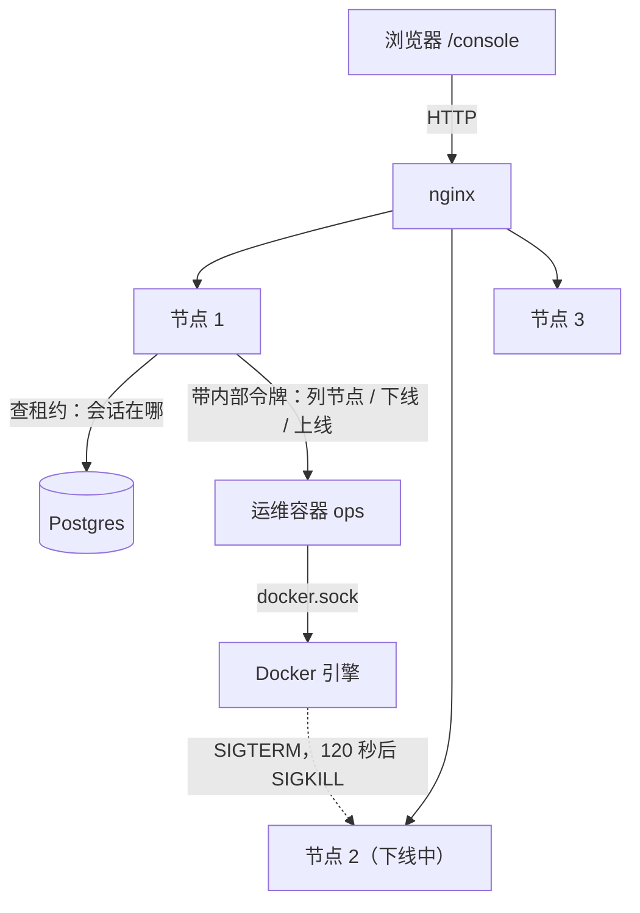
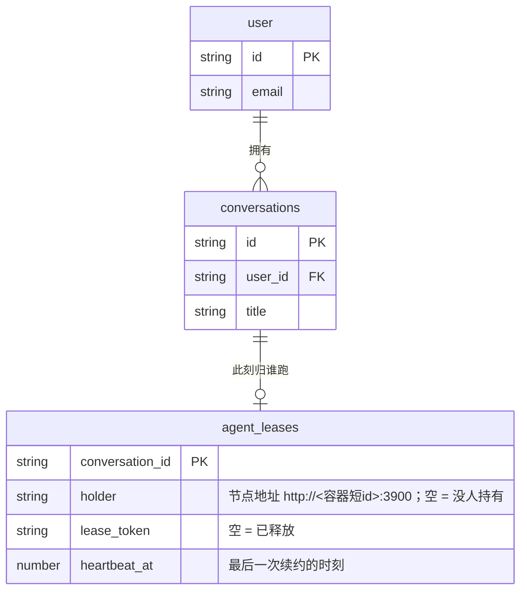
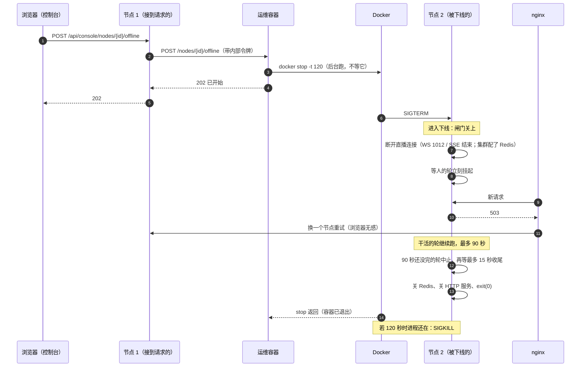

# 集群控制台 — 技术方案

> 术语见 [术语表](../../../terms.md)。要做什么见[功能手册](../features/cluster-console.md)；拆单见[施工](../plans/cluster-console.md)。
> 建在[集群实验环境 · 技术](./cluster-lab.md)与[优雅关闭 · 技术](../../../logic/orchestration/tech/graceful-shutdown.md)之上。
>
> **⚠️ 本文的「等待窗口」与「闸门放行转发来的请求」是过渡方案**（2026-09-25）：以[交权与任务迁移 · 技术方案](../../../logic/orchestration/tech/handover.md)为准——节点下线时几百毫秒内把对话交给别的节点，模型输出重来、工具留在旧节点跑完。逐项处置（保留哪些、去掉哪些）见那份文档 §3.3。运维容器、控制台、`docker stop -t 120` 不受影响。

## 1. 长什么样



**三个角色，各管一段**：

| 角色 | 管什么 | 不管什么 |
|---|---|---|
| 控制台 API（每个节点都有，`/api/console/*`） | 把「租约表」和「运维容器给的节点列表」拼成一张页面数据；把下线/上线请求转给运维容器 | 不碰 Docker |
| [运维容器](../../../terms.md)（新服务 `ops`） | 列出节点容器；`docker stop -t 120`；`docker start` | 不碰数据库、不认识会话 |
| 被下线的节点 | 收到 SIGTERM 后：挡新流量、断直播连接、让轮跑完、自己退出 | 不需要知道是谁、为什么让它下线 |

**关键设计：「通知节点要下线」就是 Docker 发的 SIGTERM。** 节点不用轮询库里的标记，也不用开一个新的内部接口；现有的 SIGTERM 处理（[优雅关闭](../../../terms.md)）改成「先挡流量、再让轮跑完」就行。强杀也不用节点自己做——`docker stop -t 120` 本来就是「先发 SIGTERM，120 秒后 SIGKILL」。这一点在拍板时就定了：由外部的运维容器强杀，而不是节点自己起一个闹钟线程（见[附录 A](#附录-a否决的备选)）。

## 2. 数据：不新增表

「会话在哪个节点上跑」就是[租约](../../../terms.md)表里那一行的 `holder`。控制台只读，不加表、不加列。



**「正在跑」的判据**与租约自己的判据一致：`lease_token` 不为空，且 `now - heartbeat_at ≤ 接管阈值`（`RUNKO_TAKEOVER_MS`）。心跳超时的行虽然 `lease_token` 还在，但已经可以被别人接管，控制台把它标成「疑似失联」而不是挂在某个节点下面。

**这是 chat 应用第二处直接读框架表**（第一处是 `runko-tables.ts` 数待答卡片）。理由相同：按会话一条条问接口会有 N 次往返，而这里只读 `holder`/`heartbeat_at` 两个原样存放的列，不涉及接口层的任何语义翻译。查询也放进 `runko-tables.ts`，守住「只有这一个文件直接读框架表」。

### 2.1 节点地址 ↔ 容器怎么对上

集群里每个副本启动时报 `RUNKO_NODE_URL=http://$(hostname):3900`，而 Docker 给容器的缺省主机名是**容器 id 的前 12 位**。运维容器列容器时拿到完整 id，截前 12 位就能和 `holder` 里的主机名对上。节点序号（控制台上的「节点 1/2/3」）取 compose 打的标签 `com.docker.compose.container-number`。

`docker start` 重新拉起一个停掉的容器时，**id 不变 → 主机名不变 → `holder` 不变**。租约那边本来就会把「挂在自己名下、心跳早于本进程启动」的行认成上辈子的残留、启动时收回（见 `leaseArbitration` 的 `isMyOrphan`），所以重新上线不需要任何额外处理。

## 3. 下线的全过程



### 3.1 时间预算

| 常量 | 值 | 在哪配 | 含义 |
|---|---|---|---|
| 强杀期限 | 120 秒 | 运维容器 `RUNKO_OPS_STOP_TIMEOUT_S` | `docker stop -t` 的参数 |
| 让轮跑完 | 90 秒 | 节点 `SHUTDOWN_FINISH_WINDOW_MS=90000` | 在这之内跑完的轮算正常结束 |
| 收尾宽限 | 15 秒 | 节点 `SHUTDOWN_TIMEOUT_MS=15000`（已有） | 中止之后等轮把账本收干净 |

90 + 15 = 105 秒，比 120 秒留 15 秒给关连接、进程退出。

**`SHUTDOWN_FINISH_WINDOW_MS` 缺省是 0**，也就是现在的行为（收到 SIGTERM 立刻中止）。只有集群 compose 里配 90 秒。原因：本地 `node --watch` 热重载也发 SIGTERM，改一行代码等 90 秒是不能接受的。

## 4. 节点这边：收到 SIGTERM 之后

改动全在 `index.ts` 的 `shutdown()` 与一个新的「下线闸门」模块里，顺序是硬的：

1. **先关闸门**（`offline.ts`，新）。之后的请求按第 4.1 节分流。
2. **断开全部直播连接**（第 4.2 节）——**只在配了 Redis 广播时**。没配时（单进程、靠转发的多副本）只有本节点能播这一轮，先断的话浏览器重连被闸门挡回，被中止那一轮的收尾帧就送不出去；所以挪到第 3 步之后再断。
3. **`chatRuntime.shutdown({ finishWindowMs, graceMs })`**：让轮跑完，到点中止（第 5 节）。
4. 断开剩下的直播连接（此时已经没有轮在跑），关 Redis 连接、`server.close()`、`process.exit(0)`（已有）。

所以 `offline.ts` 给的是两个方法：`goOffline()` 只关闸门，`disconnectStreams()` 只断直播。

### 4.1 闸门：谁挡、谁放

| 请求 | 下线中怎么处理 | 为什么 |
|---|---|---|
| 浏览器经 nginx 来的任何请求（含 WebSocket 升级） | **503 + `Retry-After: 1`** | nginx 见 503 换节点重试（第 6 节），浏览器无感 |
| 别的节点**转发**过来的请求（带转发标记且令牌对） | **照常处理** | 那一轮还在本节点上跑，停止、答审批这类请求**只有本节点能做**，挡了就没人能做 |
| `GET /health` | 503 | 让 `docker ps` 里一眼看出它不健康了 |

转发进来的「发消息」请求会被框架自己拒掉（入队在关闭期间一律回 `shutting_down`，已有行为），发起方节点把 503 原样带回去——这就是功能手册里「下线期间给这个会话发新消息会被拒」的来由。

闸门做成顶层 `app.use('*')`，挂在所有路由**之前**。WebSocket 的升级请求也是先走一遍 Hono 的中间件链（`@hono/node-ws` 的 `upgradeWebSocket` 本身就是一个路由处理器），所以同一个闸门就能挡住，不用在 HTTP 服务器那层另写。

### 4.2 断开直播连接

直播连接是长连接，**闸门挡不住已经连上的**。不断开的话，浏览器会一直连在这个节点上，直到进程退出那一刻被硬断。

做法：一个进程级的 `AbortController`（「本节点要下线了」），WebSocket 与 SSE 两个处理器各自把它和自己的「连接断了」信号合并（`AbortSignal.any`）传给 `runtime.subscribe`：

- **WebSocket**：信号触发时 `ws.close(1012, 'node going offline')`。1012 是标准里的「服务重启」。前端对非 1000 的关闭一律按退避重连（`use-chat-messages.ts` 已有），重连请求经 nginx 落到别的节点。
- **SSE**：信号触发时 `subscribe` 结束，流关闭。前端见「轮还在跑流却断了」同样按退避重连（已有）。
- **别的节点转发来的 SSE 不断**。有转发说明没配 Redis、直播只有本节点能播；断了的话那边重连还是转回这里，又被立刻断掉，整个等待窗口里都看不到实时帧。

重连之后能不能接着看直播：能。集群配了 Redis，直播帧是广播给每个节点的（[集群实验环境 · 技术 §2](./cluster-lab.md)），这一轮虽然还在被下线的节点上跑，别的节点照样收得到它的帧。

## 5. 框架：`shutdown` 学会「先等，再中止」

现有的 `runtime.shutdown()` 一上来就中止所有干活的轮。[交权](../../../terms.md)的定义本来是「正在干活就跑完当前这一轮再放手，超过宽限期才降级成中断」——这次把它补齐。

```ts
runtime.shutdown({
  finishWindowMs: 90_000, // 新增，缺省 0：先让干活的轮自然跑完，最多等这么久
  graceMs: 15_000, // 已有：中止之后等收尾的上限
});
```

流程（顺序是硬的，1、2、4、5 步与现在一样）：

1. **置关闭闸门**：之后入队、自动出队一律拒（已有）。
2. 快照活跃轮。
3. **新增 · 等待窗口**（`finishWindowMs > 0` 时）：
   - 等人的轮**立刻[挂起](../../../terms.md)**（与现在一样）；
   - 干活的轮不动它，等它自己收尾；
   - 窗口期间每 500 毫秒再看一遍：**中途转入等人的轮也挂起**（一轮跑着跑着碰上审批，不能让它占着节点等到窗口结束）；
   - 全部收尾就提前结束窗口。
4. 窗口到点还没收尾的：按现在的规则再分一次——等人的挂起，其余用 `ABORT_REASON_SHUTDOWN` 中止。
5. 再等最多 `graceMs`。撞上限的成了[孤儿轮](../../../terms.md)，交给下次启动的崩溃恢复（已有）。

`ShutdownResult` 加一个 `finished`：窗口内正常完成（`completed`）的轮数。窗口期间被用户停止、跑失败的轮不算。启动日志里能直接看出「这次下线有几轮是正常结束的」。

**改动是纯新增的**（多一个可选参数、结果多一个字段，不传就是老行为），`@runko/agent` 记 minor。

## 6. nginx：见 503 换节点

```nginx
proxy_next_upstream error timeout http_503 non_idempotent;
proxy_next_upstream_tries 3;
```

- `http_503`：被下线节点回的 503 → 换下一个节点。
- `non_idempotent`：POST 也重试。nginx 缺省不重试 POST，怕重复执行。这里安全的前提是一条约定：**本应用回 503 时，那个请求一定什么都没做**。
  - 闸门的 503：在处理任何业务之前就回了。
  - 转发时连不上持有者的 503：请求根本没送到。
  - 转发时**等持有者开口超时**：请求可能已经被收下了，结果未知。这种回 **504**（`forward.ts` 的 `RESULT_UNKNOWN_STATUS`），不在重试名单里。回 503 的话，一条消息会被发两到三遍。
  - 持有者的容器被整个杀掉（`docker kill`）时也是 504：它的 IP 从网络里消失，连接不被拒、也没人应，跟「冻住」分不出来。这时重试本来也没用——接管之前，换哪个节点都要转给这个死掉的持有者。
  - nginx 缺省会把请求体缓冲下来（`proxy_request_buffering on`），所以重试时有完整的请求体可发。
- `error`：节点彻底退出后、Docker 内部域名还没刷新的那几秒（`resolver valid=5s`），连接会被拒，也换下一个。

**多个地址的变量写法也会重试**：`proxy_pass $upstream` 走 resolver，域名解析出多个地址时 nginx 把它们当成一组轮流用，`proxy_next_upstream` 对这一组生效。这条在施工时实测确认（见施工 O6）。

**代价**：
- 应用自己的 503（「持有者连不上」，见 `forward.ts` 的 `RETRY_LATER_STATUS`）也会被 nginx 重试。请求没送到过，重试无害，只是多问几次。
- 节点在「收下 POST、还没回响应」时被强杀（SIGKILL、崩溃），nginx 会把这条 POST 当 `error` 重发给别的节点。正常下线会走完等待窗口再自己退出，碰不上；只有被强杀才会。

## 7. 运维容器

**与 node-server 同一个镜像、换一个入口**（`src/ops/index.ts` → `dist/ops/index.js`）：不另建镜像，依赖（Hono、zod）现成。

### 7.1 接口

| 方法 | 路径 | 做什么 |
|---|---|---|
| `GET` | `/nodes` | 列出本 compose 项目里 `node` 服务的全部容器（含已退出的） |
| `POST` | `/nodes/{id}/offline` | 后台跑 `docker stop -t 120`，立刻回 202。**幂等**：已在下线中就原样返回原来的强杀时刻，不重新计时 |
| `POST` | `/nodes/{id}/online` | `docker start`，回 202 |

每个请求都要带 `Authorization: Bearer <RUNKO_OPS_TOKEN>`，不对就 401。`{id}` 必须是**列表里出现过**的容器——防止拿它去停 Postgres。

### 7.2 怎么跟 Docker 说话

直接用 Node 自带的 `http` 模块，`socketPath: '/var/run/docker.sock'`，调 Docker Engine 的 HTTP 接口：

| 用途 | Docker 接口 |
|---|---|
| 列容器 | `GET /containers/json?all=1&filters={"label":["com.docker.compose.project=<项目>","com.docker.compose.service=node"]}` |
| 下线 | `POST /containers/{id}/stop?t=120`（阻塞到容器停下，最多 120 秒多一点） |
| 上线 | `POST /containers/{id}/start` |

**项目名启动时自查，不写死**：运维容器用自己的主机名（= 容器 id 前 12 位）调 `GET /containers/{主机名}/json`，读出自己的 `com.docker.compose.project` 标签。原因：同一台机器上可能同时跑着两套集群（开发者手上那套 `runko-cluster`，和端到端测试另起的 `runko-cluster-*-e2e`），写死的话，测试那套里的运维容器会去停开发者那套的节点。compose 的 `-p` 不会进变量替换，所以只能运行时问。要强行指定就配 `RUNKO_OPS_PROJECT`。

不引入 `dockerode` 之类的库：三个接口，Node 自带的 `http` 就够；Docker 返回的 JSON 用 zod 校验形状（这是类型边界，见代码注释）。

### 7.3 「下线中」这个状态记在哪

Docker 自己没有「正在 stop」这个状态——stop 期间容器照样是 `running`。所以运维容器在内存里记一张表：`容器 id → 下线开始时刻`。节点状态这样推：

| Docker 状态 | 在下线表里 | 控制台显示 |
|---|---|---|
| `running` | 是 | 下线中（倒计时 = 开始时刻 + 120 秒 − 现在） |
| `running` | 否 | 在线 |
| `exited` / `dead` / `created` | — | 已下线（顺手从下线表里删掉） |
| 其他（`restarting`、`paused`） | — | 原样显示 Docker 的状态字 |

**运维容器自己重启了，这张表就丢了**：正在下线的节点会短暂显示成「在线」，直到它退出变成「已下线」。demo 环境可以接受，见第 10 节。

### 7.4 安全边界

挂了 `docker.sock` 的容器 = 这台机器的管理员。三道限制：

1. **不对宿主机开端口**：compose 里 `ops` 服务不写 `ports`，只有集群内网里的节点够得着它。
2. **内部令牌**：`RUNKO_OPS_TOKEN`，节点与运维容器共用，浏览器永远拿不到。
3. **只认 `node` 服务的容器**：见 7.1。

它**不防**「登录了 chat 的任何人都能让节点下线」——那是「不设管理员」的直接后果，用户明确接受（功能手册 §4）。

## 8. 控制台 API（节点这边）

新文件 `routes/console.ts`，挂在登录中间件后面，用 `@hono/zod-openapi` 定义（前端的类型化客户端由 OpenAPI 生成，与其余接口同一套流程）。

| 方法 | 路径 | 做什么 |
|---|---|---|
| `GET` | `/api/console/overview` | 节点列表 + 每个节点下正在跑的会话 |
| `POST` | `/api/console/nodes/{id}/offline` | 转给运维容器 |
| `POST` | `/api/console/nodes/{id}/online` | 转给运维容器 |

`overview` 的形状：

```ts
{
  /** 没配运维容器（单进程跑法）时为 false：前端把按钮置灰并说明原因。 */
  controllable: boolean;
  nodes: Array<{
    id: string;            // 容器 id；没有运维容器时就是 holder 地址
    index: number | null;  // compose 的副本序号
    url: string | null;    // 与 holder 同形状的地址，前端拿它把会话挂到节点下
    state: 'online' | 'going_offline' | 'offline' | 'unknown';
    dockerState: string | null;
    offlineDeadline: number | null; // 强杀时刻（毫秒时间戳），前端算倒计时
  }>;
  conversations: Array<{
    id: string; title: string; ownerEmail: string;
    holder: string;
    heartbeatAt: number;
    stale: boolean;        // 心跳已超过接管阈值
  }>;
  now: number;             // 服务端时刻，前端用它算「心跳几秒前」，不受本机时钟偏差影响
}
```

**没配运维容器时**（`RUNKO_OPS_URL` 为空，比如 `pnpm chat:server`）：节点列表从租约里出现过的 `holder` 推出来，外加本进程自己；`controllable: false`。

**下线/上线失败怎么回**：不可控（没配运维容器）回 409；运维容器说「没这个节点」回 404；运维容器连不上或出错一律 502。不用 503，因为 503 在本应用里已经专指「这个节点正在下线/持有者够不着，稍后重试」，nginx 还会拿它换节点重试。

**兜底节点列表里的状态一律填 `online`**：能出现在兜底列表里的地址，前提是它正握着一条租约，这是手上最强的「还活着」证据；填 `unknown` 反而让人以为出了问题。

**运维容器够不着时**：`overview` 照样返回会话部分，节点列表退化成上一条，并带一个 `opsError` 字段给前端显示。控制台不能因为运维容器挂了就整页白屏。

## 9. 前端

- 新路由 `/_app/console`，页面 `pages/console.tsx`；侧栏加入口。
- 数据：TanStack Query，`refetchInterval: 2000`。**这是前端第一次用它**，新增依赖 `@tanstack/react-query`，`main.tsx` 包一层 `QueryClientProvider`。
- 请求：手写 `fetch` + 用生成的 zod schema 校验，**不用** kubb 生成的请求函数。原因：那层请求函数不看 `response.ok`，409/404 会被当成功解析，而页面恰恰要靠这两个状态码决定按钮怎么显示（`features/chat/api.ts` 文件头记过同一个坑）。
- 按钮：下线要二次确认（写清三个时间），上线不用。点完立刻 `invalidateQueries` 刷一次。
- 倒计时：`offlineDeadline - now`，前端每秒本地走一下，每次拉到新数据再校准。

## 10. 已知限制

- **下线前就排在队列里的消息，这一轮跑完后不会自动接着跑**：被下线的节点关着闸门，不会再出队；别的节点也不知道要来接。要等用户再发一条消息（或刷新触发推进）才会在别的节点上出队。这是[优雅关闭](../../../logic/orchestration/tech/graceful-shutdown.md)已有的行为（「不清队列」），这次不改。
- **运维容器重启会丢「下线中」状态**（7.3）。
- **控制台能看到所有人的会话标题**：demo 项目不设管理员的代价。
- **nginx 会把应用自己的 503 也重试**；节点被强杀时，正在处理的 POST 可能被重发（第 6 节）。

## 附录 A：否决的备选

**节点自己强杀自己**（控制台在库里标「要下线」，节点轮询到之后开始收尾，同时开一个 `worker_threads` 线程当闹钟，主线程卡死也能到点 `SIGKILL` 自己）：不需要任何 Docker 权限，将来上 k8s 也能用。否决原因：用户选了由外部运维容器强杀——真正的外部强杀不依赖被杀进程的任何代码，而且运维容器还能做「重新上线」，节点自杀方案做不到。

**控制台放在运维容器自己出的页面里、只绑本机端口**：不走 nginx、不需要登录，普通用户从外面完全碰不到。否决原因：用户要控制台放在 chat 前端里，并且明确不要管理员概念。

**让 nginx 把被下线节点摘掉（改配置 + reload）**：摘得最干净，但要让运维容器去改 nginx 的配置文件、再给 nginx 发 reload 信号，多一处要协调的状态。「节点自己回 503 + nginx 换节点」只靠节点自己，nginx 配置写一次永远不用改。
