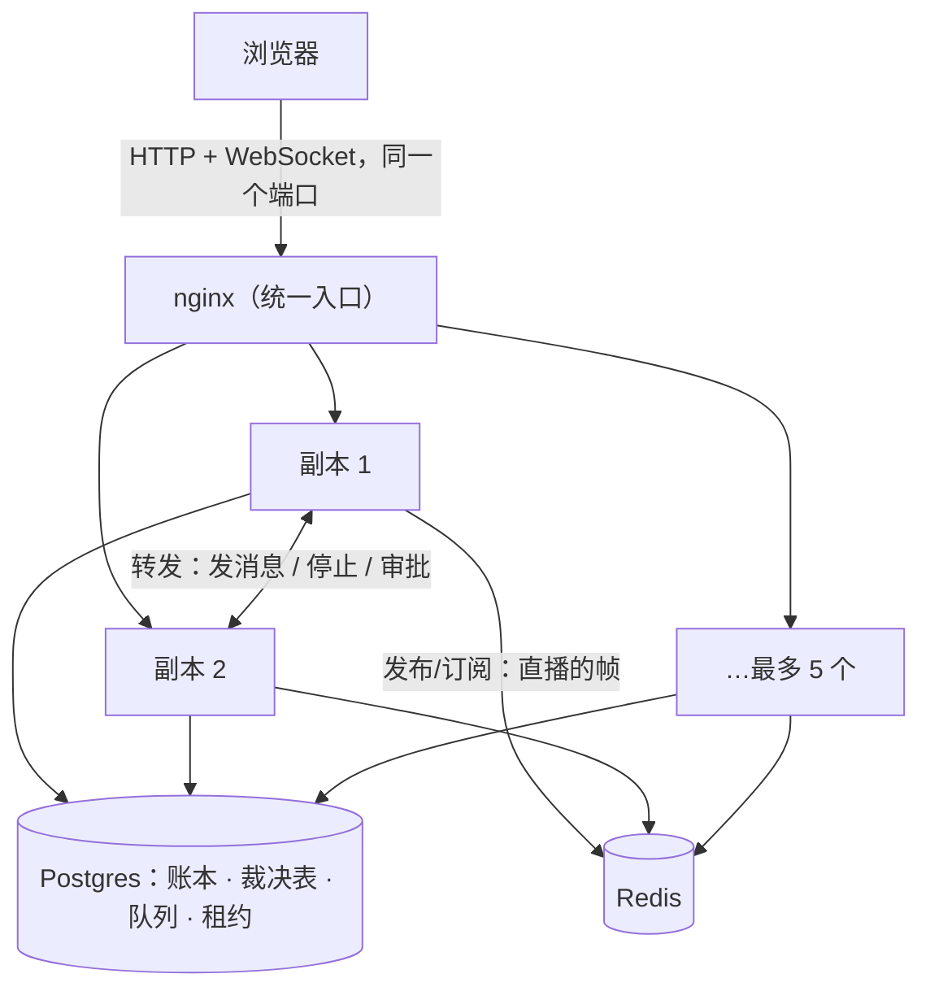
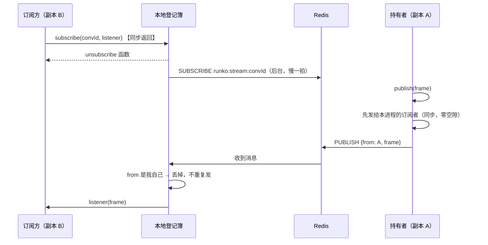

# 集群实验环境 — 技术方案

> 术语见 [术语表](../../../terms.md)。要做什么见[功能手册](../features/cluster-lab.md)；拆单见[施工](../plans/cluster-lab.md)。
> 直播流为什么改走 WebSocket、前端怎么切，见 [WebSocket 直播流 · 技术](../../../ingress/tech/ws-stream.md)。

## 1. 长什么样



**两条通道，分工不同**，这是整套设计的关键：

| 走哪条 | 做什么 | 为什么 |
|---|---|---|
| **Redis 广播** | 直播的帧（agent 正在说的话） | 它是**一对多的只读推送**，谁都能收，没有「必须由某个人来做」的要求 |
| **副本之间转发** | 发消息、插话、停止、答审批 | 它们要动[持有者](../../../terms.md)**进程内存里**的东西：那一轮的 `AbortController`、正在等人的那个 promise |

**于是直播流不再需要转发**：WebSocket 连到哪个副本都行，内容从 Redis 来。这是与现有[多副本验证环境](./multi-replica.md)最大的不同（那一档把流也转给持有者）。

## 2. Redis 版流分发（新包 `@runko/stream-redis`）

框架早就留好了位置：`AgentRuntimeOptions.stream` 吃一个 [`StreamFanout`](../../contract/tech/stream-fanout.md)，缺省是进程内的 EventEmitter，注释里写着「跨实例时换 `@runko/stream-redis`」。这次把它补上。

### 2.1 接口只有两个方法，但有一条硬约束

```ts
interface StreamFanout {
  publish(conversationId: string, frame: Frame): void;
  /** **同步**挂上订阅，返回退订函数。 */
  subscribe(conversationId: string, listener: (frame: Frame) => void): () => void;
}
```

`subscribe` **必须同步**（契约 §2 的第②条）：调用方要写出「挂订阅 → 取[进行中草稿](../../../terms.md)快照」中间不出现 `await` 的那段零空隙代码。而 Redis 的 `SUBSCRIBE` 是异步的。

**解法：本地登记簿同步、Redis 订阅在后台补上。**



三条要点：

- **发布先走本地回环**：publish 时**同步**发给本进程的订阅者，再异步 PUBLISH 给别人。这样同进程那一侧的「零空隙」保证一字不改。
- **消息带上发布者的名字**，收到自己发的就丢掉——否则本地订阅者会收到两遍。
- **订阅慢一拍会漏帧**，这是可接受的：契约本来就写着「不保证送达，掉了靠回放补」。客户端每次连上都先带 `after=<看到的最后一个 seq>` 回放[账本](../../../terms.md)，再接直播。

### 2.2 Redis 掉线怎么办

**不影响这一轮。** publish 失败只记一行日志——直播内容本来就是「尽力而为」，账本才是事实来源。订阅那一侧由客户端重连补：Redis 恢复后，新连上的 WebSocket 会先回放账本，再接上直播。

这条是**有意的**：让 Redis 成为一轮能不能跑的前提，等于给系统加了一个新的单点。

### 2.3 频道与连接

- 频道名 `runko:stream:<conversationId>`，一个会话一个。没人订阅时不占任何东西。
- 一个进程两条连接：一条发布、一条订阅（Redis 的订阅连接进入订阅模式后不能再发普通命令）。
- 退订时若这个会话本地已经没有订阅者，就 `UNSUBSCRIBE`，别让频道越积越多。

### 2.4 帧怎么序列化

`Frame` 四种（message / chunk / queue / activity）都是 JSON 值——它们本来就要经 SSE 或 WebSocket 发给浏览器。所以就是 `JSON.stringify`，读回来用 zod 校验形状。**坏消息丢掉记一行**，不让一条脏消息打断整条订阅。

## 3. 副本数 1–5 怎么做

**用 compose 的 `--scale`，不是写死五个服务。**

难点在于每个副本要有一个**唯一且能被别的副本访问到的地址**（它会被原样写进租约的 `holder`，别人据此转发）。写死服务名的做法扩不动。

解法：**副本自己报自己的主机名**。容器启动时 `RUNKO_NODE_URL=http://$(hostname):3900`，而 Docker 的内嵌 DNS 认得容器名——`runko-cluster-node-2` 在同一个网络里解析得到。于是：

```sh
docker compose -p runko-cluster up -d --scale node=5
```

五个副本各自拿到 `http://runko-cluster-node-1:3900` … `-5:3900`，互相转发得通。

**代价**：宿主机侧的端口是随机分配的（不能给五个容器都绑同一个固定端口）。测试要直连某个副本时用 `docker compose port node <序号>` 问一下。浏览器不受影响——它走 nginx。

### 3.1 建表只跑一次

Postgres 上并发建表会撞。沿用现有做法：一个一次性的 `migrate` 服务先跑完，副本再起（`depends_on: service_completed_successfully`）。

## 4. nginx：HTTP 与 WebSocket 同一个入口

```nginx
location / {
  proxy_pass http://node:3900;
  proxy_http_version 1.1;
  # WebSocket 升级要这两行；普通 HTTP 请求不带 Upgrade 头，$connection_upgrade 是空的，不受影响。
  proxy_set_header Upgrade $http_upgrade;
  proxy_set_header Connection $connection_upgrade;
  proxy_set_header Host $host;
  proxy_buffering off;   # SSE 与 WS 都不能被缓冲
  proxy_read_timeout 1h; # 一条长连接可以安静很久
}
```

`$connection_upgrade` 用 `map` 从 `$http_upgrade` 推出来（有升级头就是 `upgrade`，没有就是空），这是 nginx 代理 WebSocket 的标准写法。

**不需要会话粘性**：直播流靠 Redis 广播，连到哪个副本都一样；要动持有者内存的那几条请求由应用自己转发。

## 5. 副本里怎么接线

```ts
// 有 REDIS_URL 就用 Redis 广播，没有就用进程内的（单副本跑法一字不改）
const stream = redisUrl === undefined ? undefined : redisFanout({ url: redisUrl, nodeId });
createAgentRuntime({ ..., stream });
```

配了 Redis 之后还有两处要跟着改。

**其一：框架要知道这份流分发能跨进程**（`StreamFanout.crossInstance`，[契约 §3③](../../contract/tech/stream-fanout.md#_3-三条约束)）。框架的 `subscribe` 原本见「这一轮不在本副本」就收线——没有广播时这是对的（等也等不到）。有广播之后还收线，连到非持有者副本的人就只收到两帧快照、流随即关闭，正在跑的那一轮一个字也看不到。`@runko/stream-redis` 自报 `true`，框架据此留着等。

这条是**实测出来的**：三副本集群里发一条消息，只有持有者那台能看到直播，另外两台各收到 3 帧就关了（2026-09-22）。

**其二：直播流不再转发给持有者**。现有的转发中间件挂了六条路径，其中 `…/stream`（以及新的 WebSocket 端点）在有 Redis 时要摘掉——留着的话，一个本可以就地答的订阅会被白转一跳，持有者崩了还会跟着 503。

| 请求 | 单副本 / 无 Redis | 有 Redis |
|---|---|---|
| `GET …/stream`、`GET …/ws` | 转给持有者 | **不转**，就地订阅 |
| 发消息、停止、队列删、审批、提问 | 转给持有者 | 一样转 |

## 6. 已知限制

- **中途连上的人会缺一小段**：这一轮已经说出去的话在持有者内存里（[进行中草稿](../../../terms.md)），不在账本里，Redis 也不会重放。所以连到别的副本的人是从「此刻往后」开始看的；等这一轮收尾，完整的那条消息会以账本帧到达，界面自己补齐。要消掉这一小段，得让持有者定期广播草稿快照——那是另一批的事。
- **Redis 挂着的时候，跨副本看不到直播**：账本照常写，刷新即可。
- **还是一台机器**：容器之间的网络往返在 1 毫秒以内，测不出真实跨机延迟。

## 7. 与现有验证环境的关系

| | 多副本验证环境（现有） | 集群实验环境（本方案） |
|---|---|---|
| 副本数 | 三个写死的服务 | 1–5，`--scale` 调 |
| 直播流 | SSE，转发给持有者 | WebSocket + SSE 两条都在，靠 Redis 广播、不转发 |
| 依赖 | Postgres | Postgres + Redis |
| 侧重 | 八个故障场景（冻住、断网、库卡顿） | 副本数可变 + WebSocket + Redis 掉线 |

两套都留着：故障注入那八条已经稳定，不必跟着这批一起动。
