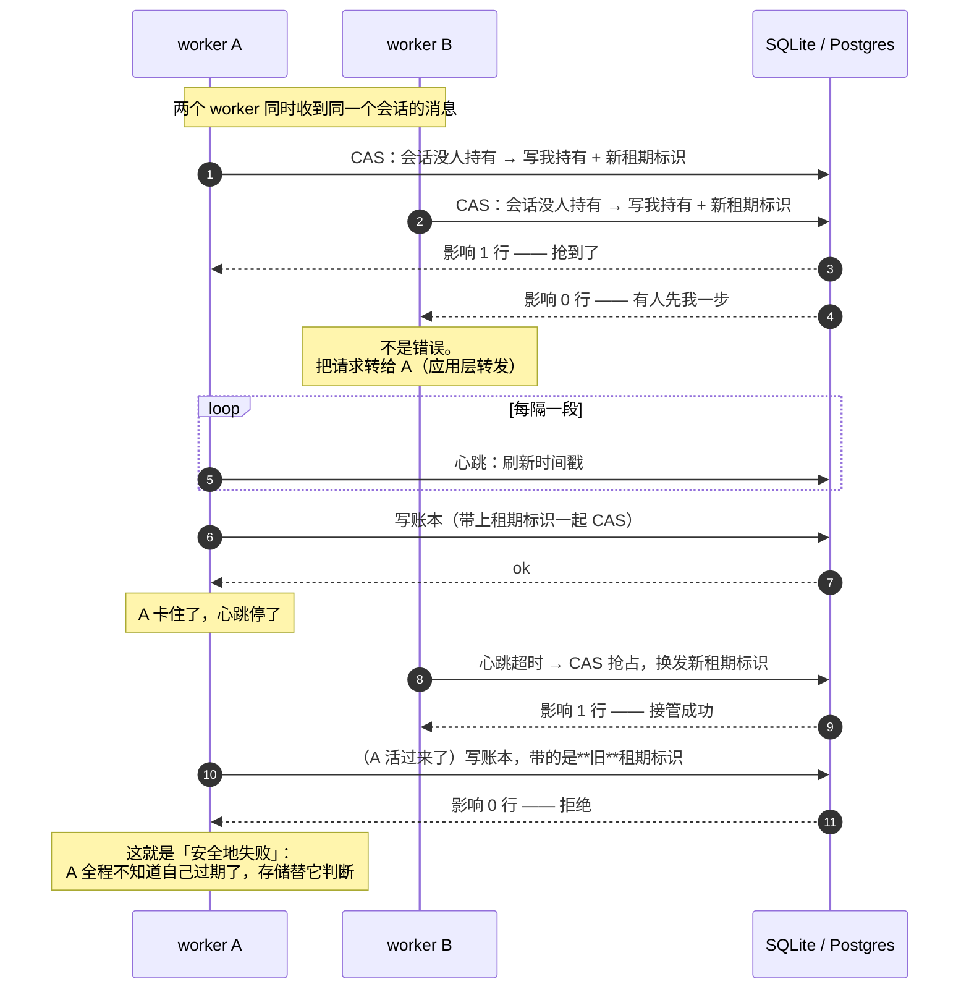

# Node 长驻（宿主层）— 技术方案

> 相关：[功能](../features/deployment.md)。
> 跨环境的那份接口在[契约](../../contract/tech/persistence.md)（本文不复述接口，只讲这一档怎么配）。
> 展开：[归属仲裁机制](../../../logic/arbitration/tech/arbitration-impl.md) · [持久化](../../contract/tech/persistence.md) · [流分发](../../contract/tech/stream-fanout.md) · [沙盒](../../contract/tech/sandbox.md)。

## 1. 一句话

**四样能力全有内置实现，按需逐个换掉**——换的顺序由「跨执行的状态存在哪」决定，不是由部署规模决定。

## 2. 四个台阶各换了什么

| 形态 | 归属仲裁机制 | 持久化 | 流分发 | 沙盒 |
|---|---|---|---|---|
| **⓪ 本机 CLI** | 内存 Map | 内存 | 内置 EventEmitter | **本机**（`localExec` + `fromDirectory`） |
| **① 同机 cluster** | **租约** | **SQLite** | 内置 + [应用层转发](../../../terms.md) | 本机 |
| **② Docker** | 租约 | SQLite | 内置 + 应用层转发 | **远端**（[E2B](../../e2b/tech/deployment.md) 等） |
| **③ k8s 多副本** | 租约 | **Postgres** | 内置 + 应用层转发 | 远端 |

**流分发那一列从头到尾没变**，这是这一档最省事的地方。原因见 §5。

## 3. 归属仲裁：内存 Map 与租约的分界线

分界线只有一条：**进程是不是只有一个**。

- **一个进程** → 内存里一个 Map 就够了。没有[租期标识](../../../terms.md)、不用 CAS、不落库。[独占](../../../terms.md)是**真保证**。
- **两个及以上** → 必须换成租约版：租约表 + 心跳 + 租期标识。独占降级为**尽力 + 可检测**。

Node cluster 的 worker 不共享内存，所以 `cluster.fork()` 开第二个 worker 的那一刻就跨过了这条线。

### 3.1 抢归属这一步长什么样

三个要点：

1. **CAS（比对后再写）必须能拿到影响行数**——那是唯一的成功/失败信号。
2. **`held_by_other` 不是错误**，是「转给持有者」。把它当 500 返回给用户是这一档最常见的实现错误。
3. **每一次写入都可能被拒绝**，而且是正常路径。单进程版永远走不到这条路，但代码里必须有它。

> 租期标识为什么只需唯一不需递增、为什么不用事务、MySQL `affectedRows` 的坑，见[归属仲裁机制](../../../logic/arbitration/tech/arbitration-impl.md)。

## 4. 持久化：一台机器用 SQLite，多台用 Postgres

分界线也只有一条：**这些进程能不能看到同一个文件系统**。

| | 存哪 | 够用到什么时候 |
|---|---|---|
| **⓪** | 进程内存 | 进程一退，对话就没了。CLI 场景可接受 |
| **①** | SQLite（同机文件） | 同一台机器上的多个进程，够用 |
| **②③** | Postgres / MySQL | 跨机就必须换——SQLite 那个文件别的机器看不见 |

`@runko/persist-sql` 是**裸驱动**实现，方言是它的参数；另外两条腿 `persist-drizzle` / `persist-prisma` 接你已有的 ORM。三条腿共用同一套接口，换腿不改业务代码。

**持久化和租约版归属仲裁打包在同一个包里**，因为它们共享连接与 CRUD + CAS 原语。这不是耦合，是「一次装什么」的划分。

## 5. 流分发：这一档为什么不用外挂

流分发要解决的是「订阅的人连在 A 机器，干活的人在 B 机器」。它有两种解法：

- **把内容广播出去**（外挂 Redis Streams 之类）
- **把订阅者转到持有者那边去**（[应用层转发](../../../terms.md)）

这一档能用第二种，因为**你总能知道持有者在哪**：

| 形态 | `holder` 里存什么 | 转发怎么做 |
|---|---|---|
| ⓪① | worker 的进程标识 | 同机 IPC |
| ② | 容器的可达地址 | 直接 HTTP |
| ③ | pod 的 IP 或 service 地址 | 直接 HTTP |

框架把 `holder` 当**不透明字符串**存和传，**不解释它**——里面放什么、怎么转发，是接入代码的事。

**刻意不依赖基础设施提供 sticky routing**。亲和的单位是「一次排空」（见 [conversation-drained](../../../terms.md)），不是一轮，也不是会话永久绑定——用现成的 sticky 会话反而绑得太死。

## 6. 沙盒：本机那档的特殊性

⓪ 用的是本机执行 + 真实目录（`localExec` + `fromDirectory`）。**这是唯一一档 agent 直接碰你真实文件系统的形态**，两个后果：

- **`fromDirectory` 是零拷贝 overlay**——读穿透到真实目录，写全落在内存覆盖层，真实磁盘不会被改。要落盘得显式 `writeBack`。
- **跨会话的资源冲突不归框架管**。两个会话共用一个项目目录会互相踩，[独占](../../../terms.md)是按会话保证的，不是按目录。

从 ② 起换成远端沙盒，这两条就都不存在了。

## 7. 取舍与已知限制

- **崩溃不恢复。** 进程被强杀走老路（补一条「已中断」）——它没停在干净边界上，不知道命令跑完没有。
- **多进程下行为集合变大。** 会出现「一轮跑到一半被告知你已经不是持有者了」。测试要专门覆盖这条路，**单进程版跑绿不代表租约版没问题**。
- **租约版的独占是尽力保证。** 你没法知道远处那个节点是死了还是只是联系不上——本方案选择「做超时接管 + 用租期标识兜底」，所以一定存在误判窗口，只保证误判时被拦住。
- **同机 cluster 风险低但接口不能偷懒。** 网络分区不存在、进程存活可直接查，可这两条都是**运气**不是**保证**，接口该有的拒绝路径一条都不能少。
