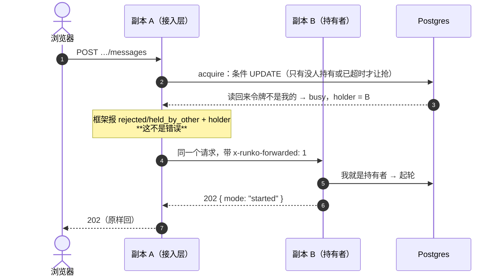
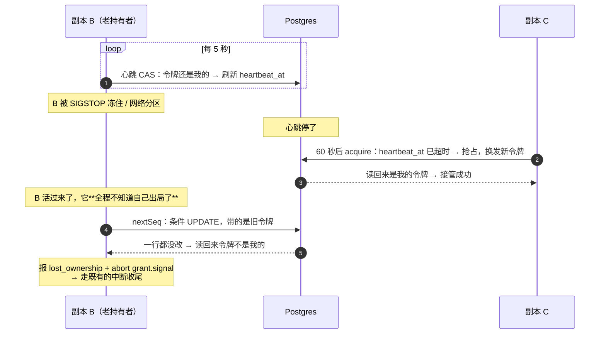
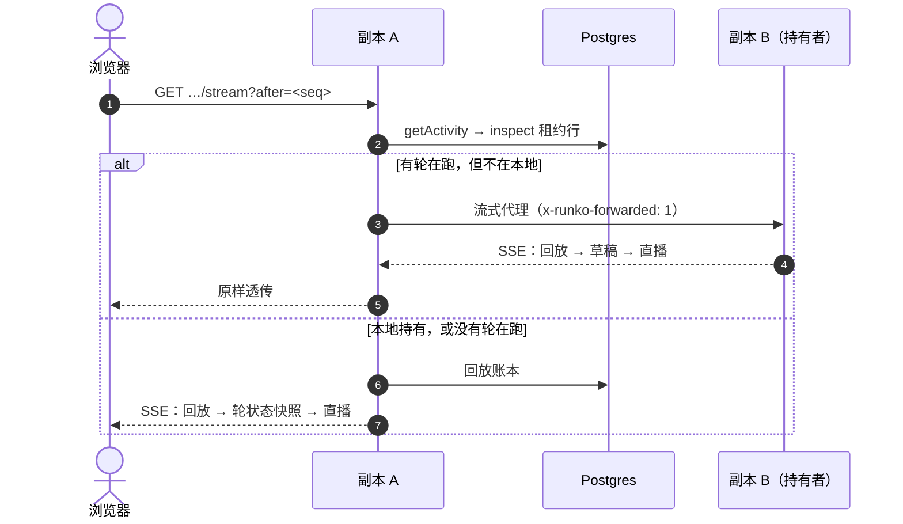
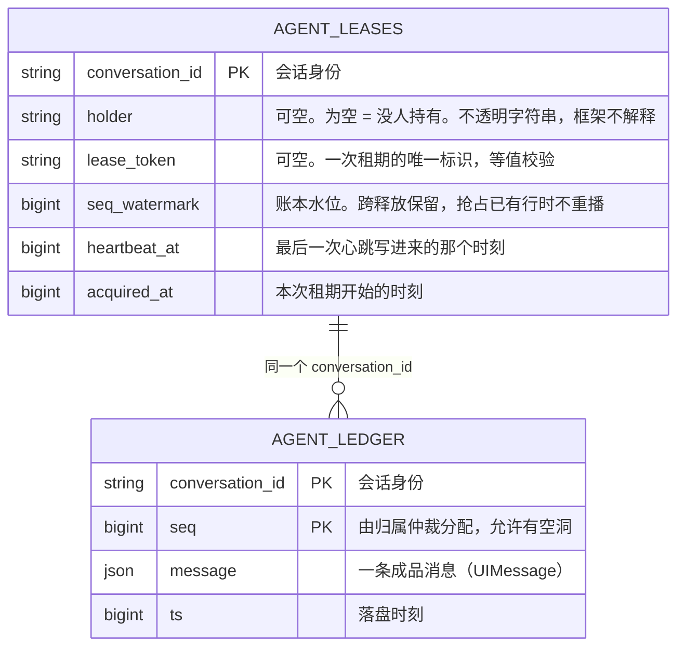
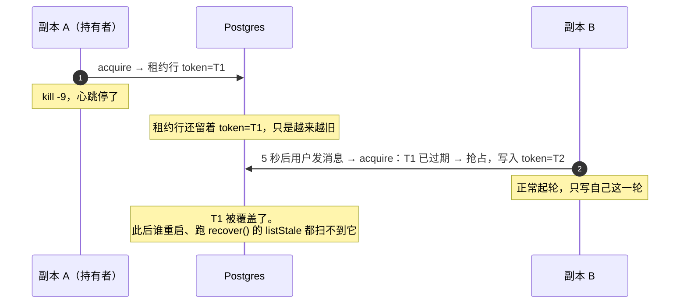
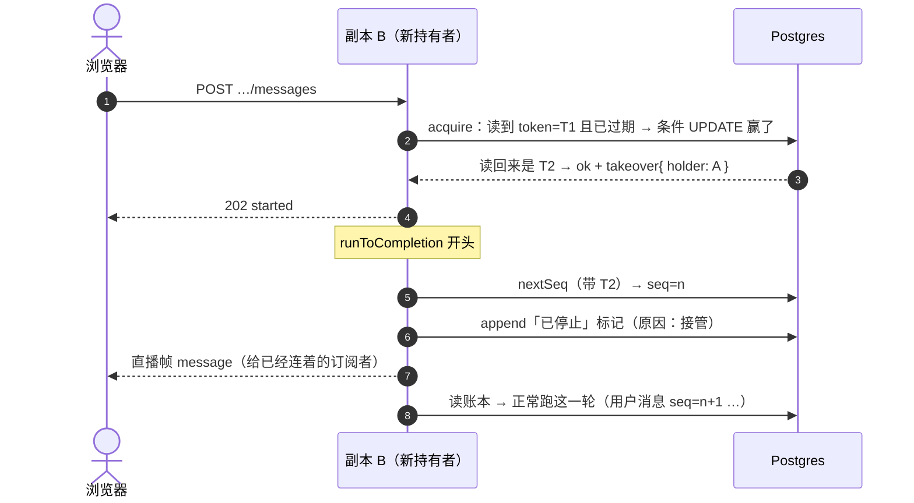
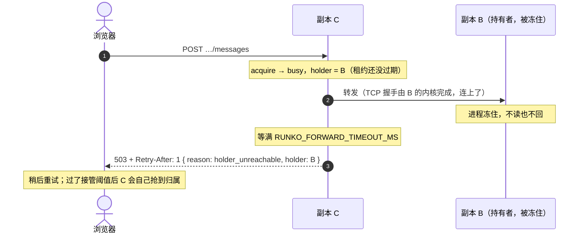
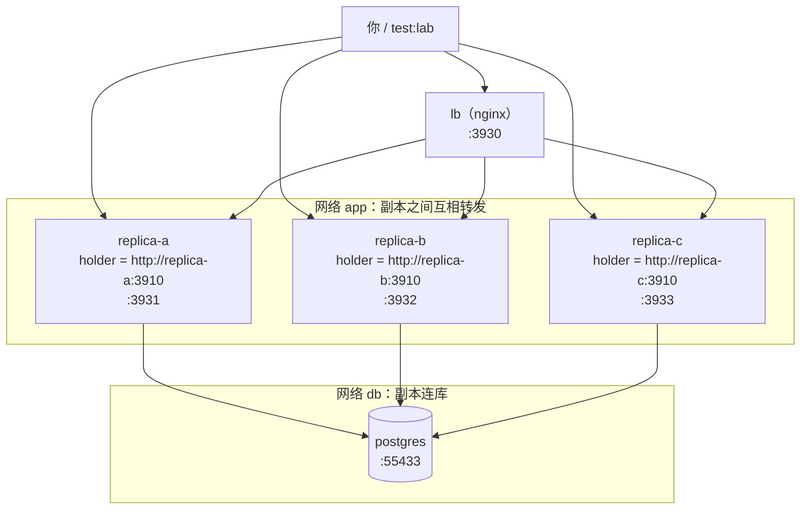
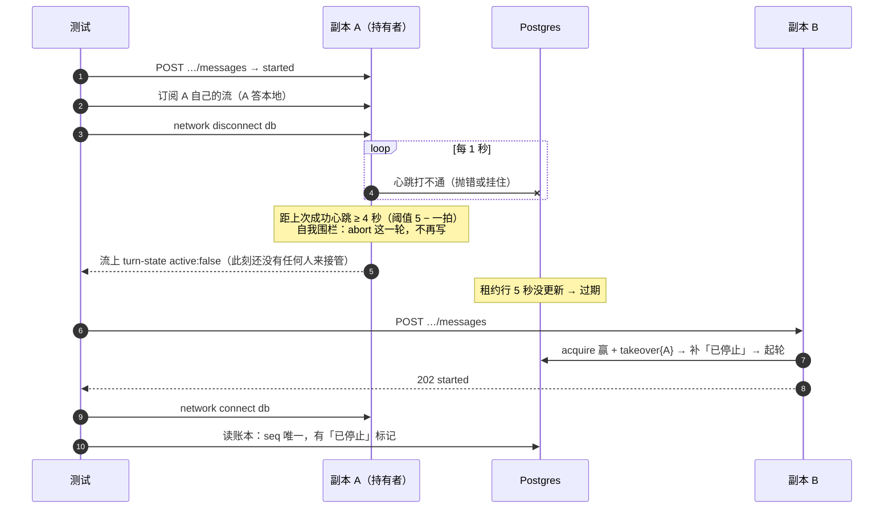
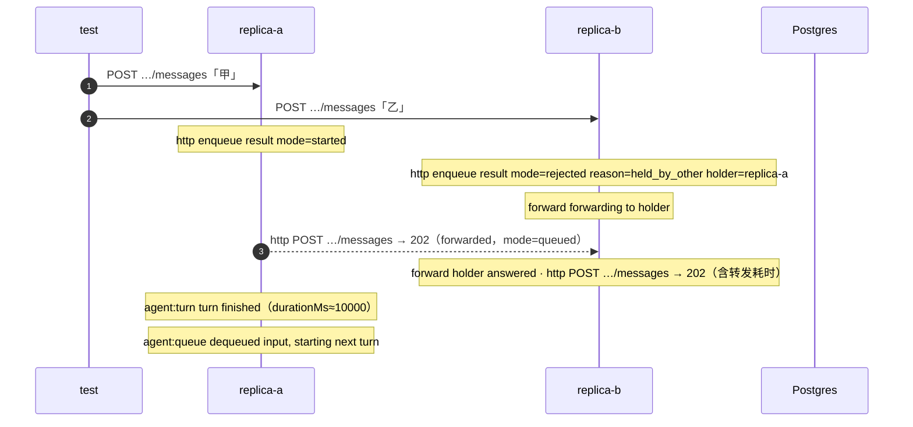

# 多副本部署（Node 长驻）— 技术方案

> 相关：[使用手册](../features/multi-replica.md) · [施工计划](../plans/multi-replica.md) · [Node 长驻 · 功能](../features/deployment.md) · [Node 长驻 · 技术方案](./deployment.md)（四档形态的横向对照，本文不复述）。
> 展开：[归属仲裁机制](../../../logic/arbitration/tech/arbitration-impl.md) · [流分发](../../contract/tech/stream-fanout.md) · [持久化](../../contract/tech/persistence.md)。
>
> **状态：两批都已交付（Mongo 版租约仲裁除外）。** 本文把
> [Node 长驻 · 技术方案 §2](./deployment.md) 那张表里的 **③ k8s 多副本**从「设计上成立」推到
> 「可交付、可验收」。租约版[归属仲裁机制](../../../terms.md)已于 2026-09-01 落地（见
> [施工计划](../../../logic/arbitration/plans/arbitration-impl.md) L0–L6）。
>
> - **第一批**（2026-09-09）：四个缺口——薄壳出口、`holder` 结构化、`subscribe` 权威轮状态、接入层转发。
>   端到端用的是「两个进程共用一个 SQLite 文件」。
> - **第二批**（2026-09-13）：把端到端搬到**真跨容器 + 真 Postgres** 上（§11 [多副本验证环境](../../../terms.md)），
>   并修掉读代码时发现、要靠这套环境证实的两处缺陷（§9 崩溃那一轮没人补收尾、§10 转发等不到回话）。
>   八个故障场景在真 Postgres 18 上连续通过；过程中又实测出一处 HTTP 状态码的坑（§10.4）。

## 1. 一句话

**同一份对话的所有请求，最终都要落到持有[归属](../../../terms.md)的那个副本上**——写入靠[租约](../../../terms.md)挡住走岔的，请求靠[应用层转发](../../../terms.md)送到对的地方。

## 2. 这一档要成立，需要六件事同时成立

多副本不是一个开关，是六件事各自到位（第 5、6 件是第二批在跨容器验证时补上的）：

| # | 要成立的事 | 靠什么 | 现状 |
|---|---|---|---|
| 1 | 同一时刻只有一个副本在推进这份对话 | 租约版归属仲裁机制 | ✅ Kysely 三方言与三个薄壳已交付；**Mongo 还没有** |
| 2 | 被误判出局的老持有者写不进账本 | [租期标识](../../../terms.md) + 每次取号 CAS | ✅ 已交付并有一致性套件钉住 |
| 3 | 请求打到哪个副本都能被送到持有者手上 | 接入层转发（框架给 `holder`） | ✅ `holder` 结构化 + persist-demo 转发示范（§5） |
| 4 | 正在看的人能看到正在产生的内容 | 转发[直播流](../../../terms.md)（不外挂广播） | ✅ `subscribe` 改用权威轮状态（§5.2） |
| 5 | 崩溃那一轮在账本里有收尾 | 接管时由新持有者补「已停止」标记 | ✅ 第二批（§9）；仍有一条冷门路径补不上，见 §9.5 |
| 6 | 持有者卡死时，请求很快有回应 | 转发设「等对方开口」的超时 | ✅ 第二批（§10） |

第 1、2、5 件是**框架的保证**，第 3、4、6 件是**接入层的活儿**，但框架得先把接入层需要的信息给全。
本文的缺口就是按这个顺序排的。

## 3. 现状盘点：先看清哪些已经有了

**这一节最要紧**——租约版仲裁已经跑起来了，别照着旧文档重做一遍。

> 下表是立项时的盘点；「现状」列已于 2026-09-13 回填成当前事实。

| 件 | 现状 | 位置 |
|---|---|---|
| `Arbitration` 接口与 `Grant` | ✅ 已定稿 | `packages/agent/src/arbitration.ts` |
| 租约表 `agent_leases`（四档 DDL） | ✅ 已交付 | `packages/persist-kysely/src/schema.ts` · `migrate.ts` |
| `leaseArbitration()`：抢占 / 心跳 / 自我围栏 / 取号 CAS / `listStale` | ✅ 已交付 | `packages/persist-kysely/src/arbitration.ts` |
| 仲裁一致性套件（18 条，含三条多节点与接管） | ✅ 已交付 | `packages/conformance/src/arbitration.ts` |
| 真 Postgres / 真 MySQL 上跑绿 | ✅ 已交付 | CI 的 service container |
| 轮编排对「失去独占权」的处置 | ✅ 已交付且有用例 | `packages/agent/src/runtime/turn.ts` |
| `getActivity()` 会回退到 `arbitration.inspect()` | ✅ 已交付 | `packages/agent/src/runtime.ts` |
| **三个薄壳的仲裁出口** | ✅ 第一批 M1 | `persist-sqlite` / `-postgres` / `-mysql` |
| **Mongo 版仲裁** | ❌ 还没有（施工计划 M2） | `persist-mongo` |
| **`enqueue` 被拒时的结构化 `holder`** | ✅ 第一批 M4 | `packages/agent/src/types.ts` |
| **`subscribe` 的[轮状态快照](../../../terms.md)** | ✅ 第一批 M3 | `packages/agent/src/runtime.ts` |
| **接入层转发的示范** | ✅ 第一批 M5 | `apps/persist-demo` |
| **两个真进程的端到端** | ✅ 第一批 M6（SQLite 文件档） | 同上 |
| **接管时补「已停止」标记**（第二批） | ✅ 第二批 M12 | `packages/agent/src/runtime.ts` · `runtime/queue.ts` |
| **转发等回话的超时**（第二批） | ✅ 第二批 M11 | `apps/persist-demo/src/forward.ts` |
| **跨容器 + 真 Postgres 的端到端**（第二批） | ✅ 第二批 M10 / M13 | `apps/persist-demo/docker/` |

## 4. 缺口一：四个持久化包里只有一个能拿到租约版仲裁

`leaseArbitration()` 只从 `@runko/persist-kysely` 导出。它吃两样东西：一个 Kysely 实例，和一个
`flavor`。而三个薄壳（`persist-sqlite` / `-postgres` / `-mysql`）的存在理由正是**替你把这两样
装配好**——它们现在只装配了持久化那一半：

```ts
// 现在：装了包也拿不到租约版仲裁，还得自己装一遍 Kysely
import { sqlitePersistence } from "@runko/persist-sqlite";
import { leaseArbitration } from "@runko/persist-kysely";   // ← 还得再装一个包
import { Kysely, SqliteDialect } from "kysely";             // ← 还得自己拼 Kysely
```

### 4.1 三个薄壳各加一个出口

每个薄壳加一个与它的 `*Persistence()` 对称的函数，入参是**同一个驱动实例**：

```ts
export function sqliteArbitration(
  database: SqliteDatabase,
  opts: Omit<LeaseArbitrationOptions, "flavor">,   // holder / heartbeatMs / takeoverMs / now
): Arbitration {
  return leaseArbitration(toKysely(database), { ...opts, flavor: "sqlite" });
}
```

`postgresArbitration(pool, opts)` / `mysqlArbitration(pool, opts)` 同形。三处都只是**填掉
`flavor`**，没有第二种逻辑。

**一个副作用要写进注释**：`sqlitePersistence(db)` 和 `sqliteArbitration(db)` 会各建一个
Kysely 实例。Kysely 是查询构建器、不自己持连接（连接池是你给的那个驱动），所以两个实例
共用同一个池，不多占资源；但**建表只能建一次**——`migrate()` 仍然只调一次，它已经把
`agent_leases` 一起建了。

### 4.2 Mongo 版：不是薄壳，要重写一份

`@runko/persist-mongo` 底下没有 Kysely（Kysely 是 SQL 查询构建器），所以它得直接实现
`Arbitration`。好消息是 **Mongo 在这件事上比 SQL 顺手**：

| 动作 | SQL 版怎么做 | Mongo 版怎么做 |
|---|---|---|
| 抢占 | 条件 UPDATE → **再读回来比对令牌** | `findOneAndUpdate(..., { returnDocument: "after" })`，一次往返 |
| 取号 | 条件 UPDATE（`seq_watermark + 1`）→ **再读回来** | `findOneAndUpdate({ $inc })`，返回的就是新值 |
| 释放 | 条件 UPDATE | `updateOne` |

「读回来比对」在 SQL 版是**为了绕开 MySQL**：它把「匹配到了但值没变」也报成 0 行，跟
「没匹配到」分不开。Mongo 的 `findOneAndUpdate` 直接返回更新后的文档（没匹配就是 `null`），
这一步天然不需要。

文档形状与 SQL 表一一对应，`_id` 就是会话 id：

```js
// 集合 agent_leases
{
  _id: "conv_abc",           // = conversationId
  holder: "http://10.1.2.3:3910",   // 可空：为空 = 没人持有
  lease_token: "9f1c…",             // 可空：一次租期的唯一标识
  seq_watermark: 42,                // 账本水位，跨释放保留
  heartbeat_at: 1757400000000,
  acquired_at:  1757399000000,
}
```

抢占仍走**四步**，与 SQL 版同形（下面 §7.1 的图是同一条路）：

1. 读一次：有人持有且心跳没超时 → 直接报 `busy`，**不调 `seedSeq()`**（契约要求它惰性）；
2. 行不存在 → `insertOne` 播种水位，**撞了 `E11000` 不算错**（另一个副本同时在插）；
3. `findOneAndUpdate` 决胜负：filter 是 `{ _id, $or: [{ lease_token: null }, { heartbeat_at: { $lt: at - takeoverMs } }] }`；
4. 返回 `null` = 没抢到，带上当前 `holder` 报 `busy`。

> **别把第 2、3 步合成一次 upsert。** Mongo 的 upsert 只从 filter 里的**等值**子句推导要插入
> 的文档，`$or` 那一段推不出来；行已存在且被别人持有时，它会试着插一条同 `_id` 的新文档，
> 撞 `E11000`。能用 catch 兜住，但那是把正常路径写成异常路径——`seedSeq()` 的惰性也保不住了。

### 4.3 心跳与自我围栏：**刻意复制一份，不抽包**

`Grant` 上那段心跳（定时 CAS + 连续失败到逼近阈值就自己停手）与存储无关，两份实现会一模一样。
仍然选择**复制到 `persist-mongo`**，理由三条：

- 抽成公共包要么新开一个包（为 60 行代码开包不划算），要么把「租约」「租期标识」这套词放进
  `@runko/agent` 的公开 API——而那个包的仲裁接口**刻意一个 token 字段都没有**（[技术方案 §2](../../../logic/arbitration/tech/arbitration-impl.md)的约束一）；
- `persist-mongo` 依赖 `persist-kysely` 只为拿这段 helper，会毁掉「它不是薄壳」这个定位，还得把
  Kysely 拖进 Mongo 用户的依赖树；
- **漂移有东西挡**：仲裁一致性套件里「心跳自己发现被接管」「被误判的老持有者取号一律被拒」
  两条会同时钉住两份实现，改坏一份当场红。

本仓已有同款先例：`@runko/agent` 自己写了一份与 sdk 同款的文件工具默认装配。**两处都要写明
「这是刻意的重复，改一处必须同步另一处」。**

## 5. 缺口二：接入层想转发，但框架没把话说全

框架的分工是**「我告诉你归属在谁手上，转发你自己写」**。这条没问题，问题是现在告诉得不够。

### 5.1 起轮被拒时，`holder` 只活在一句英文文案里

```ts
// packages/agent/src/types.ts
export type EnqueueResult =
  | { mode: "started" }
  | { mode: "queued"; queued: QueuedInput; queue: QueuedInput[] }
  | { mode: "steered" }
  | { mode: "rejected"; reason: EnqueueRejection; message: string };   // ← 没有 holder
```

`reason: "held_by_other"` 的 `message` 是
`` `This conversation is owned by ${holder}; forward the request there.` ``——接入层要转发，只能
去字符串里抠。**加一个可选字段**即可：

```ts
| { mode: "rejected"; reason: EnqueueRejection; message: string; holder?: string }
```

只在 `held_by_other` 时有值，其余四种拒绝原因照旧。向后兼容，接入层不改也能编译。

### 5.2 `subscribe` 的轮状态快照给的是**本地**答案

这是本文四个缺口里唯一一处**真错**，而不只是缺东西。`subscribe` 第 ③ 步：

```ts
const turn = registry.get(conversationId);   // ← 只看本进程的登记表
const active = turn !== undefined;
const holder = turn?.grant.holder;
…
yield { kind: "activity", active, ...(holder !== undefined ? { holder } : {}) };
if (!active && follow === "turn") { return; }
```

多副本下，副本 A 上的订阅者去看一份正跑在副本 B 上的对话，拿到的是
`{ active: false }`——**服务端权威答案说「没有轮在跑」，而实际上有**。接入层因此既不知道
该转发、也没法告诉用户「这一轮在别的节点上」。

同一个文件里 `getActivity()` 已经写对了：本地登记表命中就用它，否则回退到
`arbitration.inspect()`。**`subscribe` 用同一套逻辑即可**：

```ts
// 判据仍用第 ③ 步捕获的那个 turn，控制流一行没变；变的只是这一帧的内容
const remote = localActive ? undefined : await arbitration.inspect(conversationId);
const heldElsewhere =
  remote?.held === true &&
  (registry.lastHolder === undefined || remote.holder !== registry.lastHolder);
const holder = localActive ? turn.grant.holder : heldElsewhere ? remote?.holder : undefined;
yield { kind: "activity", active: localActive || heldElsewhere, ...(holder !== undefined ? { holder } : {}) };
if (!localActive && follow === "turn") { return; }
```

四个要点：

1. **不会新增空隙。** 那个「取草稿 + 清缓冲」的同步临界区在第 ③ 步，`inspect()` 落在第 ④ 步——
   那里本来就有一次 `await persistence.queue.list(…)`。
2. **单进程零影响。** 本地登记表命中，`inspect()` 一次都不会被调到。
3. **`Frame` 类型不变**，只是 `active` / `holder` 从「本进程知道的」变成「权威的」。
4. **必须把「我自己那一轮正在收尾」排除掉。** 收尾的顺序是**先删登记表、再释放归属**，
   中间那一小段两边都查得到「有人持有」却没有任何东西在跑。照搬 `inspect()` 的答案会让
   最后一帧说「还在跑」然后流立刻断掉——那正是客户端用来关掉转圈动画的那一帧；释放失败时
   这段窗口会一直拖到租约过期。判据是登记表上记着的 `lastHolder`（本进程最近一次持有时
   用的那个字符串）。

### 5.3 哪些端点必须转发，哪些不用

判据只有一条：**这件事的状态在数据库里，还是在持有者的进程内存里。**

| 端点 | 状态在哪 | 要转发吗 |
|---|---|---|
| `POST …/messages`（起轮） | 归属在数据库，**但起轮要在持有者那儿发生** | ✅ `held_by_other` 时转 |
| `POST …/abort`（[停止](../../../terms.md)） | 持有者的 `AbortController` | ✅ **必须** |
| `POST …/approvals/:callId`（[人在回路](../../../terms.md)审批） | 持有者内存里那个正在 `await` 的 promise | ✅ **必须** |
| `POST …/questions/:callId`（回答 `ask-user`） | 同上 | ✅ **必须** |
| `GET …/stream`（SSE） | [进行中草稿](../../../terms.md)在持有者内存里 | ✅ 有轮在跑且不在本地时转 |
| `GET …/messages`（[回放](../../../terms.md)[账本](../../../terms.md)） | 数据库 | ❌ |
| `GET / DELETE …/queue`（[待发队列](../../../terms.md)） | 数据库 | ❌ |
| `POST …/messages`（排队 / 队列已满） | 数据库 | ❌ 任何副本都能入队 |

> **审批与提问这两条最容易漏。** 人在回路桥（`HumanBridge`）把待裁决项挂在**那一轮的
> `ActiveTurn` 对象**上，不是数据库里。裁决打到别的副本上会拿到「没有这条待定裁决」，
> 而用户界面显示提交成功。调研过的一套已上线系统正是栽在这条上，他们的复盘原话是
> 「界面显示提交成功，实际没人接」。

### 5.4 转发要防三件事

**① 环路。** 转发出去的请求必须带一个标记（`x-runko-forwarded: 1`）；带着标记进来的请求
**一律不再转发**——归属在这一瞬间又换了人也不行，宁可回 409 让客户端重试。没有这条，
两个副本互相认为对方是持有者时会打成死循环。

**② 把用户凭据原样转出去。** 副本之间是内部调用，用一个共享的内部令牌鉴权，用户身份用
不透明的会话 id 带过去。

**③ SSE 转发变成缓冲。** 代理 `GET …/stream` 必须**流式**转发，中间任何一层把响应体读完
再吐都会让直播变成「一轮跑完才出现」。

## 6. 缺口三：流分发这一档为什么不外挂

[流分发的契约](../../contract/tech/stream-fanout.md)状态是「接口未定稿」，那是本档目前唯一还挂着
的框架级未决项。**本档把它定稿为现在这两个方法，并把游标制留给外挂广播那条腿。**

```ts
export interface StreamFanout {
  publish(conversationId: string, frame: Frame): void;
  subscribe(conversationId: string, listener: (frame: Frame) => void): () => void;
}
```

推导只有一步：**这一档总能知道持有者在哪**（`holder` 里存的是 pod 的可达地址），所以
「订阅方与产出方不在一处」用转发就解决了，不需要把内容广播出去。既然不广播，就不需要
「从某个位置续读」，也就不需要游标和保留窗口——那两样是 Redis Streams 那条腿的东西。

| 形态 | 流分发怎么办 | 要装包吗 |
|---|---|---|
| ⓪ 本机 CLI · ① 同机 cluster | 内置 + 转发（同机 IPC / HTTP） | ❌ |
| ② Docker · **③ k8s 多副本** | **内置 + 转发**（`holder` 是可达地址） | ❌ |
| ④a Cloudflare DO | 平台自带 | ❌ |
| ④b Vercel | `@runko/stream-redis` | ✅ 但**不在本档** |

**④b 是唯一绕不过去的一档**——它的实例由平台调度，你没有办法找到持有者。那条腿连同游标制
留给 [Vercel 那一档](../../vercel/tech/deployment.md)，本计划把它列为非目标（见 §13）。

> 这个取舍有外部佐证：调研过的一套已上线系统**删掉了原有的 Redis 事件中继**，改成
> 「同一份对话恒定落在同一个节点 + 节点间 HTTP 兜底」。他们的理由与这里同源：一旦请求
> 能被送到持有者，广播就是多余的一层。

## 7. 关键流程

### 7.1 起轮：请求落到非持有副本



### 7.2 接管，以及被误判的老持有者

这条是整个功能**唯一真正要证明的东西**，其余都是它的推论。



**两道闸各管一头，缺一不可**：令牌管「不写坏」（它只会拒绝），心跳管「卡住的能被接管」。
只有令牌没有心跳 = 崩溃的对话永久卡死；只有心跳没有令牌 = 误判时两个持有者都能写。

还有一道自我围栏：B 连续心跳失败到逼近接管阈值时**自己主动停手**。账本有令牌挡着不会写坏，
但**沙盒挡不住**——两个执行同时改同一个[工作区](../../../terms.md)就是互相踩文件。

### 7.3 订阅：路由由权威轮状态决定



**有一条竞态自愈路径要认下来**：A 判定「没有轮在跑」之后、B 才起轮，此时 A 那条流收不到任何
内容。它不会挂住——`follow: "turn"` 在没有活跃轮时立刻收线，客户端重连时重新走一遍路由就
落到 B 上了。代价是**一次重连的延迟**，不是丢内容（账本回放会补齐）。

## 8. 数据模型

多副本只多一张表，就是租约表。它与账本共用 `conversation_id`，**水位放在租约行上**——这样
「取号」和「校验我还持有」是同一条 UPDATE，不需要两次往返，也不可能出现「校验通过但取号用
的是别人的水位」。



三条不变式：

- **释放不删行**，只把 `holder` / `lease_token` 置空——`seq_watermark` 要跨释放保留，否则下一轮
  会从账本水位重新起，撞上已经发出去但还没落盘的号；
- **抢占已有行时不重播水位**，那会让 seq 倒退；
- **`clearStale` 必须带上与 `listStale` 同一条陈旧判据**，不能只按会话清——否则会擦掉一个
  活着的持有者的租约（多副本同时开机扫描时真会撞上）。

## 9. 缺口五（第二批）：崩溃那一轮没人补收尾

### 9.1 现象

持有者 A 跑到一半被 `kill -9`。过了[接管阈值](../../../terms.md)，用户往副本 B 发了下一句。
B 正常起轮。**但 A 那一轮在[账本](../../../terms.md)里永远停在「只有用户消息」**——没有助手回复，
也没有「已停止」标记。界面上那一轮既不像跑完了，也不像被停了。

### 9.2 原因

给[孤儿轮](../../../terms.md)补「已停止」的只有一处：`runtime.recover()`。而它**只在进程启动时跑一次**。



**单进程时这条路走不到**：进程死了就只能靠重启，重启一定先跑 `recover()`。多副本下
「别的副本先接手」成了常态，于是 `recover()` 只能兜住「先重启、后有人发消息」那一种顺序。

### 9.3 修法：抢占时告诉调用方「我顶掉了一个过期的持有者」

**`AcquireResult` 成功分支加一个可选字段**：

```ts
// packages/agent/src/arbitration.ts
export type AcquireResult =
  | { ok: true; grant: Grant; takeover?: { holder?: string } }   // ← 新增
  | { ok: false; reason: "busy"; holder: string | undefined };
```

| 谁 | 做什么 |
|---|---|
| `leaseArbitration()`（`persist-kysely`） | 抢占前读到的那一行**令牌不为空**（有人持有但已过期），且这次条件 UPDATE 赢了 → 带上 `takeover: { holder: 原持有者 }` |
| 内存版仲裁（`@runko/agent` 内置） | 永远不带。进程内不存在「过期的持有者」 |
| `startTurn`（`runtime/queue.ts`） | 把 `takeover` 记到这一轮的 `ActiveTurn` 上 |
| `runToCompletion`（同上） | **读账本之前**，先用本轮的 `grant.nextSeq()` 补一条「已停止」标记，再正常开跑 |

「已停止」标记的形状与 `recover()` 写的**完全一样**（一条只有 `step-start` 的助手消息，
`status: "interrupted"`），抽成一个共用函数，两处调用。区别只在理由文案：

- `recover()`：`Server is shutting down; this turn was interrupted.`（沿用）
- 接管：`The node running this turn stopped responding; another node took over.`（新增）

补完还要**广播一帧 `message`**：此刻可能已经有订阅者挂在新持有者这边，不广播的话他们要等
下次重连回放才看得到这条标记。



**补标记这几次打库期间，归属也可能又丢了**（库卡住超过[自我围栏](../../../terms.md)的余量，心跳把 grant
停掉）。`driveTurn` 是在补完标记之后才给 `grant.signal` 挂监听的，而**给已经 abort 的信号挂监听，
回调永远不会触发**（DOM 规范）。所以挂完监听要**补查一次**「是不是已经丢了」，否则这一轮会照常装配、
跑模型、动沙盒，每次写账本却都被拒。这个空档在改动前就存在（只有一次读账本那么宽），补标记把它
放宽了约三倍，本批一并修掉，并有单测钉住。

### 9.4 为什么是这个修法

| 方案 | 为什么不选 |
|---|---|
| 每个副本定时跑一次 `recover()` | **窗口还在**：定时扫描之前如果已经有人发了消息，照样扫不到；而扫描间隔调短就是白白多打库 |
| 看账本尾巴猜：最后一条是用户消息 = 上一轮崩了 | **判据不可靠**：[起轮装配](../../../terms.md)阶段失败、被停止等路径下账本尾巴的形状各不相同，猜错就会给一轮正常结束的对话多补一条 |
| 让 `leaseArbitration` 在抢占时自己往账本写标记 | **越层**：仲裁机制不该认识账本消息长什么样，[持久化](../../../terms.md)接口也刻意不认识租约（见 `arbitration.ts` 文件头的两条约束） |

选中的方案**只让仲裁多说一句「顶掉了谁」**，写不写、写成什么样仍归[轮编排](../../../terms.md)。
字段可选，已有的第三方仲裁实现不改也能编译，只是拿不到这个修复。

一致性套件照这个口径拆：「**该报的时候报**」单独成组 `arbitrationTakeoverReportCases`，报了这个字段的
实现显式接上；「**不该报的时候别报**」（首次抢占、释放后再抢、`clearStale` 之后再抢）放进原有的组，
所有实现都要过——不报这个字段的实现天然能过，升级套件不会无故变红。

### 9.5 已知不精确

「读到过期令牌」和「条件 UPDATE 赢」之间隔着一次往返。**如果老持有者恰好在这一瞬间活过来、
正常收尾并释放**，新持有者会多补一条「已停止」。窗口只有一次往返那么宽，后果只是多一条标记，
不会写坏账本。`recover()` 今天有同样的不精确（`listStale` 也分不清「崩了」和「正在收尾时
卡住」），这里不另加一层 CAS。

### 9.6 已知遗漏：冻住之后没人来接管

还有一条路径补不上标记：持有者被冻住超过自我围栏的余量，**而这段时间没有任何副本来碰这份对话**。
它醒来后心跳先触发围栏、自己停手；中断收尾要取号，但 grant 已经 abort，取号直接被拒；随后
`release()` 带着自己的令牌能命中，把令牌清空了。结果：账本只剩用户消息，令牌是空的——`listStale`
扫不到，下一次抢占也不会报 `takeover`。

这是改动前就有的行为，本批不修。候选修法是「被围栏停掉的 grant 不释放租约，留给它自然过期」，
这样下一次抢占必然报 `takeover`；但它改的是 `release` 的语义，要单独评估对自动出队的影响
（过期前的那一拍里，同一个副本自己的出队也会被挡成 `busy`）。

## 10. 缺口六（第二批）：转发等不到持有者回话

### 10.1 现象

持有者被冻住（长时间 GC、虚机被挂起、`docker pause`）或者卡死时，打到其他副本的请求**会一直挂着**，
不会像「持有者崩溃」那样立刻拿到「稍后再试」。验证环境里实测：等满 20 秒仍无回应。

### 10.2 原因

`forward.ts` 只兜住了 `fetch` **抛错**的情况（`ECONNREFUSED`、找不到主机名）。被冻住的进程不一样：

- 它的端口还在监听。**TCP 握手由操作系统内核完成**，不需要进程醒着，所以连接能建立。
- 请求发过去了，进程却不读、不回。
- `fetch` 没设超时，只能等 Node 内置 HTTP 客户端（undici）的默认「响应头超时」，**300 秒**。

而这段窗口正是用户最需要一个快速回应的时候。

### 10.3 修法：只给「等对方开口」设超时

```ts
// apps/persist-demo/src/forward.ts（示意）
const timeout = new AbortController();
const timer = setTimeout(() => timeout.abort(), forwardTimeoutMs);   // 缺省 10 秒
try {
  upstream = await fetch(target, { ..., signal: AbortSignal.any([c.req.raw.signal, timeout.signal]) });
} catch (error) {
  if (c.req.raw.signal.aborted) throw error;   // 客户端自己走的
  return retryLater(holder);                   // 连不上、或等超时 → 一律 503 + Retry-After
} finally {
  clearTimeout(timer);                         // 响应头到了就撤掉计时器
}
```

**关键在 `finally` 撤计时器**：`fetch` 在拿到响应头时就返回，响应体还是一条流。计时器只管
「对方开没开口」，不管「说了多久」——否则 SSE 这种一连几分钟的流会被拦腰截断。

新增环境变量 `RUNKO_FORWARD_TIMEOUT_MS`（缺省 `10000`）。



**为什么不选另外两种**：

- **给整个请求设总超时**：SSE 是长连接，总超时会把正常的直播切断。
- **配 undici 的 `headersTimeout`**：要自己 new 一个 `Agent` 当 dispatcher 传给 `fetch`，
  等于把一个 Node 专属的依赖写进示范代码；`AbortSignal` 是标准 API，任何运行时都能照抄。

### 10.4 「稍后再试」用 503，不能用 421（实测出来的）

第一批把「持有者够不着」「转不了」都回成 **421 Misdirected Request**，字面意思很贴切。验证环境里却发现：
同一个请求，curl 2 秒拿到结果，Node `fetch` 要 **4 秒**——正好两倍转发超时。换请求头、从容器里发都一样。

原因在 **Fetch 标准**本身：响应是 421、且请求体为空或可重放（字符串 JSON 也算）时，客户端要**换一条
新连接把请求自动再发一遍**。Node 内置的 undici（`lib/web/fetch/index.js`）照此实现，浏览器同理。后果两条：

- 每次「稍后再试」的等待都翻倍；
- **发消息的 POST 会被悄悄重发**，下面 §10.5 那种重复消息更容易出现。

所以统一改成 **503 Service Unavailable + `Retry-After: 1`**：503 本来就是「暂时不可用、稍后再试」，
不会被自动重发。body 里照旧带 `reason`（`holder_unreachable` / `held_by_other` / `shutting_down`）与 `holder`。
验证环境场景 S7 的用时上限定在「两倍超时以内」，就是为了钉住这一条。

### 10.5 已知限制：超时不等于没处理

503 的意思是「**结果未知**，请重试」，不是「没处理」。一个转发出去的起轮请求，可能在对方
解冻后、或者对方只是慢，最终仍被处理（比如进了[待发队列](../../../terms.md)），客户端重试就会多一条。
彻底解决要幂等键，不在本批范围，见[附录 C](#附录-c转发超时之后的重复消息)。

## 11. 多副本验证环境（第二批）

[多副本验证环境](../../../terms.md)是一套 docker-compose，放在 `apps/persist-demo/docker/`。
它回答一个问题：**第一批在「两个进程 + 一个 SQLite 文件」上证明的事，换成真跨容器、真 Postgres、
真网络故障之后还成立吗？**

### 11.1 拓扑



### 11.2 设计要点（每条都是踩过或推出来的约束）

| # | 要点 | 为什么 |
|---|---|---|
| 1 | **每个副本单独一个 service**，不用 `deploy.replicas: 3` | `holder` 被原样当成转发目标，必须**唯一且能直接找到这个副本**。`replicas` 下三个副本共用一个服务名，DNS 轮流返回，转发会打到随机副本 |
| 2 | **副本按 a → b → c 顺序启动**（`depends_on: service_healthy` 串成链） | 每个副本启动都会建表。Postgres 上并发 `CREATE TABLE IF NOT EXISTS` 会撞 `pg_type` 唯一索引报重复键（`persist-kysely/src/migrate.ts` 注释已写明） |
| 3 | **两个网络**：`app` 放副本与 nginx，`db` 放副本与 Postgres | 这样才能**只切断「某个副本 ↔ 库」**，同时副本之间照样能互相转发——这正是[自我围栏](../../../terms.md)要应对的形状 |
| 4 | **时间轴压扁**：心跳 1 秒、接管阈值 5 秒、每轮 10 秒、转发超时 2 秒 | 默认值下一个场景要等一分钟。5 秒 = 5 倍心跳，满足「≥ 3 倍」的构造期校验。一轮 10 秒是为了让「围栏约 4～5 秒停手」与「模型睡完自然结束」之间留足区分度 |
| 5 | **端口与项目名都能用环境变量覆盖** | `test:lab` 用另一套项目名和端口，**不会碰到你手动起着的那套** |
| 6 | 镜像里 `pnpm install --filter persist-demo...` + 构建依赖包的 `dist` | `@runko/*` 的 `exports` 指向 `dist`；只装这一个应用的依赖链，不装 web / docs / workerd |
| 7 | nginx 配 `proxy_buffering off` | 与 `forward.ts` 的「背压」同一个坑：缓冲会让 SSE 变成「一轮跑完才一次性出现」 |
| 8 | 库用 `postgres:18-alpine`，不用共享 SQLite 卷 | SQLite 那一档第一批的 e2e 已经覆盖；而且 macOS 上 bind mount 的文件锁不可靠。不挂数据卷，每次从空库开始 |
| 9 | 回声模型的等待**能被中断**（`timers/promises` 的 `setTimeout` + `abortSignal`） | 跟真 provider 一样。否则被停掉的轮也要睡满整段才结束，「自己停的」和「睡完自然结束的」分不出来（S8 就靠这个区分） |

### 11.3 用 docker 命令模拟真实故障

| docker 命令 | 对应真实世界里的 | 验的是 |
|---|---|---|
| `kill -s SIGKILL replica-x` | 进程崩溃、OOM、节点宕机 | 接管 + §9 补收尾 |
| `start replica-x` | 崩溃后被编排系统拉起 | `recover()` 启动扫描 |
| `pause` / `unpause replica-x` | 长时间 GC、虚机被挂起——**进程没死，只是不动** | [租期标识](../../../terms.md)拦住老持有者 + §10 转发超时 |
| `network disconnect <项目>_db <容器>` | 网络分区：副本活着、能收请求，但连不上库 | [自我围栏](../../../terms.md) |
| `pause` / `unpause postgres` | 数据库短暂卡顿 | 偶发失败**不该**中断一轮 |

### 11.4 场景与断言

**断言一律落在账本或租约表上**，不落在日志或返回码上——「没写坏」只有账本能证明。

| # | 场景 | 怎么做 | 断言 |
|---|---|---|---|
| S1 | 并发抢占 + 转发 | 同一份新对话，同时往 A、B 各发一句 | 恰好一个 `started`、一个 `queued`；租约表只有一个持有者；两条用户消息各进账本一次，seq 不重复 |
| S2 | SSE 经非持有者、经 nginx | 一轮在跑时，分别从非持有者和 nginx 订阅 | 第一帧 `turn-state` 在**一轮跑完之前**就到（证明没被缓冲），且报 `active:true` + 真实持有者 |
| S3 | 停止打到非持有者 | A 在跑，往 B 发 `abort` | 回 `aborted:true`；这一轮在账本里以 `interrupted` 收尾 |
| S4 | 库卡顿短于围栏 | 一轮在跑时 `pause postgres` 1 秒再恢复（CLI 本身还要几百毫秒，实际冻结更长，所以只卡 1 秒） | 这一轮照常跑完，最后一条助手消息**不是** `interrupted` |
| S5 | 崩溃 + 别的副本先接手（§9） | 杀掉持有者 → 立刻往另一个副本发 → 等过接管阈值再发 | 立刻发的那次回 503 + `Retry-After`；之后回 `started`；**账本里崩溃那一轮有「已停止」标记（理由是接管），且排在新一轮用户消息之前** |
| S6 | 崩溃 + 先重启 | 杀掉持有者 → 等过接管阈值 → 先 `start` 它 | 重启后账本出现「已停止」标记（`recover()` 路径在 Postgres 上成立） |
| S7 | 冻住的老持有者（核心） | `pause` 持有者 → 立刻从另一个副本**订阅**（不发消息，避开附录 C）→ 等接管 → 发消息 → **趁新一轮还在跑**就 `unpause` 老持有者 | 订阅在「转发超时 ～ 两倍超时」之间回 503（§10、§10.4）；接管后 `started`；老持有者醒来后租约持有者**仍是新持有者**（它的 `release` 擦不掉、也抢不回）；账本四行、一行不多、seq 不重复 |
| S8 | 网络分区 → 自我围栏 | 先订阅持有者自己的流 → 断开它的 `db` 网络 → **没人接管的情况下**等它的流报「停了」→ 过接管阈值后往另一个副本发 → 恢复网络 | 停下的时刻距断网 ≥ 3 秒（是围栏，不是别的立刻失败）、距发消息 < 一轮时长 − 1.5 秒（不是模型睡完自然结束）；接管方 `started`；账本有「已停止」、seq 不重复；恢复网络后老持有者不补写任何东西 |

### 11.5 自动化怎么跑

`apps/persist-demo/test/lab.e2e.test.ts`，vitest 写，用 `child_process` 调 `docker compose`。

- **门禁**：没设 `RUNKO_TEST_LAB=1` 整个文件跳过。所以 `pnpm test` 与 CI 不受影响（CI 上构建镜像太重，不接）。
- **自带起停**：`beforeAll` 用独立项目名 `runko-lab-e2e` + 独立端口 `up --build --wait`；`afterAll` 一律 `down -v`。
  **跑完即退，不留常驻容器**。
- **看租约表**：从宿主机直连 Postgres（`pg`，demo 本来就依赖它），不经副本。
- **每个场景用一份新对话**，场景结束时所有副本恢复健康，场景之间互不影响。

分区场景（S8）是自动化里唯一需要看清时间先后的，单独画一张：



### 11.6 日志：看清每个阶段在哪个副本、按什么顺序、花了多久

**问题**：场景跑绿之后，想知道「一次请求到底走了哪条路」只能读测试代码去猜。副本本身什么都不打——
`@runko/agent` 的日志出口缺省是 `noopLogger`，persist-demo 从没注入过；转发代码里连日志调用都没有；
而 `down -v` 会把容器日志一起删掉。

**做法分两层**（都在宿主这一侧）：

| 层 | 做什么 | 落在哪 |
|---|---|---|
| demo | 一个零依赖的文本 logger（写 stdout），`RUNKO_LOG_LEVEL` 控级别，`RUNKO_NODE_URL` 的主机名当副本名；注入 runtime（于是框架已有的起轮收尾、出队、接管补收尾、启动扫描日志都打得出来）与转发。HTTP 层每个改变状态的请求一行「方法 路径 → 状态 耗时」，普通的读记 debug，`/health` 与 `/activity` 这类轮询不记 | `apps/persist-demo/src/logger.ts` 等 |
| 验证环境 | `test:lab` 每个场景结束都把各容器日志存一份，测试自己的每一步写 `test.log`，再按时间合并成 `timeline.log` | `apps/persist-demo/logs/lab-<时间>/`（不进 git） |

**框架层这一次刻意不补日志。** 施工中曾给租约实现加过一个 `logger` 选项（抢到、被占、顶掉、心跳失败、自我围栏、释放），
实跑有效，但方向不对：文案与级别写死在框架里，宿主只能决定写到哪。已对齐改为「**框架发带类型的事件，宿主订阅后自己决定
记日志、打指标还是建 span**」，同时删掉注入式 `Logger` 与 `RuntimeHooks`，见[附录 D](#附录-d为什么这批先用日志不上-otel)。
所以租约的抢占与自我围栏暂时不在时间线里，事件层落地后由 demo 的订阅者补上。

**一行的形状**（副本与测试同一个格式，所以能直接按时间排）：

```
<ISO 时间 UTC>  <谁>  <级别>  <模块>  <发生了什么>  <字段 k=v …>
```

**为什么副本写 stdout、由测试收集，而不是挂卷让副本直接写文件**：

- stdout 是容器的惯例出口，`docker compose logs -f` 直接能看，手动起的那套环境不用任何额外配置；
- 被 `kill -9` 又拉起来的是**同一个容器**，Docker 把前后两段日志都留着，收集时一次拿全；
- 挂卷写文件要处理容器内外的文件属主，还得让 demo 认识「日志文件」这个概念——它本来只该往 stdout 写。

**为什么每个场景结束都收一次，而不是只在最后收**：测试中途失败、或者被 Ctrl+C，`afterAll` 未必跑得到。
每个场景后覆盖写一次，目录里永远是「到上一个场景为止」的完整日志。

**核心成功路径在 `timeline.log` 里长这样**（S1 并发抢占，节选、示意）：



「顺序与耗时」这件事，这一版用**带时间戳的日志 + 按时间合并**来回答。真正的调用链追踪（OTel）为什么这批不做，见[附录 D](#附录-d为什么这批先用日志不上-otel)。

### 11.7 这套环境测不了的

- **时钟不同步**：所有容器共用宿主机内核的时钟。要测得引入 libfaketime 一类工具。
- **审批与提问的转发**：回声模型不调工具，触发不了待裁决项。这两条由 §5.3 的转发矩阵保证。
- **Mongo 档**：还没有租约版，demo 会直接报错。
- **跨机网络延迟**：容器之间走的是同一台机器的虚拟网桥，往返在 1 毫秒以内。

## 12. 取舍与已知限制

- **独占是尽力保证，不是真保证。** 你没法知道远处那个副本是死了还是只是联系不上，所以一定
  存在误判窗口；本方案只保证**误判时被拦住**（[归属仲裁机制 §4.3](../../../logic/arbitration/tech/arbitration-impl.md)）。
- **崩溃后的接管延迟是 60 秒**，界面上那一轮会转圈转满一分钟。想让用户早点知道，应该在接入层
  提示「这一轮所在的副本失联了，正在等待接管」，**而不是把阈值调小**。
- **租约不是免费的。** 一个活跃对话一条 UPDATE / 5 秒；账本每写一条消息多一次取号 CAS。
  1000 个并发对话约 200 QPS。
- **依赖各副本时钟大致同步**（自我围栏是按本地时钟算余量的）。时钟不可信的部署应该把接管
  阈值调大，**不要**把围栏余量调小。
- **`recover()` 的注释对多副本不成立。** 它说「启动时不可能有活跃轮，所以没有竞态」——单进程
  对，多副本不对（滚动重启时两个副本会同时开机扫到同一条陈旧记录）。真实的防护是
  `clearStale` 带判据，注释要跟着改。
- **崩溃仍然不恢复。** 副本被强杀走老路（补一条「已停止」标记），因为它没停在干净边界上。
  标记由「先接手的新持有者」或「先重启的副本」补，谁先到谁补（§9）。
- **转发超时回的 503 是「结果未知」。** 客户端重试可能多一条消息，见 §10.5 与附录 C。
- **冻住之后没人来接管的那一轮，仍补不上「已停止」**，见 §9.6。
- **[挂起](../../../terms.md)还没做。** 等人时仍然占着归属与沙盒，多副本只是让「等着的是哪个
  副本」变得确定，不改变这件事本身。

## 13. 非目标

- **`@runko/stream-redis`**（外挂广播）。理由见 §6：这一档转发够用。它属于 Vercel 那条线。
- **`@runko/durable-object`**。另一档宿主，另一条线。
- **改造 chat 应用（`@runko-chat/node-server`）跑多副本。** 它是单进程 + SQLite，`held_by_other`
  这条路走不到（代码里那行 500 的注释已经写明了）。多副本的示范放在
  `@runko-demo/persist-demo`——它本来就支持 Postgres / MySQL / Mongo。
- **依赖基础设施提供 sticky routing。** 亲和的单位是「一次排空」，不是一轮、也不是会话永久
  绑定，用现成的 sticky 会话反而绑得太死。
- **跨会话的资源冲突。** 独占按会话保证，不按目录、不按机器。

## 附录 A：为什么这一档选转发，不选广播

流分发要解决「订阅的人连在 A，干活的在 B」，两条路：

| 路 | 要什么 | 代价 |
|---|---|---|
| **把订阅者转到持有者那边** | 持有者可寻址 | 接入层要写转发；多一跳 |
| 把内容广播出去 | 一个外部件（Redis Streams） | 多一份运维；内容要定保留窗口；与账本的职责边界要重新划 |

k8s 里 pod 是直接可寻址的（pod IP 或 service 地址），`holder` 里存的就是它，所以第一条路成立。
选它还有两个附带好处：

1. **审批、提问、停止这三条本来就必须转发**（§5.3：它们的状态在持有者的进程内存里，广播救不了）。
   既然转发这套已经要写，直播再走同一条路是零边际成本；广播则是在转发之外**再加**一套。
2. **不用回答「流里的内容保留多久」。** 一旦广播，就得定保留窗口、定超窗之后怎么回落到账本
   回放——那是一整块新的一致性设计，而账本本来已经是历史的唯一事实来源。

## 附录 B：这次要顺手修的文档漂移

施工时一并处理，都不影响主线（拆单见[施工计划](../plans/multi-replica.md) M8）：

| 位置 | 现状 | 应为 |
|---|---|---|
| `host/node/tech/deployment.md` front matter | `packages` 写的是 `@runko/persist-sql` / `-drizzle` / `-prisma` | 这三个包不存在，实际是 `persist-kysely` / `-sqlite` / `-postgres` / `-mysql` / `-mongo` |
| 同上 §4 正文 | 「`@runko/persist-sql` 是裸驱动实现……另外两条腿 `persist-drizzle` / `persist-prisma`」 | 同上 |
| 同上 §3.1 时序图 | 用「影响 1 行 / 影响 0 行」表达 CAS 成败 | 实现**刻意不看影响行数**（MySQL 分不清「匹配到但没变」与「没匹配到」），判据是读回来比对令牌 |
| `packages/persist-kysely/src/index.ts` 文件头 | 「这一版只出持久化，不含租约版归属仲裁——那是下一批」 | 已经出了，本文件就导出着 `leaseArbitration` |
| `packages/persist-mongo/src/index.ts` 文件头 | 同款「那是下一批」 | 本计划 M2 交付后要更新 |
| `packages/agent/README.md` 「还没做的」 | 「租约版归属仲裁：多进程共享 DB」 | 已交付；剩的是薄壳出口与 Mongo 版 |
| `logic/arbitration/plans/arbitration-impl.md` §1 | 「租约版实现 ❌ 不存在」 | 那是立项时的盘点，§3 的阶段表才是当前事实。**加一行说明它是历史快照** |

## 附录 C：转发超时之后的重复消息

§10 的超时让「持有者卡死」时请求能在几秒内拿到 503，代价是**客户端不知道那次请求到底有没有被处理**。

会出重复的路有两条，形状一样：

- **持有者被冻住**：请求的字节躺在它的内核缓冲区里，醒来后照样处理；
- **持有者只是慢**：比如库卡顿超过 `RUNKO_FORWARD_TIMEOUT_MS`，请求其实正在处理，只是响应头没按时回来。

以冻住为例：

1. 副本 C 把起轮请求转给被冻住的 B，等满超时回 503；
2. 请求的字节已经躺在 B 的内核缓冲区里。B 解冻后照样读到它、照样处理——B 本地登记表里
   自己那一轮还在，于是这条消息**进了库里的[待发队列](../../../terms.md)**；
3. 客户端收到 503 后重试，打到已经接管的 C 上，**又进一次**。

这需要「持有者冻住或变慢」「请求恰好在这段时间转发过来」「持续时间超过转发超时」三件事同时发生，
而后果是「多一条用户消息」，不是写坏账本。**本批不修**，记在这里。

（第一批回 421 时这条更容易出：Fetch 标准客户端会**自动**把 421 重发一遍，不需要用户点重试。见 §10.4。）

彻底的修法是**幂等键**：客户端给每条消息生成一个 id，入队与写账本都按 `(conversation_id, 客户端 id)`
去重。它牵涉[持久化](../../../terms.md)契约（队列表与账本表各加一个唯一约束）和 wire 协议，
应当单独立项。

## 附录 D：为什么这批先用日志，不上 OTel

**现状**：仓库里没有 OpenTelemetry。chat 应用有一套「[遥测](../../../terms.md)」，接的是 AI SDK 自带的回调接口
（见[遥测 · 技术方案](../../../ingress/tech/telemetry.md)），数据写 SQLite，记的是模型调用、工具执行、起轮装配——
**多副本关心的抢占、转发、接管、自我围栏，它一个都不记**，persist-demo 也没接它。

**OTel 能多给的**：一次请求跨副本的**调用链**。副本 B 把请求转给 A 时带上 `traceparent` 头，Jaeger 这类界面里
就能看到一棵树：B 收到请求 → 抢租约失败 → 转发 → A 起轮 → 写账本……每一段是一根横条，长短就是耗时。
这比「按时间排好的日志」直观得多。

**这批不做的理由**：

1. **要先定框架接口。** `@runko/agent` 刻意零依赖（日志出口是自定义的 `Logger`，不是 console），上 OTel 同样要先定一个
   不依赖 OTel SDK 的最小追踪接口，再决定哪些阶段开 span、span 叫什么。这是一次单独的接口设计，不该夹在「看日志」里顺手做。
2. **日志已经回答了「顺序」和「耗时」**：每行带时间戳和 `*Ms` 字段，按时间合并后跨副本的先后一目了然。缺的只是「一棵树」的可视化。
3. **两者不冲突**：将来上 OTel 时，日志行里补上 trace id 就能和调用链对上，这批的日志不白做。

**已对齐的方案（2026-09-13）**——另立文档施工（[功能](../../../architecture/features/observability.md) · [技术方案](../../../architecture/tech/observability.md) · [施工计划](../../../architecture/plans/observability.md)），这里只列结论：

| # | 问题 | 结论 |
|---|---|---|
| 1 | 框架怎么对外报告「发生了什么」 | **双出口**：框架自定义的带类型订阅接口（所有运行环境）+ 按需发布的 `runko:*` `TracingChannel`（有 `diagnostics_channel` 的环境）。与 AI SDK v7（`Telemetry` 接口 + `ai:telemetry` 通道 + `@ai-sdk/otel`）同构 |
| 2 | 订阅怎么注册 | 只做实例注入（`observers`）；进程级零配置订阅交给通道 |
| 3 | 注入式 `Logger` | 直接删除，框架里所有日志变成事件 |
| 4 | `RuntimeHooks` | 并进事件后删除 |
| 5 | 让 AI SDK 的 span 挂到「轮」下面 | 订阅者可选 `wrap`，框架只在一整轮与单次工具执行处调用 |
| 6 | 排队后起的轮 | 订阅者可选 `capture()` 抓调用链载体，随输入存进队列项 JSON，出队起轮时用 span link 指回原请求 |
| 7 | 分期 | 一期：事件层 + `@runko/otel`（含 persist-demo 接入与 Jaeger）；二期：Cloudflare Workers / Vercel |

**为什么不只用 `diagnostics_channel`**：Vercel Edge 与浏览器没有它；`TracingChannel` 到 Node 26.8 才标 Stable、`bindStore`
仍是实验性；OTel 的 `@opentelemetry/api` 1.9.1 还没有把通道事件接进上下文所需的 attach/detach。
