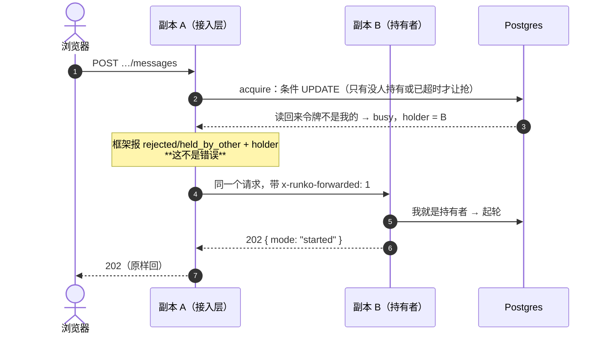
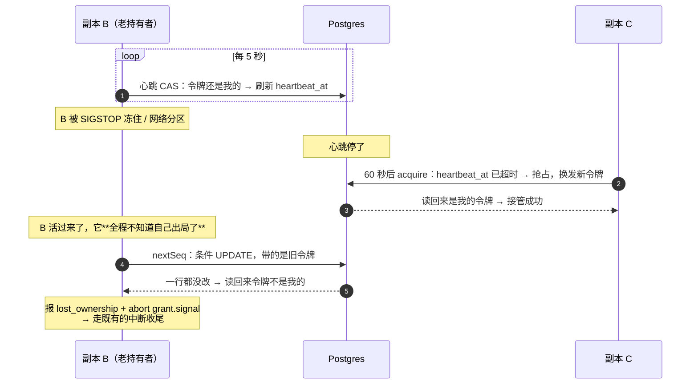
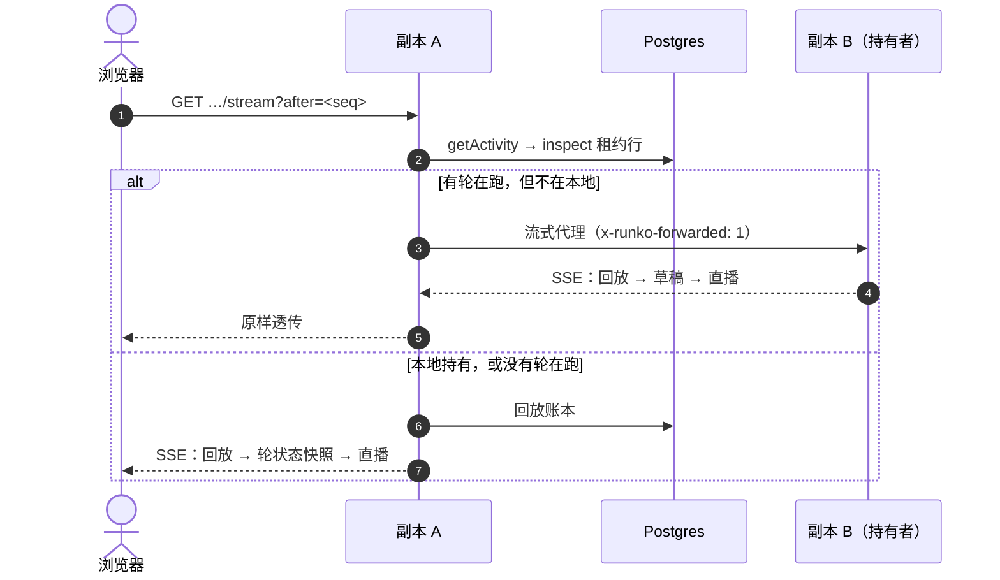
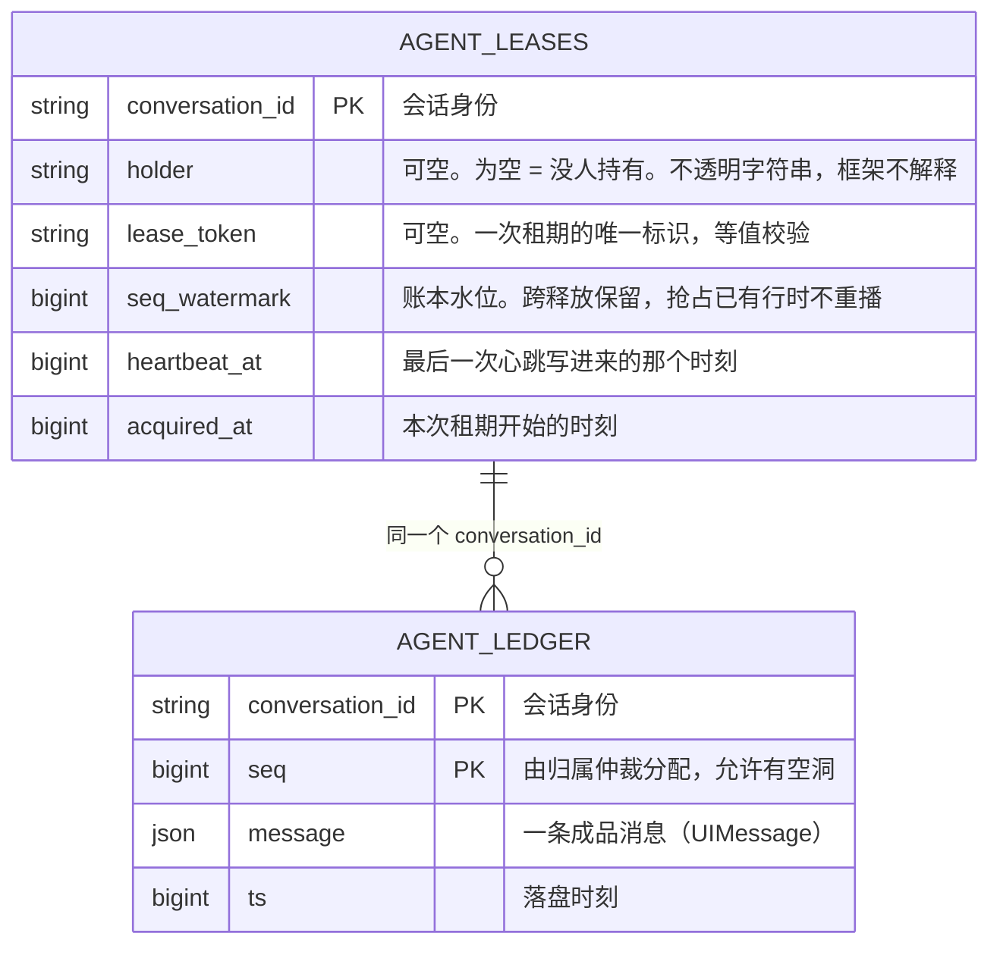

# 多副本部署（Node 长驻）— 技术方案

> 相关：[施工计划](../plans/multi-replica.md) · [Node 长驻 · 功能](../features/deployment.md) · [Node 长驻 · 技术方案](./deployment.md)（四档形态的横向对照，本文不复述）。
> 展开：[归属仲裁机制](../../../logic/arbitration/tech/arbitration-impl.md) · [流分发](../../contract/tech/stream-fanout.md) · [持久化](../../contract/tech/persistence.md)。
>
> **状态：设计定稿待施工。** 本文把 [Node 长驻 · 技术方案 §2](./deployment.md) 那张表里的
> **③ k8s 多副本**从「设计上成立」推到「可交付、可验收」。租约版[归属仲裁机制](../../../terms.md)
> 已于 2026-09-01 落地（见[施工计划](../../../logic/arbitration/plans/arbitration-impl.md) L0–L6），
> 本文只讲**剩下的四个缺口**和它们的合围方式。

## 1. 一句话

**同一份对话的所有请求，最终都要落到持有[归属](../../../terms.md)的那个副本上**——写入靠[租约](../../../terms.md)挡住走岔的，请求靠[应用层转发](../../../terms.md)送到对的地方。

## 2. 这一档要成立，需要四件事同时成立

多副本不是一个开关，是四件事各自到位：

| # | 要成立的事 | 靠什么 | 现状 |
|---|---|---|---|
| 1 | 同一时刻只有一个副本在推进这份对话 | 租约版归属仲裁机制 | ✅ Kysely 三方言已交付，**薄壳与 Mongo 还没出口** |
| 2 | 被误判出局的老持有者写不进账本 | [租期标识](../../../terms.md) + 每次取号 CAS | ✅ 已交付并有一致性套件钉住 |
| 3 | 请求打到哪个副本都能被送到持有者手上 | 接入层转发（框架给 `holder`） | ❌ **框架给的信息不够，示范也没有** |
| 4 | 正在看的人能看到正在产生的内容 | 转发[直播流](../../../terms.md)（不外挂广播） | ❌ **`subscribe` 现在给的是本地答案** |

第 1、2 件是**框架的保证**，第 3、4 件是**接入层的活儿**，但框架得先把接入层需要的信息给全。
本文的四个缺口就是按这个顺序排的。

## 3. 现状盘点：先看清哪些已经有了

**这一节最要紧**——租约版仲裁已经跑起来了，别照着旧文档重做一遍。

| 件 | 现状 | 位置 |
|---|---|---|
| `Arbitration` 接口与 `Grant` | ✅ 已定稿 | `packages/agent/src/arbitration.ts` |
| 租约表 `agent_leases`（四档 DDL） | ✅ 已交付 | `packages/persist-kysely/src/schema.ts` · `migrate.ts` |
| `leaseArbitration()`：抢占 / 心跳 / 自我围栏 / 取号 CAS / `listStale` | ✅ 已交付 | `packages/persist-kysely/src/arbitration.ts` |
| 仲裁一致性套件（18 条，含三条多节点与接管） | ✅ 已交付 | `packages/conformance/src/arbitration.ts` |
| 真 Postgres / 真 MySQL 上跑绿 | ✅ 已交付 | CI 的 service container |
| 轮编排对「失去独占权」的处置 | ✅ 已交付且有用例 | `packages/agent/src/runtime/turn.ts` |
| `getActivity()` 会回退到 `arbitration.inspect()` | ✅ 已交付 | `packages/agent/src/runtime.ts` |
| **三个薄壳的仲裁出口** | ❌ 没有 | `persist-sqlite` / `-postgres` / `-mysql` |
| **Mongo 版仲裁** | ❌ 没有 | `persist-mongo` |
| **`enqueue` 被拒时的结构化 `holder`** | ❌ 只有一句英文文案 | `packages/agent/src/types.ts` |
| **`subscribe` 的[轮状态快照](../../../terms.md)** | ❌ 只看本地 | `packages/agent/src/runtime.ts` |
| **接入层转发的示范** | ❌ 没有 | `apps/persist-demo` |
| **两个真进程的端到端** | ❌ 没有 | 同上 |

## 4. 缺口一：四个持久化包里只有一个能拿到租约版仲裁

`leaseArbitration()` 只从 `@runko/persist-kysely` 导出。它吃两样东西：一个 Kysely 实例，和一个
`flavor`。而三个薄壳（`persist-sqlite` / `-postgres` / `-mysql`）的存在理由正是**替你把这两样
装配好**——它们现在只装配了持久化那一半：

```ts
// 现在：装了包也拿不到租约版仲裁，还得自己装一遍 Kysely
import { sqlitePersistence } from "@runko/persist-sqlite";
import { leaseArbitration } from "@runko/persist-kysely";   // ← 还得再装一个包
import { Kysely, SqliteDialect } from "kysely";             // ← 还得自己拼 Kysely
```

### 4.1 三个薄壳各加一个出口

每个薄壳加一个与它的 `*Persistence()` 对称的函数，入参是**同一个驱动实例**：

```ts
export function sqliteArbitration(
  database: SqliteDatabase,
  opts: Omit<LeaseArbitrationOptions, "flavor">,   // holder / heartbeatMs / takeoverMs / now
): Arbitration {
  return leaseArbitration(toKysely(database), { ...opts, flavor: "sqlite" });
}
```

`postgresArbitration(pool, opts)` / `mysqlArbitration(pool, opts)` 同形。三处都只是**填掉
`flavor`**，没有第二种逻辑。

**一个副作用要写进注释**：`sqlitePersistence(db)` 和 `sqliteArbitration(db)` 会各建一个
Kysely 实例。Kysely 是查询构建器、不自己持连接（连接池是你给的那个驱动），所以两个实例
共用同一个池，不多占资源；但**建表只能建一次**——`migrate()` 仍然只调一次，它已经把
`agent_leases` 一起建了。

### 4.2 Mongo 版：不是薄壳，要重写一份

`@runko/persist-mongo` 底下没有 Kysely（Kysely 是 SQL 查询构建器），所以它得直接实现
`Arbitration`。好消息是 **Mongo 在这件事上比 SQL 顺手**：

| 动作 | SQL 版怎么做 | Mongo 版怎么做 |
|---|---|---|
| 抢占 | 条件 UPDATE → **再读回来比对令牌** | `findOneAndUpdate(..., { returnDocument: "after" })`，一次往返 |
| 取号 | 条件 UPDATE（`seq_watermark + 1`）→ **再读回来** | `findOneAndUpdate({ $inc })`，返回的就是新值 |
| 释放 | 条件 UPDATE | `updateOne` |

「读回来比对」在 SQL 版是**为了绕开 MySQL**：它把「匹配到了但值没变」也报成 0 行，跟
「没匹配到」分不开。Mongo 的 `findOneAndUpdate` 直接返回更新后的文档（没匹配就是 `null`），
这一步天然不需要。

文档形状与 SQL 表一一对应，`_id` 就是会话 id：

```js
// 集合 agent_leases
{
  _id: "conv_abc",           // = conversationId
  holder: "http://10.1.2.3:3910",   // 可空：为空 = 没人持有
  lease_token: "9f1c…",             // 可空：一次租期的唯一标识
  seq_watermark: 42,                // 账本水位，跨释放保留
  heartbeat_at: 1757400000000,
  acquired_at:  1757399000000,
}
```

抢占仍走**四步**，与 SQL 版同形（下面 §7.1 的图是同一条路）：

1. 读一次：有人持有且心跳没超时 → 直接报 `busy`，**不调 `seedSeq()`**（契约要求它惰性）；
2. 行不存在 → `insertOne` 播种水位，**撞了 `E11000` 不算错**（另一个副本同时在插）；
3. `findOneAndUpdate` 决胜负：filter 是 `{ _id, $or: [{ lease_token: null }, { heartbeat_at: { $lt: at - takeoverMs } }] }`；
4. 返回 `null` = 没抢到，带上当前 `holder` 报 `busy`。

> **别把第 2、3 步合成一次 upsert。** Mongo 的 upsert 只从 filter 里的**等值**子句推导要插入
> 的文档，`$or` 那一段推不出来；行已存在且被别人持有时，它会试着插一条同 `_id` 的新文档，
> 撞 `E11000`。能用 catch 兜住，但那是把正常路径写成异常路径——`seedSeq()` 的惰性也保不住了。

### 4.3 心跳与自我围栏：**刻意复制一份，不抽包**

`Grant` 上那段心跳（定时 CAS + 连续失败到逼近阈值就自己停手）与存储无关，两份实现会一模一样。
仍然选择**复制到 `persist-mongo`**，理由三条：

- 抽成公共包要么新开一个包（为 60 行代码开包不划算），要么把「租约」「租期标识」这套词放进
  `@runko/agent` 的公开 API——而那个包的仲裁接口**刻意一个 token 字段都没有**（[技术方案 §2](../../../logic/arbitration/tech/arbitration-impl.md)的约束一）；
- `persist-mongo` 依赖 `persist-kysely` 只为拿这段 helper，会毁掉「它不是薄壳」这个定位，还得把
  Kysely 拖进 Mongo 用户的依赖树；
- **漂移有东西挡**：仲裁一致性套件里「心跳自己发现被接管」「被误判的老持有者取号一律被拒」
  两条会同时钉住两份实现，改坏一份当场红。

本仓已有同款先例：`@runko/agent` 自己写了一份与 sdk 同款的文件工具默认装配。**两处都要写明
「这是刻意的重复，改一处必须同步另一处」。**

## 5. 缺口二：接入层想转发，但框架没把话说全

框架的分工是**「我告诉你归属在谁手上，转发你自己写」**。这条没问题，问题是现在告诉得不够。

### 5.1 起轮被拒时，`holder` 只活在一句英文文案里

```ts
// packages/agent/src/types.ts
export type EnqueueResult =
  | { mode: "started" }
  | { mode: "queued"; queued: QueuedInput; queue: QueuedInput[] }
  | { mode: "steered" }
  | { mode: "rejected"; reason: EnqueueRejection; message: string };   // ← 没有 holder
```

`reason: "held_by_other"` 的 `message` 是
`` `This conversation is owned by ${holder}; forward the request there.` ``——接入层要转发，只能
去字符串里抠。**加一个可选字段**即可：

```ts
| { mode: "rejected"; reason: EnqueueRejection; message: string; holder?: string }
```

只在 `held_by_other` 时有值，其余四种拒绝原因照旧。向后兼容，接入层不改也能编译。

### 5.2 `subscribe` 的轮状态快照给的是**本地**答案

这是本文四个缺口里唯一一处**真错**，而不只是缺东西。`subscribe` 第 ③ 步：

```ts
const turn = registry.get(conversationId);   // ← 只看本进程的登记表
const active = turn !== undefined;
const holder = turn?.grant.holder;
…
yield { kind: "activity", active, ...(holder !== undefined ? { holder } : {}) };
if (!active && follow === "turn") { return; }
```

多副本下，副本 A 上的订阅者去看一份正跑在副本 B 上的对话，拿到的是
`{ active: false }`——**服务端权威答案说「没有轮在跑」，而实际上有**。接入层因此既不知道
该转发、也没法告诉用户「这一轮在别的节点上」。

同一个文件里 `getActivity()` 已经写对了：本地登记表命中就用它，否则回退到
`arbitration.inspect()`。**`subscribe` 用同一套逻辑即可**：

```ts
// 判据仍用第 ③ 步捕获的那个 turn，控制流一行没变；变的只是这一帧的内容
const remote = localActive ? undefined : await arbitration.inspect(conversationId);
const heldElsewhere =
  remote?.held === true &&
  (registry.lastHolder === undefined || remote.holder !== registry.lastHolder);
const holder = localActive ? turn.grant.holder : heldElsewhere ? remote?.holder : undefined;
yield { kind: "activity", active: localActive || heldElsewhere, ...(holder !== undefined ? { holder } : {}) };
if (!localActive && follow === "turn") { return; }
```

四个要点：

1. **不会新增空隙。** 那个「取草稿 + 清缓冲」的同步临界区在第 ③ 步，`inspect()` 落在第 ④ 步——
   那里本来就有一次 `await persistence.queue.list(…)`。
2. **单进程零影响。** 本地登记表命中，`inspect()` 一次都不会被调到。
3. **`Frame` 类型不变**，只是 `active` / `holder` 从「本进程知道的」变成「权威的」。
4. **必须把「我自己那一轮正在收尾」排除掉。** 收尾的顺序是**先删登记表、再释放归属**，
   中间那一小段两边都查得到「有人持有」却没有任何东西在跑。照搬 `inspect()` 的答案会让
   最后一帧说「还在跑」然后流立刻断掉——那正是客户端用来关掉转圈动画的那一帧；释放失败时
   这段窗口会一直拖到租约过期。判据是登记表上记着的 `lastHolder`（本进程最近一次持有时
   用的那个字符串）。

### 5.3 哪些端点必须转发，哪些不用

判据只有一条：**这件事的状态在数据库里，还是在持有者的进程内存里。**

| 端点 | 状态在哪 | 要转发吗 |
|---|---|---|
| `POST …/messages`（起轮） | 归属在数据库，**但起轮要在持有者那儿发生** | ✅ `held_by_other` 时转 |
| `POST …/abort`（[停止](../../../terms.md)） | 持有者的 `AbortController` | ✅ **必须** |
| `POST …/approvals/:callId`（[人在回路](../../../terms.md)审批） | 持有者内存里那个正在 `await` 的 promise | ✅ **必须** |
| `POST …/questions/:callId`（回答 `ask-user`） | 同上 | ✅ **必须** |
| `GET …/stream`（SSE） | [进行中草稿](../../../terms.md)在持有者内存里 | ✅ 有轮在跑且不在本地时转 |
| `GET …/messages`（[回放](../../../terms.md)[账本](../../../terms.md)） | 数据库 | ❌ |
| `GET / DELETE …/queue`（[待发队列](../../../terms.md)） | 数据库 | ❌ |
| `POST …/messages`（排队 / 队列已满） | 数据库 | ❌ 任何副本都能入队 |

> **审批与提问这两条最容易漏。** 人在回路桥（`HumanBridge`）把待裁决项挂在**那一轮的
> `ActiveTurn` 对象**上，不是数据库里。裁决打到别的副本上会拿到「没有这条待定裁决」，
> 而用户界面显示提交成功。调研过的一套已上线系统正是栽在这条上，他们的复盘原话是
> 「界面显示提交成功，实际没人接」。

### 5.4 转发要防三件事

**① 环路。** 转发出去的请求必须带一个标记（`x-runko-forwarded: 1`）；带着标记进来的请求
**一律不再转发**——归属在这一瞬间又换了人也不行，宁可回 409 让客户端重试。没有这条，
两个副本互相认为对方是持有者时会打成死循环。

**② 把用户凭据原样转出去。** 副本之间是内部调用，用一个共享的内部令牌鉴权，用户身份用
不透明的会话 id 带过去。

**③ SSE 转发变成缓冲。** 代理 `GET …/stream` 必须**流式**转发，中间任何一层把响应体读完
再吐都会让直播变成「一轮跑完才出现」。

## 6. 缺口三：流分发这一档为什么不外挂

[流分发的契约](../../contract/tech/stream-fanout.md)状态是「接口未定稿」，那是本档目前唯一还挂着
的框架级未决项。**本档把它定稿为现在这两个方法，并把游标制留给外挂广播那条腿。**

```ts
export interface StreamFanout {
  publish(conversationId: string, frame: Frame): void;
  subscribe(conversationId: string, listener: (frame: Frame) => void): () => void;
}
```

推导只有一步：**这一档总能知道持有者在哪**（`holder` 里存的是 pod 的可达地址），所以
「订阅方与产出方不在一处」用转发就解决了，不需要把内容广播出去。既然不广播，就不需要
「从某个位置续读」，也就不需要游标和保留窗口——那两样是 Redis Streams 那条腿的东西。

| 形态 | 流分发怎么办 | 要装包吗 |
|---|---|---|
| ⓪ 本机 CLI · ① 同机 cluster | 内置 + 转发（同机 IPC / HTTP） | ❌ |
| ② Docker · **③ k8s 多副本** | **内置 + 转发**（`holder` 是可达地址） | ❌ |
| ④a Cloudflare DO | 平台自带 | ❌ |
| ④b Vercel | `@runko/stream-redis` | ✅ 但**不在本档** |

**④b 是唯一绕不过去的一档**——它的实例由平台调度，你没有办法找到持有者。那条腿连同游标制
留给 [Vercel 那一档](../../vercel/tech/deployment.md)，本计划把它列为非目标（见 §10）。

> 这个取舍有外部佐证：调研过的一套已上线系统**删掉了原有的 Redis 事件中继**，改成
> 「同一份对话恒定落在同一个节点 + 节点间 HTTP 兜底」。他们的理由与这里同源：一旦请求
> 能被送到持有者，广播就是多余的一层。

## 7. 关键流程

### 7.1 起轮：请求落到非持有副本



### 7.2 接管，以及被误判的老持有者

这条是整个功能**唯一真正要证明的东西**，其余都是它的推论。



**两道闸各管一头，缺一不可**：令牌管「不写坏」（它只会拒绝），心跳管「卡住的能被接管」。
只有令牌没有心跳 = 崩溃的对话永久卡死；只有心跳没有令牌 = 误判时两个持有者都能写。

还有一道自我围栏：B 连续心跳失败到逼近接管阈值时**自己主动停手**。账本有令牌挡着不会写坏，
但**沙盒挡不住**——两个执行同时改同一个[工作区](../../../terms.md)就是互相踩文件。

### 7.3 订阅：路由由权威轮状态决定



**有一条竞态自愈路径要认下来**：A 判定「没有轮在跑」之后、B 才起轮，此时 A 那条流收不到任何
内容。它不会挂住——`follow: "turn"` 在没有活跃轮时立刻收线，客户端重连时重新走一遍路由就
落到 B 上了。代价是**一次重连的延迟**，不是丢内容（账本回放会补齐）。

## 8. 数据模型

多副本只多一张表，就是租约表。它与账本共用 `conversation_id`，**水位放在租约行上**——这样
「取号」和「校验我还持有」是同一条 UPDATE，不需要两次往返，也不可能出现「校验通过但取号用
的是别人的水位」。



三条不变式：

- **释放不删行**，只把 `holder` / `lease_token` 置空——`seq_watermark` 要跨释放保留，否则下一轮
  会从账本水位重新起，撞上已经发出去但还没落盘的号；
- **抢占已有行时不重播水位**，那会让 seq 倒退；
- **`clearStale` 必须带上与 `listStale` 同一条陈旧判据**，不能只按会话清——否则会擦掉一个
  活着的持有者的租约（多副本同时开机扫描时真会撞上）。

## 9. 取舍与已知限制

- **独占是尽力保证，不是真保证。** 你没法知道远处那个副本是死了还是只是联系不上，所以一定
  存在误判窗口；本方案只保证**误判时被拦住**（[归属仲裁机制 §4.3](../../../logic/arbitration/tech/arbitration-impl.md)）。
- **崩溃后的接管延迟是 60 秒**，界面上那一轮会转圈转满一分钟。想让用户早点知道，应该在接入层
  提示「这一轮所在的副本失联了，正在等待接管」，**而不是把阈值调小**。
- **租约不是免费的。** 一个活跃对话一条 UPDATE / 5 秒；账本每写一条消息多一次取号 CAS。
  1000 个并发对话约 200 QPS。
- **依赖各副本时钟大致同步**（自我围栏是按本地时钟算余量的）。时钟不可信的部署应该把接管
  阈值调大，**不要**把围栏余量调小。
- **`recover()` 的注释对多副本不成立。** 它说「启动时不可能有活跃轮，所以没有竞态」——单进程
  对，多副本不对（滚动重启时两个副本会同时开机扫到同一条陈旧记录）。真实的防护是
  `clearStale` 带判据，注释要跟着改。
- **崩溃仍然不恢复。** 副本被强杀走老路（补一条「已停止」标记），因为它没停在干净边界上。
- **[挂起](../../../terms.md)还没做。** 等人时仍然占着归属与沙盒，多副本只是让「等着的是哪个
  副本」变得确定，不改变这件事本身。

## 10. 非目标

- **`@runko/stream-redis`**（外挂广播）。理由见 §6：这一档转发够用。它属于 Vercel 那条线。
- **`@runko/durable-object`**。另一档宿主，另一条线。
- **改造 chat 应用（`@runko-chat/node-server`）跑多副本。** 它是单进程 + SQLite，`held_by_other`
  这条路走不到（代码里那行 500 的注释已经写明了）。多副本的示范放在
  `@runko-demo/persist-demo`——它本来就支持 Postgres / MySQL / Mongo。
- **依赖基础设施提供 sticky routing。** 亲和的单位是「一次排空」，不是一轮、也不是会话永久
  绑定，用现成的 sticky 会话反而绑得太死。
- **跨会话的资源冲突。** 独占按会话保证，不按目录、不按机器。

## 附录 A：为什么这一档选转发，不选广播

流分发要解决「订阅的人连在 A，干活的在 B」，两条路：

| 路 | 要什么 | 代价 |
|---|---|---|
| **把订阅者转到持有者那边** | 持有者可寻址 | 接入层要写转发；多一跳 |
| 把内容广播出去 | 一个外部件（Redis Streams） | 多一份运维；内容要定保留窗口；与账本的职责边界要重新划 |

k8s 里 pod 是直接可寻址的（pod IP 或 service 地址），`holder` 里存的就是它，所以第一条路成立。
选它还有两个附带好处：

1. **审批、提问、停止这三条本来就必须转发**（§5.3：它们的状态在持有者的进程内存里，广播救不了）。
   既然转发这套已经要写，直播再走同一条路是零边际成本；广播则是在转发之外**再加**一套。
2. **不用回答「流里的内容保留多久」。** 一旦广播，就得定保留窗口、定超窗之后怎么回落到账本
   回放——那是一整块新的一致性设计，而账本本来已经是历史的唯一事实来源。

## 附录 B：这次要顺手修的文档漂移

施工时一并处理，都不影响主线（拆单见[施工计划](../plans/multi-replica.md) M8）：

| 位置 | 现状 | 应为 |
|---|---|---|
| `host/node/tech/deployment.md` front matter | `packages` 写的是 `@runko/persist-sql` / `-drizzle` / `-prisma` | 这三个包不存在，实际是 `persist-kysely` / `-sqlite` / `-postgres` / `-mysql` / `-mongo` |
| 同上 §4 正文 | 「`@runko/persist-sql` 是裸驱动实现……另外两条腿 `persist-drizzle` / `persist-prisma`」 | 同上 |
| 同上 §3.1 时序图 | 用「影响 1 行 / 影响 0 行」表达 CAS 成败 | 实现**刻意不看影响行数**（MySQL 分不清「匹配到但没变」与「没匹配到」），判据是读回来比对令牌 |
| `packages/persist-kysely/src/index.ts` 文件头 | 「这一版只出持久化，不含租约版归属仲裁——那是下一批」 | 已经出了，本文件就导出着 `leaseArbitration` |
| `packages/persist-mongo/src/index.ts` 文件头 | 同款「那是下一批」 | 本计划 M2 交付后要更新 |
| `packages/agent/README.md` 「还没做的」 | 「租约版归属仲裁：多进程共享 DB」 | 已交付；剩的是薄壳出口与 Mongo 版 |
| `logic/arbitration/plans/arbitration-impl.md` §1 | 「租约版实现 ❌ 不存在」 | 那是立项时的盘点，§3 的阶段表才是当前事实。**加一行说明它是历史快照** |
