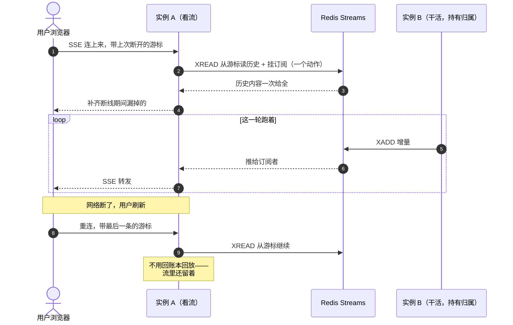

# Vercel（宿主层）— 技术方案

> 相关：[功能](../features/deployment.md)。
> 跨环境的那份接口在[契约](../../contract/tech/sandbox.md)（逐接口映射表在那边，本文只讲这一档的落地与坑）。

## 1. 一句话

**四样能力全外挂，起因只有一条：实例由平台调度，没有办法找到持有者。**

## 2. 跟 Cloudflare 的运行模型对照

这两档都是「平台托管」，但差别大到解法完全不同：

| 我们在乎的 | Vercel Functions（Fluid） | Cloudflare Durable Object |
|---|---|---|
| 会话能固定到一个实例吗 | ❌ 实例由平台调度 | ✅ 天生的——`conversationId` 就是 DO 的 id |
| 怎么找到那个实例 | **没有办法** | `stub` 本身就是通道 |
| 并发模型 | 一个实例同时处理多个请求 | **串行**处理 |
| 还需要归属仲裁吗 | ✅ 需要（租约版） | ❌ 平台已保证 |
| 没请求时 | 实例被挂起，**无自唤醒** | 休眠/被驱逐（存储保留），**能被 alarm 唤醒** |
| 单次执行时长上限 | **800 秒 GA / 30 分钟 beta** | 无硬上限（CPU 时间另计） |
| 状态放哪 | 外部——自己接 DB | 自带 SQLite（`ctx.storage.sql`） |

**「没有办法找到实例」这一条决定了流分发必须外挂**，其余三样只是「跟 Node 多副本一样」。

## 3. 流分发：为什么必须是 Redis Streams

### 3.1 为什么是这一档独有

流分发有两种解法——广播出去，或者把订阅者转到持有者那边（[应用层转发](../../../terms.md)）。四档里只有这一档用不了第二种：

| 形态 | 实现 | 为什么 |
|---|---|---|
| ⓪ 本机 · ① cluster | 内置 EventEmitter + 应用层转发 | 同机，转发得到 |
| ②③ Docker / k8s | 内置 + 应用层转发 | `holder` 存的是 pod 可达地址，转发得到 |
| ④a Cloudflare DO | 平台自带 | 一个会话 = 一个 DO，订阅方直连那个实例 |
| **④b Vercel** | **`@nimbo/stream-redis`** | **实例由平台调度，没有办法找到持有者** |

### 3.2 为什么是 Streams 不是裸 pub/sub

**断线续传要求「拿历史快照 + 挂订阅」是一个动作。** Redis Streams 天生就是「可重放的日志 + 订阅」，裸 pub/sub 只推不存历史——订阅者接上的那一刻之前的内容全丢了，没法续传。

**流分发不保证送达**：没人订阅时内容照样进[账本](../../../terms.md)，流只服务「正在看的人」。掉了就掉了，靠账本回放补。**鉴权也不归它管**——谁能订阅哪个会话是[接入](../../../terms.md)的事。

## 4. 单轮时长：这一档的硬边界

[挂起点只有一个](../../../architecture/tech/agent-kernel.md)——正在等人。那是唯一的干净边界：没有命令在跑、模型没在流式输出、沙盒也没在动。

命令跑到一半切不了，因为**不知道它跑完没有**。所以「一轮本身超过函数时长上限」这件事绕不过去，加任何组件都解决不了。

**这也是为什么 nimbo 不是 durable execution**（任意点可暂停），只是「在一个特定的干净边界上允许断开」——工程量因此有界，代价就是这一条限制。

## 5. 沙盒适配的三个实测裁量

> 三家的逐接口映射表在[沙盒契约 §5](../../contract/tech/sandbox.md)，这里只记 Vercel 独有的坑。

- **`fs.rm` 承担不了「非递归删非空目录要拒绝」的语义。** 实测 `node:fs/promises` 的 `fs.rm(path)`（`recursive` 缺省）对**任何**目录都抛 `ERR_FS_EISDIR`，不区分空还是非空。真正带「空则成功、非空则 `ENOTEMPTY`」语义的是 `fs.rmdir()`。所以非递归删除按目标类型分流——文件走 `fs.rm`、目录走 `fs.rmdir`，代价是多一次 `stat`。
- **原生 `timeoutMs` 只作兜底，本地竞速才是权威。** `@vercel/sandbox@2.5.0` 已经有原生 `timeoutMs`，但适配器仍以本地 `AbortController` 竞速作为 124/130 契约的**唯一权威**——不信任底层 SDK 自报的退出码和计时（跟 mini-bash 的 `raceAbort` 先例一致）。原生 `timeoutMs` 的作用是「我们提前 resolve 之后，沙盒侧仍会 SIGKILL 掉后台残留进程」。
- **readdir 不逐条 stat。** 本地磁盘的 `DirFS` 会给每个条目额外 stat 拿 size/mtime；远程沙盒上那是 N 次网络往返。审计过消费方后确认 readdir 结果的 size/mtime 无人读取（`FileStat.mtime` 的唯一消费点是单独的 `stat()` 调用），只有 `mimeType`（按扩展名推断的纯函数，零往返）有用——所以 readdir 条目只填 name/type/mimeType。

## 6. 取舍与已知限制

- **单轮超时绕不过去**（§4）。要跑长任务换 [Node 长驻](../../node/tech/deployment.md)或 [Cloudflare](../../cloudflare/tech/deployment.md)。
- **必须自己养一个 Redis**，这是这一档的固有运维成本。
- **不做内存等待窗口。** 另外几档等人时先在内存里等一段（默认沿用[审批保活预算](../../../terms.md) 5 分钟）再挂起；这一档实例随时可能被回收，内存里等没意义，一律立刻挂起。
- **共享文件用相对路径。** Vercel 的沙盒根是 `/vercel/sandbox`，bash 里带前导 `/` 的绝对路径落真实根而非工作区——这是「真实 FS + root 锚定」的固有语义，三家都一样。
