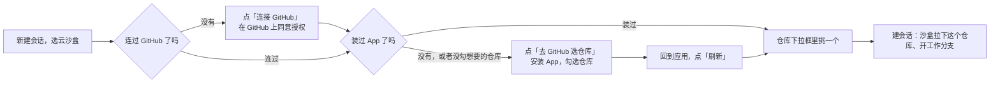

# 按用户授权加载 GitHub 仓库 — 功能手册

> 术语见 [术语表](../../terms.md)。怎么做见[技术方案](../tech/github-repo-access.md)；拆单与进度见[施工](../plans/github-repo-access.md)。

## 一句话

用户用 GitHub 登录、把 runko 的 GitHub App 装到自己的仓库上之后，新建会话时可以从**自己授权过的仓库**里挑一个，拉进云沙盒里让 agent 改，改完推到一个工作分支。

## 1. 要解决的问题

在这之前，云沙盒（E2B、Vercel）拉的都是服务端 `.env` 里写死的**同一个仓库**（`GITHUB_REPO`），用的是**同一把长期令牌**（`GITHUB_PAT`）：

- **所有用户只能改同一个仓库**，谁也选不了自己的。
- **那把令牌权限很大、永不过期**。而沙盒里的 agent 能跑任意命令，令牌就放在它手边——泄露一次，令牌能碰到的所有仓库都暴露。

## 2. 用户看得到什么

### 2.1 第一次：连接 GitHub、选仓库

1. 在「新建会话」弹窗里选一档云沙盒（E2B 或 Vercel），弹窗里多出**仓库**这一栏。
2. 还没连过 GitHub：这一栏显示「连接 GitHub」按钮。点了跳去 GitHub 同意授权，回来就连上了。用 GitHub 登录的用户已经连过，没有这一步。
3. 还没装 App，或者装了但没勾想要的仓库：显示「去 GitHub 选仓库」。它在新标签页打开 GitHub 的安装页，用户在那里勾选仓库；回到应用点「刷新」。
4. 下拉框里列出**用户勾过的全部仓库**（个人的、组织的都在，组织的要组织管理员装过 App）。挑一个，建会话。

### 2.2 之后：每个会话一个仓库

- 会话标题下面照旧显示仓库和工作分支（`runko/…`）。
- agent 在沙盒里改代码、提交，用户要求推送时推到这条工作分支，**不会碰默认分支**。
- 同一个用户可以开很多会话，每个会话选不同的仓库。

### 2.3 用户随时能收回

- 在 GitHub 上把某个仓库从 App 的授权里去掉，或者卸载 App：这之后**已有会话再开新一轮会失败**，提示「没有权限访问这个仓库了」；下拉框里也不再列出它。
- 已经推上去的工作分支还在，那是用户自己仓库里的东西。

### 2.4 本地沙盒不变

[本地沙盒](../../terms.md)没有 git、不联网，这一期**不能**加载仓库：选本地沙盒时弹窗里没有仓库这一栏，零配置照样能跑。

## 3. 部署的人要做什么

要让用户能选仓库，服务端得先注册一个 GitHub App（一次性，[技术方案 §8](../tech/github-repo-access.md) 有逐项说明）：

| 在 GitHub 上填 | 值 |
|---|---|
| 权限 | 仓库的 **Contents：Read and write**（拉取、推送），**Metadata：Read-only**（GitHub 强制要求）。别的都不要 |
| Callback URL（登录用） | `<服务端地址>/api/auth/callback/github` |
| Setup URL（装完跳回来） | `<前端地址>/chat` |

然后把 App 的几个值填进 `.env`：`GITHUB_APP_ID`、`GITHUB_APP_SLUG`、`GITHUB_APP_PRIVATE_KEY`，以及这个 App 的 `GITHUB_CLIENT_ID`、`GITHUB_CLIENT_SECRET`（登录与连接 GitHub 用同一对）。

**没配 GitHub App 时，云沙盒这两档不出现**：新建会话只能选本地沙盒。以前的 `GITHUB_REPO`、`GITHUB_PAT` 已经删掉，不再读。

## 4. 范围

**做：**

- 连接 GitHub（沿用登录用的 GitHub 账号；用邮箱注册的用户可以另外连一个）。
- 列出用户通过 GitHub App 授权过的仓库，建会话时选一个。
- 沙盒拿到的令牌只对这一个仓库有效、1 小时过期；每一轮开始时检查，快过期就换一把新的。
- agent 能拉取、提交、推送到工作分支。

**不做（非目标）：**

- **不开 Pull Request**：令牌不带 PR 权限。要开 PR，用户在 GitHub 上用推上去的工作分支自己开。
- **本地沙盒不加载仓库**（它没有 git、不联网）。
- **不改已有会话的仓库**：一个会话建好之后仓库就定了，要换仓库就新建会话。
- **不支持 GitHub Enterprise Server 的一键配置**：服务端 API 地址可以改（`GITHUB_API_URL`），但克隆地址仍是 github.com。

## 5. 成功标准

1. 配好 GitHub App 后，用户连接 GitHub、安装 App、勾两个仓库，新建会话的下拉框里正好是这两个。
2. 选了其中一个建会话，沙盒里是这个仓库，工作分支已切好；agent 推送成功，推到的是工作分支。
3. 沙盒里的令牌对别的仓库无效，对这个仓库 1 小时后失效；一轮跑到新的一轮时自动换新，推送不失败。
4. 用户在 GitHub 上收回这个仓库之后，下一轮提示没有权限，而不是悄悄失败。
5. 没配 GitHub App 时，只有本地沙盒可选，零配置不受影响。
