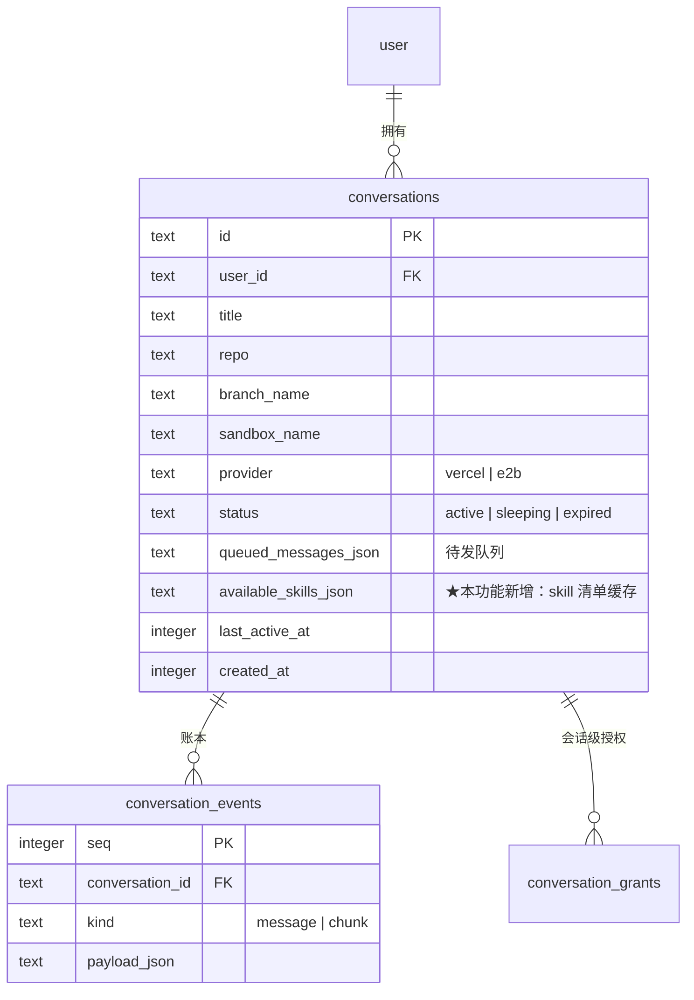
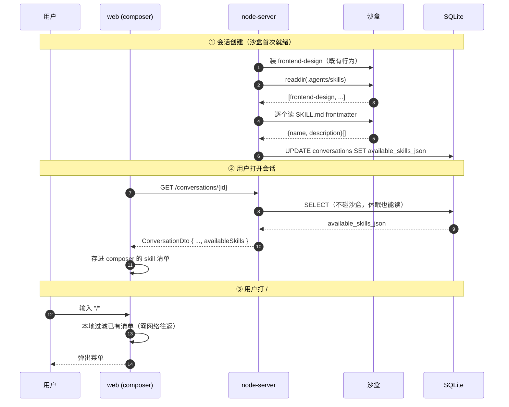
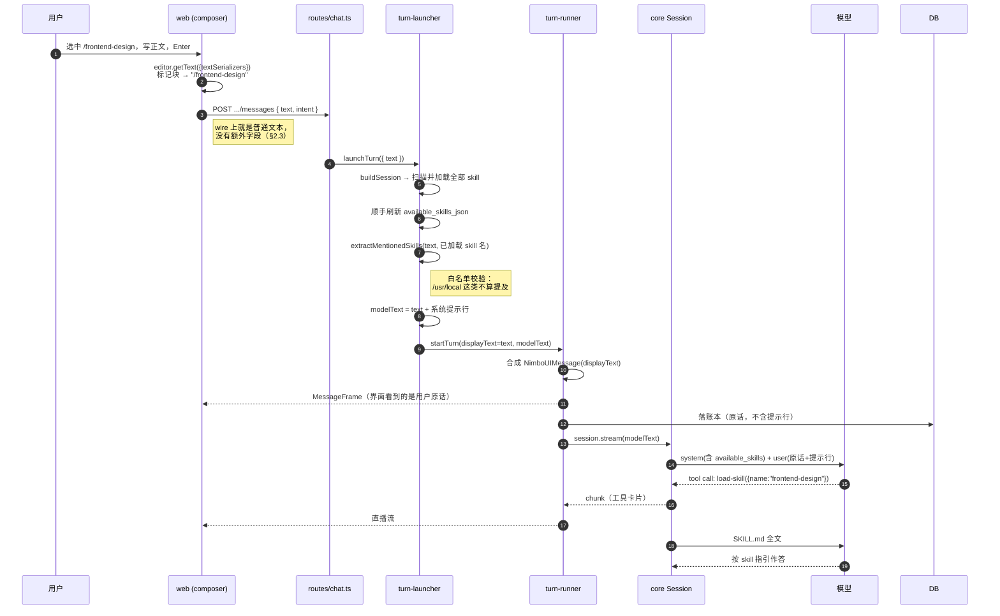

# composer 里手动指定 skill（技术方案）

> 相关：产品文档见 [功能](../features/composer-skill-mention.md)，[施工进展](../plans/composer-skill-mention.md)。
> 依赖/延续：[chat webapp 技术方案](./chat-webapp.md)（§2.2 起轮通路、§4 服务端模块划分、§8 前端）· [核心 SDK](../../logic/engine/tech/core-sdk.md)（§4.1 `Skill.fromFS`、§4.6 skills 注入三件事）· [内置工具](../../logic/engine/tech/builtin-tools.md)（§1.9 `load-skill`）。
> 术语一律引用 [../terms.md](../../terms.md)。

## 1. 方案总览

一句话：**前端换编辑器拿到结构化的[skill 提及](../../terms.md)，服务端把「沙盒里装了哪些 [skill](../../terms.md)」缓存进库供前端列菜单，起轮时把提及翻译成给模型的一句明确指令。**

拆成四块彼此独立的改动：

| # | 改动 | 落点 | 为什么必须有 |
|---|------|------|-------------|
| A | 加载沙盒里**全部** skill（不再只有写死的 `frontend-design`） | `chat-agent.ts` | 前置条件。用户选的 skill 若没进 `agent.skills`，模型调 `load-skill` 必然报 "No skill named ..."。 |
| B | [skill 清单](../../terms.md)扫描 + 落库 + 随会话下发 | `skill-catalog.ts`(新) · `db/schema.ts` · `store.ts` · `schemas/chat.ts` · `routes/chat.ts` | 前端要列菜单。走库缓存而不是现读沙盒，见 §2.1。 |
| C | 起轮时把提及翻译成模型指令 | `turn-launcher.ts` · `turn-runner/drive.ts` | 让「软提示」这条路真的生效，见 §2.2。 |
| D | composer 换成 tiptap + `/` 提及 | `apps/web/.../composer-editor.tsx`(新) · `skill-suggestion-list.tsx`(新) · `message-composer.tsx` | 功能本体。 |

A/B/C 在服务端，D 在前端，**只通过 `ConversationDto.availableSkills` 一个字段耦合**——可以分两条线并行施工。

## 2. 关键取舍

### 2.1 skill 清单走库缓存，不现读沙盒

**问题**：前端要列菜单，清单的事实来源是沙盒里的 `.agents/skills/` 目录。直觉做法是加个 `GET .../skills` 现读。

**否决它的理由**：沙盒会[休眠](../../terms.md)。用户打开一个昨天的会话、只是想打个 `/` 看看有什么可用，现读就得先[唤醒](../../terms.md)沙盒——几秒到几十秒的空等，为了一个下拉菜单，代价完全不成比例。而且这会把「列菜单」变成一个能改变沙盒生命周期的副作用操作。

**选定**：扫描结果 `{name, description}[]` 存进 `conversations.available_skills_json`，前端从**已有的** `GET /conversations/{id}` 顺带拿到，零新增往返、零沙盒依赖。写入时机两处：

- **会话创建**时（沙盒刚装完 `frontend-design`，`sandbox-manager.ts` 的初始化尾部）——保证新会话立刻有清单。
- **每轮[起轮装配](../../terms.md)**时（`buildSession` 本来就要读 skill，顺手把清单更新掉）——保证用户中途装的新 skill 下一轮可见。

代价是清单**最多滞后一轮**（用户这一轮让 agent 装了个 skill，要等这轮结束才出现在菜单里）。这个滞后写进产品文档 §2.4 明说了，可接受。

### 2.2 「软提示」的落地方式：拆开「界面看的」与「模型看的」

本功能选定的路线是**软提示**——不把 SKILL.md 正文硬塞进上下文，仍走 [`load-skill`](../../logic/engine/tech/builtin-tools.md) 的[渐进式披露](../../terms.md)。

但**只把 `/frontend-design` 留在文本里是不够的**：对模型而言那就是一串普通字符，没有任何理由让它去调 `load-skill`。要让这条路真的生效，必须给模型一句明确的话。

**选定**：起轮时把用户原话和发给模型的文本**拆成两份**：

```
displayText（界面/账本）  = "/frontend-design 帮我看看首页排版"
modelText（喂给模型）      = "/frontend-design 帮我看看首页排版\n\n[系统提示] 用户在本条消息中显式指定了 skill：frontend-design。请先调用 load-skill 工具加载它，再按其中的指引完成本次任务。"
```

这个拆分**几乎零成本**，因为 `turn-runner/drive.ts` 的 `driveTurn` 里这两条路本来就是分开的两行，只是眼下共用同一个 `text` 变量：

- `turn-runner/drive.ts` 的 `emit.emitMessage(userMessage)` —— 合成给界面看的 `NimboUIMessage`（落[账本](../../terms.md) + 广播）
- `turn-runner/drive.ts` 的 `session.stream(...)` —— 喂给模型

把 `driveTurn` 的 `text: string` 参数拆成 `displayText` / `modelText` 两个即可，没有任何新机制。

**被否决的两个替代**：

- **前端拼提示行**：提示词的措辞会随模型表现反复调，放前端意味着改一次话术要发一次前端版本，且老标签页还在用旧话术。提示词属于服务端。
- **把提示行也写进账本**：界面上会显示出这段本该隐形的系统话术，很丑；而且它对**后续轮**没有价值（skill 那轮已经加载过了），留在账本里只是持续占 token。

### 2.3 提及在 wire 上是文本标记，不是结构化字段

`POST .../messages` 的 body **不加** `skills: string[]` 字段，提及就以 `/<skill-name>` 的形态待在 `text` 里，服务端起轮时用正则扫出来。

理由是**账本一致性**：如果提及是独立字段，它就没有进账本的位置（账本存的是 `NimboUIMessage`，一条 `text` part），[回放](../../terms.md)时就丢了，界面上那条历史消息会变得跟用户当初打的不一样。留在文本里则[排队](../../terms.md)、[steer 中途插话](../../terms.md)、回放、[压缩](../../terms.md)全部零改动——它就是普通文本，天然跟着走。

代价：服务端要做一次正则匹配 + 白名单校验（只有**确实存在于本会话 skill 清单**的名字才算提及，避免用户正常输入的 `/usr/local` 被误判）。这个校验逻辑做成纯函数，好测。

### 2.4 tiptap 只当「带标记块的纯文本框」用

装 tiptap 是为了拿到**原子节点（atom node）**这个能力——一枚删得干净、选得整体、不会被拆成半截字符的标记块。这是 `<textarea>` 做不到的（textarea 里 `/frontend-design` 就是 17 个可以任意删改的字符）。

**不开放任何富文本格式**：不装 `@tiptap/starter-kit`，只装 `Document` + `Paragraph` + `Text` + `HardBreak` + `Placeholder` + `Mention` 六个扩展。粘贴一律走纯文本。理由是这是个聊天输入框，用户消息最终要变成 `NimboUIMessage` 的一条 `text` part——任何富文本格式都无处可去，做出来只会是骗人的。

## 3. 业务数据领域设计图

本功能对数据模型的改动只有一处：`conversations` 加一个 JSON 列。



`available_skills_json` 的形状是 `SkillSummary[]`：

```ts
interface SkillSummary {
  name: string;        // 目录名，也是 load-skill 的入参
  description: string; // SKILL.md frontmatter 的 description
}
```

**为什么是列而不是子表**：与 `queued_messages_json` 完全同款的判断——与 conversation 天然 1:1、量小（个位数）、永远整体读写覆盖、没有任何按条件查询的需求，不值一张表的代价。读回一律走 zod `safeParse`（不是类型断言），这是 JSON 列的反序列化边界，与 `store.ts` 现有的 `queuedMessagesSchema` 同一姿态。

**为什么是缓存而不是事实来源**：事实来源永远是沙盒里的目录。这一列坏了/空了，最坏结果是菜单空着，`buildSession` 照常自己扫描、agent 照常能用 skill——不影响正确性。

## 4. 核心流程时序图

### 4.1 清单如何到达前端



### 4.2 一条带提及的消息如何生效



## 5. 关键接口与数据结构

### 5.1 服务端新增

```ts
// apps/node-server/src/agent/skill-catalog.ts（新文件）

/** 沙盒里 skill 的安装目录——与 sandbox-manager.ts 的安装脚本同一约定。 */
export const SKILLS_DIR = '/.agents/skills';

export interface SkillSummary {
  name: string;
  description: string;
}

/**
 * 扫描沙盒 `.agents/skills/*`，逐个 `Skill.fromFS` 加载。
 * best-effort：单个目录读失败/缺 SKILL.md/缺 description frontmatter 一律跳过并记日志，
 * 不让一个坏 skill 拖垮整轮——这是每轮起轮的必经路径。
 */
export async function loadSkillsFromWorkspace(
  workspace: NimboFS,
  log: Logger,
): Promise<Skill[]>;

/** `Skill[]` → 可落库的清单。 */
export function toSkillSummaries(skills: readonly Skill[]): SkillSummary[];

/**
 * 从消息文本里扫出被提及的 skill 名。
 * 白名单：只有出现在 `known` 里的名字才算数（避免 /usr/local 这类误判）。
 * 纯函数，无 IO——单测直接覆盖。
 */
export function extractMentionedSkills(
  text: string,
  known: readonly string[],
): string[];

/** 拼出发给模型的文本（提及为空时原样返回，零副作用）。 */
export function buildModelText(text: string, mentioned: readonly string[]): string;
```

`extractMentionedSkills` 的匹配规则（需要单测钉死的边界）：

| 输入 | 已知 skill | 结果 | 说明 |
|------|-----------|------|------|
| `/frontend-design 改下排版` | `[frontend-design]` | `[frontend-design]` | 基本情形 |
| `看 /usr/local 目录` | `[frontend-design]` | `[]` | 不在白名单，不算提及 |
| `/frontend-design /frontend-design` | `[frontend-design]` | `[frontend-design]` | 去重 |
| `x/frontend-design` | `[frontend-design]` | `[]` | 前面粘着字符，不是提及 |
| `/frontend-design-extra` | `[frontend-design]` | `[]` | 不做前缀匹配，要整名 |

### 5.2 wire 契约变化

`ConversationSchema` 加一个字段（`GET /conversations` 列表与 `GET /conversations/{id}` 详情共用，两处都带）：

```ts
export const SkillSummarySchema = z
  .object({ name: z.string(), description: z.string() })
  .openapi('SkillSummary');

// ConversationSchema 内新增：
/** 这个会话当前可选的 skill 清单（docs/ingress/tech/composer-skill-mention.md §2.1）——
 *  库缓存，事实来源是沙盒 `.agents/skills/`，最多滞后一轮。 */
availableSkills: z.array(SkillSummarySchema),
```

`PostChatMessageInputSchema` **不变**（§2.3）。

### 5.3 前端新增

```tsx
// apps/web/src/features/chat/components/composer-editor.tsx（新文件）

export interface ComposerEditorProps {
  value: string;                    // 受控：纯文本形态
  onChange: (text: string) => void;
  onSubmit: (intent: SendIntent) => void;  // Enter / ⌥⏎
  skills: readonly SkillSummary[];
  placeholder: string;
  disabled?: boolean;
}
```

扩展装配（tiptap 3.29.0）：

```ts
extensions: [
  Document, Paragraph, Text, HardBreak,
  Placeholder.configure({ placeholder }),
  Mention.configure({
    // 存进节点的是 skill 名；渲染成文本时补回 `/` 前缀
    renderText: ({ node }) => `/${node.attrs.id}`,
    suggestion: {
      char: '/',
      items: ({ query }) => filterSkills(skills, query),
      render: () => ({ /* ReactRenderer + props.mount()，见 §6.2 */ }),
    },
  }),
]
```

取纯文本用 `editor.getText({ blockSeparator: '\n', textSerializers })`——`textSerializers` 把 mention 节点序列化成 `/<name>`，与 `renderText` 保持同一份实现。

## 6. 实现要点（容易踩的）

### 6.1 键盘优先级：菜单开着时 Enter 归菜单

composer 现有三条键盘语义（`message-composer.tsx` 文件头有完整说明）：Enter = [排队](../../terms.md)、⌥⏎ = [中途插话](../../terms.md)、Shift+Enter = 换行。

tiptap 的 suggestion 插件有自己的 `onKeyDown`，**它先拿到事件**。约定：

- 菜单**开着**：↑↓ 移动、Enter 选中、Esc 关闭，这三个键 suggestion 的 `onKeyDown` 返回 `true` 吃掉，不冒泡到发送逻辑。
- 菜单**关着**：suggestion 不介入，走编辑器的 `addKeyboardShortcuts`（Enter/⌥⏎ 发送、Shift+Enter 走 HardBreak）。

这是回归风险最高的一处——产品文档 §4 成功标准第 5 条专门盯它。

### 6.2 suggestion 弹层定位用 tiptap 3 自带的 `props.mount()`

tiptap 3 的 suggestion 工具**自带托管定位**（`placement` / `offset` 选项 + `props.mount()` 返回 unmount），不再需要 tippy.js 或 floating-ui 这类外部依赖：

```ts
render: () => {
  let component: ReactRenderer;
  let unmount: (() => void) | null = null;
  return {
    onStart: (props) => {
      component = new ReactRenderer(SkillSuggestionList, { props, editor: props.editor });
      unmount = props.mount(component.element);
    },
    onUpdate: (props) => component.updateProps(props),
    onKeyDown: (props) => component.ref?.onKeyDown(props) ?? false,
    onExit: () => { unmount?.(); component.destroy(); },
  };
}
```

少装一个依赖，也少一处版本耦合。

### 6.3 `buildSession` 改动要守住向后兼容

现在是硬读一个路径，改成扫描后要保证：**扫描不到任何 skill 时，行为不比现在差**。具体地，`.agents/skills/` 不存在或为空时返回空数组、`defineAgent` 不带 `skills`——此时 core 不注册 `load-skill`、不注入 `<available_skills>`（[条件内置](../../terms.md)的既有语义），不报错。

现有测试里假 workspace 的 skill 目录形状要跟着调，见施工计划 P1。

### 6.4 受控编辑器的老问题：外部清空

发送成功后 composer 要清空。tiptap 是非受控的（内部维护 ProseMirror 文档），`value` prop 变了不会自动同步。约定：`ComposerEditor` 只在**外部 value 变成空串而编辑器非空**时调 `editor.commands.clearContent()`，其余时候不反向同步——避免每次按键都触发一次文档重建（那会丢光标位置）。

## 7. 风险与已知限制

| 风险 | 影响 | 处置 |
|------|------|------|
| 键盘语义回归（Enter 该发送时被菜单吃掉，或反之） | 高——砸的是最高频操作 | §6.1 明确优先级；施工 P4 必须有覆盖三条路径的组件测试 |
| tiptap 首次引入，前端包体积增加 | 中——约 100KB gzip | 可接受：composer 是核心交互面。若日后成问题，走路由级懒加载 |
| skill 清单滞后一轮 | 低 | 产品文档 §2.4 明说 |
| 每轮多一次沙盒 `readdir` + N 次 `readFile` | 低——但在远端沙盒上是 N+1 次网络往返 | skill 数量是个位数；若日后变多，`buildSession` 已在算耗时（`buildSessionMs`），届时按数据决定要不要缓存 SKILL.md 内容 |
| 用户正常输入的路径被误判为提及 | 低 | §5.1 的白名单 + 边界规则，纯函数单测钉死 |
| 「软提示」模型仍可能不调 `load-skill` | 中 | 本功能选定路线的固有性质，产品文档 §2.3 已对用户明说。若实测生效率不佳，升级到硬注入只需改 `buildModelText` 一处（§2.2 的拆分已经把口子留好） |
