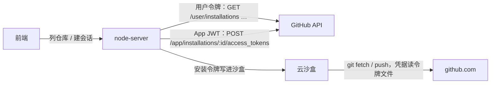
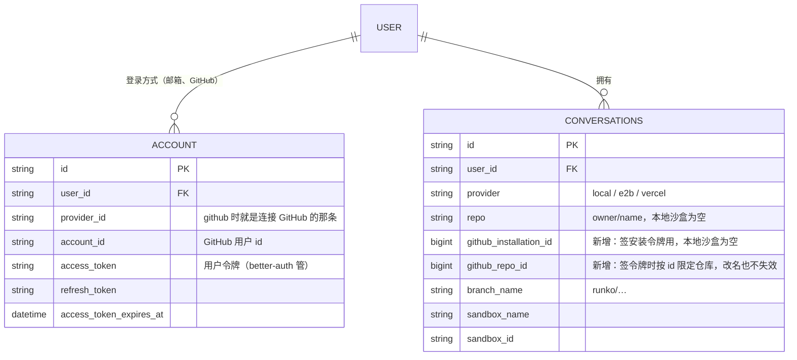
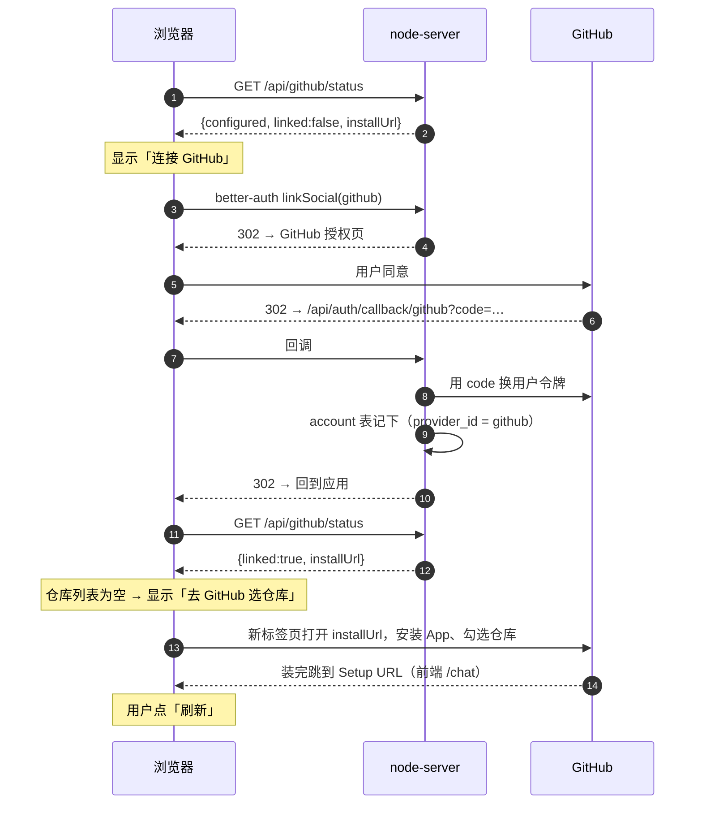
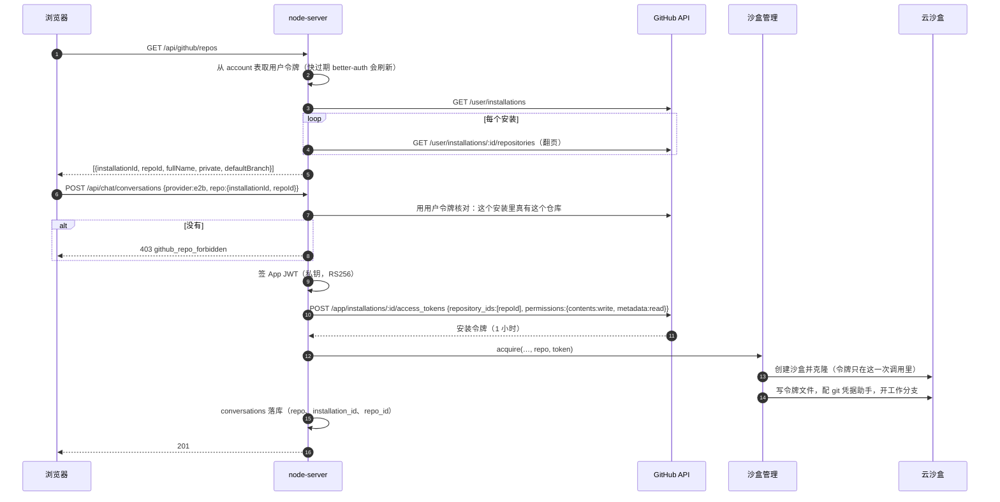
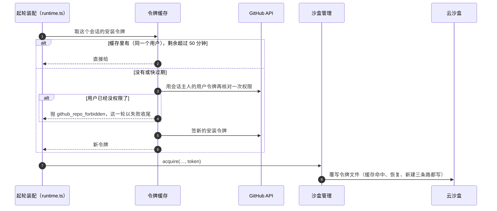

# 按用户授权加载 GitHub 仓库 — 技术方案

> 术语见 [术语表](../../terms.md)。要做什么见[功能手册](../features/github-repo-access.md)；拆单见[施工](../plans/github-repo-access.md)。

## 1. 方案一览

用 **GitHub App**。它有两种身份，两种都要用：

| 身份 | 令牌 | 我们拿它做什么 |
|---|---|---|
| **代表用户**（用户授权） | 用户令牌：用户连接 GitHub 时拿到，better-auth 存在 `account` 表里，过期由 better-auth 自己刷新 | **问 GitHub「这个用户能看到哪些装了 App 的仓库」**：列仓库、建会话时核对 |
| **代表 App 自己** | [安装令牌](../../terms.md)：服务端用 App 私钥签一张 JWT，再拿 JWT 换出来 | **给沙盒拉取、推送**：只对选中的一个仓库有效、只带代码读写、1 小时过期 |

为什么两种都要：安装令牌能碰到这次[安装](../../terms.md)勾过的**全部**仓库，但它不知道「是哪个用户在要」；组织装的 App，组织里每个成员能看到的仓库不一样。所以**先用用户令牌确认这个用户真能看到这个仓库，再签一把只对它有效的安装令牌**。

## 2. 数据模型

新增两列到 `conversations`；用户令牌沿用 better-auth 的 `account` 表，不另建表。

- **安装令牌不落库**。它 1 小时就过期，谁都能随时用私钥再签一把；存下来只会多一样要保护的东西。每个进程在内存里按「**用户** + 安装 + 仓库」缓存，剩余不到 50 分钟就重签。键里必须有用户：同一个仓库两个人都能用时，一个人被移出仓库之后，不能再拿到另一个人缓存下来的令牌。留足 50 分钟，是因为令牌只在起轮时写进沙盒，一轮跑得久、或者停下来等人审批 `git push`，推送也不能撞上过期。
- **用 `github_repo_id` 而不是仓库名签令牌**：用户改了仓库名，id 不变，会话照样能用。`repo` 列照旧存 `owner/name`，给界面显示和 agent 的提示词用。

## 3. 核心流程

### 3.1 连接 GitHub、安装 App

- **登录和连接用同一对凭据**（GitHub App 自带的 OAuth 客户端）。用 GitHub 登录过的用户，`account` 表里已经有这条，直接算已连接。
- **安装这件事我们不记录**：装了哪些、勾了哪些仓库，每次都用用户令牌现问 GitHub（§3.2）。不用维护 webhook，也不会和 GitHub 那边的实际状态对不上。

### 3.2 列仓库、建会话

### 3.3 每一轮：令牌快过期就换新的

- **GitHub 怎么回，就怎么归类**：用户令牌被 GitHub 拒（401，用户撤销了授权、刷新令牌续不上）= 没连接，前端回到「连接 GitHub」那一步；列某个安装的仓库回 404（用户退出了组织、安装被卸载）= 没权限。别的失败原样当故障报。
- **重签前再核对一次权限**：用户在 GitHub 上收回了仓库、或者退出了组织，下一次重签就会发现，而不是让沙盒继续拿着 App 的权限干活。一轮接一轮跑时大约十来分钟重签一次，这次核对只是一两次请求。
- **交权、换节点都没问题**：安装令牌谁都能签，缓存只是省一次请求。接手的节点缓存是空的，第一轮就现签一把。

## 4. 令牌怎么交给沙盒

要求有两条：**令牌不能出现在任何命令字符串里**（命令会进日志、进 agent 看得到的输出）；**令牌要能随时更新**（1 小时过期，而沙盒一开就是好几个小时）。

做法：**令牌写进一个文件，git 通过凭据助手去读它**。

| 步骤 | 怎么做 |
|---|---|
| 克隆 | Vercel 在创建时把令牌作为 git 源的密码传给 SDK；E2B 在那一条克隆命令的环境变量里传。都只存在于这一次调用。沙盒本身**不再设** `GH_TOKEN` 环境变量——它设了就改不了，过期之后会误导 agent |
| 存令牌 | 写到仓库的 `.git/runko-github-token`，经工作区文件接口写（`RunkoFS.writeFile`），不经命令行。`.git/` 下的东西不会被提交、也不会被推送 |
| 凭据助手 | `git config credential.helper`，一小段 shell：git 要密码时 `cat` 那个文件。远端地址改回不带令牌的 `https://github.com/owner/repo.git` |
| 更新 | 每次 `acquire()`（缓存命中、恢复、新建）都覆写一遍那个文件 |

agent 读得到这个文件——它能跑任意命令，本来就拦不住。所以真正的防线是**令牌本身权限小**：一个仓库、只能改代码、1 小时过期。

agent 的提示词随之改：**只推送到工作分支，不开 PR**（令牌没有 PR 权限，调 API 也会被拒）。提示词里不再提 `$GH_TOKEN`。

## 5. 接口

| 接口 | 用途 | 返回 |
|---|---|---|
| `GET /api/github/status` | 前端决定显示哪一步 | `{ configured, linked, installUrl }`。`configured` = 服务端配了 GitHub App；`installUrl` = `https://github.com/apps/<slug>/installations/new` |
| `GET /api/github/repos` | 仓库下拉框 | `{ repos: [{ installationId, repoId, fullName, private, defaultBranch }] }`。没连 GitHub 回 `409 github_not_linked`；没配 App 回 `404` |
| `POST /api/chat/conversations` | 建会话 | 请求体多一个 `repo: { installationId, repoId }`：云沙盒必填，本地沙盒不能带。核对不过回 `403 github_repo_forbidden` |
| `GET /api/chat/config` | 可选的沙盒档 | 云沙盒只在「配了它的 key **并且**配了 GitHub App」时列出 |

GitHub API 的地址可以用 `GITHUB_API_URL` 改（缺省 `https://api.github.com`）。测试靠它把请求指到一个假的 GitHub（§9）。

## 6. 服务端模块

| 模块 | 做什么 |
|---|---|
| `src/agent/github-app.ts`（新，取代 `github-repo.ts`） | 读配置；签 App JWT（Node 自带 `crypto`，RS256，不引新依赖）；换安装令牌；用用户令牌列安装与仓库、核对某个仓库；安装令牌的进程内缓存 |
| `src/routes/github.ts`（新） | `/api/github/status`、`/api/github/repos` |
| `src/routes/chat.ts` | 建会话：`getRepoToken` 一步完成核对与签令牌（它连同核对时拿到的仓库信息一起返回），交给沙盒管理、落库新的两列 |
| `src/agent/runtime.ts` | 起轮装配：读会话自己的仓库，取安装令牌，交给沙盒管理；不再读全局的 `GITHUB_REPO` |
| `src/agent/sandbox-manager.ts` | `AcquireInput` 的 `githubPat` 改名 `githubToken`；克隆不再设沙盒级环境变量；凭据助手取代「把令牌拼进远端地址」；每次 `acquire()` 覆写令牌文件 |
| `src/agent/chat-agent.ts` | 提示词：只推工作分支，不开 PR，不提 `$GH_TOKEN` |
| `src/db/migrations.ts` | 新一条迁移：`conversations` 加两列 |

## 7. 旧东西怎么处理

- **`GITHUB_REPO`、`GITHUB_PAT` 删掉**：代码不再读，`.env.template`、集群 compose 里透传它们的那几行、文档里的说法一并删掉。示例集（`examples/`）有自己的一份，与 chat 应用无关，不动。
- **老会话**：库里 `provider` 是云沙盒、但 `github_installation_id` 为空的会话，是按全局仓库建的。它们**不再能开新一轮**：起轮装配直接报「这个会话建于按用户授权之前，请新建会话」，这一轮以失败收尾。历史照常能看。

## 8. 注册 GitHub App（部署的人做一次）

在 GitHub 上 Settings → Developer settings → GitHub Apps → New GitHub App：

| 字段 | 填什么 | 为什么 |
|---|---|---|
| Homepage URL | 前端地址 | 随便，GitHub 要求必填 |
| Callback URL | `<SERVER_URL>/api/auth/callback/github` | better-auth 的 GitHub 回调 |
| Expire user authorization tokens | 勾上 | 用户令牌 8 小时过期，better-auth 用刷新令牌续 |
| Request user authorization (OAuth) during installation | 不勾 | 连接 GitHub 走 better-auth 那条，安装另走一趟 |
| Setup URL | `<CLIENT_URL>/chat`，勾 Redirect on update | 装完、改完仓库都跳回应用 |
| Webhook | 取消 Active | 我们不收 webhook（§3.1） |
| Repository permissions | Contents: Read and write；Metadata: Read-only | 拉取、推送；Metadata 是必选的 |
| Where can this GitHub App be installed | 按需要：只给自己用选 Only on this account | |

建好后在 App 页面拿：App ID → `GITHUB_APP_ID`；Public link 里的 slug → `GITHUB_APP_SLUG`；Client ID / 生成 Client secret → `GITHUB_CLIENT_ID` / `GITHUB_CLIENT_SECRET`；生成 Private key（`.pem`）→ `GITHUB_APP_PRIVATE_KEY`（整段放进去，换行写成 `\n` 也认）。

## 9. 测试

真 GitHub App 与真云沙盒都要账号，自动测试里一个都不连：

- **假的 GitHub**：测试里起一个本地 HTTP 服务，实现本方案用到的那几个接口（列安装、列仓库、换安装令牌），`GITHUB_API_URL` 指向它。它还会**验 App JWT 的签名**（用测试生成的一对 RSA 密钥），签错了就拒——这样签名那段代码也被测到。
- **假的云沙盒**：沿用 `test/helpers` 的做法，换一个会记下克隆参数、文件写入、执行过的命令的假 provider，交给真的沙盒管理（`createSandboxManager`）。
- **集成用例**：从 HTTP 入口一路走到沙盒——连接状态 → 列仓库 → 建会话（核对、签令牌、克隆、写令牌文件、凭据助手）→ 起一轮（缓存命中不重签、快过期重签、权限被收回时失败）。
- **前端**：新建会话弹窗的四种状态（没配 App / 没连 / 没仓库 / 有仓库）与提交按钮的可用性。

## 10. 已知限制

- **agent 能读到令牌**：见 §4。防线是令牌权限小，不是藏起来。
- **一轮跑超过 50 分钟**：起轮时令牌至少还剩 50 分钟，单轮再久就会在中途过期，这一轮后面的推送会失败；下一轮开始时换新的。
- **列仓库每次都现问 GitHub**：仓库很多（几百个）时下拉框要等几秒。见附录 A。

## 附录 A · 以后可以做的

- **仓库列表缓存 + 搜索**：仓库多时按用户缓存一小会儿，下拉框改成可搜索。
- **开 PR**：给 App 加 Pull requests 写权限，提示词放开 PR；本期用户决定不做。
- **本地沙盒加载仓库**：服务端用 GitHub API 下载仓库压缩包，解到内存工作区。能看能改，但没有 git、推不回去。
- **收 webhook**：用户卸载 App 时主动把相关会话标成不可用，而不是等下一轮才发现。

## 附录 B · 否决过的做法

| 做法 | 为什么不 |
|---|---|
| OAuth App + `repo` 权限，沙盒直接用用户令牌 | 用户令牌能读写他**全部**私有仓库、长期有效；沙盒里的 agent 能跑任意命令，泄露代价太大 |
| 只用安装令牌，不核对用户 | 组织装的 App，组织里任何成员都能选到 App 能碰的全部仓库，包括他自己没权限的 |
| 把令牌拼进远端地址（`https://x-access-token:令牌@github.com/…`） | 令牌出现在命令字符串和 `git remote -v` 的输出里；而且要更新令牌就得改远端地址 |
| 沙盒级环境变量 `GH_TOKEN` | 创建时定死，令牌过期后改不了，还会误导 agent 去用一把失效的令牌 |
| 自己记录安装（收 webhook 建表） | 要多维护一套和 GitHub 同步的状态；现问 GitHub 的开销在建会话这种低频操作上不值一提 |
