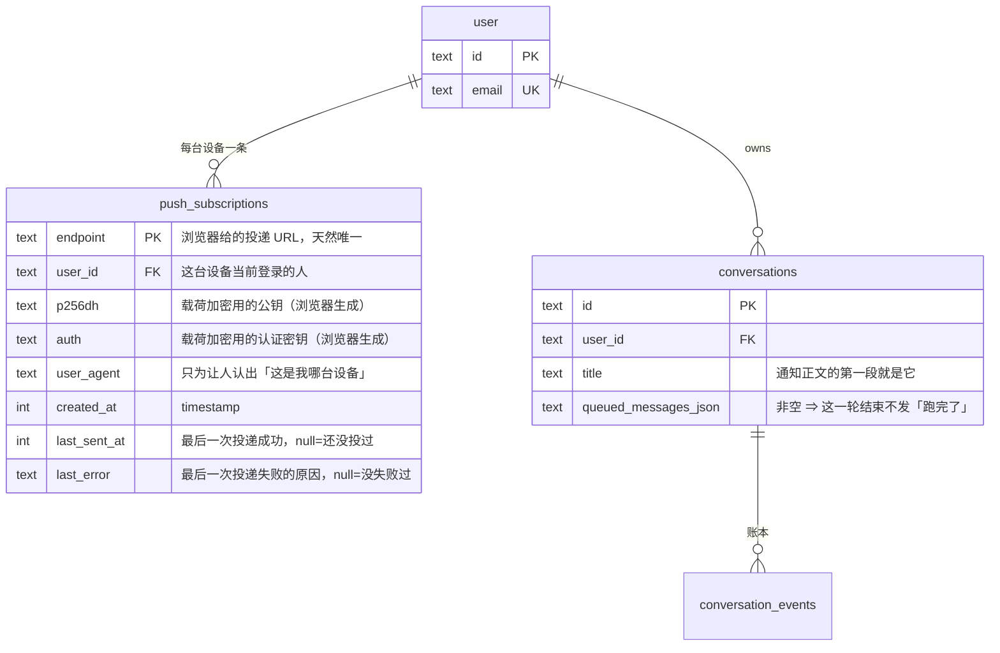
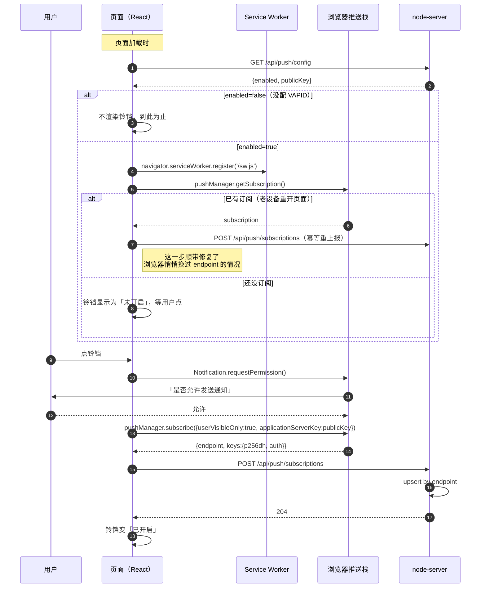
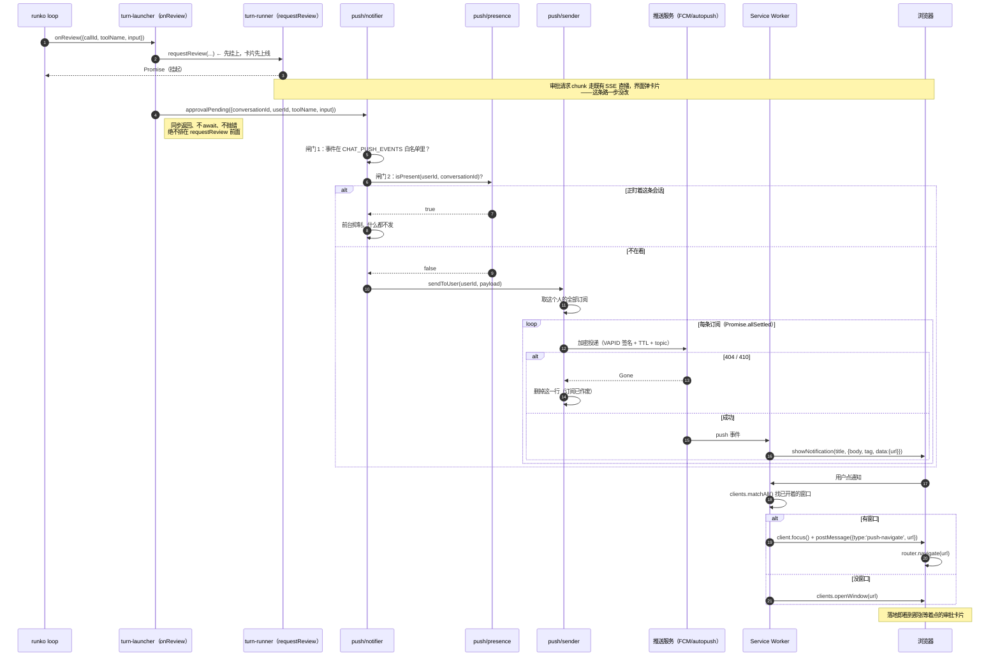
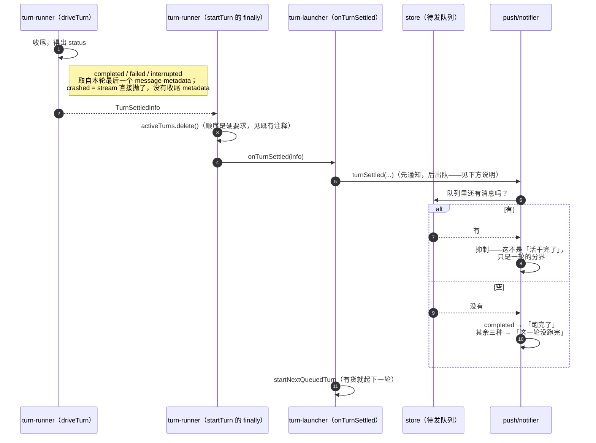

# 推送通知（技术方案）

> 术语见 [docs/terms.md](../../terms.md)。[功能](../features/push-notification.md)，[施工进展](../plans/push-notification.md)。
> 依赖与被影响：[chat-webapp](./chat-webapp.md)（[账本](../../terms.md)、[审批链](../../terms.md)、起轮装配）·[steer-and-queue](../../logic/orchestration/tech/steer-and-queue.md)（[待发队列](../../terms.md)决定"一轮算不算结束"）·[sandbox-keepalive](../../logic/orchestration/tech/sandbox-keepalive.md)（[审批保活预算](../../terms.md)与审批超时必须一起定，见 §8）·[telemetry](./telemetry.md)（本方案的接线姿态照抄它）

## 1. 方案一句话

**服务端在四个已知时刻，往这个用户的所有设备投一条加密的 Web Push；投之前先看他是不是正盯着这条会话。**

拆成三段，各自独立：

| 段 | 干什么 | 落点 |
|---|---|---|
| **收集** | 浏览器生成[推送订阅](../../terms.md)，页面上报，服务端落库 | `apps/web/src/features/notifications/` + `apps/node-server/src/routes/push.ts` |
| **决策** | 四个触发点各产出一条载荷；[在场](../../terms.md)、队列、事件白名单三道闸门决定发不发 | `apps/node-server/src/push/notifier.ts` |
| **投递** | 按订阅扇出，加密投给推送服务；失效订阅就地回收 | `apps/node-server/src/push/sender.ts` + `apps/web/public/sw.js` |

**依赖方向是单向的**：`turn-runner/` 不认识推送，也不认识[在场](../../terms.md)——它只多**一个**生命周期通知点（`onTurnSettled` 多带一个"这一轮怎么结束的"）。拼载荷、查闸门、发投递全在 `push/` 下。这与[遥测](./telemetry.md)当初的接法完全同构，理由也一样：运行内核不该长出对可选外围功能的认识。

## 2. 业务数据领域设计图

只加一张表。[在场](../../terms.md)是纯内存的（见 §5.2），不落库。



三个设计点：

- **`endpoint` 当主键，不另发 id。** 它本来就是"一台设备 + 一个站点"的唯一地址，浏览器保证。拿它当主键，重复订阅（页面每次加载都会重新上报一次）天然是幂等 upsert，不需要先查再插。
- **`user_id` 可以被覆盖。** 同一台设备换个账号登录，浏览器给的还是同一个 `endpoint`——upsert 时直接把 `user_id` 改成新的人。这是对的：通知该跟着"这台设备现在是谁在用"走。
- **不存偏好。** 这一期没有按事件类型的开关（[产品文档附录 A.2](../features/push-notification.md)）；服务端总闸是环境变量，设备级开关就是"这一行在不在"。

## 3. 核心流程

### 3.1 开启通知：订阅是怎么建起来的



**为什么每次加载都重上报一次**：浏览器会在某些情况下自己换掉 `endpoint`（`pushsubscriptionchange`）。我们的 [Service Worker](../../terms.md) 刻意**不**自己调 API 去补登记（理由见[附录 B.2](#b2-service-worker-不替订阅登记调-api)），改由页面每次加载做一次幂等 upsert 兜底。代价是"换了 endpoint 到你下次打开应用之间收不到通知"——可以接受，因为收到通知后你本来也得打开应用才能干活。

### 3.2 要审批 → 通知 → 点回来



**这张图里最要紧的一条顺序**：`requestReview` 先跑，通知后发。审批卡片抵达用户的路径（SSE 直播）绝不能被推送这条可选支路拖慢或拖挂——同[遥测](./telemetry.md)那条"观测绝不插在 chunk 送达用户的前面"。

### 3.3 一轮结束 → 发不发"跑完了"



**顺序在这里是硬要求**：`turnSettled` 必须排在 `startNextQueuedTurn` **之前**。队列抑制读的是"这一轮结束时队列里还有没有货"，而出队的第一件事就是把货取走——顺序反了，最后一条排队消息起轮时队列刚好空了，就会误报一次「跑完了」。这条有专门的用例守着（`test/agent/turn-launcher-notify.test.ts`）。

## 4. 四个触发点怎么接

全部接在 `turn-launcher.ts`——那里本来就是"拼装一轮、认识 db 与依赖"的地方，`turn-runner/` 只需要一处极小的扩展。

| 触发 | 接在哪 | 需要改 turn-runner 吗 |
|---|---|---|
| 要审批 | `launchTurn` 里的 `onReview` 闭包（现在只是转发给 `requestReview`，包一层） | 不用 |
| agent 提问 | 同上，`onAskUser` 闭包 | 不用 |
| 一轮完成 | `onTurnSettled` 回调 | 要：多带一个 `TurnSettledInfo` |
| 一轮失败/中断 | 同上，按 `status` 分流 | 同上 |

`turn-runner/` 唯一的改动：

```ts
export interface TurnSettledInfo {
  /**
   * `completed` / `failed` / `interrupted` 来自本轮最后一个 `message-metadata`
   * chunk（`driveTurn` 已经在 `lastMessageMetadata` 里存着，现在只是把它交出去）；
   * `crashed` 是 `catch` 分支——`session.stream()` 直接抛了，压根没产出收尾 metadata。
   */
  status: 'completed' | 'failed' | 'interrupted' | 'crashed';
}
```

`driveTurn` 从 `Promise<void>` 改成 `Promise<TurnSettledInfo>`（它本来就 catch 住了所有错，不会 reject），`startTurn` 的 `finally` 把它传给 `onTurnSettled`。既有唯一的调用方 `onTurnSettled: () => {...}` 多收一个参数不受影响。

**接口姿态（三条，与 `onMilestone` 一致）**：同步、返回 `void`、绝不抛错。`notifier` 的每个方法内部自己 try/catch 并 `void` 掉异步部分——一条通知发不出去，绝不能让一轮跑不下去。

## 5. 三道闸门

### 5.1 事件白名单

`CHAT_PUSH_EVENTS`，逗号分隔，默认 `approval,question,turn-done,turn-failed`（全开）。改配置重启即生效，不需要界面（[产品文档附录 A.2](../features/push-notification.md) 说明了为什么这一期不做设置界面）。

### 5.2 在场（前台抑制）

**判据**：`document.visibilityState === 'visible' && document.hasFocus()` 且路由停在这条会话上。三个条件缺一不可——第二个显示器上开着但没聚焦，不算在看。

**为什么必须由页面上报，服务端猜不出来**：服务端能看到的只有"这条会话有没有活的 SSE 连接"，而一个**被切到后台的标签页照样开着 SSE 连接**——那正是最需要通知的情形。可见性和聚焦只有页面自己知道。

**机制**（刻意做得很轻）：

```
POST /api/chat/conversations/{id}/presence   body: { focused: boolean }  → 204
```

- 前端：`focused=true` 时每 20 秒心跳一次；`visibilitychange`/`focus`/`blur`/卸载时立刻补发一次（`blur` 与卸载发 `false`）。
- 服务端：`Map<"userId\0conversationId", expiresAt>`，TTL 45 秒（= 心跳周期的两倍多一点，容得下一次丢包）。读时惰性过期；写时若 `size > 256` 顺手扫一遍清死条目。

**为什么是内存不是库**：这份状态的寿命是秒级、写入比读取频繁得多、丢了最坏就是多弹一条通知。而且 `activeTurns` 本来就是内存 Map——这个服务端已经是单进程绑定的，在场再引一次同样的假设不增加任何新约束。多机部署时两者要一起解决，不是这一期的事（[附录 B.6](#b6-多机部署)）。

### 5.3 队列抑制

一轮结束时[待发队列](../../terms.md)非空 ⇒ 不发"跑完了"。判据直接读 `conversations.queued_messages_json`（`store.ts` 已有读取器），在 `onTurnSettled` 里、`startNextQueuedTurn` 之前查。

## 6. 投递

### 6.1 载荷

```ts
export interface PushPayload {
  v: 1;
  kind: 'approval' | 'question' | 'turn-done' | 'turn-failed';
  conversationId: string;
  title: string;   // 服务端拼好的中文标题，SW 原样显示
  body: string;    // 同上，已截断
  url: string;     // '/chat/<conversationId>'
  tag: string;     // [通知合并标签](../../terms.md)：'<标签组>:<conversationId>'
  sticky: boolean; // [挂住不消失](../../terms.md)，见 §6.4
}
```

**文案在服务端拼，SW 不做任何判断。** SW 是一份没有构建、没有类型检查的裸 JS（[附录 B.1](#b1-service-worker-用裸-js不进-ts-构建)），逻辑越少越好。

**截断**：会话标题 60 字、命令 100 字、问题 80 字。既为通知栏显示得下，也为少往外送内容——尽管载荷是端到端加密的（`aes128gcm`，密钥只有浏览器有，推送服务解不开），能少送就少送。总载荷控制在 2KB 以内（部分推送服务的硬上限比 4KB 低）。

### 6.2 合并标签与 topic

`tag = '<标签组>:<conversationId>'`：同一条会话同一组事件，新通知**替换**旧的（`renotify: true` 保证替换时仍然提醒一次）。同一条会话连着三次审批 → 通知栏里只有一条，点开看到的是三张卡片。

标签组有三个，不是四个——**`turn-done` 与 `turn-failed` 共用 `turn:`**：它们对同一条会话互斥且时序相继，"这条会话最近一轮怎么样了"只该有一条。`approval:` 与 `question:` 各自独立。

推送服务侧还有一层同样意图的合并——`Topic` 头，让**尚未投递**的旧消息被新消息顶掉。它的格式限制很死（≤32 字符、URL-safe base64 字符集），装不下一个 36 字符的 uuid，所以 `topic` 由 `kind` 首字母 + `conversationId` 去掉连字符后的前 24 位拼成。

### 6.3 TTL 与紧急度

| kind | TTL | Urgency | 理由 |
|---|---|---|---|
| approval / question | = 当前审批超时的剩余秒数 | `high` | 送不到用户手上就已经自动拒绝了的通知，不如别送 |
| turn-done / turn-failed | 600 秒 | `normal` | 十分钟后才送达的"跑完了"已经没意义 |

### 6.4 挂住不消失（`requireInteraction`）

Chrome 的通知默认几秒就自己收走——人转头去干别的，回来时通知栏干干净净，通知等于没发。

对策是让通知**停在屏幕上直到人动手**（`showNotification` 的 `requireInteraction`）。但**按类型分档，不是全局开关**：

| kind | 挂住？ | 为什么 |
|---|---|---|
| approval / question | ✅ | 它们**卡着一整轮**。错过 = 把 agent 晾在那儿直到超时自动拒绝 |
| turn-done / turn-failed | ❌ | 只是告知，事情已经结束了。挂住的话跑十轮攒十条，得一条条点掉 |

判据一句话：**错过它会不会卡住什么**。

由服务端在载荷里给出 `sticky` 布尔值，SW 原样映射成 `requireInteraction`——SW 不按 `kind` 自己推断，理由同 `title`/`body`（附录 B.1：它是没有类型检查的裸 JS，一切判断留在服务端）。

**别指望它到处都灵**：

| 平台 | 认不认 |
|---|---|
| Chrome / Edge 桌面版 | ✅ |
| Firefox / Safari | ❌ 忽略，照旧自动消失 |
| Android Chrome | ❌ 忽略 |

**macOS 上还多一层，且这一层往往才是真凶**：Chrome 走系统通知中心，「横幅（Banners）」样式**无论如何都会几秒后自动隐藏**，`requireInteraction` 顶不住。要真挂住，得在 **系统设置 → 通知 → Google Chrome → 提醒样式** 里从「横幅」改成「提示（Alerts）」。这是系统设置，代码改不了。

### 6.5 通知上的裁决按钮

审批通知挂三个按钮：**允许 / 拒绝 / 本会话都允许**，点了不用打开页面，SW 直接
`POST .../approvals/{callId}`。

**顺序即取舍**：浏览器只渲染前 `Notification.maxActions` 个，**多的静默丢弃**——
Chrome（桌面与 Android）是 **2**。所以排序把「少了就残废」的放前面：

| 位次 | 按钮 | Chrome 上看得到吗 |
|---|---|---|
| 1 | 允许 | ✅ |
| 2 | 拒绝 | ✅ |
| 3 | 本会话都允许 | ❌ 被丢掉（想用它就点开页面，卡片上三个齐全） |

平台哪天放开到 3 个，第三个自己就出来了，代码不用改。Safari 完全不支持
`actions`，那里只有"点开跳转"。

**载荷多两个字段**：`callId`（定位这次调用）与 `actions`（`{id, title, behavior}[]`）。
`behavior` 直接写在每个按钮上，**SW 不从 `action` id 反推该调什么**——判断一律留
在服务端，同 `title`/`body`/`sticky`。SW 那侧还有一道白名单：`behavior` 不在
`allow`/`allow-session`/`deny` 里就整条按钮丢掉，宁可不显示，也不显示一个点了会
发出未知请求的按钮。

**鉴权**：SW 用同源相对路径 + `credentials: 'include'`。SW 注册在站点根，`/api/*`
由 dev server 代理到 node-server，登录 cookie 自动带上。这也是[附录 B.2](#b2-service-worker-不替订阅登记调-api)
（"SW 不调 API"）**被推翻的部分**——那条规矩现在只剩「订阅登记不走 SW」，见附录。

**点完的反馈**（三档，都用一次性不挂住的提示通知）：

| 结果 | 提示 |
|---|---|
| 成功 | 「已允许」/「已拒绝」+ **原正文（那条命令）** |
| 404 | 「这条审批已经处理过了」——超时自动拒绝了，或别的标签页/设备刚处理过 |
| 其它失败 / 网络错误 | 「没能提交，点开看看」 |

成功时也带上原正文是刻意的：这是"通知里能直接放行命令"唯一的兜底——手滑点了
「允许」，你能立刻看见自己批了什么。

### 6.6 失效订阅回收

`web-push` 抛的 `WebPushError` 带 `statusCode`：

- **404 / 410** → 这个订阅已作废（用户撤了权限 / 浏览器换了 endpoint / 清了站点数据）→ **删行**。这是唯一会删行的路径。
- **429 / 5xx** → 推送服务自己的问题 → 记 `last_error`，留行，不重试。这一期没有重试队列：通知是转瞬即逝的提醒，补发一条十分钟前的"要审批"没有价值。
- 其余 → 同上记录，留行。

扇出用 `Promise.allSettled`，一台设备失败不影响另一台。

### 6.7 总闸

`push/vapid.ts` 读三个环境变量：`VAPID_PUBLIC_KEY`、`VAPID_PRIVATE_KEY`、`VAPID_SUBJECT`（形如 `mailto:you@example.com`）。缺任何一个 ⇒ `isPushEnabled() === false`：

- `GET /api/push/config` 返回 `{enabled: false, publicKey: null}` → 前端不渲染铃铛。
- 订阅接口返回 503（而不是默默存下永远发不出去的行）。
- `notifier` 的四个方法全部立即 return。
- 启动时 `log.info` 一行"推送未配置，已禁用"，之后不再刷。

密钥生成：`npx web-push generate-vapid-keys`，一对密钥对应一个部署，换了密钥所有既有订阅立即作废。

## 7. 前端落点

| 文件 | 干什么 |
|---|---|
| `apps/web/public/sw.js` | [Service Worker](../../terms.md)：`push` 弹通知、`notificationclick` 跳转。裸 JS，`// @ts-check` + JSDoc |
| `src/features/notifications/push-client.ts` | 权限、订阅/退订、幂等上报。所有跟浏览器推送栈打交道的代码只在这里 |
| `src/features/notifications/use-push-toggle.ts` | 铃铛的状态机：`unsupported` / `off` / `on` / `blocked` / `busy` |
| `src/features/notifications/notification-bell.tsx` | 铃铛本体，挂在 `app-layout.tsx` 的 header 右侧（`ThemeToggle` 旁边） |
| `src/features/notifications/sw-bridge.ts` | 注册 SW；收 SW 的 `push-navigate` 消息 → `router.navigate` |
| `src/features/chat/use-presence.ts` | 在场心跳 |

**iOS 的探测**：iOS Safari 里 `window.PushManager` 只在"已添加到主屏幕并从图标打开"时才存在。本项目不做 PWA（[附录 B.5](#b5-不做-pwa-独立应用ios-因此收不到)），所以 iOS 上它恒为 undefined，铃铛显示为 `unsupported` 并给一句"在电脑上开启即可"。判据用 `PushManager`，不能只看 `Notification` 存不存在。

**类型边界**：`src/gen/` 由 kubb 从 OpenAPI 生成（根 `chat:bootstrap`），四个新接口的请求/响应类型走这条既有链路，不手写。SW 是唯一没有类型检查的地方，所以它只做"读三个字符串字段、显示、跳转"，字段读取全部带 `typeof` 守卫，读不到就退化成一条兜底文案。

## 8. 与既有机制的冲突：4 分钟自动拒绝

**这是本方案最重要的一节，也是唯一一处会让功能"看着做完了其实没用"的地方。**

现状：`CHAT_APPROVAL_TIMEOUT_MS` 与 `CHAT_ASK_USER_TIMEOUT_MS` 默认都是 **240 秒**，超时即自动拒绝。

那意味着：手机上收到"等你批准"，你正在开会，**4 分钟后它自己拒了**。你被通知打扰了一次，却什么也做不了——比不通知更糟。

### 8.1 挡在中间的是"审批保活预算"，不是超时值本身

等人的时候，沙盒得活着。管这件事的是[沙盒保活](../../logic/orchestration/tech/sandbox-keepalive.md)的[审批保活预算](../../terms.md)（`KeepAliveOptions.approvalBudgetMs`）——**卡在人工审批时最多还愿意为沙盒续多久**。

当前取值：

| 值 | 现在是多少 | 谁定的 |
|---|---|---|
| 审批超时 | 240 秒（4 分钟） | `turn-runner/human-bridge.ts` 的 `DEFAULT_APPROVAL_TIMEOUT_MS` |
| 审批保活预算 | 300 秒（5 分钟） | `@runko/core` `keepalive.ts` 的 `DEFAULT_APPROVAL_BUDGET_MS`——chat 侧没显式传，吃的是这个默认 |

两者现在是**自洽**的：人 4 分钟不点就自动拒绝，而沙盒在这 4 分钟里一直被续着。所以今天不存在"人还没点、沙盒先睡了"。

> **一处更正**：本文档初稿说"240 秒的理由（赶在沙盒空闲超时前先拒）已经失效，因为 `turn-launcher.ts` 起了个无条件心跳"。那段代码（`sandboxManager.startHeartbeat`）已经在 2026-07-27 的保活施工里**整个删掉**，换成了适配器级保活 + 审批保活预算。结论没变（4 分钟对"靠手机通知叫回来"确实太短），但要动的旋钮从一个变成了两个。

### 8.2 要改就得两个一起改

**只把审批超时提到 15 分钟是错的**——审批保活预算还是 5 分钟，第 5 分钟沙盒就睡了，人第 10 分钟点"允许"，工具在一个已经睡掉的沙盒上执行，失败得莫名其妙。

正确的一组改动（需要拍板，见[施工计划 PN-9](../plans/push-notification.md)）：

1. `CHAT_APPROVAL_TIMEOUT_MS` / `CHAT_ASK_USER_TIMEOUT_MS` 默认 240000 → **900000**（15 分钟），env 名不变。
2. chat 侧的 `keepAliveOptionsFor`（`sandbox-manager.ts`）**显式传** `approvalBudgetMs`，取值 ≥ 上面那个超时——不能再吃 core 的 5 分钟默认。
3. 通知载荷的 TTL 已经跟着超时走（§6.3，`turn-launcher.ts` 从 `resolveApprovalTimeoutMs()` 取值传给 `notifier`），这一步无需再改。

**不变量**：**审批超时 ≤ 审批保活预算**。两个值分别住在 `turn-runner/human-bridge.ts` 与 `sandbox-manager.ts`，没有任何机制强制它们对齐——改任何一个都要回来看另一个。

**为什么是 15 分钟而不是更长**：等人期间沙盒是活的，是**在烧钱**。15 分钟是"收到通知、掏出手机、看清命令、做决定"的合理上限，同时把一次无人值守挂起的成本压在可接受范围。

## 9. 失败模式与不变量

**不变量（施工时必须守住）**：

1. **推送绝不阻塞、绝不拖慢一轮。** 四个通知点全部同步返回 `void`，内部自己 try/catch，异步部分 `void` 掉。审批卡片上线（`requestReview`）永远排在通知前面。
2. **推送绝不改变一轮的结果。** 通知发失败、VAPID 没配、推送服务挂了——一轮的行为与没有这个功能时逐字节相同。
3. **只有 404/410 会删订阅行。** 任何其它错误都不删——一次网络抖动不该让用户默默失去通知。
4. **在场判定错了只影响打扰，不影响正确性。** 判成"在看"最坏是漏一条通知（人确实在看着，卡片就在眼前）；判成"不在看"最坏是多弹一条。两个方向都不会丢审批、不会误批准。

| 失败 | 表现 | 处理 |
|---|---|---|
| VAPID 未配置 | 没有铃铛 | 全链路静默禁用，启动时一行日志 |
| 用户撤销浏览器权限 | 投递返回 410 | 删行；页面下次加载时铃铛回到"未开启" |
| 浏览器换了 endpoint | 旧行投递 410 被删 | 页面下次加载幂等重上报，恢复 |
| 推送服务 5xx | 这次投不到 | 记 `last_error`，不重试，不删行 |
| 服务端重启 | 在场信息全丢 | 全部视为"不在看"→ 多弹通知，45 秒内心跳自动恢复 |
| 用户同时开了 5 台设备 | 5 台一起响 | 有意为之。设备级开关就是各自的订阅在不在 |
| SW 收到解不开/字段缺失的载荷 | — | 兜底文案「runko chat 有新动静」+ 跳到 `/chat` |

## 10. 已知限制

1. **换 endpoint 到下次打开应用之间收不到通知**（§3.1）。
2. **单进程**：在场是内存的（§5.2）。
3. **iPhone / iPad 收不到**：不做 PWA 的直接后果（[附录 B.5](#b5-不做-pwa-独立应用ios-因此收不到)）。
4. **没有重试**：投递失败就是失败（§6.6）。
5. **通知里不能直接批准**（[产品文档附录 A.1](../features/push-notification.md) 说明了为什么这是有意的）。
6. **一轮在起轮装配窗口里被停止不发通知**：那条路径走 `releaseTurn`（turn-runner/reservation.ts），它没有 `onTurnSettled`。可接受——那一刻是用户自己刚按的停止，他知道。

---

## 附录 A. 依赖与配置

**新增依赖**（只在 `apps/node-server`，`packages/*` 一行不动，因此**不需要 changeset**）：

| 包 | 用途 |
|---|---|
| `web-push` | VAPID 签名 + 载荷加密 + 投递。Node 端事实标准，自己实现 `aes128gcm` 加密没有意义 |
| `@types/web-push` | 类型 |

**新增环境变量**（进 `.env.template`）：

| 变量 | 必填 | 默认 | 说明 |
|---|---|---|---|
| `VAPID_PUBLIC_KEY` | 否 | — | 缺 ⇒ 整个功能禁用 |
| `VAPID_PRIVATE_KEY` | 否 | — | 同上 |
| `VAPID_SUBJECT` | 否 | — | `mailto:` 或站点 URL，推送服务要求 |
| `CHAT_PUSH_EVENTS` | 否 | 四类全开 | 逗号分隔白名单 |
| `CHAT_APPROVAL_TIMEOUT_MS` | 否 | 240000 → **建议 900000** | 见 §8 |
| `CHAT_ASK_USER_TIMEOUT_MS` | 否 | 240000 → **建议 900000** | 见 §8 |

## 附录 B. 被否决的方案

### B.1 Service Worker 用裸 JS，不进 TS 构建

**选了**：手写 `apps/web/public/sw.js`，纯 JS，`// @ts-check` + JSDoc 标注，Vite 原样拷到站点根。

**否决 `vite-plugin-pwa`**：它带来 Workbox 一整套预缓存/离线策略。我们要的只是"收推送、弹通知、处理点击"六十行，一行离线缓存都不需要。引入它等于为了一个小功能接管整个站点的资源加载策略，出问题时的排查面大得不成比例。

**否决"另起一份 Vite 配置把 `src/sw.ts` 单独打包成 `dist/sw.js`"**：能拿到类型，但 dev 模式下 Vite 不会为这个额外入口起构建，得再搭一套 watch，开发体验直接劣化。为六十行代码搭两套构建不划算。

**这个取舍的代价怎么兜**：SW 里不写任何业务判断（文案在服务端拼好，§6.1），字段读取全带 `typeof` 守卫。它薄到不值得类型检查——这正是选它的前提，不是选它之后的借口。

### B.2 Service Worker 不替订阅登记调 API

> **范围已收窄（2026-07-27）**：本条原本是"SW 一律不调 API"。加了[通知裁决按钮](#65-通知上的裁决按钮)之后 SW **会**调审批接口了——下面这条理由只适用于"订阅登记"那条路，不适用于按钮。差别在于失败可不可见：按钮点了没反应，人当场就知道（而且还有一条"没能提交"的提示兜着）；订阅登记在后台悄悄失效，没有任何人会发现。

`pushsubscriptionchange` 事件里"自动重新订阅并上报"是标准做法，我们不做。

原因是**鉴权链路**：SW 发的请求带的是站点 cookie，而生产环境下 web 与 API 是两个源（`vite.config.ts` 里 dev 走代理是同源，生产 `VITE_API_URL` 是绝对地址）。跨源 + cookie + SW 三者叠加，浏览器的第三方 cookie 策略一变就会**静默失效**——而这类失效恰恰最难发现（没有页面、没有控制台、没人看日志）。

改由页面每次加载幂等重上报（§3.1）。失效窗口是"到你下次打开应用为止"，而你收到通知后本来也得打开应用。

### B.3 在 SW 里做前台判断，而不是服务端在场闸门

想法：服务端无脑推，SW 收到后用 `clients.matchAll()` 看有没有聚焦的窗口，有就不弹。

**否决**：订阅时声明的 `userVisibleOnly: true` 是一句承诺——**收到推送就必须弹一条通知**。收了不弹，Chrome 会替你弹一条"此站点在后台更新了内容"，Firefox 会记配额、反复违规直接吊销订阅。这条路是在跟平台规则对着干。

服务端闸门（§5.2）没有这个问题：不该打扰就**根本不发**。代价是多一个心跳接口，很便宜。

### B.4 带 body 的 `DELETE`

退订接口原计划是 `DELETE /api/push/subscriptions`，body 里带 endpoint。改成了 `POST /api/push/unsubscribe`：endpoint 是个几百字节的 URL，放 query 要编码、放 body 又踩上「带 body 的 DELETE」这个灰色地带（规范没禁止，但部分 HTTP 客户端与代理会把它丢掉，而且是**静默**丢）。语义上稍微不那么 REST，换来一条不会在某个中间层莫名失效的路径。

### B.5 不做 PWA 独立应用（iOS 因此收不到）

2026-07-27 定：不加 `manifest.webmanifest`、不加图标、`index.html` 不加 link。

**后果只有一个，但要写清楚**：iOS 的网页推送只对"添加到主屏幕"装成独立应用的网页开放，没有 manifest（或 `apple-mobile-web-app-capable`）就装不成独立应用，所以 **iPhone / iPad 上收不到任何推送**。前端把这一档显式识别出来（`isPushSupported()` 查 `window.PushManager`），铃铛显示「这台设备不支持」而不是假装能用。

桌面 Chrome / Edge / Firefox / Safari 与 Android Chrome **不需要** manifest 就能收推送——它们只要求 HTTPS（`localhost` 算安全上下文）+ 一个 Service Worker，两者都有。

要补回来是三步，不涉及任何现有代码的改动：

1. `apps/web/public/manifest.webmanifest`：`name` / `short_name` / `start_url: "/chat"` / `display: "standalone"` / `theme_color` / 两个图标条目。
2. `apps/web/public/icon-192.png` + `icon-512.png`（`purpose: "any maskable"`，内容要落在中心 80% 的安全区里）。
3. `apps/web/index.html` 加一行 `<link rel="manifest" href="/manifest.webmanifest">`。

之后 iPhone 上用 Safari「分享 → 添加到主屏幕」，从图标打开，铃铛就能用了。

### B.6 多机部署

在场用内存 Map，多机就不准了（心跳打到 A 机、通知从 B 机发）。这一期不解决，因为 `activeTurns`（进行中的一轮）本来就是内存的、`turn-runner` 的整个直播机制都绑在单进程上——在场没有引入任何**新的**约束。真要上多机，得连[账本](../../terms.md)直播一起改，届时在场顺手挪进同一套共享状态即可。
