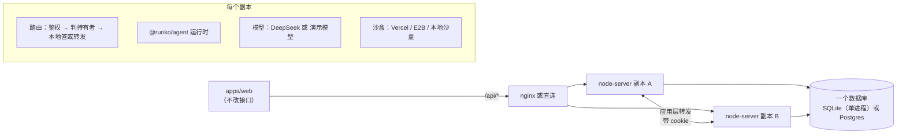
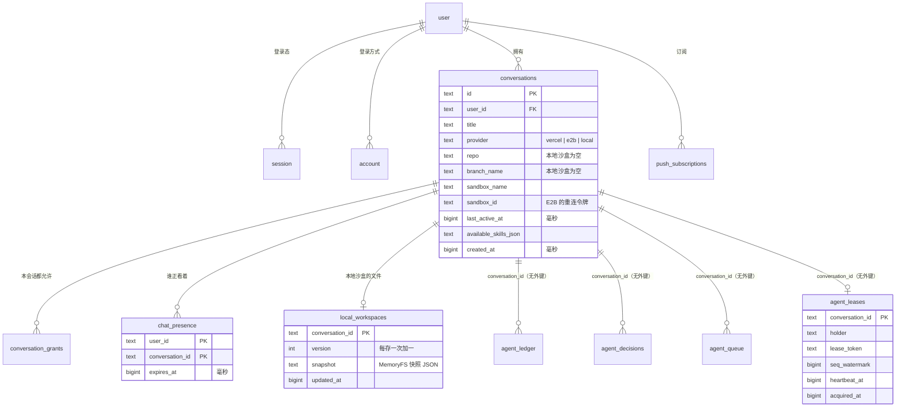
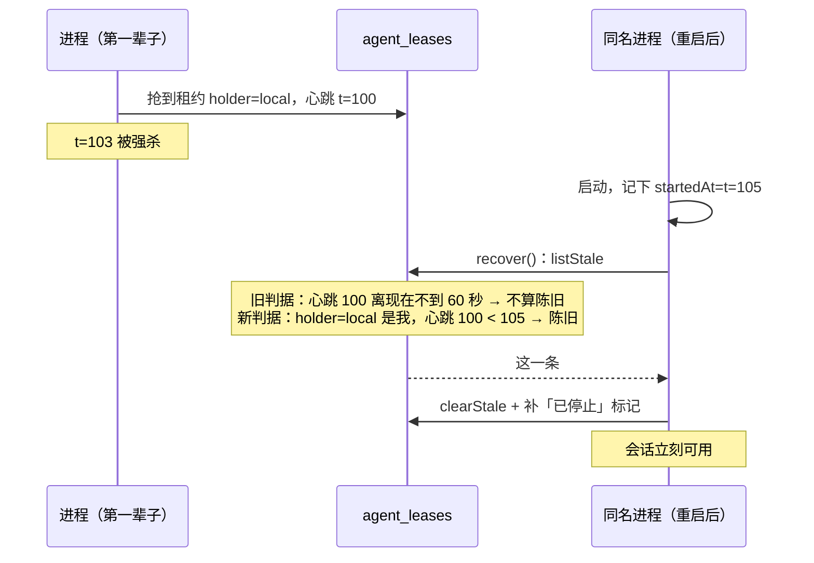
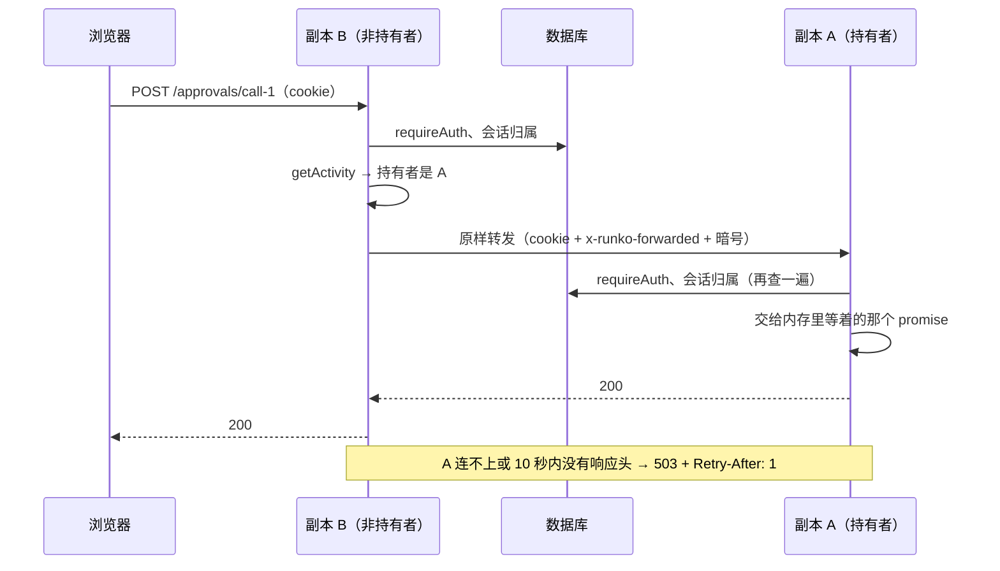

# 唯一 demo — 技术方案

> 术语见 [术语表](../../terms.md)。要做什么、为什么做见 [功能手册](../features/unified-demo.md)；拆单和进度见 [施工](../plans/unified-demo.md)。

## 1. 改完之后长什么样



四个变化，各自独立：

| # | 变化 | 为什么 |
|---|---|---|
| ① | 数据层从 drizzle 换成 **Kysely**，框架的表改用官方 `@runko/persist-kysely` | 要同时支持 SQLite 和 Postgres；手写的那套框架存储在多进程下会丢消息（§2.5） |
| ② | 租约**启动时收拾自己名下的旧租约**（框架小改） | 换成租约后，单进程崩溃重启要干等 60 秒，比现在差（§3） |
| ③ | **零配置**：演示模型、本地沙盒、GitHub 改成可选 | 不注册账号就能跑（§4） |
| ④ | **多副本**：转发、在场状态进库、验证环境 | 把 persist-demo 的职责接过来（§6） |

web 的接口格式一处都不改，只多认一个沙盒取值 `local`，多读一个配置接口（§4.4）。

## 2. 数据层

### 2.1 选型：全部换成 Kysely

现在 30 处数据库读写全是 better-sqlite3 的**同步**写法（直接 `.all()` / `.run()` 拿结果）。不管选哪条路，都得改成 `await`。区别在改完之后有几套查询层：

| | A：drizzle 双方言 | **B：Kysely 一套（选这个）** |
|---|---|---|
| 类型 | SQLite 版和 Postgres 版是两个类型，合在一起调用编译不过。只能每个 store 写两份，或者到处 `as any` | 一个 `Kysely<Database>`，两种库共用一份代码 |
| 迁移 | 两套 drizzle-kit 配置、两条迁移链，以后每改一次表都要生成两遍 | 一条迁移链，只有列类型按方言分支 |
| 框架的表 | 再装一个 persist-kysely，进程里就有两套查询层 | persist-kysely 本来就吃一个 Kysely 实例，**跟业务表共用同一个** |
| better-auth | drizzle 适配器改 `provider: 'pg'` | 1.6.23 原生支持 `database: { db: Kysely, type }` |

**否决 A**：两份 store 或者 `as any`，都违反仓库的类型规范。两条迁移链也是长期的维护成本，每次改表都要付一次。

### 2.2 表



三类表，各管各的：

| 谁的 | 表 | 谁建、谁写 |
|---|---|---|
| better-auth 的 | `user` `session` `account` `verification` `rateLimit` | better-auth 自己的迁移接口建表，字段名用它的缺省（驼峰），我们不改 |
| chat 应用的 | `conversations` `push_subscriptions` `conversation_grants` `chat_presence` `local_workspaces` | 本应用的 Kysely 迁移 |
| 框架的 | `agent_ledger` `agent_decisions` `agent_queue` `agent_leases` | `@runko/persist-kysely` 的 `migrate()` 建表，只通过 `Persistence` 接口读写 |

跟现在比，`conversations` 少了六列：`queued_messages_json`、`turn_holder`、`turn_started_at` 挪进框架的表；`agent_session_id`、`agent_session_created_at`、`agent_session_turn` 早就没人写了。时间一律存毫秒整数，跟框架的表一致。

### 2.3 建表与迁移

`db:migrate` 按顺序跑三段：better-auth 的迁移接口 → 本应用的 Kysely 迁移 → persist-kysely 的 `migrate()`。

| 库 | 什么时候跑 | 为什么 |
|---|---|---|
| SQLite | **服务启动时自动跑** | 零配置：`pnpm chat:server` 一步就能用。单进程，不会有两个进程同时跑迁移 |
| Postgres | **显式跑 `db:migrate`**，副本启动时不跑 | persist-kysely 的 `migrate()` 只有「表不存在才建」，没加锁，多个副本同时跑会冲突（见 `packages/persist-kysely/src/migrate.ts` 的说明）。docker 验证环境里用一个一次性的 `migrate` 服务先跑完，副本再起 |

**库文件换名，防止误开旧库**：SQLite 的路径改由 `CHAT_DB_PATH` 配置，缺省 `chat.db`；旧的 `DATABASE_PATH` 不再读取，配了也只打一行警告。万一新代码被指向旧库（库里有 drizzle 的迁移记录表 `__drizzle_migrations`），启动时直接报错，说明这是旧版库文件。否则「表已存在就跳过」会让新代码在旧表上跑，缺哪一列要到查询时才报错。

`generate:openapi` 会 import 整个 app。所以数据库连接要**用到时才建**，生成接口文档时不碰库。

### 2.4 同步改异步的波及面

| 位置 | 改什么 |
|---|---|
| `agent/store.ts`、`push/store.ts`、`agent/conversation-grants.ts` | 全部查询改成 Kysely + `await` |
| `routes/chat.ts`（约 20 处）、`routes/push.ts`、`push/sender.ts`、`agent/runtime.ts` | 调用方跟着加 `await` |
| `push/notifier.ts` | 它的 `guard()` 是同步的，里面两次读库要改成异步版 |
| `auth.ts` | `database: { db, type }`。传实例而不是方言，避开 better-auth 内部的 `instanceof` 判断：它依赖的 kysely 是 0.29.3，我们的是 0.29.5，`instanceof` 会判错 |

### 2.5 框架的存储改用 persist-kysely

`agent/persistence.ts` 那 658 行手写实现删掉，换成 `kyselyPersistence(db, { flavor })` 和 `leaseArbitration(db, { flavor, holder })`。**直接用 persist-kysely，不用 persist-sqlite 薄壳**：薄壳要求 better-sqlite3 ^13，而 better-auth 要求 ^12，装不到一起；况且我们本来就有 Kysely 实例。

**这一步不是锦上添花，是多进程的前提。** 现在的手写版有四处只在单进程下成立：

- 持有者记成 `pid:N`，别的副本没法转发过去。
- 没有心跳，副本死了标记永远不清。
- 账本序号按进程缓存，另一个副本写过之后会发重复的序号，然后被「冲突就跳过」**静默丢掉**。
- 启动时把所有「正在跑」标记都当孤儿收掉，连别的副本正活着的轮也一起打断。

排队和裁决的写入也不是原子的。persist-kysely 这四处都对，而且有一致性测试在真库上守着。

原来绕过接口、直接读框架表的地方，换成接口：

| 读的地方 | 读什么 | 换成 |
|---|---|---|
| `routes/chat.ts` 列表、详情 | 排队消息 | `agent_queue` 上按会话分组的一次查询（共用 Kysely 实例，列表页不做 N+1 查询） |
| 同上 | 有没有轮在跑 | `runtime.getActivity(id).active` |
| 同上 | 几处等你答 | `agent_decisions` 上按会话分组数未结清的行 |
| `push/notifier.ts` | 队列里还有没有下一条 | `runtime.listQueue(id)` |

直接查框架的表只限这两处分组计数。表结构是 persist-kysely 的公开契约，见它的 `schema.sql`。

## 3. 租约：启动时收拾自己名下的旧租约（框架小改）

**问题**：换成租约之后，单进程服务崩溃再重启，上一次没跑完的那一轮要干等[接管阈值](../../terms.md)（缺省 60 秒）才会被收拾。原因是 `recover()` 只收拾「心跳超过 60 秒没续」的租约，刚崩的那一条心跳还新鲜。这 60 秒里这条会话发不了消息（持有者就是自己，却转发不了）。现在的手写版是一重启就立刻收拾，换过去是倒退。

**改法**：陈旧判据多加一支——**「持有者是我自己的名字，而且最后一次心跳在我启动之前」也算陈旧**。一个刚启动的进程不可能已经在跑任何一轮，所以挂在自己名字下、比自己还老的租约，一定是上一辈子留下的。



- **三处用同一条判据**：`listStale`、`clearStale`、`acquire`。`recover()` 的顺序是 `listStale → clearStale → acquire`，判据不一致的话，后一步会清掉前一步刚拿到的令牌（`packages/persist-kysely/src/arbitration.ts` 的注释里有这条坑）。
- **persist-mongo 同步改**，`@runko/conformance` 加一条用例：同名进程重启后立刻能收拾。
- **前提是每个进程的持有者名字唯一。** 单进程缺省叫 `local`；多副本用 `RUNKO_NODE_URL`，同一个副本重启后名字不变，正好也能立刻收拾自己的旧账。万一两个活进程配成了同一个名字，后启动的那个会把前一个的轮抢过来；但前一个手里的[租期标识](../../terms.md)已经作废，它写不进去，账本不会写坏。
- **否决「单进程时把接管阈值调短」**：只能缩短等待，不能消除；而且 `recover()` 只在启动时跑一次，心跳还没过阈值的那几条就漏过去了，要等下一次有人发消息接管时才收拾。
- **否决「单进程时用进程内仲裁」**：内置的进程内仲裁 `listStale` 永远返回空，崩溃恢复就整个没了。

## 4. 零配置

### 4.1 演示模型

没配 `DEEPSEEK_API_BASE_URL` + `DEEPSEEK_API_TOKEN` 时，`resolveModel()` 返回[演示模型](../../terms.md)，启动时记一行日志说明用的是演示模型。它从 persist-demo 的 `toolScriptModel` 演化而来：

| 最后一条用户消息里 | 它做什么 |
|---|---|
| 某一行以 `run:` 开头 | 调 `bash`，参数是冒号后面的命令 |
| 某一行以 `ask:` 开头 | 调 `ask-user`，问冒号后面的问题 |
| 都没有 | 把原话复述一遍 |

- **收尾靠看最后一条消息**：如果最后一条是工具结果，就说一句「做完了」加上结果摘要，然后收尾。审批后[恢复](../../terms.md)的轮、换了副本接着跑的轮都是这样续上的，不会重复调工具。
- **复述是一小段一小段流出来的**，每段间隔由 `CHAT_DEMO_DELAY_MS` 控制（缺省 30 毫秒）。这样人有时间点「停止」、试「插话」。多副本测试会把它调大，让一轮跑得够久，好在中途杀进程。
- **否决 persist-demo 的环境变量剧本**（`DEMO_SCRIPT=bash`）：它一次只能演一种剧本，而且界面上的人没法选。把指令写在消息里，人和测试用的是同一种方式。

### 4.2 本地沙盒

`sandbox-manager.ts` 加第三个 provider `local`，实现现有的 `SandboxProvider` 接口：

| 部件 | 用什么 |
|---|---|
| 文件 | `@runko/virtual-fs` 的 `MemoryFS`，建会话时铺一个小示例项目（`README.md`、`src/`、一个演示用的 `SKILL.md`） |
| 命令 | `@runko/just-bash`，可以写文件，`rm -rf` 真的会删 |
| 保活 | 空操作，本地沙盒不会休眠 |
| 重连 | 进程内按会话缓存。缓存里没有就从 `local_workspaces` 读快照恢复；两处都没有，就当新会话重新铺示例项目 |

- **每轮收尾存一份快照**：挂在运行时的 `onTurnSettled` 钩子上，调 `MemoryFS.snapshot()`，写进 `local_workspaces`，`version` 加一。挂起也会触发收尾，所以挂起前的文件也存上了。进程崩溃时，这一轮里改的文件会丢，这跟「崩溃中断这一轮」的语义一致。
- **取的时候比版本号**：缓存的版本比库里的旧，就重新读快照。多副本时 A 跑完第 1 轮，B 接手跑了第 2 轮，回到 A 跑第 3 轮时，不会用上 A 手里那份过期的文件。
- **建会话不拉仓库、不装 skill**：现在 `acquire` 建盒后一定会跑 git 初始化和 `npx skills add`，这两步都要联网，失败就抛错。改成由 provider 决定要不要跑：给 `SandboxProvider` 加一个可选的初始化钩子，云沙盒把现有逻辑挪进去，本地沙盒不实现。
- **否决 `@runko/mini-bash`**：它只读，批准了 `rm -rf` 之后会报「命令不存在」，审批演示就没有意义了。
- **否决真目录（`DirFS` + overlay）**：会碰到本机文件；而且多副本之间共享不了。

### 4.3 GitHub 可选，加一个配置接口

- `GITHUB_REPO` / `GITHUB_PAT` 只在用云沙盒时必需。建会话选 `local` 时不读它们，`repo`、`branch_name` 留空。
- 缺省 provider 的规则：配了 Vercel 的 key 用 `vercel`；否则配了 E2B 的 key 用 `e2b`；都没配用 `local`。
- 新增 `GET /api/chat/config`（要登录），告诉前端这台服务端的能力：

```ts
{
  providers: ("vercel" | "e2b" | "local")[];  // 这台服务端能用的沙盒
  defaultProvider: "vercel" | "e2b" | "local";
  model: "deepseek" | "demo";
}
```

- 登录页要知道 GitHub 登录开没开，但那时还没登录。所以另开一个不用登录的 `GET /api/auth-config`，只返回 `{ github: boolean }`。
- `chat-agent.ts` 的系统提示词分两版：本地沙盒那一版不提仓库、分支、PR，并说明沙盒里没有 git 和网络。
- 报错信息里提到的 `.env.example` 文件不存在，统一改成 `.env.template`。

### 4.4 web 的改动

| 地方 | 改什么 |
|---|---|
| `features/chat/schema.ts` | `conversationProviderSchema` 加 `'local'`。**这一处漏了，整个会话列表都会解析失败** |
| 新建会话弹窗 | 沙盒选项从 `/api/chat/config` 来，不再写死、也不再缺省 `vercel` |
| 会话页顶部 | `model === 'demo'` 时标「演示模型」 |
| 分支栏、详情弹窗 | 本地沙盒不显示仓库、分支和「复制分支名」 |
| 准备中视图 | 本地沙盒几乎是瞬间建好的，不播云沙盒那几段假进度 |
| 会话状态 | 本地沙盒不显示「休眠」 |
| 登录页 | GitHub 按钮按 `/api/auth-config` 显示或隐藏 |

服务端的 `schemas/chat.ts` 同步改，重新生成 `openapi.yml` 和 `apps/web/src/gen`。

## 5. Postgres

- 配了 `DATABASE_URL` 就用 `pg.Pool` + Kysely 的 `PostgresDialect`，否则用 better-sqlite3 + `SqliteDialect`。flavor 跟着选，传给 persist-kysely 和本应用的迁移。
- **大整数**：Postgres 的 `bigint` 经 pg 驱动回来是字符串。在我们自己的 Pool 上配 `types`，把 int8 解析成 number。毫秒时间戳离 2^53 还远，不会丢精度。persist-kysely 自己也有 `toNumber` 兜底。
- **测试**：store 层的测试在 SQLite 内存库和 pglite（进程内的 Postgres）上各跑一遍。pglite 已经在 catalog 里，Kysely 方言的写法照抄 `packages/persist-kysely/test/helpers/pglite-dialect.ts`。

## 6. 多副本

### 6.1 配置

沿用 persist-demo 的环境变量，意思一样：

| 变量 | 缺省 | 说明 |
|---|---|---|
| `RUNKO_NODE_URL` | 不配 = 单进程 | 本副本的可达地址，同时是租约里的持有者名字。配了它就开转发 |
| `RUNKO_PEER_TOKEN` | 空 | 转发暗号。见 §6.3，它不承担鉴权 |
| `RUNKO_HEARTBEAT_MS` / `RUNKO_TAKEOVER_MS` | 5000 / 60000 | 租约心跳 / 接管阈值 |
| `RUNKO_FORWARD_TIMEOUT_MS` | 10000 | 转发等响应头的时间，超时回 503 |

配了 `RUNKO_NODE_URL` 却用的是 SQLite 文件时，照样允许。同一台机器上多个进程共享一个库文件是能跑的，本地跑多进程测试就靠这个。但文档里写明：跨机器必须用 Postgres。

### 6.2 哪些请求要转发

判据跟 persist-demo 一样：**会碰到持有者内存的，转；只读写数据库的，不转。**

| 请求 | 转不转 | 为什么 |
|---|---|---|
| `POST …/messages` | 只在 `enqueue` 回 `held_by_other` 时转 | 起新一轮在哪都行；插话、以及轮在跑时排队后要广播的队列快照，都在持有者那边。现在这种情况回 500 |
| `GET …/stream` | 转 | [进行中草稿](../../terms.md)只在持有者内存里。现在非持有者会发一帧就关，客户端无限重连 |
| `POST …/abort` | 转 | 要中止的是持有者手里那个 `AbortController`。现在非持有者回 409「没有轮」 |
| `DELETE …/queue`、`DELETE …/queue/:id` | 转 | 改完要广播新的队列快照，订阅者都挂在持有者那边 |
| `POST …/approvals/:callId`、`…/questions/:callId` | 有持有者就转 | [内存窗口](../../terms.md)里，等答复的那个 promise 在持有者内存里。已经挂起的没有持有者，本副本直接答 |
| `POST …/presence` | 不转，改成写库 | 见 §6.4 |
| 建会话、列表、详情、回放账本、推送的四个接口、`/api/auth/*` | 不转 | 只读写数据库 |

**先鉴权、查归属，再转发**：收到请求的副本先过 `requireAuth` 和「这个会话是不是你的」检查，不合格直接拒，不浪费一次转发。

新增两个接口，给测试和验证环境用：`GET /health`（不用登录）、`GET /api/chat/conversations/:id/activity`（要登录，返回 `runtime.getActivity()`，里面有持有者地址）。

### 6.3 转发带上 cookie

persist-demo 的转发器只复制 `content-type`、`accept` 和两个 `x-runko-*` 头，**不带用户凭证**，因为它没有登录这回事。chat 应用有登录，持有者要知道请求是谁发的。两条路：

| | **① 复制 `cookie` 头（选这个）** | ② 转发方写一个可信的 `x-runko-user-id` |
|---|---|---|
| 持有者怎么认人 | 照常过 `requireAuth`，用 cookie 查 `session` 表 | 信这个头 |
| 安全靠什么 | 跟用户直连一样，靠数据库里的登录态 | 全靠 `RUNKO_PEER_TOKEN`；它一旦为空或泄露，谁都能冒充任何用户 |
| 代码 | 转发器多复制一个头 | 两套鉴权路径 |

选 ①。持有者对转发来的请求跟直连请求一视同仁，不多出一条要防守的路径。`RUNKO_PEER_TOKEN` 只用来防「伪造转发标记、逼副本在本地答」，这最多让请求答错副本（拿到 404 或者看不到直播），越不过登录。



### 6.4 进程内状态逐项处理

| 状态 | 在哪 | 多副本下会怎样 | 处理 |
|---|---|---|---|
| [在场](../../terms.md) | `push/presence.ts` 的内存 Map | 上报打到 B，跑轮的 A 查不到，本该不推的通知照推 | **进 `chat_presence` 表**。不能靠转发：在场是在轮与轮之间上报的，那时可能根本没有持有者 |
| 沙盒句柄缓存 | `sandbox-manager.ts` 的 `active` / `inflight` | 只是缓存，别的副本能按名字或 `sandbox_id` 重连云沙盒。唯一的坑是 `ensureLifetime` 在本副本没句柄时会抛，而几个路由把这个错吞掉了 | 这几个路由都转给持有者了（§6.2），持有者一定有句柄 |
| better-auth 限流计数 | 它自己的内存 Map | 限额变成 N 倍 | `rateLimit.storage: 'database'`，计数进 `rateLimit` 表 |
| 单轮统计 | 每个进程各自一个 `telemetry.db` | 统计弹窗只看得到本副本跑过的轮 | 本次不做，见[附录 A](#附录-a-多副本下的单轮统计) |
| 起始模板的笔记示例 | `routes/example.ts` 的内存 Map | 每个副本各一份 | 不管，见[附录 B](#附录-b-顺手但不做的事) |
| 轮计时 `pendingTimings` | `agent/runtime.ts` | 同一轮内写入、同一轮内读出 | 无影响 |

### 6.5 构建、镜像、验证环境

- node-server 加 `build`（tsc 输出到 `dist/`），`start` 改跑 `node dist/index.js`，`dev` 不变。启动时不再重写 `openapi.yml`，只有 `generate:openapi` 写它。
- 镜像、编排从 persist-demo 搬过来：两阶段 Dockerfile（`pnpm deploy`）；`compose.yml` 里一个 Postgres、一个一次性的 `migrate` 服务、三个副本（按 a → b → c 的顺序起）、一个 nginx（轮询分发，关掉响应缓冲）。三个副本配同一个 `BETTER_AUTH_SECRET` 和同一个 `SERVER_URL`，验证环境里不配 DeepSeek 和云沙盒，用演示模型加本地沙盒。
- 想在界面上看多副本：验证环境起来之后，`SERVER_URL=http://localhost:<nginx 端口> pnpm chat:web`，浏览器就连到这三个副本上了。

## 7. 测试怎么搬

| persist-demo 的测试 | 去向 | 要改的 |
|---|---|---|
| `e2e.test.ts`（进程内，9 条 × 4 种库） | 不搬 | node-server 的 `test/routes/chat.test.ts` 已经覆盖同样的路由行为。四种库的存储行为由 conformance 在真库上守着 |
| `multi-replica.e2e.test.ts`（真进程：转发、SSE 经非持有者、强杀接管、冻住的旧持有者写不进） | `apps/node-server/test/e2e/` | 起的是 node-server；先走 HTTP 注册拿 cookie；建会话选 `local`；`DEMO_MODEL_DELAY_MS` 换成 `CHAT_DEMO_DELAY_MS` |
| `suspend-resume.e2e.test.ts`（4 个场景） | 同上 | `DEMO_SCRIPT` 换成消息里写 `run:` / `ask:`；`DEMO_APPROVAL=review` 换成 `CHAT_APPROVAL_MODE=all`；`RUNKO_MEMORY_WINDOW` 换成 `CHAT_SUSPEND_MEMORY_WINDOW` |
| `lab.e2e.test.ts`（docker 故障场景 S1–S8） | 同上 | 直接查 `agent_leases` 的断言照旧（现在 node-server 也有这张表） |
| `lab-logs.test.ts` + `scripts/lab-logs.ts` | node-server | 日志合并脚本改成解析 node-server 的日志格式 |

真进程测试用什么库：本地缺省用同一个 SQLite 文件；配了 `DATABASE_URL`（CI 里有 Postgres 服务）就用 Postgres。原来 CI 在 persist-demo 上跑的这几组测试，改到 node-server 上跑，覆盖不丢。

## 8. 删 persist-demo 的清单

- 目录 `apps/persist-demo` 整个删掉；`.gitignore` 里它的两行、`CLAUDE.md` 仓库拓扑表里它那一行一并删掉。
- `packages/persist-sqlite`、`persist-postgres`、`persist-mysql` 三个 README 的「跑得起来的例子」改指 chat 应用，并说明 chat 应用用的是 persist-kysely 核心、跟业务表共用一个 Kysely 实例。
- 11 份文档里约 111 处提到它：多副本的三份、挂起与恢复的施工、可观测性的三份、持久化的两份、仲裁实现的施工、术语表的「多副本验证环境」词条。都是行内代码，不是链接，死链检查抓不到，要逐个改。
- 多副本技术方案 §13 写着「node-server 不做多副本」，改成指向本方案。顺手修正那份文档里跟代码对不上的三处（见[附录 C](#附录-c-多副本技术方案里跟代码对不上的三处)）。

## 9. 风险

| 风险 | 应对 |
|---|---|
| better-auth 换成 Kysely 适配器后，SQLite 上的日期存法、字段名都跟 drizzle 版不同 | 用新库，better-auth 的表由它自己的迁移接口建，我们不手写它的表结构 |
| 改动面大（数据层整个换掉），容易漏一处 `await` | 类型检查兜底：忘了 `await` 的地方类型是 `Promise<...>`，用它的字段时编译不过。现有 404 条服务端测试逐条跑绿 |
| 本地沙盒的快照很大（用户写了大文件） | 快照整份存成 JSON。演示用途，文件不会多；README 里写明本地沙盒不适合放大文件 |
| 租约判据改动碰到框架的崩溃恢复 | 三处同一条判据；conformance 新用例在 SQLite、Postgres、MySQL、Mongo 上都跑 |

## 附录 A：多副本下的单轮统计

单轮统计（`telemetry.ts`）写的是每个进程自己的 `telemetry.db`，用的是裸 better-sqlite3。多副本时，统计弹窗只看得到本副本跑过的轮。要合并，得把它挪进主库，走 Kysely。这件事跟本方案的主线无关，统计本身也是可丢的数据，所以这次不做，在验证环境的说明里写明这个限制。

## 附录 B：顺手但不做的事

- **起始模板的笔记示例**（`routes/example.ts` + `pages/dashboard.tsx`）：数据存在内存里，跟 chat 应用无关，多副本下每个副本各一份。删掉更干净，但它不挡主线，留给以后单独清理。
- **`CHAT_SUSPEND_MEMORY_WINDOW` 支持 `"30s"` 这种写法**：框架的 `Duration` 已经支持，这里目前只认毫秒。
- **旧库导入脚本**：如果要保留 `data.db` 里的历史，可以写一个一次性脚本：账本只搬消息行，保留序号，时间乘 1000；裁决表一对一搬；队列拆成一条一行；租约水位设成旧表的最大序号，防止新序号撞上旧序号。better-auth 的表还要做日期和字段名的转换。估计 150–250 行。是否要做见[施工 · 待确认](../plans/unified-demo.md#待确认)。

## 附录 C：多副本技术方案里跟代码对不上的三处

以 persist-demo 的代码为准（`apps/persist-demo/src/server.ts` / `forward.ts`），改文档：

1. §5.3 说删排队消息不用转发。代码是转的：改完的队列快照只广播给本进程的订阅者，订阅者都在持有者那边。
2. 同一张表说任何副本都能排队。实际上非持有者会拿到 `held_by_other`，得转过去。
3. §5.4 说转发成环时回 409。代码回的是 503 + `Retry-After`。
