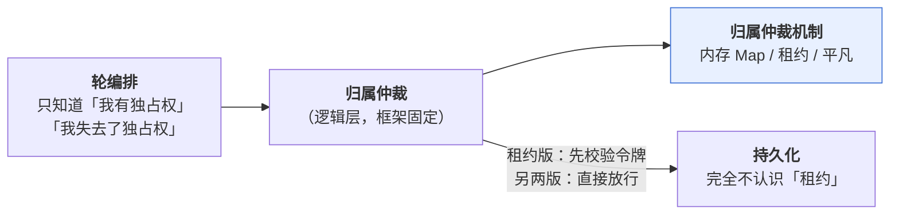

# 归属仲裁机制 — 技术方案

> 相关：[功能](../features/arbitration-impl.md)。
> **推导与完整论证在 [架构总纲 · 技术方案 §5 + 附录 A](../../../architecture/tech/agent-kernel.md)**——本文不复述，只补「机制这一侧」的落地形态。
> 宿主层那三样可替换能力：[沙盒](../../../host/contract/tech/sandbox.md) · [持久化](../../../host/contract/tech/persistence.md) · [流分发](../../../host/contract/tech/stream-fanout.md)。
> 依赖/延续：[优雅关闭与崩溃恢复](../../orchestration/tech/graceful-shutdown.md)（[交权](../../../terms.md)与收尾）· [排队与插话](../../orchestration/tech/steer-and-queue.md)（释放归属时的竞态）。
>
> **状态：接口已定稿、租约版已落地**（2026-09-01）。方法签名见 §8.1，三个时间参数的
> 定案见 §8.3/§8.4，施工进展见[施工计划](../plans/arbitration-impl.md)。

## 1. 一句话

**它是装饰器，不是基础设施**——把记录的写入包起来，让[轮编排](../../../terms.md)可以假装自己是单线程的。

## 2. 装饰器这个定位，推出两条很强的约束

**约束一：轮编排不该知道「[租期标识](../../../terms.md)」这个词。** 它只该知道「我有独占权」和「我失去了独占权（该停下）」。

**约束二：持久化接口完全不认识「租约」这个概念。** 正因如此，Durable Object 的 KV 存储也接得进来——它根本没有租约表。

由此还推出一条常被搞错的：**CAS（比对后再写）是租约版机制的要求，不是持久化的要求。**

## 3. 三种实现对照

> 本节是**横向对照**——三种实现的差异一眼看全。每一档在自己的宿主环境下怎么配，见 [Node 长驻](../../../host/node/tech/deployment.md)（内存 Map 与租约的分界线）· [Cloudflare](../../../host/cloudflare/tech/deployment.md)（平凡实现）· [Vercel](../../../host/vercel/tech/deployment.md)（租约版）。

| | 单进程 | 多进程共享 DB | Cloudflare Durable Object |
|---|---|---|---|
| **怎么实现** | 内存里一个 Map | 租约 + 心跳 + 令牌 | 什么都不做（平台保证单实例） |
| **有租期标识吗** | ❌ | ✅ | ❌ |
| **要 CAS 吗** | ❌ | ✅ | ❌ |
| **`holder` / 心跳落库吗** | ❌ | ✅ | ❌ |
| **有租约表吗** | ❌ | ✅ | ❌ |
| **独占是什么保证** | **真保证** | **尽力 + 可检测** | **真保证** |
| **落在哪个包** | `@nimbo/agent`（内置） | `@nimbo/persist-*`（与持久化同包） | `@nimbo/durable-object` |

## 4. 租约版：三个关键取舍

### 4.1 租期标识用调用方生成的 ULID，等值校验

校验用的是**等值判断**（`WHERE 会话 = ? AND 租期标识 = ?`），不是比大小。经典 fencing 文献要求递增，是因为那类场景（写 S3）存储不持有租约记录、只能记「见过的最大号」；**我们的租约和数据在同一个存储里**，直接跟当前值比更强也更简单。

所以：**只需唯一，不需递增** → 用调用方生成的 ULID，不用 `RETURNING`、不用回读，少一条适配器要求。**时间戳不行**——毫秒会撞，而抢占恰恰容易扎堆。

**粒度是「一次租期」，不是「一个进程」。** 不能拿 `holder` 当令牌：否则「A 失联 → B 接管 → B 挂 → A 重新抢占」时，A 滞留在网络里的旧写入会被放行。

### 4.2 两个机制分工，互相替代不了

| 机制 | 管什么 | 学名 |
|---|---|---|
| **租期标识** | **不写坏**——它只会拒绝，不会放行 | safety |
| **心跳** | **卡住的能被接管** | liveness |

只有令牌没有心跳：崩溃的会话永久卡死。只有心跳没有令牌：误判时两个持有者都能写，静默损坏。

### 4.3 保证不了独占，只能安全地失败

根因：**你没法知道远处那个节点是死了，还是只是联系不上。** 于是只能二选一——不做超时接管（崩溃即永久卡死），或做超时接管（一定存在误判窗口）。**本方案选后者。**

**最要紧的接口后果**：

> **轮编排的每一次写入都可能被拒绝，而且这是正常路径，不是异常。**

单进程版下这条路永远走不到，**但接口上必须有它**——否则换成租约版就是静默数据损坏。配套要求持久化把「条件不匹配」报成一个**可辨识的结果**，而不是泛泛的 `Error`（见[持久化 §4.1](../../../host/contract/tech/persistence.md)）。

> 完整推导（为什么不用事务、MySQL `affectedRows` 的坑、seq 空洞为什么无害）见 [架构总纲 · 技术方案 附录 A](../../../architecture/tech/agent-kernel.md)。

## 5. `holder`：框架原样透传，转发归接入层

`holder` 是**部署形态相关的不透明字符串**（k8s pod 地址 / DO id / Fly machine id），框架存它、传它，**不解释它**。

起轮 API 因此必须带上它。三种失败的处置完全不同，**不写清楚宿主很可能把第三种当成错误返回给用户**：

| 失败原因 | 处置 |
|---|---|
| `busy` | 409 |
| `shutting_down` | 503 |
| **`held_by_other`** | **转给 `holder`**——不是报错 |

## 6. 平凡实现：Durable Object 白送了整个模块

一个会话 = 一个 DO，`conversationId` 就是 DO 的 id，平台保证单实例、串行处理。所以这一档的归属仲裁机制**什么都不做**。

代价在别处：每个 DO 有自己独立的存储，「列出这个用户的所有会话」这种跨会话查询要另建索引（见[持久化 §6](../../../host/contract/tech/persistence.md)）。

> Durable Object 里的 "Object" 是**面向对象那个「对象」**，不是「对象存储」。Cloudflare 的对象存储是 R2。

## 7. 取舍与已知限制

- **刻意不叫「分布式锁」。** Kleppmann 那篇 *How to do distributed locking* 批的正是这个词——它暗示「拿到锁就安全了」。用这个名字会跟 §4.3 直接打架。
- **独占按会话保证，不按机器。** 跨会话的资源冲突（本机 CLI 那档多个会话共用一个项目目录）不在职责内。
- **多节点下行为集合变大**：会出现「一轮跑到一半被告知你已经不是主人了」。**测试要专门覆盖这条路。**
- **崩溃仍然不恢复**：进程被强杀走老路（补一条「已停止」），因为它没停在干净边界上。

## 8. 四个待定项：**全部定案**

原来这里列了四条「未定」。前两条在 `@nimbo/agent` 落地时（K2）就由代码答了，后两条
2026-09-01 由构建者拍板。**施工前请以本节为准，别再照着旧的 TODO 重新设计一遍。**

### 8.1 接口方法签名 —— ✅ 已答（K2）

`Arbitration`：`acquire` / `inspect` / `listStale` / `clearStale`；
`Grant`：`holder` / `signal` / `valid` / `nextSeq()` / `release()`。
见 [`packages/agent/src/arbitration.ts`](../../../../packages/agent/src/arbitration.ts)。

**注意没有显式的「续期」方法**——心跳是租约版实现内部的事，接口上看不见。这是对的：
按 §2 的约束一，轮编排不该知道「租期标识」这个词，自然也不该知道有心跳这回事。

### 8.2 「失去独占权」怎么通知 —— ✅ 已答（K2）

**两条路并行，缺一不可**：

| 路 | 形态 | 管什么 |
|---|---|---|
| **推** | `grant.signal` abort | 正在跑的那一轮立刻走既有的中断收尾（不需要任何新形状） |
| **拉** | `nextSeq()` 返回 `lost_ownership` | 保证**写入**不会漏过——信号可能来不及传播，但取号一定会撞上 |

### 8.3 心跳间隔与超时接管阈值 —— ✅ 定案 2026-09-01

**心跳 5 秒 / 判死 60 秒**（12 拍）。**这是两头都往保守挪的组合，不是折中**：

- **心跳快 → 老持有者更快知道自己出局**。它的心跳 CAS 打不中就说明令牌被换了，5 秒内
  就能 abort 掉正在跑的那一轮。这是 §4.2 的 **safety** 那一半。
- **阈值长 → 别人几乎不可能误接管**。要连丢 12 拍。这是**故意牺牲 liveness**：宁可崩溃
  后让用户多转一分钟圈，也不要出现两个写入方。

**两个代价，实现时不要偷偷抹掉**：① 崩溃后的接管延迟是 60 秒——想让用户早点知道，应该
在[接入层](../../../terms.md)提示「这一轮所在的节点失联了」，**而不是把阈值调小**；
② 写库频率是一个会话一条 UPDATE / 5s，1000 个并发会话约 200 QPS。

**校验**：阈值必须 ≥ 3× 心跳，`leaseArbitration()` 入参里**配错当场抛**。当前是 12×。

### 8.4 交权宽限期 —— ✅ 定案 2026-09-01

**15 秒**，直接复用 `@nimbo/agent` 的 `DEFAULT_SHUTDOWN_GRACE_MS`。两处用同一个数才不会
互相打架（k8s 的 `terminationGracePeriodSeconds` 默认 30 秒，留一半余量给连接关闭与进程退出）。
