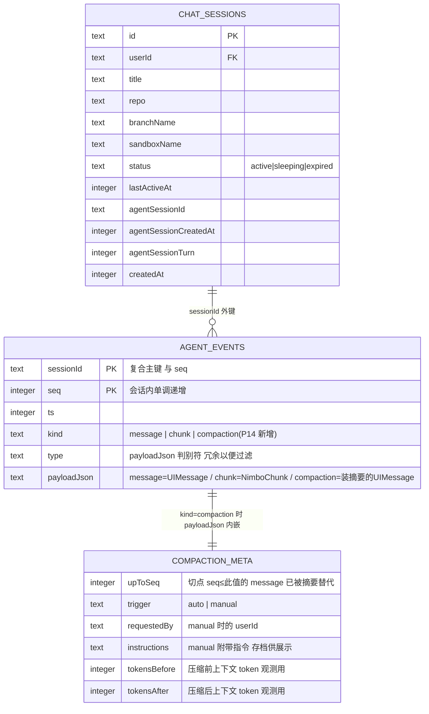
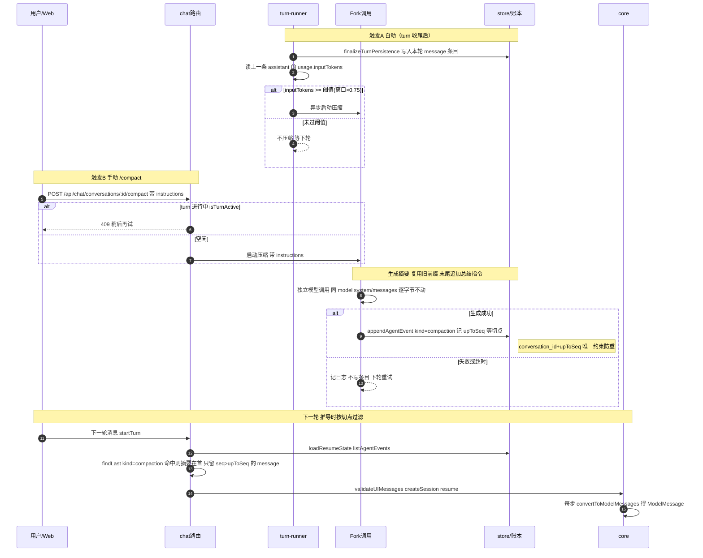

# 上下文压缩（compaction）· 技术方案

> 状态：设计待 review（2026-07-15）· 计划中（P14，依赖 single-ledger 落地）
> 相关：[产品视角](../features/compaction.md) · [施工进展](../plans/compaction.md) · 依赖 [single-ledger](../../orchestration/tech/single-ledger.md)（本方案的地基，P14 依赖 P13-5 落地）
> 参考：[tech/core-sdk](./core-sdk.md) §4.8（上下文管理 v1 显式上限）· [tech/sandbox](../../../host/contract/tech/sandbox.md)（账本流水与模型上下文的两层结构、责任划分）
> 术语：正文首次出现的术语链到 [terms.md](../../../terms.md)。

## 总原则

单[账本（ledger）](../../../terms.md)架构下，[上下文压缩（compaction）](../../../terms.md) = 往账本**追加**一种新条目（`kind: 'compaction'`，payload 仍是一条 [UIMessage](../../../terms.md)），读路径在「账本 → UIMessage[]」推导时改一个过滤条件。旧记录一行不动：展示层永远完整可回放，被替代的消息只是不再进入[模型上下文](../../../terms.md)。触发分手动（`/compact`，可带指令）与自动（token 阈值）两种，触发指令本身不进账本。

压缩发生在**模型上下文推导层**，账本保持 append-only 不变。全部改动收敛为四件事：

1. 一种新账本条目（`compaction`）；
2. 推导时的一个过滤（按[切点](../../../terms.md)排除已被摘要替代的消息）；
3. 一个触发器（自动 / 手动）；
4. 一次[摘要](../../../terms.md)生成调用（fork）。

**core 零改动，v1 全部落在 server**（见下方「责任划分」）。

## 领域模型：compaction 作为账本第三类条目

账本落在 server 的 `conversation_events` 表（`apps/node-server/src/db/schema.ts`）。今天该表的 `kind` 只有两类——`'message'`（一条已完成的 `NimboUIMessage`）与 `'chunk'`（进行中/崩溃 turn 的 durable `NimboChunk`）。本功能引入**并列的第三类** `'compaction'`。



> **读图说明**：`COMPACTION_META` **不是一张表**，而是 `kind='compaction'` 那一行 `payloadJson` 里 `metadata.compaction` 的形状。切点等簿记字段随 UIMessage 一起落在 `payloadJson`，不新增表列。
>
> **与当前 schema 的差异（P14 待落地）**：`apps/node-server/src/db/schema.ts` 现在的 `kind` 枚举是 `['message', 'chunk']`，`metadata.compaction` 也尚未加入 `NimboMessageMetadata`（`packages/core/src/state.ts`）。本图画的是**目标态**：`kind` 扩到三值、`NimboMessageMetadata` 增补 `compaction` 字段、并新增 `(conversation_id, upToSeq)` 唯一约束（见下）。

### compaction 条目的 payload 形状

```
kind:    'compaction'            // 与 message / chunk 并列的第三种条目
seq:     正常取号                 // 与 message/chunk 共用同一 seq 空间
payload: 一条 UIMessage：
  role:  'user'
  parts: [{ type: 'text', text: '<框定导语>\n<摘要正文>' }]
  metadata.compaction: {
    upToSeq: 700,                // 切点：seq ≤ 700 的 message 条目已被本摘要替代
    trigger: 'auto' | 'manual',
    requestedBy?: <userId>,      // manual 时
    instructions?: string,       // manual 附带指令（进摘要 prompt；此处存档供展示）
    tokensBefore, tokensAfter,   // 压缩前后上下文 token（观测用）
  }
```

**为什么 payload 仍是 UIMessage**——守住单账本「全系统只有一种落盘数据」的立身之本：既能直接进[官方转换器（`convertToModelMessages`）](../../../terms.md)，又能被时间线按部件渲染。

**role 为什么是 `user`**：线协议只有 system/user/assistant，没有「framework」角色。

- `assistant`：压缩后位于上下文首位，部分 provider 要求首条必须是 user（直接 400）；
- `system`：在各 provider 的中途 / 首位合法性与合并行为不一致（硬工程问题），且把从对话内容（含不可信工具输出）生成的摘要放进「按惯例被视为可信配置」的通道，只有下行没有收益——指令层级的实证服从并不可靠（IHEval：最强开源模型的冲突解决准确率仅 48%），提权换不来任何保证；
- `user` + [框定](../../../terms.md)导语是行业先例（Claude Code 同款），模型对这种框定注入的处理是被充分训练过的。

**线上角色 ≠ 展示身份**：与 [steer](../../../terms.md) 消息（`role=user` + `metadata.steered`）同一解耦模式——界面由 `kind` / metadata 驱动渲染，永远不会把摘要画成用户气泡。

**并发防重**：`(conversation_id, upToSeq)` 唯一约束，压缩竞态只落一条。

## 推导算法（server 组装恢复输入时）

推导发生在 `apps/node-server/src/routes/chat.ts` 的 `loadResumeState`——今天它把账本里 `kind === 'message'` 的行取出、`JSON.parse(payloadJson)` 后组装成 `SessionState`。本功能在这里**加一段切点过滤**：

```ts
const rows = loadLedger(sessionId);                        // 按 seq 升序
const cp   = findLast(rows, r => r.kind === 'compaction'); // 只认最新一条
const ledger = cp
  ? [cp.payload,
     ...rows.filter(r => r.kind === 'message' && r.seq > cp.payload.metadata.compaction.upToSeq)]
  : rows.filter(r => r.kind === 'message');
// ledger → validateUIMessages → createSession({ resume }) → core 每步 convertToModelMessages
```

- **seq 区间语义**：`(upToSeq, cp.seq)` 之间的 message 是压缩时的**保留尾巴**（seq > upToSeq，自然被包含）；`> cp.seq` 是压缩后的新消息。摘要放最前，顺序天然正确。
- **链式压缩免费获得**：下次压缩的输入 = 上一条摘要 + 其后消息，产出更大 `upToSeq` 的新条目；推导**只认最新**，旧 compaction 条目降级为纯展示历史。回滚 = 忽略最新条目，完整上下文随时可重建（原始数据从没离开过账本）。
- **切点永远安全**：UIMessage 里工具调用与结果在**同一条** assistant 消息的 parts 里（官方转换器才把它拆成 assistant + tool 两条 ModelMessage），切点落在 UIMessage 边界上就不可能切断 tool_call / tool_result 配对——结构保证，无需检查代码。

> 推导正确性由离线断言覆盖（见 [施工进展](../plans/compaction.md) 验收项 1–4：过滤、链式、转换合法性、并发防重），不依赖真机。

## 核心流程：触发 → fork 生成摘要 → 写条目 → 按切点过滤



代码锚点：自动触发挂在 `turn-runner/persistence.ts` 的 `finalizeTurnPersistence`（本轮 `kind='message'` 条目落库、`deleteChunkEventsAfter`、写 session header 之后）；手动触发是新端点 `POST /api/chat/conversations/:id/compact`，用 `turn-runner/registry.ts` 的 `isTurnActive` 判 409；推导过滤在 `routes/chat.ts` 的 `loadResumeState`；写条目复用 `store.ts` 的 `appendAgentEvent`（`getMaxEventSeq` 取号）。

### 触发

| 方式 | 判据 / 入口 | 说明 |
|---|---|---|
| **自动** | turn 收尾后检查：上一轮 assistant 消息 `metadata.usage` 的 `inputTokens ≥ 阈值` | 判据用 provider 回报的真实值，不做字符估算；阈值 = 配置的模型上下文窗口 × 比例（默认 **0.75**，env 可调） |
| **手动** | `POST /api/chat/conversations/:id/compact { instructions? }`；输入框 `/compact` 拦截转发 | turn 进行中返回 **409**；`instructions` 进摘要 prompt 并存档进 metadata |

**触发指令不进账本**：手动 `/compact` 是 API 命令不是对话消息，自动触发是内部决策——账本里只出现结果（compaction 条目）。

**竞态说明**：压缩在 turn 边界异步执行。若生成期间新 turn 已开始，新消息 seq > upToSeq，自然落在保留区间，无一致性问题；新 turn 的推导若发生在条目落库之前，用的是旧全量上下文，下一轮自然生效——**最终一致，无需加锁**。

### 摘要生成（fork）

- **一次独立的模型调用（fork）**：请求 = 现有上下文原样 + 尾部追加一条「按模板总结」的 user 指令。**必须复用原前缀**（同 model，system / messages 逐字节不动，只在尾部追加）——这是旧前缀的最后一次使用，能吃满[前缀缓存](../../../terms.md)；压缩落地后下一轮付一次冷写，属预期成本（见下）。
- **结构化模板**：任务目标 / 已完成事项 / 关键决策与理由 / 涉及文件路径与分支 / 未决事项与下一步。**文件路径必须显式要求保留**——模式 A 下文件真身在沙盒里，路径在手随时可重读，被压掉的文件内容丢失成本近乎零。手动触发的 `instructions` 追加在模板之后。
- **[保留尾巴](../../../terms.md)**：切点选在「最近 N 条 message 之前」（N 默认 10，可配）——近期消息原文保留，摘要只覆盖更早的跨度。
- **失败无害**：生成失败 / 超时不写条目、记日志、下轮触发时重试；摘要输出设 `maxOutputTokens` 预算，防摘要本身失控。

## 与前缀缓存的关系（取舍）

压缩必然改写前缀 → 整个 KV 缓存失效一次。因此压缩是**低频大动作**：

- 阈值设高（0.75）、两次压缩之间**严格 append-only**；
- 摘要 fork 复用旧前缀（生成调用本身命中缓存），压缩后**首轮冷写、随对话推进回暖**；
- **禁止任何「每轮小修小补上下文」的做法**——那会持续打碎前缀缓存。

## 责任划分：v1 全在 server，core 零改动

账本在 server（`conversation_events`），压缩本质是「宿主如何组装 resume 输入」的存储层策略——与沙盒重建同类，归宿主（[tech/sandbox](../../../host/contract/tech/sandbox.md) 责任划分的既有立场）。core 的 loop / session 不感知压缩：它拿到的就是一份合法的 `UIMessage[]`。

**core 内建压缩钩子**（供非 chat 宿主复用）列观察项，等第二个消费者出现再抽象——不在 v1 提前设计。

## 已知限制

- **压缩是缓解不是保证**：真撞墙仍需 v1 的 `context_overflow` 显式报错兜底。
- **前缀缓存周期性失效**：每次压缩使 KV 缓存整体失效一次，首轮冷写是预期成本。
- **记忆变粗**：早期细节被摘要级替代；虽然原文仍在账本、文件真身仍在沙盒，但模型在被压掉的跨度上依赖摘要质量。
- **摘要质量依赖模型**：`maxOutputTokens` 只防失控，不保证内容质量；结构化模板 + 显式保留文件路径是主要缓解手段。
