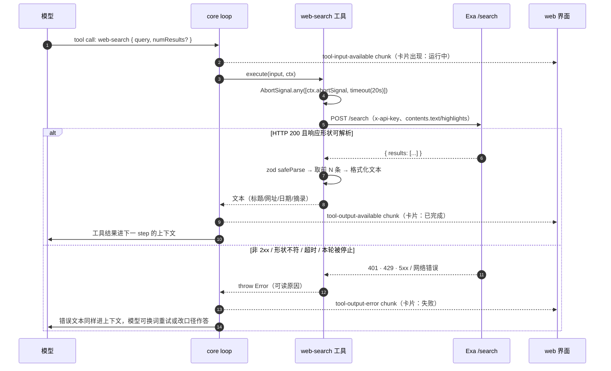

# 联网搜索（web search）· 技术方案

> 相关：[产品文档](../features/web-search.md) · [施工进展](../plans/web-search.md) · [chat 应用技术方案 §4/§6](../../../ingress/tech/chat-webapp.md) · [内置工具技术方案](./builtin-tools.md) · 术语见 [docs/terms.md](../../../terms.md)
> 无 DB 改动（不建表、不加列、不落盘任何搜索数据），故本篇无业务数据领域设计图；核心流程时序图见 §4。

## 1. 落点：为什么在 `apps/node-server`，不在 `packages/*`

`@runko/core` 的[内置工具](../../../terms.md)有一条隐含契约：**零凭证、零网络、宿主什么都不配也能用**（文件八件套、`update-plan`）；`bash`/`load-skill` 是[条件内置](../../../terms.md)，条件也只是「宿主注入了 `RunkoExec` / 配了 skills」这种进程内能力，不是外部账号。联网搜索要一个第三方 API key、按次计费、要走公网——把它塞进 core，等于让每个 SDK 用户被动继承一个外部依赖和一份账单面。

所以它落在 chat 应用侧，形态与 `ask-user` 完全同构（[chat-webapp §6](../../../ingress/tech/chat-webapp.md)）：

| | `ask-user` | `web-search` |
|---|---|---|
| 定义在 | `apps/node-server/src/agent/chat-agent.ts` | `apps/node-server/src/agent/web-search.ts` |
| 注册条件 | `BuildSessionOptions.onAskUser` 存在 | `EXA_API_KEY` 有值（或显式注入 `webSearchTool`） |
| 注册方式 | `defineAgent({ tools: { ... } })` | 同左 |
| core 改动 | 无 | 无 |
| changeset | 不需要（`apps/*` 是 `private: true`） | 同左 |

**工具名对模型暴露为 `web-search`，不是 `exa-search`**：工具名会进[账本](../../../terms.md)（部件类型 `tool-web-search`）并出现在模型上下文里，与供应商解耦能让将来换家不必改历史数据和指令。文件名与配置项则照实叫 `EXA_API_KEY`——那是运维要认的东西，含糊反而坑人。

## 2. 对接方式：`fetch` 直调 REST + zod 校验

只用 Exa 的一个端点：`POST https://api.exa.ai/search`，认证走 `x-api-key` 请求头。**不装 `exa-js` SDK**——一个端点不值一个依赖；更要紧的是 SDK 的 TypeScript 类型只是编译期声明，字段缺失/改名在运行时照样穿透，仍得补一层运行时校验。直接 `fetch` + zod `safeParse` 一步到位，也正好落在本仓库「优先 zod 推导类型、不写 `as`」的类型纪律上（[根 CLAUDE.md](../../../../CLAUDE.md)）。

**请求体**（`buildRequestBody`）：

```jsonc
{
  "query": "<模型给的自然语言查询>",
  "type": "auto",                 // 让 Exa 自己选神经/关键词检索
  "numResults": 5,                // 模型可覆盖，钳在 1..10
  "contents": {
    "text": { "maxCharacters": 1200 },  // 正文截断在服务端做，省一次往返也省上下文
    "highlights": true                   // 与查询最相关的几段摘录
  },
  "category": "news",             // 可选，模型给了才带
  "includeDomains": ["vitest.dev"] // 可选，同上
}
```

三个已知的过时写法**刻意不用**（Exa 官方 "Common Mistakes" 列表）：`useAutoprompt`（已废弃）、`highlights.numSentences`/`highlightsPerUrl`（已废弃，传 `true` 即可）、`livecrawl: "always"`（已由 `contents.maxAgeHours` 取代）。

**响应校验**（`exaSearchResponseSchema`）：字段一律 `.nullish()` 的宽松 schema，只认这一版真正要用的几个（`results[].{title,url,publishedDate,author,text,highlights}`），其余交给 zod 默认的 strip 丢掉。原则是**多给的字段不报错、少给的字段不炸**——第三方响应形状随时会变，这层的职责是保证「不管它给什么，工具都能给模型一段确定形状的文本」。

## 3. 工具契约

**输入**（zod schema，模型可见）：

| 字段 | 类型 | 必填 | 说明 |
|---|---|---|---|
| `query` | string（非空） | 是 | 自然语言查询，鼓励写长句、写清意图（Exa 是语义检索，关键词堆砌反而差） |
| `numResults` | int 1..10 | 否 | 默认 5 |
| `category` | 枚举：`company` / `people` / `research paper` / `news` / `personal site` / `financial report` | 否 | Exa 的内容类别过滤 |
| `includeDomains` | string[]（≤20） | 否 | 只要这些站点的结果 |

刻意**不暴露**给模型的：`excludeDomains`、发表日期区间、`type`、`contents` 细项。理由是每多一个旋钮，模型填错/乱填的概率就多一分，而这四个字段已经覆盖前述三类场景；真需要再加。

**输出**：一段纯文本（`ToolReturn` 的 string 形态，与 `update-plan`/`grep` 等的惯例一致），每条结果四行——序号+标题 / 网址 / 发表日期·作者（有才写）/ 摘录。摘录优先取 `highlights`（最多 3 段），没有就退回 `text` 截断到 500 字符。零结果时返回一句 `No results...`，**不是**空串也不是抛错——「搜到了但没东西」是正常结果，不是失败。

**`readOnly: true`**：不写工作区、不产生[文件变更项](../../../terms.md)/plan 派生数据，符合 `Tool.readOnly` 的字面语义，让 loop 在同批全只读时并行结算。注意 readOnly 说的是「对工作区无副作用」，不是「对世界无副作用」——它确实会花钱，这一点由产品文档告知用户，不由 readOnly 表达。

**不设 `approval`**：联网只读检索既不改仓库也不用用户的 GitHub 权限，与 `git push`/`rm -rf` 那类外发动作不是一个量级，默认放行。要拦也拦得住——`CHAT_APPROVAL_MODE=all` 只 gate workspace 的 bash，不覆盖应用级工具；真要给 `web-search` 加人审，得在 `classifyApproval` 里按工具名加一档，属于未来工单。

## 4. 核心流程



## 5. 配置与注册

```
EXA_API_KEY=            # 仓库根 .env（.env.template 已列），server 进程读
```

- **读取时机是懒的**：`resolveWebSearchConfig(env = process.env)` 在 `buildSession()` 里调用（每轮一次），不在模块加载期读——与 `model.ts` 的 `resolveModel()` 同款纪律，保证 `generate:openapi` / `typecheck` 这类只 import 不跑的场景不会因为没配凭证就炸。改了 `.env` 重启 server 即生效。
- **缺席即不注册**：key 空/未设时 `createWebSearchTool` 根本不被调用，`agent.tools` 里没有这一项。模型看不见 → 不会调 → 不会出现「调用了不可用工具」的失败卡片（对照 `chat-agent.test.ts` 里 `ask-user` 未注册时的 `unavailable tool` 行为）。
- **key 不进沙盒**：它只活在 server 进程的 `process.env` 与这一个模块的闭包里，既不写进沙盒环境变量（对照 `$GH_TOKEN` 是**故意**放进沙盒的），也不进任何 prompt。模型只能通过工具间接使用。
- **可注入**：`BuildSessionOptions.webSearchTool?: Tool` 优先于 env 解析——测试注入假工具用，也给将来「按会话配 key」留了口子。

## 6. 错误处理

全部收敛成「抛 `Error`，让 loop 落 `tool-output-error`」，因为 errorText 会一并进模型上下文（`loop.ts` 的 `outputErrorPart`），模型看得到原因就能自救（换关键词、或直说查不到）。分档：

| 情形 | 给模型的文案 |
|---|---|
| 401 / 403 | `Exa rejected the request (HTTP 401) — the server's EXA_API_KEY is missing or invalid.` |
| 429 | `Exa rate-limited this request (HTTP 429) — wait a moment before searching again.` |
| 其他非 2xx | `Exa search failed (HTTP <code>): <响应体前 200 字符>` |
| 响应 JSON 解不动 / 形状不符 | `Exa returned an unexpected response shape.` |
| 20s 超时 | `Exa search timed out after 20s.` |
| 本轮被[停止](../../../terms.md) | 原样上抛 abort 错误——不伪装成搜索失败，让 loop 按 `aborted` 收尾 |

超时与停止共用一个信号：`AbortSignal.any([ctx.abortSignal, AbortSignal.timeout(timeoutMs)])`。二者的区分靠事后看 `ctx.abortSignal.aborted`——真就是用户停止了本轮，假就是自家超时。`timeoutMs` 缺省 20s，可经 `CreateWebSearchToolOptions.timeoutMs` 注入毫秒级值——测试据此**真跑**出超时分支（不 mock 计时器，也不必等 20 秒）。

## 7. 已知限制

1. **只接 `/search`**：不读单页全文（`/contents`）、不用 `/answer`。agent 要精读某个网页，走沙盒里的 `curl`。
2. **无缓存无配额闸**：每次调用一次真实请求、一次计费。控成本靠默认 5 条 + 模型自律，服务端不设「每轮最多搜几次」。真烧钱了再加闸。
3. **全局一份 key**：所有会话、所有用户共用 server 的 `EXA_API_KEY`，用量不按会话/用户分账。
4. **结果不落盘**：搜索结果只以工具输出的形式存在于账本的工具部件里，不另建表、不做检索。
5. **`CHAT_APPROVAL_MODE=all` 管不到它**：那一档只把 workspace 的 bash 升到人审，应用级工具不在其射程内（见 §3 末）。
