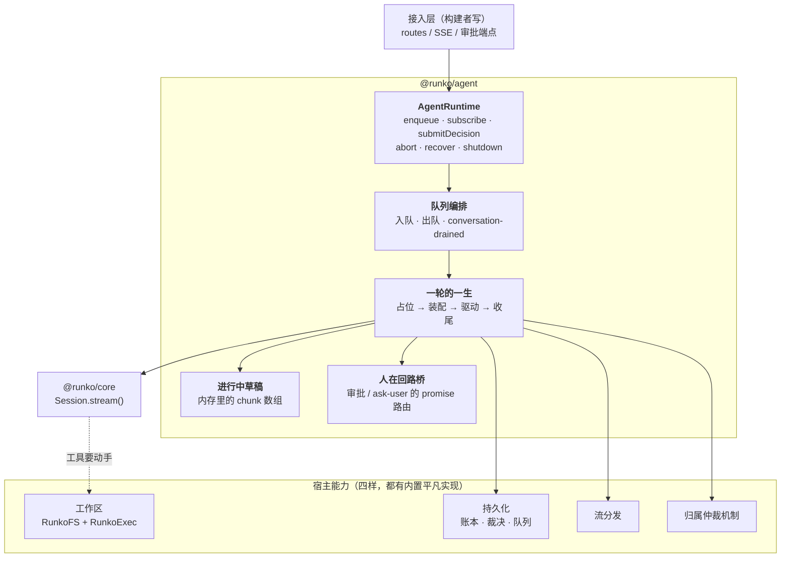
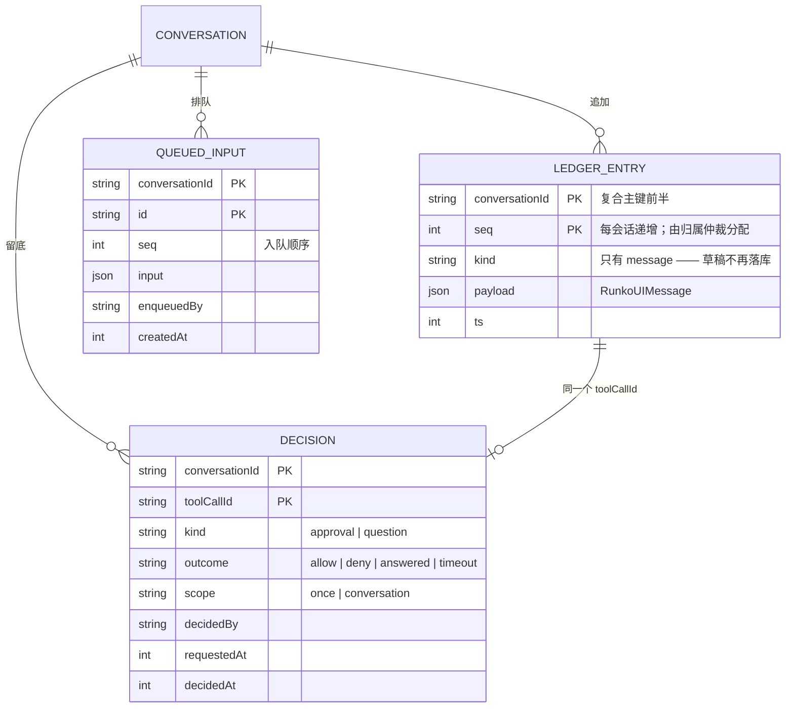
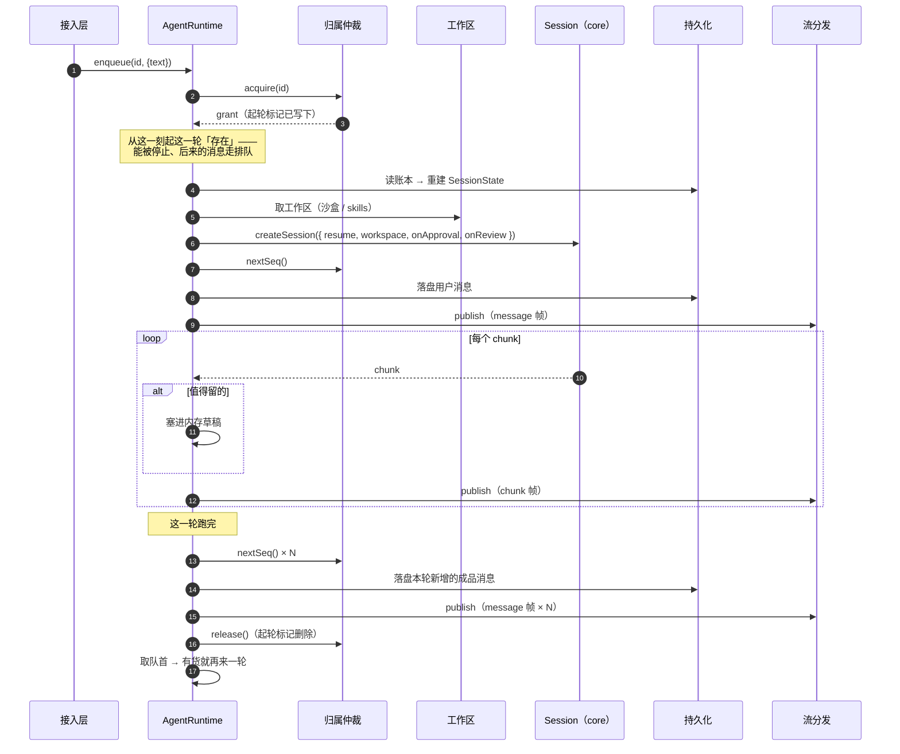
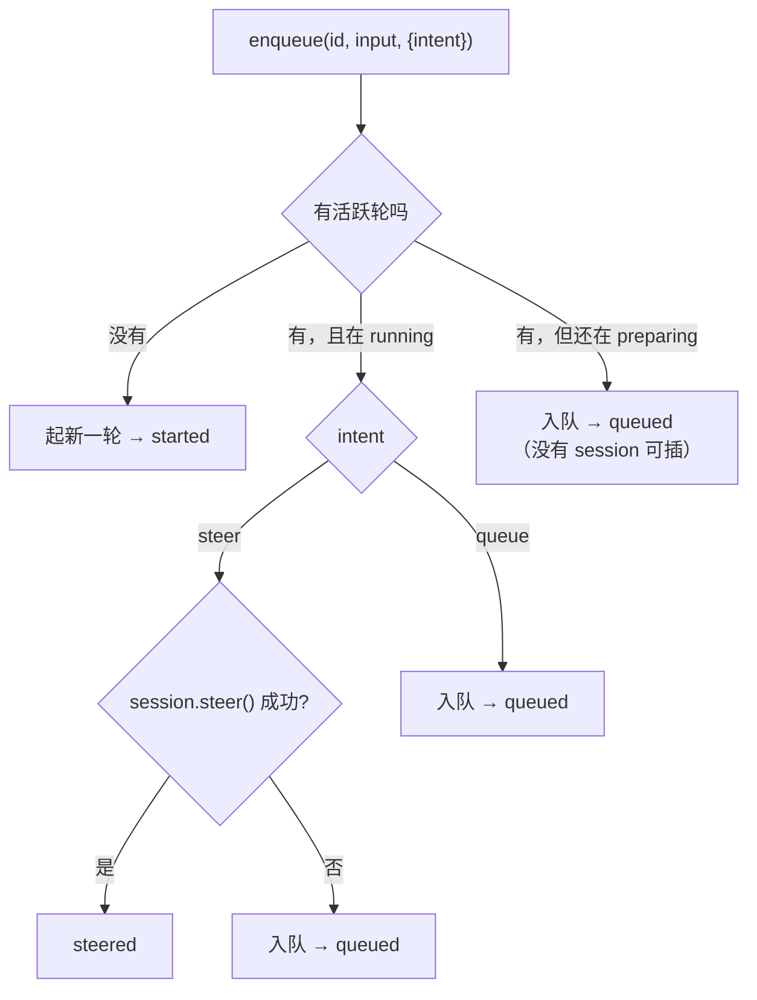

# 轮编排运行时 `@runko/agent` — 技术方案

> 相关：[功能](../features/agent-runtime.md)，[施工进展](../plans/agent-runtime.md)。
> **推导与论证在 [架构总纲 · 技术方案](../../../architecture/tech/agent-kernel.md)**——分层为什么这么切、独占为什么是推出来的、租期标识为什么只需唯一，本文一概不复述，只写**落地的接口与流程**。
> 依赖/延续：[持久化契约](../../../host/contract/tech/persistence.md) · [流分发契约](../../../host/contract/tech/stream-fanout.md) · [归属仲裁机制](../../arbitration/tech/arbitration-impl.md) · [进行中草稿放内存](./in-flight-draft.md) · [排队与插话 §8](./steer-and-queue.md) · [优雅关闭](./graceful-shutdown.md) · [停止一轮](./turn-abort.md)。

## 1. 一句话

**`Session` 管一轮，`AgentRuntime` 管一轮接一轮**——中间隔着四个可替换的宿主能力，和一张只写成品的账本。

## 2. 模块地图



**依赖方向单向**：接入层 → 运行时 → 宿主能力；运行时 → core。core 不认识运行时，宿主能力不认识运行时。

## 3. 数据模型

三张表（[架构总纲 §3](../../../architecture/tech/agent-kernel.md) 那四张里去掉租约表——租约表属于租约版[归属仲裁机制](../../../terms.md)，本批不做）。



**三条约束**（其余见架构总纲）：

1. **`kind` 只有 `message`**。[进行中草稿](../../../terms.md)搬进内存后账本只写成品——`seq` 的含义从「第几条落盘记录」收敛成「第几条消息」，删除逻辑与「这一轮从第几号开始」两个概念一起消失。
2. **seq 由[归属仲裁](../../../terms.md)分配**，不由 DB 生成。seq 会出现空洞（占了号但插入失败），**已确认无害**——回放按序、断线续传游标、主键去重三个用途都不要求连续。
3. **裁决表是纯审计表**。人的答复走内存 promise 路由到正在跑的那一轮；落库是为了留底与将来的[挂起恢复](#7-为挂起k3留的位置)，**不是**为了当前这一轮读它。

## 4. 四个宿主能力的接口

### 4.1 工作区（沙盒）

最简单的一个——一个工厂函数，框架只消费不管创建：

```ts
export interface TurnPreparation {
  fs?: RunkoFS;
  /** 注入即激活 core 的内置 `bash` 工具 */
  exec?: RunkoExec;
  /** 同源工作区（模式 A）：一个对象同时实现两个接口。与 `fs`/`exec` 互斥 */
  workspace?: RunkoFS & RunkoExec;
  /** 这一轮额外要装的 skill（宿主从沙盒里扫出来的） */
  skills?: Skill[];
  /** 只对这一轮生效的 instructions 追加 */
  instructionsAppend?: string;
  /** 其余可选项（覆盖模型 / 覆盖 instructions / 宿主自己的工具 /
      审批分类器 / 遥测 / 喂给模型的文本 / dispose）见 `packages/agent/src/prepare.ts` */
}

export type TurnPreparer = (ctx: {
  conversationId: string;
  input: TurnInput;
  turnNumber: number;
  signal: AbortSignal;
}) => TurnPreparation | Promise<TurnPreparation>;
```

> 选项名就叫 **`prepareTurn`**（不是 `workspace`）——它交付的不止工作区，还有这一轮的模型、
> skill、工具与审批分类器，「装配这一轮」才是它真正在做的事。

**生命周期归轮编排管、创建归宿主管**（[架构总纲 §2.2](../../../architecture/tech/agent-kernel.md) 的判据二）：框架在每一轮[起轮装配](../../../terms.md)时调它一次，拿到的东西只在这一轮用。[保活](../../../terms.md)已经下沉在适配器里，框架不插手。

### 4.2 持久化

**领域接口，不暴露表长什么样**（[持久化契约 §4](../../../host/contract/tech/persistence.md) 准则 1）：

```ts
export interface LedgerStore {
  /** 追加一条成品消息。`seq` 由调用方（归属仲裁）给定 */
  append(entry: LedgerEntry): Promise<WriteResult>;
  /** 从某点之后读（断线续传游标）；不传 afterSeq 读全部 */
  read(conversationId: string, opts?: { afterSeq?: number }): Promise<LedgerEntry[]>;
  /** 当前最大 seq；0 表示这个会话还没有任何记录 */
  maxSeq(conversationId: string): Promise<number>;
}

export type WriteResult =
  | { ok: true }
  /** 条件不匹配——租约版下轮编排已经不是持有者了。**这是正常路径** */
  | { ok: false; reason: "rejected" };
```

`DecisionStore`（`record` / `settle` / `listPending`）与 `QueueStore`（`enqueue` / `dequeue` / `list` / `remove` / `clear` / `requeueFront`）同款姿态。**出队必须是一个原子方法**——不假设事务能跨接口（准则 4）。

内置 `memoryPersistence()` 三样全给，进程内 Map，够跑通够写测试。

### 4.3 流分发

**发布/订阅，不是存/取**（[流分发契约 §3](../../../host/contract/tech/stream-fanout.md)）：

```ts
export interface StreamFanout {
  publish(conversationId: string, frame: LiveFrame): void;
  /** 「拿快照 + 挂订阅」必须是一个动作——这里的动作就是「返回时订阅已挂上」 */
  subscribe(conversationId: string, listener: (frame: LiveFrame) => void): () => void;
}
```

内置 `inProcessStream()` 是一个 `Map<string, Set<listener>>`。**注意 `subscribe` 是同步的**——那条「先挂监听、再取快照，中间不能有 `await`」的硬要求（[进行中草稿 §5.4](./in-flight-draft.md) 坑一）只有在它同步时才写得出来。

### 4.4 归属仲裁机制

**它是装饰器不是基础设施**（[归属仲裁机制 §2](../../arbitration/tech/arbitration-impl.md)）——轮编排只知道「我有独占权」和「我失去了」：

```ts
export interface Arbitration {
  acquire(conversationId: string, ctx: AcquireContext): Promise<AcquireResult>;
  inspect(conversationId: string): Promise<OwnershipInfo>;
  /** 谁都没在跑、但库里还留着[起轮标记](../../../terms.md)的会话——启动扫描用 */
  listStale(): Promise<StaleOwnership[]>;
}

export interface AcquireContext {
  /** 这个会话账本当前的水位——内存版据此初始化 seq 计数器 */
  seedSeq: () => Promise<number>;
}

export type AcquireResult =
  | { ok: true; grant: Grant }
  | { ok: false; reason: "busy"; holder: string | undefined };

export interface Grant {
  readonly conversationId: string;
  /** 失去独占权时 abort —— 轮编排把它 merge 进这一轮的 signal */
  readonly signal: AbortSignal;
  /** 取号。**返回结果类型不抛错**，理由见 §4.5 */
  nextSeq(): Promise<SeqResult>;
  release(): Promise<void>;
}

export type SeqResult =
  | { ok: true; seq: number }
  | { ok: false; reason: "lost_ownership" };
```

内置 `inProcessArbitration({ holder })` 是一个 `Map<conversationId, entry>`，`signal` 永不 abort，`nextSeq` 永远 `ok`。

### 4.5 为什么写入失败用结果类型而不是抛错

> **轮编排的每一次写入都可能被拒绝，而且这是正常路径，不是异常。**

异常通道会诱导调用方 `try/catch` 成「出错了」并报 500，而正确处置是**按中断收尾**。更要命的是 TypeScript 不检查异常：单进程版下这一支永远走不到，不写也能编译过，**换成租约版就是静默数据损坏**。结果类型逼你在每个调用点显式写这一支。

## 5. 一轮的一生



### 5.1 五个阶段与它们的失败处置

| 阶段 | 干什么 | 失败了怎么办 |
|---|---|---|
| **占位** | `arbitration.acquire` 写下[起轮标记](../../../terms.md) | `busy` → 调用方按「已有轮在跑」处理；关闭中 → `rejected` |
| **装配** | 读账本 → 取工作区 → 建 session | `release()` 撤销占位；被停止过就补两帧（用户消息 + 已停止） |
| **驱动** | 消费 `session.stream()` | 生成器抛错 → 合成一条 `status:'failed'` 收尾帧 |
| **收尾** | 落盘本轮新消息 → 清草稿 | 取号被拒 → 按「失去独占权」中断，不重试 |
| **交棒** | `release()` → 出队起下一轮 | 出队起轮失败 → `requeueFront` 放回队首，**不重试、不设定时器** |

**「占位」提前到装配之前**是硬要求：装配可能要好几秒（取沙盒、扫 skill），这段窗口里若登记表是空的，用户按停止会被当成「没有轮可停」，同会话后来的消息会被当成「可以起新轮」——两个都是错的。

**`release()` 严格在「从活跃表删除」之后再触发出队**：否则下一轮会被自己这一轮的占位挡掉。

### 5.2 收尾的写入顺序

一轮的成品消息**整批一次写完**，中间不发布任何 `message` 帧给订阅者，写完再一起发。理由是「重连请求不可能看到写了一半的状态」——要么看到旧的（草稿还在、轮还在跑），要么看到新的（成品齐了、轮结束了）。

## 6. 排队、插话与 `conversation-drained`

### 6.1 `enqueue` 的判定表

判定全在框架里做一次（[排队与插话 §8](./steer-and-queue.md)）：



> **`steer()` 报 false 一律转排队，不回落去起新一轮。** 回落是错的：这一轮的
> [起轮占位](../../../terms.md)还在，新起的那一轮必然被它自己挡成 `busy`。真正会走到
> 这里的是「还卡在起轮装配里、还没有 session 可插」，转排队后它收尾时会自动出队，
> 用户的话不会丢。至于「这一轮刚好结束」那个窄竞态——那时登记表里已经没有它了，
> 走的是最上面「没有活跃轮」那一支。

**入队之后还要兜一次底**：如果此刻发现没人持有归属（上一轮刚释放完、还没来得及看队列），入队方自己抢来开轮。这就是 [`conversation-drained`](../../../terms.md) 的配套——框架释放归属时发一个**诚实的断言**（「我放手的时候队列是空的」），写入方负责兜底。**这套在 `enqueue` 内部实现一次，构建者不需要知道有竞态。**

### 6.2 队列不进账本

排队消息是「尚未发生的意图」（可删可清可改序），账本记「已发生的事」（`message` 行永不删除、seq 被回放/续传两处依赖）。塞进账本会同时破坏这两条。

## 7. 为挂起（K3）留的位置

本批**不做**[挂起](../../../terms.md)与恢复，但接口已经按它的需要定形，将来加的时候不用改形状：

| 挂起需要什么 | 本批已经有了 |
|---|---|
| 裁决要能跨进程读回来 | `DecisionStore` 已落库（本批是纯审计表） |
| 恢复算「开新的一轮」 | 一轮的一生本来就是可重入的——`enqueue` 走一遍即可 |
| 收尾要有第四种状态 `suspended` | 收尾状态是 core 给的，本批仍是三种；加一种不影响本包结构 |
| 「正在等人」这个信号 | 人在回路桥已经知道自己挂着谁，只差一个定时器把它变成「落盘退出」 |

**卡在哪**：core 的「恢复开轮」入口怎么加（扩展 `stream` 入参 vs 并列一个 `settleAndRun(callId, result)`）还没定，见[架构总纲 · 施工进展](../../../architecture/plans/agent-kernel.md)「还没定的」第 3 条。**在那之前动 core 的 loop 很可能返工**，所以本批停在这里。

## 8. 取舍与已知限制

- **一个会话同时最多一轮**——这是[独占](../../../terms.md)在单进程下的形态，不是限制。
- **内置实现全是进程内的**：进程重启，内存账本、进程内流、内存归属表一起没。要留住就换掉持久化（`apps/node-server` 就是这么做的）。
- **崩溃仍然不恢复**：进程被强杀走老路（启动扫描补一条「已停止」），因为它没停在干净边界上。
- **出队失败不自动重试**：放回队首，靠「下一次有轮收尾」自然重试——避免沙盒持续不可用时后台无限重试烧钱。
- **多节点行为不在本批**：`Arbitration` 的接口能表达「一轮跑到一半被告知你不是主人了」（`grant.signal` + `nextSeq` 的 `lost_ownership`），但**没有实现能真的触发它**，所以这条路径目前只有单测覆盖（用一个会主动失效的假 `Grant`）。

## 9. 与 `apps/node-server` 的对接

迁移把 chat 应用里这些东西整个删掉，换成运行时装配（见[施工进展](../plans/agent-runtime.md)的对照表）：

| 删掉的 | 换成 |
|---|---|
| `agent/turn-runner/`（9 个文件） | `runtime.enqueue` / `abort` / `shutdown` |
| `agent/turn-launcher.ts` | `workspace` provider + `runtime` 装配 |
| `agent/crash-recovery.ts` | `runtime.recover()` |
| `store.ts` 里队列那一段 | `QueueStore` 的 drizzle 实现 |

**保留在 chat 层的**（它们是产品决策，不是框架职责）：审批分类器与危险命令清单、[会话级授权](../../../terms.md)、沙盒 provider 选择与建盒、[skill 清单](../../../terms.md)缓存、遥测、推送通知。

`apps/node-server` 自己实现 `Persistence`（drizzle over 既有的 `conversations` / `conversation_events` 表），**不引入第二套数据访问方式**——这也正好是对领域接口的真实检验。

---

# 附录

## 附录 A：内存草稿与重连的幂等

重连时把整份草稿从头重发一遍，不需要给草稿编号。三步就能说清：

1. 草稿总是从一个 `start` chunk 开头，而它**自带消息 id**（core 生成的）。
2. 前端收到 `start` 就按这个 id 开一条新消息，后面的内容全往它身上贴。
3. 贴完**按 id 覆盖**已有的那条——不是追加。

所以「同一份输入算两遍」和「算一遍」结果一样。工具调用同理：同一个 callId 的结果重复发一次，只是把同一张卡片再覆盖一次。

**顺序有个坑**：必须先挂订阅、再取草稿快照。反过来的话中间到达的 chunk 既不在快照里、也没被订阅到——那才是真丢。因为 `StreamFanout.subscribe` 是同步的、Node 又是单线程，这两步之间写不出 `await`，结构上就没有缝。

## 附录 B：人在回路桥为什么一个事件都不发

审批「正在等人」这件事的可见性是 core 自己的 `tool-approval-request` chunk（loop 是**先 yield 它、再 `await onReview`**），结果的可见性是随后的 `tool-approval-response`。两者都随 `session.stream()` 正常流转，桥不需要（也绝不该）再宣告一遍——多发一遍就是两份互相打架的状态。

`ask-user` 同理：它挂起/已答的状态就是 `tool-ask-user` 部件自己的 `input-available`/`output-available`，在 loop 眼里就是一次普通工具调用。

**桥唯一多做的一件事**是：一轮被[停止](../../../terms.md)时，把挂着的 promise 就地结掉。abort 信号对一个普通的 `await` 毫无作用——这是整个功能里唯一一处「光有 abort 信号不够」的地方。

## 附录 C：本批未采纳的备选

| 备选 | 为什么不 |
|---|---|
| 把 seq 分配藏进 `LedgerStore.append` | 违反「seq 由归属仲裁分配」——`MAX(seq)+1` 与 sequence 都是方言特性，通用适配器表达不了 |
| `Grant.nextSeq()` 抛 `OwnershipLostError` | 见 §4.5：异常通道让正常路径被当故障，且 TS 不检查异常 |
| 顺带做 `@runko/persist-sql` | `apps/node-server` 已有 drizzle schema，硬塞会造出第二套数据访问方式 |
| 队列放账本表 | 见 §6.2 |
| 运行时自己序列化 SSE | 框架不碰 HTTP（[架构总纲 §9](../../../architecture/features/agent-kernel.md)）——给中立 `AsyncIterable`，怎么序列化归接入层 |
