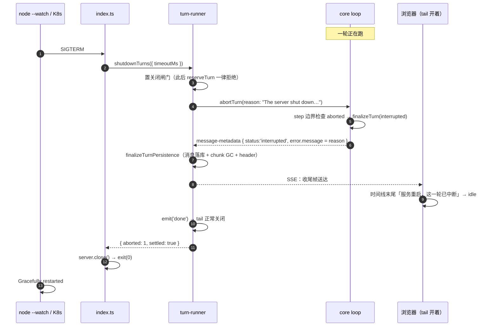
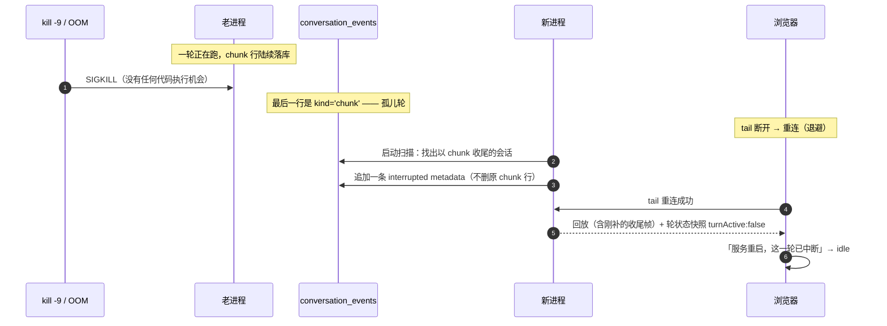

# 优雅关闭与崩溃恢复（技术方案）

> 相关：[功能](../features/graceful-shutdown.md)，[施工进展](../plans/graceful-shutdown.md)。
> 依赖/延续：[停止本轮](./turn-abort.md) §3（`abortTurn` 与[起轮占位](../../../terms.md)，本方案整个建在它上面）· [chat webapp](../../../ingress/tech/chat-webapp.md) §5.1（[轮状态快照](../../../terms.md)，界面层的第三道防线）· [核心 SDK](../../engine/tech/core-sdk.md) §4.2（`TurnOptions.signal`）。
> 术语一律以 [../terms.md](../../../terms.md) 为准（**优雅关闭**、**孤儿轮**、[轮](../../../terms.md)、[step](../../../terms.md)、[账本](../../../terms.md)、[停止](../../../terms.md)）。

## 1. 方案总览：三道防线，各兜一个洞

进程消失分两种，能做的事完全不同：

| 关闭方式 | 有没有机会执行代码 | 走哪道防线 |
|---|---|---|
| `node --watch` 热重载、`kill`、Ctrl-C、K8s pod 迁移 | **有**（SIGTERM/SIGINT） | 防线 1：优雅关闭 |
| `kill -9`、OOM、断电、容器被硬杀 | **没有** | 防线 2：启动时扫孤儿轮 |

两道防线都只管**账本**（把「中断了」这件事记下来）。界面层还有独立的第三道：

- **防线 3（已完成）**：[轮状态快照](../../../terms.md)——tail 每次连上，服务端都下发「此刻到底有没有轮在跑」。它不依赖账本，所以即便前两道都没生效，界面也不会卡在假流式态。见 [chat-webapp §5.1](../../../ingress/tech/chat-webapp.md)。

### 1.1 关键事实：`node --watch` 发 SIGTERM，而且**无限期**等我们

这是本方案能成立的前提，实测所得（Node v24.11.1，探针见[附录 A](#附录-a实测记录node---watch-的关闭语义)）：

- 重启时发 **SIGTERM**（另有 `--watch-kill-signal` 可改）。
- 打印 `Waiting for graceful termination...` 后**无限期等待**——故意赖着不退的进程 29 秒后仍未被强杀，且**新进程在此期间不会启动**（所以也不存在端口抢占）。

两个结论：

1. dev 侧我们有充足时间收尾，不必抢。
2. **超时上限必须我们自己写**。否则一个卡住的收尾会让热重载永久卡死（改一行代码，服务再也起不来）。生产侧方向相反但结论相同：K8s 的 `terminationGracePeriodSeconds`（默认 30 秒）是硬墙，我们的上限必须明显小于它。

### 1.2 改动落点

| 层 | 文件 | 改什么 |
|---|---|---|
| core | `packages/core/src/loop.ts` | 因 abort 收尾时，`RunkoError.message` 优先取宿主给的 `signal.reason`（patch，见 §2） |
| server | `agent/turn-runner/`（`shutdown.ts`·`abort.ts`） | `shutdownTurns()`（中止全部 + 等收尾 + 超时）· `isShuttingDown()` 闸门 · `abortTurn` 支持传 reason |
| server | `agent/turn-launcher.ts` | `reserveTurn` 被闸门拒时报新的 `reason: 'shutting_down'` |
| server | `routes/chat.ts` | 该 outcome → `503` |
| server | `agent/crash-recovery.ts`（新） | 启动时扫[孤儿轮](../../../terms.md)、补收尾行 |
| server | `index.ts` | 注册 SIGTERM/SIGINT；启动时跑一次崩溃恢复 |
| web | `components/turn-marker.tsx` | `aborted` 分两档文案：「已停止」/「服务重启，这一轮已中断」 |

**没有 DB 改动**：孤儿轮的收尾行走的是既有的 `conversation_events`（`kind = 'chunk'`，一条 `message-metadata`），没有新实体、没有新列。

## 2. core：把宿主的中止原因透出去（patch）

`loop.ts` 有两处因 abort 收尾，两处的 `message` 都不带宿主的信息：

- **step 边界检查**（`if (abortSignal.aborted)`）：硬编码 `"Turn aborted by the host before this step began."`。
- **catch 分支**：`describeError(error)`——那是 AI SDK 抛的 `AbortError`（"This operation was aborted"），第三方库的措辞。

改成两处都优先取 `abortSignal.reason`：

```ts
function abortMessage(signal: AbortSignal, fallback: string): string {
  const { reason } = signal;
  if (typeof reason === "string" && reason.length > 0) return reason;
  // `abort()` 不带参数时 `reason` 是运行时自造的 `AbortError`，那不是宿主的解释，当作没给。
  if (reason instanceof Error && reason.name !== "AbortError" && reason.message.length > 0) {
    return reason.message;
  }
  return fallback;
}
```

**为什么这个分层是对的**（不只是省事）：core 只需要知道「这一轮被宿主中止了」（`code: 'aborted'`），**为什么**中止是宿主自己的概念——用户按了按钮、进程要关闭、pod 要迁移，core 不该认识这些词。宿主传 reason、宿主的界面解释 reason，闭环在 chat 应用内。所以这里**不给 `RunkoError.code` 加新值**：那会把宿主的运维概念塞进 SDK 的类型，也会让所有对 code 做穷尽分支的消费者被迫改代码。

不改 API、不改类型，只让 `message` 更有信息量 → `patch`。

**代价（诚实记录）**：chat 应用因此靠一个**文案常量**区分两种中止（§4）。这是刻意接受的——它是本仓库既有的「手写镜像」纪律的同一档做法（`apps/web` 的 `schema.ts` 就是 `apps/node-server` schema 的手写镜像），常量集中在一处、两端注释互指、有测试钉住。

## 3. server：优雅关闭

### 3.1 `turn-runner/shutdown.ts`：`shutdownTurns`

```ts
/** 关闭闸门：置真后 `reserveTurn` 一律拒绝——关闭期间绝不接新的轮。 */
export function isShuttingDown(): boolean;

export interface ShutdownResult {
  /** 中止了几个轮。 */
  aborted: number;
  /** 是否全部收尾完毕（`false` = 撞了超时，还有轮没等到）。 */
  settled: boolean;
  /** 撞超时时还剩几个没收尾。 */
  pending: number;
}

export function shutdownTurns(opts: { timeoutMs: number; reason: string; logger?: Logger }): Promise<ShutdownResult>;
```

四步，顺序是硬要求：

1. **先置关闭闸门**，再做后面的事。否则收尾期间[自动出队](../../../terms.md)会起新一轮（上一轮收尾会触发 `onTurnSettled → startNextQueuedTurn`），我们就永远等不完。
2. **快照当前全部活跃轮**，并为每个准备一个「收尾了」的 promise（监听它自己 emitter 的 `done`；已经 `done` 的直接算完成——`emit('done')` 与 `done = true` 在同一个同步块里，不存在漏窗）。
3. **逐个 `abortTurn(id, reason)`**，reason 就是 §4 那个文案常量。
4. **等全部收尾或撞超时**，返回结果给调用方记日志。

刻意**不**在这里 `process.exit`：本模块只负责「让轮停下来」，退不退进程是 `index.ts` 的事（同 `onTurnSettled` 那条「本模块只报告生命周期事件」的既有纪律）。

### 3.2 `index.ts`：信号处理的顺序

```
SIGTERM / SIGINT
  → shutdownTurns({ timeoutMs })      // 收尾帧要发得出去，所以先做这一步
  → server.close()                    // 再关连接
  → process.exit(0)
```

**为什么先收尾、后关 server**（顺序反了就白做）：被中止那一轮的收尾帧要经 `GET .../stream` 送到浏览器。先 `close()` 的话 SSE 连接就断了，那条「服务重启，这一轮已中断」根本到不了界面——而且 `close()` 本身会等现有连接结束，SSE 是长连接，等于自己把自己锁住。反过来则天然顺：轮一收尾，`emit('done')` 让 tail 正常关闭，`close()` 立刻就能完成。

两个细节：

- **重复信号**：第二次 SIGTERM（用户连按 Ctrl-C）不重跑一遍流程，只记一行日志。`isShuttingDown()` 就是这个幂等判据。
- **没有轮在跑时**：`shutdownTurns` 立刻返回 `{ aborted: 0, settled: true }`，进程秒退，不产生任何收尾帧（成功标准 8）。

### 3.3 关闭期间拒绝新的轮

`reserveTurn` 在闸门开着时返回 `undefined`，但要与「已有轮在跑」区分开——两者的 HTTP 语义不同（一个是 503 稍后重试，一个是 409 已有轮）。所以：

- `reserveTurn` 报的拒绝原因分两种，`launchTurn` 转成 `LaunchTurnOutcome` 的 `'busy'` / 新增的 `'shutting_down'`。
- `routes/chat.ts`：`'shutting_down'` → **503** `{ error: '服务正在重启，请稍后重试' }`。
- 自动出队（`startNextQueuedTurn`）撞上它就**留在队列里**（不 requeue、不丢），下次有轮收尾时自然重试——与既有的「起轮失败不吞消息」姿态一致。

## 4. 两种中止的文案区分

一个常量，三处引用：

| 位置 | 用途 |
|---|---|
| `agent/turn-runner/abort-reasons.ts` | 优雅关闭时 `abortTurn` 的 reason（经 core 透传进 `RunkoError.message`） |
| `agent/crash-recovery.ts` | 启动扫描补的那条 metadata 的 `error.message` |
| `web` 的 `turn-marker.tsx` | 命中它 → 「服务重启，这一轮已中断」；否则 → 「已停止」 |

文本定为 `"The server shut down while this turn was running."`（英文，与 core 的 `RunkoError.message` 口径一致；界面从不直接显示它，只用来判档）。

两档都是 `code: 'aborted'` → `status: 'interrupted'`，所以界面上都走**中性** Alert，不是红色报错（既有行为，见 [turn-abort §4.3](./turn-abort.md)）。

## 5. server：启动时扫孤儿轮

新文件 `agent/crash-recovery.ts`。

**怎么认出[孤儿轮](../../../terms.md)**：一个会话的 `conversation_events` 里，**最后一行是 `kind = 'chunk'`**。理由是既有的落盘时序（[single-ledger §5](./single-ledger.md)）——一轮优雅收尾时 `finalizeTurnPersistence` 会把本轮消息落成 `kind = 'message'` 行并 GC 掉本轮的 chunk 行，所以正常结束的会话必然以 message 行收尾。以 chunk 收尾 = 那一轮从没收尾过。

启动时（进程内没有任何轮在跑，所以不存在竞态）对每个这样的会话追加**一条** `kind = 'chunk'` 行：一个独立的 `message-metadata`，`status: 'interrupted'` + `error: { code: 'aborted', message: <§4 常量> }`。形状与[停止本轮](./turn-abort.md) §3.3 那条同源，不新增任何 wire 形状。

三条刻意的边界：

1. **不删那些 chunk 行。** 它们是那一轮**唯一**的内容记录——没有 session 可以把它们物化成 `kind = 'message'` 行了。删掉界面就什么都看不到。所以补收尾、不 GC（沿用 [chat-webapp](../../../ingress/tech/chat-webapp.md) 既有的「崩溃残渣不清理」取舍）。
2. **补的收尾行本身也是 chunk 行**，于是这个会话仍然以 chunk 收尾。**这不影响判断**：下一次启动时它的最后一行是我们补的这条 metadata，靠「最后一条 chunk 是不是已经是 interrupted 收尾」判重，不会反复追加。
3. **被强杀那一轮的半成品不进[模型上下文](../../../terms.md)**：`loadResumeState` 只读 `kind = 'message'` 行（既有行为）。界面看得到、agent 记不住——这个差别在产品文档 §2.3 如实写明了。

## 6. 时序图

### 6.1 优雅关闭（热重载 / pod 迁移）



### 6.2 被强杀 + 下次启动补收尾



## 7. 取舍与已知限制

### 7.1 超时上限：默认 15 秒

`SHUTDOWN_TIMEOUT_MS`（环境变量，默认 15000）。取值理由：K8s 默认宽限 30 秒，留一半余量给连接关闭与进程退出；`node --watch` 侧无限等，所以这个值只是我们自己的保险。

撞超时时进程**照样退出**，日志记清「还有 N 个轮没等到收尾」。那些轮就成了[孤儿轮](../../../terms.md)，由防线 2 在下次启动时补上——两道防线在这里接上。

### 7.2 收尾期间产生的输出照常落库

被中止那一轮在 step 边界收尾前，可能还有半步输出（工具正在执行）。那些 chunk 会正常落库、正常送到界面。这是[停止本轮](./turn-abort.md) §6.3「已产出的内容一律保留」的同一姿态。

### 7.3 不做跨进程接管

新进程不接管老进程的轮。要做那个，得把「轮的执行状态」持久化到足以让另一个进程续跑的程度（模型流的位置、工具的执行状态），是另一个量级的工程，且与 runko 「一轮一个进程内驱动」的既有架构冲突。

### 7.4 多实例部署时只管自己

`activeTurns` 是进程内的（`turn-runner/registry.ts` 既有取舍），所以优雅关闭只中止**本进程**的轮。多实例部署下，启动扫描会看到**别的实例正在跑**的轮并误判为孤儿——这是本方案在单实例假设下的已知边界，多机部署时需要给轮加上「归属实例 + 心跳」才能正确区分。见[附录 B](#附录-b多实例部署要怎么改)。

### 7.5 `--watch-kill-signal` 若被改成非 SIGTERM

我们同时监听 SIGTERM 与 SIGINT，覆盖默认配置与 Ctrl-C。若有人把 `--watch-kill-signal` 改成别的信号（如 SIGHUP），需要同步在 `index.ts` 加监听——这一条写在 dev 脚本旁边的注释里。

## 附录 A：实测记录（`node --watch` 的关闭语义）

Node v24.11.1，两个探针进程：

**探针 1（收到 SIGTERM 后延迟 2 秒退出）**

```
PROBE +0001ms started pid=1321
PROBE +1206ms 已修改自身文件，等 watch 来杀我
Restarting 'probe.mjs'
PROBE +1422ms got SIGTERM — 开始模拟优雅收尾（2s）
Waiting for graceful termination...
PROBE +3423ms 优雅收尾完成，主动 exit(0)
Gracefully restarted 'probe.mjs'
PROBE +0000ms started pid=1392
```

→ 信号是 SIGTERM；watch **等**我们收尾完才重启。

**探针 2（收到 SIGTERM 后故意不退出）**

```
PROBE2 +01024ms got SIGTERM — 故意赖着不退出
Waiting for graceful termination...
PROBE2 +02026ms 还活着
…
PROBE2 +29063ms 还活着
```

→ 等到 29 秒仍未强杀，期间新进程未启动。**无限期等待**，超时兜底必须自己写。

## 附录 B：多实例部署要怎么改

本方案假设单实例（与 `activeTurns` 进程内内存态的既有假设一致）。多实例下有两处要动：

1. **启动扫描会误判**：实例 B 启动时，实例 A 正在跑的轮在 DB 里也是「以 chunk 收尾」，会被 B 当成孤儿轮补上收尾——界面上会出现「已中断」而那一轮其实还在跑。
2. **优雅关闭只覆盖本实例**：A 关闭时不会中止 B 的轮（这条本身是对的，不需要改）。

修法方向（本期不做）：给进行中的轮在 DB 里记一行「归属实例 + 最后心跳时间」，启动扫描只认「心跳已过期」的轮。这同时也是[沙盒保活](./sandbox-keepalive.md)那条线要面对的同一个问题（谁在续期），届时一并设计更合适。

> **这个方向已经定案，并且被展开成一个完整模块**——见 [架构总纲 · 技术方案 §5](../../../architecture/tech/agent-kernel.md) 与 [归属仲裁机制（宿主层） · 技术方案](../../arbitration/tech/arbitration-impl.md)。上面猜的「归属实例 + 心跳」正是[归属仲裁机制](../../../terms.md)租约版的形态，本节从此以那两份为准。三处要点：
>
> - **分两步走。** 第一步只要[起轮标记](../../../terms.md)（起轮写、收尾删，没有心跳）——它是「[进行中草稿](../../../terms.md)放内存」的直接依赖，因为草稿一进内存，上面第 1 条那个「以 chunk 收尾」的判据就整个失效了（见 [进行中草稿放内存 · 技术方案](./in-flight-draft.md) §5.9）。心跳与[租期标识](../../../terms.md)是后面做多节点时才加的。
> - **关闭时要主动[交权](../../../terms.md)，不只是中止。** 正在等人就[挂起](../../../terms.md)（无损，人回来在别的节点恢复）；正在干活就跑完当前这一轮再放手，超过宽限期才降级成[停止](../../../terms.md)。这跟本文现在的「一律中止」不是一回事——**交权是这一轮换个地方接着活**。
> - **别指望它能真保证独占。** 多节点下「节点死了」和「联系不上」从外面看一模一样，所以只能做到「安全地失败」：误判照样会发生，但过期持有者的写入会被拦住。启动扫描的超时接管一定存在误判窗口，这是选它时就接受的代价。
