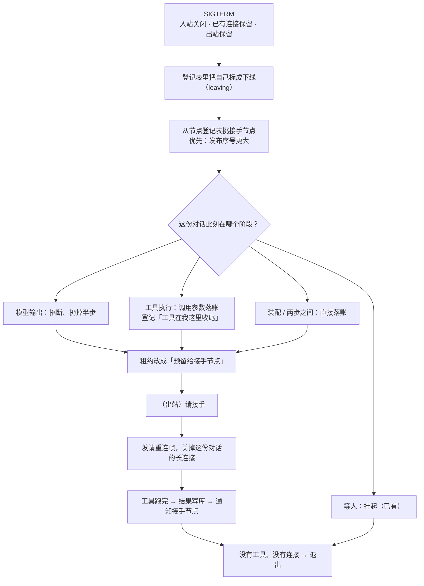
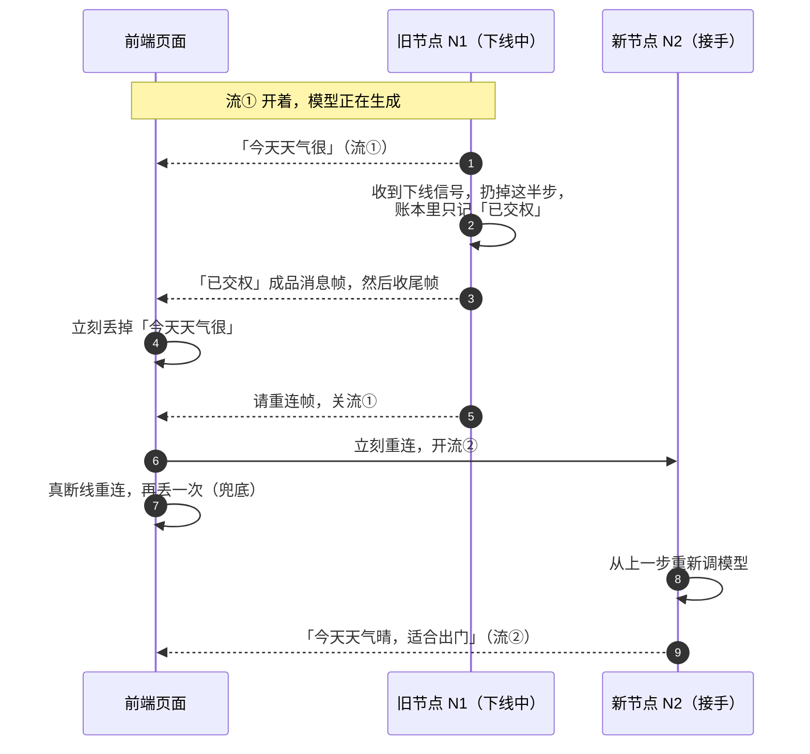
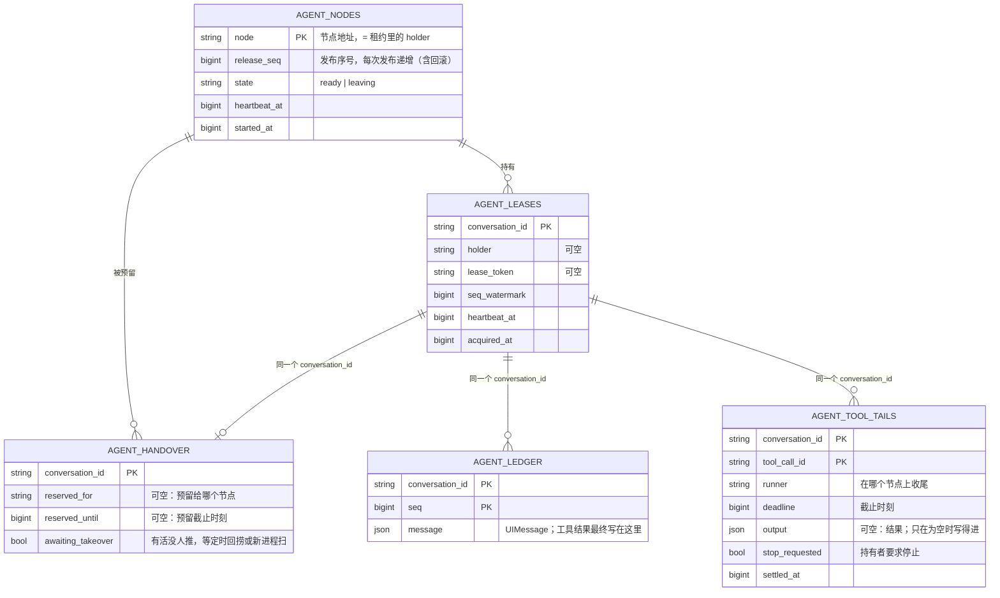
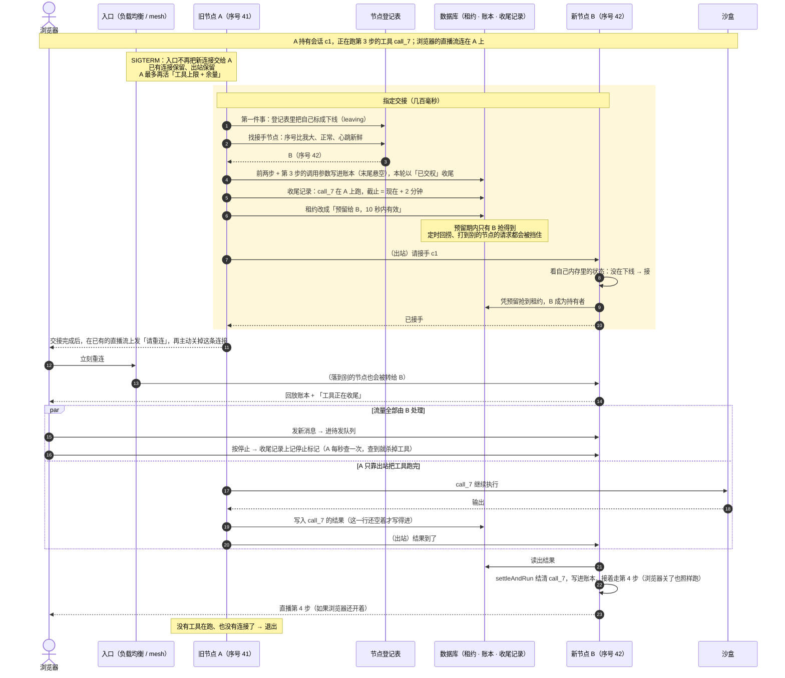
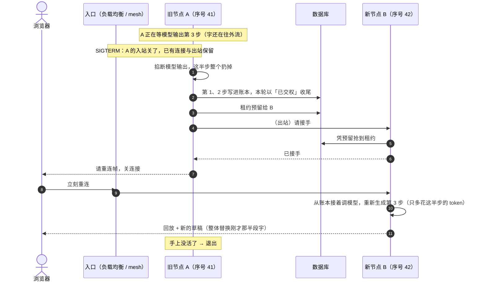
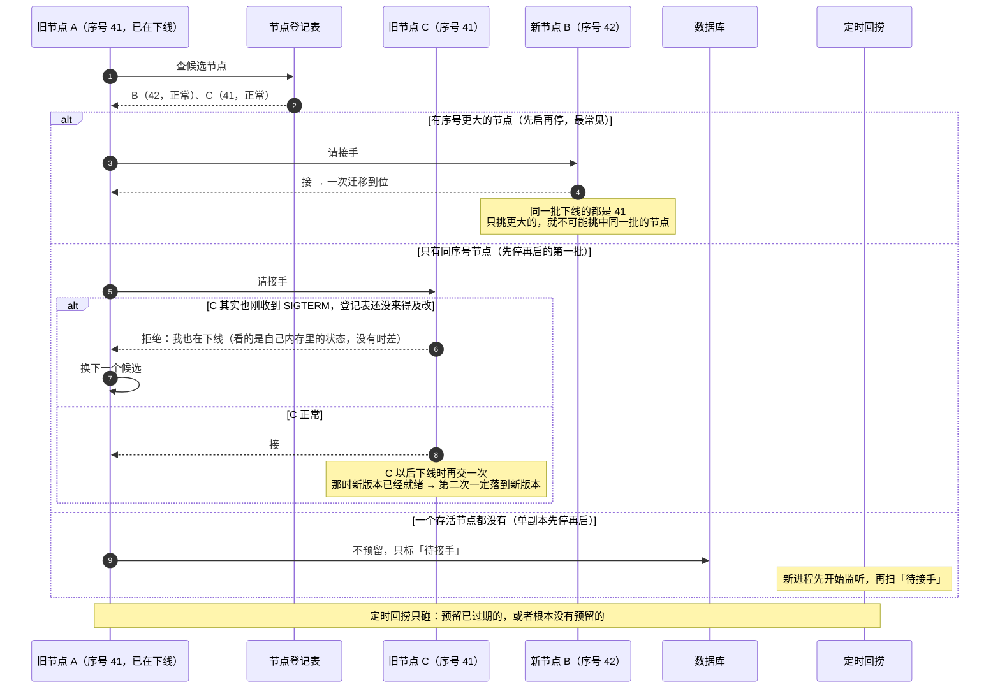

# 交权与任务迁移 — 技术方案

> 相关：[功能](../features/handover.md) · [施工](../plans/handover.md)。
> 依赖/延续：[优雅关闭与崩溃恢复](./graceful-shutdown.md)（本方案取代它「关闭时一律中止」的做法）· [挂起与恢复](./suspend-resume.md)（工具收尾借用它的恢复路径）· [归属仲裁机制](../../arbitration/tech/arbitration-impl.md)（租约多一种「预留」状态）· [多副本部署](../../../host/node/tech/multi-replica.md)（本方案建在它之上）· [唯一 demo](../../../ingress/tech/unified-demo.md)（node-server 已经换上官方租约与转发）· [集群控制台](../../../host/node/tech/cluster-console.md)（现有的「[节点下线](../../../terms.md) + [等待窗口](../../../terms.md)」，本方案落地后取代其中的等待窗口，见 §3.3）· [集群实验环境](../../../host/node/tech/cluster-lab.md)（Redis 广播直播流）。
> 术语一律以 [术语表](../../../terms.md) 为准。本文新增的词：[指定交接](../../../terms.md)、[节点登记表](../../../terms.md)、[发布序号](../../../terms.md)、[交接预留](../../../terms.md)、[工具收尾](../../../terms.md)、[已交权](../../../terms.md)、[请重连帧](../../../terms.md)、[定时回捞](../../../terms.md)、[待接手](../../../terms.md)。节点收到 SIGTERM 之后的状态沿用已有的[节点下线](../../../terms.md)。

## 1. 一句话

**节点一收到下线信号，就在几百毫秒内把手上每一份对话「指定交给」一个版本更新的存活节点；正在跑的工具留在旧节点上靠出站跑完，结果写回库，由接手的节点接着往下走。**

用户看到的是：浏览器秒级重连，这一轮在新节点上接着跑，不报错、不中断；就算用户已经关掉页面，任务照样跑完。

## 2. 地基：任务迁移场景里的事实

这一节只记**事实**——不管我们怎么设计都绕不过去的约束。后面每一条设计都能追到这里的某一条。
这些事实来自 2026-09-25 的一次完整讨论，其中 F1 是实际踩过的坑。

### F1 · 下线信号一到，入站就没了

- K8s 删一个 pod 时，「从负载均衡里摘掉」和「发 SIGTERM」**同时开始**。
- service mesh 的入站入口（sidecar）**跟着 SIGTERM 一起下线**。所以不只是负载均衡的流量没了，**别的节点转发过来的流量也进不来**。
- **这是有意的，也是必须的**：新流量一直进来，旧节点就永远等不到「没活了」的那一刻，也就下不了线。
- 可以保留、而且必须保留的是另外三样：
  1. **已经建立的连接**不立刻断（直播流、进行中的请求）；
  2. **出站**照常（连数据库、连沙盒、调别的节点）；
  3. **存活时长**可以比平时长（K8s 的 `terminationGracePeriodSeconds`）。sidecar 也要一起撑住，否则出站会比进程先死。

**推论**：收到 SIGTERM 之后，旧节点**不能再作为任何对话的「请求处理者」**。谁在这之后还持有一份对话，谁就让这份对话的所有请求只能失败。

### F2 · 节点替换有三种顺序

| 顺序 | 例子 | 下线时有没有存活节点 | 有没有比自己新的节点 |
|---|---|---|---|
| **先启再停** | K8s 缺省（`maxSurge ≥ 1`）、`maxUnavailable: 0` | 有 | 有 |
| **先停再启，分批** | `maxSurge: 0`、`maxUnavailable ≥ 1`，多副本 | 有（同一批以外的旧节点） | 第一批没有，后面几批有 |
| **先停再启，无存活节点** | 单副本 `Recreate`、单机 `node --watch`、docker compose 重建 | **没有** | 没有 |

K8s 的滚动语义保证：**下一批只有在上一批的新节点就绪之后才开始**。所以分批时，第二批下线的那一刻，第一批的新版本节点一定已经在了。

### F3 · 一轮在节点上时，一定处在五个阶段之一

| 阶段 | 被打断的后果 | 能不能重来 |
|---|---|---|
| 起轮装配（取沙盒、扫 skill） | 只是白做了准备 | ✅ 能 |
| **模型输出** | 丢掉这半步输出 | ✅ 能——同一份历史再调一次模型，只多花这半步的 token |
| **工具执行** | **不知道这条命令做了多少**（`git push` 推了一半、数据库写了一半） | ❌ **不能保证幂等，必须让它跑完** |
| 两步之间 | 无 | —（干净边界） |
| 等人答（审批、提问） | 无——[挂起](../../../terms.md)是无损的 | —（干净边界，已有） |

**我们判断不了模型输出还要多久**，所以「快说完了就等一等」这类优化没有依据，不做。

### F4 · 工具跑完之前，不需要任何节点持有租约来「保护」它

账本末尾挂着一个还没结果的调用时，框架**本来就不允许**任何节点起普通的一轮（`queue.ts` 的 `ledgerEndsWithPendingCalls`：新消息只排队）。恢复那一轮又必须等工具结果到了才开。

所以「工具在旧节点上跑」和「对话归新节点持有」可以同时成立：保护沙盒不被两个执行同时改的，是**账本的状态**，不是租约。

### F5 · 客户端可能根本不在

用户发完指令就关了页面，这很常见。**迁移不能等客户端来驱动**——必须由服务端主动指定一个节点接手、接着跑。

### F6 · 长连接不会自己离开旧节点

直播流（SSE）是长连接，已建立的连接在 F1 下仍然连着旧节点。旧节点不主动关，浏览器就一直挂在一个已经不再处理这份对话的节点上，看不到新进度。
**关的时机只能是「这份对话已经交接完」之后**：早了，浏览器重连时还没人接；晚了，浏览器看不到新节点的进度。

### F7 · 登记表有时差，节点自己的内存没有

- 任何「节点状态表」都是写进去之后别人才读得到，**一定有时差**。
- **同一批下线的节点，收到 SIGTERM 的时刻也不一致**，K8s 不做任何保证：控制器是逐个删 pod 的；每个节点上的 kubelet 各自发现「自己的 pod 要删了」，各自跑完 preStop 才发 SIGTERM（preStop 跑多久也各不相同）。先后差距从毫秒到秒级都有。所以先收到的节点看到的同批节点仍是「正常」。
- 但每个节点**对自己**是否在下线，知道得一清二楚、没有时差——它自己收到了 SIGTERM。
- **同一批下线的节点，版本一定相同**（滚动发布替换的就是旧版本）。

### F8 · 分不清「死了」还是「慢」

这是[归属仲裁](../../arbitration/tech/arbitration-impl.md) §4.3 的老结论，在这里同样成立：旧节点在工具收尾期间被冻住、断网或被强杀，外面看起来都一样。**兜底一定要有，而且只能做到「安全地失败」**——迟到的结果写不进去，而不是保证它不迟到。

### F9 · 「版本新」不等于「版本号大」

回滚发布的是旧代码，但它是一次**更新的发布**，那些节点不会在这一轮被替换。所以比较新旧要用**每次发布都递增的序号**，而不是代码版本号。

## 3. 现状盘点

### 3.1 框架已经有的

| 能力 | 在哪 | 状态 |
|---|---|---|
| 关闭闸门 + 等收尾 + 宽限期 | `packages/agent/src/runtime.ts` 的 `shutdown()` | ✅ |
| 等人的轮在关闭时挂起（`handover`） | 同上 + `runtime/human.ts` | ✅ |
| [等待窗口](../../../terms.md)：干活的轮先跑一会儿，到点才中止（`finishWindowMs`，缺省 0） | 同上 | ✅ **过渡方案**，见 §3.3 |
| 租约 + 租期标识 + 心跳 + 自我围栏 | `persist-kysely` / `persist-mongo` 的 `*Arbitration` | ✅ |
| node-server 换上官方租约、应用层转发、Postgres | `apps/node-server`（唯一 demo U1–U8） | ✅ |
| [节点下线](../../../terms.md)：SIGTERM 时关闸门（浏览器 503、nginx 换节点重试，转发来的请求放行）、断直播 | `apps/node-server/src/offline.ts` · `index.ts` | ✅ 闸门保留；「放行转发」要去掉，见 §3.3 |
| 直播流走 Redis 广播，任何节点都能播任何一轮 | `@runko/stream-redis` | ✅ |
| 集群实验环境、集群控制台、运维容器（`docker stop -t 120`） | `apps/node-server/docker/` · `src/ops` · `/console` | ✅ |
| 崩溃后补「已停止」（启动扫描 + 接管时） | `runtime.recover()` · `runtime/queue.ts` | ✅ |
| 恢复轮：用 `Settlement` 结清一个悬空调用再接着跑 | core 的 `settleAndRun` | ✅ |

### 3.2 缺口（2026-09-25 读代码 + 临时测试确认；同日合入 main 最新代码后复核）

| # | 缺口 | 怎么确认的 | 本方案里怎么消掉 | 复核 |
|---|---|---|---|---|
| G1 | 关闭时**正在干活的轮被立刻中止**，用户看到「中断」 | 读代码（`shutdown()` 对非等人轮一律 `abortTurn`） | §6 按阶段交权 | 🟡 **部分缓解**：等待窗口让 90 秒内能跑完的轮不被中止；超过的照旧中止，而且可能正切在工具中间 |
| G2 | 关闭中止后，**待发队列里的消息没人推**：新进程 `recover()` 扫不到，浏览器重连也不触发；直到用户再发一条，而且新的那条会**插到前面先跑** | 临时测试 P1 复现 | §7 指定交接 + §10 兜底 | 🔴 仍在（P1 在新代码上照样复现） |
| G3 | 关闭那几秒里**答了审批，答案落库、接口返回成功，但没人起恢复轮** | 临时测试 P2 复现 | 同上 | 🔴 仍在（P2 照样复现） |
| G4 | 关闭中止时，**已告知「插进去了」但还没交给模型的插话丢失**（挂起时有转进队列的逻辑，中止时没有） | 临时测试 P3 复现 | §6：交权不再中止；中止路径另补 | 🔴 仍在（P3 照样复现） |
| G5 | web 判断「服务重启」的文案常量与 `@runko/agent` 的 `ABORT_REASON_SHUTDOWN` 对不上，界面显示成「已停止」 | 读代码（`turn-marker.tsx` 逐字比较） | 施工 H0 | 🔴 仍在 |
| G6 | node-server 只在 `server.close()` 的回调里退出；还有长连接开着时**进程可能一直退不掉**（`node --watch` 会无限等） | 读代码推断，未实测 | §5 退出条件 | 🟢 基本修掉：`index.ts` 在 `server.close()` 之前先 `disconnectStreams()`；外面还有 `docker stop -t 120` / K8s 宽限期兜底强杀 |
| G7 | **node-server 今天不能做任何形式的多进程并存**：手写的仲裁把库里所有「正在跑」标记都当孤儿，新进程启动会打断旧进程还活着的轮 | 读代码（`agent/persistence.ts` 的 `listStale`） | 先走完[唯一 demo](../../../ingress/plans/unified-demo.md) U1–U5 | 🟢 已修掉：唯一 demo 已落地，node-server 用的是 `leaseArbitration` |
| G8 | 文档与代码对「交权」说法不一：术语表写「跑完当前这一轮再放手」，代码是「立刻中止」 | 读文档 + 代码 | 本方案重新定义交权，旧说法一并改掉 | 🟠 更尖锐了：等待窗口正是旧说法「跑完当前这一轮再放手」的实现，而本方案附录 A 第 2 条否决了它。处置见 §3.3 |

临时测试的做法与断言见[附录 B](#附录-b-临时测试记录)。

复核之后还多出三处缺口，都出在现有的节点下线上：

| # | 缺口 | 怎么确认的 | 本方案里怎么消掉 |
|---|---|---|---|
| G9 | 等待窗口期间（集群里最长 90 秒）对话仍归旧节点，**这份对话的新消息一律被拒**（`shutting_down` → 503，nginx 换节点重试后被转发回旧节点，还是被拒） | 读代码（`offline.ts` + `enqueue` 在关闭中回 `shutting_down`）+ [集群控制台 · 功能](../../../host/node/features/cluster-console.md) §3.3 自己写明 | §4 原则 2：对话几百毫秒内交出去 |
| G10 | 闸门放行别的节点转发来的请求，**依赖旧节点下线后仍收得到转发**；在 service mesh 下入站入口随 SIGTERM 一起关，停止、答审批就都到不了旧节点 | 读代码（`offline.ts` 的 `isTrustedForward` 白名单）对照 F1 | 同上：交接完成后不再需要转发给旧节点 |
| G11 | 等待窗口到点才中止，**不管这一轮当时在哪个阶段**：模型输出还是工具执行，都一刀切 | 读代码（`shutdown()` 到点对剩下的轮 `abortTurn`） | §6 按阶段交权 |

### 3.3 与现有「节点下线 + 等待窗口」的关系

main 上的[集群控制台](../../../host/node/tech/cluster-console.md)已经实现了一套节点下线（2026-09-25 合入）。**以本方案为准**，逐项处置如下：

| 现有的 | 处置 | 理由 |
|---|---|---|
| SIGTERM 是唯一的下线信号 | **保留** | 与 F1 一致 |
| 闸门：浏览器来的请求回 503，nginx 换节点重试 | **保留**，作为「入站关闭」在 docker 验证环境里的模拟 | 真集群里入站由负载均衡 / mesh 关掉；验证环境没有 mesh，靠闸门模拟同样的效果 |
| 闸门放行转发来的请求 | **只放到交接完成为止** | 交接完成之前（挑接手节点、等各轮交出去，通常几十毫秒）这份对话还在旧节点手上，停止、发消息、答卡片只能转到它这里，挡了就丢；交接完成之后一律挡，验证环境据此复现 F1（G10） |
| 配了 Redis 广播时立刻断直播，否则等轮收尾后再断 | **改成**：每份对话交接完成后就发[请重连帧](../../../terms.md)、断这份对话的直播（§8） | 不管有没有 Redis，交接完成后新持有者都能播 |
| [等待窗口](../../../terms.md)（`finishWindowMs`） | **在交权落地的同一次改造里直接删除**（不经过废弃期，`@runko/agent` 随之 major）；在那之前照旧 | 它就是附录 A 第 2 条否决的做法（G8、G9、G11）。在本方案落地之前，它仍比「立刻中止」好，所以不急着删 |
| 运维容器、`docker stop -t 120`、控制台 | **保留** | 与本方案无关；120 秒强杀期限正好对应 §13 的「工具上限 + 余量」 |

## 4. 方案总览：六条原则

每一条后面标着它依据的事实。

1. **应用层永远不因为发布返回 503。** 下线节点关的是入站，不是拒绝请求；请求在它下线之前就已经被交给别的节点了。（F1）
2. **交接在 SIGTERM 之后几百毫秒内完成，不等任何工具。** 交接之后，这份对话的所有请求都由新持有者处理。（F1、F4）
3. **按阶段交权**：模型输出扔掉重来；工具留在旧节点跑完；等人照旧挂起。（F3）
4. **指定交接，而且优先级写进数据**：旧节点指定一个接手节点、在租约上为它预留；预留期内谁也抢不走。定时回捞只是兜底。（F5）
5. **只挑版本更新的节点，最多迁移两次。** 挑不到才退而求其次，由接手方自己把关「我是不是也在下线」。（F2、F7、F9）
6. **交接完就踢长连接，浏览器秒级重连到新持有者。**（F6）

## 5. 一个节点的下线生命周期

| 阶段 | 开始于 | 入站 | 已有连接 | 出站 | 做什么 |
|---|---|---|---|---|---|
| 正常服务 | — | 开 | — | 开 | — |
| **交接** | SIGTERM | **关**（F1） | 保留 | 开 | 登记表里标下线 → 对每份对话：按阶段落账 → 预留 → 请接手 → 踢长连接 |
| **收尾** | 最后一份对话交接完 | 关 | 只剩与对话无关的连接，处理完就关 | 开 | 把还在跑的工具跑完，结果写库，通知接手节点 |
| 退出 | 见下 | — | 全部关掉 | — | — |

**退出条件：没有在跑的工具，并且没有未关的连接。** 另设一个硬上限：`工具上限 + 余量` 到了就强制关掉所有连接、退出（解决 G6）。硬上限由框架给出建议值，宿主据此配置 K8s 的宽限期（§12）。

一个节点可能同时替别的节点**转发**着直播流（它不是那份对话的持有者）。这类连接与本节点的交接无关，**SIGTERM 之后就可以直接踢**，浏览器重连到别处即可。

## 6. 按阶段交权

| SIGTERM 那一刻这一轮在做什么 | 旧节点的动作 | 账本里留下什么 | 接手节点接着做什么 | 代价 |
|---|---|---|---|---|
| 起轮装配 | 中止装配 | 什么都不写；这条输入放回待发队列最前面 | 出队、重新装配 | 重做一次装配 |
| **模型输出** | 掐断模型流，**把这半步整个扔掉** | 已完成的步，本轮以[已交权](../../../terms.md)收尾 | 从账本直接接着调模型（历史与掐断前一字不差，不需要编一句「请继续」） | 这半步的 token |
| **工具执行** | **不动工具**；把调用参数落进账本，登记[工具收尾](../../../terms.md) | 已完成的步 + 这一步的调用（末尾悬空），本轮以已交权收尾 | 等工具结果到了，用它结清那次调用，接着跑 | 无 |
| 两步之间 | 直接收尾 | 已完成的步，本轮以已交权收尾 | 接着调模型 | 无 |
| 等人答 | [挂起](../../../terms.md)（已有，理由 `handover`） | 同挂起 | 人答了之后在任意节点恢复（已有） | 无 |

### 6.1 为什么模型输出段要「扔掉半步」而不是「留下半句」

扔掉之后，接手节点看到的历史跟掐断之前**一字不差**——账本末尾要么是用户消息（第一步就被掐断），要么是上一步的工具结果。这两种都是「正常开始下一步」的样子，直接调模型即可。

留下半句的话，历史里多出一段残缺的助手输出，要么得编一句「请继续」塞给模型，要么让模型面对一段自己没说完的话，都不如重来干净。

界面上已经流出来的那半段字要撤掉：浏览器重连后拿到的是接手节点的[进行中草稿](../../../terms.md)，**整体替换**旧的草稿即可（§8）。

### 6.2 工具段：旧节点跑、新节点等

依据 F4：旧节点交出对话之后，账本末尾那个悬空调用就是一把天然的锁。

- 旧节点把「调用 `call_7` 在我这里收尾，截止时间 = 现在 + 工具上限」写进库，然后交出对话。
- 接手节点抢到归属后看到账本末尾悬空，**只等结果，不调模型**。它不占着归属干等：查完没有结果就放手，给对话重新打上[待接手](../../../terms.md)标记。这段时间里用户发的新消息进待发队列（已有行为）；轮状态报「在跑」（不报持有者——旧节点入站已关，别把请求转过去），界面据此显示工具正在收尾。
- 工具跑完，旧节点先让宿主把工具改过的东西存下来（`hooks.onToolTailFinished`——进程内的沙盒要在这里存快照，否则接手节点看不到那条命令的改动），再把结果写进那一行（**只在它还空着时写得进**），最后通过出站通知接手节点。
- 接手节点读出结果，用 `settleAndRun(callId, { kind: "output", output })` 结清那次调用并接着跑——**这条路径就是[恢复](../../../terms.md)，一行都不用新写**。

一步里并发了几个工具时，每个调用各一行，**全部有结果**才开恢复轮。

**为什么结果不能直接写进账本**：账本每写一条都要带当前的[租期标识](../../../terms.md)取号。对话已经交给接手节点，旧节点的写入会被拦下——这正是租约该做的事。所以结果先落在「收尾记录」那一行，由持有者把它写进账本。**账本里最终仍然是一条 UI message**，只是中间多一站。

### 6.3 工具上限与超长任务

- **工具上限**：宿主可配，缺省 2 分钟。**平时也生效**，不只在下线时——否则 SIGTERM 前一刻刚起的一条 10 分钟命令照样会拖住下线。有了它，「交权最多等一个工具上限」才是一条有依据的保证。
- **超过上限的任务改成异步**：工具在沙盒里**后台**起任务（`nohup … &`，输出写文件），立刻返回任务 id；之后再查。
- 「过一会儿再查」**不要做成一个在轮里干等的工具**——那会占着节点，自己也撞上限。正确形状是让这一轮挂起并记下唤醒时刻，到点由任意节点唤醒（挂起原因多一种：「等时间」）。这一条独立成后续工作，见[附录 C](#附录-c-后续工作)。
- 本地沙盒（进程内的 `MemoryFS` + `just-bash`）没法后台跑任务，这是它的已知限制。

## 7. 指定交接

### 7.1 节点登记表

每个节点启动时登记、定时刷新一行：

| 字段 | 意思 |
|---|---|
| `node` | 节点地址（就是租约里的 `holder`，即 `RUNKO_NODE_URL`） |
| `releaseSeq` | [发布序号](../../../terms.md)：每次发布递增，回滚也递增（F9） |
| `state` | `ready` / `leaving`（[节点下线](../../../terms.md)中） |
| `heartbeatAt` | 最后一次刷新时刻 |

收到 SIGTERM 后的**第一件事**是把自己改成 `leaving`，尽量缩短别人看到旧状态的窗口（F7）。

### 7.2 挑接手节点

按这个顺序挑，挑到就停：

1. **发布序号比我大**、`ready`、心跳新鲜的节点——同一批下线的节点序号和我相同，所以**这一档不可能挑中同批节点**（F7）。一次迁移到位。
2. 发布序号**和我相同**、`ready`、心跳新鲜的节点——只在「先停再启分批」的第一批出现。它将来下线时会再交一次，那时新版本已就绪（F2），所以**最多两次**。
3. 一个都没有——走 §10 的「待接手」。

同一档里挑负载最轻的（持有对话最少的）。

### 7.3 接手方自己把关

登记表只用来**挑候选**，**接不接由被挑中的节点说了算**：它看的是自己内存里的「下线中」标记，没有时差（F7）。

- 自己也在下线 → 拒绝，旧节点换下一个候选。
- 刚答应接手、下一刻就收到 SIGTERM → 它会再交一次，而且优先交给更新的版本，仍在「最多两次」之内。

### 7.4 交接预留：让指定交接的优先级写进数据

光靠「旧节点先去找接手节点」这个先后顺序，保证不了接手节点一定抢在[定时回捞](../../../terms.md)或别的请求之前。所以租约多一个状态：

| 租约状态 | 谁抢得到 |
|---|---|
| 没人持有 | 任何节点 |
| 持有中，心跳新鲜 | 没人（报 `held_by_other`，转发） |
| 持有中，心跳过期 | 任何节点（接管，已有） |
| **预留给节点 X，未过期** | **只有 X** |
| 预留已过期 | 任何节点（退化成「没人持有」） |

预留有效期缺省 10 秒——覆盖一次「请接手」的往返加重试，而不至于在接手节点真的挂了时把对话卡太久。

落地方式：`Grant.releaseTo(node, { ttlMs })` 先确认令牌还是自己的，写下「预留给谁、到什么时候」，再照常放手（清持有者与令牌）。`acquire` 的那条条件更新多一个条件：**别人的有效预留存在时不让抢**，被挡住的一方拿到 `busy`、`holder` 报被预留的节点（接入层据此把请求转过去）；被预留者抢到之后预留就消费掉了。`inspect` 在预留期内也报被预留者。**轮编排仍然不认识租期标识**（[归属仲裁机制](../../arbitration/tech/arbitration-impl.md) §2 的约束一），它只知道「把归属交给 X」。

预留**不放在租约表上，而是单独一张表 `agent_handover`**（Kysely 那几档；Mongo 直接放在 lease 文档上）：`migrate()` 只建表不改表（附录 D），给租约表加列会让已有的库直接坏掉，新表则天然兼容。[待接手](../../../terms.md)标记也在这张表上。

这几个新方法（`releaseTo`、待接手标记、回捞候选）在接口上**都是可选的**：自己实现仲裁的宿主不用改代码，只是交权退化成「普通放手、谁先来谁接」。

### 7.5 请接手

旧节点经出站调接手节点的一个内部端点（带 `RUNKO_PEER_TOKEN`），告诉它「这几份对话预留给你了」。接手节点逐个抢归属，按账本末尾的状态决定接下来做什么：

| 账本末尾 | 接手节点做什么 |
|---|---|
| 以已交权收尾，末尾是用户消息或工具结果 | 接着调模型 |
| 末尾悬空，收尾记录里已有结果 | 结清，接着跑 |
| 末尾悬空，收尾记录还空着 | 等结果通知 |
| 挂起（等人） | 什么都不做，等人答 |
| 待发队列不空 | 这一轮收尾之后照常出队（已有） |

一次请求可以带多份对话，交接的耗时不随对话数线性涨。

## 8. 客户端：秒级重连

- 旧节点在**这份对话交接完成之后**，在已有的直播流上发一帧[请重连帧](../../../terms.md)，然后自己关掉这条连接（F6）。这一帧**只发给本进程的订阅者、不经流分发广播**——广播出去的话，别的节点上跟着看的浏览器也会跟着断。框架在 `shutdown()` 里自己发：与交接无关的订阅一开始就踢，交出去的那些在「请接手」答复之后踢。
- 旧节点在以[已交权](../../../terms.md)收尾时**不广播「没有轮在跑了」**：别的节点上跟着看的订阅者收到那一帧就收线了，再也看不到接手节点接着跑的内容。
- 浏览器收到它：**不走**现在的 1、2、4、8、16 秒退避，而是立刻重连，失败就每 200～300 毫秒再试，最多试若干秒，期间界面不提示。真正的断线仍然走原来的退避。
- 重连经入口落到接手节点（或落到任何节点再被转发过去；配了 Redis 广播时，落到任何节点都能直接播），拿到的是回放 + 当前草稿，**整体替换**浏览器手上的旧草稿——于是模型输出段被扔掉的那半段字自然消失。
- 浏览器可能根本不在（F5）。那也没关系：交接和接着跑都不依赖它。

下图是模型输出段被交权时，浏览器这一侧看到的全过程：

- 这里的半截回复从没存进账本，新节点也不会接着它往下写，所以丢掉是对的。
- 第 7 步是兜底：万一连接在收尾帧到达之前就断了，第 4 步没机会执行，重连时也能清掉。
- **只有真正的断线重连才丢**，发新消息开新一轮时不丢——那时手上的「半截」多半是上一轮已经存好、只是成品消息帧还在路上的回复（为什么会有这种情况，见[单一账本 · 技术方案](./single-ledger.md)附录 A）。

## 9. 工具收尾期间的细节

| 情况 | 处理 |
|---|---|
| 用户按停止 | 旧节点的入站已关，**不能靠转发通知它**。持有者在库里给那条收尾记录记一个停止标记；旧节点每秒查一次，查到就杀掉工具，把结果写成「被用户停止」 |
| 旧节点在截止时间前没写结果（被强杀、冻住、出站断了） | 持有者把结果写成「执行这个工具的节点下线了，结果未知」，交给模型判断——这是不能保证幂等的地方唯一绕不开的口子，只能如实告诉模型（F8） |
| 结果迟到（上一条已经写成「未知」之后才跑完） | 写不进去（那一行已经不是空的），丢弃并记日志。那条命令确实可能还在沙盒里跑过，这是 F8 的代价 |
| 工具输出想直播给用户 | 本期不做：旧节点入站已关，浏览器连不上它。界面只显示「工具正在收尾」，结果到了一次性出现 |

## 10. 兜底：待接手与定时回捞

指定交接是主路，下面两条是兜底，**都不和主路抢**：

- **待接手**：一个存活节点都挑不到时（F2 的第三种），旧节点不做预留，只把对话标成[待接手](../../../terms.md)。新进程启动后**先开始监听端口，再扫一遍待接手**并逐个推一把——先监听是为了让浏览器的重连尽快成功。
- **[定时回捞](../../../terms.md)**：每个节点定时（比如每 10 秒）找「没人持有、也没有有效预留，但打了[待接手](../../../terms.md)标记」的对话。标记由这几处打上：下线交出去时、崩溃恢复后队列里还有消息时、有人答了卡片时、工具收尾把结果写进库时（为什么不直接看「待发队列不空」，见 §10.3）。它只碰**预留已过期或根本没有预留**的对话，所以不会抢指定交接的活。它同时补上了 G2、G3 这类「有活但没人推」的老洞。

### 10.1 「这一轮还没完、但没人持有」也算在跑

两种时候对话没有持有者、这一轮却没完：工具还在某个下线中的节点上收尾；交权之后还没有节点接着跑（包括预留期内，以及新进程开始监听到做完首次回捞之间）。这时轮状态报「在跑」（不报持有者——旧节点入站已关，别把请求转过去），直播流也不收线：跨进程的流接着等帧；不跨进程的定期复查，等到有节点接上就收线，客户端重连时被转过去。预留给本节点、还没接上时，本节点把它当本地的处理（停止、发消息不转给自己）。交权之后还没人接着跑时用户按停止：抢到归属、补一条「已停止」。

### 10.2 下线期间来的消息、答复

不拒绝。消息排进待发队列、打待接手标记、交给接手节点；答复落库、打待接手标记。用户已经按了停止的那一轮**不交出去**，照停止收尾——交出去的话接手节点会把用户取消的事再做一遍。

### 10.3 回捞只认待接手标记

定时回捞的候选只来自[待接手](../../../terms.md)标记，不再把「待发队列不空」当成有活：在等人答的对话按设计会排着后续消息，它们永远推不动，却会占满每次回捞的名额。需要推的队列由框架自己打标记——下线时交出去的、崩溃恢复时补完「已停止」之后还排着消息的。标记也只在真推动了、或者确实没活了时才撤。

### 10.4 挑不到接手节点又没有跨进程的标记时，照旧中止

单进程 + 进程内仲裁时，待接手标记只能记在内存里，进程一退就没了，新进程找不到交出去的对话，用户连「已中断」都看不到。这种配置下关闭照旧中止。

## 11. 数据模型

`AGENT_TOOL_TAILS` **单独建表**，没有复用裁决表：工具输出是任意 JSON（裁决表只有文本）、停止标记要有自己的写入路径，更要紧的是宿主会按裁决表统计「有几处在等你答」，收尾记录混进去会被当成等人的卡片。它在持久化接口上是可选成员 `Persistence.tails`；没有它时，正在跑工具的那一轮交不出去，只能中止。

## 12. 核心流程

### 12.1 先启再停，SIGTERM 时正在跑工具（主流程）

### 12.2 SIGTERM 时正在等模型输出

### 12.3 挑接手节点，以及同一批下线怎么办

## 13. 宿主要做的配置（K8s 为例）

| 配置 | 值 | 为什么 |
|---|---|---|
| 替换顺序 | `maxSurge ≥ 1`、`maxUnavailable: 0` | 先启再停才能做到用户无感（F2）；先停再启只能做到「短暂不可用 + 自动重连」 |
| `terminationGracePeriodSeconds` | ≥ 工具上限 + 30 秒 | 旧节点要活到工具收尾结束（F1） |
| sidecar | 原生 sidecar（K8s 1.28+），或把 sidecar 的退出等待调到不短于上面那个值 | **出站要撑到进程退出**。Istio 缺省约 5 秒就退，旧节点会连不上库和沙盒（F1） |
| `RUNKO_NODE_URL` | pod IP（downward API） | 节点地址，也是租约里的 `holder` |
| 发布序号 | 由发布流水线注入的环境变量，每次发布递增 | F9 |
| `RUNKO_PEER_TOKEN` | 各节点相同 | 「请接手」与转发的内部口令 |

## 14. 取舍与已知限制

- **先停再启且没有存活节点时，做不到零感知。** 旧进程退了、新进程还没监听的那段时间，请求在网络层就被拒了，应用层管不到。浏览器的快速重连能盖住直播流；发消息要靠客户端自动重试 + 幂等键（另见[多副本 · 技术方案 附录 C](../../../host/node/tech/multi-replica.md)）。
- **不能保证幂等的地方仍然有一个口子**：工具收尾期间旧节点被强杀或断网，结果只能记成「未知」（§9）。宽限期与 sidecar 配对了，这条路只在真故障时才走。
- **工具收尾期间看不到工具的实时输出**（§9），结果到了一次性出现。
- **节点登记表是新依赖**：四档库都要实现，一致性套件要覆盖「预留期内只放行被预留者」「预留过期后退化成没人持有」等用例。
- **一轮会被拆成两段写账本**（已交权 + 接手后的那一轮）。与「恢复就是开新的一轮」一致，但界面要把两段连起来显示成一轮，单轮统计要能合并。
- **接手节点刚答应就收到 SIGTERM，会多迁移一次（已接受）。** 只在「先停再启分批」的第一批出现——那时挑不到新版本，只能交给同版本节点，而它答应的那一刻谁也不知道 K8s 下一秒会不会删它（F7）。代价有上限：
  - 它那时若在装配、在等工具结果或在等人，**什么都不浪费**，只是多交一次；
  - 若正在调模型，浪费的是**这半步的输出 token**。输入部分因为历史一字不差，通常命中服务商的提示词缓存（缓存按内容、不按节点）；
  - 第二次交接优先挑新版本，那时新版本一定已就绪，所以**最多多迁移一次**。

  要彻底避免只能「没有新版本就等」，要让对话停几十秒等新节点就绪，用停顿换半个 step 的 token 不划算，所以不这么做。用先启再停部署（§13）时这种情况根本不会出现。可配的备选见[附录 C](#附录-c-后续工作)。
- **新旧版本同时在线**：「请接手」和转发都会跨版本调用；接手节点可能用新代码去恢复旧代码挂起的调用。版本间的兼容规矩见[附录 D](#附录-d-新旧版本同时在线的规矩)。

---

## 附录 A · 讨论中否决过的做法

按讨论的先后排列。每一条都是一次被事实推翻的假设，留着是为了别人不再走回头路。

| # | 做法 | 为什么否决 |
|---|---|---|
| 1 | 关闭时一律中止正在干活的轮（现状，见[优雅关闭](./graceful-shutdown.md)） | 每次发布都中断所有在跑的任务；用户重发后可能又落到一台还没替换的旧节点上，**再被打断一次** |
| 2 | 跑完当前这一轮再放手（旧的「交权」定义；main 上的[等待窗口](../../../terms.md)就是它的实现，过渡保留，见 §3.3） | agent 一轮常常好几分钟，宽限期要设得很长，发布变慢；而且这段时间里旧节点入站已关，这份对话的请求全部失败（F1、G9） |
| 3 | 立刻中止，再自动「接着干」 | 会把跑到一半的工具切断，工具不能保证幂等（F3） |
| 4 | 工具跑完之前旧节点一直持有租约，结果直接写进账本 | 旧节点入站已关，持有期间这份对话的请求只能 503（F1）。这是 2026-09-25 讨论里被实际踩过的坑推翻的 |
| 5 | 靠浏览器重连来驱动接手 | 用户可能已经关了页面（F5） |
| 6 | 由定时回捞承担接手 | 优先级得不到保证，会和指定交接抢；接手延迟取决于回捞间隔 |
| 7 | 模型输出快结束时等一等再交权 | 判断不了还要多久（F3），加了也没有效果 |
| 8 | 信任登记表来避开同批下线的节点 | 登记表一定有时差（F7）；改成「只挑更新的版本 + 接手方自己把关」 |
| 9 | 下线节点收到请求后回 503 让客户端重试 | 违反原则 1；而且 F1 之后下线节点根本收不到新请求，问题在于**交接之前**请求该去哪 |

## 附录 B · 临时测试记录

2026-09-25 在 `@runko/agent` 上写了三条临时测试（跑完即删，未提交；合入 main 最新代码后同日重跑，三条仍然复现），用共享的 `memoryPersistence()` 模拟「旧进程关闭、新进程起来，共用一个库」：

| # | 做法 | 结果 |
|---|---|---|
| P1 | 起一轮 → 再发一条（排队）→ `shutdown()` → 新 runtime `recover()` + `subscribe` | 队列里那条留在库里，但没有任何一轮被起来；`recover()` 返回 `scanned: 0`。再发一条新消息，**新的那条先跑** |
| P2 | 一轮停在审批上 → `shutdown()`（挂起）→ 在同一个 runtime 上 `submitDecision` | 返回 `true`、裁决表已结清，但模型没被再调；新 runtime 的 `recover()` 与 `subscribe` 也不触发恢复 |
| P3 | 真 core + 慢速模型，输出中途插话（返回 `steered`）→ `shutdown()` | 插话既不在账本里，也不在待发队列里 |

## 附录 C · 后续工作

- **「等时间」的挂起**：超长任务改异步之后，「过一会儿再查」要做成挂起 + 定时唤醒，不占节点。它复用 §10 的定时回捞来找「到点了」的对话。
- **工具收尾期间的实时输出**：旧节点经出站把工具输出推给持有者，再由持有者直播。本期不做。
- **发消息的幂等键**：让浏览器在「先停再启」的空档里能放心自动重试。
- **（备选，暂不做）没有新版本时的策略可配**：`交给同版本节点`（缺省，即现在的行为）或 `等新版本就绪`（标待接手，由新节点接走）。给那些宁可多等也不愿多花 token 的构建者。现在的成本可以接受，等有人真的需要再做。

## 附录 D · 新旧版本同时在线的规矩

滚动发布期间两个版本一定同时在线，下面几条不遵守就会出问题：

- **框架的表结构**：`migrate()` 只建表、不改表（`packages/persist-kysely/src/migrate.ts`）。改表要宿主自己出迁移，并且「先加、后删」，保证新旧版本都能读。
- **心跳间隔、接管阈值、预留有效期是整个集群的约定**：新旧版本配得不一样，就会出现一方比另一方预期更早接管，两个执行同时动一个沙盒。改这几个数要分两次发布。
- **工具改名或删除要留一个版本的兼容**：旧版本挂起、新版本恢复时，那个工具必须还在，否则这份对话会一直卡在「等你」。
- **「请接手」与转发走的是节点间接口**：接口要向后兼容一个版本。
