# 进行中草稿放内存 — 技术方案

> 相关文档：[账本设计](./single-ledger.md)（本文要改的就是它 §2.4／§6 描述的做法）· [chat 服务端](../../../ingress/tech/chat-webapp.md) §2.2b（一轮怎么跑、断线怎么重连）· [产品视角](../../../ingress/features/chat-webapp.md) · [施工进展](../plans/in-flight-draft.md)
> 用到的术语：[进行中草稿](../../../terms.md)、[账本](../../../terms.md)、[seq](../../../terms.md)、[chunk](../../../terms.md)、[折叠](../../../terms.md)、[直播流](../../../terms.md)、[回放](../../../terms.md)

## 1. 一句话

**agent 正在干活时产生的临时数据，现在写进数据库、干完再删掉。本文主张：别写数据库了，放内存里就行。**

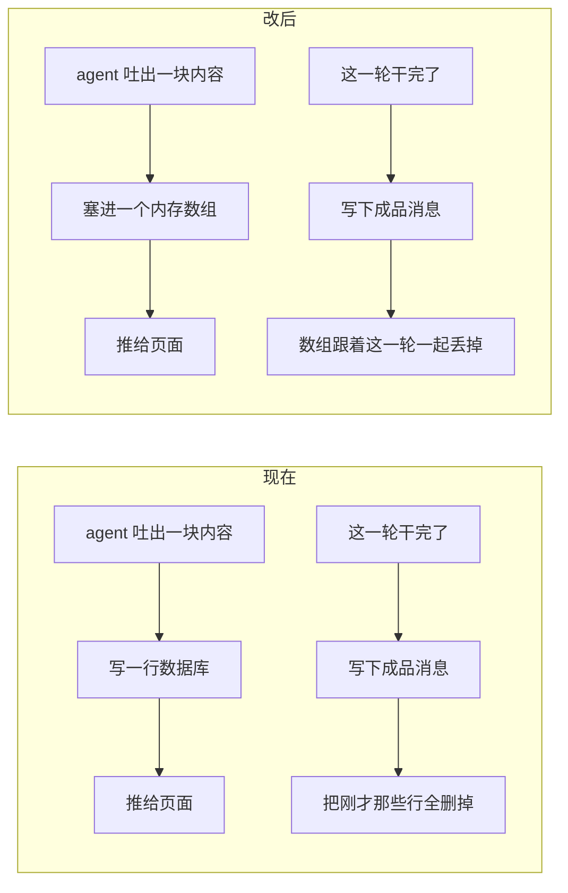

数据库从头到尾**只写成品**。

## 2. 现在是怎么做的

### 2.1 一轮当中，数据库里的变化

agent 干活时会一小块一小块地吐东西出来（我们叫 [chunk](../../../terms.md)）。现在的做法是：**每吐出一块值得留的，就写一行数据库**。等这一轮全部干完，再把这些临时行删掉、换成整理好的成品消息。

假设这个会话之前已经有 100 行，那么这一轮里数据库长这样：

| 时刻 | 数据库里有什么 |
|---|---|
| 用户刚发完消息 | `101` 用户消息 |
| agent 干活中 | `101` 用户消息 · `102～130` 三十行临时数据 |
| 这一轮干完 | `101` 用户消息 · `131` `132` 成品消息 ← **`102～130` 被删掉了** |

### 2.2 为什么要写这些临时行

**只为一件事：你在 agent 干到一半时刷新页面，还能看到当前画面。**

比如它已经跑完三个命令、正卡在一张等你点「允许」的审批卡片上——刷新之后这些都还在。如果没有这些临时行，刷新后页面就是空的。


## 3. 问题在哪

### 3.1 那笔写入，其实什么都没换来

「写数据库」比「放内存」多买到的，**只有一样**：进程崩溃之后，还能看到那一轮的半截输出。

但这一样是空的：

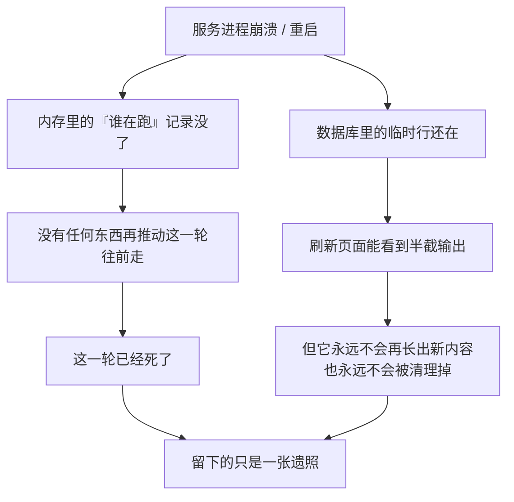

再补一刀：这些行**连模型都看不见**。下一轮恢复记忆时只读成品消息，从来不读临时行。所以它影响的纯粹是「人眼能不能看到那具尸体」。

### 3.2 但成本是实打实的四项

**① 一张表里混着两种寿命的数据。** 成品是永久的，临时行是要删的。于是必须有一套删除逻辑，还得讲究顺序（先写成品、再删临时；反过来一崩就可能整轮内容丢光）。

**② 派生出一条到处叮嘱的规矩。** 删除是按「这一轮的编号区间」来圈的。所以「不落盘的东西绝对不能占用编号」就成了一条必须全局遵守的铁律，代码注释里反复强调。

这条规矩**不是账本本身需要的，是删除逻辑逼出来的**：


拆掉最左边那个源头，右边三个**一起消失**。

**③ 前端在猜。** 页面判断「现在有没有 agent 在跑」，靠的是「历史记录最后一条是不是临时行」——一个反推。

**④ 永久垃圾。** 崩溃那条路径不会执行清理，那些临时行**永远留在库里**。

> 顺便说清楚：**这不是性能问题**。数据库是本地 SQLite，一行写入几十微秒，一轮几十行也就几毫秒。要优化的是复杂度，不是速度。

## 4. 别人怎么做

AI SDK 官方文档（`ai@7.0.20` 自带的 `chatbot-resume-streams`）解的是同一个问题，分工是三层：

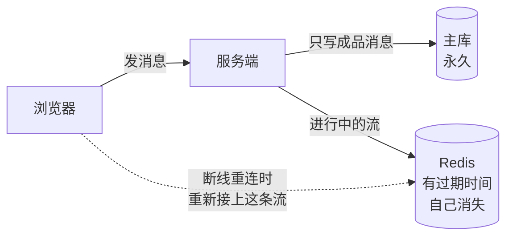

三个要点：

- **主库全程只写一次成品**，进行中的东西根本不进去。
- **重连不是「从库里翻历史」，是重新接上那条还活着的流**。
- Redis 那份有过期时间，**自己消失，不用删**。

### 4.1 为什么我们不需要 Redis

因为官方那套的前提是 **serverless**——每个请求可能是一个全新的短命实例，进程里存不住任何东西，**它没得选**。

runko 是常驻进程，而且这一轮本来就在进程内跑着：

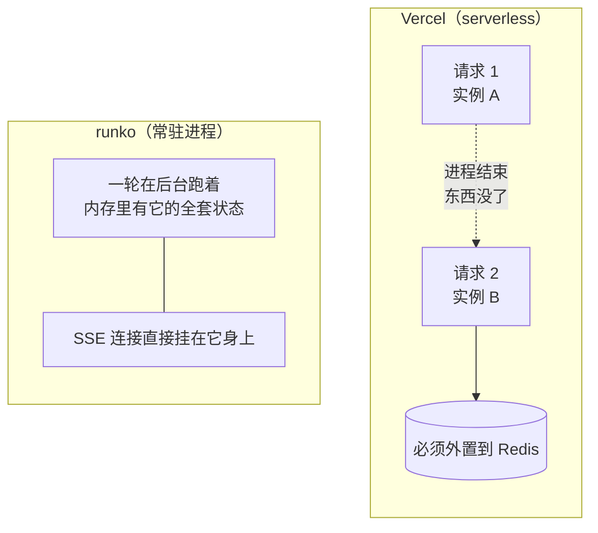

**Redis 在那套方案里扮演的角色，我们进程内存本来就在扮演。** 要做的只是把草稿从主库挪到那个已经存在的位置，不是引入第三个组件。

## 5. 改法

### 5.1 草稿放哪

给「正在跑的这一轮」加一个数组，装本轮至今的临时数据。

```ts
interface ActiveTurn {
  // …既有字段…
  /** 本轮至今的全部临时数据，按到达顺序。这一轮结束时随它一起被丢掉。 */
  draft: RunkoChunk[];
}
```

**哪些东西算「值得留的临时数据」，规则一个字都不改**（打字增量和进度这类照旧只推不留）。变的只是它们去哪儿：以前去数据库，现在去这个数组。

### 5.2 重连怎么走

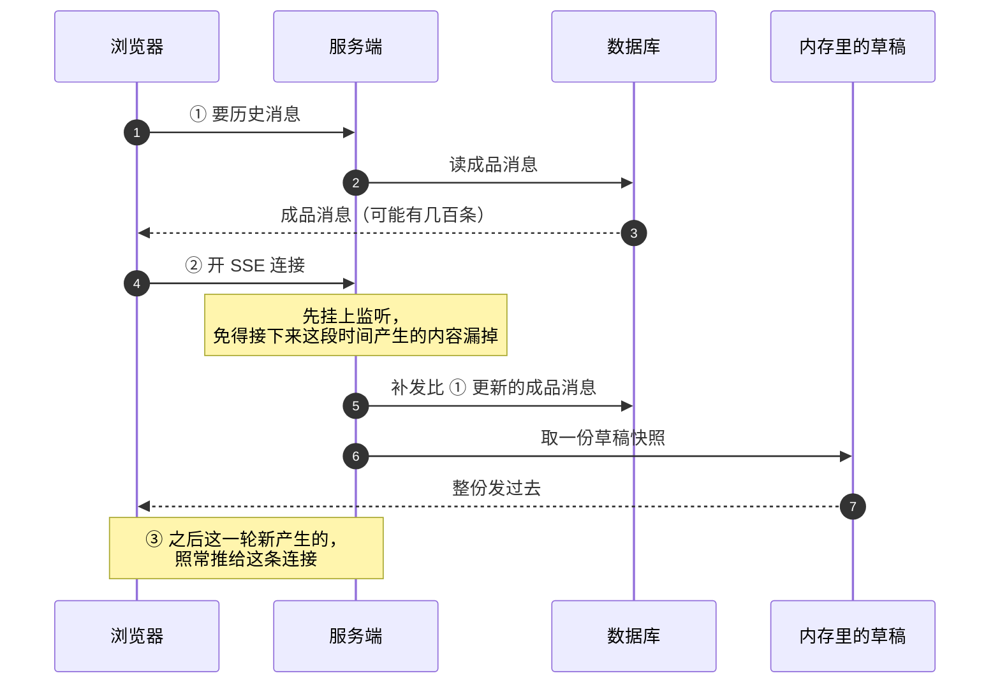

第 ③ 步**现在的代码一行都不用改**——广播机制原样保留。真正变的只有第 ② 步中间那下：数据从「翻数据库」变成「读内存数组」。

### 5.3 为什么整份重发一遍不会乱

**直觉上**：草稿没有编号了，那重连时怎么知道该从哪儿接着发？是不是要再造一套编号？

**不用。整份从头发一遍就行，因为重放是幂等的。**

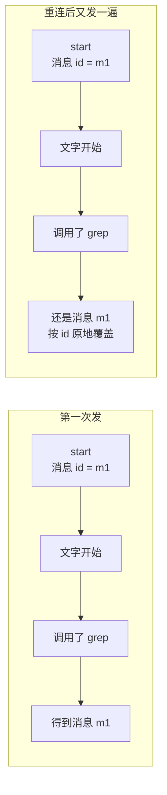

三步就能说清：

1. 草稿总是从一个 `start` 开头，而这个 `start` **自带消息 id**（agent 那边生成的）。
2. 浏览器收到 `start` 就按这个 id 开一条新消息，后面的内容全往它身上贴。
3. 贴完之后**按 id 覆盖**已有的那条——不是追加。

所以「同一份输入算两遍」和「算一遍」，结果一模一样。工具调用也是同理：同一个调用 id 的结果重复发一次，只是把同一张卡片再覆盖一次。

**这带来一个很爽的结果**：草稿在网络上就是「一块没有编号的数据」，和今天那些只推不留的打字增量**走完全同一条路**。前端负责拼装消息的那个模块，**一行都不用改**。

### 5.4 顺序上有两个坑

**坑一：必须先挂监听、再取快照。**

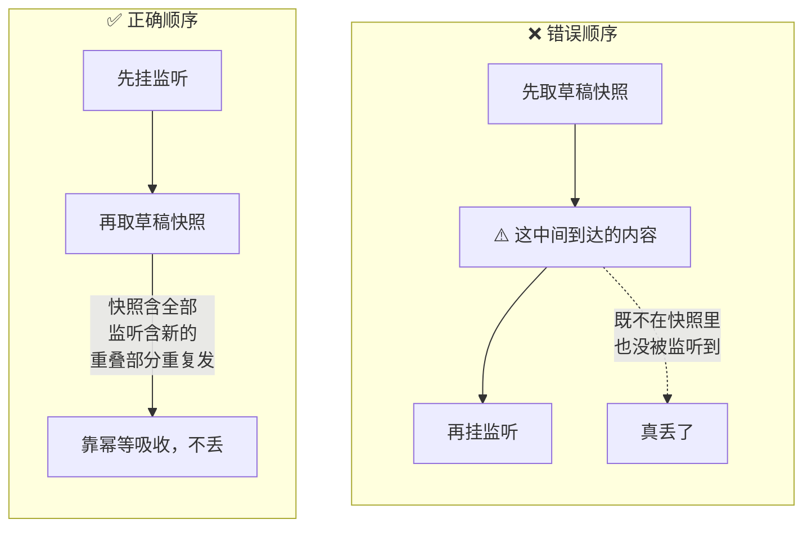

**坑二：现有那条「回放期间到达的无编号内容一律丢弃」的规则会误伤。**

这条规则本来只管打字增量（那会儿值得留的内容都带编号，不受影响）。改完之后**所有临时数据都不带编号了**，这条规则会把它们也吞掉。

不会真丢——它们还在草稿数组里，随后的快照会补上。但前提是：

> **「关掉丢弃规则」和「取快照」必须写在同一段同步代码里，中间不能有 `await`。**

Node 是单线程，同步代码执行期间没有别的东西能插进来，所以这样写就是零空隙。顺序也有讲究：先关规则、再取快照（万一有空隙只会重复发，能被吸收）；反过来的话中间到达的内容会既不在快照里、又被规则吞掉——**那才是真丢**。

### 5.5 账本变干净了

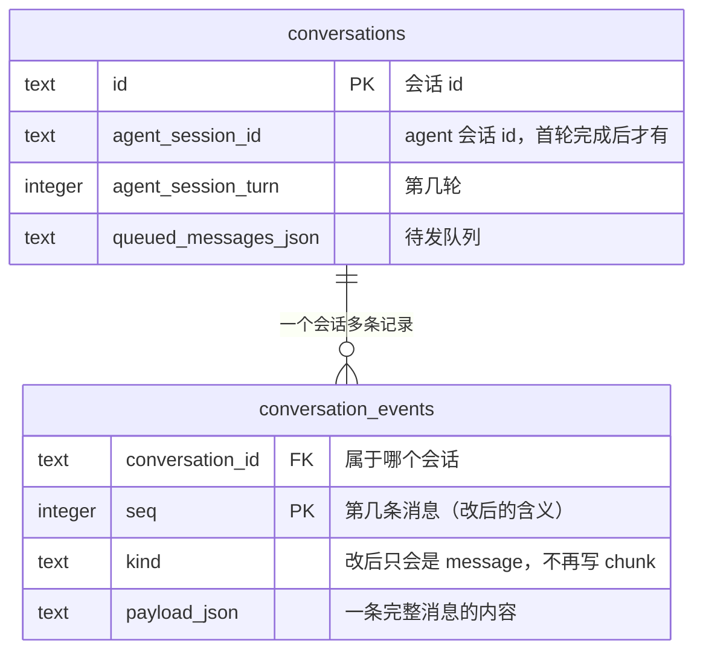

三个连带的简化：

- **编号的含义收敛了**：从「第几条落盘记录」变成**「第几条消息」**。
- **那条铁律自动消失**：没有删除逻辑了，自然不用再管「谁能占编号」。
- **「这一轮从第几号开始」这个概念也不需要了**：它只服务于删除。

至于表结构：**`kind` 这一列保留不动**（迁移的麻烦大于收益，将来也可能有别的用途），只是代码不再往里写 `chunk`。上线时跑一次清理，把历史遗留的垃圾行一并扫掉。

### 5.6 「有没有 agent 在跑」改成明说

前端那个反推（看最后一条是不是临时行）失效了，因为历史里不再有临时行。改成服务端直接告诉它——会话详情里加一个字段：

```ts
/** 这个会话此刻有没有 agent 在跑。 */
turnInProgress: boolean;
```

**把猜测换成事实**，顺带修掉一类潜在误判。

### 5.7 完整的写入时序

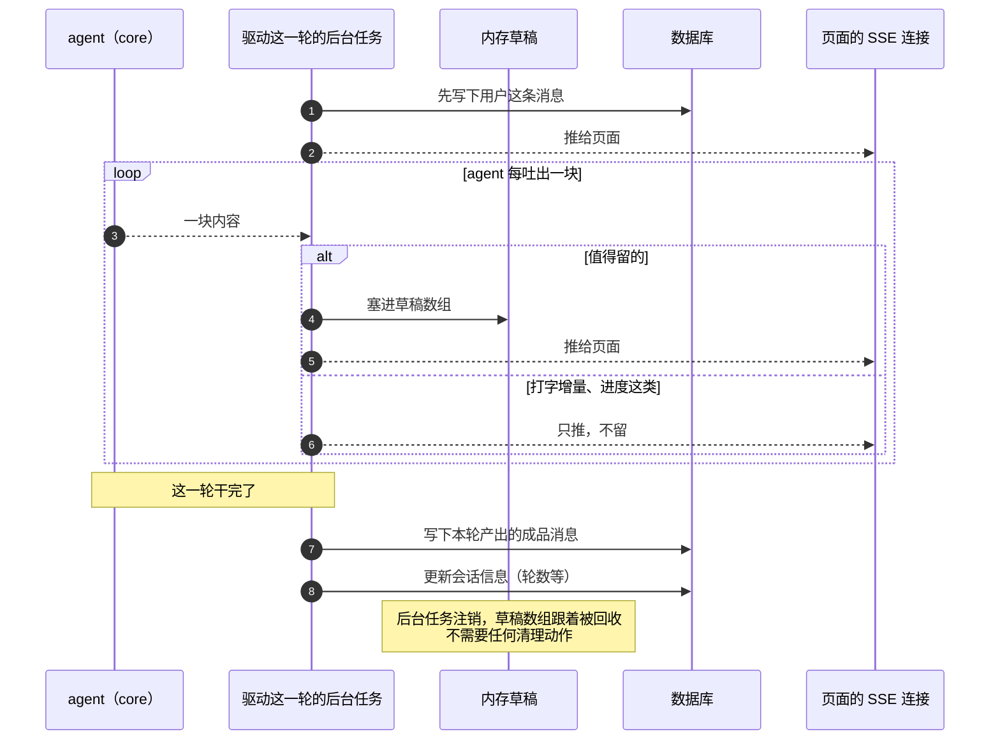

### 5.8 一条一直存在、但没写下来的保证

数据库操作是**同步**的，「写成品 + 更新会话信息」整段跑在一段不会被打断的代码里。

所以**重连请求不可能看到「写了一半」的状态**：要么看到旧的（草稿还在、agent 还在跑），要么看到新的（成品齐了、这一轮结束）。现在的代码其实已经在依赖这一点，只是从来没写下来过。

### 5.9 崩溃恢复的判据被打掉了——要同时补上起轮标记

**这一节是本方案的必要配套，不做就会留一个洞。**

今天服务端识别[孤儿轮](../../../terms.md)（进程被强杀、没人给它收尾的那些轮）靠的是一条**间接判据**：看这个会话的事件行**是不是以 `kind='chunk'` 收尾**——优雅收尾会把本轮消息落成 message 行并清掉 chunk 行，所以「结尾还留着 chunk 行」就等于「它死了」。启动时扫出这些会话，补一条「已停止」。

**草稿一搬进内存，chunk 行就不存在了，这条判据直接失效。** 症状不是报错，是**静默失灵**：崩溃遗留的会话永远停在「正在干活」，用户看到一个转不完的圈，重启也不自愈。

**换成直接判据：[起轮标记](../../../terms.md)。** 起轮时往库里写一行「这一轮由谁在跑」，收尾时删掉；启动扫描时，**库里还留着标记 = 那一轮没人管了**，补「已停止」。

三点说明：

- **它不是「为多机预留」，是本方案的直接依赖。** 这一点容易误判成可以往后排——不能排，它和「草稿放内存」必须同一批上，中间不能有空窗。
- **它就是[归属仲裁](../../../terms.md)那张归属表的最小形态**——只有「谁在跑」，还没有心跳、没有[租期标识](../../../terms.md)。将来做多节点时在它上面长，不用推倒重来。
- **判据从间接变直接，顺带修掉一类误判**：今天那条判据依赖「chunk 行会被 GC 掉」这个副作用，GC 一旦漏跑就会把活着的轮误判成孤儿。

> 完整的归属表形态、心跳与租期标识见 [架构总纲 · 技术方案 §3 · §5](../../../architecture/tech/agent-kernel.md) 与 [归属仲裁机制（宿主层） · 技术方案](../../arbitration/tech/arbitration-impl.md)；本节只要最小形态。

## 6. 改完有什么变化

### 6.1 用户能感觉到的

**只有一条**：

| 什么时候 | 现在 | 改后 |
|---|---|---|
| 服务在 agent 干活时崩了/重启了，之后刷新页面 | 能看到那一轮的半截输出 | 只看到自己发的那条消息，agent 那半是空的 |

**其余全都不变**：干活时刷新、断线重连、多个标签页同步、审批卡片重建、点停止——行为一模一样。

### 6.2 开发能感觉到的

- 数据库里不再攒永久垃圾
- 「有没有在跑」从猜变成事实
- 少一套删除逻辑、少一条铁律、少一个概念

## 7. 内存吃多少

草稿装的是本轮全部值得留的数据，最大头是命令的输出（有时上百 KB）。

粗算：一轮 20 次工具调用 × 100KB ≈ **2MB**；10 个会话同时跑 ≈ **20MB**。本地单进程完全够用。

**故意不设上限**：草稿一旦被截断（丢掉最早几块），5.3 那个「整份重发」就不完整了，重连会看到一个缺了开头的画面——那比多占几十 MB 糟糕得多。真要给内存设界，正确解法见[附录 D](#附录-d以后可以做的成品边跑边存)，不是截断。

> 多机部署下内存方案会失效——那是另一个话题，见[附录 C](#附录-c关于多机部署)。结论先给：**多机的正解是按会话固定路由，不是把草稿外置**。

## 8. 取舍清单

- **崩溃后看不到半截输出**：唯一的功能退让，理由见 3.1——它保护的那一轮本来就已经死了。
- **靠幂等，不靠去重**：正确性依赖「同一段数据重放产出同 id 消息」。这由 agent 在开头带上消息 id 来保证。**万一将来那边改成不带 id，这条就断了——必须写进测试当护栏。**
- **草稿不设上限**：宁可多占内存，不接受截断后的残缺重放。
- **单实例假设不变**：本方案没让这件事变好也没变坏（见[附录 C](#附录-c关于多机部署)）。
- **表结构不动**：只做一次性数据清理，不做迁移。

## 9. 怎么施工

细化后落到[施工进展](../plans/in-flight-draft.md)。

| # | 干什么 | 动谁 |
|---|---|---|
| 1 | 草稿改写内存；去掉删除逻辑与「本轮起始编号」 | 服务端 |
| 2 | 删掉删除函数；跑一次历史垃圾清理 | 服务端 |
| 3 | SSE 补发草稿快照（注意 5.4 两个坑）；会话详情加「有没有在跑」 | 服务端 |
| 3b | **起轮标记**：起轮写、收尾删；启动扫描改用它判孤儿轮（[5.9](#59-崩溃恢复的判据被打掉了要同时补上起轮标记)）——**必须与第 1 项同批上线** | 服务端 |
| 4 | 接口改名 `events` → `messages`，返回体收窄；重生成接口文档与前端 client（[附录 A](#附录-a顺手改个接口名)） | 服务端 + 前端 |
| 5 | SSE 给成品消息帧补 `id`（[附录 B](#附录-bsse-的-id-字段与原生-resume)） | 服务端 |
| 6 | 网络数据形状去掉编号字段 | 服务端 + 前端 |
| 7 | 前端改用新接口与新字段；拼装消息的模块**不动** | 前端 |
| 8 | 测试：重放幂等、崩溃后行为、**崩溃后孤儿轮能被扫出来补「已停止」**、干活中刷新画面完整、编号只由消息消耗 | 服务端 + 前端 |
| 9 | 回头修订[账本设计](./single-ledger.md) §2.4／§6，产品文档补一句行为变化；[术语表](../../../terms.md)「孤儿轮」的识别特征改成起轮标记 | 文档 |

**顺序**：1 + 3b → 2/3/4/5/6 → 7 → 8；第 9 项收尾（代码落地后再改账本设计，免得文档跟实现对不上）。

> **1 和 3b 必须同批**：草稿一进内存，旧的孤儿轮判据就失效了，中间不能有空窗。理由见 [5.9](#59-崩溃恢复的判据被打掉了要同时补上起轮标记)。

---

# 附录

以下四节都不在主线上——不读也能理解方案本身。附录 A、B 是跟着这次一起做的小改动，C、D 是暂不实施的讨论。

## 附录 A：顺手改个接口名

取历史的那个接口今后只返回消息了，`events`（事件流水）这名字已经名不副实。

| | 现在 | 改后 |
|---|---|---|
| 路径 | `GET .../events` | `GET .../messages` |
| 返回 | 消息 + 临时数据混在一起 | 只有消息 |

**和已有的 `POST .../messages` 同路径不冲突**，反而更顺：同一个东西，`POST` 是加一条，`GET` 是列出来，标准做法。

三点说明：

- 返回的每条仍然带编号，因为断线重连要拿它当书签。改完之后 `?after=<编号>` 读起来终于是字面意思了：「给我第几条之后的消息」。
- **不保留旧路径**：这些应用都不对外发布、前后端同仓一起上线，没有外部使用者，直接改。
- **分页不搭这趟车**：历史长了返回体会很大（今天也一样），但那是另一件事。

## 附录 B：SSE 的 `id` 字段与原生 resume

SSE 协议本身自带断线续传：服务端给每个事件发一个 `id:`，浏览器记住它，断线重连时用 `Last-Event-ID` 请求头带回来。我们现在**没发这个字段**（游标走 query 参数 `?after=<编号>`）。

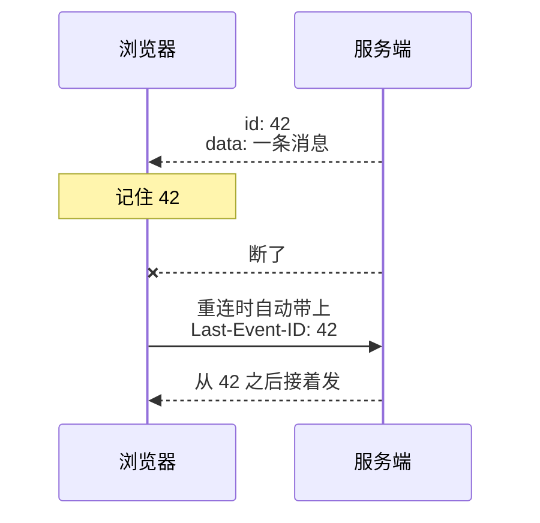

**这次顺手把 `id` 补上**——只在成品消息帧上发 `id: <编号>`，草稿帧和队列帧不发。

为什么正好现在补：改完之后，需要传的游标**只剩「最后一条成品消息的编号」这一个**（草稿是全量重发的，不需要游标）。而 SSE 规范规定「**只有带 `id` 的事件才更新浏览器记住的那个值**」——所以只给成品消息发 id，那个值自动就是我们要的语义，一点不用凑。

三点说明：

- **这次不改客户端**。我们用的是 fetch 手写解析（不是浏览器原生 `EventSource`），重连和退避都是自己控的——继续这么用。
- **成本几乎为零**，而且客户端的解析器**本来就在解析 `id` 字段**，只是没人用。
- **将来真要切换到原生 `EventSource`，服务端一行都不用改。**

### 为什么不干脆改用原生 `EventSource`

语义上确实契合（连认证都不挡路——我们用 cookie，`EventSource` 同源天然带 cookie），但换过去是净亏：

**① 它不认「正常结束」**，这条最致命：


要打破这个循环，就得让客户端收到「结束」信号后主动关闭——那自动重连的价值本身就打折了。

**② 退避不可控**：只认服务端给的一个固定间隔，没有指数退避、没有「试几次就放弃」。我们现在这套是有意设计的。

**③ 拿不到错误详情**：它的错误事件不给 HTTP 状态码和响应体，没法把服务端的错误消息显示给用户。

**④ 省下的很少**：一段重连代码加一个解析器，而解析器早就写好测好了。

**最根本的一点**：我们要的不是「重连」，是**「重连并补齐」**。补齐逻辑（回放账本 + 全量草稿）在服务端，`Last-Event-ID` 只是送游标的一个渠道——原生 resume 帮不上补齐那一半，而那才是难的一半。

## 附录 C：关于多机部署

**这一节回答一个自然的追问**：草稿放内存，多个服务器实例时用户请求打到别的实例上就读不到了——是不是该把「草稿存哪」做成可替换的插件（内存 / Redis / 数据库 / 消息队列各来一个）？

**方向对，但它只解决了四分之一的问题。**

一轮是个在进程里跑的长任务，它同时攥着五样东西：

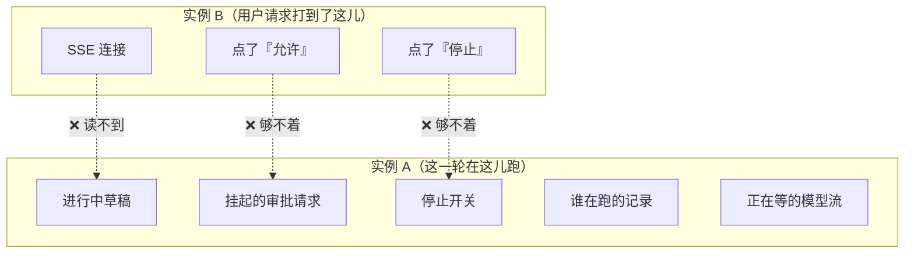

草稿插件只能解决最上面那一条。**审批那条最要命**：用户在实例 B 点了「允许」，而那个等待挂在实例 A 的内存里——这是**控制问题，不是存储问题**，而且会**静默失败**（用户点了没反应）。

**所以多机的正解是按会话做固定路由**（同一个会话的所有请求——发消息、SSE、审批、停止——永远打到同一个实例），而不是把五样东西逐个外置。代价是实例挂掉那一轮丢失，但这跟今天单进程重启的结果**完全一样**，没变差。

> **本节写于本方案定稿时，此后有了正式方案，两处要以它为准**（见 [架构总纲 · 技术方案](../../../architecture/tech/agent-kernel.md)）：
>
> 1. **「固定路由」已经定案，并且定得更细**：所有权模型 = **单一所有者 + 路由**，sticky **不依赖基础设施**、由[接入层](../../../terms.md)自己转发；亲和的单位是**「一次排空」**，不是一轮，也不是会话永久绑定。上图那五样东西也已各自归位——「谁在跑的记录」归[归属仲裁](../../../terms.md)，「挂起的审批请求」归人工裁决表，「停止开关」归[轮编排](../../../terms.md)。
> 2. **「审批只能在进程内存里等」这个前提已被推翻**，见下面 C.1 的修订。

### C.1 佐证：AI SDK 自己也不认为「挂起的审批」能在无状态下工作

官方文档里人审只有两条路，**都不是「把等待外置」**：

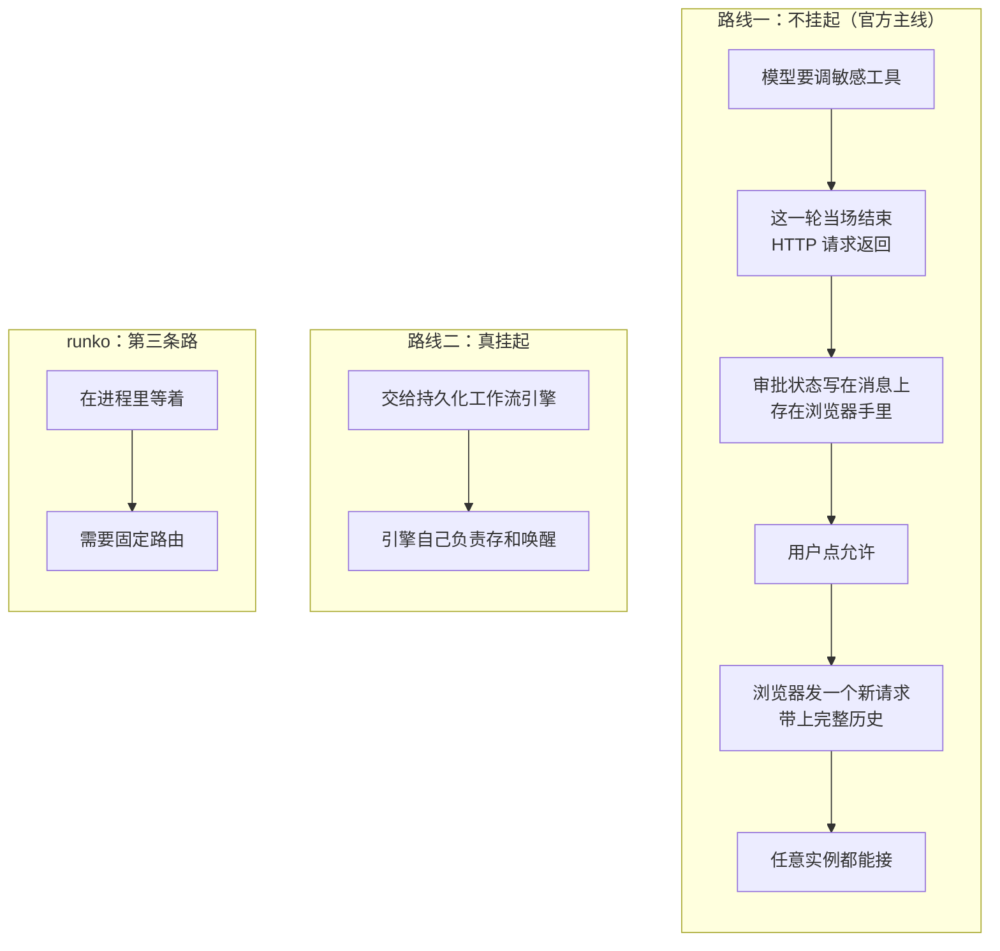

路线一的代价被文档自己点名了：**消息历史是浏览器传上来的**，所以浏览器可以伪造一段「已批准」的历史，绕过人工审批。官方为此加了签名机制——签发审批时用密钥签一下（绑死工具名、调用 id、参数），回放时验签，改任何一个字段签名就失效。文档原话是「**一个实例签发审批，另一个实例在下一轮验证它**」——为跨实例专门设计的。

**对我们的三点意义**：

- **我们选的是第三条路。** 换来的是「一轮语义完整」（agent 停下来等你，而不是结束了再重来）和账本干净，代价就是需要固定路由。这跟本附录的结论一致，不是妥协。

  > **这一条已经过时，以 [架构总纲 · 技术方案 §4](../../../architecture/tech/agent-kernel.md) 为准。** 上图那个「runko：第三条路 = 在进程里等着 → 需要固定路由」画的是**只在内存里等**，而正式方案是**混合模式**：先在内存里等一段（默认沿用[审批保活预算](../../../terms.md) 5 分钟），**等不到就[挂起](../../../terms.md)**——落盘退出、释放归属、腾出机器，人几小时后回来**在任意节点**恢复。
  >
  > 所以「等人」不再要求那个节点一直活着，固定路由只在**内存窗口那一段**内需要。三点澄清：
  >
  > - **恢复是「开新的一轮」**，不是同一轮续跑——归属、轮统计、保活上限、检查点、前端指示因此一样都不用重新定义。
  > - **必须用账本里原封不动的参数执行**。走「告诉模型你被批准了、你再发一次」那条路，模型可能发出参数不同的命令——用户批准的和实际跑的不是同一条，审批闸门形同虚设。
  > - **挂起点只有一个**：正在等人。那是唯一的干净边界。**所以这仍然不是 durable execution**（任意点可暂停），下面「路线二」依旧不是我们的路。
- **我们现在天然免疫那个伪造攻击**：审批状态在服务端内存里，账本也是服务端说了算（不是浏览器传上来的）。官方主线要额外加签名才能达到同等安全。
- **反过来是个警告**：将来如果为了多机改走无状态路线，会**连带继承那个攻击面**，那时必须同时补上签名机制。不能只搬架构不搬防护。

好消息：我们的审批数据形状跟 AI SDK 是同一套，真要切换，**前端几乎不用动**。

### C.2 那插件到底做不做

**本次不做**，两条理由：

1. **只有一个实现时，抽象是瞎猜。** 接口该长什么样、失败了怎么办，没有第二个真实用例来校验，等真上 Redis 会被现实改一遍。
2. **做了反而危险。** 草稿插件化之后看起来「多机已就绪」，实际另外四样还散在内存里——审批一上多机就静默坏。这比明确写着「暂不支持多机」糟糕得多。

**取而代之的施工约束**：草稿的读写**只允许出现在两个地方**——写在「吐出一块内容」那一处，读在「SSE 补发」那一处。别让这个数组泄漏到其他文件。这样将来换实现是**改一个文件**，不是全局手术。

如果将来真要做，接口形态记住两条：

- **必须是「发布/订阅」，不能是「存/取」**——新连上的人既要历史快照、又要后续增量。
- **「拿快照 + 挂订阅」必须是一个动作**，不能拆成两步让每个实现方各自处理竞态（就是 5.4 那个坑）。

> **这两条后来被采纳为[流分发](../../../terms.md)模块的硬约束**，连同下面这张后端对照表——见 [流分发（宿主层） · 技术方案 §3](../../../host/contract/tech/stream-fanout.md)。「本次不做」的结论不变：真正需要外部流分发的只有 Vercel 那一档，其余形态靠单进程内置或[接入层](../../../terms.md)转发就够。

各种后端的适配性差别很大：

| 后端 | 行不行 | 为什么 |
|---|---|---|
| 内存 | ✅ | 单实例 / 固定路由下最优 |
| Redis Streams | ✅ | 天生就是「可重放的日志 + 订阅」，还自带过期 |
| Redis 裸 pub/sub | ⚠️ | 只推不存历史，还得自己配一份快照，两者的一致性要自己保证 |
| 数据库 | ❌ | **能存不能推**，只能轮询；SQLite 连通知机制都没有。这正是我们要逃离的姿势 |
| 消息队列 | ❌ | 语义错位：队列是「送到就消失」，草稿要的是「谁来都能从头拿全」 |

## 附录 D：以后可以做的——成品边跑边存

**想法**：不等整轮结束，每写完一条消息就立刻存下来，同时把它那段草稿从内存丢掉。这样草稿只留「当前正在写的那一条」，内存有上限；崩溃后还能保住已完成部分的**成品**（比现在的半截数据有用得多）。

**可行性已确认**：agent 那边「这条消息写完了」的信号，确实是在全部工具都结算完之后才发出的，此时成品是完整的。

**但有个真实的坑**：整轮的统计数据（token 用量、耗时、成功失败）是写在**最后一条**消息上的——也就是说最后一条在「写完」之后**还会被改一次**。于是要么提前知道哪条是最后一条（做不到），要么轮末回头改那一行（破坏「消息存下就不再变」这条简单性）。

**结论**：收益是真的，但它引入的复杂度和本方案要拆掉的是同一类。**先把主线做完，这个另议**——真到内存成问题时再评估。

> **一个容易搞混的地方，先澄清**：[挂起](../../../terms.md)**不需要**本附录这件事。挂起是**主动的**、停在干净边界上（正在等人），可以从容地**一次性**写下当前进度；本附录是「每写完一条就落盘」的**持续**写入，那是为**崩溃**准备的。两者不是一回事。
>
> 所以「要不要把本附录并进[起轮标记](../../../terms.md)那一阶段」**仍然真的没定**——它是 [架构总纲 · 技术方案](../../../architecture/tech/agent-kernel.md) 「还没定的」里挂着的一条，不是已经被挂起方案覆盖掉了。
