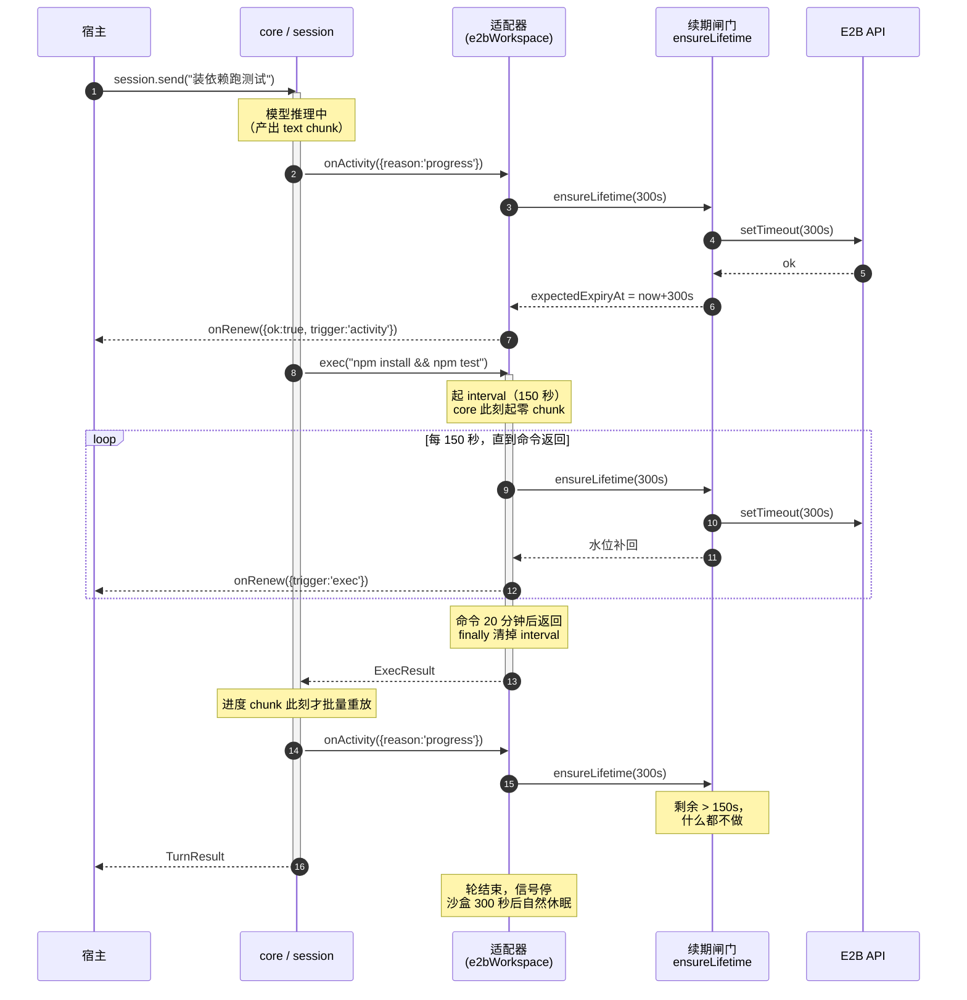
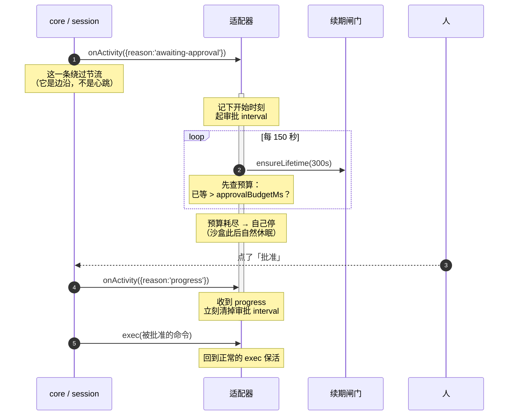

# 沙盒保活 —— 技术方案

> 本文用到的术语见 [docs/terms.md](../../../terms.md)。
> 产品文档见 [功能](../features/sandbox-keepalive.md)，[施工进展](../plans/sandbox-keepalive.md)。

## 1. 已核实的平台事实

这些是设计的地基，全部经过官方文档或真机核实，不是推测。

| 平台 | 时效模型 | 续期 API 的语义 | 能查剩余吗 |
|---|---|---|---|
| **Vercel** | 租期倒计时，平台不看活动 | `extendTimeout(ms)` 是**往剩余租期上加时**，不是重置 | 能，`sandbox.expiresAt` 是到期时刻 |
| **E2B** | 倒计时，平台不看活动 | `setTimeout(ms)` 是**重置为从现在起 ms** | 没有直接属性 |
| **Cloudflare** | `sleepAfter` 是真·空闲检测，有活动自动续 | 不需要 | 不适用 |

> **订正**（施工时核 `@vercel/sandbox@2.5.0` 的 d.ts）：查剩余要用 **`sandbox.expiresAt`**（`get expiresAt(): Date | undefined`，官方注释 "When the currently running session will time out"），**不是 `sandbox.timeout`**。后者的官方注释是 "The **default** timeout of this sandbox"——建盒时配的时长，不是剩余量。[turn-checkpoint](./turn-checkpoint.md) §5 原文写的是 `sandbox.timeout`，那一处不准。用错的话「还剩多久」会恒等于建盒配置值，补足判定整个失效。

两条要特别记住：

1. **Vercel 和 E2B 的续期语义不一样。** 一个是加法，一个是赋值。把它们当同义词用会出错——见下面 §2.2。
2. **跑命令不会续期**（Cloudflare 除外）。E2B 官方文档原话是"沙盒将在**请求时刻**起 x 秒后过期"。真机对照：某盒 `startedAt 09:52:53`，续期一次后到期时间钉在 `10:00:56`，其间跑了 2.5 分钟命令，纹丝不动。

E2B 还有个硬上限：**Pro 账户最长 24 小时，Hobby 最长 1 小时**（见 `e2b@2.32.0` 的 `Sandbox.setTimeout` 文档注释）。保活不是长生药。

## 2. 两个关键决定

### 2.1 保活下沉进 SDK（推翻 P13-2b 的原定位）

[turn-checkpoint](./turn-checkpoint.md) §5（P13-2b，方案定稿未施工）原本规定保活"封在 chat 应用的 `SandboxClient` 实现里，**不进 nimbo SDK / 适配器**"，理由是 [BYO 实例](../../../terms.md)原则里"超时延长点名归宿主"。

**本方案推翻这一条。** 理由有三：

1. **知识归属错位。** "E2B 的 setTimeout 是绝对时间"这类知识，天然属于懂 E2B 的那个包。放在宿主意味着每个用 `@nimbo/sandbox-e2b` 的人都要重新踩一次坑——而且是静默的坑。nimbo 自己就是靠一次线上事故才发现的。

2. **「补足」语义只有适配器做得干净。** 补足要知道"现在还剩多少"。适配器天然记着自己上次设了什么值、什么时候设的；宿主要做就得自己记一份账，或者多一次查询往返。

3. **冲突其实可以化解。** P13-2b 说的"归宿主"是**生命周期所有权**——谁建盒、谁销毁、要不要开保活。这些在本方案里**一样归宿主**：沙盒是宿主 `Sandbox.create()` 的，保活是宿主写 `keepAlive` 配置显式开的。下沉的只是**续期动作怎么执行**。

保留 P13-2b 的两个设计：**补足语义**和**单轮保活上限**。

### 2.2 语义统一为「补足」，不是「续期」

接口叫 `ensureLifetime(targetMs)`：**把剩余存活时间补到至少 targetMs，够了就什么都不做。**

这修掉一个现存 bug。`apps/node-server/src/agent/sandbox-manager.ts:157` 现在是：

```ts
extendIdle: (idleTimeoutMs) => sandbox.extendTimeout(idleTimeoutMs),   // Vercel
```

因为 Vercel 是**加时**，每条用户消息都会盲加 5 分钟。高频对话十几轮之后，沙盒会多活几十分钟白计费，还可能撞上套餐总时长上限。

补足语义天然免疫这个问题——剩余够了就不打网络。

## 3. 架构：两个信号源，一个闸门

保活由两个互相独立的信号源驱动，它们**从不在 SDK 层碰面**，而是汇进适配器内部的同一个 [续期闸门](../../../terms.md)。

```
core                          适配器（e2bWorkspace / vercelWorkspace）      厂商 API
────                          ─────────────────────────────────────        ────────
chunk 流
  │
  └ leading-edge 节流（5 秒）
      │
      └──► onActivity(signal) ────┐
                                  │
   宿主手动 keepAlive(ms) ────────┼──► 续期闸门 ──► setTimeout / extendTimeout
                                  │    ensureLifetime()
   exec() 进行期间 ───────────────┘    「剩余够吗？」
   自己的 interval（T/2）
   ← 内部信号，core 看不见
```

### 3.1 为什么必须是两个源，不能只用 chunk

**因为 core 在执行工具期间不产出任何 chunk。**

`packages/core/src/loop.ts:582` 把工具进度先缓冲起来：

```ts
onProgress: (partial) => progressChunks.push(partial),
```

`loop.ts:594` 在 `executeToolCall` **resolve 之后**才重放成 chunk。旁边的注释自己写着：

> `ctx.update()` 是同步回调，生成器不能从回调内部 yield，因此先缓冲、`executeToolCall` resolve 后按到达顺序重放——效果是"进度确实以 chunk 到达"，但**不与执行过程严格实时交错**

所以一条跑 10 分钟的命令，这 10 分钟里 core yield 出去的 chunk 数是 **0**。不是"静默命令才没信号"——是任何 exec 期间都没有，哪怕命令每秒打一千行日志。

而长轮次主要**恰恰**由单条慢命令造成。纯 chunk 驱动会在最需要它的地方完全失效。

**补法**：适配器在自己的 `exec()` 里起 interval。适配器就是那个在 `await` 的人，它根本不需要 core 告诉它——它手里握着一个没 resolve 的远程调用，这是比 chunk 更硬的证据。

### 3.2 为什么不改 core 让进度实时产出

那要动核心流水线：同步回调里没法 yield，得引入一个异步队列桥接。会改变 chunk 的到达顺序，可能影响 web 端渲染。而适配器自持 interval 已经解决了同一个问题，不值得为它承担这个风险。**本工单明确不做。**

### 3.3 为什么两个源不需要"合并逻辑"

因为它们喂的是同一个函数。闸门的核心状态是**一个时间戳**（`expectedExpiryAt`）。两个源都调 `ensureLifetime()`，够了就返回，不够才打网络。

不需要事件总线、不需要订阅。

**并发工具调用**（`loop.ts:896` 的 `mergeSettleStreams` 会让多个工具同时执行）：多个 `exec()` 共用**一个**定时器 + 引用计数（第一个 `beginExec` 起、最后一个停止函数清），比每个 exec 各起一个定时器省。停止函数幂等。

> 落点订正：闸门实现在 **`@nimbo/core` 的 `keepalive.ts`**（`createKeepAlive`），不在各适配器包里。原因是 E2B 与 Vercel 的闸门逻辑逐行相同，两份拷贝必然漂移，而补足语义要可预测就要求两家严格一致。**这不违反「core 零保活策略」**——`session.ts` 不 import 也不调用它，只有适配器显式构造时才产生定时器。厂商真正不同的两件事（怎么查剩余、怎么补）经 `KeepAliveDriver` 注入。

## 4. 核心流程时序图

### 4.1 一轮里的保活（含一条长命令）



### 4.2 卡在人工审批时



**这里有一条隐式契约要保证**：审批结束后一定会有后续 chunk。已核对 `loop.ts:704`（拒绝）和 `loop.ts:715`（批准）——两条路径都会 yield `tool-approval-response`，契约成立。

## 5. 接口设计

### 5.1 core 侧：`NimboActivityAware`

放在 `packages/core/src/types.ts`，与 `NimboFS.searchFiles?` / `NimboExec.describe?` 是同一类**可选能力接缝**。

```ts
export interface ActivitySignal {
  /** 会话与轮次。实现方据此识别「新的一轮开始了」，重置自己的预算计数。 */
  session: { id: string; turn: number };
  /** 现在在等什么。实现方可以给两者不同的预算。 */
  reason: 'progress' | 'awaiting-approval';
}

export interface NimboActivityAware {
  /**
   * 「这一轮还在干活」。
   *
   * 必须同步返回 void，绝不能返回 Promise、绝不能抛错——core 不会 await 它，
   * 也不会 catch 它。续期是网络往返，实现方内部自己 fire-and-forget、自己吞错。
   */
  onActivity?(signal: ActivitySignal): void;
}
```

**为什么必须同步返回 void**：core 是在 chunk 流的推进路径上调它的。要是 core `await` 一次网络往返，整条流就被拖住，用户看到的打字机效果会一顿一顿。

### 5.2 core 侧：调用点与节流

改动点在 `packages/core/src/session.ts:590-598` 那个已有的循环里：

```ts
let next = await turnGen.next();
while (!next.done) {
  const chunk = next.value;
  if (chunk.type === "message-metadata") turnActive = false;
  notifyActivity(chunk);          // ← 新增，放在 yield 之前
  yield chunk;
  next = await turnGen.next();
}
```

放在 `yield` **之前**，因为 `yield` 会把控制权交给消费者，消费者可能很慢。

`notifyActivity` 的规则：

| chunk 类型 | 发什么 | 走节流吗 |
|---|---|---|
| `tool-approval-request` | `reason: 'awaiting-approval'` | **不走**（边沿事件，必须立刻到） |
| 上一次发的是 `awaiting-approval`，本次任意 chunk | `reason: 'progress'` | **不走**（必须立刻到，否则审批 interval 停不掉） |
| 其它 | `reason: 'progress'` | 走，leading-edge，默认 5 秒 |

**节流必须是 leading-edge**（纯 `Date.now()` 比较），不能是 trailing-edge——后者需要定时器，而 core 保持零定时器是这个设计的前提。

**节流间隔为什么可以写死 5 秒**：core 侧的节流只是**降噪**（chunk 可能每秒几十个），不是策略。真正的续期节奏由适配器的闸门决定。所以 **core 不需要知道沙盒超时是 5 分钟还是 1 小时**——它没有这个信息，也不该被迫决定这个参数。

`session.send()` 内部也是 drain `stream()`（`session.ts:615`），所以流式和非流式两条路径都自动有信号，不用分别处理。

### 5.3 适配器侧：配置与手动入口

```ts
export interface KeepAliveOptions {
  /** 每次补足到多少。应与建盒时的 timeout 一致。 */
  idleTimeoutMs: number;
  /** [单轮保活上限](../../../terms.md)，默认 30 分钟。到点停止续期。 */
  maxTurnMs?: number;
  /** [审批保活预算](../../../terms.md)，默认 5 分钟。配 0 = 审批期间完全不续。 */
  approvalBudgetMs?: number;
  /** 每次真的调用了厂商 API 之后触发。 */
  onRenew?(info: RenewInfo): void;
}

export interface RenewInfo {
  ok: boolean;
  /** 这次是被谁触发的。 */
  trigger: 'activity' | 'exec' | 'approval' | 'manual';
  /** 续期后预计的到期时刻（epoch ms）。宿主用它同步自己的缓存状态。 */
  expiresAt?: number;
  error?: unknown;
}
```

工作区对象上多一个可选方法（core 侧类型名 `NimboKeepAliveCapable`），给宿主在**轮之外**手动用：

```ts
/** 手动补足一次。宿主在 core 的轮还没起或已经结束时用（如 chat 应用的路由）。 */
keepAlive?(targetMs: number): Promise<void>;
```

自动那套就建在它上面——同一个闸门，只是触发者不同。

### 5.4 闸门实现

```ts
let expectedExpiryAt = 0;   // 未知时视作「已到期」，第一次必定真的续

async function ensureLifetime(targetMs: number, trigger: RenewInfo['trigger']): Promise<void> {
  const now = Date.now();
  const remaining = expectedExpiryAt - now;
  if (remaining >= targetMs / 2) return;      // 水位够，什么都不做

  try {
    await renewToTarget(targetMs, remaining); // 厂商差异在这里，见 §5.5
    expectedExpiryAt = now + targetMs;
    opts.onRenew?.({ ok: true, trigger, expiresAt: expectedExpiryAt });
  } catch (error) {
    opts.onRenew?.({ ok: false, trigger, error });
    // 不抛。续期失败不该打断这一轮——沙盒真死了，下一次工具调用会给出好得多的错误。
  }
}
```

**水位阈值取 `targetMs * 0.75`，打点周期取 `targetMs / 2`。**

> **订正**（施工时踩到）：这两个数**必须错开**。一开始两者都取 1/2，结果定时器每次恰好在「剩余 = 目标一半」的那一刻触发，`>=` 判定成立 → 永远跳过 → 除首次外一次都不续期。阈值抬到 3/4 后：每次打点时剩余是 1/2，稳稳低于 3/4 必定放行；而刚续过就再调（剩余接近满）必定被挡——这正是 Vercel「加时」型 API 不会被反复累加的保证。回归测试见 `packages/core/test/keepalive.test.ts` 的「判定线必须高于打点周期占比」。

### 5.5 三家的 `renewToTarget` 实现

| 平台 | 实现 | 说明 |
|---|---|---|
| **E2B** | `setTimeout(targetMs)` | 重置语义，天然幂等，一次调用完成补足 |
| **Vercel** | 读 `sandbox.expiresAt` 拿真实剩余，`extendTimeout(targetMs - 剩余)` | 加时语义，必须算差额。差额计算导出为纯函数 `extensionFor()` 以便单测 |
| **Cloudflare** | 不实现 `onActivity` / `keepAlive` | `sleepAfter` 是真空闲检测，有活动自动续，不需要 |

**Vercel 用真实剩余而不是本地记的 `expectedExpiryAt`**，因为它提供了 `sandbox.expiresAt` 属性。这比本地记账准（本地账在 resume 场景下会不准——盒已经跑了一段时间，适配器不知道跑了多久）。

E2B 没有对应属性，只能靠本地记账。但因为它是重置语义，记账不准的后果只是"多续一次"，不会导致盒死掉。

## 6. 宿主侧（chat 应用）的迁移

`apps/node-server/src/agent/sandbox-manager.ts` 的改动：

| 现状 | 改成 |
|---|---|
| `startHeartbeat()` / `heartbeats` Map / `heartbeatIntervalMs` | **全部删除**，由适配器接管 |
| `turn-launcher.ts:384/396/420` 三处心跳起停 | **全部删除** |
| `ProvisionedSandbox.extendIdle(ms)` | 改名 `ensureLifetime(ms)`，实现转发到 `workspace.keepAlive` |
| `SandboxManager.touch()` | 改名 `ensureLifetime()`（`touch` 已是[退役叫法](../../../terms.md)） |
| `markAlive(entry)` 在 touch 成功后调 | **改为在 `onRenew` 回调里调** |

### 6.1 `onRenew` 不是可选观测口，是必需的状态同步口

这是最容易漏的一处连锁反应。

`sandbox-manager` 用 `ActiveSandbox.expiresAt` 做进程内缓存的失效判断。续期一旦沉进适配器，manager 就**不知道续过了**：

> 轮开始续一次 → `expiresAt = now + 5min`。轮跑 30 分钟（适配器内部一直在续，沙盒好好的）。轮结束。1 分钟后新消息进来 → `liveEntry()` 看到 `expiresAt` 早过了 → 驱逐 → **白走一次 `resume()`**。

不是正确性 bug（resume 能成），但每轮多一次连接往返，正好打在 `AcquireMode` 遥测最在意的地方。

所以 node-server 必须在 `onRenew` 里调 `markAlive`，把适配器的续期同步回自己的账本。

### 6.2 转发时必须显式判空

```ts
ensureLifetime: (ms) => {
  if (workspace.keepAlive === undefined)
    throw new Error(`provider ${id} 的工作区不支持保活`);
  return workspace.keepAlive(ms);
},
```

**不能写成 `workspace.keepAlive?.(ms)`**——那会把"这家不支持保活"静默变成 no-op，正好复现已经修过的那个线上 bug，而且更难查。

### 6.3 顺带解耦

`turn-runner.ts:1096` 的 `CHAT_APPROVAL_TIMEOUT_MS`（240 秒）注释里写着，这个值取 240 秒是因为"要赶在沙盒自己空闲超时之前把无人应答的审批拒掉"。保活接管之后这个保命职责没了，它可以回归纯产品决策（人多久不理算放弃）。**本工单不动这个数值**，只在注释里去掉那层耦合说明。

## 7. 已知限制

1. **exec 期间 core 零 chunk**（`loop.ts` 缓冲重放，见 §3.1）。靠适配器自持 interval 补。本工单不改 core 的这个行为。
2. **审批期间 core 零 chunk**（`loop.ts:686-688`）。靠适配器的审批状态机补，进入靠 `tool-approval-request` 边沿，退出靠下一个 chunk。
3. **轮被中断时正卡在审批**：没有后续 chunk 来清那个 interval，只能等预算耗尽。最长多续一个 `approvalBudgetMs`。
4. **`idleTimeoutMs` 要写两遍**（建盒时一次、`keepAlive` 配置一次），不一致很难查。适配器 README 要写明。
5. **E2B 的 `idleTimeoutMs` 有配置上界**：Pro 24 小时、Hobby 1 小时——超了 `setTimeout` 会报错。

   > **别读成「会话最多只能等 24 小时」。** 这个上界管的是**连续运行**能补到多远，不是「一个会话最多能停多久」。
   >
   > **E2B 暂停之后是无限期保存的，而且不计费；恢复还会重置那个连续运行窗口。** 所以[挂起](../../../terms.md)的会话——落盘退出、沙盒休眠——人隔多久回来都能[恢复](../../../architecture/tech/agent-kernel.md)，代价只是唤醒沙盒的几秒。两件事容易混，因为都以「时长」计。
6. **只保证沙盒还活着**，不保证沙盒里的命令做了什么。
7. **不做自愈**。续期失败只记录，不重连不重放。理由见 [sandbox-provider](../../../host/contract/tech/sandbox-provider.md) §5.1。

## 8. 测试策略

全部可以离线跑，零网络零凭证。

| 层 | 怎么测 |
|---|---|
| **闸门** | 假时钟（vitest fake timers）+ 记录调用时刻的 fake sandbox。断言"剩余够时不打网络""跌破一半才打" |
| **Vercel 差额计算** | fake sandbox 的 `timeout` 属性给不同剩余值，断言 `extendTimeout` 收到的差额正确 |
| **exec interval** | fake 一条慢命令（受控 Promise），断言期间按 T/2 续期、命令返回后 interval 被清 |
| **并发 exec** | 同时起两条慢命令，断言两个 interval 都打闸门但真实调用被水位挡掉，且各自清各自的 |
| **审批状态机** | 喂 `tool-approval-request` 再喂普通 chunk，断言 interval 起了又停；预算配 0 时一次都不续 |
| **core 节流** | 喂密集 chunk，断言 5 秒内只发一次；喂 `tool-approval-request` 断言绕过节流 |
| **可选性** | 用不实现 `onActivity` 的工作区跑完整会话，断言零额外调用、零行为变化 |

沿用 `packages/sandbox-e2b/test/helpers.ts` 已有的 `FakeE2bSandbox`，加一个记录 `setTimeout` 调用的方法即可。

## 9. 实际落点（施工后回填）

| 内容 | 文件 |
|---|---|
| 活动信号类型 + 手动保活能力 | `packages/core/src/types.ts`（`ActivitySignal` / `NimboActivityAware` / `NimboKeepAliveCapable`） |
| core 侧信号产出与节流 | `packages/core/src/session.ts`（`collectActivityTargets` + `stream()` 里的 `notifyActivity`） |
| 续期闸门 | `packages/core/src/keepalive.ts`（`createKeepAlive` / `KeepAliveDriver`） |
| E2B driver + 接线 | `packages/sandbox-e2b/src/keepalive.ts` / `workspace.ts` / `exec.ts` |
| Vercel driver + 差额计算 | `packages/sandbox-vercel/src/keepalive.ts`（含导出的 `extensionFor`） / `index.ts` / `exec.ts` |
| chat 应用接线 | `apps/node-server/src/agent/sandbox-manager.ts`（`keepAliveOptionsFor` / `forwardKeepAlive`） |

施工中与本文档原稿的三处偏差（闸门落点、`expiresAt` vs `timeout`、判定线取 3/4）已就地订正在上面对应小节，来龙去脉见 [施工进展](../plans/sandbox-keepalive.md)的变更记录。

## 10. 相关文档

- [功能](../features/sandbox-keepalive.md)：产品文档。
- [施工进展](../plans/sandbox-keepalive.md)：施工进展。
- [沙盒工作区（Sandbox Workspace） · 技术方案](../../../host/contract/tech/sandbox.md) §4.6：沙盒生命周期与会话恢复的既有立场。
- [沙盒 provider 可选 · 技术方案](../../../host/contract/tech/sandbox-provider.md) §5.1：这个问题的第一次分析（缓存失效与保活心跳）。
- [Turn Checkpoint 与沙盒保活 · 技术方案](./turn-checkpoint.md) §5：P13-2b 保活方案，本文档取代其定位部分、保留其补足语义与单轮上限。
- [core-sdk · 技术方案](../../engine/tech/core-sdk.md)：core 的接口分层。
