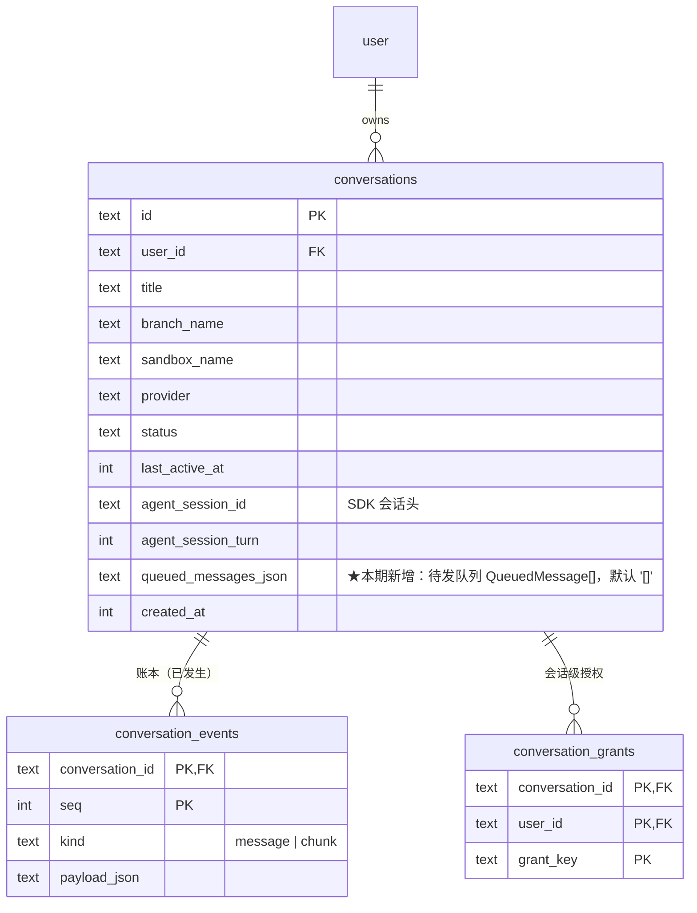
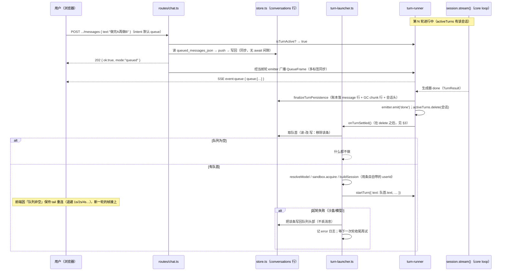
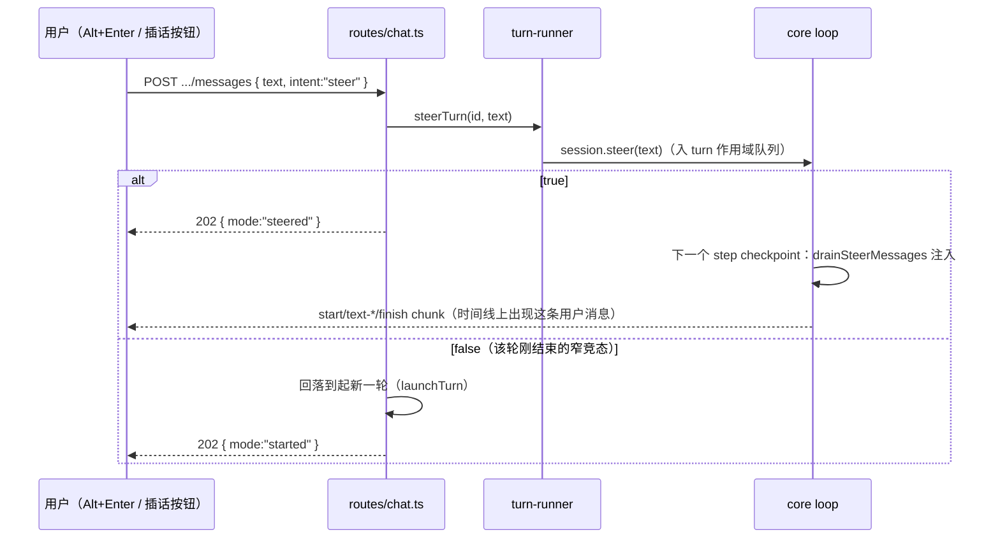
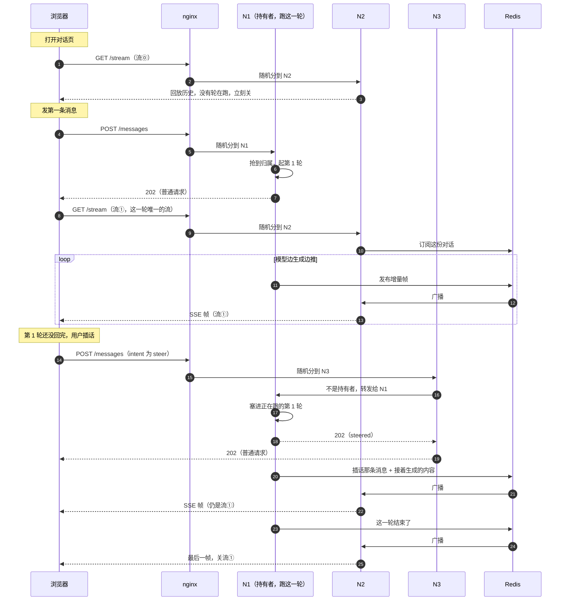
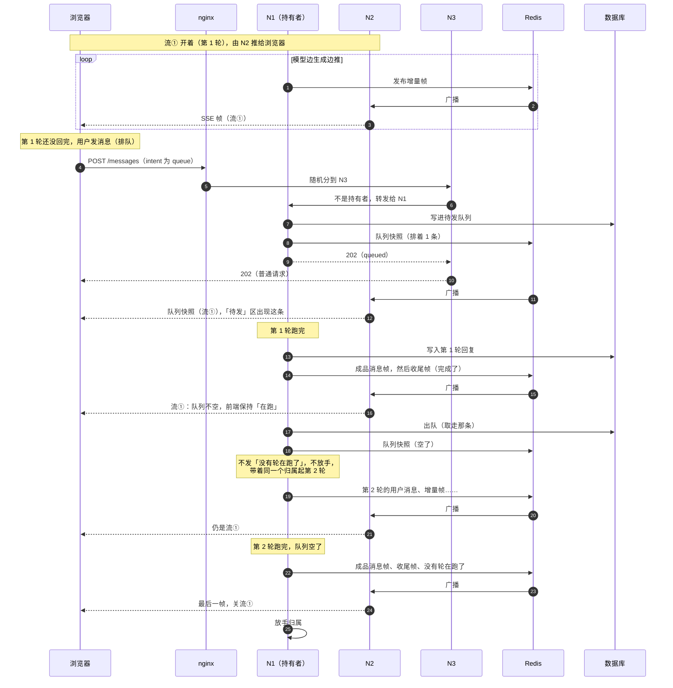
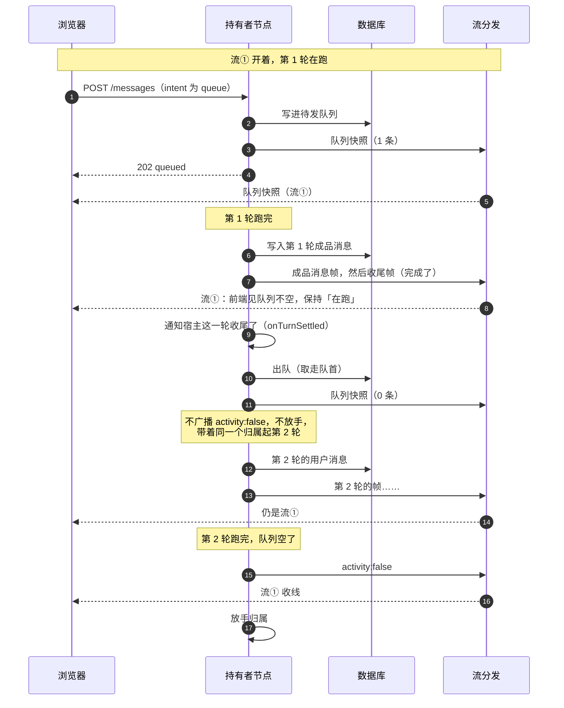

# 中途插话与排队（技术方案）

> 相关：[功能](../features/steer-and-queue.md)，[施工进展](../plans/steer-and-queue.md)。
> 依赖/延续：[tech/chat-webapp](../../../ingress/tech/chat-webapp.md)（`routes/chat.ts` 七端点、`turn-runner/` 的[轮](../../../terms.md)驱动、`sandbox-manager.ts` 生命周期）· [tech/single-ledger](./single-ledger.md)（[账本](../../../terms.md) `seq` 空间与 durable/transient 分档）· [tech/core-sdk](../../engine/tech/core-sdk.md) §4.2（`Session.steer()` 的软 steer 语义）。

## 1. 现状与增量

[steer](../../../terms.md) 已经**全链路存在**，本期不重做它：

| 层 | 现状 | 本期改动 |
|---|---|---|
| `@runko/core` | `Session.steer(input)`、loop 的 `drainSteerMessages`（step 边界 A/B 两个 checkpoint） | **不动** |
| `apps/node-server` | `turn-runner/registry.ts` 的 `steerTurn()`；`POST .../messages` 有活跃轮就无条件 steer | 改为按 `intent` 分流，新增[排队](../../../terms.md)/[出队](../../../terms.md) |
| `apps/web` | 流式中发送即 steer（隐式，无 UI 表达） | 默认排队 + 显式插话入口 + 待发区 |

增量是**排队**这条路径，外加把 steer 从「隐式唯一」降级为「显式可选」。

## 2. 存储：不新增表，加一列

排队消息落 `conversations.queued_messages_json`（TEXT，JSON 数组，默认 `'[]'`）。

**为什么不进 [账本](../../../terms.md) `conversation_events`**（评估过并否决）：账本的契约是「已发生的事」——`kind='message'` 行**永不删除**、[seq](../../../terms.md) 单调且被[回放](../../../terms.md)/断线续传/`finalizeTurnPersistence` 的 GC 阈值三处依赖。排队消息是**尚未发生的意图**，可删可清可改序，塞进账本会同时破坏「永不删除」与 seq 空间的语义，[回放](../../../terms.md)还得学会跳过它们。

**为什么不新增子表**：队列与 conversation 天然 1:1、有序、量小（上限 10 条）、永远整体读写（入队/删一条/清空/出队都是读-改-写整个数组），没有任何按条件查询的需求。一张子表换来的只是模式洁癖，代价是多一张表、多一个 join、多一处级联清理。加一列 JSON 是这个形状的最小正确解——也正好满足「不新增表」的要求。

**代价**（接受）：JSON 列不可索引/不可按条件查（不需要）；每次改动重写整列（10 条以内无所谓）；读回来必须走运行时校验——用 zod `parse`，不是类型断言（遵循仓库 TS 规范）。

### 2.1 业务数据领域设计图



排队消息**不是**一个实体表，它是 `conversations` 上的一个有序值列表——图上以列的形式呈现正是这个设计意图。

### 2.2 队列条目形状

```ts
// schemas/chat.ts（OpenAPI 可见）+ store.ts（读回时 zod parse）
interface QueuedMessage {
  id: string;        // randomUUID，删除端点按它定位
  text: string;      // 1..N，与 PostChatMessageInput.text 同约束
  userId: string;    // 入队者（= 起轮时的审批发起人，见 conversation-grants 的 userId 语义）
  createdAt: number; // epoch ms
}
```

`userId` 不是冗余：出队起轮时[会话级授权](../../../terms.md)按「本轮发起者」匹配，必须知道这条消息是谁排的，不能想当然用 conversation owner。

## 3. 起轮装配抽取：`agent/turn-launcher.ts`

**问题**：起一轮所需的装配（`resolveModel` → `sandboxManager.acquire` → E2B 重连令牌回写 → 审批闭包 `onApproval`/`onReview`/`onAskUser` → `loadResumeState` → `buildSession` → `startTurn`）目前整段长在 `routes/chat.ts` 的 `POST .../messages` handler 里。自动出队要起下一轮，需要同一段装配，但它**不在任何 HTTP 请求上下文里**。

**方案**：把这段抽成 `agent/turn-launcher.ts` 的 `launchTurn(deps, { conversationId, userId, text })`，路由与自动出队共用。`loadResumeState`/审批闭包一并搬过去（它们本来就与路由无关）。

**依赖方向**（不成环）：

```
routes/chat.ts ──→ turn-launcher.ts ──→ turn-runner/start.ts（startTurn）
                          ↑                     │
                          └─── onTurnSettled ───┘（回调由 launchTurn 注入，turn-runner 不 import launcher）
```

`turn-runner/start.ts` 只多一个可选入参 `onTurnSettled?: () => void`，在 `driveTurn(...)` 收尾之后、**`activeTurns.delete()` 之后**调用——顺序是硬要求，否则下一轮的 `startTurn` 会被「已有活跃轮」守卫挡掉。turn-runner 依然不认识队列这个概念。

## 4. wire 契约

### 4.1 `POST .../messages` 增加 `intent`

```ts
PostChatMessageInput = { text: string; intent?: 'queue' | 'steer' }  // 默认 'queue'
StartTurnAck         = { ok: true; mode: 'started' | 'steered' | 'queued' }
```

分流规则（服务端唯一权威，前端不预判）：

| 有活跃轮？ | `intent` | 行为 | `mode` |
|---|---|---|---|
| 否 | 任意 | 起新一轮 | `started` |
| 是 | `queue`（默认） | 入队 | `queued` |
| 是 | `steer` | `steerTurn()` | `steered` |
| 是 | `steer` 但 steer 返回 false（轮刚好结束的窄竞态） | 回落起新一轮 | `started` |

队列已满时返回 **409**（`{ error: '待发队列已满（最多 10 条）' }`）——不是 400：请求本身合法，是资源状态不允许。

### 4.2 队列管理端点

```
DELETE /api/chat/conversations/{id}/queue/{messageId}   → 200 { queue: QueuedMessage[] }
DELETE /api/chat/conversations/{id}/queue               → 200 { queue: [] }
```

两者都返回**变更后的完整队列快照**（不是 204）——调用方一次往返拿到权威状态，省掉「删完再查一次」。`messageId` 不存在返回 404。

没有独立的 `GET .../queue`：`GET .../conversations/{id}` 的 DTO 直接带 `queuedMessages`，页面加载时本来就要请求它。列表端点也一并带上（侧边栏可显示「N 条待发」）。

### 4.3 第三种 wire 帧：`QueueFrame`

[直播流](../../../terms.md)的帧联合从两支变三支（`schemas/chat.ts` 的 `chatReplayFrameSchema`）：

```ts
type ChatReplayFrame = ChunkEnvelope | MessageFrame | QueueFrame
QueueFrame = { queue: QueuedMessage[] }   // 无 seq —— 它是状态快照，不是账本事件
```

三支仍按**结构存在性**区分（`chunk` / `message` / `queue` 三个键互斥），与现有约定一致；SSE `event:` 名相应为 `chunk` / `message` / `queue`。

`QueueFrame` **不落库、不占 seq、不参与 `after=` 续传**——它是[transient](../../../terms.md)档的状态快照，语义是「此刻队列长这样」，重发一次即最新，没有回放价值。

**两个发送时机**（合起来保证任何时候连上都拿得到权威状态）：

1. `GET .../stream` 在回放结束、进入直播之前，**总发一帧**当前快照（重连/新标签页的权威同步点）。
2. 队列在一轮进行中发生任何变化（入队/删一条/清空）时，经该轮 emitter 广播一帧。

出队发生在轮收尾、emitter 即将关闭的时刻，此时广播是竞态的——不靠它：下一轮的 tail 一连上就会走时机 1 拿到最新快照。

## 5. 核心流程时序图

### 5.1 排队 → 自动出队起下一轮

> 下图是 chat 应用单进程时代的实现，留作对照。**现行做法见下文 §8.3「出队不放手」**：持有者不放手，直接出队接着跑，前端不再靠退避重连接下一轮。



### 5.2 显式插话（steer）



### 5.3 多节点下：插话与排队各有几条流

上面两张图是单进程时代的写法。多节点下（nginx 后面挂几个节点、节点之间用 Redis 广播流），请求被分到哪个节点是随机的，三个节点各有各的角色：

- **持有者**（图里的 N1）：抢到这份对话的[归属](../../../terms.md)，真正在跑这一轮。
- **推流的节点**（N2）：刚好接到浏览器的 `GET …/stream`，从 Redis 收帧、推给浏览器。流连在哪个节点上都行，不用非得连到持有者。
- **转发的节点**（N3）：刚好接到发消息的 `POST`，发现自己不是持有者，就把请求转给持有者。

nginx 碰巧都分给 N1 时流程一样，只是少了广播和转发这两跳。

**结论：插话和排队都只有一条流。**区别只在模型什么时候读到这条消息——插话在这一轮里就被读到；排队的消息自己成为下一轮，由持有者不放手、接着跑（§8.3）。

#### 插话



| 请求 | 是不是 SSE 流 | 什么时候开 | 什么时候关 |
|---|---|---|---|
| 流⓪ 打开页面的 `GET /stream` | 是 | 打开页面 | 回放完历史、没有轮在跑，马上关 |
| 发第一条的 `POST` | 否，拿到 202 就结束 | — | — |
| 流① 第 1 轮的 `GET /stream` | **是，这一轮唯一的流** | `POST` 拿到 202 之后 | 第 1 轮结束 |
| 插话的 `POST` | 否，拿到 202 就结束 | — | — |

#### 排队



| 请求 | 是不是 SSE 流 | 什么时候开 | 什么时候关 |
|---|---|---|---|
| 流① 的 `GET /stream` | **是，整个队列只有这一条** | 第 1 轮开始 | 队列排空、最后一轮结束 |
| 排队的 `POST` | 否，拿到 202 就结束 | — | — |

归属从头到尾在 N1 手上，中间没有「放手再抢」，别的节点也就没机会插进来。

排了好几条时，每一轮结束都会再看一次队列，一条接一条跑完，每条消息仍是独立的一轮（自己的轮号、回复、收尾）；跑的过程中新排进来的也会接着跑。中途会停下、放手的情况见 §8.3 的表。

## 6. 前端要点

- `use-chat-messages.ts` 新增 `queuedMessages` 状态：初值来自会话详情 DTO，之后由 `QueueFrame` 覆盖，删除/清空的 HTTP 响应快照也直接覆盖（服务端始终是权威，前端不做乐观合并——沿用审批「不做乐观翻转」的同一姿态）。
- **轮收尾后若队列非空**：`turnInProgressRef` 保持 `true`、`status` 保持 `streaming`（避免 idle→streaming 的闪烁，也避免用户以为卡住）。服务端通常不放手、在同一条流上接着起下一轮（§8.3），下一轮的帧直接到；少数情况服务端放手、关流（恢复轮、节点下线等），这时靠已有的 5 次退避重连（1/2/4/8/16s，共 31s）兜底，耗尽后安静停止，刷新即恢复。
- `MessageComposer`：`Enter` = 排队（流式中）/ 起轮（idle），`Alt+Enter` = 插话，右侧插话按钮只在流式中出现；上方 `QueuedMessages` 面板负责列出/删除/清空。

## 7. 边界与已知限制

1. **进程重启中断的那一轮不会自动续上队列**：`activeTurns` 本就是内存态（[chat-webapp 既有取舍](../../../ingress/tech/chat-webapp.md)），重启后没有「轮收尾」这个触发点，队列会静置到下一次有轮收尾。队列本身不丢。
2. **单进程假设**：入队/出队是 better-sqlite3 的同步读-改-写，同一 Node 进程内无并发间隙（读改写之间不 `await`）。多进程部署会丢更新——与 `activeTurns` 一样，是 chat 应用当前整体的单进程前提，不在本期解决。
3. **出队失败不自动重试**：靠「下一次轮收尾」自然重试，不引入定时器。避免沙盒持续不可用时后台无限重试烧钱。
4. **`QueueFrame` 不进账本**：断线期间的队列变化不会被回放补齐——重连时的快照帧（§4.3 时机 1）直接给最终状态，中间过程本就无需重建。

## 8. 目标态：队列归框架，策略归构建者

本文写的是 chat 应用里的现行实现（队列是 `conversations` 表上的一列、逻辑在 `apps/node-server` 里）。**架构定案之后这块要上移**——见 [架构总纲 · 技术方案 §6](../../../architecture/tech/agent-kernel.md)，这里只记结论与它对本文的影响。

**一条总原则**：

> **产品决策是「要不要这个功能」，不是「怎么实现它」。**
> 构建者可以选择不排队、不支持插话——但**只要他想要，框架就该能给**，而不是让每个构建者自己造一遍轮子。

| | 归哪 |
|---|---|
| 排不排队、上限几条、满了怎么办、要不要插话、能否撤回、前端怎么显示 | **构建者**（配置 + 前端） |
| 队列的**模型与读写**、一轮收尾时取下一条、跟归属释放之间的竞态 | **框架**（[轮编排](../../../terms.md)） |

**为什么机制不能推给构建者**，三条：

1. **队列跟[账本](../../../terms.md)同构**——同样有跨执行的状态、同样被轮编排读写、同样经框架接口写入。账本的模型在框架里，队列没有理由不在。
2. **「什么时候该排队」只有轮编排知道**——会话挂起时该排队、正在跑时该排队或插话、空闲时该直接开轮，这套判断依赖会话状况，而状况是轮编排从账本推出来的。推出去等于让每个构建者重新实现一遍。
3. **挂起与[交权](../../../terms.md)的时机只有轮编排知道**——队列该怎么跟着走是它的事，[接入层](../../../terms.md)拿不到这些时机。

### 8.1 对上面「已知限制」的影响

| 现在的限制 | 目标态怎么变 |
|---|---|
| 1. 重启后队列静置到下一次轮收尾 | **消失**——框架启动扫描会接手无主队列，这是常规动作 |
| 2. 单进程假设（多进程会丢更新） | **消失**——队列进[持久化](../../../host/contract/tech/persistence.md)，出队走原子操作 |
| 3. 出队失败不自动重试 | **保留**，理由不变 |
| 4. `QueueFrame` 不进账本 | **保留**，理由不变 |

### 8.2 释放归属时的竞态：诚实的断言 + 写入方兜底

有个竞态绕不开：框架查完队列「没活儿了」，到真正释放归属之间，用户可能又发了一条。

解法不是追求原子性（做不到），而是**发一个诚实的断言，让对方兜底**——框架释放归属时发出 [`conversation-drained`](../../../terms.md)：

> 「我认为这个会话排空了——**我放手的时候**队列是空的。你那边如果有，可以继续。」

注意措辞：它不声称「队列一定是空的」，只声称「**我看的时候是空的**」。配套是**写入方也负责推进**：入队之后如果发现没人持有归属，就自己抢来开轮。

**这套由框架在 `enqueue` 内部实现一次**——写队列 → 尝试抢归属 → 抢到就开轮。**接入层只调一句 `enqueue(conversationId, input)`，构建者完全不需要知道有竞态这回事。**

> 名字为什么是 `conversation-` 不是 `session-`：`session` 在这个系统里已经三重超载（better-auth 的登录态、对话、SDK 的 agent 会话），再引入 `session-drained` 会是第四重。

### 8.3 出队不放手：一条流跑完整个队列

**结论**：一轮收尾时队列里还有货，持有者**不放手归属**，直接出队、起下一轮；两轮之间**不广播「没有轮在跑了」**（`activity:false`）。直播流靠这一帧决定收不收线，没收到就一直开着，下一轮的内容接着从同一条流过来。队列排空、最后一轮跑完，才广播这一帧、放手。

**为什么**：上面 §5.1 的「收尾 → 放手 → 出队 → 重新抢归属」是单进程时代沿用下来的，没有设计上的理由。多节点下它平白多出三样东西：

- **一次归属换手**：放手到重新抢之间，别的节点可以插进来（所以才需要 §8.2 的兜底）。
- **直播流被关**：收到 `activity:false` 就收线。
- **前端多等 1 秒**：流被关后走断线重连，第一次退避就是 1 秒。



**顺序上的几个硬要求**：

1. **通知宿主（`onTurnSettled`）排在出队之前**：宿主据「这一轮结束时队列里还有没有货」决定要不要推「跑完了」通知。先出队的话，最后一条排队消息起轮时队列刚好空了，就会误报一次。
2. **先登记下一轮，再撤掉上一轮**：本进程的订阅复查、`getActivity()`、新请求的「有没有轮在跑」都看登记表。两轮之间要是有一瞬间登记表是空的，这些判断会误以为没轮在跑。
3. **出队拿到空的（被用户删掉了）就走普通收尾**：广播 `activity:false`、放手，跟没有队列时一样。

**哪些情况不接着跑**，照旧放手、走原来的路：

| 情况 | 为什么 |
|---|---|
| 这一轮挂起了，或者是一轮恢复 | 账本末尾可能有悬空调用，只能跑恢复轮（§5.1 下面的 `advance`） |
| 这一轮交权出去了 | 归属要预留给接手节点 |
| 本节点在下线 | 队列交给接手节点（[交权](./handover.md)） |
| 接着跑的那一轮装配失败 | 打[待接手](../../../terms.md)标记，交给定时回捞，免得热循环 |
| 归属已经丢了（租约被别人拿走） | 已经不是持有者，不能再写账本 |

**起下一轮失败**（装配抛错）：跟用户手动发消息起轮失败一样——补一条失败标记、这一轮以失败收尾。因为它自己也会走到收尾，队列里还有货就继续接着跑下一条；不会热循环，因为每一轮都消费掉了一条消息。

**§8.2 的兜底还在**：只在最后真正放手时用得上——放手之前查一次队列，放手之后新来的消息由 `enqueue` 自己抢归属起轮。

