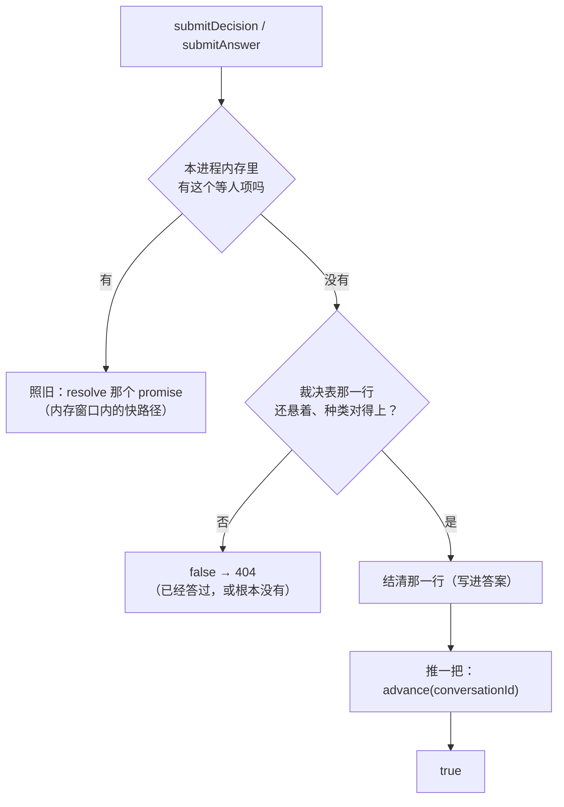
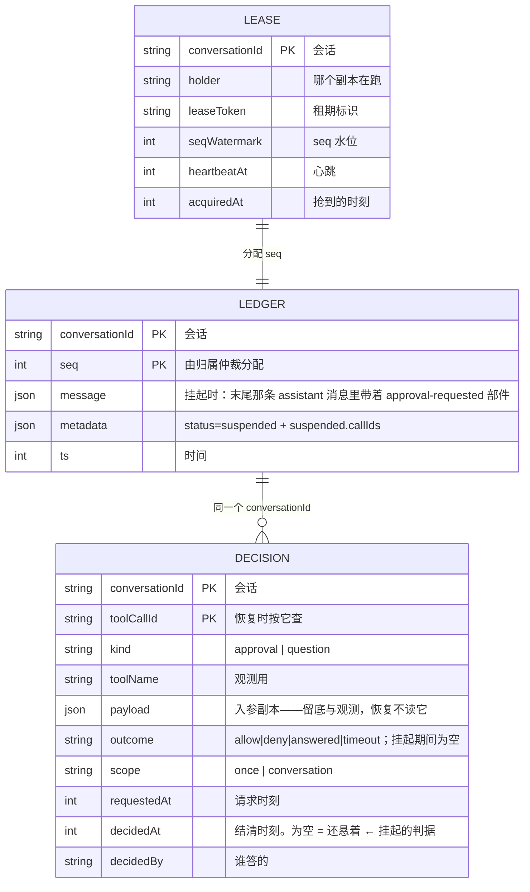
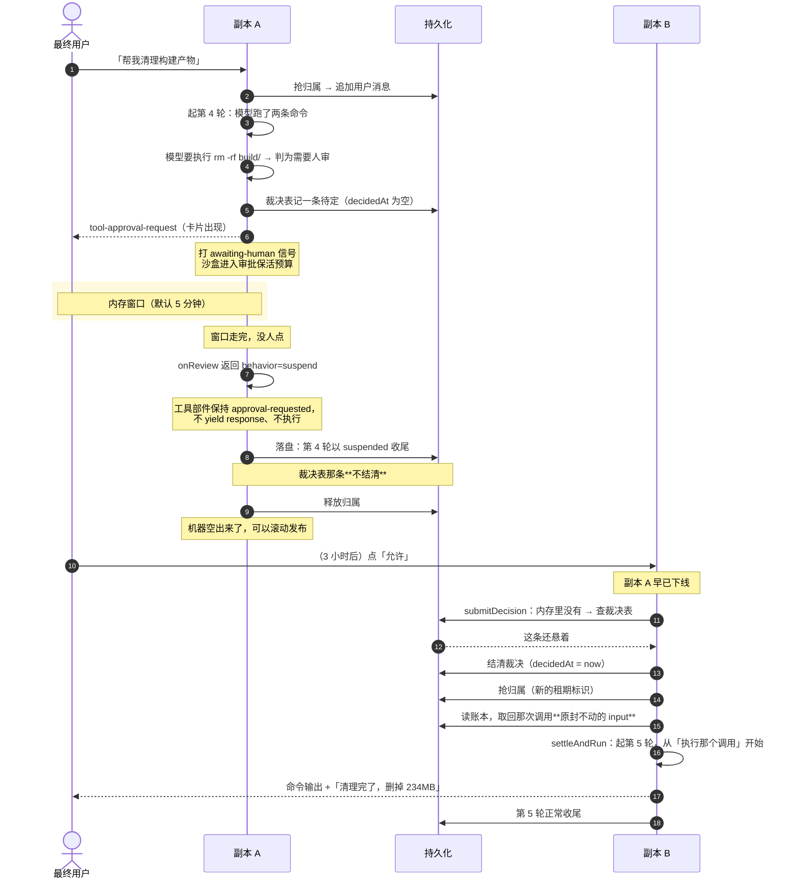

# 挂起与恢复 — 技术方案

> 相关：[功能](../features/suspend-resume.md)，[施工进展](../plans/suspend-resume.md)。
> 上游定案：[架构总纲 · 技术方案 §4](../../../architecture/tech/agent-kernel.md)（挂起与恢复的四个要点）· [轮编排运行时 · 施工进展](../plans/agent-runtime.md)（Q1 定 `settleAndRun`、Q3 定第四种收尾态、Q5 把 `reportPresence` 推到本批）。
> 依赖：[轮编排运行时 · 技术方案](./agent-runtime.md)（一轮的一生、收尾五步）· [停止本轮 · 技术方案](./turn-abort.md)（中断路径，本方案**不复用**它，理由见 §2）· [沙盒保活 · 技术方案](./sandbox-keepalive.md)（活动信号与审批保活预算）。

## 1. 总体思路

一句话：**把「等人超时 = 放弃」改成「等人超时 = 这一轮干净地退出，人回来再开一轮接上」。**

拆成三件事，各自落在不同的包：

| 要做什么 | 落在哪 | 现在是什么样 |
|---|---|---|
| ① 让一次工具调用能说「我要挂起」，而不只有「允许 / 拒绝」 | `@runko/core` 的 loop 与工具执行上下文 | 只有两种结局，第三种表达不出来 |
| ② 让一轮能以 `suspended` 收尾，并且**不结清**那条待定裁决 | `@runko/agent` 的轮编排 | `suspended` 类型已就位，**没有产出方** |
| ③ 让「人回来提交裁决」能在**任意节点**开一轮把它接上 | `@runko/core` 新入口 `settleAndRun` + `@runko/agent` 的 `submitDecision` | 只能唤醒本进程内存里的那个 promise，没有就 404 |

三件事有先后：① 是 ② 的前提，② 是 ③ 的前提。

### 1.1 已经为它铺好的路

不是从零开始。前几批刻意留了四个口子：

| 已有的 | 在哪 | 本批怎么用 |
|---|---|---|
| 第四种收尾状态 `suspended` | core 的 `RunkoMessageMetadata.status`（含 zod）、agent 的 `TurnStatus`、node-server 的 `TurnEndStatus`、web 的 `TurnSuspendedBar` | 直接产出它，类型与渲染分支都不用新加 |
| 裁决表能跨进程读回来 | `DecisionStore.listPending`（注释原话：「当前只服务于观测与将来的挂起恢复」） | 恢复时用它判断「这个 callId 还悬着吗」 |
| 恢复 = 开新的一轮 | 一轮的一生本来就可重入 | 不需要新的生命周期概念 |
| 收尾钩子已带状态 | `RuntimeHooks.onTurnSettled` 的载荷里有 `status: TurnStatus` | `suspended` 不用改签名就能报出去 |

## 2. 关键判断：挂起**不能**复用「停止」那条路

这是本方案最重要的一条，先说清楚，否则后面每个设计都像是绕远路。

**直觉方案**（也是最省事的那个）：挂起 = 一次理由特殊的[停止](../../../terms.md)。到点了就 abort 这一轮，收尾时把状态写成 `suspended` 而不是 `interrupted`。

**它不成立。** 原因在 core 的 `settleToolCall` 里：

```
yield tool-approval-request 这一帧
   ↓
const decision = await onReview(...)     ← loop 停在这里等人
   ↓
if (decision.behavior === "deny") { ... }  ← 醒来后立刻按结局分支
```

问题出在「醒来之后」那一步：**它不检查 abort 信号，直接按拿到的结局往下走。**

而[人在回路桥](../../../terms.md)的 `settleAllPending` 正是靠「resolve 那个 promise」来解开 `await` 的——这是整个功能里唯一一处「光有 abort 信号不够」的地方（abort 对一个普通的 `await` 毫无作用）。

于是两条都走不通：

| 试图这样挂起 | 结果 |
|---|---|
| 只 abort，不 resolve | loop 永远停在 `await` 上，这一轮根本退不出来 |
| abort 之后 resolve 成 `deny` | loop 醒来先执行 deny 分支：把那条工具部件**改写成 `output-denied`**、yield 一帧 `tool-output-denied`。等外层察觉 abort 时，**账本里那次调用已经被写成「已拒绝」了** |

第二条的后果是致命的：人三小时后回来点「允许」，但账本里那次调用早已是拒绝态，历史脏了。这正好撞上[功能手册 §5](../features/suspend-resume.md) 那条安全性质——**恢复必须用账本里原封不动的调用**。

**结论**：挂起必须是一个**第三种结局**，由 loop 自己认识并且**什么都不写**，而不是「拒绝 + 事后补救」。

> 这条判断也顺带解释了为什么本方案要动 `@runko/core`。挂起看上去是轮编排的事（决定什么时候挂），但「挂起时账本里留下什么」只有 loop 说了算。

## 3. ① 让一次调用能说「我要挂起」

### 3.1 审批：结局加第三种

人审通道现在返回 `allow | deny` 两种 behavior，加第三种 `suspend`：

```ts
// @runko/core
export type HumanDecision =
  | { behavior: "allow" }
  | { behavior: "deny"; message?: string }
  | { behavior: "suspend"; reason?: string };   // ← 新增，reason 见 §4.1
```

`settleToolCall` 拿到 `suspend` 时的动作是**做得最少的那一种**：

| 动作 | allow | deny | **suspend** |
|---|---|---|---|
| 改写工具部件 | 改成执行结果 | 改成 `output-denied` | **不动**——保持 `approval-requested` |
| yield `tool-approval-response` | 是（approved） | 是（denied） | **不 yield** |
| 执行工具 | 是 | 否 | 否 |
| 这一轮怎么继续 | 继续下一步 | 继续下一步 | **到此为止** |

「不动」是关键：那条部件在 yield `tool-approval-request` 之前就已经被写成 `approval-requested` 了，**它本身就是我们想留在账本里的东西**——一次带着完整入参、等着人答的调用。

### 3.2 `ask-user` 与其它等人的工具：执行上下文上的挂起出口

`ask-user` 走不了 §3.1 那条路：它**不是审批**，在 loop 眼里就是一次普通工具调用（这一点是[刻意的](./agent-runtime.md)，它的等待/已答状态就是工具部件自己的 `input-available` / `output-available`）。

普通工具的 `execute` 只能返回一个结果值，表达不了「别继续」。所以给执行上下文加一个出口：

```ts
// @runko/core —— 工具 execute 拿到的 ctx 上
ctx.suspend(): never
```

语义是：**这次调用停在一个干净边界上等外部输入，本轮到此为止。** 工具部件保持 `input-available`（带着完整入参），不写 output。

`ask-user` 的改动因此只有一行级别：内存窗口内拿到答案就照常 `return answer`；拿到「该挂起了」就走这个出口，不再返回那句英文提示文案。

> **`ASK_USER_TIMEOUT_MESSAGE` 会被删掉。** 它今天的作用是「超时了，编一句话给模型，让它自己往下猜」。挂起之后不存在「超时」这回事，也就不需要这句话。

### 3.3 这一步里有多个调用同时在等人

一步里模型可以并行发出多个工具调用，其中不止一个要等人（`mergeSettleStreams` 并行结算它们）。

**v1 规则：只要有任何一个调用要挂起，这一轮就挂起；其余仍在等人的调用，一并留在「等人」状态。**

| 情形 | 结果 |
|---|---|
| A 已执行完，B 在等人且到点 | A 的结果照常留在账本（**已发生的事实不回滚**），B 保持 `approval-requested`，本轮挂起 |
| A、B 都在等人，人只答了 A | A 照常执行完；B 到点 → 挂起 |
| A、B 都在等人，都没答 | 两条都留着，本轮挂起 |

**多条悬着的调用不需要特殊处理**：恢复是「开新的一轮」，人答哪个 callId 就从哪个接上；那一轮跑到下一条还悬着的调用时，会**再挂起一次**。这是自洽的，代价只是多一次挂起/恢复往返，而这种情形本身就少见。

**上面这张表只适用于并行批**（整批全只读）。**串行批**（混有写操作）保的是「按模型书写的顺序执行」，所以规则不同：一个调用挂起之后，**后面的一个都不执行**，各得一个「没有执行」的错误结果，账本里不留悬空调用；模型恢复之后看得到，需要的话再发一次。

不这样做会怎样（code review 逮到的）：`[bash rm -rf dist（要审批）, write-file dist/config.json（自动放行）]`，前者挂起、后者当场写进去；几小时后人批准，`rm -rf dist` 才执行，刚写的文件被删掉，而模型以为顺序是先删后写。

为什么不把后面的也留成悬空：恢复靠裁决表里那一行，自动放行的调用没有这一行，留成悬空就永远没人能恢复它，也分不清它是在等人还是被跳过了。

### 3.4 定案：抛专用信号，但配一个 ctx 标记兜底

**`ctx.suspend()` 抛一个 `SuspendSignal`，loop 在工具执行的外层捕获它。**（2026-09-18 定案）

#### 为什么不是哨兵返回值

候选方案是「core 导出一个 `SUSPEND` 常量，`execute` 返回它」。看着更规矩——纯值、无控制流魔法、类型也表达得出来（`Result | typeof SUSPEND`）。**但它有一个结构性缺陷**：

```ts
// 工具作者很自然会这么写
execute: async (input, ctx) => {
  const raw = await askSomehow(input, ctx);
  return formatForModel(raw);        // ← SUSPEND 被 formatForModel 加工成垃圾
}
```

哨兵值**会被工具自己的包装层吃掉**。而挂起恰恰是**不该被中间层处理**的东西：它不是「这次调用的一种结果」，是「这次调用不产生结果，整轮就此停下」。异常正是为这种控制流终止设计的——它天然穿透所有中间层。

> **这跟仓库里「不用异常表达正常结局」那条取舍不矛盾**（`Grant.nextSeq` 当初明确否过抛 `OwnershipLostError`）。那里的「失去归属」是**每次调用都可能发生、调用方必须分支处理**的常规结果，用异常会让正常路径被当故障。挂起相反：调用方**不该**处理它。两者场景不同，结论也就不同。

#### 异常的真风险，以及怎么堵

`try/catch` 会吞掉它：

```ts
try { return await ctx.human.ask(...); }
catch { return "问不到，先跳过"; }     // ← 挂起被吃掉了
```

**对策是让 `ctx.suspend()` 做两件事**：

1. 在执行上下文上**打一个标记**（这次调用请求了挂起）；
2. 抛 `SuspendSignal`，断开控制流。

loop 的判据看的是**标记**，不是有没有接到异常。于是异常被吞掉也不影响正确性——那次调用返回的垃圾值会被忽略，本轮照样挂起。异常只负责「让 execute 立刻停下」这一件事。

两条配套约束：

- **`SuspendSignal` 不继承 `Error`。** 常见的 `catch (e) { if (e instanceof Error) ... }` 会自然放过它；`logger.error(e)` 这类也不会把它当成故障上报。
- **打完标记的那次调用不允许再被复用。** 标记挂在「这一次调用」的上下文上，不是挂在工具上——同一个工具在同一步里的另一次调用互不影响。

## 4. ② 一轮以 `suspended` 收尾

### 4.1 core 侧：`finalizeTurn` 的状态参数扩成四值

`suspended` 今天在类型里是**只定义、不产出**。core 的 `finalizeTurn` 参数现在是三值联合（`completed | failed | interrupted`），要加上 `suspended`。

收尾元数据里带一条新字段，供恢复与界面用：

```ts
metadata: {
  status: "suspended",
  suspended: {
    callIds: string[],     // 这一轮留下几条悬着的调用，按模型发出调用的顺序
    reason?: string,       // 为什么挂起。**core 不认识它的含义**，见下
  },
}
```

`reason` 有三种来源：内存窗口走完（`"timeout"`）、[交权](../../../terms.md)时正在等人（`"handover"`）、`memoryWindow: 0` 直接挂（`"immediate"`）。它只用于观测与文案，不影响恢复逻辑。

**但这三个值不是 core 的枚举，是宿主的词。** core 那一层收的是一个**不透明字符串**，原样透传进 metadata——「为什么挂起」是宿主的概念，core 不该认识「交权」这种词。这与 `RunkoError.message` 透传宿主给的中止理由是同一个姿态（`abortMessage`：core 只说「被宿主中止了」，为什么中止由宿主解释）。上面那三个值由 `@runko/agent` 产出（§8.1）。

> 收尾消息的 id 形如 `turn-<status>-<seq>`，所以挂起那条天然得到 `turn-suspended-N`，不用额外改。

### 4.2 agent 侧：分叉在「等人项怎么被解开」，不在收尾

一轮在等人时，人在回路桥上挂着一个或几个等人项（core 的 loop 正 `await` 它们）。它们有四种解法：

| 谁解开 | 解成什么 | 写不写[裁决表](../../../terms.md) |
|---|---|---|
| 人答了 | allow / deny / 答案 | 写——结清那一行 |
| 这一轮被停止 | deny / timeout | 写 |
| **[内存窗口](../../../terms.md)到点** | **挂起** | **不写**——那一行留着，人回来还要答 |
| **[交权](../../../terms.md)** | **挂起** | **不写** |

后两种走同一个入口 `suspendTurn(turn, reason)`，它做两件事：

1. 把这一轮**所有**还挂着的等人项一起解成「挂起」——不是只解到点的那一个。这一轮已经决定收尾了，别的等人项再各自等一个窗口没有意义。
2. 关上闸门 `turn.suspending`：此后**同一轮里再来的**等人请求立刻解成挂起（裁决表那一行照记，因为那次调用也会留在账本里等人）。

第 2 条是写代码时补的。没有它，一步里串行的两个审批会等**两个**窗口：第一个到点挂起 → core 串行结算第二个（§3.3 的「不早退」）→ 第二个又开一个新窗口 → 又等五分钟。

**收尾五步本身只动第⑤步**：

| 步 | 挂起时 |
|---|---|
| ① 结清挂着的等人项 | 不用动——走到收尾时两个 Map 早空了（`suspendTurn` 已经解开它们） |
| ② 发 `activity: false` | 不变 |
| ③ 删登记 → **释放归属** → `markSettled` | 不变——**这一步就是「腾出机器」** |
| ④ `onTurnSettled` 钩子 | 不变，`status` 自然是 `suspended` |
| ⑤ 起下一条排队的 | **跳过**：有悬空调用时只能跑恢复轮（§4.3、§5.3） |

> 立项时这里写的是「第①步分叉：内存要结、库不能结」。读代码才发现第①步那时已经无事可做——真正的分叉点在上面那张表。2026-09-19 改。

**普通轮的起轮守卫**：`startTurn` 抢到归属、登记之后，先读账本最后一条，里面有悬空调用就撤回（撤登记、还归属），报 `awaiting_human`，调用方据此只入队。

- **必须查在抢到归属之后**：这时别的副本写不进来。查在前面的话，查完到抢到之间别的副本可能刚好挂起了一轮，然后这里照常起轮、把用户消息追加在悬空调用后面——那份账本就再也恢复不了了。
- **必须查在登记之后**：查的那一次打库期间，本进程同会话的另一条请求要看到「有人在跑」而排队；否则它去抢归属、抢不到，会把自己误报成 `held_by_other`，转发给自己。
- 只读最后一条（取最大 seq、读它），两次打库，不读整本。

第⑤步的跳过与这道守卫是**两道防线**：只有守卫，结果也对，但会白白出队、放回队首，订阅者看到队列闪一下。

### 4.3 挂起不清空待发队列，但也不消费它

[停止本轮](./turn-abort.md)会清空队列（用户按了停止，后面排的多半也不想要了）。**挂起相反**：人只是还没答，排队的消息**留着**。

**但留着不等于照常跑。** 挂起那一轮在账本末尾留下了一次悬空调用，这时再开普通轮，provider 会直接 400（实测见 §5.3）。所以队列**冻结**到人答完：恢复轮收尾时第⑤步照常执行，排队的消息这才开始跑。

产品上这跟「同一轮里等人」的体验一致：agent 在等你回答一个问题，你不回答它就没法往下走——你发的新消息会排在后面。

> ⚠️ 这一节 2026-09-19 改过。原来写的是「第⑤步照常执行、挂起后可以同时跑新的一轮」，没实测就下了结论。见 §9.3 与附录 A。

## 5. ③ 恢复：`settleAndRun`

### 5.1 为什么是并列一个入口，不是扩 `stream()`

[已定案](../plans/agent-runtime.md)（Q1，选 B）。两件事语义不一样：

- `stream(input)` = 「拿一条**新的用户输入**，开一轮」
- 恢复 = 「**结清一个悬着的调用**，然后继续」

后者的输入根本不是一条 user 消息。硬塞进 `input` 会把它变成联合类型，每个调用点都得收窄一次；而 `stream()` 现在被 agent / sdk / examples / 两个 app 一起消费。

```ts
// @runko/core · Session 上并列的新入口
settleAndRun(
  callId: string,
  settlement: Settlement,
  opts?: TurnOptions,
): AsyncGenerator<RunkoChunk, TurnResult>;

type Settlement =
  | { kind: "approval"; behavior: "allow" }
  | { kind: "approval"; behavior: "deny"; message?: string }
  | { kind: "output"; output: ToolReturn };
```

**`output` 而不是 `answer`**：`ctx.suspend()` 谁都能调，不只是 `ask-user`。它的语义是「我在等一个外部输入，**那个输入就是我这次调用的结果**」。所以恢复时要给的是「这次调用的输出」，`ask-user` 的答案只是其中一种。取名跟着通用语义走。

**实现上是抽一个公共的生成器体**：两个入口共用装配、深层校验、steer 队列、活动信号、收尾元数据，差别只在「这一轮怎么开场」——`stream` 追加一条 user 消息，`settleAndRun` 先结清那次调用。

### 5.2 恢复的第一步不是调模型

普通一轮：`messages` 末尾追加一条 user 消息 → 调模型 → 模型发工具调用 → 执行。

恢复那一轮：`messages` 末尾**已经**是一条带着悬空工具部件的 assistant 消息 → **直接从「结清那次调用」开始** → 拿到结果再调模型。

悬空部件有**三种**状态，各自接受一种结清方式：

| 部件停在 | 谁挂起的 | 接受的 `Settlement` | 结清后变成 |
|---|---|---|---|
| `approval-requested` | 人审通道答了 `suspend` | `approval / allow` | 执行工具 → `output-available` / `output-error` |
| 同上 | 同上 | `approval / deny` | `output-denied`，理由回填给模型 |
| `input-available` | 工具调了 `ctx.suspend()` | `output` | `output-available`（输出就是给的值）/ `output-error`（没过 `outputSchema`） |
| `approval-responded`（已批准） | 审批**通过之后**执行时，工具又调了 `ctx.suspend()` | `output` | 同上，并保留审批痕迹 |

第三种状态是 S1 落地后才发现的：一个既要审批、执行时又要问人的工具，批准后部件先被改成 `approval-responded`，执行中挂起时 loop 不再动它，于是停在这里。

**种类对不上就拒绝**（比如给一个 `approval-requested` 部件传 `output`）。这是调用方的 bug，见 §5.5。

#### `approval / allow` 的三个细节

- **不再走审批链。** 人已经批准了。重新跑分类器可能又判出 `review`，然后再挂起一次，死循环。
- **但要重新过 `inputSchema`。** 「原封不动」的意思是「不让模型重新生成参数」，不是「绕过校验」。挂起与恢复之间工具可能换了版本；新版不接受旧参数时，应该是一次 `output-error`，而不是拿不合法的参数去执行。
- **参数以账本为准，不用裁决表的 `payload`。** 裁决表那份是留底与观测用的副本；恢复要接上的是模型看到的那条历史，从两个地方分别取「参数」和「上下文」有分家风险。

#### 结清之后，同一条消息里还有悬空调用

一步里有两个调用同时挂起时（§3.3），恢复一个之后另一个还悬着。这时**不调模型**——那条消息里还有一个没配对的 `tool_use`，调了就 400。

直接以 `suspended` 收尾，`suspended.callIds` 是剩下的那些。人答下一个，再开一轮恢复。

### 5.3 不变量：悬空调用只能出现在最后一条消息里

这一节是 2026-09-19 实测出来的，**它推翻了 §9.3 原来的写法**。

**实测**（`ai@7.0.20` 的 `convertToModelMessages`）：

| 账本里是什么 | 转成模型消息 |
|---|---|
| 已结算的调用 | `assistant: tool-call` → `tool: tool-result` ✅ 配对 |
| `approval-requested` 部件 | `assistant: tool-call, tool-approval-request`——**没有 `tool-result`** |
| `input-available` 部件 | `assistant: tool-call`——**没有 `tool-result`** |
| 上面任一种之后再跟一条 user 消息 | `tool-call` 后面直接跟 `user` |

而 Anthropic 与 OpenAI 兼容（含 DeepSeek）都要求 `tool_use` 紧跟对应的 `tool_result`。所以**悬空调用后面再接任何东西，provider 都会 400**。

由此得出一条不变量，由 core 在两个入口各守一半：

| 入口 | 守什么 |
|---|---|
| `stream(input)` | 最后一条消息里**有**悬空调用 → **拒绝开轮**（抛 `RunkoResumeError`，`code: "pending_calls"`）。与其让 provider 回一个看不懂的 400，不如在本地给一句说人话的错误 |
| `settleAndRun(callId, …)` | 那次调用**必须**在最后一条消息里 → 不在就拒绝（`code: "call_not_found"`） |

**对 agent 层的含义**：挂起之后，**只能跑恢复轮**。排队的消息要等到恢复轮收尾才开始跑（§4.3）。

**为什么会话里「只可能在最后一条」**：悬空调用只由挂起产生；挂起那一轮不会再追加任何消息（§4 的 Checkpoint S 拦在调模型之前，也不 drain steer）；之后唯一合法的下一步是恢复。崩溃与停止都不会留下悬空调用——崩溃时进行中的消息不落盘（只补一条「已停止」），停止时悬空的审批被结清成 deny。

### 5.4 结清结果怎么落进账本：同 id 覆盖

**问题**：悬空部件在**上一轮已经落盘的消息**里。恢复要把结果填进**同一个部件**——而[账本](../../../terms.md)是纯追加的（`LedgerStore` 只有 `append`），agent 收尾时也只追加本轮新增的消息。

**UIMessage 的结构不允许把结果放进一条新消息**：工具的调用与结果是**同一个部件的两个状态**，不是两个部件。分开放就是同一个 `toolCallId` 出现两次 `tool-call`，DeepSeek 直接 400（[单一数据账本](./single-ledger.md)记过这条实现教训）。

**做法：消息级同 id 覆盖。**

1. **core**：原地改写那条消息（id 不变）。由 §5.3 的不变量，它**恒为开轮时的最后一条**。
2. **调用方落盘**：从那条开始切片——它以**新 seq**、**同 id** 追加进账本，后面跟本轮新增的消息。
3. **读账本时按 `message.id` 折叠**：**位置取首次出现，内容取最新一条**（seq 最大的那条）。

| 账本（seq 递增） | 折叠后 |
|---|---|
| 10 · user「清理构建产物」 | user「清理构建产物」 |
| 11 · assistant `a1`：`rm` 等审批 | assistant `a1`：`rm` 已执行 ← 内容来自 12 |
| 12 · assistant `a1`：`rm` 已执行 | （并入 11 的位置） |
| 13 · assistant `a2`：「删掉了 234MB」 | assistant `a2`：「删掉了 234MB」 |

**为什么位置取首次**：由 §5.3，被改写的那条恒为最后一条，所以「首次」与「最新」的位置其实相邻，取哪个结果都一样。定成「取首次」是为了让规则在一般情形下也有确定的含义，不依赖那条不变量。

**这不是新规则**：直播流早就在按 id 覆盖（[进行中草稿 · 附录 A](./in-flight-draft.md)：重连时整份草稿重发一遍，前端按消息 id 覆盖、不追加）；[架构总纲 · 施工进展](../../../architecture/plans/agent-kernel.md)也早就把「消息级同 id 覆盖」列为账本要修订的一项。本批是把它从「直播流的做法」推广到「账本回放也这么做」。

**分工**：core 只负责原地改写（本节第 1 条，S2）。第 2、3 条是 `@runko/agent` 的事（S4）——`buildResumeState` 读账本时折叠，存储层契约**一个字不改**。

### 5.5 用错了就抛，不算一轮

`settleAndRun` 的入参错误属于**调用方的 bug**，不是这一轮「失败」。所以**直接抛错**：不 `turn += 1`，不产出任何 chunk。这跟 `SessionOptions.resume` 非法时同步抛是同一个姿态。

```ts
class RunkoResumeError extends Error {
  readonly code:
    | "pending_calls"        // stream() 时最后一条消息里还有悬空调用
    | "call_not_found"       // settleAndRun 的 callId 不在最后一条消息里
    | "not_pending"          // 找到了，但它已经结清过了（重复恢复）
    | "settlement_mismatch"; // 部件状态与 Settlement 种类对不上（§5.2 的表）
}
```

它继承 `Error`（与 `SuspendSignal` 相反）——这是真错误，就该被当成故障。

**执行期的问题照常走工具结算**，不抛：工具已不在工具表里 → `output-error`（同 `settleToolCall` 对未知工具的处理）；新版 `inputSchema` 不接受旧参数 → `output-error`；执行时抛错 → `output-error`；执行时又挂起 → 本轮 `suspended`。

**多副本下的「重复恢复」不会走到这里**：两个副本同时恢复同一个 callId，agent 层靠裁决表的结清做互斥（§9.2），只有一方会调 `settleAndRun`。所以 `not_pending` 真出现，就是 bug。

### 5.6 轮统计不能骗人

功能手册的成功标准：挂起那轮的耗时是「起轮到挂起」，恢复那轮是「恢复到收尾」，**等人的 3 小时哪一轮都不算**。

- **`durationMs`**：从 `runTurn` 入口算起，天然满足。
- **`toolDurationMs`**：它统计本轮 timing 部件的执行区间并集。恢复轮改写的是**上一轮的消息**，里面既有上一轮已执行完的调用，也有这次被结清的那个。只数「本轮新增的消息」会漏掉被结清的那个；把那条也数进来又会重复计入上一轮的。

  **解法：只数本轮开始之后才开始执行的区间**（`executionStartedAt >= 本轮起点`）。三种情形都对：

  | 情形 | `executionStartedAt` | 计入恢复轮吗 |
  |---|---|---|
  | 上一轮已执行完的调用 | 上一轮 | 不计 ✅ |
  | 审批挂起、恢复时执行 | 本轮（恢复时才开始执行） | 计 ✅ |
  | `ctx.suspend()` 挂起、恢复时给输出 | 上一轮（它在上一轮就「开始执行」了，执行的内容就是等人） | 不计 ✅——等人不算执行 |

  这个过滤对普通轮没有影响：普通轮里所有区间本来就在本轮开始之后。

### 5.7 agent 侧：裁决表是恢复的「收件箱」

**问题**：人答的那一刻，不一定能马上开恢复轮。会话可能正被占着：

- 同一条消息里挂着两个调用，第一个的恢复轮正在跑，人又答了第二个；
- 另一个副本还在内存窗口里等人（请求没转发过去）；
- 两个副本同时收到答复，只有一个抢得到归属。

抢不到时要是把答复丢回给调用方让它重试，用户就会看到「稍后再试」；要是只存在本进程内存里，进程一重启就丢了。

**做法：人答 = 把答案写进[裁决表](../../../terms.md)那一行；恢复轮从表里读答案。**



**「推一把」（`advance`）**是「这个会话接下来该干什么」的唯一入口，按顺序判断：

1. 本进程已经有轮在跑 → 什么都不做，它收尾时会再推一把；
2. 账本末尾有悬空调用 → 抢归属；抢到了就找第一个**已经答过**的悬空调用，开一轮恢复；一个都没答过就撤回。**绝不出队普通消息**（§5.3）；
3. 没有悬空调用 → 照旧出队一条普通消息。

**谁会推一把**：人答完之后、**每一轮收尾时**（收尾第⑤步）、以及挂起期间 `enqueue` 进来的消息（兜底推进）。

**为什么不会漏**：一个副本「写答案 → 抢归属」，占着归属的那一轮「释放归属 → 查裁决表」。无论两者怎么交错，要么写答案的那一方抢到归属，要么收尾的那一方查到了答案。这跟[待发队列](../../../terms.md)的 [`conversation-drained`](../../../terms.md) 兜底是同一个道理，只是这次跨副本也成立：交汇点在数据库里，不在某个进程的内存里。

**这个论证要求「每一个」放手的地方都是先放、再查。** 正常收尾（第⑤步在释放之后推一把）满足。但有两条**撤回**路径，原来是先查、再放：

- 起普通轮时发现账本末尾有悬空调用（`startTurn` 撤回、返回 `awaiting_human`）；
- 开恢复轮时发现还没人答（`startResume` 撤回、返回 `nothing_answered`）。

查的那一刻答案还没到；答案写进来、推一把时撞上我们占着、抢不到就走了，而它不会推第二次；随后我们放手——谁也没接上，这份答案要等到下一次有人推一把。S7 的两进程 e2e 在四档库并跑时撞到了这个（挂起期间排队一条消息、紧接着答复）。**修法**：两条撤回路径在放手之后再查一次裁决表，查到就接手恢复（`resumeIfAnsweredMeanwhile`）。开恢复轮那条最多再接手 3 次，只为防两个副本来回让位时无穷递归。

**所以恢复不需要转发。** 只有内存窗口里的快路径需要把答复送到持有者手上；挂起之后，任何副本写进裁决表都行。

**写进裁决表之前要核对一件事：那次调用确实悬在账本末尾。** 不核对会收下两种错答（code review 逮到的）：

- **孤儿行**：崩溃留下的行，账本里没有对应的悬空调用。答了返回成功，却什么也不会恢复。
- **正在被停止的那一轮**：停止先把等人项从内存里取走，再异步写「拒绝」。这一瞬间人的「允许」走到这条路上，会先写进去——这一轮实际按拒绝收尾，审计表却记着「允许」。这时那次调用还在内存里，没进账本，核对一下就挡住了。

核对不过就返回 `false`（接入层转 404）。**已经答过、但那次调用还悬着**（恢复没做成，比如装配失败）的，同样返回 `false`，但会顺手再推一把——人再点一次，就是想让它接着跑。

**要给 `DecisionStore` 加一个读方法** `get(conversationId, toolCallId)`：恢复轮要读回答案，而现有的 `listPending` 只列**没答**的行。四处实现（内存、Kysely、Mongo、chat 应用自己的 drizzle）各加一个，一致性套件补用例。

**两个人同时点「允许」**：第二个人的结清会因为那一行已经答过而失败，返回 `false`。这跟内存快路径的行为完全一致：那边第二次点击时等人项已经没了，同样返回 `false`。

### 5.8 恢复轮在 agent 里走哪些不一样的路

恢复轮也是「一轮」，走同一套起轮、收尾五步，但有四处不同：

| 地方 | 普通轮 | 恢复轮 |
|---|---|---|
| 起轮时的用户消息 | 追加一条 | **不追加**——人没说话，他只是答了一张卡片 |
| 调 core | `session.stream(text)` | `session.settleAndRun(callId, settlement)` |
| 收尾落盘从哪切 | 跳过开轮时那条用户消息 | **从开轮时的最后一条开始**——它被原地改写了，以新 seq、同 id 追加（§5.4） |
| 装配时交给宿主的 `input` | 用户那句话 | 空文本，`userId` 取答复人（`decidedBy`）；另带 `resume: { callId }` 让宿主知道这是恢复轮 |

**停止键在恢复轮里等于「拒绝」**：人点了「允许」、恢复轮还在装配（唤醒沙盒那几秒）时又点了停止，那次调用改用 `approval / deny` 结清，理由是「这一轮被停止了」。这与内存窗口内点停止的结果一致（等人项被结成拒绝）。

所以恢复轮**不走**普通轮那条「装配期间被停止就补一条用户消息 + 已停止」的捷径——那会把收尾标记追加在悬空调用后面（§5.9），它必须走到 core 把那次调用结清。

**装配失败或生成器抛错**：账本一个字不写（不写用户消息，也不写收尾标记），**也不在收尾时立刻重试**——沙盒持续不可用时那会变成热循环。答案还在裁决表里，下一次有人推一把（比如用户又发了一条消息）时重试。这跟普通队列「出队失败不自动重试」是同一个取舍。

### 5.9 绝不能在悬空调用后面追加收尾标记

账本里有三处会**替别人**补一条「已停止 / 失败」标记：

- 启动扫描（`recover()`）扫到[孤儿轮](../../../terms.md)；
- 起轮时顶掉了一个过期持有者（接管）；
- 一轮的生成器抛了。

**这三处要是补在悬空调用后面，这个会话就坏了，而且是永久的**：标记成了最后一条，`pendingCallIds` 看不到悬空调用了，于是普通轮可以起；可悬空调用还在历史中间，每一次调模型都会 400。

什么时候会撞上：**恢复轮跑到一半崩溃**。它开轮时账本末尾就是悬空调用；它还没来得及落盘就没了；接管者或启动扫描来补标记。

**守卫：账本末尾有悬空调用时，不补标记。** 这时这个会话本来就还在「挂起」状态——崩掉的是一次没做完的恢复，账本没被动过，答案也还在裁决表里，下一次推一把会重新恢复。

**这里有一个代价，要说清楚：恢复轮执行到一半崩溃，重试时那条命令会再执行一次**（至少执行一次，而不是最多一次）。崩溃不是干净边界，没法知道它执行完没有。反过来的选择——崩溃了就当没批准——会让人批准过的操作静默丢失，更糟。

## 6. 数据模型

三张表，挂起与恢复各自用到哪几列：



**三张表都不加字段、不加索引。** 挂起用的是已有的 `decidedAt` 为空这个判据（`listPending` 已经按它筛），恢复用的是账本里已有的那条消息。这是「恢复 = 开新的一轮」这个决定换来的最大红利。

> 唯一的新数据是收尾元数据里的 `suspended.callIds` / `suspended.reason`，它落在 `metadata` 这个 json 列里，不是新列。

**但账本的读法变了一处**：同一个 `message.id` 可能出现两次（挂起时一次、恢复时改写后又一次），读的时候按 id 折叠，见 §5.4。**存储层契约不改**——`LedgerStore` 还是只有 `append`，折叠发生在 `@runko/agent` 读账本的地方。

## 7. 核心流程



**结清裁决排在抢归属之前**（第 15、16 步）是有意的：先把「人答过了」这个事实钉死，再去争夺谁来跑。反过来的话，抢归属失败就会丢掉人的答复。

## 8. 内存窗口与在场上报

### 8.1 谁在计时

今天计时的是人在回路桥里的两个 `setTimeout`（审批与 ask-user 各一个，默认都是 240 秒），到点 resolve 成 deny / timeout。

本批把它们改成**到点触发挂起**，并且两个超时合并成一个概念：`suspend.memoryWindow`。

| 现在 | 之后 |
|---|---|
| `human.approvalTimeoutMs`（240s，到点 deny） | `suspend.memoryWindow`（默认 5 分钟，到点挂起） |
| `human.askUserTimeoutMs`（240s，到点返回提示文案） | 同上——**同一个窗口** |

**为什么合并**：两者现在是巧合地相等（都是 240 秒），但它们回答的是同一个问题「等人等多久」。分成两个参数会让宿主可以配出「审批等 5 分钟、提问等 1 分钟」这种没有意义的组合，还要为两条路各写一遍挂起逻辑。

> 旧的两个参数保留为**废弃别名**，配了就记一行 warn。映射是**按通道**的：`approvalTimeoutMs` 只管审批、`askUserTimeoutMs` 只管提问，没配的那一路用 `memoryWindow`——这样只配了旧参数的宿主行为完全不变。于是框架内部仍是两个数，只是新参数让两者相等。见[施工进展](../plans/suspend-resume.md) S6。
>
> `memoryWindow: 0` 不起定时器：第一次等人就走整轮挂起那条路，理由记 `"immediate"`。

### 8.2 默认值为什么是 5 分钟

沿用[审批保活预算](../../../terms.md)（`approvalBudgetMs`，默认 5 分钟）——那正是「沙盒还愿意为等人续多久」的预算。

两者对齐才不会出现**最糟的组合**：沙盒已经因为超出保活预算而休眠了，框架却还在内存里傻等——这时人点下按钮，还是要付唤醒沙盒那几秒，等于内存窗口白等。

**一致性由默认值保证，不由代码强制**。宿主可以把 `memoryWindow` 配得比 `approvalBudgetMs` 长（它自己承担上面那个后果），框架不做校验——这两个参数分属轮编排与沙盒两个模块，互相读对方的配置会把模块边界搅浑。

### 8.3 `reportPresence`：人还盯着就别急着挂

[已定案推到本批](../plans/agent-runtime.md)（Q5：「现在补是空壳，接口形状要等真做挂起才知道」）。

```ts
runtime.reportPresence(conversationId: string): void
```

语义：**「此刻有人正盯着这条会话」**。配了 `suspend.onPresence: "extend"` 时，每收到一次，这一轮每个等人项的窗口就**从这一刻起重新计一整个窗口**。不是在原来的到期时间上再加一个窗口——那样连续上报会无限累加。

三条约束：

1. **同步、不返回 Promise、不落库。** 它是一个纯内存的续期信号，调用频率是每个在场用户每 20 秒一次。让它走一次 IO 是白花钱。
2. **只对「正在等人」的轮有效。** 没有轮在跑、或者那一轮不在等人状态时，静默忽略——不报错，因为调用方（一个定时心跳）没有能力判断这个。
3. **必须基于真实交互事件。** 这是给宿主的**契约要求**，不是框架能校验的：[在场](../../../terms.md)的定义是「页面可见 + 窗口聚焦 + 路由停在这条会话」三个条件缺一不可。拿 TCP 连通性当在场，会让半夜挂着页面的浏览器把会话永远钉在内存里。

## 9. 多副本下的几处变化

### 9.1 转发规则要改一条

[多副本部署](../../../host/node/tech/multi-replica.md)今天的规则：审批与提问的裁决**必须转发**给持有者，因为待裁决项挂在持有者的进程内存里。

挂起之后这条不再永远成立：

| 会话状态 | 裁决请求怎么处理 |
|---|---|
| 有持有者、它正在内存窗口里等人 | **照旧转发**——等人项在它内存里 |
| 有持有者、它在跑另一个调用的恢复轮 | 转不转都行：写进裁决表后，它收尾时会读到（§5.7） |
| 没有持有者（已挂起） | **本副本直接处理**：写进裁决表 → 推一把 |

**内存窗口里的答复必须转发**：请求落到了非持有者、而持有者正在内存里等人时，那次调用还没进账本，非持有者核对「悬在账本末尾」不通过，返回 404（§5.7）。立项时这里写的是「没转发也不会错，只会慢」——答案先写进裁决表、等持有者挂起后再读。code review 之后收紧了：那条宽松路径同时也是「停止与允许打架」和「孤儿行假成功」的入口，而转发规则本来就要求窗口内转发（多副本 demo 已经这么做）。

### 9.2 两个人同时点「允许」

**靠裁决表的结清做互斥**：`DecisionStore.settle` 只对 `decidedAt` 为空的行生效。先到的那一次写进答案，后到的拿到 `false`，**返回 `false`**（接入层转 404，界面刷新后看到那张卡片已经答过了）。

这跟内存快路径一致：那边第二次点击时等人项已经被第一次取走，同样返回 `false`。

> 立项时这里写的是「拿到 `false` 的一方直接返回成功」。实现时发现 `settle` 分不清「已经答过」与「根本没有这一行」，要分清得再读一次；而内存快路径本来就返回 `false`，两条路保持一致更简单。2026-09-19 改。

### 9.3 挂起之后队列里还有消息

**有悬空调用时不起普通轮，排队的消息等恢复轮收尾再跑**（§4.3、§5.3）。

这件事跟多副本无关，单进程也一样。放在这里是因为它推翻了本节原来的写法，留个底：

> ⚠️ **本节原来写的是错的**（2026-09-18 立项时）：「挂起不清空队列，收尾第⑤步照常起下一条。于是一个会话可以『挂着一条待答的调用』同时『跑着新的一轮』——这不是 bug，是正确行为。」
>
> **没实测就下的结论。** 2026-09-19 写 S2 时实测 `convertToModelMessages`：悬空调用只产出 `tool-call`、没有 `tool-result`，后面再接一条 user 消息，Anthropic 与 OpenAI 兼容两家都会 400。完整实测结果见 §5.3。

**产品上的样子**：人还没答审批，又发了一条「顺便看看 README」。这条消息进队列，界面显示「排队中」；人点了「允许」之后，恢复轮先把命令跑完、模型看完结果，收尾时才轮到这条。

想让用户「不答了，直接干别的」，路径是**先拒绝**：审批卡片上点拒绝 → 恢复轮以 deny 结清 → 收尾后排队的消息开始跑。把「用户发了新消息」擅自解释成「用户拒绝了审批」是不对的——他可能只是想插一句话。

## 10. 交权时立刻挂起

[交权](../../../terms.md)（滚动发布、缩容、`SIGTERM`）要求当前持有者放手。`shutdown()` 对每个活跃轮：

| 那一刻它在做什么 | 怎么处置 | 理由 |
|---|---|---|
| **正在等人**（有挂着的等人项） | `suspendTurn(turn, "handover")` | 挂起是无损的。中止反而会把人的待答项结成「拒绝」，白等一场 |
| 其余（在跑模型、在跑命令、在装配） | 照旧中止（`ABORT_REASON_SHUTDOWN`） | 没停在干净边界上 |

`ShutdownResult` 多了一个 `suspended` 计数，与 `aborted` 并列。

两种都**不清队列**：服务重启不该吞掉用户排的消息。

> 被中止的轮如果在宽限期里又想等人，会被 `aborted` 闸门直接拒掉（这是既有行为），不会等到窗口。

## 11. 必须先处置的三个存量缺口

**它们有一个共同点**：今天全都无害，因为[裁决表](../../../terms.md)是纯审计表，没人读它。挂起把「`decidedAt` 为空」变成了**恢复的判据**，于是每一条漏出来的「永远待定行」都会变成一个假的恢复入口——人点下去，框架会起一轮去执行一个早就没有上下文的调用。

**恢复判据的可信度，等于这三个缺口都堵上。**

### 11.1 崩溃与接管留下的待定行

**问题**：一轮崩溃或被接管时，[孤儿轮](../../../terms.md)补「已停止」标记的那条路（`appendInterruptedMarker`）**只收账本、不碰裁决表**。那一轮如果正挂在审批上，裁决表那条行会永远停在 `decidedAt` 为空。

**处置**：补在那两个调用方（`recover()` 与 `settleDisplacedTurn()`），把孤儿行结清成 `outcome: "timeout"`。崩溃不是干净边界，那些调用**不该**恢复。

**但不能把「悬着的行」一律当孤儿**——挂起之后，正经在等人的行也是悬着的。两类只能靠账本分：

| 那次调用在账本里 | 是什么 | 怎么办 |
|---|---|---|
| 在末尾那条消息里、悬空着 | 正经挂起，等人回来 | **不动** |
| 不在（进行中的消息崩溃时不落盘） | 孤儿 | 结清成 `timeout` |

两处调用都在**抢到归属之后**，这时没有别人在写。

**不要塞进 `appendInterruptedMarker` 本身**——它只认账本那一面，接裁决表会把它的职责搅浑。

> **纠正一处旧说法**：`interrupted-marker.ts` 的注释里写着「结清待定项的唯一途径是 `settleAllPending`，而那要求那一轮的 `ActiveTurn` 还活在本进程内存里」。**这个说法不对**——`settleAllPending` 要 `ActiveTurn` 是因为它还要 resolve 内存里那个 promise；而**光结清库里那一行只需要 id**（`listPending(conversationId)` + `settle(conversationId, toolCallId, …)`）。所以这不是一个「做不到」的缺陷，是一件没做的事。注释要一并改掉。

### 11.2 `record` 不 await 带来的竞态

**问题**：人在回路桥登记一条待定裁决时用的是 `void decisions.record(...)`——**发出去就不管了**。原注释的理由是「落库慢或失败都不该拖住人审这条主路」，在裁决表只是审计表的今天这个取舍是对的。

但它留了一个真实的竞态：

```
requestReview  → 发出 INSERT（不等）
    ↓ 人很快点了「允许」
settleReview   → 发出 UPDATE（结清）
```

两条语句在连接池（`pg.Pool`、mysql2 池）下**可能走不同的连接，到达顺序不保证**。UPDATE 先到就匹配 0 行、静默什么也不做；INSERT 随后落地，留下一条 `decidedAt` 为空的行——**进程没崩，也没被接管，照样漏出一条永远待定行**。

**什么时候真会撞上**：人的反应时间通常远长于一次 INSERT，所以手点审批基本撞不上。但有两类场景概率不低——**自动化测试与脚本化客户端**（收到卡片就立刻 POST 裁决），以及 **`memoryWindow: 0` 那一档**（等人一律立刻挂起，挂起紧跟着 record 发生）。

**处置**：把 `record` 返回的 promise 存在那条等人项上，**结清之前先 await 它**。

这样既保住原来的意图（登记不拖住人审主路——人要答几秒到几分钟，那个 INSERT 早就落地了），又消除了竞态：只有「人答得比 INSERT 还快」时才真的等一下。

> **本批把这条取舍翻了过来**：裁决表从「纯审计、丢一条无所谓」变成「恢复的权威来源、丢一条就是一个假入口」。旧注释里那句「落库失败绝不能吞掉人的答复」仍然成立，但**登记失败**从此必须被看见。

### 11.3 前端把挂起的卡片画成了「已失效」

立项时写的是「顶层状态 `statusFromTurnEnd` 把 `suspended` 落进了 `idle`」。动手时读完前端才发现，真正的缺口比这个大：

- **卡片答不了。** 前端判断卡片失效的规则是「这张卡片那一轮已经收尾」。挂起的那一轮确实收尾了，于是卡片一挂起就显示「已失效」、按钮收起——人回来根本没处答。
- **答了也看不到后续。** 挂起时直播流已经关了；恢复那一轮开头的几个 chunk 前面没有 `start`，前端会丢掉。
- **发消息会一直转圈。** 前端按「起新一轮」处理，服务端其实把它放进了待发队列。

`idle` 本身反倒没错：挂起时确实没有轮在跑。「在等人」是另一个维度，前端从账本推出来（`suspended.callIds` + 部件状态），不塞进 `ChatTurnStatus`。

这些都在 web 侧补掉了，服务端与 wire 没动。前端的设计见 [Chat Webapp · 技术方案 §6.2](../../../ingress/tech/chat-webapp.md)。

## 12. 取舍与已知限制

- **挂起点只有一个**（正在等人）。命令跑到一半没有干净边界——不知道它跑完没有。所以 Vercel 那档「单轮超过函数时长上限」绕不过去，这不是本方案能解的。
- **不是 durable execution。** 工程量有界正是因为只认一个边界点。
- **挂起不设总上限。** 无损的东西不需要超时兜底；真要腾机器直接交权。
- **崩溃仍然不恢复。** 强杀没停在干净边界上，走老路补「已中断」。
- **恢复要重新唤醒沙盒。** 几秒量级，无法避免——机器已经放掉了，这正是挂起的收益来源。
- **多条悬着的调用要多次往返。** 见 §3.3，少见情形，不优化。
- **`memoryWindow` 与 `approvalBudgetMs` 的一致性靠默认值，不靠校验。** 见 §8.2。
- **挂起后队列冻结到恢复。** 悬空调用后面接任何东西 provider 都会 400，所以人不答，排队的消息就一直等着。想「不答了直接干别的」要先点拒绝。见 §9.3。
- **恢复轮执行到一半崩溃，重试时会再执行一次**（至少一次，不是最多一次）。见 §5.9。
- **恢复轮装配期间点了停止、而装配又失败了**：停止会丢，之后的重试会按原来的「允许」执行。窗口是「唤醒沙盒那几秒 + 装配恰好失败」，很窄。见 §5.8。
- **自定义工具直接调 `ctx.suspend()`，agent 层恢复不了。** 恢复靠裁决表里那一行，而只有经过人在回路桥的两条路（审批、`ask-user`）会写这一行。core 的 `settleAndRun` 照样能恢复它，只是 `@runko/agent` 没有入口。
- **恢复轮在调模型之前就收尾时，上一轮的轮统计被覆盖。** 这时没有新消息可挂收尾 metadata（悬空调用只能在最后一条），只能并在上一轮那条消息上，它的 `turn` / `usage` / `durationMs` 被恢复轮的覆盖（遥测里仍有）。上一轮留下的 `suspended` 会被去掉或替换，不会自相矛盾。
- **登记裁决表失败的调用不能挂起。** 没有那一行，挂起之后就永远没人能答，所以退回窗口到点的老结局：审批按拒绝、提问按「没人回应」。
- **窗口里接下的插话，挂起时转进待发队列。** 它们还没注入（悬空调用后面不能接用户消息），会作为普通消息在恢复之后发出；与挂起之前已经排着的消息相比，顺序可能靠后一点。
- **恢复轮不继承 once 记忆。** 每轮的 once 记忆本来就是新的；恢复轮不会因为「人批准了这一次」就在本轮后续对同一个工具自动放行。多问一次人，不会少问。

---

# 附录

## 附录 A：被否决的方案

| 方案 | 为什么否 |
|---|---|
| **挂起 = 一次理由特殊的停止**（复用 abort 路径） | loop 醒来后不检查 abort 信号，会先把那次调用写成「已拒绝」再退出，账本脏掉。完整推演见 §2 |
| **哨兵返回值**（core 导出 `SUSPEND` 常量，`execute` 返回它） | 会被工具自己的包装层吃掉（`return formatForModel(raw)`）。挂起不是「这次调用的一种结果」，是「不产生结果、整轮停下」，不该经过中间层加工。完整推演见 §3.4。<br/>⚠️ **这一条原本是本文的建议方案，2026-09-18 推翻**——当时的理由是「仓库已为 `Grant.nextSeq` 否过用异常表达正常结局」，但那里的「失去归属」是每次调用都要分支的常规结果，挂起恰恰是调用方不该处理的控制流终止，场景不同 |
| **恢复时让模型重发一次那条命令** | 模型可能发出参数不同的命令，用户批准的和实际跑的不是同一条，审批闸门形同虚设 |
| **扩 `stream()` 的入参表达恢复** | 语义不同（新输入 vs 结清悬空调用），会把 `Input` 变成联合类型、所有调用点跟着收窄。[已定案](../plans/agent-runtime.md) Q1 |
| **恢复时从裁决表的 `payload` 取参数** | 账本才是模型看到的历史。从两处分别取「参数」与「上下文」有分家风险，账本是唯一权威 |
| **挂起后照常起下一条排队的**（原 §9.3） | 悬空调用后面接 user 消息，provider 400。实测见 §5.3。⚠️ 这一条**原本写在正文里当成正确行为**，2026-09-19 推翻 |
| **挂起后新一轮开场给悬空调用补一个临时结果**（「仍在等人」） | 同一个 toolCallId 之后还要再出一次真结果，账本里会有两个结果；DeepSeek 对重复 `tool_call_id` 会 400 |
| **用户发新消息 = 隐式拒绝悬空的审批** | 把「没答」擅自解释成「拒绝」违背审批语义——他可能只是想插一句话 |
| **恢复结果放进一条新消息**（同 toolCallId 的已结算部件） | UIMessage 里调用与结果是同一个部件的两个状态，分开就是同一个 toolCallId 两次 `tool-call`，400。见 §5.4 |
| **给 `LedgerStore` 加 update，原地改写旧行** | 破坏账本「message 行永不改」的不变量，四档持久化与一致性套件都要改。同 id 覆盖只改读法、不改存储契约。见 §5.4 |
| **恢复 `approval / allow` 时重新走一遍审批链** | 分类器可能又判出 `review`，再挂起一次，死循环。人已经批准过了。见 §5.2 |
| **`Settlement` 叫 `answer`** | `ctx.suspend()` 谁都能调，不只是 `ask-user`；它等的是「这次调用的输出」。改叫 `output`。见 §5.1 |
| **审批与提问各保留一个超时参数** | 两者回答的是同一个问题「等人等多久」，分开只会配出没有意义的组合，还要写两遍挂起逻辑。见 §8.1 |

## 附录 B：与可观测性第一期（K10）的关系

[路线图](../../../architecture/plans/agent-kernel.md)把 K10（事件层）排在 K3 之前，理由是「挂起本身要发一批新事件（挂起、唤醒、在别的节点恢复），先有事件层 K3 直接用，反过来要返工」。

**本方案不依赖 K10，也不为它预埋。** 两条理由：

1. **`RuntimeHooks.onTurnSettled` 的载荷里已经有 `status: TurnStatus`**，`suspended` 不用改签名就能报出去。挂起这件事的可观测性**已经有出口了**。
2. 「在别的节点恢复」这类跨副本关联事件确实要等 K10（它要的是 trace 关联，不是多一个钩子），但那是**观测**的缺口，不是**功能**的缺口。

**结论**：两批的顺序可以对调，代价是 K10 落地时要回来补一遍挂起相关的事件。这个代价小于「等 K10 做完再开工 K3」。最终顺序由[施工进展](../plans/suspend-resume.md)确认。
