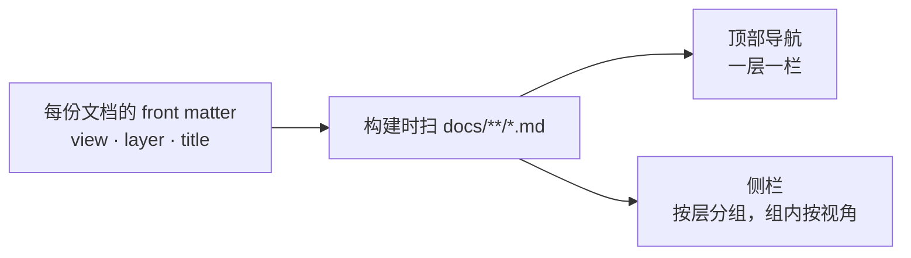
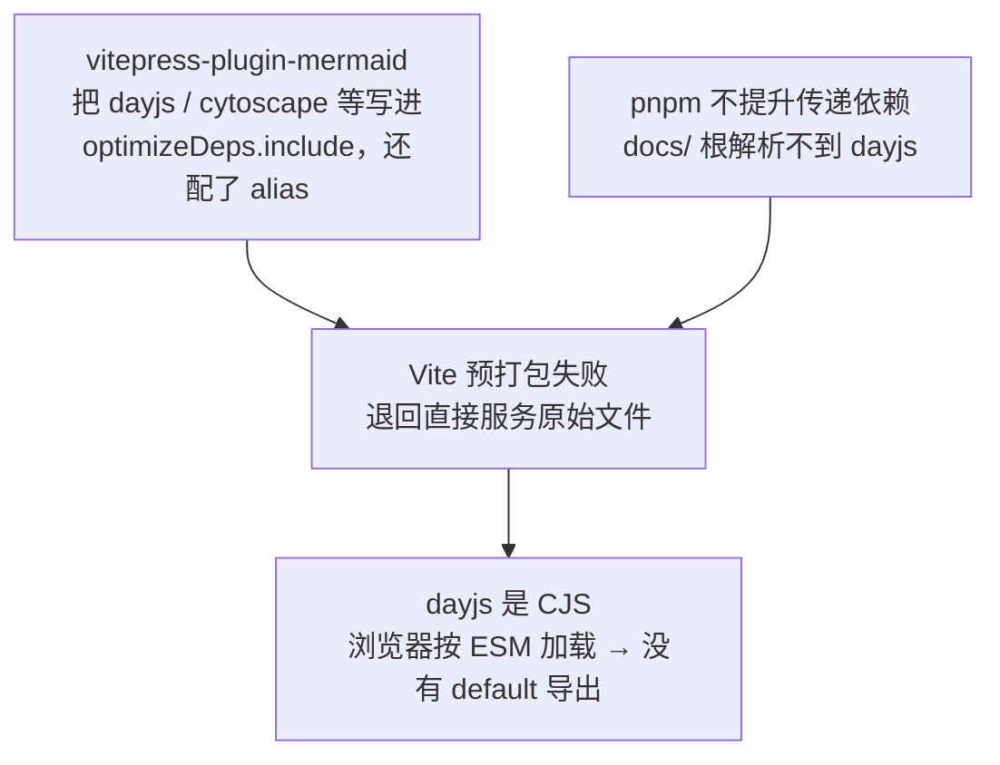

# 文档站（VitePress）— 技术方案

> 相关：[功能](../features/docs-site.md)，[施工进展](../plans/docs-site.md)。

## 1. 一句话

**站点是 `docs/` 的一层皮**——不动任何 markdown，配置从 front matter 现推出导航与侧栏。

## 2. 选型

| 选项 | 结论 |
| --- | --- |
| **VitePress 1.6.4** | ✅ **选它**。仓库已经全面用 Vite（`apps/web` 是 Vite + React），构建链一致；markdown 直接就是源文件，零迁移 |
| VitePress 2.0.0-alpha | ❌ 还是 alpha，`markdown-it-async` 等内部 API 在变，不值得为它冒险 |
| Docusaurus | ❌ React + MDX 体系，要给 70 份纯 markdown 补一堆 frontmatter 约定；重 |
| 纯 GitHub 浏览（不做站） | ❌ 就是本次要解决的问题 |

配套两个：`mermaid@11` + `vitepress-plugin-mermaid@2`（peer 正好是 `vitepress ^1`）。

### 2.1 `docs/` 是独立的 workspace 成员

`@nimbo/docs`，`private: true`，**不带 `/*`**——`docs` 根目录自身就是那个成员（同 `examples` 的写法）。

理由是**它要能单独部署**：

- **依赖自管**——`vitepress` / `mermaid` / `vue` 装在 `docs/package.json`，不占根。根上装了它们，等于每个只想跑 `pnpm test` 的人都要拉一遍 mermaid 那棵树。
- **产物解耦**——`docs/.vitepress/dist` 是纯静态文件，跟 `packages/*` 的 changesets 发布流程没有任何关系，托管方直接指到这个目录即可。
- **质量门自动接上**——它有 `build`/`typecheck` 脚本，于是 CI 的 `pnpm -r build|typecheck` 自动覆盖到它：**build 顺带做全站死链检查，typecheck 查 `.vitepress/` 下的配置**，不用为文档站单开流水线。

**没有放到 `apps/` 下**：那会把 `docs/` 这个人人都知道的位置挪走，仓库里几十处从根指过来的链接全要改，而收益只是目录归类更整齐。

`typecheck` 用普通 `tsc --noEmit` 而不是 `vue-tsc`：站里只有一个 40 行的 `.vue`，用 `shims.d.ts` 把它声明成模块即可；引 `vue-tsc` 要跟本仓的 `typescript@7`（tsgo）配版本，风险大于收益。**真正有逻辑的是 `.vitepress/` 下那几个 `.ts`，它们照常受检查**——事实上 typecheck 一接上就抓出 5 处 `noUncheckedIndexedAccess` 下的空值漏判。

## 3. 结构：配置从 front matter 现推

这是本方案唯一有设计含量的地方。



**为什么不手写侧栏**：72 份文档手写一遍就是 72 行，而且每加一份文档就要记得回来改一次——这种「两处必须同步」的东西一定会漂。front matter 本来就是[上一轮重划](../../architecture/plans/agent-kernel.md)加进去的，直接拿来当事实来源，新增文档放对目录就自动出现。

**层 → 目录 → 导航栏**的映射表是配置里**唯一**手写的东西（六条），因为它带人读的顺序和中文名，推不出来。

### 3.1 侧栏形状：按路径分组，不做三级嵌套

VitePress 支持按路由前缀给不同侧栏。用法是：

```
/orchestration/  →  ┌ 功能        ┐
                    │  单一数据账本 │
                    │  停止本轮    │  ← 这一层的全部 features/
                    ├ 技术方案     ┤
                    │  …          │
                    └ 施工进展     ┘
```

**没有做「层 → 功能 → 三视角」的三级嵌套**，虽然那样「读一个功能的三份」更顺。理由是 72 页做成三级，侧栏会变成一片折叠箭头，扫一眼看不到东西；而「一个功能的三份互链」在**文档抬头的『相关』行里本来就有**，不需要侧栏再兜一遍。

## 4. 两处链接改写

### 4.1 指向仓库代码的链接 → GitHub

文档里有 28 条相对链接指向 `docs/` 之外（`../../packages/core/README.md`、`../../../CLAUDE.md` 等）。它们在站上必然 404。

三条路，选第三条：

| 做法 | 问题 |
| --- | --- |
| 源文件里直接写成 GitHub 绝对地址 | 编辑器里点不动了，本地读文档变难 |
| `ignoreDeadLinks` 放过它们 | 站上照样 404，只是不报错——把问题藏起来 |
| **构建时改写**（选它） | 源文件保持相对路径，站上指向 GitHub |

实现是覆盖 markdown-it 的 `link_open` 规则：拿当前文件路径把 `href` 解析成绝对路径，**落在 `docs/` 外面的**换成 `https://github.com/ludafa/nimbo/blob/main/<repo 相对路径>`，其余原样放过。

### 4.2 死链检查保持打开

改写之后不需要 `ignoreDeadLinks`——外链已经是 `https://`，VitePress 不检查外部地址；站内链接则全部真实存在（上一轮重划时已校验到 0 死链）。**保持检查打开是这套的价值之一**：以后再挪文档，`docs:build` 会直接失败。

## 5. 中文搜索

VitePress 的本地搜索（minisearch）默认按空白和标点切词，**对中文等于不切**——整句变成一个 token，搜「归属仲裁」命中不了「归属仲裁机制」。

所以自定义 `tokenize`：拉丁词照旧整词切，遇到 CJK 连续段则**切成二元组**。

```
"归属仲裁机制"  →  归属 属仲 仲裁 裁机 机制
```

**不额外产出单字**：`searchOptions` 开了 `prefix`，单字查询会走前缀匹配命中二元组，而多产一倍 token 会把索引撑大近一倍——实测两种切法差 3.1 MB / 2.2 MB。

收益是「归属」「仲裁」「归属仲裁」都能命中。索引在用户点开搜索框时才加载，这个体量下可接受。

> 不用 jieba 之类的分词库：那是运行时依赖 + 词典体积，而二元组对**检索**已经够用（它换来的是召回，精度由 minisearch 的打分兜）。

## 6. 首页与总览页

- **`docs/index.md`** —— 新建，VitePress 的 `layout: home`，只放一句定位 + 六张入口卡片。
- **`docs/README.zh-CN.md` → `docs/overview.md`** —— 原来那份详细中文总览改名，路由变成 `/overview`（原名会生成 `/README.zh-CN` 这种难看又容易和 `srcExclude: **/README.md` 打架的地址）。仓库里链它的两处（根 `README.md`、`CLAUDE.md`）同步改。

## 7. 取舍与已知限制

- **不做多语言、不做版本化。** 站点只有中文；包还没稳定到要为旧版本留一套文档。
- **`docs:dev` 是常驻进程**，按仓库规矩不由 agent 主动起；验证一律走 `docs:build`。
- **front matter 写错会静默漏页**：`layer` 拼错的文档不会进任何一组侧栏，但也不会报错。**施工里加一条校验**兜住（见[施工进展](../plans/docs-site.md)）。
- **`docs:check` 不在 `pnpm -r` 的三个脚本里**（它叫 `check`），所以 CI 单列了一步。build 与 typecheck 则自动被 `-r` 覆盖。
- **搜索索引 2.2 MB**，用户点开搜索框时才加载。二元组切词是主要来源，这个体量下可接受；真嫌大就换成只索引标题与小节。
- **本期不接托管。** 形态已经可独立部署（`DOCS_BASE` 配子路径已验证），但托管到哪儿、怎么自动发布另议。

## 8. 独立部署要点

产物是 `docs/.vitepress/dist/` 下的一堆静态文件，无服务端依赖。

| 托管方 | 怎么配 |
| --- | --- |
| Cloudflare Pages / Vercel / Netlify | 构建命令 `pnpm --filter @nimbo/docs run build`，输出目录 `docs/.vitepress/dist`，不用设 `DOCS_BASE` |
| GitHub Pages（项目页，子路径） | 同上，但要 `DOCS_BASE=/nimbo/`——**不设的话资源会去根路径找，整站白屏** |

`base` 走环境变量而不是写死在配置里，是为了同一份代码能同时供根路径和子路径两种托管，不用为部署改一次配置再改回来。

## 9. pnpm 严格布局 × mermaid：dev 模式下的一个坑

**症状**：`pnpm docs:build` 一切正常，但 `pnpm docs:dev` 打开页面直接白屏，控制台报

```
Uncaught SyntaxError: The requested module '/@fs/…/dayjs@1.11.21/…/dayjs.min.js'
does not provide an export named 'default'
```

**成因**是三件事凑到一起：



**为什么构建没事**：`vitepress build` 走 Rollup 打包，CJS 由 `@rollup/plugin-commonjs` 转换掉；`optimizeDeps` 是**开发模式专属**的预打包机制，只有 dev 才走这条路。

**解法：把这几个传递依赖显式声明成 `@nimbo/docs` 的 devDependency**，版本照抄 mermaid 自己声明的 range（pnpm 因此复用同一份，不会装出第二个副本）：

| 包 | 为什么要 |
| --- | --- |
| `dayjs` · `cytoscape` · `cytoscape-cose-bilkent` · `@braintree/sanitize-url` | 插件把它们写进了 `optimizeDeps.include` / `resolve.alias`，要从 `docs/` 根解析得到 |
| `debug` | **已经不是 mermaid v11 的依赖**（插件那份清单停在 mermaid 10 时代），但仍在 include 里；不装每次 dev 报一行解析失败 |

**没用插件 README 给的 `pnpm install --shamefully-hoist`**：那会把整个 workspace 的依赖可见性放开，让所有成员都能 import 到自己没声明的包——为一个文档站的开发模式付这个代价不值。显式声明的作用域只在这一个成员里，而且**写清楚了「谁要它」**。

> 这也正合「docs 是独立成员、依赖自管」那条：它自己的开发模式需要什么，就写在它自己的 `package.json` 里。
