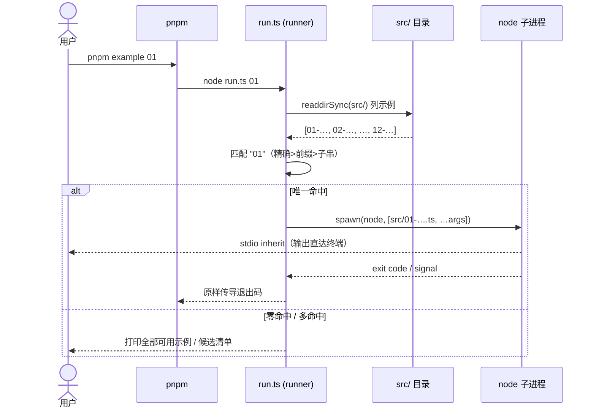

# 示例集 examples（实验田）— 技术方案

> **相关**：产品手册见 [features/examples](../features/examples.md)；施工进展见 [plans/examples](../plans/examples.md)。
> **依赖**：workspace 成员化的解析规则与根管线约定见 [tech/chat-webapp](../../ingress/tech/chat-webapp.md)（apps 并入根 workspace 的同款理由）；原 13 号迁出的去向见 [plans/single-ledger](../../logic/orchestration/plans/single-ledger.md)。

本文讲 [示例集（examples，实验田）](../../terms.md) 的技术组织：workspace 成员化、`src/` 布局、[runner](../../terms.md) 机制、typecheck 进 CI、依赖解析，以及 11 号真机段所需的 Cloudflare 网关为何不放在 examples 内、而是独立 workspace 成员 `apps/cloudflare-worker-server` 的边界说明。产品视角（解决什么、怎么用）见 [features/examples](../features/examples.md)。

## 1. workspace 成员化

`examples/package.json`（`@nimbo/examples`，`private: true`，不发布）用两种协议声明依赖：

- `@nimbo/*`（sdk / just-bash / sandbox-e2b / sandbox-vercel / sandbox-cloudflare）走 **`workspace:*`**——直接解析到仓库内各包，示例 import 的是各包 `exports` 声明的入口（连接到源码，无需先 `pnpm build`）。
- `ai` / `zod` / `e2b` / `@vercel/sandbox` 走 **`catalog:`**——与全仓统一版本（[pnpm-workspace.yaml](../../../pnpm-workspace.yaml) 的 `catalog:` 块）同源；`@ai-sdk/deepseek` 是示例专属、直接钉版本。

根 `pnpm install` 自动搭好这套依赖，**取代了旧的手工符号链接脚本 `setup-node-modules.mjs`**（已删）。`examples` 进 `pnpm-workspace.yaml` 的 `packages:` 列表（不带 `/*`——`examples` 根自身就是那个成员，其 `src/` 是示例源码）。11 号真机段依赖的 Cloudflare 网关不再是 examples 下的一个子目录，而是独立 workspace 成员 `apps/cloudflare-worker-server`，见 §6。

## 2. `src/` 布局

```
examples/
├── run.ts                 # runner（工具，非示例）
├── package.json           # @nimbo/examples，example + typecheck 脚本
├── tsconfig.json          # include 收窄到 src/**/*.ts + run.ts
├── README.md
└── src/
    ├── 01-memory-diff.ts … 12-vercel-sandbox-real-project.ts
    └── shared/                # model.ts（resolveModel）+ transcript-store.ts
```

11 号真机段所需的 Cloudflare 网关不在这棵目录树里——它是 `apps/cloudflare-worker-server`，见 §6。

源码全部在 `src/` 下。`src/shared/model.ts` 的 `resolveModel()` 用三层 `..`（`shared/ → src/ → examples/ → 仓库根`）定位根 `.env`，经 Node 内置 `process.loadEnvFile` 加载（零第三方 dotenv）。各脚本 `import "./shared/model.ts"` 等相对路径都在 `src/` 内自洽。

## 3. runner 机制

`examples/run.ts` 是 `pnpm example <编号或名字前缀>` 背后的分发器，纯 Node 内置模块实现：

1. `readdirSync(src/)` 列出 `^\d.*\.ts$` 的顶层脚本名（去后缀），排除 `shared/` 等；
2. 按参数匹配，**先命中者胜**：精确名 > 前缀 > 包含子串；
3. 唯一命中 → `spawn(process.execPath, [scriptPath, ...透传参数], { stdio: 'inherit' })`，子进程退出码/信号原样传导；
4. 零命中 → 打印全部可用示例；多命中 → 列候选让用户写得更具体。

新增示例零维护：往 `src/` 丢一个 `NN-*.ts` 就自动进入可选列表。



## 4. typecheck 进 CI

`examples/package.json` 定义 `typecheck: tsc --noEmit`；`ci.yml` 跑 `pnpm -r typecheck`（workspace 递归），天然扫到 examples——**examples 带质量门、`src/` 保持类型绿是被 CI 强制的**。

注意根脚本 `pnpm typecheck` 是 `--filter ./packages/*`，本地只查核心包、**不含** examples（快路径）；进 CI 的是 `pnpm -r typecheck` 那条全量。`pnpm-workspace.yaml` 的注释与本节一致（此前 `tsconfig.json` 注释写「NOT wired into CI」，与 workspace 注释自相矛盾，已在本次收尾统一）。

`tsconfig.json` 的 `include` 收窄到 `["src/**/*.ts", "run.ts"]`——`node_modules/` 都在这两个 glob 之外，自动不入程序，无需再写 `exclude`。`allowImportingTsExtensions: true` 让 tsc 接受 `./shared/model.ts` 这种带 `.ts` 后缀的 import（因为示例是 `node` 直跑、不重写后缀；noEmit 下合法）。（此前这里还需要顺带排除 `cloudflare-gateway/` 这个独立 wrangler 子目录，现该目录已整体搬到 `apps/cloudflare-worker-server`，examples 内不再有需要额外排除的非示例子目录。）

## 5. 原 13 号（e2e 测试）的去向

`examples/13-uimessage-single-ledger.e2e.test.ts` 曾是 [single-ledger](../../logic/orchestration/features/single-ledger.md) 的验证实验（见 [plans/single-ledger §2](../../logic/orchestration/plans/single-ledger.md)），是示例集里**唯一**一个真正的 e2e 测试而非演示。本次梳理把它移出示例集：

- **离线结构断言段**改写成 3 个常规 vitest 用例，迁至 `apps/node-server/test/agent/uimessage-single-ledger.test.ts`（转换器丢弃 data 部件 / assistant-tool 分组 / transient 纪律），随 server 测试进 CI。
- **真机 DeepSeek 验证段**（一次性人工实验、CI 永久 skip 无回归价值，且会给 server 引入首个真机网络测试、污染其全离线测试哲学）不迁移，完整版留在 git 历史。
- `packages/core/src/loop.ts` 对 13 旧路径的注释引用已更新指向新位置、并注明真机段见 git 历史。

single-ledger 的语义实现已落在 `@nimbo/core` 的生产代码，真机复现价值低；这条判断的取舍记录见 `.lantie_history`。

## 6. 11 号真机段的 Cloudflare 网关：`apps/cloudflare-worker-server`，为什么不在 examples 里

11 号真机段要连真实 Cloudflare 沙盒，就必须有一个 Worker 在你自己的 CF 账号里跑（CF Sandbox 只能从 Worker 内部访问）。这个 Worker 曾经是 examples 下的一个子目录 `examples/cloudflare-gateway-ref/`（三个文件、无 `package.json`、纯 BYO 参考料，需自行拷进 wrangler 项目部署）；该目录**已删除**，能力并入独立 workspace 成员 [`apps/cloudflare-worker-server`](../../../apps/cloudflare-worker-server/README.md)（原是一个 SPIKE 性质的探针项目，现已转正为正式示例并随之更名，去掉 SPIKE 定性）。

这是一个**完整可跑可部署的 workspace 成员**（包名 `@nimbo-chat/cloudflare-worker-server`），有自己的 `package.json`/`tsconfig.json`/`wrangler.jsonc`/`Dockerfile`，装了 `@cloudflare/sandbox` 与 `wrangler` 等只有 workerd 运行时才需要的依赖，并纳入自己的 `typecheck`/`deploy` 脚本。它同时扮演两个角色，共用同一套 `getSandbox` 接线与同一个 Durable Object binding：

- **角色①**：服务端自己在 Worker 里跑 nimbo 会话，进程内直连驱动真实 CF Sandbox（`GET /sandbox-check`、`POST /agent`、`GET /debug/exec`）。
- **角色②**：**对外 BYO 网关端点** `ALL /gateway/*`，供任意 Node 机器上的 `cloudflareWorkspace({ url, token })` 连入——这就是 11 号真机段需要的那个网关。客户端 `url` 要带 `/gateway` 前缀（如 `https://<worker>.workers.dev/gateway`），token 走 secret `NIMBO_GATEWAY_TOKEN`（未配置则该端点 503）。

**为什么放在 `apps/` 而不是 examples 里**：它不再是一份「无 `package.json`、不安装、不 typecheck」的参考料，而是一个有真实依赖、需要独立构建/部署配置的完整项目——`examples` 根只有一个 `package.json`、一套 `typecheck: tsc --noEmit`，`tsconfig.json` 的 `include` 收窄到 `["src/**/*.ts", "run.ts"]`，容不下一个需要自己 `wrangler.jsonc`/独立依赖树/独立 typecheck 边界的完整项目；`apps/` 目录本就是给这类「完整 workspace 成员、有依赖有 typecheck」的应用落脚的地方（同款理由见 [tech/chat-webapp](../../ingress/tech/chat-webapp.md)）。它的定位仍是**一个巨大的示例**：包 `@nimbo/sandbox-cloudflare` 真正对外交付且被完整测试的是 `createSandboxGateway`（`./worker`，纯函数、零 `@cloudflare/sandbox` 运行时 import，见 [features/sandbox](../../host/contract/features/sandbox.md)）；`apps/cloudflare-worker-server` 只是把那个纯函数接到真实 CF 账号、跑在真实 Worker 里的示例项目——用它仍需自备 CF 账号 + Workers Paid 计划（CF 沙盒无免费层）。

技术细节（路由、`stripAbortSignal` 绕过 Durable Object RPC 边界不能序列化 `AbortSignal` 的问题等）见其自己的三份文档：[features/cloudflare-worker-server](../../host/cloudflare/features/cloudflare-worker-server.md) · [tech/cloudflare-worker-server](../../host/cloudflare/tech/cloudflare-worker-server.md) · [plans/cloudflare-worker-server](../../host/cloudflare/plans/cloudflare-worker-server.md)。

## 已知限制

- 示例的 import 源在 npm 裸名 `nimbo` 发布决策定案后可能整体替换（[plans/core-sdk](../../logic/engine/plans/core-sdk.md) P7-1 遗留）。
- 模型驱动段与云沙盒真机段依赖外部凭证与网络，非确定性；确定性段是无凭证下的可复现底座。
