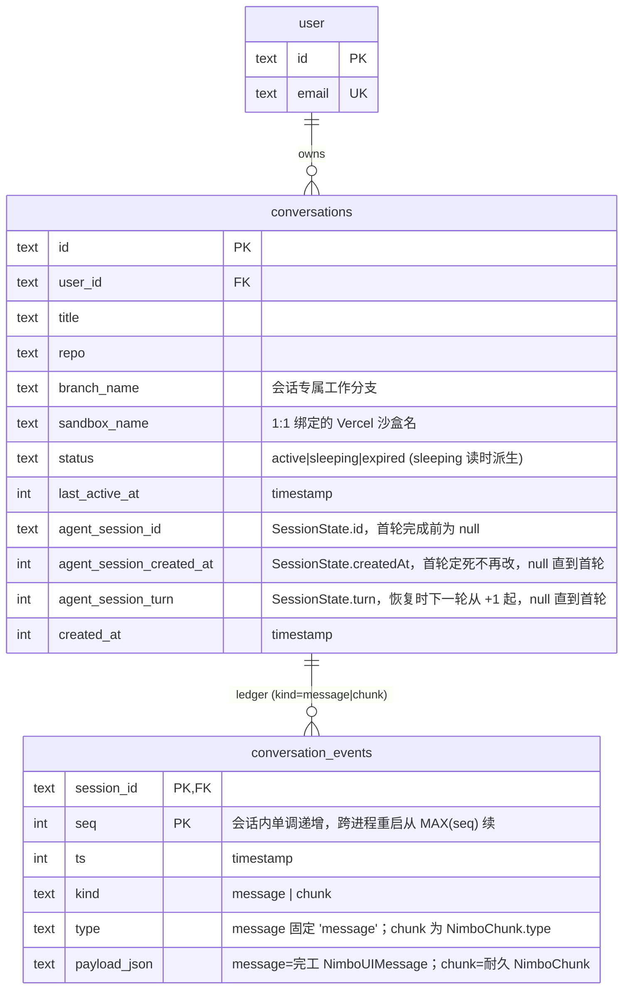
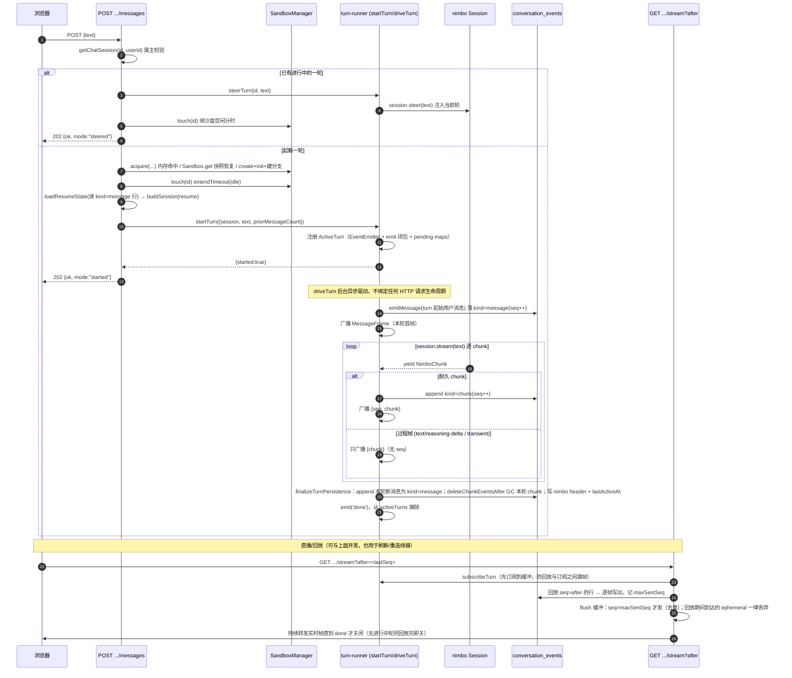

# Chat Webapp（技术方案）

> 相关：[产品视角](../features/chat-webapp.md) · [施工进展](../plans/chat-webapp.md) · 可观测性（工具计时 + server 日志，§11）拆单见 [plans/chat-observability](../plans/chat-observability.md)
> 依赖：[core-sdk](../features/core-sdk.md)（`@nimbo/sdk`/`@nimbo/core`：[agent](../terms.md)/[loop](../terms.md)/[session](../terms.md)/[chunk](../terms.md)）· [sandbox](../features/sandbox.md)（`@nimbo/sandbox-vercel`：[工作区](../terms.md) = [NimboFS / NimboExec](../terms.md)）
> 被增强：[turn-checkpoint](../features/turn-checkpoint.md)（[代码快照](../terms.md)/[保活](../terms.md)）· [single-ledger](../features/single-ledger.md)（[UIMessage 单账本](../terms.md)，P13-5 已落地）· [compaction](../features/compaction.md)（[上下文压缩](../terms.md)）

本文档以 **P13-5 迁移后的现状**（UIMessage 单[账本](../terms.md) + [chunk](../terms.md) 帧流）为准。文末保留 P13-5 之前的 wire 事件模型作为历史与动机记录（`SessionEvent` 镜像 / `user.message`·`turn.result` 哨兵 / `nimbo_state_json` 独立存档等，均已被取代）。

---

## 1. 布局与工作区（结构性决策）

- seed 的 `apps/client` 更名为 **`apps/web`**，seed 的 `apps/server` 保留（2026-07-20 更名为 **`apps/node-server`**，与 [`apps/cloudflare-worker-server`](./cloudflare-worker-server.md) 形成 node/worker 两个服务端形态的对称命名）；`apps/docs` 不引入。包名 `@nimbo-chat/web`、`@nimbo-chat/node-server`。
- **apps/\* 并入 nimbo 根 pnpm workspace**（`packages: ["packages/*", "apps/*"]`）——server 依赖 `@nimbo/sdk`/`@nimbo/sandbox-vercel`（`workspace:*`）。独立子 workspace 无法解析 workspace 协议（`file:` 安装会因包内 `workspace:*` 依赖失败），examples 的纯符号链接方案又与 apps 必需的 `pnpm install` 冲突——并入根 workspace 是唯一自洽解。
- **根管线保持不变**：根 `package.json` 的 build/typecheck/test/coverage 脚本 filter 收窄为 `./packages/*`——CI 与 885 用例基线零扰动；apps 用自己的脚本（`pnpm -F @nimbo-chat/node-server dev` 等）。root vitest projects 本就只收 `packages/*`。
- seed 的 `pnpm.overrides`（vite→rolldown-vite）与原生构建放行（better-sqlite3/esbuild/msw）合入根 workspace 配置。**零二进制原则的边界澄清**：它约束的是发布的 `@nimbo/*` 包，apps 是消费侧产品代码，不受限。

## 2. 业务数据领域图

两张应用表（`apps/node-server/src/db/schema.ts`），外加 better-auth 的 `user` 表。字段与 P13-5 后的形态一致：`conversations` 携带 **nimbo 标量 header**（`agent_session_id`/`agent_session_created_at`/`agent_session_turn`，取代旧的 `nimbo_state_json` 整块 JSON），`conversation_events` 用 **`kind`** 区分 `message`/`chunk` 两类条目、共享一条按会话单调递增的 `seq`。



**两类条目的含义（docs/tech/single-ledger.md §5 单-3）**：

- `kind = 'message'`：一条**完工**的 `NimboUIMessage`，`payload_json` 逐字节等同 `Session.toJSON().messages` 会产出的形状。这是 session resume 读回的东西（`store.ts` 的 `loadResumeState`），也是永久回放历史——**永不删、永不改写**。
- `kind = 'chunk'`：**进行中**这一轮的**耐久** `NimboChunk`（工具状态含 approval-requested/responded、data 部件、step 标记、message start/finish/metadata；**不含** text-delta/reasoning-delta/[transient](../terms.md) data 部件——那些只活在 SSE 线上）。存它是为了「刷新页面时仍能重建挂起中的审批/提问」。一轮优雅收尾时，本轮的 chunk 条目会被删掉（被本轮的 `message` 条目取代，`store.ts` 的 `deleteChunkEventsAfter`）。**残留的 chunk 条目只意味着那一轮崩溃中断（无收尾）**——被接受的残渣，不做后续清理。

**`nimbo` 标量 header 的语义**：`agent_session_id`/`agent_session_created_at`/`agent_session_turn` 是 nimbo 自己的 [SessionState](../terms.md)「会话头」的三个标量（不是整份账户）。四者（含 header）在本会话**首轮真正完成前全为 null**（此时 nimbo 还没生成 session id）。恢复时：消息史从 `kind = 'message'` 行读回、三标量从 header 读回，拼回一份 `SessionState`（`routes/chat.ts` 的 `loadResumeState`，复用 core 导出的 `sessionStateSchema` 校验）。沙盒文件态（含分支代码）**另走** Vercel 快照恢复——两条恢复通路正交。

> 关键取舍：`loadResumeState` 是否 resume，判据是「有没有 `kind = 'message'` 行」，**不是** header 是否为 null。因为首轮若崩溃（header 没写成，但 turn 起始的用户消息行已落），仍要把这条用户消息回放给 UI、并让模型下轮记得它。以 header 为闸会漏掉这条。

## 3. 核心流程（发消息 → 起轮 → 后台驱动 → 落盘广播 → 直播/回放）



**几条载重不变量**：

- **订阅先于回放**：`subscribeTurn` 同步注册后才跑回放查询，保证「回放查询与订阅之间」产生的帧不丢（先缓冲、后 flush）。
- **过程帧不占 seq**：`isDurableChunk` 为 false 的 chunk（text-delta/reasoning-delta/`transient:true`）既不落库也不消耗 seq——持久流无空洞，`after=` 续传语义、和「进程崩溃后内存 seq 从 DB `MAX(seq)` 续起」的一致性都不需要任何特判。
- **回放期 ephemeral 丢弃（tail 的回归竞态）**：`GET /stream` 缓冲里可能出现「比回放已送出的耐久 chunk 更旧的 ephemeral tick」——转发它会把该消息打回半截且不再有耐久帧收尾。规则：**回放阶段结束前到达的 ephemeral 一律丢弃**（对该连接只有 live 价值，丢弃无损）；回放结束后到达的必属仍在进行的消息，照常转发。
- **turn-start 用户消息只落一次**：`driveTurn` 在消费 `session.stream()` 之前先合成一条用户 `NimboUIMessage`（自己的 id、单 text 部件）落盘+广播为本轮首帧；nimbo core 自己的 `Session.stream()` 也会往内部账本推一条结构相同、id 不同的副本——`finalizeTurnPersistence` 用 `priorMessageCount + 1` 跳过 core 的那份，保证只写一次。

## 4. 服务端模块（apps/node-server/src/agent/ + routes/）

在 seed 骨架上叠加：

- **`model.ts`**：DeepSeek 直连（默认 `deepseek-v4-pro`，`NIMBO_MODEL` 覆盖）——同 07 示例。
- **`store.ts`**：`conversations` + `conversation_events` 的纯函数读写（注入 `Db`，测试可指向内存库）。刻意不认 `NimboUIMessage`/`NimboChunk` 具体类型，只吞吐 `payloadJson` 字符串 + `kind`；typed 解析/序列化是调用方的事（`turn-runner.ts` 写、`routes/chat.ts` 读）。关键函数：`getMaxEventSeq`（seq 续接点，跨两 kind 共一条计数器）、`appendAgentEvent`、`listAgentEvents(afterSeq)`、`deleteChunkEventsAfter`（收尾 GC）、`loadResumeState` 用到的 `nimboHeader` 组合更新。
- **`sandbox-manager.ts`**（核心生命周期）：全服务里唯一碰 `@vercel/sandbox`/`@nimbo/sandbox-vercel` 的模块，其余只见结构接口 `SandboxClient`/`ManagedSandbox`（可 fake，测试零网络/凭证）。进程内 `Map<sessionId, ActiveSandbox>` + `inflight` 去重：
  - `acquire(input)`：三态——① 内存命中 → 直接复用，零 Vercel 调用；② `SandboxClient.get()` 成功（Vercel 从快照恢复，**分支代码含未提交改动原样还原**）→ 原样复用；③ `get()` 失败（404「从未建过」或 410「停机后无法从快照恢复=快照过期」）→ `create()`（`persistent:true` + `runtime:node24` + git source）+ 重跑 init 计划（装 skill、git identity、remote auth、git exclude）+ `recoverSessionBranch`（`git fetch origin <branch> && git checkout`，失败则 `git checkout -b` 重建——一条路径覆盖「全新」与「过期」两子情形）。
  - `touch(sessionId)`：**沙盒「休眠」机制本体**——只调 Vercel 的 `extendTimeout(idleTimeoutMs)`，无服务端定时器。会话空闲超过 `SANDBOX_IDLE_TIMEOUT_MS`（默认 5 分钟，env 可调）时 Vercel 自己 stop + 快照；下条消息的 `acquire`（态 ② 或 ③）恢复。进程重启也不漏。无内存态时 `touch` 抛错（须先 `acquire`）。
- **`chat-agent.ts`**：`buildSession(opts)`——`Skill.fromFS(workspace, "/.agents/skills/frontend-design")` + instructions（owner/repo/分支/默认分支烤进去，模型不用猜；分支固定为会话 `branchName`，多轮在同一分支累积，且明确要求「用户没让改就只读」）+ 调 **`@nimbo/sdk`** 的 `createSession`（不是 `@nimbo/core` 的——只有 sdk facade 版打包了八件套文件工具默认装配，才让 agent 真能改沙盒里 checkout 的仓库）。**每轮 fresh 重建**，无跨请求长驻 `Session`；消息史经 `conversation_events` 的 `kind='message'` 行 + `nimbo` 标量 header round-trip（`resume`），沙盒文件态另走快照。
- **`web-search.ts`**：[联网搜索](../terms.md)工具（`web-search`，后端 Exa `/search`）——应用级工具，**条件注册**：`EXA_API_KEY` 有值才进 `agent.tools`，没配则模型看不见它。与 `ask-user` 同构、core 零改动，详见 [tech/web-search](./web-search.md)。
- **`turn-runner.ts`**：turn 执行/连接解耦的核心（详见 §5）。
- **`approval-policy.ts`**：审批放行/拦截策略的纯函数（`classifyApproval`/`resolveApprovalMode`），三档 `CHAT_APPROVAL_MODE`（详见 §6）。
- **`routes/chat.ts`**（`@hono/zod-openapi`，十二个端点，全登录态强制）：见 §7 契约。本页只写其中的会话/直播流/审批那几个；[待发队列](../terms.md)的三个见 [tech/steer-and-queue §4.2](./steer-and-queue.md)，`POST .../abort`（[停止](../terms.md)本轮）见 [tech/turn-abort §3.2](./turn-abort.md)。

## 5. 断线可续的实时流（turn 执行与连接解耦）

**问题（P12-4 修复动机）**：原设计把 agent turn 直接跑在 `POST /messages` 的 SSE 回调里，客户端断线（刷新/HMR/网络抖动）后：server 端 turn 虽继续落库，但客户端只有一次性 `GET events` 补齐、且刷新后组件重挂载根本不开实时流——进行中 turn 的后续帧永远到不了页面。

**修法：turn registry + 可续传 live-tail。**

- **`agent/turn-runner.ts` 的 turn registry**：进程内 `Map<sessionId, ActiveTurn>`；`ActiveTurn` 持一个 `EventEmitter`、一个 seq 计数+落盘+广播的 `emit` 闭包（`createTurnEmitter`）、以及审批/提问的 pending maps。`startTurn()` 若该 session 已有进行中轮则拒绝（`{started:false}` → 路由转 409），否则**后台异步驱动** `driveTurn`（`void` 不 `await`、不绑定任何 HTTP 请求生命周期）。同步注册 `ActiveTurn`（`isTurnActive`/`subscribeTurn` 立即可见）后才 spawn。
- **`driveTurn` 落盘时序**：先合成并落 turn-start 用户消息（`kind=message`，本轮首帧）；再逐 chunk——耐久的落 `kind=chunk`(seq++) 并广播、过程帧只广播；优雅收尾走 `finalizeTurnPersistence`（append 本轮新消息为 `kind=message` → GC 本轮 chunk → 写 header/lastActiveAt），emit `done` 后摘除。生成器**抛错**（真正意外失败，区别于 `session.stream()` 自身的优雅降级 return）时，广播一条合成的 `message-metadata` chunk（复用 core 优雅失败同款 `status:'failed'` 形状，前端无需单独分支），**不**走 finalize（本轮 chunk 不 GC——同「进程崩溃残渣」取舍）。
- **`GET /api/chat/conversations/{id}/stream?after=<seq>`**（可续传 tail）：先 `subscribeTurn` 订阅到缓冲、再回放 DB 中 `seq > after` 的行（记 `maxSentSeq`）、再 flush 缓冲里 `seq > maxSentSeq` 的实时帧（回放期到达的 ephemeral 丢弃）、随后持续转发直至 `done` 才关闭；若无进行中轮（`isTurnActive` false）则回放完即关。
- **客户端**（`apps/web` 的 `use-chat-messages.ts`，「命令/订阅分离」）：`sendMessage` = 乐观插入 + `POST messages`（起轮/steer）+ 打开 tail；**组件挂载时总是打开 tail**（`after=lastSeq`）以续接刷新前遗留的进行中轮；tail 断开时若本轮尚未收尾就带 `after=lastSeq` 重开（指数退避、限次）。seq 去重 / `lastSeq` 推进 / 重连 `after=` **只看有 seq 的帧**；ephemeral 帧照常喂时间线（live 打字机），不进 seq 记账。回放流里天然不含 ephemeral，重连后由完工消息收敛终态。
- **边界（v1 已知取舍）**：进程重启丢失内存态 turn（沙盒仍在跑但 nimbo loop 停）——DB 事件保留至崩溃点，重启后 tail 回放发现无进行中轮即静默收尾。界面侧的收敛靠下面 §5.1 那帧。
- **持久化恢复语义**：nimbo `SessionState`（消息史）与沙盒快照（文件态）分别恢复，模式 A 下天然一致（文件真身在沙盒里）。

### 5.1 [轮状态快照](../terms.md)：别让前端猜「有没有轮在跑」（2026-07-27 修）

**问题**：前端判断「这个会话有没有[轮](../terms.md)在跑」曾经只有一个来源——**猜**：历史回放的最后一帧不是 message 就算在跑（`use-chat-messages.ts` 的 `lastFrameIsChunk`）。依据是「优雅收尾会 GC 掉本轮的 `kind='chunk'` 行，所以正常结束的一轮只剩 `MessageFrame`」。

这个推理少了一步：**以 chunk 收尾同时覆盖「真在跑」与「崩溃过」两种情况，而这两者的答案恰好相反。** 崩溃的轮（进程重启、`driveTurn` 抛错那条分支）永远不会送出收尾 `message-metadata`，它的 chunk 行也永不 GC（上面 §5 的既有取舍），于是此后**每次**打开这个会话，前端都猜「有轮在跑」，而且**永不自愈**——翻假只发生在收到收尾 metadata 时，那需要一个真在跑的轮。

用户实际撞上的两个症状都出自这里：

| 用户做的事 | 实际发生 |
|---|---|
| 发一条消息 | 走[排队](../terms.md)分支 → 没有乐观回显（消息不上屏，只出现在待发区）→ 而且**永远等不到[出队](../terms.md)**（没有轮会收尾去触发它） |
| 按[停止](../terms.md) | 服务端 409（它那边确实没有轮）→ 前端按既有约定静默吞掉 → 界面毫无反应 |

**修法**：服务端手上有权威答案（`isTurnActive`），下发它。`GET .../stream` 在回放之后、进入直播之前，紧跟队列快照再发一帧：

```
event: turn-state
data: {"turnActive": false}
```

形状与[待发队列](../terms.md)快照帧完全同构（见 [steer-and-queue §4.3](./steer-and-queue.md)）：**没有 `seq`**、不落库、不进[账本](../terms.md)、不参与 `after=` 续传——它是「此刻状态长这样」，重发一次即最新。前端收到后设 `turnInProgressRef`/`status`（`applyTurnState`）。

三条设计要点：

1. **每条连接都发，不只第一条。** 因此修的不是「打开会话那一刻判断错」，而是**任何**前端与服务端的状态分叉：轮悄悄死了（进程重启）→ tail 关闭 → 前端重连 → 新连接告知 `false` → 落回空闲。这把 §5「边界」里那条「重启后界面停在崩溃点」的遗留问题一并收敛了。
2. **发的是订阅那一刻的 `wasActive`**，与「要不要进直播循环」用同一个读数。告诉客户端「有轮在跑」却立刻关掉连接（或反过来），会让它的重连退避做出错误决定。
3. **反向也修**：另一个标签页起的轮，这边 tail 连上会拿到 `true` 并正确进入流式态——以前这也是靠猜。

`lastFrameIsChunk` 保留，但降级为「tail 连上前那几十毫秒的临时初值」，并且刻意仍然猜「在跑」：万一真有一轮在跑，这几十毫秒里用户发的消息会被正确排队，而不是去起第二轮。

前端 `status` 的收敛有一条刻意的例外：**`'error'` 不被 `turnActive: false` 覆盖**。顶部那条红色的「直播中断」提示说的是连接坏了，而「没有轮在跑」本来就是它的题中之意，抹成空闲等于把故障信息吃掉。

## 6. 人在环上：bash 审批链与 ask-user 提问

**动机**：沙盒 exec 本身声明 `defaultApproval: "allow"`（隔离即边界），chat 应用因此从不产生审批请求；但产品面需要外发动作（`git push` / 开 PR / 破坏性删除）经人确认，且 agent 需要能在 turn 中途向用户提问。两者同构：**工具执行挂起 → 会话注入的通道 → web 卡片 → HTTP 裁决 → resolve Promise 继续**。nimbo core 零改动。

P13-5 后的现行机制（三值审批 + 原生 chunk，取代旧的四对 wire 事件）：

- **触发面（bash 审批）**：`buildSession` 用 `gateWorkspace` 包装沙盒 workspace（**逐方法显式委托** + `defaultApproval: "review"`，不用对象展开——沙盒 workspace 是类实例，方法在原型链上，浅展开会丢方法只剩 `undefined`）。这把内置 bash 的 per-tool approval 升到 `"review"`，每次调用都升级到会话级的[审批分类器](../terms.md)。
- **[审批分类器](../terms.md)（`onApproval`，`ApprovalPolicy`，三值）**：`approval-policy.ts` 的 `classifyApproval(mode, toolName, input)` 当场判「`allow` 直接跑 / `review` 需要人」。`CHAT_APPROVAL_MODE` 三档——`dangerous`（默认：`git push`、GitHub API curl（引 api.github.com 或 `$GH_TOKEN`）、`rm -r/-f`、`git reset --hard`、`git clean -f` 判 `review`，其余 `allow`；input 形状不符一律升级 `review`，宁严勿松）/ `all`（全量 `review`）/ `off`（不包装 workspace，零行为变化）。
- **[人审通道](../terms.md)（`onReview`，`ApprovalReviewer`）**：分类器返 `review` 后，core 的 loop **先 yield 一个 `tool-approval-request` chunk**（审批可见性=这条 chunk，人一需要就已在线上）、再 `await onReview`。`onReview` → `turn-runner.ts` 的 `requestReview(id, {callId, toolName, input})`：注册一条 pending review、挂起直到 `POST .../approvals/:callId` 的[人工裁决](../terms.md)（或超时自动 deny）经 `resolveReview` settle。settle 后 loop 自己 yield `tool-approval-response` chunk——**turn-runner 不再 emit 任何桥事件**（纯内存 Promise 路由）。超时默认 `CHAT_APPROVAL_TIMEOUT_MS=240s`（沙盒 idle 300s 的 80%），走同一条 resolve 通路保证多 tab/回放一致。
- **人工裁决纯两值**：允许 / 拒绝（可带拒绝理由回填模型），映射 `@nimbo/core` 的 `HumanDecision`。「改参数」口子已于 2026-07-15 定案删除。
- **ask-user 工具**：`BuildSessionOptions.onAskUser` 存在时注册进 `agent.tools`（kebab-case `ask-user`）；`execute` 经 `requestUserAnswer`/`resolveUserAnswer` 同款桥挂起（`pendingQuestions`，独立于 `pendingReviews`）。可见性=`tool-ask-user` 部件自身的 `input-available`/`output-available` 状态（普通工具调用）。超时（`CHAT_ASK_USER_TIMEOUT_MS` 默认 240s）返回固定提示文案（`status:"completed"`，不抛错，模型自行继续）。**与 approvalMode 无关恒注册**（产品能力，不是安全闸）。
- **裁决路由**：`POST .../approvals/:callId` `{behavior:"allow"|"deny", message?}`、`POST .../questions/:callId` `{answer}`——属主校验同其余路由；404 覆盖「session 不存在/非属主」与「callId 无 pending」；allow/answer 先 `touch` 续沙盒且**失败不阻断裁决**（挂到超时比 exec 失败更糟）。
- **[会话级授权](../terms.md)（`allow-session`）**：卡片第三个按钮「会话内都允许」。wire 上是 `POST .../approvals/:callId` 的 `behavior:'allow-session'`——`resolveReview` 除了按 `allow` 放行本次，还调 `session-grants.ts` 的 `grantSessionApproval(id, userId, toolName, input)` 记放行（`pendingReviews` 项带着 `toolName`/`input`，路由只知 `callId` 也够用）。此后 `onApproval` 分类前先查 `hasSessionGrant(db, id, userId, tool, input)`：命中即短路 `allow`、不弹卡片；没记过的仍照常分类。刻意按**具体命令**而非按工具名——授权 `rm -rf build` 不等于放行之后任意 bash（`git push -f` 仍拦）。纯 chat 层、core 不感知（`HumanDecision` 仍只 allow/deny）。
- **记账粒度：bash 走[分段授权](../terms.md)**（详见 [approval-grant-split](approval-grant-split.md)）：一条复合命令按 `&&`/`||`/`;`/`|` 拆成若干[命令段](../terms.md)、每段记一行，后续调用**每段都记过**才放行。这样 `cd X && rm -rf y && npm i a` 授权后，`cd X && npm i a` 直接放行，只有新出现的段才再弹卡片——整串指纹时代「命令稍变即重新审批」的组合爆炸消掉了。段的键是**去引号后的 argv 数组 + cwd + 重定向**（不是命令名，否则 `rm -rf node_modules` 的授权会放行 `rm -rf /`；也不是段的字符串原文，否则 `rm -rf "my dir"` 与 `rm -rf my dir` 撞键）。拆分器（`split-command.ts`）**只认平坦形状**，命令替换/heredoc/控制结构/注释等一律拒拆并**退回整串匹配**（= 本功能上线前的行为，零回退）。非 bash 工具、以及上线前落下的历史授权行，同样走整串键——两种键形态并存都参与查询，**无 DB 迁移**。

**持久化到会话**：授权落 `conversation_grants` 子表（PK `(conversation_id, user_id, grant_key)`，`grant_key = tool + 入参指纹`，FK→conversations `ON DELETE CASCADE`），随会话存续、跨进程重启存活、会话删除即级联清（`clearSessionGrants` 为显式清理入口）。选持久化而非内存耗材,是因为「会话」在本 app = 持久的 conversation:工作区(快照+分支)、账本都跨重启存活,授权若唯独易失,重启后被重新询问只是摩擦;而粒度已窄到「精确命令 + 单会话 + 单用户」,持久化不显著扩大安全面。

**按用户隔离(多用户前瞻)**:`user_id` = 做出授权的**审批人**;`hasSessionGrant` 按**本轮发起者**查。单用户下发起者≡审批人≡唯一用户、行为无差;将来一个 conversation 多用户时天然是「每人管自己的授权」——A 的授权不放行 B 的调用。至于多用户下审批卡片的可见性/可点性(只发起者可点,或全员可见但标注「等待 xxx 授权」),是未来的渲染层决策,不影响这张表。
- **边界**：进程重启丢内存态 pending（与 `activeTurns` 同款 v1 取舍，web 端「已失效」兜底，见 §6.1）；会话级授权同为内存态、会话结束/重启失效，不跨轮进 `SessionState`；审批/提问挂起期间 steer 照常排队，无冲突。

### 6.1 卡片什么时候算「已失效」（2026-07-27 修）

一张[审批卡片](../terms.md)/提问卡片处于「待审批」「待回答」态，**只有当前正在跑的那一轮**才可能还真在等人。轮一结束——正常收尾、被[停止](../terms.md)、[优雅关闭](../terms.md)中断、进程被强杀——服务端那边的挂起项就已经被结掉了（`startTurn` 的 `finally` 会把 `pendingReviews`/`pendingQuestions` 全部 resolve 并清空），此后再点任何按钮都只会拿到 404。

此前界面要等用户**点下去**、吃了 404 才把卡片翻成「已失效」（`locallyExpiredCallIds`），在那之前一直画着三个可点的按钮。用户实测撞到的样子是：一张「待审批」卡片，紧接着下面就是「服务重启，这一轮已中断」——两条信息互相矛盾，而且按钮点了也没用。

修法在 web 侧。判据是「**这张卡片自己那一轮**还活着吗」，由两个条件合成（`TimelineView`）：

```
turnLive = 会话里有轮在跑（status === 'streaming'）
         && 这条消息不属于任何已经收尾的轮
```

**第二个条件不能省**（第一版就漏了它，用户实测撞到）：只看会话级的「有没有轮在跑」，那么上一轮停掉、卡片已正确显示「已失效」之后，用户再发一句「继续」起了新一轮——会话又「有轮在跑」了，于是**历史里那张早该失效的卡片跟着复活成可点的「待审批」**。

「这条消息属不属于已收尾的轮」直接从[账本](../terms.md)结构读出来：每一轮都以一条带终态 `metadata.status` 的 assistant 消息收尾（`loop.ts` 的 `finalizeTurn`），所以从后往前扫，遇到的**第一条**收尾消息、以及它之前的所有消息，都属于已经结束的轮；只有它之后那一段才可能是当前这一轮。

叠加规则：

- **审批卡片**（`approval-requested`）：`expired = 本地404 || !turnLive`。
- **提问卡片**：只有 `input-available`（还在等）那一档才叠加，**`output-available`（已回答）不能叠**——卡片内部 `expired` 的优先级高于 `answered`，叠上去会把一条答完的问题画成「已失效」。

为什么放在 web 而不是让服务端补一条 wire 帧：这是**从已有状态推导得出**的结论（轮不在跑 ⇒ 挂起项必然已结），不需要新的事实来源；而且它天然覆盖「服务端来不及发那条 `tool-approval-response` 就退出了」的情形——那正是进程被强杀时的样子。与「不做乐观翻转」不冲突：这里推导的不是某个决策的结果，而是「这张卡片还有没有人在等」。

**审批超时不中止这一轮**（常被误解，故在此写明）：`CHAT_APPROVAL_TIMEOUT_MS`（默认 240s）到点后走的是 `resolveReview(..., { behavior: 'deny', message: '…timed out…' })`——与人点「拒绝」**完全同一条路**。所以那次工具调用被拒、卡片落定成「已拒绝」，agent 继续跑下一步。「超时」与「人工拒绝」在 wire 上不可区分，是刻意的（多标签页/回放一致）。

## 7. 关键接口 / 数据结构

十二个端点（`routes/chat.ts`），契约要点（`schemas/chat.ts`）——队列三件套与 `POST .../abort` 的契约在它们各自的文档里（见 §2.2 那条），这里不复述：

- JSON 字段一律 **camelCase**（seed 先例）。
- `GET /api/chat/conversations` 返回 `ChatSession[]` 裸数组；`POST /api/chat/conversations`（201）与 `GET /api/chat/conversations/:id` 返回单个 `ChatSession`。
- `GET .../events?after=<seq>` 返回 `{ frames }`（**不是**裸数组）；前端以 `after=lastSeq` 循环拉到空批为止（不约定页大小字段）。
- `POST .../messages` 返回 **202 `{ ok:true, mode:"started"|"steered" }`**（STEER-3B）——事件不在此响应，去 `GET .../stream` 收。steer 失败（无进行中轮，或极窄竞态——turn 恰在落地前收尾）透明回退到 acquire+build+`startTurn` 起新一轮；两者都失败（新一轮又撞并发）才 409。配置/沙盒错误走 500。
- `GET .../stream?after=<seq>` 是 SSE（`hono/streaming` 的 `streamSSE`）：先回放、后直播 tail，`done` 才关。

**wire 帧（`schemas/chat.ts`）**——两种 `ChatReplayFrame`，靠结构区分（`chunk` 键 vs `message` 键，无共享判别字段）：

- `ChunkEnvelope` = `{ seq?, chunk }`：**有 seq ⇔ 已持久化、回放可见；无 seq ⇔ 仅存在于 live 流的过程帧**（ephemeral）。直播 tail 主要是它。
- `MessageFrame` = `{ seq, message }`：一条完工 `NimboUIMessage`，回放读回。唯一例外是 turn-start 合成用户消息——它也**直播**（本轮首帧），好让前端不必猜自己刚发消息的最终形状。
- SSE `event:` 名：`message` / `chunk`（结构决定，非共享字面字段）。
- 回放算法天然不需过滤：得益于每轮收尾 `deleteChunkEventsAfter` 的 GC，剩下的行已恰好是「完工消息史 + 进行中（或崩溃）轮的耐久 chunk」。

> zod/OpenAPI 取舍：`NimboChunk`/`NimboUIMessage`（ai 的 `UIMessageChunk`/`UIMessage` 在 core 的实例化）没有可复用的 zod schema 供 `zod-to-openapi` 走（ai@7 只导出 `LazySchema` 且是泛型形状），故用 `z.any()` + `z.ZodType<T>` 注解（`any` 不外泄，消费方仍见精确 TS 类型）——这两处只解析已 `JSON.parse` 过、已 `JsonValue` 形状的值。

## 8. 前端（apps/web，在 seed 骨架上叠加）

- 路由：`/_app/` 下 `chat`（会话列表 + 时间线）——替换 seed 的 dashboard 示例位。
- **时间线直接渲染 UIMessage 部件**：审批卡片由 `tool-approval-request` 状态驱动、提问卡片由 `tool-ask-user` 部件驱动（旧 `callId` 对不上 `tool_call` 卡片的痛点自动消失）。回放 = 完工消息 splice 进消息列表 + 进行中轮的 `ChunkEnvelope` 喂官方增量 builder（ai 的 `readUIMessageStream` 或等价物）materialize。
- **SSE 消费**：`POST`/`GET stream` 用 `fetch` + `ReadableStream` 手解析（kubb 生成客户端不覆盖 SSE；`text/event-stream` 逐行解析，`seq` 去重续传）。进入会话先 `GET events` 回放再挂 tail。
- 会话状态徽标：active / sleeping（下一条消息自动唤醒，UI 提示「沙盒恢复中…」）。
- **kubb 重生成**：服务端契约改后用 [kubb 重生成](../terms.md)前端类型/客户端。

### 8.1 页面滚动模型（唯一滚动容器）

整个应用外壳是**一屏高的 flex 列**，全站**只有一个页面级滚动容器**：

```
div.h-screen.flex.flex-col.overflow-hidden   ← 文档永不滚动
├── header (shrink-0)                        ← 定高，不再需要 sticky
└── main.flex-1.min-h-0.overflow-y-auto      ← 唯一的页面级滚动容器
    └── div.min-h-full.flex.flex-col         ← 内边距/最大宽度
        └── 聊天页：grid.flex-1.min-h-0 → section → 消息列表（内部滚动）
```

两条必须一起满足的约束，改动时容易只顾一边：

- **普通页面（如 Notes）内容超一屏要能滚**——所以内容包裹层用 `min-h-full` 而**不是** `flex-1`。写成 `flex-1` 时子元素会被 flex 压缩成一屏高（默认 `flex-shrink: 1`），页面变成「挤扁」而不是滚动。
- **聊天页要恰好一屏、由消息列表内部滚**——聊天栅格用 `flex-1 min-h-0`，其假想主轴尺寸为 0，于是包裹层高度由 `min-h-full` 兜底成恰好一屏，栅格再撑满，拿到确定高度后内部滚动才生效。

**不要用 `h-[calc(100vh-XXrem)]` 这类魔数**给聊天页定高：它把 header 高度和 main 内边距硬编码进来，任何一处改了就会与视口对不齐——历史上正是这个魔数（假设 8rem，实际 8rem+45px）让文档整体多出 45px 可滚动区域，表现为**窗口滚动条与消息滚动条并存的「双滚动条」**，且能把整页向下拖出一片空白。

**消息列表容器（`conversation.tsx`）**——`StickToBottom` 真正的滚动容器是库内部那层 `scrollRef` div（库在 layout effect 里把它的 `overflow` 设成 `auto`），外层只是定位壳：

- 外层**不加 `overflow-*`**（否则多套一个滚动容器），改用 `min-h-0` 让它作为 flex item 能收缩到比内容矮。
- 内层滚动容器（`scrollClassName`）必须加 **`relative`**。消息里的 `sr-only` 文案（如 TurnStatsButton 的「统计」）是 `position: absolute`；滚动容器自身若不是定位元素，它们的包含块会落到外层那个 `relative` 壳上——于是**既不跟着滚动、也不被滚动容器裁剪**，停在「未滚动时的静态位置」把外层 `scrollHeight` 撑出上千像素空白（实测 1797px）。这正是「最后一条消息之后还能滚出大片空白」+ 第二条滚动条的成因。
- 顺带加 `overscroll-contain`，滚到消息列表两端时不把滚动续传给外层 `main`。

**回归自查**：任意页面任意视口下，`document.documentElement` 与 `main` 的 `scrollHeight - clientHeight` 都应为 0（聊天页）；页面上「实际可滚动的元素」应当只有消息列表本身（会话列表侧栏若溢出则另算一个，两者是并排独立面板，不是层叠）。

## 9. 风险与已知取舍

1. **恢复语义的兜底链**：快照恢复（快）→ 快照过期重 clone + checkout 已 push 分支 → 分支从未 push 则重建分支（**未提交工作丢失**，UI 如实提示）——最后一档是 Vercel 快照 TTL 的客观约束。[turn-checkpoint](../features/turn-checkpoint.md) 拟用[代码快照](../terms.md)推[快照引用](../terms.md)补掉这个窗口。
2. **SSE 与 auth**：better-auth cookie 同源随行；跨域部署时需同域反代（dev 用 vite proxy）。
3. **长 turn 与 Node server 超时**：`@hono/node-server` 无默认响应超时问题，但反代部署时需注意。
4. **seed 的 rolldown-vite override** 与根 workspace 合并后对 `packages/*` 无影响（无 vite 依赖）；风险在 pnpm 版本差（seed 10.27 vs 根钉 10.18），实测为准。
5. **单仓库单模型假设**：多仓库/多模型是产品化下一步，本期不做。

## 10. P13-5 后的已知限制（现行模型）

1. **turn 起始用户消息不在直播回显**——core 的账本要到真实注入点才落这条消息，直播流里 turn 开头看不到它；靠 web 端本地乐观渲染兜底，刷新后从账本回放自愈（turn-runner 的合成 `MessageFrame` 已大幅缓解此项，但注入点语义仍以 core 账本为准）。
2. **ask-user 的「超时」vs「真实回答」在 UI 不再区分**——两者都物化为 `tool-ask-user` 部件的 output-available 终态，超时提示文案只作为输出内容出现。
3. **去掉了「第 N 轮」分割线**——单账本是连续的消息/帧序列，不再按 turn 切分渲染显式轮边界。

## 11. 可观测性：server 日志与工具计时

> 施工进展见 [plans/chat-observability](../plans/chat-observability.md)。

**动机**：turn/step/工具调用的过程此前只有界面能看，运维排障缺服务端结构化日志；同时用户在工具卡片上感受不到「这次调用花了多久」（尤其是走了人审的调用，等待时长完全不可见）。两件事分头解决，但共享同一个约束：`finalizeTurnPersistence` 落盘的 message 必须与 `session.toJSON().messages` 字节一致（§6），**server 不能私自往 message 里塞时间戳**——所以工具起止时间必须由 core 的 loop 在写账本时就地产生，作为一个持久 data 部件随消息存档（见 [tech/single-ledger](./single-ledger.md) §3.2 的 `data-tool-timing`），刷新/回放不丢；server 日志只是这个部件的一个只读消费方。

### 11.1 零依赖分级 logger（`apps/node-server/src/logger.ts`）

- `createLogger(opts)`：支持 `level`（`debug`/`info`/`warn`/`error`）与注入 `sink`（测试用，捕获行而非写 stdout）；默认单例写 stdout，`LOG_LEVEL` 环境变量覆盖默认级别（未设为 `info`）。
- 单行格式：ISO 时间戳 + 级别 + `[scope]` + 消息 + 结构化字段（对象 JSON 化；长字符串走截断助手，如 turn 文本预览 120 字符、工具 input 预览 200 字符）。
- **不引入第三方日志库**——内网 npm registry 装依赖有历史坑（见项目笔记），零依赖是刻意选择而非临时省事。

### 11.2 `turn-runner.ts` 打点（纯旁路 tap）

logger 经 `StartTurnParams` 可选注入（默认单例，现有调用方不传也能跑）；打点只在既有分支上追加一行日志调用，**绝不改变 chunk 流转/持久化行为**。打点事件清单：

| 时机 | 级别 | 字段 |
|---|---|---|
| turn 开始 | INFO | `sessionId`、text 预览（120 字符截断） |
| start-step / finish-step | INFO | 第几步（步数计数） |
| `tool-input-available` | INFO | `toolName`、`callId`、input 预览（200 字符截断） |
| `data-tool-timing` 补上 `executionStartedAt` 那次 | DEBUG | `callId`、`queueMs`（排队/审批等了多久，真正开始执行） |
| `tool-output-available` | INFO | `callId`、`durationMs`（真实执行耗时）、`queueMs`、输出大小 |
| `tool-output-error` / `tool-output-denied` | WARN | `callId`、错误文本 / 拒绝理由（denied 恒无 `queueMs`，`durationMs` 退化为全程时长） |
| `tool-approval-request` | INFO | `callId`、`toolName` |
| `tool-approval-response` | INFO | `callId`、裁决结果、（请求到响应的）等待时长 |
| 优雅收尾 | INFO | `TurnResult.status`、全 turn 耗时（`driveTurn` 的 `while` 循环结束后 `step.value` 即 `TurnResult`） |
| 意外 throw（catch 分支） | ERROR | 错误详情 |
| finalize | DEBUG | 本 turn 落盘的 message 条数 |

**耗时单一来源**：`tool-output-available` 日志里的耗时**不是** turn-runner 自己另掐一个计时器，而是读 loop 已经产出的 `data-tool-timing` chunk（见 [tech/single-ledger](./single-ledger.md) §3.2 的三段生命周期）——避免两处计时器分叉出两个不一致的数字。`durationMs = completedAt - executionStartedAt` 是**真实执行耗时**（2026-07-16 按用户反馈修订，不再含排队/审批等待）；`queueMs = executionStartedAt - startedAt` 单列排队/审批等待，两者相加才是用户在界面上看到的全程等待。`tool-approval-response` 日志额外单独记一个「请求到响应」的等待时长（server 旁路时钟），供运维判断「慢在人审还是慢在执行」。

### 11.3 web 端：工具卡片时间展示

- `schema.ts` 同步 `data-tool-timing` 的 wire 形状；`use-chat-messages.ts` 按 `id`（= `toolCallId`）upsert 应用（复用 `data-plan-update` 已有的按 id 覆盖逻辑）。
- `timeline.ts`：`data-tool-timing` **不渲染成独立卡片**，按 `toolCallId` join 进对应的工具调用条目。
- `tool-call-card.tsx`：展示启动时间（本地 `HH:MM:SS`，**以真实执行起点 `executionStartedAt` 为准**）、完成时间、耗时（真实执行时长；人性化：<1s 用 ms、<60s 用 `x.xs`、更长用 `Xm Ys`）。
  - **等待中**（`input-available` 但 `executionStartedAt` 未到——串行结算队列里排队或等审批）：徽标从「运行中」降级为「等待中」，时间条显示逐秒跳动的「已等待 Xs」，没有启动时间可言。
  - **运行中**（`executionStartedAt` 到位、尚未结算）：显示执行起点 + 逐秒跳动的执行耗时（1s 定时器，随部件结算或组件卸载清理；跳动只跟该 tool part 自身状态挂钩，不受同屏其它卡片影响；从等待切换到运行时 ticker 归零重跳，排队时长不混入）。
  - **已拒绝**（deny 结算，恒无 `executionStartedAt`）：耗时位置显示「未执行」。存量记录（本字段引入前落盘、无 `executionStartedAt` 的已完成调用）退回全程口径展示。
  - **回放且始终没有 `completedAt`**（turn 中途崩溃残留）：显示钟表时间，耗时位置显示 `—`，不永远跳动。

### 11.4 [遥测（telemetry）](../terms.md)落库 → 独立成篇

遥测已拆为独立功能文档（2026-07-17）：完整技术方案（存储/ER 图/有效期/时序图/接口/取舍）见 **[tech/telemetry](./telemetry.md)**，产品行为与数据清单见 [features/telemetry](../features/telemetry.md)。与本页相关的落位一句话版：core loop 每次 `streamText` 恒注入 `functionId="<nimbo 会话 id>#<turn>"` 关联键并补发工具执行事件，server 经 `ChatRouteDeps.telemetry`（写）/`telemetryStore`（读）装配 SQLite 集成（`src/telemetry.ts`，独立 `telemetry.db`），读侧端点 `GET .../turns/{turn}/telemetry` 供 `TurnStatsButton`（完成轮末尾的「统计」按钮，点开「本轮统计」弹窗）的明细按需拉取——**弹窗概览值仍来自账本 metadata（产品数据），遥测只做增强**，关闭遥测产品功能零损失。

---

## 附录 A：历史设计（P13-5 之前的 wire 事件模型，保留作动机记录）

> 以下是 §2–§7 现行 chunk 帧流模型的**前身**。P13-5（[single-ledger](../features/single-ledger.md)）已用 UIMessage 单账本 + chunk 帧流取代整套 wire 事件模型；解耦 turn 与连接、可续传 tail、durable/ephemeral 分层的**机制沿用**，只是词汇从「自定义 wire 事件」换成「ai 原生 chunk」。保留是为了不丢当时的设计/取舍/动机。

**A.1 旧 `store` 形态**（当时的表名 `chat_sessions`/`agent_events`——2026-07-17 已更名为 `conversations`/`conversation_events`，历史记录保留原名）：`chat_sessions` 有 `nimbo_state_json`（`session.toJSON()` 整块，每轮结束更新）；`agent_events` 落的是 `payload_json`（`SessionEvent` 原样 JSON，`(session_id, seq)` 主键，无 `kind`）。

**A.2 旧 wire 契约（P12-2 施工回填，两端定案）**：`agent_events` 落的是「信封事件」而非仅 nimbo `SessionEvent`——信封 union 在 `SessionEvent` 之上扩展 `{ type:"user.message", text }`（用户发言，POST 一进来就以下一个 seq 入库并随流推送）与 `{ type:"turn.result", finalResponse, usage }`（哨兵，同样入库）。理由：`GET events` 回放必须能重建完整对话（用户发言 + agent 时间线 + 每轮收尾），只存 SessionEvent 是真实缺口；nimbo 的 `SessionEvent` 联合保持纯净，扩展只存在于 webapp 的 wire 层。

**A.3 旧断线可续（P12-4）**：`turn.result`/`turn.failed` 哨兵 + `emit` 信封；`turn.failed` 镜像 nimbo 的 turn 失败。机制（turn registry + 后台驱动 + 订阅先于回放 + 可续传 tail）与现行完全一致，只是帧词汇不同。

**A.4 旧 steer（STEER-3B）**：`POST .../messages` 若已有进行中轮，先试 `session.steer(text)` 而非新起一轮；202 body 扩展 `{ ok:true, mode:"started"|"steered" }`。steered 消息不再产一条独立 `user.message` echo——core loop 会在真实注入点产一条 `user_message` 类型 `item.completed`，经既有落库+推流通路持久化，这就是它在事件流/回放里的唯一记录（回放语义正确）。此设计**平移到现行模型**（现行由 `loop.ts` 的 `drainSteerMessages` yield 真实 chunk 序列承载）。

**A.5 旧审批链（P12-5）**：四对 wire-only 事件——`approval.requested/resolved`、`question.asked/answered`——均落库；`ActiveTurn` 持 `pendingApprovals` map，`requestApproval` **先注册后 emit**（同「订阅先于回放」防漏纪律）；`tool_call` item 的 id 是 loop 内部 nimboId ≠ `callId`，故审批/提问卡片是时间线上独立卡片。**现行改走 ai 原生 `tool-approval-request`/`tool-approval-response` chunk + 会话注入的 `onReview` 人审通道 + `tool-ask-user` 部件**（§6）；桥变纯内存 Promise 路由、不再 emit 桥事件，`callId` 对不上的痛点消失。

**A.6 旧 transcript 减量（P13-1，durable/ephemeral 分层，✅ 已交付）**：`item.updated` 每 tick 携累积全文 → 逐 tick 落库是消息长度平方级（实证：一轮 9861 事件中 9682 条是 updated tick，占 98%）。规则：`item.updated` 走 ephemeral（只广播、不落库、不占 seq），其余照旧。**「过程帧只直播不落盘」结论平移为现行的 [transient](../terms.md) 分层**（`isDurableChunk`：text-delta/reasoning-delta/`transient:true` 为 ephemeral）。接受的取舍：turn 中途进程崩溃后，回放只剩 started 存根 + 已 completed 的 item，半截打字机内容不再可回放（不做抽稀持久——收益仅限崩溃窗口的回放美观，不值多一套机制）。
