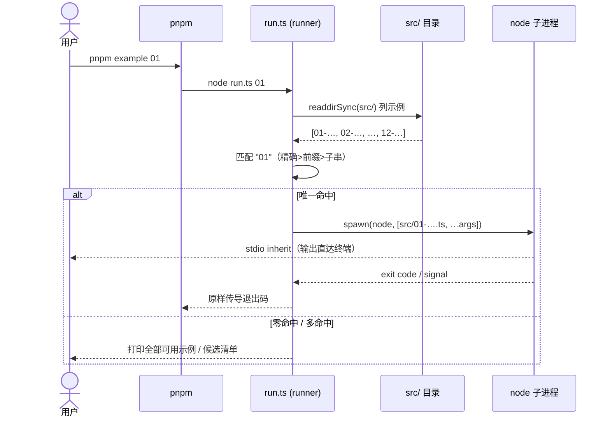

# 示例集 examples（实验田）— 技术方案

> **相关**：产品手册见 [features/examples](../features/examples.md)；施工进展见 [plans/examples](../plans/examples.md)。
> **依赖**：workspace 成员化的解析规则与根管线约定见 [tech/chat-webapp](./chat-webapp.md)（apps 并入根 workspace 的同款理由）；原 13 号迁出的去向见 [plans/single-ledger](../plans/single-ledger.md)。

本文讲 [示例集（examples，实验田）](../terms.md) 的技术组织：workspace 成员化、`src/` 布局、[runner](../terms.md) 机制、typecheck 进 CI、依赖解析、以及 `cloudflare-gateway/` 的边界。产品视角（解决什么、怎么用）见 [features/examples](../features/examples.md)。

## 1. workspace 成员化

`examples/package.json`（`@nimbo/examples`，`private: true`，不发布）用两种协议声明依赖：

- `@nimbo/*`（sdk / just-bash / sandbox-e2b / sandbox-vercel / sandbox-cloudflare）走 **`workspace:*`**——直接解析到仓库内各包，示例 import 的是各包 `exports` 声明的入口（连接到源码，无需先 `pnpm build`）。
- `ai` / `zod` / `e2b` / `@vercel/sandbox` 走 **`catalog:`**——与全仓统一版本（[pnpm-workspace.yaml](../../pnpm-workspace.yaml) 的 `catalog:` 块）同源；`@ai-sdk/deepseek` 是示例专属、直接钉版本。

根 `pnpm install` 自动搭好这套依赖，**取代了旧的手工符号链接脚本 `setup-node-modules.mjs`**（已删）。`examples` 进 `pnpm-workspace.yaml` 的 `packages:` 列表（不带 `/*`——只收 `examples` 根，不递归收 `examples/cloudflare-gateway/`）。

## 2. `src/` 布局

```
examples/
├── run.ts                 # runner（工具，非示例）
├── package.json           # @nimbo/examples，example + typecheck 脚本
├── tsconfig.json          # include 收窄到 src/**/*.ts + run.ts
├── README.md
├── src/
│   ├── 01-memory-diff.ts … 12-vercel-sandbox-real-project.ts
│   └── shared/            # model.ts（resolveModel）+ transcript-store.ts
└── cloudflare-gateway/    # 独立 wrangler 子项目（见 §4）
```

源码全部在 `src/` 下。`src/shared/model.ts` 的 `resolveModel()` 用三层 `..`（`shared/ → src/ → examples/ → 仓库根`）定位根 `.env`，经 Node 内置 `process.loadEnvFile` 加载（零第三方 dotenv）。各脚本 `import "./shared/model.ts"` 等相对路径都在 `src/` 内自洽。

## 3. runner 机制

`examples/run.ts` 是 `pnpm example <编号或名字前缀>` 背后的分发器，纯 Node 内置模块实现：

1. `readdirSync(src/)` 列出 `^\d.*\.ts$` 的顶层脚本名（去后缀），排除 `shared/` 等；
2. 按参数匹配，**先命中者胜**：精确名 > 前缀 > 包含子串；
3. 唯一命中 → `spawn(process.execPath, [scriptPath, ...透传参数], { stdio: 'inherit' })`，子进程退出码/信号原样传导；
4. 零命中 → 打印全部可用示例；多命中 → 列候选让用户写得更具体。

新增示例零维护：往 `src/` 丢一个 `NN-*.ts` 就自动进入可选列表。



## 4. typecheck 进 CI

`examples/package.json` 定义 `typecheck: tsc --noEmit`；`ci.yml` 跑 `pnpm -r typecheck`（workspace 递归），天然扫到 examples——**examples 带质量门、`src/` 保持类型绿是被 CI 强制的**。

注意根脚本 `pnpm typecheck` 是 `--filter ./packages/*`，本地只查核心包、**不含** examples（快路径）；进 CI 的是 `pnpm -r typecheck` 那条全量。`pnpm-workspace.yaml` 的注释与本节一致（此前 `tsconfig.json` 注释写「NOT wired into CI」，与 workspace 注释自相矛盾，已在本次收尾统一）。

`tsconfig.json` 的 `include` 收窄到 `["src/**/*.ts", "run.ts"]`——`node_modules/` 与 `cloudflare-gateway/` 都在这两个 glob 之外，自动不入程序，无需再写 `exclude`。`allowImportingTsExtensions: true` 让 tsc 接受 `./shared/model.ts` 这种带 `.ts` 后缀的 import（因为示例是 `node` 直跑、不重写后缀；noEmit 下合法）。

## 5. 原 13 号（e2e 测试）的去向

`examples/13-uimessage-single-ledger.e2e.test.ts` 曾是 [single-ledger](../../docs/features/single-ledger.md) 的验证实验（见 [plans/single-ledger §2](../plans/single-ledger.md)），是示例集里**唯一**一个真正的 e2e 测试而非演示。本次梳理把它移出示例集：

- **离线结构断言段**改写成 3 个常规 vitest 用例，迁至 `apps/server/test/agent/uimessage-single-ledger.test.ts`（转换器丢弃 data 部件 / assistant-tool 分组 / transient 纪律），随 server 测试进 CI。
- **真机 DeepSeek 验证段**（一次性人工实验、CI 永久 skip 无回归价值，且会给 server 引入首个真机网络测试、污染其全离线测试哲学）不迁移，完整版留在 git 历史。
- `packages/core/src/loop.ts` 对 13 旧路径的注释引用已更新指向新位置、并注明真机段见 git 历史。

single-ledger 的语义实现已落在 `@nimbo/core` 的生产代码，真机复现价值低；这条判断的取舍记录见 `.lantie_history`。

## 6. cloudflare-gateway 的边界

`examples/cloudflare-gateway/` 是 11 号真机段需要的一个**独立可部署 wrangler 项目**：有自己的 `package.json`/`tsconfig.json`/`node_modules`，依赖 `@cloudflare/sandbox`（只能在 workerd 里加载，本示例包故意从不安装）。它不进 workspace 递归（`examples` 不带 `/*`）、不进 examples 的 tsconfig，按其自身 README `npm install && npm run typecheck` 单独处理。

## 已知限制

- 示例的 import 源在 npm 裸名 `nimbo` 发布决策定案后可能整体替换（[plans/core-sdk](../plans/core-sdk.md) P7-1 遗留）。
- 模型驱动段与云沙盒真机段依赖外部凭证与网络，非确定性；确定性段是无凭证下的可复现底座。
