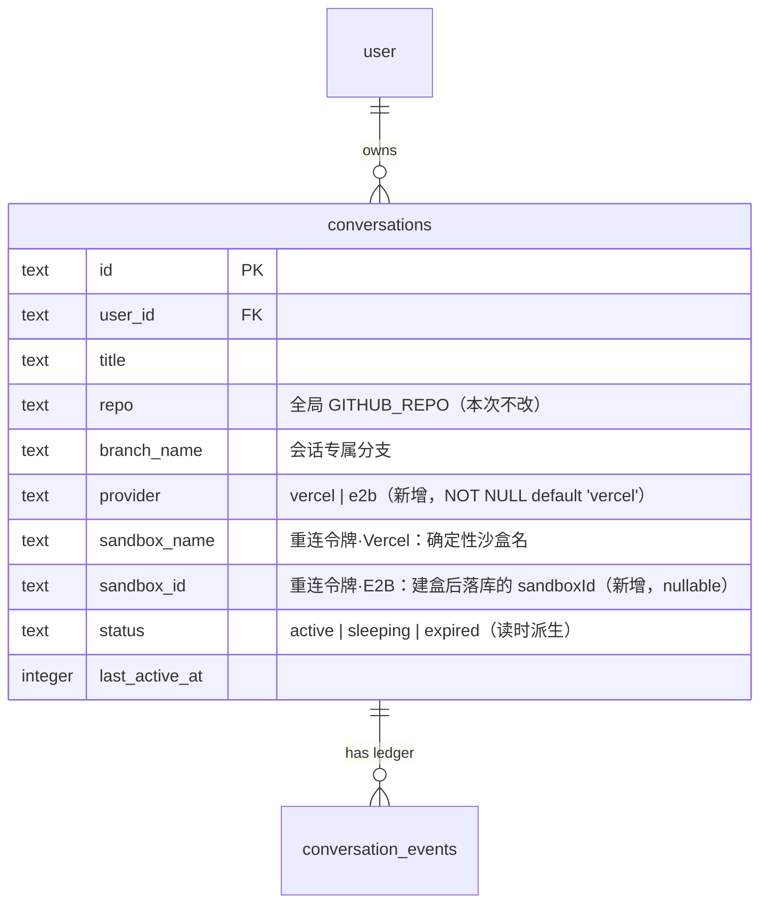
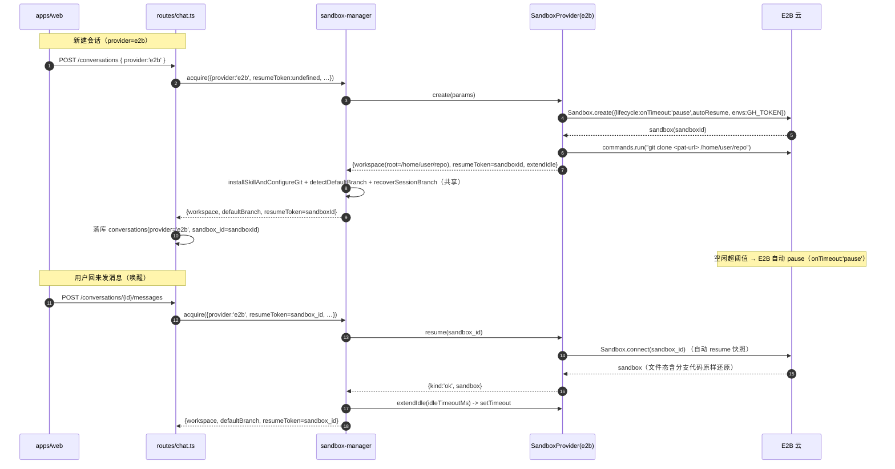

# 沙盒 provider 可选（技术方案）

> 相关：[产品视角](../features/sandbox-provider.md) · [施工进展](../plans/sandbox-provider.md)
> 依赖：[chat-webapp 技术方案](./chat-webapp.md)（§2.2 `sandbox-manager.ts`、§4 服务端模块）· [sandbox 技术方案](./sandbox.md)（§8 沙盒适配器契约）
> 术语：[沙盒 provider](../terms.md) · [重连令牌](../terms.md) · [沙盒适配器](../terms.md) · [工作区](../terms.md) · [NimboFS / NimboExec](../terms.md) · [休眠 / 唤醒](../terms.md)

## 1. 核心判断：差异全在 server，不在适配器包

[沙盒适配器](../terms.md)（`@nimbo/sandbox-vercel` / `@nimbo/sandbox-e2b`）按设计**只做 [NimboFS/NimboExec](../terms.md) 视图层**、刻意不管生命周期（[BYO 实例](../terms.md)）——创建、拉码、重连、超时、休眠全归宿主。所以「支持两家沙盒」要改的**只有一个文件**：`apps/server/src/agent/sandbox-manager.ts`（现状 100% 绑 Vercel）。routes/chat-agent 继续只见 `SandboxManager` 接口，零改动。

E2B 与 Vercel 的结构性差异（决定抽象缝在哪）：

| 维度 | Vercel Sandbox（现状） | E2B |
|---|---|---|
| **建盒时拉 git 代码** | ✅ `Sandbox.create({ source:{type:'git',url,username,password,depth} })` 一步 clone 到根 | ❌ 运行时无 git source（`template.gitClone()` 只是构建模板镜像时的能力）。**建盒后**跑 `git clone` |
| **[重连令牌](../terms.md)** | 用户自选 `name`，由 conversationId 确定性派生，**无需落库** | 服务端分配 `sandboxId`，**建盒后**才知道，**必须落 `conversations.sandbox_id`** |
| **重连/恢复** | `Sandbox.get({name})` 从平台快照恢复 | `Sandbox.connect(sandboxId)`（静态、跨进程、paused 自动 resume） |
| **休眠机制** | `persistent:true` → 空闲超时 Vercel 自动快照 | `lifecycle:{onTimeout:'pause',autoResume:true}` → 空闲超时 E2B 自动 pause（full memory snapshot 才能被流量自动 resume，默认即是） |
| **保活** | `extendTimeout(ms)` | `setTimeout(ms)`（从现在起重新计时——对「每条消息滚动续期」语义正好合适） |
| **恢复失败判定** | `APIError` status 404/410 | `connect()` 抛错（沙盒不存在/已删） |
| **工作区根** | `/vercel/sandbox`（= 仓库根） | `/home/user`（默认）→ 本方案设为 `/home/user/repo`（= clone 目标 = 仓库根） |

**关键对齐点**：两个适配器的 `exec` 都把 `cwd` 相对**配置的 root** 解析（E2B `anchor.toReal('/')`、Vercel `resolveCwd(root,'/')` 都 → root）。因此只要把 **E2B 的 workspace root 设成 clone 目标目录**，`sandbox-manager` 里那批 `cwd:'/'` 的共享 init/分支命令（装 skill、`git config`、`git remote set-url`、`git fetch/checkout`、`git symbolic-ref`）在两家都落在仓库根、**一字不用改**。

## 2. 业务数据领域设计

会话表加两列：`provider`（选了哪家）与 `sandbox_id`（E2B 的[重连令牌](../terms.md)，Vercel 恒 null）。其余不变。



- `sandbox_name` 保留原语义（Vercel 的 name / 也作 E2B 的 metadata 便于排障）；E2B 的真正重连令牌是 `sandbox_id`。
- 迁移：`ALTER TABLE ... ADD COLUMN provider TEXT NOT NULL DEFAULT 'vercel'` + `ADD COLUMN sandbox_id TEXT`（存量会话回填 `vercel`/null，行为不变）。

## 3. 抽象重塑：`SandboxClient` → `SandboxProvider`

现状 `SandboxClient`（`create(params)`/`get(name)`）方向对但语义绑 Vercel。泛化为 `SandboxProvider`，把两家差异全收进去，让 `acquire` 状态机对 provider 无感：

```ts
export type SandboxProviderId = 'vercel' | 'e2b';

/** 一个已就绪、仓库已 clone 在 workspace 根的沙盒句柄。 */
export interface ProvisionedSandbox {
  workspace: NimboFS & NimboExec;          // 已锚定到仓库根（Vercel /vercel/sandbox、E2B /home/user/repo）
  /** 供下次唤醒指名恢复、需持久化的令牌：Vercel = name（=入参，无变化）；E2B = 新分配的 sandboxId。 */
  resumeToken: string;
  /** 保活：Vercel extendTimeout / E2B setTimeout —— 把「续期」这一步的差异藏进句柄。 */
  extendIdle(idleTimeoutMs: number): Promise<void>;
}

export interface CreateSandboxParams {
  name: string;          // Vercel 沙盒名；E2B 作 metadata
  cloneUrl: string;      // https://github.com/owner/repo.git
  githubPat: string;
  timeoutMs: number;
}

export interface SandboxProvider {
  readonly id: SandboxProviderId;
  /** 创建 + 把仓库 clone 到 workspace 根（Vercel 靠 git source；E2B 靠建盒后 git clone）。 */
  create(params: CreateSandboxParams): Promise<ProvisionedSandbox>;
  /** 用 resumeToken 恢复；`unavailable` → 调用方重建。 */
  resume(
    resumeToken: string,
    timeoutMs: number,
  ): Promise<{ kind: 'ok'; sandbox: ProvisionedSandbox } | { kind: 'unavailable' }>;
}
```

两个实现：

- **`createVercelProvider()`**：`create` = 现状 `Sandbox.create({ source: git, persistent, runtime, env, timeout })` + `vercelWorkspace(sb)`，`resumeToken = params.name`，`extendIdle = extendTimeout`。`resume(name)` = `Sandbox.get({name})`，404/410 → `unavailable`。**逻辑与今天逐字等价，只是换了个壳**。
- **`createE2bProvider()`**：`create` = `Sandbox.create({ apiKey, timeoutMs, lifecycle:{onTimeout:'pause',autoResume:true}, envs:{GH_TOKEN:pat}, metadata:{name} })` → 用绝对路径命令 `git clone https://x-access-token:<pat>@github.com/owner/repo.git /home/user/repo` → `e2bWorkspace(sb, { root: '/home/user/repo' })`，`resumeToken = sb.sandboxId`，`extendIdle = setTimeout`。`resume(id)` = `Sandbox.connect(id)`（自动 resume）包 `e2bWorkspace(root)`；抛错 → `unavailable`。

provider 由 `SANDBOX_PROVIDER` 默认 + 会话 `provider` 列选择：`sandbox-manager` 持有 `Record<SandboxProviderId, SandboxProvider>`，按会话 provider 取实现。

### 3.1 `acquire` 的两处必要改动

`AcquireInput` / `AcquiredSandbox` 各加一字段，把 E2B 的「令牌建盒后才知道、要落库」这件事表达出来：

```ts
interface AcquireInput {
  /* …原字段… */
  provider: SandboxProviderId;      // 新增：本会话选的 provider
  resumeToken?: string;             // 新增：已落库的令牌（Vercel=sandboxName、E2B=sandbox_id；全新会话 undefined）
}
interface AcquiredSandbox {
  workspace: NimboFS & NimboExec;
  defaultBranch: string;
  resumeToken: string;              // 新增：当前令牌 —— 路由据此决定是否回写 conversations.sandbox_id
}
```

`acquire` 三态与今天同构，只是把 Vercel 直调换成 `provider.resume/create`，并在 create 后回传 `resumeToken`：

1. 内存命中 → 复用（零网络）。
2. `provider.resume(resumeToken)` ok → `detectDefaultBranch` + 缓存 + 返回。
3. `resume` unavailable（或 `resumeToken` 为空的全新会话）→ `provider.create()` → **共享** `installSkillAndConfigureGit` + `detectDefaultBranch` + `recoverSessionBranch` → 缓存 → 返回新 `resumeToken`。

路由侧（`routes/chat.ts`）：建会话与每条消息 `acquire` 后，若 `acquired.resumeToken` 与库里 `sandbox_id` 不同（仅 E2B 首建时发生），落库。Vercel 的 `resumeToken == sandboxName`、库里已有，no-op。

## 4. 核心流程时序（E2B acquire 三态 + 休眠）



Vercel 路径同构，把 `create/resume/extendIdle` 换成 `Sandbox.create(source:git)`/`Sandbox.get({name})`/`extendTimeout`，且第 12 步落库为 no-op（令牌即 sandboxName）。

## 5. 关键取舍与已知限制

- **休眠对齐靠 `onTimeout:'pause'+autoResume`，非热路径显式 `pause()`**：E2B 空闲超时自动 pause（等价 Vercel 自动快照），`connect` 自动 resume。`autoResume:true` 要求 **full memory snapshot**（E2B 默认），才能被「下一条消息的流量」自动唤醒——与 Vercel「下条消息 acquire 唤醒」体验一致。**已真机验证**（用户 `E2B_API_KEY`）：`pause()` ~0.6s、`Sandbox.connect(sandboxId)` 跨进程静态重连自动 resume 且**写入文件 + 建盒后 clone 的 git 仓库 HEAD 均完整保留**、`state=running`；建盒后 `git clone` 小仓库 ~4.5s。
- **`resume()` 对刚 auto-pause 的瞬时 404 做有限重试**（SP-6 真机暴露）：沙盒刚 `onTimeout:'pause'`、快照落定前的短窗口里，`connect` 会瞬时抛 `SandboxNotFoundError`（"Sandbox `<id>` not found"），但**盒其实还在、秒级后就能重连**。`resume` 因此对 `connect` 退避重试（`E2B_RESUME_ATTEMPTS=4`、退避 `500ms×attempt`，总窗 ~3s）：瞬时 404 重试即重连回原盒（**保住未 push 的 WIP**），只有**持续** not-found 才判 `unavailable`→重建（`isE2bSandboxGone` 按 `SandboxNotFoundError`/`NotFoundError` 名 + `/sandbox.*not found/i` message 兜底识别；"Invalid sandbox ID"(400) 不算 gone、照抛以暴露真 bug）。**已真机验证**（provider 层）：create→clone→45s 空闲 auto-pause→`resume` 返回 `ok`、重连原盒、marker 文件保留。
- **E2B 令牌落库时机**：`sandboxId` 建盒后才有，故 `acquire` 必须能把它回传给路由落库（`AcquiredSandbox.resumeToken`）。若首建落库前进程崩溃，该 E2B 沙盒成孤儿（靠 `onTimeout:'kill'`? 否——它是 pause，会占额度）——首建流程要保证「create 成功 → 立即落库」尽量原子（路由内 create 与 insert 同一 try）；孤儿由 `Sandbox.list` + metadata.conversationId 兜底清理（运维脚本，非本次范围）。
- **`setTimeout` 语义**：E2B `setTimeout(ms)` 是「从现在起剩余 ms」，正是「每条消息把空闲窗口滚到满」的意图；与 Vercel `extendTimeout` 的差异被 `extendIdle` 抽象吸收，`sandbox-manager` 的 `touch` 无感。
- **`E2B_API_KEY` 成为 chat 应用条件依赖**：仅当有会话选 E2B 时需要；provider 工厂惰性读 env（同 `model.ts`/`github-repo.ts` 的「不在 import 时读 env」纪律），未配又选 E2B → `create` 抛带指引的配置错误，路由转 500。
- **测试可 fake**：`SandboxProvider` 是纯结构接口，E2B/Vercel 两实现各自的契约测试用进程内 fake（沿用适配器包已有的 `FakeE2bSandbox`/fake `VercelSandboxLike`），`sandbox-manager` 的 acquire 三态测试注入 fake provider，零网络/凭证。

## 6. env / 配置

仓库根 `.env`（`.env.template` 同步）：

- `SANDBOX_PROVIDER`（新增，可选，默认 `vercel`）：新建会话不带 `provider` 时的服务端默认。
- `E2B_API_KEY`：注释从「仅 examples/09」改为「examples/09 + chat 应用选 E2B 的会话」。
- `VERCEL_*` / `GITHUB_*`：不变。
