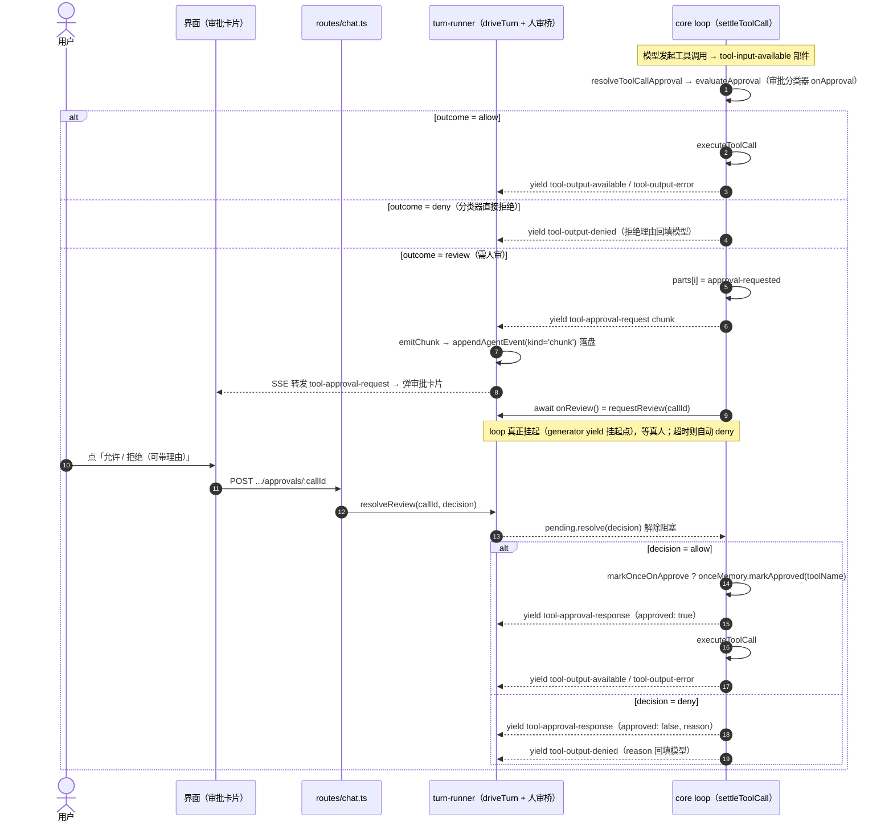
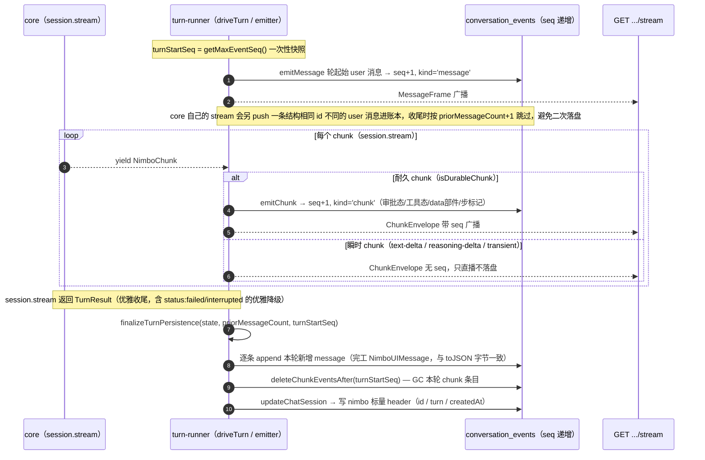

# 单一数据账本（single-ledger）— 技术方案

> **相关**：产品手册见 [features/single-ledger](../features/single-ledger.md)；施工进展见 [plans/single-ledger](../plans/single-ledger.md)。
> **依赖**：本方案改造 [chat-webapp](./chat-webapp.md) 的持久化层。下游的 [上下文压缩（compaction）](./compaction.md) 在本账本上再加第三种条目。

## 0. 命题

nimbo 的 [loop](../terms.md) 改用「[UIMessage](../terms.md) 数组」作为工作格式与唯一存档，每次调模型前用[官方转换器（`convertToModelMessages`）](../terms.md)现场推导 [ModelMessage](../terms.md)——从此全系统只有一种落盘数据，模型视图永远是推导的、从不单独存储。「当时喂给模型的」与「恢复后推导出的」出自同一段官方转换代码，一致性是**结构保证**而非写入纪律。

## 1. 方案总览

- **工作态 = 存档**：loop 的工作状态是 `NimboUIMessage[]`（不再是 `ModelMessage[]`）；[`SessionState`](../terms.md) 的 `messages` 也是 `NimboUIMessage[]`。每步调模型前 `convertToModelMessages(messages)` 现场推导请求消息（`packages/core/src/loop.ts` 的 `runOneStep`）。
- **单一落盘**：一个 [会话（session）](../terms.md) 只有一张按 [seq（序号）](../terms.md) 递增的 [账本（ledger）](../terms.md)（`conversation_events` 表），既供界面[回放（replay）](../terms.md)、又供[模型上下文](../terms.md)恢复。旧的 `nimbo_state_json` 字段删除。
- **过程数据用 data 部件**：nimbo 特有的过程数据（文件变更、计划更新、轮内错误、工具进度）用 [data 部件（data part）](../terms.md) 表达，官方转换器转 ModelMessage 时自动丢弃，模型永远看不见。
- **实时传输 = 官方 UI 消息流协议**：`session.stream()` 吐 AI SDK 的 [chunk（`UIMessageChunk` 词汇表）](../terms.md)（`NimboChunk`），任意 AI SDK 兼容客户端可直接消费。
- **`SessionEvent`/`SessionItem` 退役**：宿主改为消费 UIMessage 部件流。

## 2. 关键数据结构

以下类型集中定义在 `packages/core/src/state.ts`（`loop.ts`/`session.ts` 都从这里导入）。

### 2.1 core 侧类型

- `NimboUIMessage = UIMessage<NimboMessageMetadata, NimboDataParts>`——TOOLS 类型参数刻意留默认 `UITools`（nimbo 工具集编译期完全动态，没有字面量工具名联合可精确刻画；工具部件的 `input`/`output` 因此落在 `unknown`，这是既有约束，非本方案新引入）。
- `NimboChunk = InferUIMessageChunk<NimboUIMessage>`——`session.stream()` 的产出类型。
- `NimboMessageMetadata`——[元数据（metadata）](../terms.md)，不参与官方转换（模型永远看不到）：`{ turn?, usage?, status?: 'completed'|'failed'|'interrupted', durationMs?, toolDurationMs?, error?, steered? }`。`status` 三态由 `NimboError.code` 四态折叠而来（`aborted` → `interrupted`，其余三个 → `failed`，见 `loop.ts` 的 `statusForError()`）；`durationMs` 是全 turn 墙钟耗时（`runTurn` 入口到收尾，成功/失败/中断皆有，`finalizeTurn` 统一写入；web 的轮结果条领头展示，2026-07-16 增补）；`toolDurationMs` 是本轮工具执行墙钟（全部 `data-tool-timing` 的 `[executionStartedAt, completedAt]` **区间并集**——并行批重叠只计一次，恒 ≤ `durationMs`；`durationMs - toolDurationMs` 即 agent/模型自身时间，web 轮结果条按「耗时 · 工具 · agent」拆分展示，同日增补）。
- `NimboDataParts`——五个 data 部件：`file-change`、`plan-update`、`error`、`tool-progress`、`tool-timing`；其中 `tool-progress` 是 [transient](../terms.md)（写入期分流，绝不进 `UIMessage.parts`），`tool-timing` 与之相反是**持久**部件（工具调用起止时间戳，随消息存档、随会话回放，见 §3.2）。
- `SessionState = { id, turn, messages: NimboUIMessage[], createdAt, fsSnapshot? }`——恢复用可序列化快照。
- 恢复校验分两层：`sessionStateSchema`（zod，浅层结构判别）+ `validateSessionMessages()`（ai 的 `validateUIMessages()`，深层语义校验 part/metadata/data 部件形状）。

### 2.2 落盘 schema（`apps/node-server/src/db/schema.ts`）

`conversations`（2026-07-17 由 `chat_sessions` 更名，解开 "session" 三重超载；同批 `agent_events` → `conversation_events`、`nimbo_*` 列 → `agent_session_*`——库表命名不带产品名）：一行一个对话，1:1 绑定沙盒（`sandboxName`）与专用 git 分支（`branchName`）。SDK 的 `SessionState` 不整块存 JSON——它的 `messages` 落到 `conversation_events` 的 `message` 条目，它的三个标量（`id`/`createdAt`/`turn`）落到三个 `agent_session_*` 列，是一个小小的**「agent 会话 header」**，不是整份账本。三个 `agent_session_*` 值在本对话第一轮真正完成前都是 `null`。

`conversation_events`：单账本，两类条目（`kind`）共享一套 per-session 单调递增的 `seq` 空间（进程重启后从 `MAX(seq)` 续，不是全局自增）：

- `kind = 'message'`：一条**完工的** `NimboUIMessage`，`payloadJson` 逐字节等同 `Session.toJSON().messages` 会产出的形状——**会话恢复只读它**（`store.ts` 的 `loadResumeState`），也是**永久历史供回放**（永不删、永不改）。
- `kind = 'chunk'`：进行中那一轮的一个**耐久块** `NimboChunk`（工具态含 `approval-requested`/`approval-responded`、data 部件、步标记、消息 start/finish/metadata；**不含** text-delta/reasoning-delta/transient data 部件——那些只活在 SSE 线上）。它存在的唯一目的是**让刷新页面能重建挂起中的审批/提问**；本轮优雅收尾时被整批删除（被本轮的 `message` 条目取代，`deleteChunkEventsAfter`）。收尾后仍残留的 `chunk` 条目只可能是本轮中途崩溃、没走优雅收尾——属**可接受残留**，不再清理。概念定位（为什么它是「生成过程中的临时记录」、与 `message` 条目如何[折叠](../terms.md)）见 §2.4。

### 2.3 领域图

> `message` / `chunk` 不是两张表，而是同一张 `conversation_events` 表按 `kind` 判别的两类条目（共用同一套 `seq` 空间）；下图把它们画成两个子实体只为标清各自的用途与生命周期。`conversations` 的三个 `agent_session_*` 列合起来是 `SessionState` 的标量 header，供模型恢复。

```mermaid
erDiagram
    conversations ||--o{ conversation_events : "单账本 PK(conversation_id, seq)，seq 对话内递增"
    conversation_events ||..|| message_row : "kind = 'message'"
    conversation_events ||..|| chunk_row : "kind = 'chunk'"

    conversations {
        text id PK "chat 会话 id，非 nimbo SessionState.id"
        text user_id FK "所属用户"
        text branch_name "专用 git 分支"
        text sandbox_name "1:1 绑定的 Vercel 沙盒"
        text status "active / sleeping / expired"
        integer last_active_at "活跃时间"
        text agent_session_id "SessionState.id — 标量 header，供模型恢复"
        integer agent_session_turn "SessionState.turn — 标量 header，供模型恢复"
        integer agent_session_created_at "SessionState.createdAt — 标量 header，供模型恢复"
        integer created_at "创建时间"
    }
    conversation_events {
        text conversation_id PK "外键，指向 conversations"
        integer seq PK "对话内单调递增，断线重连 after 续传"
        integer ts "写入时间"
        text kind "message 或 chunk，两类条目判别"
        text payload_json "落盘载荷，两类见下（旧 type 冗余列已删，临时查询用 json_extract）"
    }
    message_row {
        json payload "完工的 NimboUIMessage 整条"
        string purpose "供模型恢复 loadResumeState + 界面回放"
        string lifecycle "永不删改，永久历史"
    }
    chunk_row {
        json payload "耐久 NimboChunk 审批态 工具输入输出 data部件 步标记"
        string purpose "仅供界面回放，刷新页面重建挂起的审批与提问"
        string lifecycle "本轮优雅收尾即 GC，崩溃残留可接受"
    }
```



### 2.4 chunk 条目与 message 条目的关系：生成过程的临时记录

> 一句话：chunk 不是与 message 并列的第二种「内容」，而是 message 的**传输形态**；`kind = 'chunk'` 条目是消息生成过程中的临时记录，收尾时被它一直在描述的 `message` 条目取代。两类条目在表里平级，只是时间差造成的存储姿势，不是语义姿势。

**语义层：chunk 流就是 message 在线上流动的样子。** [chunk（流块）](../terms.md) 词汇表自带消息边界——`start`（携带 `messageId`，宣告一条新消息开始生成）与 `finish`（这条消息完工）；夹在一对 `start`/`finish` 之间的内容 chunk（`text-*`、`tool-*`、`data-*`、步标记）全部是**这条正在生成的消息内部[部件](../terms.md)的增量**。core 的 loop 每 yield 一个 `start`，就同步在账本工作态里新建一条 assistant `NimboUIMessage`（`loop.ts` 的 `runOneStep`），后续每个内容 chunk 对应这条消息 `parts` 的一次追加/更新——chunk 流与成品消息是**同一份数据的两种形态**：前者是操作流，后者是[折叠](../terms.md)结果。[steer](../terms.md) 插话的 user 消息同样以一小段 `start → text-* → finish` 序列进入直播流（`loop.ts` 的 `drainSteerMessages`；消息在注入时已是完整形态，发 chunk 序列只为让实时消费方跟着落地）。

一个 step 的 chunk 流分帧示意（工具结算 chunk 落在 `finish-step` 之后、`finish` 之前，仍属同一条消息）：

```text
start(A) · start-step · text-* / tool-input-available … · finish-step · 审批/工具结算 chunk · finish
└──────────── 全部属于消息 A；折叠结果 = 账本里这个 step 的那条 assistant message 条目 ────────────┘
```

**存储层：平级只是时间差。** turn 进行中，本轮的 assistant 消息只有一串已吐出的增量、成品尚不存在——`kind = 'chunk'` 条目就是给这个半成品记的耐久日志（只收 persistent 档，见 §2.2），唯一目的是刷新页面能重建挂起的审批/提问卡片。本轮优雅收尾时 `finalizeTurnPersistence` 先把折叠好的成品逐条写成 `message` 条目、再整批 GC 本轮的 `chunk` 条目（顺序不可换，时序见 §6）。因此**稳态账本里只有 `message` 条目**；能见到 `chunk` 条目只有两种时刻：本轮进行中（正常），或崩溃残留（可接受，见 §7）。

**一个 turn 折叠后在账本里的最终形态**（全部为 `message` 条目）：

- 1 条轮起始 user 消息（turn-runner 合成，轮开始即落盘，见 §6）；
- n 条 steer 插话 user 消息（`metadata.steered: true`）；
- **每个 [step（步）](../terms.md)一条 assistant 消息**——`runTurn` 的 step 循环每次 `runOneStep` 都新建一条（各自以一个 `step-start` 部件领头），多步工具循环一轮产出多条；轮级[元数据](../terms.md)（usage/status/durationMs 等，§2.1）落在其中最后一条上。AI SDK `useChat` 的默认习惯是一条 assistant 消息内装多个 step（以 `step-start` 部件分段）；nimbo 选每 step 独立成条——两种形态对官方转换器等价（都按 `step-start` 切分，P13-5a 验证项 3 已真机验证）。

## 3. 部件清单：loop 的全部表达

> **命名约定**：全部部件类型统一 kebab-case。工具部件类型是 `tool-<工具名>`，工具名本身也随之 kebab-case：`ask-user`、`read-file`、`write-file`、`edit-file`、`delete-file`、`move-file`、`list-dir`、`update-plan`、`load-skill`（`bash`/`glob`/`grep` 无分隔符不受影响）。杜绝下划线与连字符混用。

### 3.1 标准部件直接覆盖（不需要 data 部件）

| 今天的概念 | UIMessage 形态 | 说明 |
|---|---|---|
| agent 正文 | `text` 部件 | 流式增量走直播，落盘只存终稿 |
| 推理 | `reasoning` 部件 | 往返保真是验证项之一 |
| 全部工具调用 | `tool-<名字>` 部件 | 状态机 input-streaming → input-available → output-available / output-error |
| 工具被拒 | `output-denied` 状态（ai 原生审批状态机） | 见 §5 审批三值 |
| ask-user 提问/回答 | 标准 `tool-ask-user` 部件 | `callId` 就在部件里；pending = input-available、已答 = output-available |
| 步边界 | `step-start` 部件 | 官方内建，转换器据此切分 assistant/tool 消息 |
| 用户发言（含 steer 插话） | role=user 的 UIMessage | steer 用消息 metadata 标 `steered: true` |
| 轮收尾（usage/finishReason/status） | assistant 消息的 metadata | metadata 不参与模型转换，天然只给界面 |

### 3.2 需要自定义 data 部件的（过程数据，转换器自动过滤）

| data 部件 | 载荷（示意） | 落盘？ | 同 id 更新 |
|---|---|---|---|
| `data-file-change` | `{ changes: [{ path, kind: 'add'\|'update'\|'delete' }] }` | 是 | 否（每次工具执行各一条） |
| `data-plan-update` | `{ items: [{ text, completed }] }` | 是 | 是（同 id 覆盖 = 计划面板始终最新） |
| `data-error` | `{ message }` | 是 | 否（轮内非致命错误；当前无实际生产者） |
| `data-tool-progress` | `{ toolCallId, text（累积） }` | **否（transient）** | 是 |
| `data-tool-timing` | `{ toolCallId, startedAt, executionStartedAt?, completedAt? }`（epoch ms） | 是 | 是（同 `toolCallId` 覆盖；每次工具调用各一条 id，不是单例） |

> **`data-tool-timing` 语义定案**（chat 可观测性，2026-07-16；同日按用户反馈修订加入 `executionStartedAt`）：每个工具调用一条独立 id（`id = toolCallId`），物化方式照 `data-plan-update` 先例（同 id 覆盖），差别只是 id 不唯一。三个时刻对应调用的三段生命周期——loop 对同一步的多个调用默认**串行**结算，仅当整批全部 `Tool.readOnly`（纯读工具，见 [tech/core-sdk](./core-sdk.md) §4.1 与 [tech/builtin-tools](./builtin-tools.md)）时并行（`runOneStep` 的 settle 分支）；串行批的排队真实存在，并行批的 `executionStartedAt` 几乎同刻：
>
> - `startedAt`：`tool-input-available` chunk 产出后立刻打点——调用成形、进入排队/审批管线；同一步的多个调用几乎同刻拿到这个戳。
> - `executionStartedAt`：`executeToolCall` 前一刻打点——排队与审批等待都已结束、真正开始执行。**缺席 = 从未执行**：还在排队/等审批（结合部件状态判定），或 deny 路径/中途崩溃永远轮不到。
> - `completedAt`：每个结算 chunk（`tool-output-available`/`tool-output-error`/`tool-output-denied`，**含审批 deny 分支**）之后立刻补上。
>
> **界面展示的「启动时间/耗时」以 `executionStartedAt` 为准（耗时 = `completedAt - executionStartedAt`，纯执行时长，不含排队与审批等待）**——最初定案取「含审批等待的全程时长」，当日按用户反馈改为真实执行口径；排队/审批各等了多久由 `startedAt` 与 server 日志的 `queueMs` 承担（见 [tech/chat-webapp](./chat-webapp.md) §11）。web 卡片对 `executionStartedAt` 缺席的未结算调用显示「等待中」（徽标降级 + 已等待跳动）；对 deny 结算显示「未执行」；对本字段引入前的存量记录退回全程口径。若一轮中途崩溃、未走到结算，`completedAt` 缺席是可接受的残留态（同 §7 崩溃残留取舍），界面据此显示等待/进行中而非报错。
>
> **`data-approval` 未建**：早期设计里审批过程曾计划用 `data-approval` 部件承载，最终采用 ai 原生审批状态机取代（见 §5 与实验发现 B），该条目作废。清点结果：**五个 data 部件（一个 transient）**，其余全部由标准部件与消息 metadata 覆盖。

## 4. 存储与传输

- **落盘** = 「UIMessage 及其部件」的按 seq 追加式条目（`conversation_events`）。
- **实时推送** = 官方 UI 消息流协议（文本增量、部件更新、transient 部件）。
- **断线重连** = 从 seq 续传落盘条目（`after=<seq>`）+ 接上直播。
- **恢复模型记忆** = 读 `NimboUIMessage[]` → 官方转换器。没有第二条路径。
- [transient / persistent 分层](../terms.md)：文本/推理增量与 transient 部件只直播、不落盘；其余耐久块落盘可回放。

## 5. 审批三值重构（P13-5-2c 定案）

### 5.1 为什么重构

P13-5 立项时初定「用 ai 原生审批状态机（事后编码）」，随后被推翻：**事后补记只对模型恢复正确，对直播交互失效**。根因是旧 `ApprovalPolicy` 把「要不要人审」的判断藏在工具执行的原子调用里，等决定做完才补记 `tool-approval-request`——挂起等人审期间直播流里根本没有待审批信号，客户端无法据此弹卡片，人在环上功能实质失效。

**定案：审批判定三值化，且在阻塞之前显式产出。**

### 5.2 三值结果与策略

一次工具调用的[审批结果（三值）](../terms.md)三选一：

| 结果值 | 含义 | core 行为 |
|---|---|---|
| `allow` | 允许所有 | 直接执行，不发审批 chunk |
| `review` | 人工审批 | **先发 `tool-approval-request` chunk（界面弹卡片）→ 停 loop 阻塞等真人 → 收到裁决后发 `tool-approval-response`（允许/拒绝都发）→ 执行或 output-denied** |
| `deny` | 不允许 | 直接拒绝，`output-denied`（拒绝理由回填模型）——**不经**审批请求/响应 chunk |

**策略 vs 结果**分层（`packages/core/src/types.ts`）：

```ts
type ApprovalOutcome = 'allow' | 'review' | 'deny';   // 单次调用的解析结果
type ApprovalPolicy =
  | 'allow' | 'review' | 'review-once' | 'deny'        // 固定策略
  | ((input: JsonValue, ctx: ApprovalContext) => ApprovalOutcome | Promise<ApprovalOutcome>); // 分类器回调
```

- `review`：每次调用都问。`review-once`：第一次问、批准后本会话记住（[会话级授权（session grant）](../terms.md)）、之后 `allow`。
- 旧 `never`/`always`/`once` 字符串废弃（never→`allow`、always→`review`、once→`review-once`）。
- 两层组合语义：per-tool → session [审批分类器](../terms.md)；**per-tool 未配置 → 直接 `allow`，不咨询 session**；once 记忆按 `toolName` 键入、跨级共享；无仲裁者（`onReview` 未注入）即按 `deny` + 指导文案处理，不产出请求 chunk。

### 5.3 人工裁决 = 纯两值（砍掉「改参数」）

分类器返回 `review` 后弹给真人的卡片，真人只答两值：

```ts
type HumanDecision =
  | { behavior: 'allow' }
  | { behavior: 'deny'; message?: string };   // message = 拒绝理由，回填模型
```

`updatedInput`（允许时改模型填的参数）**彻底删除**——chat 卡片从来只有允许/拒绝两个按钮，「让它换个做法」用「拒绝 + 理由」或 steer 更直白；`runtime.ts` 的 `effectiveInput = decision.updatedInput ?? input` 简化为直接用 `input`。

### 5.4 审批三值链路（时序）

审批解析（`runtime.ts` 的 `resolveToolCallApproval` → `approval.ts` 的 `evaluateApproval`）与工具执行（`executeToolCall`）拆成两步；loop（`loop.ts` 的 `settleToolCall`，一个 `async function*`）在两者之间插入「先 yield 审批请求 chunk、再 await 人工裁决」。`yield` 是真实挂起点：消费方在这一刻就能看到请求 chunk，不必等 `await` resolve。



> 人审桥（`turn-runner.ts` 的 `requestReview`/`resolveReview`）是**纯内存 promise 路由，不发任何 emit**：待审批的可见性由 core 自己的 `tool-approval-request` chunk 提供，裁决结果的可见性由 `tool-approval-response` chunk 提供，二者都随 `session.stream()` 走。`ask-user` 同理——挂起/已答就是 `tool-ask-user` 部件的 `input-available`/`output-available` 状态。

## 6. turn 收尾写入时序

一轮的持久化分两段：进行中逐个 chunk 落耐久块（`createTurnEmitter` 的 `emitChunk`）；优雅收尾时把本轮新增的完工消息落 `message` 条目、并 GC 掉本轮的 `chunk` 条目（`finalizeTurnPersistence`）——即 §2.4 说的「临时记录被成品取代」。**顺序不可换**：先落 message 再 GC chunk——崩在两步之间只多留些没 GC 的 chunk（无害），反过来则可能整轮内容丢失。



> **崩溃路径**：若 `session.stream()` 的 generator 自己抛错（真正意外，非优雅降级），`driveTurn` 的 `catch` 只补发一个合成的 `message-metadata`（`status: 'failed'`）chunk，`finalizeTurnPersistence` **不执行**——本轮 `chunk` 条目因此不被 GC，是与「进程中途重启」同款的可接受残留。进程重启中途掉 `activeTurns`（纯内存）也是同款残留：下次 `GET .../stream` 找不到活跃轮，就回放到崩溃点为止。

## 7. 取舍与已知限制

- **同一 toolCallId 只记结算态**（实现教训）：工具调用的占位态与结算态不能都 push 进 assistant 消息——同一 `tool_call_id` 出现两次会被 DeepSeek 400 拒绝（`Duplicate value for 'tool_call_id'`）。账本里工具部件只记最终结算态（原地覆盖占位部件，见 `PendingToolCall.partIndex`），进行中状态走直播。
- **transient 写入期分流**（实验发现 A）：ai@7 里 transient 是**线协议块（`UIMessageChunk`）上的属性**，官方流处理器在写入消息那一刻直接跳过——落盘的 `UIMessage.parts` 类型根本没有 transient 字段可供事后过滤。因此进度只走直播回调、不 push 进 parts，不能「先写数组再过滤」。
- **进度非严格实时交错**：`ctx.update()` 是同步回调，生成器不能从回调内部 yield，因此 `settleExecution` 先缓冲进度、`executeToolCall` resolve 后按到达顺序重放——效果是「进度确实以 chunk 到达」，但不与执行过程严格实时交错（沿用 P13-1 的既有取舍）。
- **跨轮 reasoning 不回传**（实验发现 A/推理往返限制条款）：DeepSeek 的 OpenAI 兼容协议不要求携带历史推理，第二轮请求体会省略历史 reasoning——这是服务商协议行为，非账本损失（账本里 reasoning 部件完整保存，界面回放不受影响）。
- **前缀缓存要把 system 纳入不变前缀**（方法论教训）：两轮 instructions 不同会直接毁掉前缀缓存，system 消息必须包含在「不变前缀」内。
- **工具部件 input/output 落 unknown**：nimbo 工具集编译期完全动态，`NimboUIMessage` 的 TOOLS 类型参数取默认 `UITools`——与 `model/convert.ts` 的 `convertTool()`/`ToolSet` 是同一既有约束。
- **崩溃残留不清理**：见 §6 崩溃路径。这是 v1 的既定取舍，不是待修 bug。启动时会给这类[孤儿轮](../terms.md)补一条「已中断」收尾标记（[graceful-shutdown §5](./graceful-shutdown.md)），但那些 `kind='chunk'` 行本身仍然留着——它们是那一轮唯一的内容记录。
- **前端物化的顺序按 wire 到达先后定，不按「谁先物化完」**（2026-07-27 修的实现教训）：`materialize.ts` 的 `MessageLedger` 里，两种帧的物化时机差着一个微任务——`MessageFrame` 同步 `upsert` 落位，`ChunkEnvelope` 要经 `readUIMessageStream()` **异步**吐出消息才 upsert。所以渲染顺序**不能**由「upsert 到达的先后」决定：一段「先是崩溃轮的 chunk 行、后是后续轮的 message 行」的历史回放下来，同步那批会先占满顺序表，异步物化的旧轮消息排到末尾——界面上就是旧轮跑到新轮下面去（用户实测撞到）。正确做法是在**同步**可见的 `start` chunk（它已带 `messageId`）那一刻就把位子占下（`ensureOrder`），异步的 upsert 只填内容。这个洞此前一直没暴露，是因为崩溃的轮总是账本里的最后一轮；[优雅关闭](./graceful-shutdown.md)让崩溃轮之后还能继续对话，它才浮出来。

## 8. 实验发现（P13-5 立项时消化）

- **发现 A（transient 是线协议属性）**：已回写 §3.2/§7——实现必须写入期分流。
- **发现 B（审批的替代机制）**：ai@7 自带原生审批状态机（`approval-requested`/`approval-responded`/`output-denied`）——与自建 `data-approval`（`output-error + errorText`）是两条都可行的路。二选一之外走了第三条——§5 三值重构，用 ai 原生审批 chunk 但把「要不要人审」的判定提到工具执行之前显式产出（原生事后编码对直播交互失效，是重构的直接动因）。`data-approval` 未建。
- **发现 C（验证层次澄清）**：「多步等价」看的是转换器输出的 ModelMessage 层；服务商线上 JSON（如 DeepSeek 顶层 `tool_calls` 字段）形状不同属 provider 序列化职责，只有「前缀缓存」才需要看线上字节。
