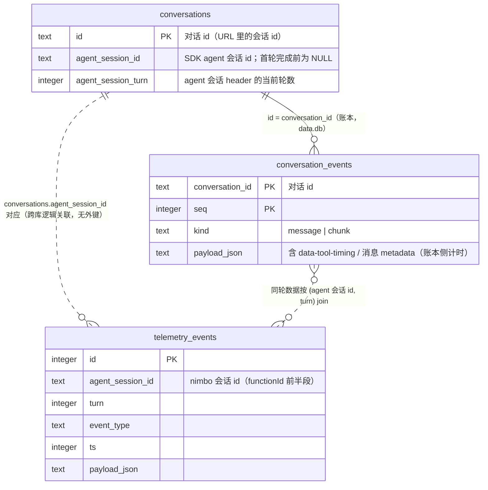

# 遥测（Telemetry）— 技术方案

> 相关：[产品与使用手册](../features/telemetry.md) · [施工进展](../plans/chat-observability.md)（遥测属「chat 可观测性」拆单）· 依赖 [tech/chat-webapp](./chat-webapp.md)（§11 可观测性总览、注入落位）· [tech/single-ledger](./single-ledger.md)（账本侧计时数据 `data-tool-timing` 与消息 metadata 的定义）
> 术语：[遥测（telemetry）](../terms.md)。本页讲怎么存、有效期、怎么用；产品行为与数据清单见产品文档。

## 1. 方案总览

ai@7 把 telemetry 转正为**纯回调的事件集成接口**（`Telemetry`，`experimental_telemetry` 已废弃）——无 OpenTelemetry 依赖，无 collector/exporter，实现一个带生命周期回调的对象即可。nimbo 的接入分三层：

1. **core 注入口**：`SessionOptions.telemetry`（`SessionTelemetry`，loop.ts）透传集成对象到每次 `streamText`；不注入时零开销。loop 恒在 `telemetry.functionId` 注入 **`"<nimbo 会话 id>#<turn>"` 关联键**——ai 的 `InferTelemetryEvent` 把 TelemetryOptions 字段并进每个事件，因此所有事件天然自带此键。
2. **工具事件补发**：nimbo 的工具由 loop 自己结算（[tech/single-ledger](./single-ledger.md)），AI SDK 自己永远没机会触发 `onToolExecutionStart/End`——core 的 `settleExecution` 在 `executeToolCall` 前后**替它补发**这两个事件（`loop.ts` 的 `notifyToolExecution*`，事件形状用 ai 导出的 widened 联合类型构造）。deny/未知工具/畸形调用从未执行，不发。
3. **server 落库**：`apps/node-server/src/telemetry.ts` 的 `createSqliteTelemetry(store)` 把每个事件写成一行 SQLite；生产装配是惰性单例（`getChatTelemetry`/`getChatTelemetryStore`），经 `ChatRouteDeps` 注入默认 chatApp（写侧 `telemetry` + 读侧 `telemetryStore` 两个口，测试可分别注入假件）。

三条硬纪律：

- **遥测永不影响 turn**：每个回调整体 try/catch 吞错，写库失败最多丢一行遥测。
- **产品功能不得依赖遥测**（依赖方向单向）：账本是统计弹窗概览/卡片的数据源，遥测只服务统计弹窗明细；`TELEMETRY_DISABLED=1` 后产品零损失。
- **正文不落盘**：载荷收敛（§2.3）+ 注入侧关死 `recordInputs`/`recordOutputs` 双保险。

## 2. 怎么存

### 2.1 存储形态：独立 `telemetry.db`

独立于聊天库 `data.db` 的 SQLite 文件（缺省 `apps/node-server/telemetry.db`，`TELEMETRY_DB_PATH` 覆盖），WAL 模式。**表结构自管**（启动时 `CREATE TABLE IF NOT EXISTS`），刻意不进 drizzle 迁移链——遥测是耗材（§3），schema 演化的兜底手段是删库重建，不背迁移债。

```sql
CREATE TABLE IF NOT EXISTS telemetry_events (
  id           INTEGER PRIMARY KEY AUTOINCREMENT,
  agent_session_id   TEXT,      -- functionId 前半段：nimbo 会话 id（非 chat 行 id！见 §2.2）
  turn         INTEGER,   -- functionId 后半段
  event_type   TEXT NOT NULL,   -- start / step-start / model-call-start / model-call-end / tool-execution-* / step-end / end / abort / error
  ts           INTEGER NOT NULL,   -- 落库时刻（epoch ms）
  payload_json TEXT NOT NULL      -- 收敛后的事件 JSON（§2.3）
);
CREATE INDEX IF NOT EXISTS telemetry_events_session_turn
  ON telemetry_events (agent_session_id, turn);
```

### 2.2 数据领域与关联

遥测键的是 **nimbo 会话 id**（core `SessionState.id`），不是 chat 行 id——chat 行经 `agent_session_id` 列（首轮优雅收尾时由 `finalizeTurnPersistence` 写入的会话 header）映射过去。查询端点做这一次翻译；会话尚无 header（首轮未完成/中途崩溃）时按「无数据」处理。



### 2.3 载荷收敛（写入即净化）

`curatePayload()` 三道闸，按序生效：

1. **删除键**（`DROPPED_KEYS`）：`functionId`（已拆列）、`recordInputs`/`recordOutputs`（随事件并入的选项噪音）——直接去掉。
2. **摘要键**（`OMITTED_KEYS`）：`messages`/`content`/`prompt`/`system`/`steps`/`request`/`response`/`text`/`reasoning` 等大块正文——替换为体量摘要（`[omitted: N items|chars]`），保留「有多大」的线索、丢原文。
3. **总长封顶**：收敛后仍超 16KB → 整体降级为 `{truncated: true, approximateLength}`；序列化本身抛错（循环引用等）→ `{serializationError}`。

补发的工具事件在源头就配合这一策略：`messages` 字段（"发起该调用的上下文"）置空数组，不为遥测多留一份账本引用。

## 3. 有效期

**定位：耗材（无持久承诺），当前不自动清理。** 具体含义：

- **系统不承诺存续**：允许随时手动清空、允许 `TELEMETRY_DISABLED=1` 整体关闭、允许版本升级时因 schema 演化直接重建——所有消费方（统计弹窗、API）都按「数据可能缺席」设计，空数据是正常态不是错误。
- **当前没有自动清理**：没有任何代码会删 `telemetry_events` 行——不主动清就一直在。手动管理的两个姿势：
  - 整库清空：停服后删 `telemetry.db`（连同 `-wal`/`-shm`），下次启动自动重建；
  - 按时间裁剪：`DELETE FROM telemetry_events WHERE ts < <epoch_ms>;` 后接 `VACUUM;` 回收空间。
- **若未来需要自动保留期**（例如「只留 30 天」）：加一个启动时/定时的按 `ts` 删除即可，属一次小工单——记录在案，暂不做（本地单人开发场景数据量增长有限，YAGNI）。

## 4. 怎么用

### 4.1 写入与读取链路

```mermaid
sequenceDiagram
    autonumber
    participant Loop as core loop（runTurn/settleExecution）
    participant AI as ai streamText
    participant Int as SQLite 集成（createSqliteTelemetry）
    participant DB as telemetry.db
    participant Web as web TurnStatsButton
    participant API as GET .../turns/{turn}/telemetry

    Note over Loop,DB: 写入（turn 进行中，全程同步、吞错）
    Loop->>AI: streamText({ telemetry: { functionId: "<会话id>#<turn>", integrations } })
    AI->>Int: onStart / onStepStart / onLanguageModelCallStart|End / onStepEnd / onEnd
    Int->>DB: INSERT（拆 functionId → agent_session_id, turn；curatePayload）
    Loop->>Int: onToolExecutionStart|End（settleExecution 补发，deny 不发）
    Int->>DB: INSERT（同上）

    Note over Web,DB: 读取（用户点开统计弹窗，按需拉取）
    Web->>API: 首次打开弹窗才请求（组件内缓存）
    API->>API: 鉴权 + getChatSession → 取 agent_session_id（NULL → 空数组）
    API->>DB: TelemetryStore.list(agentSessionId, turn)
    DB-->>Web: events[]（payloadJson 前端零星 safeParse，坏行静默跳过）
```

### 4.2 三个消费入口

- **统计弹窗**：`TurnStatsButton`（`components/turn-stats-dialog.tsx`）挂在完成轮的 assistant 回复末尾，点开弹窗——概览来自消息 metadata（耗时/工具/agent/usage），有 `conversationId`/`turn` 时再拉遥测明细：渲染 `model-call-end`（modelId / finishReason / responseTimeMs / timeToFirstOutputMs / 输入输出吞吐 / usage 三分含 cacheReadTokens·reasoningTokens）与 `tool-execution-end`（toolName / toolExecutionMs / 失败标记）两组行。
- **API**：`GET /api/chat/conversations/{id}/turns/{turn}/telemetry`（openapi.yml 已含）——`{ events: [{ eventType, ts, payloadJson }] }`，payloadJson 原样透传字符串，服务端不做二次建模（形状随 ai 小版本演化，深度建模只会先碎在服务端）。
- **SQL**：
  ```sql
  -- 某轮全部事件（agent_session_id 用 conversations.agent_session_id 翻译）
  SELECT event_type, ts, payload_json FROM telemetry_events
   WHERE agent_session_id = ? AND turn = ? ORDER BY id;
  -- 最慢的 20 次模型调用（跨会话，运维排障）
  SELECT agent_session_id, turn, json_extract(payload_json, '$.performance.responseTimeMs') AS ms
    FROM telemetry_events WHERE event_type = 'model-call-end' ORDER BY ms DESC LIMIT 20;
  ```

### 4.3 配置面

| 环境变量 | 作用 | 缺省 |
|---|---|---|
| `TELEMETRY_DISABLED=1` | 整体关闭（不建库、不采集、端点恒空数组） | 开启 |
| `TELEMETRY_DB_PATH` | 库文件位置 | `telemetry.db`（server 进程 cwd） |

另有一道隐式守卫：vitest 环境（`VITEST` 存在）且未显式给 `TELEMETRY_DB_PATH` 时自动关闭——默认 chatApp 在模块顶层求值，没有它，任何 import 路由的测试都会在仓库里落一个 telemetry.db。

## 5. 关键接口

- `SessionTelemetry`（`@nimbo/core`，loop.ts）：`{ integrations: Telemetry[]; recordInputs?; recordOutputs? }`——SDK 门面原样透传（`@nimbo/sdk` 的 `createSession` 直接收 `CoreSessionOptions`）。
- `TelemetryStore`（`apps/node-server/src/telemetry.ts`）：`record(eventType, functionId, event)` / `list(agentSessionId, turn)` / `close()`——写读同一抽象，测试用 `createTelemetryStore(':memory:')`。
- functionId 约定：`"<nimbo 会话 id>#<turn>"`，`parseFunctionId` 按**最后一个** `#` 切分（防会话 id 含 `#`），不合形状时 turn 置 NULL、原文落 agent_session_id。

## 6. 取舍与已知限制

1. **API 新鲜度**：ai@7 的 telemetry 刚转正（7.0.20），字段仍可能小版本漂移——防御是「payload 整体 JSON + 消费端零星 `safeParse` + 坏行静默跳过」，而不是深度建模。
2. **工具事件是补发的**：`toolExecutionMs` 由 loop 自测（`executeToolCall` 前后 `Date.now()`），与账本 `data-tool-timing` 的执行区间同源同刻但独立记录；两者数值理论一致，权威口径以账本为准（产品数据）。
3. **单进程本地文件**：多实例部署时各写各的 telemetry.db，无汇聚——当前单进程场景够用，需要集中式再议（届时 `Telemetry` 集成换个后端即可，接口不变）。
4. **首轮未完成的会话查不到**：`agent_session_id` 在首轮优雅收尾才写入，此前端点返回空数组（数据其实已按 nimbo 会话 id 落库，只是缺翻译键）——可接受的边界，统计按钮本就只出现在完成轮上，无 `turn` 键时弹窗只出概览、不拉明细。
5. **turn 内时序**：`ts` 是落库时刻、`id` 单调递增，同轮内按 `id` 排序即事件顺序；跨轮/跨会话比较用各事件 payload 里的业务时间字段。
